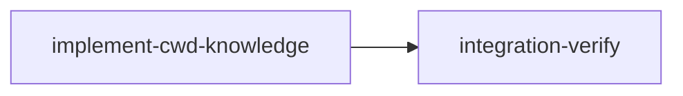

# Plan: Make Knowledge Commands Write to CWD Instead of Main Repo

## Context

Currently, all `loom knowledge` commands (`show`, `update`, `init`, `list`, `check`, `gc`, `map`) resolve
the knowledge directory via `WorkDir::main_project_root()`, which follows the `.work` symlink in worktrees
back to the main repository root. This means:

- **knowledge-bootstrap** runs in main repo, writes directly to `doc/loom/knowledge/` (uncommitted)
- **integration-verify** runs in a worktree but writes to the **main repo's** knowledge files, bypassing
  worktree isolation
- **standard stages** read knowledge from the main repo via the same symlink-following path

This violates the worktree isolation model. integration-verify reaches outside its worktree to mutate
shared state. Knowledge changes have no git history. There's no merge commit to review or revert.

**Proposed change:** Knowledge commands resolve `doc/loom/knowledge/` relative to the current working
directory (`project_root()`) instead of following symlinks to the main repo (`main_project_root()`).

**Consequences:**

- knowledge-bootstrap: Still runs in main repo (no worktree), now MUST commit its knowledge file changes
  so that standard stages' worktrees (branched off main after knowledge-bootstrap completes) include the
  knowledge content.
- integration-verify: Writes knowledge to its worktree's `doc/loom/knowledge/`, which merges back to main
  with the rest of the stage's branch — like every other file change.
- standard stages: Read knowledge from their worktree copy (which already contains the committed knowledge
  from knowledge-bootstrap). No behavioral change.

## Goals

- Replace `main_project_root()` with `project_root()` in all knowledge-related commands
- Update knowledge stage signal to require commits (remove "NO COMMITS REQUIRED")
- Remove knowledge stage bypass from commit-guard hook
- Update tests to verify the new behavior

## Execution Diagram



Single implementation stage — all changes touch independent files with no overlap.

---

## Stages

### 1. Implement CWD Knowledge Resolution

**Purpose:** Replace `main_project_root()` with `project_root()` in all knowledge command paths, update the
knowledge stage signal to require commits, and remove the knowledge stage bypass from commit-guard.

**Dependencies:** none (knowledge files already populated, knowledge-bootstrap skipped)

**Model:** sonnet (all changes are mechanical pattern replacements with explicit instructions)

**Tasks — Subagent 1 (Path Resolution):**

All 6 files follow the same pattern. Replace every occurrence of:

```rust
let main_project_root = work_dir
    .main_project_root()
    .context("Could not determine main project root")?;
let knowledge = KnowledgeDir::new(main_project_root);
```

with:

```rust
let project_root = work_dir
    .project_root()
    .context("Could not determine project root")?;
let knowledge = KnowledgeDir::new(project_root);
```

Note: `project_root()` returns `Option<&Path>`, while `main_project_root()` returns `Option<PathBuf>`.
Callers that need `PathBuf` will need `.to_path_buf()`. Callers that pass by reference won't need changes
beyond the method call. Check each call site.

**Files to modify:**

1. `loom/src/commands/knowledge/mod.rs` — 4 functions: `show()` (line 13-16), `update()` (line 71-74),
   `init()` (line 96-99), `list()` (line 124-127). Each has the same 3-line pattern.

2. `loom/src/commands/knowledge/check.rs` — `check()` function (lines 35-38). Also line 51 where
   `main_project_root` is passed to `analyze_knowledge_completeness()`.

3. `loom/src/commands/knowledge/gc.rs` — `gc()` function (lines 11-14).

4. `loom/src/commands/knowledge/bootstrap.rs` — `resolve_project_root()` function (line 110):
   change `work_dir.main_project_root()` to `work_dir.project_root().map(|p| p.to_path_buf())`.

5. `loom/src/commands/map.rs` — `execute()` function (lines 15-17). Also line 30 where project_root
   is passed to `KnowledgeDir::new()`.

6. **Test update** in `loom/src/commands/knowledge/mod.rs` (lines 306-377):
   `test_knowledge_update_in_worktree_writes_to_main_repo` must be rewritten to verify the **new**
   behavior — knowledge updates from a worktree should write to the **worktree's** `doc/loom/knowledge/`,
   NOT the main repo. Rename test to `test_knowledge_update_in_worktree_writes_to_worktree`.
   The assertions should flip:
   - `worktree_knowledge_dir.exists()` should be TRUE (knowledge dir created in worktree)
   - `main_knowledge_dir.exists()` should be FALSE (NOT written to main repo)
   - Content assertions should check the worktree path, not main repo path

**Tasks — Subagent 2 (Signal + Hook):**

1. `loom/src/orchestrator/signals/cache.rs` — `generate_knowledge_stable_prefix()` (lines 472-580):
   - Line 483: Change `"- **NO COMMITS REQUIRED** - Knowledge stages do NOT require git commits\n"` to
     `"- **COMMITS REQUIRED** - You MUST git add and git commit your knowledge file changes\n"`
   - Line 484: Change `"- **NO MERGING** - Your work stays in doc/loom/knowledge/ directly\n"` to
     `"- **NO MERGING** - Your commits go directly to main (no branch to merge)\n"`
   - In the Completion section (lines 551-556), add a line before `loom stage complete`:
     `"- **Commit knowledge changes**:`git add doc/loom/knowledge/ && git commit -m 'docs(knowledge): populate codebase knowledge'`\n"`
   - Update test `test_knowledge_stable_prefix_contains_required_sections` (lines 679-704):
     - Remove: `assert!(prefix.contains("NO COMMITS REQUIRED"));`
     - Remove: `assert!(prefix.contains("NO MERGING"));`
     - Add: `assert!(prefix.contains("COMMITS REQUIRED"));`
     - Add: `assert!(prefix.contains("git add"));`
     - Add: `assert!(prefix.contains("git commit"));`

2. `hooks/commit-guard.sh` — Remove knowledge stage bypass (lines 452-462):
   Delete or comment out the block:

   ```bash
   # Check if this is a knowledge stage - bypass commit requirement
   # Knowledge stages only update doc/loom/knowledge/ which is shared state
   if is_knowledge_stage "$project_root" "$STAGE_ID"; then
       debug_log "Knowledge stage detected - bypassing commit requirement"
       # Show reminder but don't block
       remind_knowledge_capture "$project_root"
       printf '\n' >&2
       printf '%s\n' "[loom-stop] Knowledge stage '$STAGE_ID' - commit not required" >&2
       printf '%s\n' "Tip: Consider capturing discoveries with 'loom knowledge update'" >&2
       exit 0
   fi
   ```

   Note: The `is_knowledge_stage()` function (lines 75-130) and `KNOWLEDGE_STAGE_PATTERN` constant
   (line 30) can be left in place — they're still useful for the hook to identify knowledge stages for
   other purposes (the knowledge capture reminder uses knowledge dir checks, not the stage type). But the
   early-exit bypass must be removed so knowledge stages get the same commit/complete checks as other stages.

   Also update the comment at lines 71-73 above `is_knowledge_stage()`:
   Change `"Knowledge stages don't require commits"` to `"Knowledge stages now require commits (since knowledge writes go to cwd)"`.
   The function is still used by the hook for debug logging purposes.

**Files:** `loom/src/commands/knowledge/*.rs`, `loom/src/commands/map.rs`,
`loom/src/orchestrator/signals/cache.rs`, `hooks/commit-guard.sh`

**Acceptance:**

- `cargo test -p loom` (all tests pass)
- `cargo clippy -p loom -- -D warnings` (no lint warnings)

**Verification:**

- `test_knowledge_update_in_worktree_writes_to_worktree` passes (new test name)
- `test_knowledge_stable_prefix_contains_required_sections` passes (updated assertions)

---

### 2. Integration Verification

**Purpose:** Verify all changes integrate correctly, tests pass, and the feature behaves as expected.

**Dependencies:** implement-cwd-knowledge

**Tasks:**

_Build & Test:_

- Run full test suite: `cargo test -p loom`
- Run linting: `cargo clippy -p loom -- -D warnings`
- Run formatting check: `cargo fmt -p loom --check`

_Functional Verification:_

- Verify `loom knowledge update` from a worktree writes to the worktree's `doc/loom/knowledge/`
- Verify `loom knowledge show` from a worktree reads from the worktree's copy
- Verify knowledge stable prefix no longer contains "NO COMMITS REQUIRED"
- Verify commit-guard no longer bypasses knowledge stages

_Code Review:_

- Security: No path traversal introduced
- Architecture: No remaining uses of `main_project_root()` in knowledge paths
- Quality: No stubs, no incomplete changes

_Knowledge Distillation:_

- Curate this architectural decision into `doc/loom/knowledge/architecture.md`
- Update `patterns.md` if the knowledge resolution pattern is documented there

_Documentation:_

- Update any references to "knowledge stages don't require commits" in knowledge files

**Acceptance:**

- `cargo test -p loom`
- `cargo clippy -p loom -- -D warnings`
- `cargo build -p loom`

**Verification:**

- `rg -q "main_project_root" loom/src/commands/knowledge/` should find 0 matches
  (except possibly in comments)
- `rg -q "COMMITS REQUIRED" loom/src/orchestrator/signals/cache.rs` succeeds
- commit-guard.sh no longer has early exit for knowledge stages

---

## Key Files

| File | Change |
|------|--------|
| `loom/src/commands/knowledge/mod.rs` | `main_project_root()` → `project_root()` (4 sites + test) |
| `loom/src/commands/knowledge/check.rs` | `main_project_root()` → `project_root()` (2 sites) |
| `loom/src/commands/knowledge/gc.rs` | `main_project_root()` → `project_root()` (1 site) |
| `loom/src/commands/knowledge/bootstrap.rs` | `main_project_root()` → `project_root()` (1 site) |
| `loom/src/commands/map.rs` | `main_project_root()` → `project_root()` (1 site) |
| `loom/src/orchestrator/signals/cache.rs` | Remove "NO COMMITS REQUIRED", add commit instructions |
| `hooks/commit-guard.sh` | Remove knowledge stage bypass |

## Reuse

- `WorkDir::project_root()` already exists at `loom/src/fs/work_dir.rs:233-235`
- `KnowledgeDir::new()` API unchanged — just receives a different root path
- All existing test infrastructure (tempdir, serial_test) reused

## Verification

```bash
# Full test suite
cd loom && cargo test

# Specific knowledge tests
cargo test knowledge -- --nocapture

# Specific signal tests
cargo test knowledge_stable_prefix -- --nocapture

# Verify no remaining main_project_root in knowledge paths
rg "main_project_root" loom/src/commands/knowledge/

# Verify signal content
cargo test test_knowledge_stable_prefix_contains_required_sections -- --nocapture
```

---

<!-- loom METADATA -->

```yaml
loom:
  version: 1
  sandbox:
    enabled: true
    auto_allow: true
    excluded_commands:
      - "loom"
    filesystem:
      deny_read: []
      deny_write: []
      allow_write:
        - "loom/src/**"
        - "hooks/**"
    network:
      allowed_domains: []
      allow_local_binding: false
      allow_unix_sockets: []
  stages:
    - id: implement-cwd-knowledge
      name: "Implement CWD Knowledge Resolution"
      stage_type: standard
      model: "sonnet"
      reasoning_effort: "high"
      description: |
        Replace main_project_root() with project_root() in all knowledge command paths,
        update the knowledge stage signal to require commits, and remove the knowledge
        stage bypass from commit-guard hook.

        Use parallel subagents and skills to maximize performance.

        CONTEXT: Knowledge commands currently follow the .work symlink back to the main
        repo via main_project_root(). This violates worktree isolation — integration-verify
        stages reach outside their worktree to write to main repo knowledge files. The fix
        is simple: use project_root() (which returns the cwd-relative parent of .work)
        instead of main_project_root() (which follows the symlink).

        project_root() returns Option<&Path> (borrowed).
        main_project_root() returns Option<PathBuf> (owned).
        Some call sites may need .to_path_buf() when replacing.

        SUBAGENT FILE ASSIGNMENTS:

          Subagent 1 — Path Resolution (loom-software-engineer):
            Files Owned:
              loom/src/commands/knowledge/mod.rs
              loom/src/commands/knowledge/check.rs
              loom/src/commands/knowledge/gc.rs
              loom/src/commands/knowledge/bootstrap.rs
              loom/src/commands/map.rs
            Files Read-Only:
              loom/src/fs/work_dir.rs (to verify project_root() signature)

            Tasks:
            1. Read loom/src/fs/work_dir.rs:232-235 to confirm project_root() returns Option<&Path>
            2. In loom/src/commands/knowledge/mod.rs, replace all 4 occurrences of:
                 let main_project_root = work_dir
                     .main_project_root()
                     .context("Could not determine main project root")?;
                 let knowledge = KnowledgeDir::new(main_project_root);
               with:
                 let project_root = work_dir
                     .project_root()
                     .context("Could not determine project root")?;
                 let knowledge = KnowledgeDir::new(project_root);
               Functions: show() lines 13-16, update() lines 71-74, init() lines 96-99, list() lines 124-127
               Note: project_root() returns &Path. KnowledgeDir::new() accepts impl Into<PathBuf>.
               &Path implements Into<PathBuf> via to_path_buf(), so this works without explicit conversion.

            3. In loom/src/commands/knowledge/check.rs, lines 35-38:
               Same pattern replacement. Also update line 51 where main_project_root is passed to
               analyze_knowledge_completeness — the variable name changes from main_project_root to
               project_root. check.rs passes the root by reference (&main_project_root), so after
               renaming to project_root it will need .to_path_buf() since project_root is &Path
               and KnowledgeDir::new takes impl Into<PathBuf>. Actually, check.rs line 38 uses
               KnowledgeDir::new(&main_project_root) — check if new() takes a reference or owned.
               Read loom/src/fs/knowledge/dir.rs to check the KnowledgeDir::new() signature.

            4. In loom/src/commands/knowledge/gc.rs, lines 11-14: Same pattern replacement.

            5. In loom/src/commands/knowledge/bootstrap.rs, line 110:
               Change: work_dir.main_project_root()
               To: work_dir.project_root().map(|p| p.to_path_buf())
               (resolve_project_root returns Result<PathBuf>, so we need owned PathBuf)

            6. In loom/src/commands/map.rs, lines 15-17:
               Change: work_dir.main_project_root().context("Could not determine project root")?
               To: work_dir.project_root().context("Could not determine project root")?.to_path_buf()
               Also check line 30: KnowledgeDir::new(&project_root) — may need adjustment.

            7. Update test in loom/src/commands/knowledge/mod.rs (lines 303-377):
               Rename test_knowledge_update_in_worktree_writes_to_main_repo to
               test_knowledge_update_in_worktree_writes_to_worktree.
               Flip the assertions:
               - Line 349-352: assert worktree_knowledge_dir.exists() is TRUE
               - Line 353-356: Remove or invert the assertion about main_knowledge_dir
               - Line 357: Check worktree_knowledge_dir instead of main_knowledge_dir
               - Lines 359-363: update() should still succeed
               - Line 365: Read from worktree_knowledge_dir, not main_knowledge_dir
               - Line 366-369: Content assertions check worktree path
               - Lines 371-374: Remove the assertion that worktree should NOT have knowledge dir

            8. Run: cargo test -p loom -- knowledge --nocapture
               Verify all knowledge tests pass.

          Subagent 2 — Signal + Hook (loom-software-engineer):
            Files Owned:
              loom/src/orchestrator/signals/cache.rs
              hooks/commit-guard.sh
            Files Read-Only: none

            Tasks:
            1. In loom/src/orchestrator/signals/cache.rs, function generate_knowledge_stable_prefix()
               starting at line 472:

               a. Line 483 — change:
                  "- **NO COMMITS REQUIRED** - Knowledge stages do NOT require git commits\n"
                  to:
                  "- **COMMITS REQUIRED** - You MUST `git add doc/loom/knowledge/` and `git commit` before completing\n"

               b. Line 484 — change:
                  "- **NO MERGING** - Your work stays in doc/loom/knowledge/ directly\n"
                  to:
                  "- **NO MERGING** - Your commits go directly to main (no branch to merge)\n"

               c. In the Completion section (around lines 551-554), after the line about
                  "Verify acceptance criteria", add:
                  "- **Commit knowledge changes**: `git add doc/loom/knowledge/ && git commit -m 'docs(knowledge): populate codebase knowledge'`\n"

               d. Update test test_knowledge_stable_prefix_contains_required_sections (lines 679-704):
                  - Remove: assert!(prefix.contains("NO COMMITS REQUIRED"));
                  - Change the "NO MERGING" assertion to check for "NO MERGING" still (it's still present, just with different trailing text). Actually both the old and new text contain "NO MERGING", so the existing assertion on line 686 should still pass. Verify.
                  - Add: assert!(prefix.contains("COMMITS REQUIRED"));
                  - Add: assert!(prefix.contains("git add"));
                  - Add: assert!(prefix.contains("git commit"));

            2. In hooks/commit-guard.sh:

               a. Remove lines 452-462 (the knowledge stage bypass block):
                  Starting from "# Check if this is a knowledge stage"
                  Through the "exit 0" after the tip message.

               b. Update the comment at lines 71-73 (above is_knowledge_stage function):
                  Change: "Knowledge stages don't require commits - they only update doc/loom/knowledge/"
                  To: "Check if current stage is a knowledge stage (used for debug logging)"

            3. Run: cargo test -p loom -- knowledge_stable_prefix --nocapture
               Verify signal tests pass.

        NO FILE OVERLAP between subagents confirmed.

        MEMORY RECORDING (use loom memory ONLY — never loom knowledge, never auto-memory):
        ⛔ NEVER use Claude Code's auto-memory (~/.claude/projects/*/memory/)
        ⛔ NEVER use loom knowledge update (reserved for knowledge-bootstrap/integration-verify)
        Record IMMEDIATELY when these happen — not at stage end:
        - MISTAKE: tried X, failed -> loom memory note "mistake: tried X, failed because Y, fixed by Z"
        - DECISION: chose X over Y -> loom memory decision "chose X" --context "Y was worse because Z"
        - SURPRISE: unexpected behavior -> loom memory note "found: description in file:line"
      dependencies: []
      acceptance:
        - "cargo test -p loom"
        - "cargo clippy -p loom -- -D warnings"
      files:
        - "loom/src/commands/knowledge/**"
        - "loom/src/commands/map.rs"
        - "loom/src/orchestrator/signals/cache.rs"
        - "hooks/commit-guard.sh"
      working_dir: "loom"
      artifacts:
        - "src/commands/knowledge/mod.rs"
        - "src/commands/knowledge/check.rs"
        - "src/orchestrator/signals/cache.rs"
      wiring:
        - source: "src/commands/knowledge/mod.rs"
          pattern: "project_root"
          description: "Knowledge commands use project_root() instead of main_project_root()"
      truths:
        - 'cargo test -p loom -- test_knowledge_update_in_worktree'

    - id: integration-verify
      name: "Integration Verification"
      stage_type: integration-verify
      model: "opus[1m]"
      reasoning_effort: "high"
      description: |
        Final integration verification after all implementation stages complete.

        Use parallel subagents and skills to maximize performance.

        CRITICAL: This stage must verify FUNCTIONAL INTEGRATION, not just tests passing.

        ⛔ NEVER use Claude Code's auto-memory (~/.claude/projects/*/memory/).
        ALL memory/knowledge goes through loom memory and loom knowledge commands.

        CONTEXT GATHERING (FIRST — before any verification):
        0a. Read the plan file from doc/plans/ (check .work/config.toml for source_path)
        0b. Read ALL stage memories: loom memory show --all
        0c. Read doc/loom/knowledge/*.md for architecture context and known mistakes

        ⛔ ZERO TOLERANCE: ALL compiler warnings, linter errors, test failures must be
        FIXED (not suppressed). Nothing is "pre-existing" or "too trivial."

        BUILD & TEST:
        1. cargo test -p loom (full test suite)
        2. cargo clippy -p loom -- -D warnings
        3. cargo fmt -p loom --check
        4. cargo build -p loom

        FUNCTIONAL VERIFICATION (CRITICAL):
        5. Verify NO remaining main_project_root() calls in knowledge command files:
           rg "main_project_root" loom/src/commands/knowledge/
           (should return 0 matches, or only in comments)
        6. Verify the map command also uses project_root:
           rg "main_project_root" loom/src/commands/map.rs
           (should return 0 matches)
        7. Verify knowledge stable prefix contains commit instructions:
           cargo test -p loom -- test_knowledge_stable_prefix_contains_required_sections --nocapture
        8. Verify commit-guard.sh no longer early-exits for knowledge stages:
           rg "bypass commit requirement" hooks/commit-guard.sh
           (should return 0 matches)
        9. Verify the renamed test exists and passes:
           cargo test -p loom -- test_knowledge_update_in_worktree_writes_to_worktree --nocapture

        CODE REVIEW (MANDATORY):
        10. Spawn loom-code-reviewer to verify:
            - No path traversal vulnerabilities introduced
            - project_root() return type handled correctly at each call site
            - No remaining semantic references to "write to main repo" in knowledge code
            - Signal content is consistent (no contradictions between sections)

        KNOWLEDGE DISTILLATION (MANDATORY):
        11. Record own discoveries to loom memory FIRST
        12. Read all stage memories: loom memory show --all
        13. Update doc/loom/knowledge/architecture.md:
            - Update the "StageType Enum" section (line 72) to note that Knowledge stages
              now require commits (remove "no commits" language)
            - Update "KnowledgeDir API" section if relevant
        14. Update doc/loom/knowledge/patterns.md:
            - Update "Knowledge Systems Pattern" (line 80) to reflect that knowledge writes
              go to cwd, not main repo
            - Update "Stage Completion Pattern" (line 82-84) knowledge stage description
        15. Remove any stale knowledge entries about "NO COMMITS" for knowledge stages
      dependencies: ["implement-cwd-knowledge"]
      acceptance:
        - "cargo test -p loom"
        - "cargo clippy -p loom -- -D warnings"
        - "cargo build -p loom"
      files:
        - "doc/loom/knowledge/**"
      working_dir: "loom"
      truths:
        - 'cargo test -p loom -- test_knowledge_update_in_worktree'
      wiring:
        - source: "src/commands/knowledge/mod.rs"
          pattern: "project_root"
          description: "Knowledge commands use project_root() for cwd-relative resolution"
```

<!-- END loom METADATA -->
