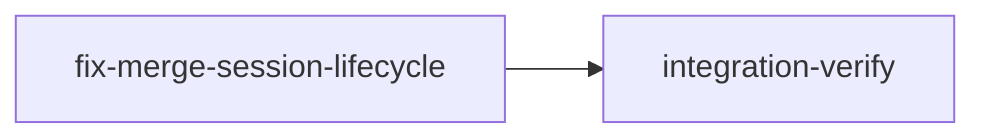

# Plan: Fix Merge Conflict Session Lifecycle

## Overview

When `loom stage complete` encounters a merge conflict during progressive merge, the original Claude Code session **continues running** while a merge resolution session is spawned. This creates two concurrent sessions for the same stage — the original is trapped by commit-guard.sh (which blocks exit for MergeConflict status) and wastes tokens while the resolver tries to work.

## Goals

- Original session exits cleanly when merge conflict is detected
- Daemon actively kills original session before spawning resolver
- Merge resolver signal explains inherited stage responsibilities
- commit-guard.sh allows exit for MergeConflict status

## Root Causes

1. `complete_with_merge()` returns `Ok(false)` on conflict — command exits 0, agent keeps working
2. `commit-guard.sh` treats MergeConflict as `stage_incomplete=1` — blocks session exit
3. Daemon removes stale Stage session from tracking but does NOT kill the process
4. Merge signal doesn't explain that the resolver inherits the stage's responsibilities

## Execution Diagram



Single implementation stage — all 4 file changes are independent (no file overlap, no code dependencies). Knowledge bootstrap skipped (doc/loom/knowledge/ fully populated with >50% coverage).

---

## Stages

### 1. Fix Merge Session Lifecycle

**Purpose:** Implement all 4 coordinated changes to fix the merge conflict session lifecycle.

**Dependencies:** none

**Tasks (4 parallel subagents, no file overlap):**

1. **progressive_complete.rs** — Change `complete_with_merge()` to `bail!()` on merge conflict/blocked instead of returning `Ok(false)`. This makes `loom stage complete` exit non-zero, signaling the agent to stop.

2. **commit-guard.sh** — Move MergeConflict from blocking (`stage_incomplete=1`) to allowing. Remove dead merge-conflict error message branch. The merge resolution is handled by a separate session.

3. **merge_handler.rs** — In `spawn_merge_resolution_sessions()`, actively kill the stale Stage session process before spawning the merge resolver. Currently only removes from tracking.

4. **merge.rs** — Add "Inherited Responsibilities" section to merge signal explaining the resolver now owns the stage and should not re-run acceptance criteria.

**Files:**

- `loom/src/commands/stage/progressive_complete.rs`
- `hooks/commit-guard.sh`
- `loom/src/orchestrator/core/merge_handler.rs`
- `loom/src/orchestrator/signals/merge.rs`

**Acceptance:** `cargo test`, `cargo clippy`, wiring checks for all 4 changes.

---

### 2. Integration Verification

**Purpose:** Verify all changes compile, pass tests, and are functionally wired.

**Dependencies:** fix-merge-session-lifecycle

**Tasks:**

- Full test suite and lint
- Code review (security, architecture)
- Verify `bail!` is reachable in progressive_complete.rs
- Verify commit-guard.sh allows MergeConflict exit
- Verify kill_session called in merge_handler.rs
- Verify merge signal contains inherited responsibilities
- Knowledge distillation

---

<!-- loom METADATA -->

```yaml
loom:
  version: 1
  sandbox:
    enabled: true
    auto_allow: true
    excluded_commands:
      - "loom"
    filesystem:
      deny_read:
        - "~/.ssh/**"
        - "~/.aws/**"
        - "~/.config/gcloud/**"
        - "~/.gnupg/**"
      deny_write:
        - ".work/stages/**"
        - "doc/loom/knowledge/**"
    network:
      allowed_domains: []
  stages:
    - id: fix-merge-session-lifecycle
      name: "Fix Merge Conflict Session Lifecycle"
      stage_type: standard
      model: "sonnet"
      reasoning_effort: "high"
      description: |
        Fix the merge conflict session lifecycle so the original session exits
        cleanly and the merge resolver inherits stage responsibilities.

        Use parallel subagents and skills to maximize performance.

        CONTEXT: When loom stage complete encounters a merge conflict, the original
        Claude Code session continues running while a resolver is spawned. The original
        is trapped by commit-guard.sh (blocks MergeConflict exit) and wastes tokens.
        Four coordinated changes fix this.

        SUBAGENT FILE ASSIGNMENTS:

          Subagent 1 — Progressive Complete (loom-software-engineer):
            Files Owned: loom/src/commands/stage/progressive_complete.rs
            Files Read-Only: loom/src/commands/stage/complete.rs

            Task: In complete_with_merge(), change the combined match arm at lines 192-195
            from returning Ok(false) to bail!() for each variant separately.

            Step 1: Add bail to the anyhow import at line 6:
              Change: use anyhow::{Context, Result};
              To:     use anyhow::{bail, Context, Result};

            Step 2: Replace lines 192-195 (the combined arm):
              Old:
                MergeOutcome::Conflict | MergeOutcome::Blocked => {
                    // Stage already saved in conflict/blocked state
                    Ok(false)
                }
              New (two separate arms):
                MergeOutcome::Conflict => {
                    bail!(
                        "Merge conflict detected for stage '{}'.\n\
                         A resolution session has been spawned to handle the merge.\n\
                         Your work is committed on the stage branch -- this session should exit now.\n\
                         Do NOT attempt to resolve the merge conflict yourself.",
                        stage.id
                    );
                }
                MergeOutcome::Blocked => {
                    bail!(
                        "Merge blocked for stage '{}'.\n\
                         The stage has been marked MergeBlocked.\n\
                         This session should exit now. Fix the issue and run: loom stage retry {}",
                        stage.id,
                        stage.id
                    );
                }

            Why safe: The only caller (complete.rs:623) uses ? to propagate errors.
            The bool return was already discarded. attempt_progressive_merge() callers
            in verify.rs and human_review.rs are unaffected -- they call the inner function.

            Do NOT modify the existing test module at lines 199-330.

          Subagent 2 — Commit Guard Hook (loom-software-engineer):
            Files Owned: hooks/commit-guard.sh
            Files Read-Only: (none)

            Task: Allow session exit when stage is in MergeConflict status.

            Step 1: Update comment at line 420:
              Old: # BLOCK: merge-conflict (needs manual resolution)
              New: # ALLOW: merge-conflict (handled by resolution session)

            Step 2: Replace lines 429-433 (the MergeConflict case in the status check):
              Old:
                merge-conflict | MergeConflict)
                    stage_incomplete=1
                    issues+=("Stage '$STAGE_ID' has MERGE CONFLICT that needs resolution")
                    debug_log "Stage has merge conflict - will block"
                    ;;
              New:
                merge-conflict | MergeConflict)
                    debug_log "Stage has merge conflict - resolution session handles this, allowing stop"
                    ;;

            Step 3: Remove the dead merge-conflict branch in the error message builder.
              Replace lines 532-536 (including the fi on line 536):
                Old:
                  if [[ "$blocking_status" == "merge-conflict" ]] || [[ "$blocking_status" == "MergeConflict" ]]; then
                      message+="\n\n${step_num}. Stage has a MERGE CONFLICT. Resolve it manually:\n   - Check the conflicting files\n   - Resolve conflicts and commit\n   - Run: loom stage complete $STAGE_ID"
                  else
                      message+="\n\n${step_num}. Stage is still in '$blocking_status' status. After committing, run:\n   loom stage complete $STAGE_ID"
                  fi
                New (remove if/else, keep only the general message):
                  message+="\n\n${step_num}. Stage is still in '$blocking_status' status. After committing, run:\n   loom stage complete $STAGE_ID"

            The hook is embedded via include_str! in loom/src/fs/permissions/constants.rs:8.
            No change needed there -- cargo build re-reads the file at compile time.

          Subagent 3 — Merge Handler (loom-software-engineer):
            Files Owned: loom/src/orchestrator/core/merge_handler.rs
            Files Read-Only: loom/src/orchestrator/terminal/mod.rs (for kill_session trait)

            Task: Actively kill the original session process when spawning merge resolver.

            In spawn_merge_resolution_sessions(), replace lines 611-617:
              Old:
                // Either a stale Stage session or a dead Merge session -- clean up
                let stale_session_id = session.id.clone();
                self.active_sessions.remove(&stage_id);
                // Remove the old signal file so it doesn't block respawning
                if let Err(e) = remove_signal(&stale_session_id, &self.config.work_dir) {
                    eprintln!("Warning: Failed to remove stale signal for session '{stale_session_id}': {e}");
                }
              New:
                // Either a stale Stage session or a dead Merge session -- clean up
                let stale_session = self.active_sessions.remove(&stage_id).unwrap();
                let stale_session_id = stale_session.id.clone();
                // Kill the original session to prevent zombie processes.
                // When loom stage complete detected a merge conflict, the Stage session
                // may still be running -- actively terminate it.
                if let Err(e) = self.backend.kill_session(&stale_session) {
                    tracing::debug!(
                        session_id = %stale_session_id,
                        error = %e,
                        "Failed to kill stale session (may already be dead)"
                    );
                }
                // Remove the old signal file so it doesn't block respawning
                if let Err(e) = remove_signal(&stale_session_id, &self.config.work_dir) {
                    eprintln!("Warning: Failed to remove stale signal for session '{stale_session_id}': {e}");
                }

            The .unwrap() is safe: we are inside if self.active_sessions.contains_key(&stage_id)
            at line 602. kill_session is idempotent -- killing a dead process is a no-op.
            Use tracing::debug! (not eprintln!) because failure to kill a dead session is expected.

            BORROW CHECKER NOTE: The variable `session` (from get() at line 603) holds an
            immutable borrow of self.active_sessions. In the new code, `session` is last used
            at line 604/606 (the type/liveness check), so NLL releases the borrow before
            the remove() call at line 612. If the compiler complains, restructure by extracting
            the type check result into a bool before the cleanup block.

            Do NOT modify any other function in the file. Do NOT modify the test module.

          Subagent 4 — Merge Signal (loom-software-engineer):
            Files Owned: loom/src/orchestrator/signals/merge.rs
            Files Read-Only: (none)

            Task: Add "Inherited Responsibilities" section to merge signal content.

            In format_merge_signal_content(), add a new section after line 116 (after the
            closing of the "## Important" section, before the function returns):

              content.push_str("## Inherited Responsibilities\n\n");
              content.push_str(
                  "This resolution session now **owns** this stage. \
                   The original execution session has exited.\n\n",
              );
              content.push_str(
                  "- The original stage's acceptance criteria already passed before the merge conflict\n",
              );
              content.push_str("- Do NOT re-run the original stage's tasks or acceptance criteria\n");
              content.push_str(&format!(
                  "- After resolving: `loom stage merge {} --resolved` marks the stage Completed \
                   and triggers dependents\n",
                  stage.id
              ));
              content.push_str(
                  "- The orchestrator handles plan completion when all stages finish\n",
              );
              content.push_str(
                  "- If this session exits without resolving, the orchestrator will spawn a new resolver\n\n",
              );

            Parser-safe: parse_merge_signal_content only reads Target and Conflicting Files
            sections. The new section creates an ignored map entry. Do NOT modify any other
            function in the file.

        NO FILE OVERLAP between subagents confirmed.

        MEMORY RECORDING (use loom memory ONLY):
        ⛔ NEVER use Claude Code's auto-memory (~/.claude/projects/*/memory/)
        ⛔ NEVER use loom knowledge update (reserved for knowledge-bootstrap/integration-verify)
        - MISTAKE: loom memory note "mistake: ..."
        - DECISION: loom memory decision "..." --context "..."
        - SURPRISE: loom memory note "found: ..."
      dependencies: []
      acceptance:
        - "cd loom && cargo test"
        - "cd loom && cargo clippy -- -D warnings"
        - "cd loom && cargo build"
      files:
        - "loom/src/commands/stage/progressive_complete.rs"
        - "hooks/commit-guard.sh"
        - "loom/src/orchestrator/core/merge_handler.rs"
        - "loom/src/orchestrator/signals/merge.rs"
      working_dir: "."
      wiring:
        - source: "loom/src/commands/stage/progressive_complete.rs"
          pattern: "Merge conflict detected"
          description: "complete_with_merge bails with clear exit message on merge conflict"
        - source: "hooks/commit-guard.sh"
          pattern: "resolution session handles this"
          description: "MergeConflict status allows session exit instead of blocking"
        - source: "loom/src/orchestrator/core/merge_handler.rs"
          pattern: "kill_session"
          description: "Daemon kills stale Stage session before spawning merge resolver"
        - source: "loom/src/orchestrator/signals/merge.rs"
          pattern: "Inherited Responsibilities"
          description: "Merge signal explains resolver owns the stage"

    - id: integration-verify
      name: "Integration Verification"
      stage_type: integration-verify
      model: "opus[1m]"
      reasoning_effort: "high"
      description: |
        Final integration verification for merge conflict session lifecycle fix.

        Use parallel subagents and skills to maximize performance.

        ⛔ NEVER use Claude Code's auto-memory (~/.claude/projects/*/memory/).
        ALL memory/knowledge goes through loom memory and loom knowledge commands.

        CONTEXT GATHERING (FIRST):
        0a. Read the plan file: doc/plans/PLAN-fix-merge-conflict-session.md
            (or check .work/config.toml for source_path)
        0b. Read ALL stage memories: loom memory show --all
        0c. Read doc/loom/knowledge/mistakes.md for context on prior merge issues

        ⛔ ZERO TOLERANCE: ALL compiler warnings, linter errors, test failures must be
        FIXED (not suppressed). Nothing is "pre-existing" or "too trivial."

        BUILD & TEST:
        1. cd loom && cargo test (full suite)
        2. cd loom && cargo clippy -- -D warnings
        3. cd loom && cargo build
        4. cd loom && cargo fmt --check

        CODE REVIEW (MANDATORY):
        5. Spawn PARALLEL loom-code-reviewer subagents:
           - Review loom/src/commands/stage/progressive_complete.rs:
             Verify bail! arms are correct, error messages are clear, no regressions
             in the test module (lines 199-330)
           - Review loom/src/orchestrator/core/merge_handler.rs:
             Verify kill_session call is safe (inside contains_key guard),
             no phantom-merge regressions (the file has extensive phantom-merge prevention)
           - Review hooks/commit-guard.sh:
             Verify MergeConflict now allows exit, no other blocking statuses affected,
             dead code removed cleanly
           - Review loom/src/orchestrator/signals/merge.rs:
             Verify new section doesn't break parse_merge_signal_content parser
        6. Fix ALL issues found by reviewers

        FUNCTIONAL VERIFICATION (MANDATORY):
        7. Verify the 4 changes are wired correctly:
           a. progressive_complete.rs: rg for "bail!" in the MergeOutcome match arms
           b. commit-guard.sh: Verify MergeConflict case does NOT set stage_incomplete
           c. merge_handler.rs: rg for "kill_session" in spawn_merge_resolution_sessions
           d. merge.rs: rg for "Inherited Responsibilities" in format_merge_signal_content
        8. Verify detection.rs still treats MergeConflict session exits as normal
           (not crash) -- read loom/src/orchestrator/monitor/detection.rs:146-162
        9. Verify no other callers of complete_with_merge are broken:
           rg "complete_with_merge" in loom/src/

        KNOWLEDGE DISTILLATION (MANDATORY):
        10. Record own discoveries to loom memory FIRST
        11. Read all stage memories: loom memory show --all
        12. Curate the merge conflict session lifecycle fix as a mistake entry:
            loom knowledge update mistakes with:
            - What happened: original session continued running after merge conflict
            - Why: Ok(false) return + blocking Stop hook + no process kill
            - Prevention: bail! on merge conflict, allow exit, kill stale sessions
            - Fix: 4-part coordinated change
        13. Update patterns.md if the "Merge Anti-Respawn Pattern" section
            (in doc/loom/knowledge/patterns.md) needs updating to reflect the
            new kill behavior

        DOCUMENTATION UPDATE:
        14. Update doc/loom/knowledge/patterns.md "Merge Recovery Flow" section
            if it references the old behavior
        15. Check if architecture.md needs a note about the session lifecycle change
      dependencies: ["fix-merge-session-lifecycle"]
      acceptance:
        - "cd loom && cargo test"
        - "cd loom && cargo clippy -- -D warnings"
        - "cd loom && cargo build"
        - 'rg -qF "Merge conflict detected" loom/src/commands/stage/progressive_complete.rs'
        - 'rg -qF "resolution session handles this" hooks/commit-guard.sh'
        - 'rg -qF "kill_session" loom/src/orchestrator/core/merge_handler.rs'
        - 'rg -qF "Inherited Responsibilities" loom/src/orchestrator/signals/merge.rs'
      files:
        - "loom/src/**/*.rs"
        - "hooks/commit-guard.sh"
        - "doc/loom/knowledge/**"
      working_dir: "."
      wiring:
        - source: "loom/src/commands/stage/progressive_complete.rs"
          pattern: "Merge conflict detected"
          description: "complete_with_merge bails on merge conflict"
        - source: "hooks/commit-guard.sh"
          pattern: "resolution session handles this"
          description: "MergeConflict status allows session exit"
        - source: "loom/src/orchestrator/core/merge_handler.rs"
          pattern: "kill_session"
          description: "Stale session killed before merge resolver spawn"
        - source: "loom/src/orchestrator/signals/merge.rs"
          pattern: "Inherited Responsibilities"
          description: "Merge signal explains resolver owns the stage"
```

<!-- END loom METADATA -->
