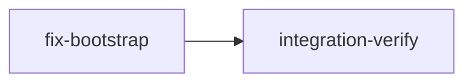

# Plan: Fix Knowledge Bootstrap on macOS

## Overview

The `loom knowledge bootstrap` command currently runs Claude Code in non-interactive mode (`-p` flag with `stdin(Stdio::null())`), which fails to display any terminal UI on macOS. This plan reverts to the interactive child process model where Claude runs in the current terminal with inherited stdio, while preserving the sandbox settings and model default fixes.

## Goals

- Revert bootstrap to interactive mode (stdin inherited, no `-p` flag)
- Restore `--quick` flag for non-interactive mode (opt-in)
- Keep existing sandbox settings, model embedding, and sonnet default
- Ensure it works on macOS

## Non-Goals

- Terminal window spawning (no new window — runs in current terminal)
- Changing the orchestrator's terminal backend

## Execution Diagram



Single implementation stage — all changes are in one file (`bootstrap.rs`) plus the CLI dispatch.

---

## Stages

### 1. Fix Bootstrap Interactive Mode

**Purpose:** Revert `loom knowledge bootstrap` to interactive child process mode.

**Dependencies:** none

**Tasks:**

1. In `bootstrap.rs`:
   - Change `stdin(Stdio::null())` back to `stdin(Stdio::inherit())`
   - Remove the unconditional `-p` flag
   - Re-add `--quick` flag parameter: when `--quick` is passed, add `-p` flag and use `stdin(Stdio::null())`
   - Keep all existing sandbox settings, model embedding, and settings backup/restore
   - Handle exit codes: `130` for Ctrl+C (interactive), `130` or `2` for quick mode
2. In `cli/types_memory.rs`:
   - Re-add `--quick` flag to `KnowledgeCommands::Bootstrap`
3. In `cli/dispatch.rs`:
   - Pass `quick` parameter through to `bootstrap::execute()`
4. Update unit tests if any assert on `-p` behavior

**Files:** `src/commands/knowledge/bootstrap.rs`, `src/cli/types_memory.rs`, `src/cli/dispatch.rs`

**Acceptance:** `cargo test`, `cargo clippy -- -D warnings`, `loom knowledge bootstrap --help` shows `--quick` flag.

---

### 2. Integration Verification

**Purpose:** Verify the fix compiles, passes tests, and the command is callable.

**Dependencies:** fix-bootstrap

**Tasks:**

- Full test suite and linting
- Verify `loom knowledge bootstrap --help` shows `--quick` flag
- Verify the command starts an interactive Claude session (stdin inherited by default)
- Code review for correctness

**Acceptance:** Build passes, `--quick` visible in help, `--help` exit 0.

---

<!-- loom METADATA -->

```yaml
loom:
  version: 1
  stages:
    - id: fix-bootstrap
      name: "Fix Bootstrap Interactive Mode"
      stage_type: standard
      description: |
        Revert loom knowledge bootstrap to interactive child process mode for macOS compatibility.

        Use parallel subagents and skills to maximize performance.

        The current implementation always uses -p (non-interactive) flag with stdin(Stdio::null()),
        which fails to display terminal UI on macOS. Revert to interactive mode as default,
        with --quick as opt-in for non-interactive.

        Changes required:

        1. src/commands/knowledge/bootstrap.rs:
           - Change execute() signature to accept quick: bool parameter
           - Default mode: stdin(Stdio::inherit()), no -p flag (interactive)
           - When quick=true: add -p flag, use stdin(Stdio::null())
           - Keep all sandbox settings, model embedding, settings backup/restore
           - Exit code handling: 130 or 2 for interrupted (both modes)

        2. src/cli/types_memory.rs:
           - Add quick: bool field with #[arg(long)] to Bootstrap variant

        3. src/cli/dispatch.rs:
           - Pass quick parameter to bootstrap::execute()

        4. Update tests in bootstrap.rs if they reference -p behavior

        MEMORY RECORDING (use memory ONLY -- never knowledge):
        - Record mistakes: loom memory note "mistake: ..."
        - Record decisions: loom memory decision "..." --context "..."
      dependencies: []
      acceptance:
        - "cargo test"
        - "cargo clippy -- -D warnings"
        - "cargo build"
        - 'loom knowledge bootstrap --help 2>&1 | rg -q "quick"'
      files:
        - "src/commands/knowledge/bootstrap.rs"
        - "src/cli/types_memory.rs"
        - "src/cli/dispatch.rs"
      working_dir: "loom"
      artifacts:
        - "src/commands/knowledge/bootstrap.rs"
      wiring:
        - source: "src/cli/types_memory.rs"
          pattern: "quick"
          description: "Quick flag is defined in CLI types"
        - source: "src/cli/dispatch.rs"
          pattern: "quick"
          description: "Quick parameter is passed to execute()"
      truths:
        - 'loom knowledge bootstrap --help 2>&1 | rg -q "quick"'

    - id: integration-verify
      name: "Integration Verification"
      stage_type: integration-verify
      description: |
        Final verification after fix-bootstrap completes.

        Use parallel subagents and skills to maximize performance.

        CRITICAL: Verify FUNCTIONAL INTEGRATION, not just tests passing.

        Build/Test Tasks:
        - Full test suite
        - Linting with warnings as errors
        - Build verification

        FUNCTIONAL VERIFICATION (MANDATORY):
        - Verify loom knowledge bootstrap --help shows --quick flag
        - Verify the command can be invoked (--help exits 0)
        - Review the code to confirm stdin is inherited by default (interactive mode)
        - Review that --quick mode uses -p flag and stdin null

        CODE REVIEW (MANDATORY):
        - Spawn review subagents for security and code quality
        - Fix ALL issues found

        KNOWLEDGE CURATION (MANDATORY):
        - Read all stage memory: loom memory show --all
        - Curate valuable insights to knowledge files
      dependencies: ["fix-bootstrap"]
      acceptance:
        - "cargo test"
        - "cargo clippy -- -D warnings"
        - "cargo build"
        - 'loom knowledge bootstrap --help 2>&1 | rg -q "quick"'
      files:
        - "src/**/*.rs"
      working_dir: "loom"
      truths:
        - 'loom knowledge bootstrap --help 2>&1 | rg -q "quick"'
      wiring:
        - source: "src/commands/knowledge/bootstrap.rs"
          pattern: "Stdio::inherit"
          description: "Default mode uses inherited stdin for interactive session"
```

<!-- END loom METADATA -->
