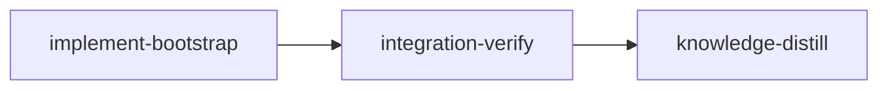

# Plan: Reworked `loom knowledge bootstrap`

## Overview

`loom knowledge bootstrap` was deleted on 2026-08-18 by `36268adc` (the `cli-collapse` stage of
`DONE-PLAN-automatic-knowledge-and-source-graph`). The reason given was that init-time scaffolding
plus an in-plan `knowledge-bootstrap` stage replace it. That holds only for repos that run loom plans.
A repo that is not managed by loom has nothing that fills its knowledge base. It also cannot run
`loom knowledge sync` or `context` until something creates `doc/loom/knowledge/`
(`context/retrieve.rs:84,151`).

This plan brings the command back and builds it on the current knowledge system and source graph:

1. **Deterministic phase (host, no model):** resolve the git root, scaffold the knowledge tree,
   rebuild the catalog and source graph (the same `refresh` that `loom knowledge sync` runs),
   partition the repo's files into directory clusters with per-cluster content digests and
   fan-in hot spots, and print coverage plus the work plan.
2. **Semantic phase (model):** write a work brief under `.loom/work/bootstrap/` and launch an
   interactive Claude session in the repo. The session explores the clusters with `Explore`
   subagents and `loom map`, merges their proposals, and writes ONLY through the `loom knowledge`
   CLI (`Edit`/`Write`/`NotebookEdit` are disallowed). It signals completion with a marker file,
   using the same driver mechanism as `loom pressure`.
3. **Host finalization:** refresh the index and catalog, report check issues, and write a committed
   receipt `doc/loom/knowledge/.bootstrap-receipt.json` with one digest per cluster.
   `--refresh` then briefs the session only on clusters whose digest changed, plus any
   tier-1 files still at their template content.

The command also works inside loom-managed repos. It refuses to run inside a stage session.

## Goals

- `loom knowledge bootstrap [--structural-only] [--refresh] [--dry-run] [--model M] [--effort E]`.
- Bare bootstrap is semantic. `--structural-only` is the explicit no-model mode. `--dry-run`
  prints the plan and the exact `claude` argv without spawning anything.
- Reruns are idempotent and incremental: `--refresh` with no changed cluster, no removed
  cluster and no template-only tier-1 file prints that knowledge is current and spawns nothing.
  That holds before and after the knowledge and receipt are committed, and in a fresh clone.
- One foreground-session driver shared by `pressure` and `bootstrap`. Pressure's behaviour does
  not change, with one exception: a marker that exists when the child has already exited now
  yields `Completed` (see the Marker precedence row). Pressure's argv, dry-run output and exit
  classification are pinned by
  `pressure/tests.rs:162-257,274-282`; nothing tests its spawn path, so the new `session.rs`
  tests are the only coverage for spawn, marker and teardown.
- Non-goals: headless or parallel `claude -p` workers run by loom (a later plan, per the user's
  choice); a `--focus` flag; a SessionStart nudge in repos without knowledge (it would fire in every
  repo on the machine); editing the user's `.gitignore`; dollar-cost estimates (loom has no
  reliable price source, so the estimate is clusters, files and symbols).

## Design decisions (settled)

| Decision | Value | Why |
| --- | --- | --- |
| Session mode | Interactive foreground, inherited TTY | User choice; the old command's shape |
| Session driver | `crate::claude::run_foreground`, extracted from `commands/pressure/spawn.rs:135-196`; it spawns through a private `spawn_retrying_text_busy` (5 attempts, 20 ms on ETXTBSY), a copy of `quota/codex.rs:172-186` | Only existing interactive driver; marker + SIGTERM/SIGKILL teardown already solved. The retry is the settled fix for the fork/exec text-busy race (`mistakes/test-concurrency-and-fixtures.md:43-45`) that the fake-claude test would otherwise hit |
| Marker precedence | When `try_wait` reports the child exited, `run_foreground` checks the marker before returning: marker present gives `Completed` whatever the exit code, absent gives `Exited(status)`. The stale marker is still cleared before the spawn | Today `spawn.rs:158-168` polls the child first, so `touch marker; exit` inside one poll interval returns `Exited` and `:171` deletes the marker; bootstrap would drop a valid receipt. The marker is the session's final action, so it wins. For pressure this turns the same race into a completed round, which is what the marker means |
| Write restriction | `--disallowedTools Edit,Write,NotebookEdit` as ONE comma-joined value, placed before `--append-system-prompt`. Edit, Write and NotebookEdit are denied; Bash can still write files, so the prompt carries the rule too | The flag is variadic (`claude --help`: `<tools...>`); a trailing positional prompt would be swallowed by it |
| Model/effort default | `--model`/`--effort` flag, else `UserConfig::load().stage_model(StageType::Knowledge)` / `stage_reasoning_effort(StageType::Knowledge)` (`user_config/models.rs:89-102`) | Same job as a knowledge stage; no new config key |
| Graph freshness | Bootstrap loads the graph through its own `bootstrap/graph.rs::load_current_graph`, which calls `ensure_snapshot(.., SnapshotPolicy::LocalCurrent)` and bails through a pure `require_snapshot(&SnapshotOutcome)` when `action == SnapshotAction::Unavailable` (`source graph unavailable: <reason>; nothing was spawned and no receipt was written`), before any brief, spawn or receipt. `commands/map.rs` is not edited | `map::load_graph` (`commands/map.rs:217-236`) prints an `Unavailable` outcome and resolves whatever layers exist (`refresh/snapshot.rs:64-96`): a failed overlay yields the stale base, a missing base an empty graph. Map keeps that degradation policy; bootstrap must not certify it |
| Run lock | After `.loom/` hygiene, every mode takes a non-blocking exclusive lock on `repo_root/.loom/work/bootstrap/.lock` with `fs2::FileExt::try_lock_exclusive` (precedent `git/merge/lock.rs:53`) and holds it until `execute` returns; a held lock bails `another loom knowledge bootstrap is already running in <repo_root>` | Two operator runs would otherwise run two sessions and race the receipt. The knowledge-directory lock is NOT held across the session, because the child writes knowledge through `loom knowledge update`; `locked_write` serializes only the receipt write itself |
| CLI export | `BootstrapArgs` lives in `cli/types_memory.rs` and is exported by changing `cli/mod.rs:16` to `pub(crate) use types_memory::{AnnotateArgs, BootstrapArgs};`; the command imports `crate::cli::BootstrapArgs` | `types_memory` is a private module (`cli/mod.rs:9`) and `cli/types.rs:7` re-exports only the command enums, so a `pub` struct there is not nameable from `commands::knowledge` without this line (precedent: `AnnotateArgs`, `commands/knowledge/annotate.rs:3`) |
| Root | `git rev-parse --show-toplevel`; error outside git; error when `git rev-parse --verify HEAD` fails (`loom knowledge bootstrap needs at least one commit`) | The source graph needs git (`loom/src/context/refresh/source_graph/enumerate.rs:33` runs `git ls-tree -r -z HEAD`; with no commit the graph degrades to empty); cwd-relative resolution is a logged mistake (`mistakes/knowledge-cli-invariants.md`, "loom knowledge update: Path Resolution") |
| Stage guard | Bail when `LOOM_STAGE_ID` is set and non-empty (read it the way `commands/hook/target.rs:35` does with `non_empty_env`). The message names the fix for a shell that inherited the variable: `loom knowledge bootstrap is an operator command; inside a stage use loom knowledge update (unset LOOM_STAGE_ID if this shell is not a stage session)` | Operator command; stages use `loom knowledge update`. Every stage session exports `LOOM_STAGE_ID` (`orchestrator/terminal/native/wrapper.rs:340`) and child processes inherit it |
| `.loom/` hygiene | When `git ls-files -z .loom` is empty AND `.loom/.gitignore` is absent AND (`git check-ignore -q .loom/cache` exits non-zero OR `git check-ignore -q .loom/work` exits non-zero), write `.loom/.gitignore` containing `*`. Observed exit codes: fresh repo 1; `.loom/` ignored 0; only `.loom/work` ignored gives 1 for the `.loom/cache` check | Keeps the cache and brief out of `git status` in a repo not managed by loom, without touching the user's `.gitignore` |
| Clusters | Directory recursion: a directory with at most 40 files under it is one cluster; a larger one splits into child directories plus a residual cluster of its direct files; child clusters under 8 files fold back into the residual. Id = repo-relative dir (`.` for root). Paths under `doc/loom/knowledge/` are excluded from facts and clusters: the knowledge tree and its receipt are outputs, not inputs. Digests cover tracked and untracked non-ignored files, so a stray untracked file flips its cluster to changed | Deterministic, explainable, no graph-community algorithm to maintain |
| Knowledge exclusion | `clusters::file_facts` drops every path starting with `KNOWLEDGE_PREFIX` (`doc/loom/knowledge/`) | `EXCLUDED_ROOTS` (`context/refresh/source_graph.rs:75-87`) does not cover it, the enumerator adds untracked files (`enumerate.rs:47-50`), and `LocalCurrent` overlays the dirty tree (`refresh/snapshot.rs:129-144`). Without the filter the session's writes, `INDEX.md` and the receipt change a digest, and `--refresh` never reports current. Recomputing clusters after finalize does not help: the receipt would describe itself |
| Cluster digest | `crate::context::source_graph::body_hash` (`source_graph/mod.rs:92`, `sha256:<hex>`) over sorted `"<path>\t<content_hash>\n"` lines, from `FileEntry.content_hash` (`context/graph_store/mod.rs:53-55`) | The hashes are already persisted, so nothing is recomputed; no new Sha256 code |
| Fan-in | Count of cross-file edges into each file: both endpoints resolve through a node-id-to-path map built once from `graph.files`, and the two paths differ; unresolved endpoints skipped. Top 3 per cluster, fan-in descending then path ascending | No importance ranking exists in `context/` (explorer finding); `graph.node()` is a linear scan (`graph_store/mod.rs:153-155`), too slow per edge on 104,841 edges |
| Receipt | `doc/loom/knowledge/.bootstrap-receipt.json`, committed with the knowledge; written ONLY when the session touched its marker, with `crate::fs::locking::locked_write`; loaded with `crate::fs::safe_read::read_to_string_bounded` (no-follow, 1 MiB cap). When `PLAN-secure-distilled-loom-v2.md`'s receipt stage lands, the file moves under `doc/loom/knowledge/.receipts/v<schema>/` (that plan :47-48) | `catalog.rs:254` walks only `*.md` except `INDEX.md`, so the JSON never enters the catalog or index. Committing it usually makes `--refresh` work across clones: a tracked-but-dirty file's `content_hash` comes from trimmed `git show` output (`layer.rs:243-247`, `git/runner.rs:110`) and eol filters differ per clone; both only cause extra exploration |
| Tier-1 gaps | A tier-1 file whose trimmed content equals the trimmed `templates::default_content(file)` (`fs/knowledge/templates.rs:30`, `KnowledgeFile::all()` at `types.rs:113`) is always in the work set | `--refresh` must not skip a never-populated file |
| `NO_KNOWLEDGE_DIR` | Message becomes `Knowledge directory not found. Run 'loom knowledge bootstrap' (or 'loom init <plan>') to create it.` | The current text points a repo not managed by loom at a plan-only command |
| Cross-plan: CLI files | This plan edits `cli/dispatch.rs`, `cli/types_memory.rs` and `cli/mod.rs`. `PLAN-web-host-graft-followthrough.md` stage `implement-host-and-context` (worker C, :221,228) owns all three and splits `dispatch.rs`; `PLAN-model-router-hooks.md` stage `router-core` owns `cli/dispatch.rs` (:298). Ordering: whichever plan runs second rebases onto the first; the CLI layout is the web-host plan's while it executes. If web-host lands first and moves `dispatch_knowledge`, re-point every `src/cli/dispatch.rs` reference (before/after/wiring/W3 brief) to the file that holds it before running this plan | Web-host's brief `cli-and-gates.md:66-67` already asks it to keep `dispatch_knowledge` (with any `KnowledgeCommands::Bootstrap` arm) in `dispatch.rs`. The router edit adds an arm elsewhere in `dispatch.rs`: merge-conflict risk only |

`PLAN-secure-distilled-loom-v2.md:66` ("ready; omit knowledge bootstrap") is about that plan's own
`knowledge-bootstrap` stage and does not conflict with this command.

> **BLOCKING sibling amendments** (apply to the sibling plans before either runs its CLI or
> bootstrap work; this plan does not edit them):
>
> 1. `PLAN-secure-distilled-loom-v2.md` Code-Surface and Exit-Gate Map, stage 2 row (:522), names
>    `commands/knowledge/bootstrap.rs`. Rust cannot hold both that file and this plan's
>    `commands/knowledge/bootstrap/mod.rs`. Amend the cell to `commands/knowledge/bootstrap/**`,
>    and amend Phase 0 Learning Correctness (:248,254, "make map/bootstrap idempotent") to reuse
>    this plan's command, cluster digest and receipt rather than create a second bootstrap
>    module. v2 is directional with no stage YAML, so nothing in it is an upstream guarantee this
>    plan relies on.
> 2. `briefs/web-host-graft-followthrough/cli-and-gates.md` (worker C, which rewrites
>    `cli/mod.rs` to register `dispatch_memory`/`dispatch_commands`): add "Keep
>    `pub(crate) use types_memory::{AnnotateArgs, BootstrapArgs};` in `cli/mod.rs` when
>    `BootstrapArgs` exists, and keep the `BootstrapArgs` struct and `KnowledgeCommands::Bootstrap`
>    variant in `types_memory.rs`." Without it, a web-host run after this plan can drop the export
>    and break `commands/knowledge/bootstrap/mod.rs`.

## Execution Diagram



## Stages

### Knowledge Bootstrap: omitted

The tier-1 files describe this codebase, and `loom knowledge sync` runs clean. The three stale entries
this plan's exploration turned up were fixed on 2026-09-22 before the plan was written:
`entry-points/context-and-source-graph.md` (map has five views),
`architecture/source-graph.md` (`EXCLUDED_ROOTS`), and the deleted concern
"Bootstrap Settings Backup Risk". Baseline at plan time: `loom knowledge check --strict --baseline
doc/loom/knowledge/check-baseline.txt` reports one new issue: `mistakes/subagent-orchestration.md`
is 421 lines. knowledge-distill owns fixing it.

### 1. implement-bootstrap

This is one stage because every piece depends on another at compile time: the command calls the driver
and the cluster/receipt API. There is no merge-order dependency, no shared file with another stage,
and the whole thing is well under 500,000 tokens. That makes it one stage with two waves:

| Wave | Worker | Role | Tier | Files owned |
| --- | --- | --- | --- | --- |
| 1 | W1 | Shared session driver + pressure rewiring | sonnet | `loom/src/claude.rs`, `loom/src/claude/session.rs`, `loom/src/commands/pressure/{spawn,paths,mod,tests}.rs` |
| 1 | W2 | Cluster partition, digests, fan-in, receipt | sonnet | `loom/src/commands/knowledge/bootstrap/{clusters,receipt,tests_clusters,tests_receipt}.rs` |
| 2 | W3 | Command, prompts, CLI, integration test | opus | `bootstrap/{mod,prompt,graph,tests}.rs`, `knowledge/{mod,sync}.rs`, `cli/{mod,types_memory,dispatch}.rs`, `context/retrieve.rs`, `tests/integration/{mod,knowledge_bootstrap,knowledge_bootstrap_support}.rs`, `completions/dynamic/tests/tests_commands.rs` |

BEFORE wave 1 the main agent writes `bootstrap/mod.rs` (`mod clusters; mod receipt;` plus the
test module declarations in the three-line `#[cfg(test)]` form), the four W2 files
`clusters.rs`, `receipt.rs`, `tests_clusters.rs` and `tests_receipt.rs` with one `//!` doc line
each, and `pub mod bootstrap;` in `knowledge/mod.rs`. That is the foundation step, and it is
under 20 lines. The doc-only files keep every wave-1 compile green; W2 replaces their content.
W3 then owns and grows `bootstrap/mod.rs`. The briefs pin the exact API between waves.

### 2. integration-verify

Full build, test, clippy and fmt. Parallel code reviewers (security: argv construction, the marker path,
the `.loom/.gitignore` write, receipt parsing of committed JSON; architecture: driver reuse and
module sizes; tests: the fake-claude integration test cannot pass vacuously). Functional smoke
in a scratch git repo, with every variable in `tests/integration/helpers.rs::RELAY_ENV_VARS_TO_CLEAR`
(:225-238) unset and a scratch `LOOM_HOME` whose `config.toml` disables update checks:
`--structural-only`, `--dry-run`, and `--refresh --dry-run`. A `wiring_tests` entry runs the
`--structural-only` smoke. The smoke never runs `--refresh` without `--dry-run`: a bare
`--refresh` after `--structural-only` has no receipt and would spawn the real claude.

### 3. knowledge-distill

Curate memories. Document the command, every flag, and committing the receipt in README; add
the tier-2 topic `architecture/knowledge-bootstrap` with a link from `architecture.md`. These
deliverables belong to this stage alone, and its `artifacts:`/`acceptance:` check each one. Fix the oversized `mistakes/subagent-orchestration.md` if it still fails the check, and
ratchet the baseline.

## Pressure-test findings (2026-09-22)

Each finding was checked against the tree. The line says why the rule exists and where the fix is.

**Blockers**

1. Knowledge files enter the source graph, so `--refresh` never reports current (`refresh/source_graph.rs:75-87`, `enumerate.rs:47-50`, `refresh/snapshot.rs:129-144`). Fix: Clusters and Knowledge exclusion rows; W2 `KNOWLEDGE_PREFIX` and test; W3 tests 2 and 3.
2. Stage env leaks into test children and the smoke, and `Command::new(env!("CARGO_BIN_EXE_loom"))` fails the binary spawn guard (`wrapper.rs:340`, `binary_spawn_guard.rs:24-28,44-51`, `helpers.rs:203-249`). Fix: W3 integration test section; FUNCTIONAL SMOKE; Stage guard row; W3 step 1.
3. The completions test pins `bootstrap` as a deleted subcommand (`completions/dynamic/tests/tests_commands.rs:69`). Fix: implement-bootstrap `files:`, W3 ownership, W3 CLI section.
4. W1 made `ensure_marker_dir` and `classify_code` private while forbidding test moves (`pressure/tests.rs:136-152,274-282`). Fix: W1 "Pressure after the move" and test 4.
5. W1's re-export list fails clippy with unused imports (`spawn.rs:102,181`). Fix: W1 `claude.rs` block and New API; W3 wave-1 summary.
6. The foundation declared `mod clusters; mod receipt;` before the files existed (E0583), and brief Proof sections ran the full gate. Fix: FOUNDATION step, stage 1 prose; one Proof command per brief.
7. The brief prescribed the wrong ETXTBSY mitigation (`mistakes/test-concurrency-and-fixtures.md:43-45`, `quota/codex.rs:172`, `spawn.rs:156`). Fix: Session driver row; W1 retry; W3 fake-claude paragraph.

**Ships broken without failing a gate**

1. Scoped test filters pass with zero tests, and no maintainability gate ran (`orchestrator/signals/mod.rs:29-32`, `tests/maintainability/scanner.rs:6-7`). Fix: implement-bootstrap `acceptance:`; W3 50-line helper note.
2. Nothing proved the receipt is withheld when the session does not complete. Fix: W3 test 4.
3. No test ran the real spawn argv, cwd or env (`pressure/tests.rs:240-257`). Fix: Goals bullet; W1 test 5; W3 test 3 `FAKE_ARGS`.
4. Test 3's "changed" assertion could not fail with a 2-file fixture (one cluster `.`). Fix: W3 47-file fixture, `FAKE_LOG` in test 2, brief-line parsing.
5. A missing fake could start a real billed claude (`claude.rs:29-47`). Fix: W3 fixed `PATH`.

**Under-specified**

 1. `load_graph` returns a tuple (`commands/map.rs:217`). Superseded by 42: bootstrap no longer calls it.
 2. `UserConfig::load()` is not a `Result` (`user_config/mod.rs:207`, `models.rs:89,98`). Fix: W3 step 9.
 3. The model-validation pointer found nothing (`cli/types_pressure.rs:36,40`). Fix: W3 CLI section.
 4. Skipping `initialize()` on an existing dir breaks the gap check (`fs/knowledge/dir.rs:96,111-113`). Fix: W3 step 3.
 5. A repo with no commits yields an empty graph (`enumerate.rs:33`). Fix: Root row; W3 step 1 and test 7.
 6. The early exit ignored removed clusters. Fix: W3 step 8.
 7. The brief survived non-completed exits. Fix: W3 step 13.
 8. `atomic_write_locked` needs a held lock (`fs/locking.rs:149-157,264`). Fix: Receipt row; W2 `save`.
 9. Receipt load followed symlinks and had no size cap (`fs/safe_read.rs:75`). Fix: Receipt row; W2 `load`; R1 review list.
10. Fan-in called `graph.node()` per edge, a linear scan (`graph_store/mod.rs:153-155`). Fix: Fan-in row; W2 fan-in note.
11. `symbols` counted the whole-file node (`source_graph/node.rs:13`). Fix: W2 Symbols note.
12. The partition rule was ambiguous about ordering and path handling (`graph_store/mod.rs:108`). Fix: W2 partition rule.
13. `FileEntry` has no path field; wrong enumerator anchor. Fix: W2 read-only context; Root row.
14. The test-builder pointer was vague (`context/resolve.rs:240-241`). Fix: W2 tests.
15. `ClusterStatus` and `RefreshPlan` lacked derives. Fix: W2 receipt API.
16. The digest re-implemented sha256 (`source_graph/mod.rs:92`). Fix: Cluster digest row; W2 digest.
17. W3 unit and refusal tests were missing. Fix: W3 unit tests and tests 5-7.
18. The `.loom/` hygiene check missed an ignored `.loom/work` only. Fix: `.loom/` hygiene row; W3 step 2.
19. knowledge-distill had no acceptance for the README or the tier-2 topic. Fix: knowledge-distill `acceptance:`.
20. No automated smoke ran the command in a scratch repo. Fix: integration-verify `wiring_tests`; stage 2 prose.
21. The write restriction overstated what it blocks (Bash still writes). Fix: Write restriction row.
22. The receipt row overstated cross-clone behaviour (`layer.rs:243-247`, `git/runner.rs:110`). Fix: Receipt row.
23. Removed-cluster wording ignored re-partitioning. Fix: W3 `render_brief` text.
24. Wrong anchors (`cli/types_memory.rs:25`, `catalog.rs:153`, `spawn.rs:49-59`). Fix: W3 brief.

**Cross-plan**

 1. The web-host plan owns `loom/src/cli/**` and splits `dispatch.rs` (`PLAN-web-host-graft-followthrough.md:228`, `cli-and-gates.md:57-65`). Fix: Cross-plan row; one sentence in `cli-and-gates.md`.
 2. `PLAN-model-router-hooks.md` `router-core` also owns `dispatch.rs` (:328), merge-conflict risk only. Fix: Cross-plan row.
 3. `PLAN-secure-distilled-loom-v2.md` plans a receipt root `.receipts/v<schema>/` (:47-48). Fix: Receipt row.

**Second review (2026-09-22)**

 1. `BootstrapArgs` was not nameable from the command (`cli/mod.rs:9,16`). Fix: CLI export row; W3 ownership, `files:`, wiring.
 2. A removal-only change had no end-to-end proof. Fix: W3 test 8 (clusters `a`, `b`, `c`, `.`; delete `c`); pinned `- removed: <id>` brief line.
 3. `map::load_graph` degrades an `Unavailable` snapshot to a stale or empty graph (`commands/map.rs:217-236`). Fix: Graph freshness row; W3 step 5 and `bootstrap/graph.rs`; `map.rs` dropped from W3 and `files:`.
 4. `touch marker; exit` inside one poll returned `Exited` and lost the receipt (`spawn.rs:158-171`). Fix: Marker precedence row; W1 loop and tests 6-7; W3 test 9.
 5. Two concurrent bootstraps raced sessions and the receipt. Fix: Run lock row; W3 step 2 and unit test.
 6. Idempotence was proven only on a dirty tree. Fix: W3 test 10 (commit, then a fresh clone).
 7. An existing dir with one human-written tier-1 file had no test. Fix: W3 unit test.
 8. knowledge-distill deliverables had no artifact and no flag check. Fix: knowledge-distill `artifacts:` and `acceptance:`.
 9. The smoke unset only 4 of the 12 relay variables. Fix: FUNCTIONAL SMOKE and `wiring_tests`.
10. integration-verify did not run the canonical gate (`conventions/git-and-build-workflow.md`). Fix: its `acceptance:`.
11. The sibling plans own the same CLI files and a competing `bootstrap.rs` path. Fix: Cross-plan row; BLOCKING sibling amendments.

---

<!-- loom METADATA -->

```yaml
loom:
  version: 1
  sandbox:
    enabled: true
    auto_allow: true
    filesystem:
      deny_read:
        - "~/.ssh/**"
        - "~/.aws/**"
        - "~/.config/gcloud/**"
        - "~/.gnupg/**"
        - ".loom/work/admin.token"
        - ".loom/work/user.token"
      allow_write:
        - "loom/src/**"
        - "loom/tests/**"
        - "target/**"
        - "loom/target/**"
    network:
      allowed_domains: []
      allow_local_binding: false
      allow_unix_sockets: []
  stages:
    - id: implement-bootstrap
      name: "Implement loom knowledge bootstrap"
      stage_type: standard
      skills: ["loom-rust"]
      description: |
        Re-add `loom knowledge bootstrap` on top of the current knowledge system and
        source graph. The plan prose's "Design decisions (settled)" table is binding;
        YAML is authoritative where prose and YAML differ.
        Use parallel subagents and skills to maximize performance.

        FOUNDATION (main agent, before wave 1, under 20 lines):
          1. Create loom/src/commands/knowledge/bootstrap/mod.rs containing only:
               mod clusters;
               mod receipt;
               #[cfg(test)]
               #[path = "tests_clusters.rs"]
               mod tests_clusters;
               #[cfg(test)]
               #[path = "tests_receipt.rs"]
               mod tests_receipt;
             Use this three-line form, which rustfmt keeps (precedent
             loom/src/commands/knowledge/mod.rs:177-191), not the one-line form.
          2. Also create clusters.rs, receipt.rs, tests_clusters.rs and tests_receipt.rs
             in that directory, each containing only one `//!` module doc line (valid
             Rust, not a stub function). Without them every compile, including W1's
             scoped test run, fails with E0583 until W2 finishes.
          3. Add `pub mod bootstrap;` to loom/src/commands/knowledge/mod.rs next to the
             other module declarations.
          Run `cargo build` once; it must be green before wave 1.

        WAVE 1: spawn W1 and W2 BY AGENT TYPE in ONE message. WAVE 2: after both
        return and the main agent's gate (cargo build, cargo test --lib, cargo clippy
        --all-targets -- -D warnings, cargo fmt --check) is green, spawn W3. Each
        brief runs ONE scoped proof command; the main agent runs the full gate after
        each wave. Territories are DISJOINT. Workers
        NEVER spawn subagents. Each gets the fixed prompt plus
        "Your brief: <path>. Read it in full before anything else."

        | Worker | Role | Tier | Files owned | Shared context | Brief path |
        | ------ | ---- | ---- | ----------- | -------------- | ---------- |
        | W1 | Session driver + pressure rewiring | sonnet | loom/src/claude.rs, loom/src/claude/session.rs, loom/src/commands/pressure/spawn.rs, loom/src/commands/pressure/paths.rs, loom/src/commands/pressure/mod.rs, loom/src/commands/pressure/tests.rs | loom/src/lib.rs (read-only) | doc/plans/briefs/knowledge-bootstrap-command/implement-bootstrap/w1-session-driver.md |
        | W2 | Clusters, digests, fan-in, receipt | sonnet | loom/src/commands/knowledge/bootstrap/clusters.rs, loom/src/commands/knowledge/bootstrap/receipt.rs, loom/src/commands/knowledge/bootstrap/tests_clusters.rs, loom/src/commands/knowledge/bootstrap/tests_receipt.rs | loom/src/context/graph_store/mod.rs (read-only) | doc/plans/briefs/knowledge-bootstrap-command/implement-bootstrap/w2-clusters-receipt.md |
        | W3 | Command, prompts, CLI, integration test | opus | loom/src/commands/knowledge/bootstrap/mod.rs, loom/src/commands/knowledge/bootstrap/prompt.rs, loom/src/commands/knowledge/bootstrap/graph.rs, loom/src/commands/knowledge/bootstrap/tests.rs, loom/src/commands/knowledge/mod.rs, loom/src/commands/knowledge/sync.rs, loom/src/cli/mod.rs, loom/src/cli/types_memory.rs, loom/src/cli/dispatch.rs, loom/src/context/retrieve.rs, loom/tests/integration/mod.rs, loom/tests/integration/knowledge_bootstrap.rs, loom/tests/integration/knowledge_bootstrap_support.rs, loom/src/completions/dynamic/tests/tests_commands.rs | W1/W2 APIs (read-only) | doc/plans/briefs/knowledge-bootstrap-command/implement-bootstrap/w3-command.md |

        W3 is opus because it joins six seams (driver, graph, catalog refresh,
        receipt, CLI, fake-claude integration test) and writes the session prompts.
        CROSS-PLAN: before starting, confirm dispatch_knowledge is still in
        src/cli/dispatch.rs and cli/mod.rs still re-exports AnnotateArgs; if a
        sibling plan moved either, re-point this stage's checks first (see the
        Cross-plan row and BLOCKING sibling amendments in the plan prose).
        W1/W2 are fully specified by their briefs.

        VERIFY (main agent, after wave 2): run every acceptance command below. On a
        failure, re-brief the owning worker type with the failing output; a second
        failure on the same issue escalates one tier (sonnet -> opus -> fable).

        MEMORY: record mistakes/decisions/surprises via loom memory immediately,
        subagents too; NEVER loom knowledge (implementation stage); NEVER Claude Code
        auto-memory. If a knowledge file contradicts the tree:
        loom memory note "stale-knowledge: <file>#<heading> claims X; the tree does Y".
      dependencies: []
      working_dir: "loom"
      files:
        - "loom/src/claude.rs"
        - "loom/src/claude/**"
        - "loom/src/commands/pressure/**"
        - "loom/src/commands/knowledge/**"
        - "loom/src/cli/mod.rs"
        - "loom/src/cli/types_memory.rs"
        - "loom/src/cli/dispatch.rs"
        - "loom/src/context/retrieve.rs"
        - "loom/tests/integration/mod.rs"
        - "loom/tests/integration/knowledge_bootstrap.rs"
        - "loom/tests/integration/knowledge_bootstrap_support.rs"
        - "loom/src/completions/dynamic/tests/tests_commands.rs"
      acceptance:
        - "cargo build"
        - "cargo test --lib"
        - "cargo test --test integration knowledge_bootstrap 2>&1 | rg -q 'test result: ok\\. [1-9][0-9]* passed'"
        - "cargo test --lib claude::session:: 2>&1 | rg -q 'test result: ok\\. [1-9][0-9]* passed'"
        - "cargo test --lib knowledge::bootstrap:: 2>&1 | rg -q 'test result: ok\\. [1-9][0-9]* passed'"
        - "cargo test --test maintainability"
        - "cargo clippy --all-targets -- -D warnings"
        - "cargo fmt --check"
        - 'cargo run --quiet -- knowledge bootstrap --help | rg -q -- "--structural-only"'
      before_stage:
        - command: "! test -f src/claude/session.rs"
          description: "Before: the foreground driver lives only inside pressure"
        - command: '! rg -q "KnowledgeCommands::Bootstrap" src/cli/dispatch.rs'
          description: "Before: no bootstrap subcommand is dispatched"
        - command: 'rg -qF "Run ''loom init'' to create it" src/context/retrieve.rs'
          description: "Before: the missing-knowledge error points only at loom init"
      after_stage:
        - command: "test -f src/claude/session.rs"
          description: "After: the shared foreground driver exists"
        - command: 'rg -q "KnowledgeCommands::Bootstrap" src/cli/dispatch.rs'
          description: "After: bootstrap is dispatched"
        - command: 'rg -qF "loom knowledge bootstrap" src/context/retrieve.rs'
          description: "After: the missing-knowledge error names loom knowledge bootstrap"
      artifacts:
        - "src/claude/session.rs"
        - "src/commands/knowledge/bootstrap/mod.rs"
        - "src/commands/knowledge/bootstrap/clusters.rs"
        - "src/commands/knowledge/bootstrap/receipt.rs"
        - "src/commands/knowledge/bootstrap/prompt.rs"
        - "src/commands/knowledge/bootstrap/graph.rs"
        - "tests/integration/knowledge_bootstrap.rs"
      wiring:
        - source: "src/cli/mod.rs"
          pattern: "types_memory::\\{AnnotateArgs, BootstrapArgs\\}"
          description: "BootstrapArgs exported from the private types_memory module"
        - source: "src/commands/knowledge/bootstrap/mod.rs"
          pattern: "crate::cli::BootstrapArgs"
          description: "the command consumes the exported argument type"
        - source: "src/commands/knowledge/bootstrap/graph.rs"
          pattern: "SnapshotAction::Unavailable"
          description: "bootstrap refuses an unavailable source-graph snapshot"
        - source: "src/commands/knowledge/bootstrap/mod.rs"
          pattern: "acquire_run_lock\\("
          description: "every bootstrap run takes the per-repository run lock"

        - source: "src/cli/dispatch.rs"
          pattern: "KnowledgeCommands::Bootstrap"
          description: "bootstrap dispatched from the knowledge subcommand match"
        - source: "src/commands/pressure/spawn.rs"
          pattern: "crate::claude::run_foreground\\("
          description: "pressure drives Claude through the shared session driver"
        - source: "src/commands/knowledge/bootstrap/mod.rs"
          pattern: "crate::claude::run_foreground\\("
          description: "bootstrap drives Claude through the shared session driver"
        - source: "src/commands/knowledge/bootstrap/mod.rs"
          pattern: "clusters::partition\\("
          description: "bootstrap plans work from the cluster partition"
        - source: "tests/integration/mod.rs"
          pattern: "mod knowledge_bootstrap"
          description: "integration test registered"

    - id: integration-verify
      name: "Integration Verification"
      stage_type: integration-verify
      skills: ["loom-rust", "loom-code-review"]
      description: |
        Final verification of the reworked `loom knowledge bootstrap`. Verify
        FUNCTIONAL INTEGRATION, not just tests passing. NEVER Claude Code auto-memory.
        Use parallel subagents and skills to maximize performance.
        CONTEXT: read doc/plans/PLAN-knowledge-bootstrap-command.md (Design decisions
        table), loom memory show --all, and the INDEX.md sections for
        architecture/knowledge-hierarchy, architecture/source-graph,
        mistakes/test-concurrency-and-fixtures, mistakes/detached-spawn-in-tests.
        BUILD & TEST (zero tolerance; fix ALL warnings/errors): the acceptance list.
        CODE REVIEW: spawn three loom-code-reviewer subagents in ONE message:
          R1 security: the claude argv (variadic --disallowedTools must not swallow
             the positional prompt), marker/brief paths, the .loom/.gitignore write
             conditions, receipt JSON parsing of a committed (untrusted) file, the
             receipt load (Ok(None) only on symlink_metadata NotFound, otherwise
             crate::fs::safe_read::read_to_string_bounded with a 1 MiB cap, so a
             symlinked or oversized receipt is an error), the receipt write
             (crate::fs::locking::locked_write, never atomic_write_locked), the
             LOOM_STAGE_ID guard, the run lock (non-blocking, held for the whole
             run, never the knowledge-directory lock across the session), and
             require_snapshot refusing SnapshotAction::Unavailable before any spawn.
          R2 architecture/maintainability: driver extraction left no duplicate in
             pressure; every file at most 400 lines, every function at most 50; no dead code.
          R3 tests: the fake-claude integration test fails if bootstrap stops
             spawning, stops writing the receipt, or --refresh re-spawns when nothing
             changed; a removal-only change still spawns (test 8); touch-then-exit
             writes the receipt (test 9); refresh is current after commit and in a
             fresh clone (test 10); no test leaves a process behind (exec sleep in
             the fake).
        Fix every finding with a loom-software-engineer subagent (opus if it failed once).
        FUNCTIONAL SMOKE (main agent): in a scratch repo under
        "${TMPDIR:-/tmp}", git init, commit two small .rs files, then run the built
        binary with every tests/integration/helpers.rs RELAY_ENV_VARS_TO_CLEAR
        variable removed and a scratch LOOM_HOME (resolve the manifest path
        before cd-ing into the scratch repo):
          env -u LOOM_SESSION_ID -u LOOM_STAGE_ID -u LOOM_WORK_DIR -u LOOM_WORKTREE_PATH -u LOOM_MAIN_AGENT_PID -u LOOM_SESSION_TYPE -u LOOM_MERGE_SESSION -u LOOM_SCRATCH_DIR -u LOOM_BIN -u LOOM_HOOK_PATH -u LOOM_HOOK_CONTEXT -u LOOM_CONTROL_BROKER LOOM_HOME=<scratch dir containing config.toml with "[update]\ncheck = false"> cargo run --quiet --manifest-path <worktree>/loom/Cargo.toml -- knowledge bootstrap ...
        with --structural-only, then --dry-run, then --refresh --dry-run. NEVER a
        bare --refresh: after --structural-only there is no receipt, so it would
        spawn the real claude. Confirm coverage and cluster lines (no
        doc/loom/knowledge path in the table), doc/loom/knowledge/INDEX.md,
        .loom/.gitignore, and that git status --porcelain lists nothing under
        .loom/. Check the scratch-repo files with Bash `test -f`: the worktree
        file guard blocks the Read tool outside the worktree
        (mistakes/sandbox-and-settings.md:277-281).
        Record discoveries to loom memory for knowledge-distill, including any
        stale knowledge: loom memory note "stale-knowledge: ...".
      dependencies: ["implement-bootstrap"]
      working_dir: "loom"
      acceptance:
        - "cargo build --all-targets"
        - "cargo test --all-targets --no-fail-fast"
        - "cargo clippy --all-targets -- -D warnings"
        - "cargo fmt --check"
        - 'cargo run --quiet -- knowledge --help | rg -q "bootstrap"'
      wiring:
        - source: "src/cli/dispatch.rs"
          pattern: "KnowledgeCommands::Bootstrap"
          description: "bootstrap reachable from the CLI"
      wiring_tests:
        - name: "bootstrap help lists every mode flag"
          command: 'cargo run --quiet -- knowledge bootstrap --help'
          success_criteria:
            exit_code: 0
            stdout_contains: ["--structural-only", "--refresh", "--dry-run", "--model", "--effort"]
        - name: "structural-only bootstrap in a scratch repo"
          command: |-
            d=$(mktemp -d "${TMPDIR:-/tmp}/kb.XXXXXX") && h=$(mktemp -d "${TMPDIR:-/tmp}/kbhome.XXXXXX") && printf '[update]\ncheck = false\n' > "$h/config.toml" && m="$PWD/Cargo.toml" && cd "$d" && git init -q && git config user.email t@t && git config user.name t && printf 'fn a(){}\n' > a.rs && git add a.rs && git commit -qm i && env -u LOOM_SESSION_ID -u LOOM_STAGE_ID -u LOOM_WORK_DIR -u LOOM_WORKTREE_PATH -u LOOM_MAIN_AGENT_PID -u LOOM_SESSION_TYPE -u LOOM_MERGE_SESSION -u LOOM_SCRATCH_DIR -u LOOM_BIN -u LOOM_HOOK_PATH -u LOOM_HOOK_CONTEXT -u LOOM_CONTROL_BROKER LOOM_HOME="$h" cargo run --quiet --manifest-path "$m" -- knowledge bootstrap --structural-only && test -f doc/loom/knowledge/INDEX.md && test -f .loom/.gitignore && ! git status --porcelain | rg -q '\.loom'
          success_criteria:
            exit_code: 0

    - id: knowledge-distill
      name: "Knowledge Distillation"
      stage_type: knowledge-distill
      description: |
        Curate all stage memories into permanent knowledge; update user docs.
        NEVER Claude Code auto-memory.
        SINGLE-AGENT: do NOT spawn subagents; lean on the memories and keep code
        spot-reads narrow.
        START with loom memory pending --group; read the plan and the knowledge
        sections it touches.
        CORRECTIONS FIRST: apply every stale-knowledge: memory in place with
        loom knowledge replace-section <file> "<heading>" "<body>", never with
        loom knowledge update.
        PRE-EXISTING CHECK FAILURE: at plan time loom knowledge check --strict
        --baseline reported mistakes/subagent-orchestration.md at 421 lines (limit
        400). If it still fails, split that topic into two narrower tier-2 topics
        (move whole sections; annotate the new one with --blurb; link it from the
        mistakes.md summary).
        CURATE: add tier-2 topic architecture/knowledge-bootstrap (the deterministic
        phase, the cluster rule and digest, receipt semantics, the session contract,
        --refresh behaviour) with a 2-4 line summary plus link in architecture.md;
        record mistakes and patterns from memory. TIER ROUTING: at most ~40 lines
        inline in tier-1, larger via loom knowledge update <category>/<slug>.
        DOCS (this stage owns them; acceptance checks each): README.md knowledge
        section: a synopsis line `loom knowledge bootstrap [--structural-only]
        [--refresh] [--dry-run] [--model M] [--effort E]`, what each flag does,
        that it serves repos not managed by loom, and that
        doc/loom/knowledge/.bootstrap-receipt.json should be committed.
        RECEIPTS: every memory taken into knowledge gets
        loom memory resolve <id> --outcome promoted|merged|discarded|deferred;
        finish with loom memory pending --strict.
        LAST, if this stage removed structural issues:
        loom knowledge check --write-baseline doc/loom/knowledge/check-baseline.txt
      dependencies: ["integration-verify"]
      working_dir: "."
      acceptance:
        - "loom knowledge check --strict --baseline doc/loom/knowledge/check-baseline.txt"
        - "loom memory pending --strict"
        - 'rg -q -- "knowledge bootstrap.*--structural-only" README.md'
        - 'rg -q -- "knowledge bootstrap.*--refresh" README.md'
        - 'rg -q -- "knowledge bootstrap.*--dry-run" README.md'
        - 'rg -q -- "knowledge bootstrap.*--model" README.md'
        - 'rg -q -- "knowledge bootstrap.*--effort" README.md'
        - 'rg -qF ".bootstrap-receipt.json" README.md'
        - 'rg -q "Receipt|receipt" doc/loom/knowledge/architecture/knowledge-bootstrap.md'
        - 'rg -qF "architecture/knowledge-bootstrap" doc/loom/knowledge/architecture.md'
      artifacts:
        - "README.md"
        - "doc/loom/knowledge/architecture/knowledge-bootstrap.md"
      files: ["doc/loom/knowledge/**", "README.md"]
```

<!-- END loom METADATA -->
