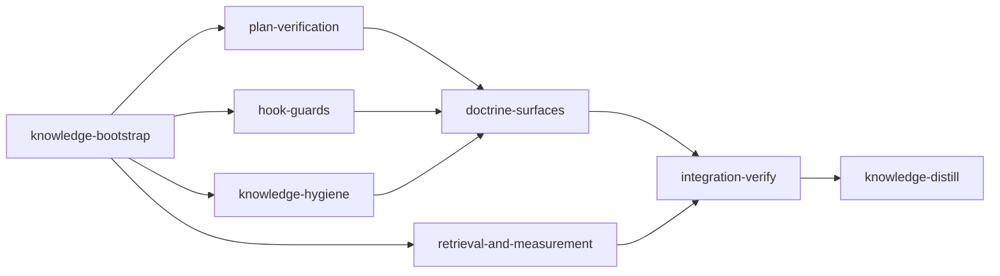

# Plan: loom efficiency and acceptance

## Overview

Three weeks of transcripts (2026-08-28 to 2026-09-18, 77,507 requests) were audited in
`doc/REPORT-loom-improvement-findings-2026-09-18.md`. This plan implements its sections 4.1 to
4.10 under the operator decisions recorded in its section 7. Shared decisions, numbers and
cross-stage contracts live in `doc/plans/briefs/loom-efficiency-and-acceptance/common.md`; every
worker reads it before its own brief.

## Goals

- Acceptance criteria that can fail and can pass: `loom plan verify` lints the logged hazards and
  evaluates grep criteria against the untouched tree; the canonical distill template stops
  shipping four defective criteria; the knowledge gate becomes a ratchet.
- Fewer wasted tokens: knowledge briefs that abstain, skill suggestions that need evidence and
  fire once, a subagent preamble the spawn guard adds, read receipts across a session tree, a
  template that costs each session what that session can use.
- Delegation as a cost decision (tokens times model tier), with subagent tasks sized to finish
  under about 400,000 tokens and never split below what that needs.
- Skills that reach the agents doing the work: a `skills:` stage field, validated, carried into
  the signal and every worker brief.
- Knowledge distillation that starts from a grouped worklist, and a tree whose resolved episodes
  can leave retrieval.
- Measurement: `loom usage` honours its window everywhere and reports peak context by scope.

Non-goals, with reasons:

- No context budget on a stage's main session, and the 80% handoff ceiling stays (operator).
- No model router: typed spawns showed no expensive tier on trivial work and no tier skipping.
- No change to the codex tier table: `gpt-5.6-sol` and `gpt-6-astra` are `loom pressure` models
  (`loom/src/codex.rs:25`), outside the implementer lane.
- No embedding lane: none exists (`loom/src/context/mod.rs:6`); `Semantic:` in a brief header
  reports source-graph freshness.
- No widening of `subagent-verify-guard.sh` and no new polling rule: the guard already covers the
  forms the audit counted, and the residual `ls`/`wc`/`git status` counts include legitimate use.
- No separate worker-brief budget key and no brief for interactive subagents: precision first,
  measure with the new `peaks` section after.
- Bodies of the 24 other oversized skills stay: they cost tokens only when loaded, and 77% were
  never loaded in the window. Their triggers and descriptions are in scope.
- A bounded build/test output command is not built. The `post-tool-use.sh` large-output notice
  covers the behaviour generally; the by-command breakdown needed to design more does not exist.

## Execution diagram



## Observed baseline (HEAD `e481f478`, main checkout, 2026-09-18)

| Command | Result |
| --- | --- |
| `cargo fmt --manifest-path loom/Cargo.toml --check` | exit 0 |
| `cargo clippy --offline --locked --manifest-path loom/Cargo.toml --all-targets -- -D warnings` | exit 0 |
| `cargo test --offline --locked --manifest-path loom/Cargo.toml --lib` | 5110 passed, 0 failed, 1 ignored |
| `bash loom-hooks/tests/run-all.sh` | 77 passed, 0 failed |
| `bash scripts/check-hook-syntax.sh` | exit 0 |
| `loom knowledge check --strict` | exit 1: dangling `resolve-all.sh` source in `mistakes/memory-relay-drain-gap.md`; `mistakes.md` at 263 lines |

The same command forms ran inside stage sandboxes in
`doc/plans/archive/DONE-PLAN-token-optimization-2026-09-13.md`, which is the evidence that they
pass under a stage's sandbox; that plan's `/tmp` scratch-directory pattern is reused with a
`setup` step that creates the directory. Every scoped test filter below matched tests at HEAD
(counts from the library run): `plan::schema` 141, `commands::usage` 99,
`commands::subagents::wait` 31, `fs::knowledge` 137, `commands::knowledge` 97,
`commands::memory` 24, `orchestrator::signals` 193, `context::` 510, `skills::` 73,
`commands::hook` 162, `fs::permissions` 115, `fs::stage_loading` (round-trip tests), `commands::plan` 3,
`commands::skill_index` 10, `assets::` 39.

Every `wiring` pattern and every `rg` criterion in the metadata was run at HEAD and was red (23
patterns). The size, absence and floor criteria were run against HEAD (red) and against hand-built
passing fixtures (green); see "Criterion dry runs" at the end of this prose. The three
`--help` criteria of integration-verify were run against the installed binary and are red
(exit 1 each).

## Stages

### 1. knowledge-bootstrap

The tree is populated, so this stage does no exploration. It clears the two structural issues
that make `loom knowledge check --strict` exit 1 today, so that the distill gate at the end
measures this plan's writes. It also reads the report and `common.md` and corrects, in place,
any knowledge section the report's section 3 shows to be wrong.

### 2. plan-verification

Forced by Q4 (context): criterion lints, base-tree evaluation, a schema field threaded through 18
fixture files, signal and worker-brief changes. Two workers, disjoint files; W1 wires W2's two
check functions by pinned signature.

### 3. retrieval-and-measurement

Forced by Q4. Retrieval ranking is delicate work with its own large test suite (510 tests);
the usage and wait-id changes are small and share no files with it.

### 4. hook-guards

Forced by Q4, and by Q1 for its dependant: the doctrine stage's tests pin the preamble file this
stage creates. Six workers after grouping; five run in parallel on disjoint scripts, the sixth
adds the reported test-runner lines once they return.

### 5. knowledge-hygiene

Forced by Q4, and by Q1 for its dependant: the plan-writer skill documents flags this stage
adds. Two workers; K1 is the only writer of `loom/src/cli/types_memory.rs`.

### 6. doctrine-surfaces

Forced by Q1: it documents and pins what stages 2, 4 and 5 merged (the `skills:` field, the
verify checks, the preamble file, `--baseline`, `pending --group`) and edits other functions of
`signals/cache.rs` after stage 5 changed one. D1 runs first because D2 copies BLOCK-B from it.

### 7. integration-verify, 8. knowledge-distill

Standard bookends. The distill stage uses the installed `loom`, which predates `--baseline`, so
its gate is plain `--strict`; stage 1 makes that gate green at the start.

### After the plan merges (operator)

Run `./dev-install.sh`, then `loom knowledge check --write-baseline
doc/loom/knowledge/check-baseline.txt` and commit the file: the tier-2 size limits add 5 files
and 5 sections to the structural set on this tree. Then `loom knowledge eval` to confirm the new
precision floor, and `loom usage --since 7d` a week later for the `peaks` section.

### Before `loom run`

Commit this plan, `doc/plans/briefs/loom-efficiency-and-acceptance/`, and
`doc/REPORT-loom-improvement-findings-2026-09-18.md` with its data directory. Untracked files are
invisible to every worktree stage.

## Criterion dry runs

| Criterion | At HEAD | Passing fixture |
| --- | --- | --- |
| `test "$(wc -c < CLAUDE.md.template)" -le 20480` | exit 1 (29,677 bytes) | 100-byte file: exit 0 |
| `test "$(wc -c < skills/loom-plan-writer/SKILL.md)" -le 45000` | exit 1 (111,136 bytes) | 100-byte file: exit 0 |
| `rg -qF 'rg -q "## " doc/loom/knowledge' skills/loom-plan-writer/SKILL.md`, expected exit 1 | exit 0, so red | file without the line: exit 1 |
| `rg -q '^tools:.*Task'` on each engineer agent file, expected exit 1 | exit 0 on both, so red | `tools: Read, Edit` line: exit 1 |
| `rg -q '^precision_floor: 0\.[2-9]' loom/eval/retrieval-cases.yaml` | exit 1 (key absent, default 0.0) | `precision_floor: 0.25`: exit 0 |

The numbers 20,480 and 45,000 are targets, not measurements. Basis: the template's
orchestrator-only sections are 17,100 of its 29,677 bytes and about 3,000 bytes of short forms
remain, giving about 15,600; the plan-writer sections that stay in `SKILL.md` (2, 3, 5, 7, the
template and the checklist) are 534 of its 1,182 lines. Both leave more than 20% slack.

---

<!-- loom METADATA -->

```yaml
loom:
  version: 1
  sandbox:
    enabled: true
    auto_allow: true
    allow_unsandboxed_escape: false
    excluded_commands: []
    filesystem:
      deny_read:
        - ~/.ssh/**
        - ~/.aws/**
        - ~/.config/gcloud/**
        - ~/.gnupg/**
        - .loom/work/admin.token
        - .loom/work/user.token
      deny_write:
        - ../../**
      allow_write:
        - loom/src/**
        - loom/tests/**
        - loom/eval/**
        - loom/build/**
        - loom/target/**
        - loom/maintainability-baseline.txt
        - target/**
        - loom-hooks/**
        - agents/**
        - skills/**
        - commands/**
        - CLAUDE.md.template
        - doc/loom/knowledge/**
        - README.md
        - CONTRIBUTING.md
        - CHANGELOG.md
        - /tmp/loom-efficiency-checks
    network:
      allowed_domains: []
      additional_domains: []
      allow_local_binding: false
      allow_unix_sockets: []
      allow_all_unix_sockets: false
    linux:
      enable_weaker_nested: false
    command_confinement: confined
  stages:
    - id: knowledge-bootstrap
      name: "Repair the knowledge gate"
      stage_type: knowledge
      description: |
        The knowledge tree is populated; do not explore the codebase.
        Use parallel subagents and skills to maximize performance.
        1. Read doc/REPORT-loom-improvement-findings-2026-09-18.md sections 3 and 7 and
           doc/plans/briefs/loom-efficiency-and-acceptance/common.md.
        2. loom knowledge check --strict exits 1 on two structural issues. Fix both through the
           loom knowledge CLI, never Write/Edit:
           a. mistakes/memory-relay-drain-gap.md declares a source resolve-all.sh that does not
              exist. Find the real path (rg -n resolve-all loom-hooks scripts loom/src) and
              re-annotate: loom knowledge annotate mistakes/memory-relay-drain-gap
              --clear-sources, then --source <real path> for each source that exists.
           b. mistakes.md is 263 lines against a 250-line limit. Pick its two longest sections,
              move each body to a tier-2 topic with loom knowledge update mistakes/<slug>, then
              shrink the tier-1 section with loom knowledge replace-section mistakes.md
              "<heading>" "<2-4 line summary plus link>". There is no delete-section in the
              installed binary; replace-section is the only way to shrink a section.
        3. Apply the corrections the report's section 3 establishes, where a knowledge section
           states otherwise: there is no embedding lane (Semantic reports source-graph
           freshness); gpt-5.6-sol and gpt-6-astra are loom pressure models. Use
           replace-section and name the wrong claim in the replacement.
        4. Run loom knowledge sync as the last step.
        MEMORY: record decisions and surprises with loom memory note. Never auto-memory.
      dependencies: []
      acceptance:
        - "loom knowledge check --strict"
      files:
        - "doc/loom/knowledge/**"
      working_dir: "."

    - id: plan-verification
      name: "Criterion lints, base-tree evaluation, stage skills field"
      stage_type: standard
      description: |
        Make loom plan verify reject criteria that cannot pass in a sandbox, warn on grep
        criteria that already pass on the untouched tree, and add a validated skills: stage
        field that reaches the stage signal and every worker brief.
        Use parallel subagents and skills to maximize performance.
        Skills for this stage: loom-rust (Skill(skill="loom-skills", args="loom-rust")); name it
        in both spawn prompts.
        Territories below are DISJOINT. Workers NEVER spawn subagents. Spawn both workers BY
        AGENT TYPE in ONE message, each with the fixed prompt plus
        "Your brief: <path>. Read it in full before anything else."
        W1 calls two functions W2 writes; their signatures are pinned in W1's brief, so the tree
        compiles only once both have returned. Do not compile between them.

        | Worker | Role | Tier | Files owned | Shared context | Brief path |
        | ------ | ---- | ---- | ----------- | -------------- | ---------- |
        | W1 | criterion hazard lints, base-tree evaluation, verify output | opus | loom/src/plan/schema/validation.rs, loom/src/plan/schema/validation/acceptance_command.rs, loom/src/plan/schema/validation/criterion_hazards.rs, loom/src/plan/schema/validation/base_tree.rs, loom/src/commands/plan/verify.rs, loom/src/plan/schema/tests/acceptance_tests.rs | loom/src/git/runner.rs, loom/src/models/stage/types.rs | doc/plans/briefs/loom-efficiency-and-acceptance/plan-verification/w1-criterion-checks.md |
        | W2 | skills field, declared-skills check, worker-table checks, signal and worker brief | sonnet | loom/src/plan/schema/types.rs, loom/src/models/stage/types.rs, loom/src/models/stage/methods.rs, loom/src/fs/stage_loading.rs, loom/src/plan/schema/structural_checks.rs, loom/src/plan/schema/structural_checks/declared_skills.rs, loom/src/plan/schema/structural_checks/worker_table.rs, loom/src/orchestrator/signals/generate.rs, loom/src/orchestrator/signals/format/skills.rs, loom/src/commands/hook/worker_brief.rs | loom/src/skills/index.rs, loom/src/skills/index_catalog.rs | doc/plans/briefs/loom-efficiency-and-acceptance/plan-verification/w2-skills-field.md |

        W2 also owns the other files that build a StageDefinition literal: loom/src/plan/amendment.rs,
        loom/src/plan/graph/tests.rs, loom/src/plan/schema/tests/mod.rs,
        loom/src/plan/schema/structural_checks/worker_table_tests.rs,
        loom/src/fs/tests_stage_loading_round_trip.rs, loom/src/git/worktree/base.rs,
        loom/src/commands/init/tests.rs, loom/src/commands/run/tests/mod.rs, and the six files
        under loom/src/orchestrator/core/ that rg -l 'StageDefinition \{' names. W1 owns none.
        After both return: run the gate, fix by re-delegating with the failing output, then the
        mini adversarial review, then commit.
        MEMORY: record mistakes, decisions and surprises with loom memory note immediately;
        subagents too. Never loom knowledge in this stage. Never auto-memory.
      dependencies: ["knowledge-bootstrap"]
      setup:
        - "mkdir -p /tmp/loom-efficiency-checks"
      acceptance:
        - "TMPDIR=/tmp/loom-efficiency-checks cargo build --offline --locked --manifest-path loom/Cargo.toml --all-targets"
        - "TMPDIR=/tmp/loom-efficiency-checks cargo clippy --offline --locked --manifest-path loom/Cargo.toml --all-targets -- -D warnings"
        - "TMPDIR=/tmp/loom-efficiency-checks cargo fmt --manifest-path loom/Cargo.toml --check"
        - "TMPDIR=/tmp/loom-efficiency-checks cargo test --offline --locked --manifest-path loom/Cargo.toml --lib plan::schema"
        - "TMPDIR=/tmp/loom-efficiency-checks cargo test --offline --locked --manifest-path loom/Cargo.toml --lib orchestrator::signals"
        - "TMPDIR=/tmp/loom-efficiency-checks cargo test --offline --locked --manifest-path loom/Cargo.toml --lib commands::hook"
        - "TMPDIR=/tmp/loom-efficiency-checks cargo test --offline --locked --manifest-path loom/Cargo.toml --lib commands::plan"
        - "TMPDIR=/tmp/loom-efficiency-checks cargo test --offline --locked --manifest-path loom/Cargo.toml --lib fs::stage_loading"
        - "TMPDIR=/tmp/loom-efficiency-checks cargo test --offline --locked --manifest-path loom/Cargo.toml --test maintainability"
      files:
        - "loom/src/plan/**"
        - "loom/src/commands/plan/**"
        - "loom/src/models/stage/**"
        - "loom/src/fs/stage_loading.rs"
        - "loom/src/fs/tests_stage_loading_round_trip.rs"
        - "loom/src/git/worktree/base.rs"
        - "loom/src/commands/init/tests.rs"
        - "loom/src/commands/run/tests/mod.rs"
        - "loom/src/orchestrator/core/**"
        - "loom/src/orchestrator/signals/generate.rs"
        - "loom/src/orchestrator/signals/format/skills.rs"
        - "loom/src/commands/hook/worker_brief.rs"
        - "loom/src/commands/hook/worker_brief/**"
      working_dir: "."
      before_stage:
        - command: 'rg -q "criterion_hazards::" loom/src/plan/schema/validation.rs'
          exit_code: 1
          description: "Before: plan validation has no hazard lints"
      after_stage:
        - command: 'rg -q "criterion_hazards::" loom/src/plan/schema/validation.rs'
          exit_code: 0
          description: "After: plan validation calls the hazard lints"
      artifacts:
        - "loom/src/plan/schema/validation/criterion_hazards.rs"
        - "loom/src/plan/schema/validation/base_tree.rs"
        - "loom/src/plan/schema/structural_checks/declared_skills.rs"
      wiring:
        - source: "loom/src/plan/schema/validation.rs"
          pattern: "criterion_hazards::"
          description: "Hazard lints are called from plan validation"
        - source: "loom/src/commands/plan/verify.rs"
          pattern: "base_tree::"
          description: "Base-tree evaluation is called from plan verify"
        - source: "loom/src/plan/schema/validation.rs"
          pattern: "check_declared_skills"
          description: "Declared skills are validated during plan validation"
        - source: "loom/src/plan/schema/validation.rs"
          pattern: "check_worker_granularity"
          description: "Worker granularity warning is part of structural preflight"
        - source: "loom/src/orchestrator/signals/generate.rs"
          pattern: "stage\\.skills"
          description: "Stage signal consumes the declared skills"
        - source: "loom/src/commands/hook/worker_brief.rs"
          pattern: "\\.skills"
          description: "Worker brief carries the declared skills"

    - id: retrieval-and-measurement
      name: "Retrieval precision, brief abstention, usage measurement, named worker ids"
      stage_type: standard
      description: |
        Stop corpus stopwording from dropping the query's own domain words, make the per-prompt
        brief abstain when it has nothing relevant, give the eval a real precision floor; make
        loom usage honour its window in every section and report peak context by scope; let
        loom subagents watch bind named workers.
        Use parallel subagents and skills to maximize performance.
        Skills for this stage: loom-rust (Skill(skill="loom-skills", args="loom-rust")); name it
        in both spawn prompts.
        Territories below are DISJOINT. Workers NEVER spawn subagents. Spawn both workers BY
        AGENT TYPE in ONE message, each with the fixed prompt plus
        "Your brief: <path>. Read it in full before anything else."

        | Worker | Role | Tier | Files owned | Shared context | Brief path |
        | ------ | ---- | ---- | ----------- | -------------- | ---------- |
        | W1 | protected terms, stub chunks, abstention, precision floor | opus | loom/src/context/rank.rs, loom/src/context/rank/corpus.rs, loom/src/context/rank/corpus/stopwords.rs, loom/src/context/lexical_index.rs, loom/src/context/tests, loom/src/commands/hook/user_prompt.rs, loom/src/commands/hook/user_prompt_compose.rs, loom/src/commands/hook/user_prompt_attachments.rs, loom/src/commands/knowledge/eval.rs, loom/src/commands/knowledge/eval/report.rs, loom/src/commands/knowledge/eval/metrics.rs, loom/src/commands/knowledge/eval/cases.rs, loom/src/commands/knowledge/tests_eval.rs, loom/eval/retrieval-cases.yaml | loom/src/context/fuse.rs, loom/src/fs/knowledge/chunker.rs | doc/plans/briefs/loom-efficiency-and-acceptance/retrieval-and-measurement/w1-retrieval.md |
        | W2 | usage window fix, peaks section, named worker ids | sonnet | loom/src/commands/usage/sections/lifecycle.rs, loom/src/commands/usage/sections/agents.rs, loom/src/commands/usage/sections/mod.rs, loom/src/commands/usage/sections/peaks.rs, loom/src/commands/subagents/wait/model.rs, loom/src/commands/subagents/wait/identity.rs, loom/src/commands/subagents/wait/tests.rs | loom/src/commands/usage/transcript.rs, loom/src/models/forward_receipt.rs | doc/plans/briefs/loom-efficiency-and-acceptance/retrieval-and-measurement/w2-usage-and-waits.md |

        W1 sets precision_floor from a measurement (its brief, step 4). If W1 reports that p@5
        did not rise above 0.19, do not complete: spawn a loom-advisor with W1's report.
        After both return: run the gate, fix by re-delegating, mini adversarial review, commit.
        MEMORY: record mistakes, decisions and surprises with loom memory note immediately;
        subagents too. Never loom knowledge in this stage. Never auto-memory.
      dependencies: ["knowledge-bootstrap"]
      setup:
        - "mkdir -p /tmp/loom-efficiency-checks"
      acceptance:
        - "TMPDIR=/tmp/loom-efficiency-checks cargo build --offline --locked --manifest-path loom/Cargo.toml --all-targets"
        - "TMPDIR=/tmp/loom-efficiency-checks cargo clippy --offline --locked --manifest-path loom/Cargo.toml --all-targets -- -D warnings"
        - "TMPDIR=/tmp/loom-efficiency-checks cargo fmt --manifest-path loom/Cargo.toml --check"
        - "TMPDIR=/tmp/loom-efficiency-checks cargo test --offline --locked --manifest-path loom/Cargo.toml --lib context::"
        - "TMPDIR=/tmp/loom-efficiency-checks cargo test --offline --locked --manifest-path loom/Cargo.toml --lib commands::hook"
        - "TMPDIR=/tmp/loom-efficiency-checks cargo test --offline --locked --manifest-path loom/Cargo.toml --lib commands::knowledge"
        - "TMPDIR=/tmp/loom-efficiency-checks cargo test --offline --locked --manifest-path loom/Cargo.toml --lib commands::usage"
        - "TMPDIR=/tmp/loom-efficiency-checks cargo test --offline --locked --manifest-path loom/Cargo.toml --lib commands::subagents::wait"
        - "TMPDIR=/tmp/loom-efficiency-checks cargo test --offline --locked --manifest-path loom/Cargo.toml --test maintainability"
        - 'rg -q "^precision_floor: 0\.[2-9]" loom/eval/retrieval-cases.yaml'
      files:
        - "loom/src/context/**"
        - "loom/src/commands/hook/user_prompt*.rs"
        - "loom/src/commands/knowledge/eval.rs"
        - "loom/src/commands/knowledge/eval/**"
        - "loom/src/commands/knowledge/tests_eval.rs"
        - "loom/src/commands/usage/**"
        - "loom/src/commands/subagents/wait/**"
        - "loom/eval/retrieval-cases.yaml"
      working_dir: "."
      before_stage:
        - command: 'rg -q "peaks::build" loom/src/commands/usage/sections/mod.rs'
          exit_code: 1
          description: "Before: the usage report has no peak-context section"
      after_stage:
        - command: 'rg -q "peaks::build" loom/src/commands/usage/sections/mod.rs'
          exit_code: 0
          description: "After: the usage report builds the peak-context section"
      artifacts:
        - "loom/src/commands/usage/sections/peaks.rs"
      wiring:
        - source: "loom/src/commands/usage/sections/mod.rs"
          pattern: "peaks::build"
          description: "Peak-context section is part of the usage report"
        - source: "loom/src/context/rank/corpus/stopwords.rs"
          pattern: "protected"
          description: "Term partitioning consults the protected-term set"

    - id: hook-guards
      name: "Hook precision: skill trigger, spawn guard preamble, guard false positives, read receipts"
      stage_type: standard
      subagent_timeout_secs: 600
      description: |
        Make skill suggestions need evidence and fire once, have the spawn guard prepend the
        subagent preamble, remove five guard false positives without opening a boundary, add the
        main-agent edit advisory and the large-output notice, and share read receipts across a
        session tree.
        Use parallel subagents and skills to maximize performance.
        Skills for this stage: loom-rust for H1 and H2
        (Skill(skill="loom-skills", args="loom-rust")); name it in their spawn prompts.
        Territories below are DISJOINT. Workers NEVER spawn subagents. Spawn H1 to H5 BY AGENT
        TYPE in ONE message, each with the fixed prompt plus
        "Your brief: <path>. Read it in full before anything else." Spawn H6 (model: haiku) only
        after H3, H4 and H5 have returned, and put their reported run_test lines in its prompt.
        Only H6 edits loom-hooks/tests/run-all.sh. Only H5 edits _read_discipline.sh and
        _read_ledger.sh; H1 to H4 source them through the contract in common.md.

        | Worker | Role | Tier | Files owned | Shared context | Brief path |
        | ------ | ---- | ---- | ----------- | -------------- | ---------- |
        | H1 | skill-trigger matcher and index stopwords | sonnet | loom-hooks/skill-trigger.sh, loom/src/commands/skill_index.rs, loom/tests/integration/hooks_skill_trigger.rs, loom/tests/integration/hooks_skill_trigger_codex.rs | loom/src/commands/hook/user_prompt.rs | doc/plans/briefs/loom-efficiency-and-acceptance/hook-guards/h1-skill-trigger.md |
        | H2 | spawn guard prepends the preamble | opus | loom-hooks/spawn-guard.sh, loom-hooks/_subagent-preamble.txt, loom/src/fs/permissions/constants.rs, loom/src/fs/permissions/tests/hooks_tests.rs, loom/tests/integration/hooks_spawn_guard.rs, loom/tests/integration/hooks_spawn_guard_gate.rs, loom/tests/integration/binary_spawn_guard.rs | CLAUDE.md.template | doc/plans/briefs/loom-efficiency-and-acceptance/hook-guards/h2-spawn-guard.md |
        | H3 | completion guard, file guard, edit advisory | opus | loom-hooks/loom-control-complete.sh, loom-hooks/worktree-file-guard.sh | loom-hooks/_common.sh | doc/plans/briefs/loom-efficiency-and-acceptance/hook-guards/h3-completion-and-file-guards.md |
        | H4 | advisory hooks and large-output notice | sonnet | loom-hooks/no-preexisting-failures.sh, loom-hooks/prefer-modern-tools.sh, loom-hooks/commit-filter.sh, loom-hooks/poll-guard.sh, loom-hooks/post-tool-use.sh, loom-hooks/_post-tool-heartbeat.sh, loom/tests/integration/hooks_no_preexisting_failures.rs | loom-hooks/_common.sh | doc/plans/briefs/loom-efficiency-and-acceptance/hook-guards/h4-advisories.md |
        | H5 | read receipts across a session tree | opus | loom-hooks/_read_ledger.sh, loom-hooks/_read_discipline.sh, loom-hooks/read-guard.sh | loom-hooks/_common.sh | doc/plans/briefs/loom-efficiency-and-acceptance/hook-guards/h5-read-receipts.md |
        | H6 | wire new hook tests into the runner | haiku | loom-hooks/tests/run-all.sh | reports of H3, H4, H5 | doc/plans/briefs/loom-efficiency-and-acceptance/hook-guards/h6-wire-tests.md |

        H3, H4 and H5 each own the test scripts they create under loom-hooks/tests/, named after
        the hook they test; no two of them test the same hook.
        commit-filter.sh stays a hard block on AI attribution; only its message gains a sentence.
        After H6 returns: run the gate, fix by re-delegating, mini adversarial review, commit.
        MEMORY: record mistakes, decisions and surprises with loom memory note immediately;
        subagents too. Never loom knowledge in this stage. Never auto-memory.
      dependencies: ["knowledge-bootstrap"]
      setup:
        - "mkdir -p /tmp/loom-efficiency-checks"
      acceptance:
        - "TMPDIR=/tmp/loom-efficiency-checks cargo build --offline --locked --manifest-path loom/Cargo.toml --all-targets"
        - "TMPDIR=/tmp/loom-efficiency-checks cargo clippy --offline --locked --manifest-path loom/Cargo.toml --all-targets -- -D warnings"
        - "TMPDIR=/tmp/loom-efficiency-checks cargo fmt --manifest-path loom/Cargo.toml --check"
        - "TMPDIR=/tmp/loom-efficiency-checks bash loom-hooks/tests/run-all.sh"
        - "TMPDIR=/tmp/loom-efficiency-checks bash scripts/check-hook-syntax.sh"
        - "TMPDIR=/tmp/loom-efficiency-checks cargo test --offline --locked --manifest-path loom/Cargo.toml --test integration hooks_"
        - "TMPDIR=/tmp/loom-efficiency-checks cargo test --offline --locked --manifest-path loom/Cargo.toml --test integration binary_spawn_guard"
        - "TMPDIR=/tmp/loom-efficiency-checks cargo test --offline --locked --manifest-path loom/Cargo.toml --lib fs::permissions"
        - "TMPDIR=/tmp/loom-efficiency-checks cargo test --offline --locked --manifest-path loom/Cargo.toml --lib commands::skill_index"
      files:
        - "loom-hooks/**"
        - "loom/src/commands/skill_index.rs"
        - "loom/src/fs/permissions/**"
        - "loom/tests/integration/**"
      working_dir: "."
      before_stage:
        - command: 'rg -q "_subagent-preamble\.txt" loom-hooks/spawn-guard.sh'
          exit_code: 1
          description: "Before: the spawn guard does not prepend a preamble"
      after_stage:
        - command: 'rg -q "_subagent-preamble\.txt" loom-hooks/spawn-guard.sh'
          exit_code: 0
          description: "After: the spawn guard reads the preamble file"
      artifacts:
        - "loom-hooks/_subagent-preamble.txt"
      wiring:
        - source: "loom-hooks/spawn-guard.sh"
          pattern: "_subagent-preamble\\.txt"
          description: "Spawn guard reads the preamble file it prepends"
        - source: "loom/src/fs/permissions/constants.rs"
          pattern: "_subagent-preamble\\.txt"
          description: "Preamble file is embedded and installed with the hooks"
        - source: "loom-hooks/skill-trigger.sh"
          pattern: "Background agent"
          description: "Skill trigger skips machine-generated prompts"
        - source: "loom-hooks/_read_discipline.sh"
          pattern: "_shared\\.tsv"
          description: "Sibling-read receipts are recorded for the orchestrator"
        - source: "loom-hooks/post-tool-use.sh"
          pattern: "bigout"
          description: "Large Bash output raises a rate-limited notice"
        - source: "loom-hooks/worktree-file-guard.sh"
          pattern: "scratchpad"
          description: "File guard admits the session scratchpad"

    - id: knowledge-hygiene
      name: "Knowledge check ratchet, catalog rules, memory shape and grouping"
      stage_type: standard
      description: |
        Turn loom knowledge check --strict into a ratchet against a recorded baseline, apply
        size limits to tier-2 files, report cross-file duplicate headings, add section-level
        state and delete-section, validate memory note shape at the CLI, group pending memories,
        and start both distill procedures from that grouping.
        Use parallel subagents and skills to maximize performance.
        Skills for this stage: loom-rust (Skill(skill="loom-skills", args="loom-rust")); name it
        in both spawn prompts.
        Territories below are DISJOINT. Workers NEVER spawn subagents. Spawn both workers BY
        AGENT TYPE in ONE message, each with the fixed prompt plus
        "Your brief: <path>. Read it in full before anything else."
        K1 is the only writer of loom/src/cli/types_memory.rs and adds the group flag K2 reads,
        so the tree compiles only once both have returned.

        | Worker | Role | Tier | Files owned | Shared context | Brief path |
        | ------ | ---- | ---- | ----------- | -------------- | ---------- |
        | K1 | check baseline, tier-2 limits, cross-file headings, section state, delete-section | opus | loom/src/commands/knowledge/check.rs, loom/src/commands/knowledge/mod.rs, loom/src/commands/knowledge/annotate.rs, loom/src/commands/knowledge/tests_check_baseline.rs, loom/src/commands/knowledge/tests_delete_section.rs, loom/src/fs/knowledge/catalog.rs, loom/src/fs/knowledge/catalog, loom/src/fs/knowledge/chunker.rs, loom/src/fs/knowledge/dir.rs, loom/src/fs/knowledge/splice.rs, loom/src/cli/types_memory.rs | loom/src/context/schema/lifecycle.rs, loom/tests/maintainability/baseline.rs | doc/plans/briefs/loom-efficiency-and-acceptance/knowledge-hygiene/k1-check-and-catalog.md |
        | K2 | note shape, pending grouping, distill procedure text | sonnet | loom/src/commands/memory/handlers/record.rs, loom/src/commands/memory/handlers/pending.rs, loom/src/commands/memory/handlers/prefix.rs, loom/src/commands/memory/mod.rs, commands/distill.md, loom/src/orchestrator/signals/cache.rs | loom/src/cli/types_memory.rs | doc/plans/briefs/loom-efficiency-and-acceptance/knowledge-hygiene/k2-memory-and-distill.md |

        K2 edits one function of signals/cache.rs, generate_knowledge_distill_stable_prefix.
        Tests write to temp directories only. Never run the worktree binary against
        doc/loom/knowledge or .loom/work.
        After both return: run the gate, fix by re-delegating, mini adversarial review, commit.
        MEMORY: record mistakes, decisions and surprises with loom memory note immediately;
        subagents too. Never loom knowledge in this stage. Never auto-memory.
      dependencies: ["knowledge-bootstrap"]
      setup:
        - "mkdir -p /tmp/loom-efficiency-checks"
      acceptance:
        - "TMPDIR=/tmp/loom-efficiency-checks cargo build --offline --locked --manifest-path loom/Cargo.toml --all-targets"
        - "TMPDIR=/tmp/loom-efficiency-checks cargo clippy --offline --locked --manifest-path loom/Cargo.toml --all-targets -- -D warnings"
        - "TMPDIR=/tmp/loom-efficiency-checks cargo fmt --manifest-path loom/Cargo.toml --check"
        - "TMPDIR=/tmp/loom-efficiency-checks cargo test --offline --locked --manifest-path loom/Cargo.toml --lib fs::knowledge"
        - "TMPDIR=/tmp/loom-efficiency-checks cargo test --offline --locked --manifest-path loom/Cargo.toml --lib commands::knowledge"
        - "TMPDIR=/tmp/loom-efficiency-checks cargo test --offline --locked --manifest-path loom/Cargo.toml --lib commands::memory"
        - "TMPDIR=/tmp/loom-efficiency-checks cargo test --offline --locked --manifest-path loom/Cargo.toml --lib orchestrator::signals"
        - "TMPDIR=/tmp/loom-efficiency-checks cargo test --offline --locked --manifest-path loom/Cargo.toml --test maintainability"
      files:
        - "loom/src/commands/knowledge/check.rs"
        - "loom/src/commands/knowledge/mod.rs"
        - "loom/src/commands/knowledge/annotate.rs"
        - "loom/src/commands/knowledge/tests.rs"
        - "loom/src/commands/knowledge/tests_check.rs"
        - "loom/src/commands/knowledge/tests_check_evidence.rs"
        - "loom/src/commands/knowledge/tests_annotate.rs"
        - "loom/src/commands/knowledge/tests_replace_section_levels.rs"
        - "loom/src/commands/knowledge/tests_check_baseline.rs"
        - "loom/src/commands/knowledge/tests_delete_section.rs"
        - "loom/src/commands/memory/**"
        - "loom/src/fs/knowledge/**"
        - "loom/src/cli/types_memory.rs"
        - "loom/src/orchestrator/signals/cache.rs"
        - "commands/distill.md"
      working_dir: "."
      before_stage:
        - command: 'rg -q "write_baseline" loom/src/cli/types_memory.rs'
          exit_code: 1
          description: "Before: knowledge check has no baseline flags"
      after_stage:
        - command: 'rg -q "write_baseline" loom/src/cli/types_memory.rs'
          exit_code: 0
          description: "After: knowledge check exposes the baseline flags"
      artifacts:
        - "loom/src/commands/memory/handlers/prefix.rs"
      wiring:
        - source: "loom/src/cli/types_memory.rs"
          pattern: "write_baseline"
          description: "Knowledge check exposes the baseline flags"
        - source: "loom/src/commands/knowledge/mod.rs"
          pattern: "delete_section"
          description: "delete-section is dispatched from the knowledge command"
        - source: "loom/src/commands/memory/handlers/record.rs"
          pattern: "NotePrefix"
          description: "Note recording validates shape through the prefix parser"
        - source: "commands/distill.md"
          pattern: "pending --group"
          description: "The distill command starts from the grouped worklist"
        - source: "loom/src/orchestrator/signals/cache.rs"
          pattern: "pending --group"
          description: "The distill stage signal starts from the grouped worklist"

    - id: doctrine-surfaces
      name: "Role-scoped template, orchestration skill, plan-writer skill, agents and triggers"
      stage_type: standard
      description: |
        Move orchestrator-only text out of CLAUDE.md.template into a loom-orchestration core
        skill and the preamble file the hook stage created, losing nothing; restate delegation as
        the cost rule; repair the plan-writer skill's template criteria and sizing rubric and
        split it; fix agent definitions and skill triggers.
        Use parallel subagents and skills to maximize performance.
        Skills for this stage: loom-documentation for D1 and D2
        (Skill(skill="loom-skills", args="loom-documentation")); name it in their spawn prompts.
        Territories below are DISJOINT. Workers NEVER spawn subagents. Spawn D1 FIRST and alone:
        D2 copies BLOCK-B from the test constant D1 rewrites. When D1 has returned, spawn D2 and
        D3 BY AGENT TYPE in ONE message. Each spawn gets the fixed prompt plus
        "Your brief: <path>. Read it in full before anything else."

        | Worker | Role | Tier | Files owned | Shared context | Brief path |
        | ------ | ---- | ---- | ----------- | -------------- | ---------- |
        | D1 | template, orchestration skill, doctrine pins, signal prose | opus | CLAUDE.md.template, skills/loom-orchestration/SKILL.md, skills/core-skills.txt, loom/src/orchestrator/signals/tests_doctrine.rs, loom/src/orchestrator/signals/tests_doctrine_blocks.rs, loom/src/orchestrator/signals/tests_doctrine_waiting.rs, loom/src/orchestrator/signals/tests_size.rs, loom/src/orchestrator/signals/cache.rs, loom/src/orchestrator/signals/cache/blocks.rs, loom/src/orchestrator/signals/format/sections.rs, loom/src/models/stage/types.rs | loom-hooks/_subagent-preamble.txt, loom-hooks/spawn-guard.sh | doc/plans/briefs/loom-efficiency-and-acceptance/doctrine-surfaces/d1-template-and-orchestration-skill.md |
        | D2 | plan-writer skill: template criteria, rubric, split | opus | skills/loom-plan-writer/SKILL.md, skills/loom-plan-writer/references, loom/src/assets/tests/skill_references.rs | loom/src/orchestrator/signals/tests_doctrine_blocks.rs | doc/plans/briefs/loom-efficiency-and-acceptance/doctrine-surfaces/d2-plan-writer-skill.md |
        | D3 | agent definitions and skill triggers | sonnet | agents/loom-software-engineer.md, agents/loom-senior-software-engineer.md | skills/core-skills.txt | doc/plans/briefs/loom-efficiency-and-acceptance/doctrine-surfaces/d3-agents-and-triggers.md |

        D3 also owns the frontmatter of the skills its brief lists by name; none is
        loom-plan-writer or loom-orchestration. D2 owns the mod line for its new test in the
        assets tests module.
        D1's report must contain the relocation table its brief asks for. Read it: a removed
        paragraph with no destination is a defect to re-delegate, and the review must check it.
        After all three return: run the gate, then render the canonical template from D2's
        SKILL.md into a scratch plan under the TMPDIR directory and confirm it still parses by
        reading it against Section 7's skeleton; fix by re-delegating; mini adversarial review;
        commit.
        MEMORY: record mistakes, decisions and surprises with loom memory note immediately;
        subagents too. Record every knowledge file the new doctrine makes stale as
        loom memory note "stale-knowledge: ...". Never loom knowledge here. Never auto-memory.
      dependencies: ["plan-verification", "hook-guards", "knowledge-hygiene"]
      setup:
        - "mkdir -p /tmp/loom-efficiency-checks"
      acceptance:
        - "TMPDIR=/tmp/loom-efficiency-checks cargo build --offline --locked --manifest-path loom/Cargo.toml --all-targets"
        - "TMPDIR=/tmp/loom-efficiency-checks cargo clippy --offline --locked --manifest-path loom/Cargo.toml --all-targets -- -D warnings"
        - "TMPDIR=/tmp/loom-efficiency-checks cargo fmt --manifest-path loom/Cargo.toml --check"
        - "TMPDIR=/tmp/loom-efficiency-checks cargo test --offline --locked --manifest-path loom/Cargo.toml --lib orchestrator::signals"
        - "TMPDIR=/tmp/loom-efficiency-checks cargo test --offline --locked --manifest-path loom/Cargo.toml --lib skills::"
        - "TMPDIR=/tmp/loom-efficiency-checks cargo test --offline --locked --manifest-path loom/Cargo.toml --lib assets::"
        - "TMPDIR=/tmp/loom-efficiency-checks cargo test --offline --locked --manifest-path loom/Cargo.toml --lib commands::skill_index"
        - 'test "$(wc -c < CLAUDE.md.template)" -le 20480'
        - 'test "$(wc -c < skills/loom-plan-writer/SKILL.md)" -le 45000'
        - command: 'rg -qF ''rg -q "## " doc/loom/knowledge'' skills/loom-plan-writer/SKILL.md'
          exit_code: 1
          description: "The canonical template no longer ships the heading-presence criteria"
        - command: 'rg -q "^tools:.*Task" agents/loom-software-engineer.md'
          exit_code: 1
          description: "The engineer agent no longer holds the Task tool"
        - command: 'rg -q "^tools:.*Task" agents/loom-senior-software-engineer.md'
          exit_code: 1
          description: "The senior engineer agent no longer holds the Task tool"
      files:
        - "CLAUDE.md.template"
        - "skills/**"
        - "agents/**"
        - "loom/src/orchestrator/signals/**"
        - "loom/src/models/stage/types.rs"
        - "loom/src/assets/tests/**"
      working_dir: "."
      before_stage:
        - command: 'rg -q "loom-orchestration" skills/core-skills.txt'
          exit_code: 1
          description: "Before: there is no orchestration skill"
      after_stage:
        - command: 'rg -q "loom-orchestration" skills/core-skills.txt'
          exit_code: 0
          description: "After: the orchestration skill is a core skill"
      artifacts:
        - "skills/loom-orchestration/SKILL.md"
      wiring:
        - source: "skills/core-skills.txt"
          pattern: "loom-orchestration"
          description: "The orchestration skill installs as a core skill"
        - source: "loom/src/orchestrator/signals/cache.rs"
          pattern: "loom-orchestration"
          description: "The stage signal tells the main agent to load the orchestration skill"
        - source: "loom/src/orchestrator/signals/tests_doctrine.rs"
          pattern: "_subagent-preamble\\.txt"
          description: "Doctrine tests pin the blocks in the preamble file"
        - source: "skills/loom-plan-writer/SKILL.md"
          pattern: "check-baseline\\.txt"
          description: "The canonical template uses the ratcheted knowledge gate"

    - id: integration-verify
      name: "Integration verification"
      stage_type: integration-verify
      description: |
        Final verification after all stages. Verify FUNCTIONAL INTEGRATION, not only that tests
        pass. Never auto-memory.
        Use parallel subagents and skills to maximize performance.
        CONTEXT: read this plan, common.md under
        doc/plans/briefs/loom-efficiency-and-acceptance/, loom memory show --all, and the report
        sections 4 and 7. Do not read the whole knowledge tree.
        BUILD AND TEST, zero tolerance: the acceptance list below. Fix every warning and failure
        by delegating to an engineer agent.
        CODE REVIEW: spawn parallel loom-code-reviewer subagents: (1) security of
        loom-control-complete.sh, worktree-file-guard.sh and spawn-guard.sh changes, with
        Skill(skill="loom-skills", args="loom-security-audit"); (2) plan validation and base-tree
        evaluation correctness; (3) retrieval changes against the eval cases; (4) doctrine: every
        paragraph in D1's relocation table has a destination, BLOCK-B is identical on both pinned
        surfaces, and no surface still says the main agent never implements. Fix all findings.
        FUNCTIONAL, using the worktree binary through cargo run, against scratch inputs under the
        TMPDIR directory only: write a scratch plan with one criterion that is green on the
        untouched tree, one with a trailing || true, and one stage declaring skills: [loom-rust,
        no-such-skill]; confirm plan verify reports a baseline warning, a hazard error and an
        unknown-skill error. Write a scratch knowledge directory with one oversized tier-2 file;
        confirm check --strict fails, --write-baseline records it, and --strict --baseline
        passes. Pipe a prompt starting with a teammate-message tag into skill-trigger.sh and
        confirm no output.
        Record discoveries with loom memory note, including any knowledge file the tree now
        contradicts as loom memory note "stale-knowledge: ...".
      dependencies: ["doctrine-surfaces", "retrieval-and-measurement"]
      setup:
        - "mkdir -p /tmp/loom-efficiency-checks"
      acceptance:
        - "TMPDIR=/tmp/loom-efficiency-checks cargo build --offline --locked --manifest-path loom/Cargo.toml --all-targets"
        - "TMPDIR=/tmp/loom-efficiency-checks cargo clippy --offline --locked --manifest-path loom/Cargo.toml --all-targets -- -D warnings"
        - "TMPDIR=/tmp/loom-efficiency-checks cargo fmt --manifest-path loom/Cargo.toml --check"
        - "TMPDIR=/tmp/loom-efficiency-checks cargo test --offline --locked --manifest-path loom/Cargo.toml --all-targets --no-fail-fast"
        - "TMPDIR=/tmp/loom-efficiency-checks bash loom-hooks/tests/run-all.sh"
        - "TMPDIR=/tmp/loom-efficiency-checks bash scripts/check-hook-syntax.sh"
        - 'TMPDIR=/tmp/loom-efficiency-checks cargo run -q --offline --locked --manifest-path loom/Cargo.toml -- knowledge check --help | rg -q -- "--baseline"'
        - 'TMPDIR=/tmp/loom-efficiency-checks cargo run -q --offline --locked --manifest-path loom/Cargo.toml -- knowledge --help | rg -q "delete-section"'
        - 'TMPDIR=/tmp/loom-efficiency-checks cargo run -q --offline --locked --manifest-path loom/Cargo.toml -- memory pending --help | rg -q -- "--group"'
      files:
        - "loom/**"
        - "loom-hooks/**"
        - "skills/**"
        - "agents/**"
        - "commands/**"
        - "CLAUDE.md.template"
      working_dir: "."

    - id: knowledge-distill
      name: "Knowledge distillation"
      stage_type: knowledge-distill
      description: |
        Curate all stage memories into permanent knowledge; update user docs. Never auto-memory.
        SINGLE-AGENT: do not spawn subagents. Memories are compact summaries; lean on them and
        keep code spot-reads narrow.
        Read this plan, loom memory show --all, and doc/loom/knowledge/INDEX.md; open only the
        knowledge sections a memory names.
        CORRECTIONS FIRST: apply every stale-knowledge: memory in place with
        loom knowledge replace-section <file> "<heading>" "<body>", never with
        loom knowledge update, which appends below the stale text. The doctrine stage recorded
        each knowledge section that still says the main agent never implements, or that the
        Rule 5 preamble is pasted by the orchestrator; correct all of them.
        Then curate mistakes as prevention rules, patterns, decisions and conventions with
        loom knowledge update. TIER ROUTING: about 40 lines or fewer goes inline in the tier-1
        file; larger goes to loom knowledge update <category>/<slug> with a 2-4 line tier-1
        summary and link. Record in concerns.md the follow-ups this plan leaves: the knowledge
        check baseline file to generate after install, the bounded build-output command, the
        24 oversized skills.
        Update README.md, CONTRIBUTING.md and CHANGELOG.md for: plan verify checks and the
        skills: field, knowledge check --baseline and delete-section, memory pending --group,
        the usage peaks section, the loom-orchestration skill.
        RECEIPTS: every Note, Decision and Question taken into knowledge gets
        loom memory resolve <id> --outcome promoted|merged|discarded|deferred right after the
        write that used it; finish with loom memory pending --strict and resolve what it lists.
        The installed loom predates --baseline and pending --group; use the plain forms.
      dependencies: ["integration-verify"]
      acceptance:
        - "loom knowledge check --strict"
        - "loom memory pending --strict"
      files:
        - "doc/loom/knowledge/**"
        - "README.md"
        - "CONTRIBUTING.md"
        - "CHANGELOG.md"
      working_dir: "."
```

<!-- END loom METADATA -->
