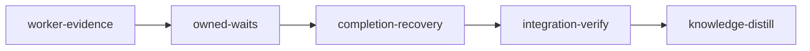

# Plan: Close the Codex-loop report's remaining gaps

Created: 2026-09-12

## Outcome and audit

Complete the open and partial findings in `doc/codex-loop-report-2026-09-10.md`: correlate real worker completion, replace repeated model polling with one owned wait, preserve verified completion failures, and keep recovery, session reasons, handoffs and status consistent. Preserve exact completion authorization and conservative ownership when a writer's disposition is unknown.

Audit baseline: `61847ac9afe57399c123f03fdb9b996e67deeb5f`, 2026-09-12. The audit followed the report, knowledge INDEX and producer-to-consumer paths, then checked ownership and verification contracts. The report itself examined an earlier tree. This plan does not assert that historical runs have been repaired.

| Report item | Status at baseline | Remaining work and owner |
| --- | --- | --- |
| §1: authoritative completion / wrong hook field | Open | worker-evidence W1: worker transcript field, exact identity, installed stop and teammate hooks, terminal outcomes |
| §2: repeated polling / unbound default parent | Partial | owned-waits W1/W2: bind once, explicit worker set, singleton wait, guard and doctrine; current watch already polls internally |
| §3: sccache / exact completion bridge | Partial | completion-recovery W2: confined environment and real replay; launch fix `b2cedf776aaa49e66d39ba6dcfea9a01983fdf7c` already disables unsupported sccache and must remain |
| §3: unsupported completion attempt silently missed | Open | completion-recovery W2: broad detection, narrow exact authorization, durable failure diagnostics |
| §4: disk resumed / graph waiting | Open | completion-recovery W3: legal resume transition, live event and restart convergence |
| §5: stall recovery / context-exhaustion label | Open | completion-recovery W1/W3/W4: independent exit reason, bounded blocker escalation, accurate display |
| §6: incomplete or downgraded handoffs | Partial | completion-recovery W1: semantic exact-session upsert, continuation selection, verified checkpoint retention |
| §7: polling refreshes useful-work heartbeat | Open | owned-waits W2: separate observation and progress through hook, watcher and stall detection |
| Codex lane: wrapper ends before actual job / launch-only model ledger | Partial | worker-evidence W2: exact invocation/job correlation, durable terminal evidence, requested-model attribution |

Grounding anchors: `SubagentStop` in `loom-hooks/subagent-stop.sh`; `classify::has_authoritative_termination`; `render::gather`; `resolve::resolve_subagent_directory`; `STAGE_HOST_ENV_ALLOWLIST`; `sccache_usable_in`; `ExecutionGraph::mark_executing`; `StageResumedExecution`; `take_down_stage_agents`; `find_continuation_handoff`. Symbols and the full owned/read paths are in the worker briefs. Later stages re-read earlier edits directly; source-graph snapshots do not include them.

## Blocking prerequisites and sandbox

**Initialize from a tree containing the completed `doc/plans/PLAN-rename-hooks-dir.md` migration.** The operator moved the source root to `loom-hooks/` on 2026-09-13, followed by source embeds, script/test references, doctrine and active-plan updates. The former root name collided with Claude's protected bare-git paths. The first setup independently requires the renamed root and syntax-script reference. Installed paths remain `~/.claude/hooks/loom/`; no sandbox escape is granted.

The rename sibling's step 3 has been amended to own `scripts/check-hook-syntax.sh` and require `script_dirs` to scan `loom-hooks/`; otherwise its gate could scan only `scripts/` and pass. That amendment is part of the blocking prerequisite. This plan's first setup independently checks the closure. The manual rename itself is not performed by authoring this plan.

Do not run overlapping active plans concurrently. `PLAN-model-router-hooks.md` shares hook registration and `PLAN-strengthen-verification.md` shares verification infrastructure. These drafts are not upstream dependencies. Serialize overlapping runs; if their edits land first, rebase and repeat affected setup/DTO/wire checks. Quota-meter status changes are already in the audited code; that completed plan now lives at `archive/DONE-PLAN-quota-meters.md`.

Use the approved repository protections and Rust/Bun tools. Build downloads are restricted to crates.io and the npm registry domains in YAML. Codex-licensed stages automatically add the existing agent transport hosts `chatgpt.com`, `*.chatgpt.com`, `api.openai.com`, `auth.openai.com`, and the existing Codex/plugin state directories (`loom/src/codex.rs`, `sandbox/settings/policy.rs`). Those are required to execute the requested Sol agents; they are not additional build destinations. Local listeners, host sockets and unsandboxed escape remain disabled. Omitted read-denial fields retain the repository defaults, including credential and runtime token protection.

Before starting a stage, ensure `/tmp/loom-loop-checks` and normal Cargo/Bun cache directories exist. The sandbox grants that short external scratch directory; each test creates a unique child. Gates write only scratch, `loom/target`, `web/node_modules`, `web/dist`, and normal package caches. `web/bun.lock` is frozen. No new dependency or toolchain installation is planned. Knowledge writes are reserved for the final bookend through the knowledge CLI.

## Execution and ownership



Every standard worker and repair unit uses **gpt-5.6-sol / xhigh**, via `loom-codex-forwarder`, foreground Bash timeout **600000 ms**. This explicitly overrides the skill's usual cheaper worker allocation. Stage-level model and effort fields are omitted so the configured orchestrator defaults apply. Codex plugin v1.0.6 was installed and enabled at planning time. If the lane is unavailable at execution, stop with the missing prerequisite; do not silently substitute a different implementation model.

Read [common execution rules](briefs/loop-recovery/common.md) plus the assigned brief. [ownership.json](briefs/loop-recovery/ownership.json) is the complete per-worker write inventory; YAML lists the union. New helper namespaces are exclusive to their owner. Workers do not run git or edit shared runtime state. The orchestrator coordinates, inspects changed-file boundaries, runs gates and handles stage completion. Its implementation work is always delegated. Each stage ends with one serial Sol ledger unit from the common brief, owning only `loom/maintainability-baseline.txt`.

| Stage | Ordered work within its worktree | Why a stage boundary is required |
| --- | --- | --- |
| worker-evidence | W1 lifecycle → W2 Codex → ledger | Q2: the next stage edits classifier/render/ledger consumers; Q3: stale or ambiguous terminal evidence must fail its gate before waits use it |
| owned-waits | W1 wait → W2 progress/doctrine → ledger | Q2: shared monitor and signal files; Q3: prove polling cannot keep a stalled driver alive before recovery relies on progress |
| completion-recovery | W1 checkpoints → W2 bridge + W3 recovery + W4 status in parallel → ledger | Q2: consumes and changes the previous stage's monitor integration; Q4: combining lifecycle, wait coordination, protocol authorization and recovery/UI exceeds one useful review context |

Foundation ordering is within stages, not an extra merge boundary. Parallel workers have disjoint write sets. W1 exports shared checkpoint types before W2/W3/W4 start; W3 consumes that fixed schema, so it need not wait for W2's implementation.

## Verification evidence and limits

The canonical baseline gate passed at the audited HEAD in a real linked Linux worktree under Anthropic sandbox-runtime 0.0.76 with registry-only network, protected hook/git/knowledge paths, no host sockets/listeners, and `TMPDIR=/tmp/loom-loop-checks`. Rust: 4166 library tests passed, with 1 pre-existing ignored test; all integration targets passed, with 5 pre-existing ignored e2e tests. Web: 29 files / 303 tests passed. Build, clippy with warnings denied, fmt, web check/build, 104-script syntax check and all 63 hook cases passed. The worktree belonged to a disposable clone, used a disposable shared Cargo target cache, and did not modify this repository's worktree metadata.

The temporary directory placement matters: a scratch root inside a git checkout makes non-repository fixtures accidentally discover that checkout, and long temp paths exceed tmux test pathname limits. Both harness errors were removed before the green baseline; they are not excluded product failures. Host-dependent live-daemon/tmux behavior is not proved by sandboxed fixtures. Core identity, transport dispatch and state assertions must never skip for lack of host resources.

Baseline receipt: disposable worktree `/tmp/loom-loop-plan-wxo9libz/worktree`, log `/tmp/loom-loop-plan-wxo9libz/tmp/worktree-gates.log`, exit 0. Commands match the YAML gate set, with pre-rename `hooks/` spelling and build-cache environment only. Rust build/clippy/all-target tests also passed after the web build, covering embedded dashboard assets (`embedded-web-gates.log` alongside that log). Vite emits its existing large-chunk advisory; it is not a test/compiler failure and this plan does not suppress it. The baseline does not include live model requests.

New regression targets do not exist at HEAD and are implementation deliverables, not claimed passing tests. Each brief requires production consumers and malformed/negative cases. The standard gate's `--all-targets` selects the new Cargo targets; artifacts require their presence. Integration review must reject empty or fake-only tests. Future-pattern wiring checks only confirm a consumer call; executable regression assertions provide the behavioral proof.

Predicate dry run in the same sandbox: 18 artifact-presence predicates and 10 consumer-pattern predicates each passed a good fixture (28 exit-zero results) and rejected a missing/incorrect fixture (28 nonzero results), under `/tmp/loom-loop-checks/plan-fixture-_alifz65`. This checks predicate mechanics, not future implementation behavior. Structural validation passes with no errors or sandbox warnings. Six advisory warnings are intentional: full canonical suites are retained as required by the plan-writing skill, and new regression targets use artifact/wiring checks rather than before/after commands against nonexistent baseline targets.

Knowledge is already populated: `loom knowledge sync --json` completed and `loom knowledge check --strict --json` reported zero structural issues. Bootstrap is deliberately omitted; informational review notes remain for normal curation. Planning does not execute the implementation or alter active sessions.

Pressure-review findings were incorporated into the briefs and ownership inventory, including the exact Codex child join, daemon-side evidence binding, lost-ACK reconciliation, bounded direct supervision, deterministic companion state root, complete reason writers, and reset/merge refusal after uncertain retirement. The final documentation-only HEAD is `d4c03089`; the inspected runtime/test/web source paths have no diff from the baseline above.

<!-- loom METADATA -->

```yaml
loom:
  version: 1
  sandbox:
    enabled: true
    auto_allow: true
    allow_unsandboxed_escape: false
    command_confinement: confined
    filesystem:
      deny_write: ["../../**"]
      allow_write: ["loom/src/**", "loom/tests/**", "loom/target/**", "loom/maintainability-baseline.txt", "loom-hooks/**", "agents/**", "web/src/**", "web/node_modules/**", "web/dist/**", "/tmp/loom-loop-checks"]
    network:
      allowed_domains: ["index.crates.io", "static.crates.io", "crates.io", "registry.npmjs.org"]
      allow_local_binding: false
      allow_unix_sockets: []
      allow_all_unix_sockets: false
  stages:
    - id: worker-evidence
      name: "Bind worker lifecycle to exact invocation evidence"
      stage_type: standard
      implementers: ["codex"]
      working_dir: "."
      dependencies: []
      description: |
        Use parallel subagents and skills to maximize performance.
        Read common.md and ownership.json under doc/plans/briefs/loop-recovery/.
        All implementation is delegated to loom-codex-forwarder with --model gpt-5.6-sol
        --effort xhigh and explicit foreground Bash timeout 600000 ms, per user choice.
        Run worker-evidence/w1-lifecycle.md first, then w2-codex.md, then the common ledger unit.
        W1 owns schema, trusted Claude hook producers and exact-identity consumers.
        W2 owns Codex adapter, monitor composition, forwarder contract and module registration.
        Correct real terminal evidence before owned waits depend on it (Q2/Q3).
        Preserve live/unknown ownership, distinguish terminal failure, and never use mtime as identity.
        Workers never run git or shared-state writes; main checks changed paths after each unit.
        Record discoveries with loom memory immediately; no knowledge or auto-memory writes.
      setup:
        - 'test -d loom-hooks && test ! -d hooks && rg -q "repo_root/loom-hooks" scripts/check-hook-syntax.sh'
        - 'test -d /tmp/loom-loop-checks'
      files: ["agents/loom-codex-forwarder.md", "loom-hooks/_codex-direct.py", "loom-hooks/codex-forward-guard.sh", "loom-hooks/codex-forward-result.sh", "loom-hooks/codex-forward.sh", "loom-hooks/subagent-start.sh", "loom-hooks/subagent-stop.sh", "loom-hooks/teammate-idle.sh", "loom-hooks/tests/codex-forward-records-model.sh", "loom-hooks/tests/codex-forward-wrapper.sh", "loom-hooks/tests/run-all.sh", "loom/maintainability-baseline.txt", "loom/src/codex_lifecycle.rs", "loom/src/codex_lifecycle/**", "loom/src/commands/status/data/execution_models.rs", "loom/src/commands/subagents/classify.rs", "loom/src/commands/subagents/classify/entry.rs", "loom/src/commands/subagents/classify_recovery_tests.rs", "loom/src/commands/subagents/classify_tests.rs", "loom/src/commands/subagents/ledger.rs", "loom/src/commands/subagents/ledger_tests.rs", "loom/src/commands/subagents/render.rs", "loom/src/commands/subagents/summary.rs", "loom/src/commands/subagents/table.rs", "loom/src/fs/permissions/constants.rs", "loom/src/fs/permissions/hooks/config.rs", "loom/src/fs/permissions/tests/constants_tests.rs", "loom/src/fs/permissions/tests/hooks_tests.rs", "loom/src/hooks/config.rs", "loom/src/hooks/tests.rs", "loom/src/lib.rs", "loom/src/orchestrator/monitor/core.rs", "loom/src/orchestrator/signals/format/codex.rs", "loom/src/orchestrator/signals/tests_cache.rs", "loom/src/orchestrator/signals/tests_doctrine.rs", "loom/src/subagent_lifecycle/**", "loom/src/subagent_lifecycle/claude.rs", "loom/src/subagent_lifecycle/mod.rs", "loom/src/subagent_lifecycle/model.rs", "loom/src/subagent_lifecycle/store.rs", "loom/tests/codex_evidence.rs", "loom/tests/worker_evidence.rs"]
      artifacts: ["loom/src/subagent_lifecycle/mod.rs", "loom/src/codex_lifecycle.rs", "loom-hooks/teammate-idle.sh", "loom-hooks/_codex-direct.py", "loom/tests/worker_evidence.rs", "loom/tests/codex_evidence.rs"]
      acceptance:
        - 'cargo fmt --manifest-path loom/Cargo.toml --all -- --check'
        - 'TMPDIR=/tmp/loom-loop-checks cargo build --manifest-path loom/Cargo.toml --all-targets'
        - 'TMPDIR=/tmp/loom-loop-checks cargo clippy --manifest-path loom/Cargo.toml --all-targets -- -D warnings'
        - 'TMPDIR=/tmp/loom-loop-checks cargo test --manifest-path loom/Cargo.toml --all-targets --no-fail-fast'
        - 'bash scripts/check-hook-syntax.sh'
        - 'TMPDIR=/tmp/loom-loop-checks bash loom-hooks/tests/run-all.sh'
      wiring:
        - source: "loom/src/orchestrator/monitor/core.rs"
          pattern: "reconcile_codex_jobs"
          description: "Monitor invokes the exact-job lifecycle adapter"
        - source: "loom/src/commands/subagents/classify.rs"
          pattern: "lifecycle"
          description: "Classifier consumes validated lifecycle evidence"

    - id: owned-waits
      name: "Own one wait and distinguish progress from observation"
      stage_type: standard
      implementers: ["codex"]
      working_dir: "."
      dependencies: ["worker-evidence"]
      description: |
        Use parallel subagents and skills to maximize performance.
        Read common.md and ownership.json under doc/plans/briefs/loop-recovery/.
        Delegate owned-waits/w1-wait.md, then w2-progress.md, then the common ledger unit.
        Every unit uses loom-codex-forwarder, --model gpt-5.6-sol --effort xhigh,
        explicit foreground Bash timeout 600000 ms. User model choice applies to fixes too.
        Bind current parent and explicit invocation set once, preserve unknown/live writer ownership,
        coalesce duplicate waits, and separate observation from meaningful progress end to end.
        Update actual poll guards and frozen doctrine together. Q2/Q3 require this gated boundary.
        Workers never run git/shared-state writes. Main checks changed paths and runs full gates.
        Record discoveries through loom memory immediately; never knowledge or auto-memory.
      setup: ['test -d /tmp/loom-loop-checks']
      files: ["CLAUDE.md.template", "loom-hooks/_post-tool-heartbeat.sh", "loom-hooks/_progress-classification.sh", "loom-hooks/poll-guard.sh", "loom-hooks/post-tool-use.sh", "loom-hooks/session-start.sh", "loom-hooks/subagent-stop.sh", "loom-hooks/teammate-idle.sh", "loom-hooks/tests/poll-guard-subagent-waits.sh", "loom-hooks/tests/progress-heartbeat.sh", "loom-hooks/tests/run-all.sh", "loom/maintainability-baseline.txt", "loom/src/commands/status/data/collector_activity_tests.rs", "loom/src/commands/status/data/heartbeat_facts.rs", "loom/src/commands/subagents/mod.rs", "loom/src/commands/subagents/render.rs", "loom/src/commands/subagents/resolve.rs", "loom/src/commands/subagents/wait/**", "loom/src/commands/subagents/wait/engine.rs", "loom/src/commands/subagents/wait/identity.rs", "loom/src/commands/subagents/wait/lease.rs", "loom/src/commands/subagents/wait/mod.rs", "loom/src/commands/subagents/wait/model.rs", "loom/src/commands/subagents/wait/tests.rs", "loom/src/fs/permissions/constants.rs", "loom/src/fs/permissions/tests/constants_tests.rs", "loom/src/fs/permissions/tests/hooks_tests.rs", "loom/src/fs/session_files/exact.rs", "loom/src/models/session/methods.rs", "loom/src/orchestrator/core/event_handler.rs", "loom/src/orchestrator/core/heartbeat_apply.rs", "loom/src/orchestrator/monitor/detection.rs", "loom/src/orchestrator/monitor/events.rs", "loom/src/orchestrator/monitor/heartbeat.rs", "loom/src/orchestrator/monitor/heartbeat/tests.rs", "loom/src/orchestrator/monitor/heartbeat_store.rs", "loom/src/orchestrator/monitor/hung_latch.rs", "loom/src/orchestrator/monitor/mod.rs", "loom/src/orchestrator/monitor/progress/**", "loom/src/orchestrator/monitor/tests/ceiling_retries.rs", "loom/src/orchestrator/monitor/tests/heartbeats.rs", "loom/src/orchestrator/signals/format/helpers.rs", "loom/src/orchestrator/signals/tests_doctrine_waiting.rs", "loom/tests/subagent_owned_wait.rs"]
      artifacts: ["loom/src/commands/subagents/wait/mod.rs", "loom/src/orchestrator/monitor/heartbeat_store.rs", "loom-hooks/_progress-classification.sh", "loom-hooks/_post-tool-heartbeat.sh", "loom/tests/subagent_owned_wait.rs"]
      acceptance:
        - 'cargo fmt --manifest-path loom/Cargo.toml --all -- --check'
        - 'TMPDIR=/tmp/loom-loop-checks cargo build --manifest-path loom/Cargo.toml --all-targets'
        - 'TMPDIR=/tmp/loom-loop-checks cargo clippy --manifest-path loom/Cargo.toml --all-targets -- -D warnings'
        - 'TMPDIR=/tmp/loom-loop-checks cargo test --manifest-path loom/Cargo.toml --all-targets --no-fail-fast'
        - 'bash scripts/check-hook-syntax.sh'
        - 'TMPDIR=/tmp/loom-loop-checks bash loom-hooks/tests/run-all.sh'

      wiring:
        - source: "loom/src/commands/subagents/mod.rs"
          pattern: 'wait::run'
          description: "Watch dispatch invokes the owned wait engine"
        - source: "loom/src/orchestrator/monitor/mod.rs"
          pattern: "heartbeat_store"
          description: "Extracted heartbeat storage is registered"
        - source: "loom-hooks/post-tool-use.sh"
          pattern: "_post-tool-heartbeat.sh"
          description: "PostToolUse invokes progress-aware heartbeat writing"
        - source: "loom-hooks/tests/run-all.sh"
          pattern: "progress-heartbeat.sh"
          description: "Hook suite runs the progress regression"
        - source: "loom-hooks/tests/run-all.sh"
          pattern: "poll-guard-subagent-waits.sh"
          description: "Hook suite runs the owned-wait poll regression"

    - id: completion-recovery
      name: "Preserve completion evidence and recover with explicit reasons"
      stage_type: standard
      implementers: ["codex"]
      working_dir: "."
      dependencies: ["owned-waits"]
      description: |
        Use parallel subagents and skills to maximize performance.
        Read common.md and ownership.json under doc/plans/briefs/loop-recovery/.
        Run completion-recovery/w1-checkpoints.md as the foundation; read its finished exports.
        Then spawn w2-completion.md, w3-recovery.md and w4-status.md together on disjoint files.
        Finish with the common ledger unit. Every implementation uses loom-codex-forwarder,
        --model gpt-5.6-sol --effort xhigh, foreground Bash timeout 600000 ms (user choice).
        Keep exact command authorization and diagnostic evidence separate from lifecycle mutation.
        Preserve rich handoffs, converge resumed disk/graph state, and park verified blockers only
        after confirmed writer retirement. Active or unknown children never license reassignment.
        Separate terminal status from reason; show pending/blocker/reason through CLI, TUI and web.
        Q2/Q4 justify separation from wait/heartbeat changes. Workers never run git/shared-state writes.
        Main checks changed paths, runs canonical Rust/hook/web gates and completes the stage.
        Record mistakes and decisions through loom memory immediately; no knowledge/auto-memory writes.
      setup: ['test -d /tmp/loom-loop-checks', 'TMPDIR=/tmp/loom-loop-checks bun install --cwd web --frozen-lockfile']
      files: ["loom-hooks/loom-control-complete.sh", "loom-hooks/tests/loom-control-complete.sh", "loom-hooks/tests/loom-control-tokenized-prefilter.sh", "loom/maintainability-baseline.txt", "loom/src/commands/handoff/create.rs", "loom/src/commands/handoff/create/tests.rs", "loom/src/commands/stage/complete.rs", "loom/src/commands/stage/completion_evidence.rs", "loom/src/commands/stage/completion_evidence/**", "loom/src/commands/stage/control_complete.rs", "loom/src/commands/stage/control_session.rs", "loom/src/commands/stage/mod.rs", "loom/src/commands/stage/session.rs", "loom/src/commands/stage/state.rs", "loom/src/commands/stage/state/loop_recovery/**", "loom/src/commands/stage/tests/session.rs", "loom/src/commands/status/data/collector.rs", "loom/src/commands/status/data/collector_activity_tests.rs", "loom/src/commands/status/data/collector_tests.rs", "loom/src/commands/status/data/completion_view/**", "loom/src/commands/status/data/mod.rs", "loom/src/commands/status/data/sanitize.rs", "loom/src/commands/status/render/activity.rs", "loom/src/commands/status/render/attention.rs", "loom/src/commands/status/render/attention_model.rs", "loom/src/commands/status/render/attention_model_tests.rs", "loom/src/commands/status/render/attention_tests.rs", "loom/src/commands/status/render/compact.rs", "loom/src/commands/status/render/completion_view/**", "loom/src/commands/status/render/graph_tests.rs", "loom/src/commands/status/ui/tui/ledger/cells.rs", "loom/src/commands/status/ui/tui/ledger/rows.rs", "loom/src/commands/status/ui/tui/ledger/tests.rs", "loom/src/commands/status/ui/tui/ledger/tests_alignment.rs", "loom/src/commands/status/ui/tui/state.rs", "loom/src/commands/status/web/model_tests_stages.rs", "loom/src/daemon/protocol.rs", "loom/src/daemon/server/client.rs", "loom/src/daemon/server/completion_dispatch.rs", "loom/src/daemon/server/completion_dispatch/**", "loom/src/daemon/server/completion_evidence.rs", "loom/src/daemon/server/control_complete.rs", "loom/src/daemon/server/mod.rs", "loom/src/daemon/server/self_service.rs", "loom/src/daemon/server/tests/self_service_client.rs", "loom/src/daemon/wire_tests.rs", "loom/src/fs/session_files.rs", "loom/src/fs/session_files/exact.rs", "loom/src/handoff/completion/**", "loom/src/handoff/generator/content.rs", "loom/src/handoff/generator/formatter.rs", "loom/src/handoff/generator/lookup.rs", "loom/src/handoff/generator/mod.rs", "loom/src/handoff/generator/tests.rs", "loom/src/handoff/mod.rs", "loom/src/handoff/schema/completion.rs", "loom/src/handoff/schema/mod.rs", "loom/src/handoff/schema/types.rs", "loom/src/handoff/schema/v2.rs", "loom/src/models/session/completion/**", "loom/src/models/session/methods.rs", "loom/src/models/session/mod.rs", "loom/src/models/session/tests/helpers.rs", "loom/src/models/session/tests/session_status_transitions.rs", "loom/src/models/session/tests/session_transitions.rs", "loom/src/models/session/tests/session_workflows.rs", "loom/src/models/session/transitions.rs", "loom/src/models/session/types.rs", "loom/src/orchestrator/continuation/context.rs", "loom/src/orchestrator/continuation/tests.rs", "loom/src/orchestrator/core/completion_handler.rs", "loom/src/orchestrator/core/event_handler.rs", "loom/src/orchestrator/core/event_handler/governor_retry_tests.rs", "loom/src/orchestrator/core/event_handler/governor_tests.rs", "loom/src/orchestrator/core/event_handler/governor_tests_restart.rs", "loom/src/orchestrator/core/event_handler/recover_hung.rs", "loom/src/orchestrator/core/event_handler/recover_hung_tests.rs", "loom/src/orchestrator/core/event_handler/stage_takedown.rs", "loom/src/orchestrator/core/event_handler/stalled_judge.rs", "loom/src/orchestrator/core/event_handler/stalled_judge_tests.rs", "loom/src/orchestrator/core/event_handler/takedown_identity_tests.rs", "loom/src/orchestrator/core/event_handler/verdict_retirement_tests.rs", "loom/src/orchestrator/core/judge_close.rs", "loom/src/orchestrator/core/loop_recovery/**", "loom/src/orchestrator/core/merge_handler.rs", "loom/src/orchestrator/core/merge_handler_attempt_tests.rs", "loom/src/orchestrator/core/recovery.rs", "loom/src/orchestrator/core/recovery_sync_tests.rs", "loom/src/orchestrator/core/verdict_apply.rs", "loom/src/orchestrator/core/verdict_apply_tests.rs", "loom/src/orchestrator/monitor/completion_blockers.rs", "loom/src/orchestrator/monitor/core.rs", "loom/src/orchestrator/monitor/detection.rs", "loom/src/orchestrator/monitor/events.rs", "loom/src/orchestrator/monitor/handlers.rs", "loom/src/orchestrator/monitor/mod.rs", "loom/src/orchestrator/monitor/session_events.rs", "loom/src/plan/graph/mod.rs", "loom/src/plan/graph/tests.rs", "loom/src/process/environment.rs", "loom/src/verify/criteria/tests/confine_tests.rs", "loom/tests/completion_replay.rs", "web/src/api/schema.test.ts", "web/src/api/schema.ts", "web/src/components/graph/stage-node.tsx", "web/src/components/ledger-row.tsx", "web/src/components/stage-heading.tsx", "web/src/components/stage-modal.test.tsx", "web/src/components/stage-sections.test.tsx", "web/src/components/stage-sections.tsx", "web/src/lib/format.test.ts", "web/src/lib/format.ts", "web/src/lib/graph.test.ts", "web/src/lib/graph.ts"]
      artifacts: ["loom/src/handoff/schema/completion.rs", "loom/src/commands/stage/completion_evidence.rs", "loom/src/orchestrator/monitor/completion_blockers.rs", "loom/tests/completion_replay.rs", "web/src/api/schema.ts", "web/src/components/stage-sections.tsx"]
      acceptance:
        - 'cargo fmt --manifest-path loom/Cargo.toml --all -- --check'
        - 'TMPDIR=/tmp/loom-loop-checks bun run --cwd web check'
        - 'TMPDIR=/tmp/loom-loop-checks bun run --cwd web build'
        - 'TMPDIR=/tmp/loom-loop-checks cargo build --manifest-path loom/Cargo.toml --all-targets'
        - 'TMPDIR=/tmp/loom-loop-checks cargo clippy --manifest-path loom/Cargo.toml --all-targets -- -D warnings'
        - 'TMPDIR=/tmp/loom-loop-checks cargo test --manifest-path loom/Cargo.toml --all-targets --no-fail-fast'
        - 'bash scripts/check-hook-syntax.sh'
        - 'TMPDIR=/tmp/loom-loop-checks bash loom-hooks/tests/run-all.sh'
      wiring:
        - source: "loom/src/orchestrator/monitor/mod.rs"
          pattern: "mod completion_blockers"
          description: "Completion blocker module is compiled"
        - source: "loom/src/orchestrator/core/event_handler.rs"
          pattern: "mark_resumed"
          description: "Live resumed event updates the graph"
        - source: "loom/src/orchestrator/monitor/core.rs"
          pattern: "completion_blockers"
          description: "Completion diagnostics reach recovery before generic stall handling"

    - id: integration-verify
      name: "Verify the report scenarios through production consumers"
      stage_type: integration-verify
      working_dir: "."
      dependencies: ["completion-recovery"]
      description: |
        Use parallel subagents and skills to maximize performance.
        Read this plan, its briefs and loom memory show --all; use the knowledge INDEX for pointers.
        Spawn parallel loom-code-reviewer agents for authorization/ownership, lifecycle/recovery,
        and regression/consumer coverage. Delegate fixes; main performs verification itself.
        Replay the report cases with joined fixture processes and clocks: wrong stop field,
        actual Codex job outliving its wrapper, concurrent parent transcripts, repeated polling,
        wrapper EPERM with exact completion, missing/rejected ACK, resumed graph, rich then empty
        handoff, low-context stall and true ceiling. Do not fake successful daemon dispatch or skip
        core assertions for denied sockets. State separately which live-host smoke is unavailable.
        Verify CLI/TUI/web consumers and built web embedding; no blanket suppressions or test skips.
        Run the canonical gates, fix every finding, record stale-knowledge notes for distillation.
      setup: ['test -d /tmp/loom-loop-checks', 'TMPDIR=/tmp/loom-loop-checks bun install --cwd web --frozen-lockfile']
      acceptance:
        - 'cargo fmt --manifest-path loom/Cargo.toml --all -- --check'
        - 'TMPDIR=/tmp/loom-loop-checks bun run --cwd web check'
        - 'TMPDIR=/tmp/loom-loop-checks bun run --cwd web build'
        - 'TMPDIR=/tmp/loom-loop-checks cargo build --manifest-path loom/Cargo.toml --all-targets'
        - 'TMPDIR=/tmp/loom-loop-checks cargo clippy --manifest-path loom/Cargo.toml --all-targets -- -D warnings'
        - 'TMPDIR=/tmp/loom-loop-checks cargo test --manifest-path loom/Cargo.toml --all-targets --no-fail-fast'
        - 'bash scripts/check-hook-syntax.sh'
        - 'TMPDIR=/tmp/loom-loop-checks bash loom-hooks/tests/run-all.sh'
        - 'loom/target/debug/loom subagents watch --help'
      artifacts: ["loom/tests/worker_evidence.rs", "loom/tests/codex_evidence.rs", "loom/tests/subagent_owned_wait.rs", "loom/tests/completion_replay.rs", "web/dist/index.html"]

    - id: knowledge-distill
      name: "Distill verified lifecycle and recovery knowledge"
      stage_type: knowledge-distill
      working_dir: "."
      dependencies: ["integration-verify"]
      description: |
        Use parallel subagents and skills to maximize performance.
        SINGLE-AGENT exception: do not spawn subagents in this final curation stage.
        Read this plan, loom memory show --all, knowledge INDEX and only the relevant sections.
        Apply stale-knowledge corrections in place with loom knowledge replace-section first.
        Then curate through loom knowledge update; short findings stay tier-1, longer findings
        get a domain file and a short linked tier-1 summary. Never Edit/Write the knowledge corpus.
        Update relevant README/CONTRIBUTING sections for waits, blockers and session reasons.
        Resolve each used memory with promoted/merged/discarded/deferred plus its target or reason.
        Run loom review and finish with no pending memory receipts. Never use auto-memory.
      files: ["doc/loom/knowledge/**", "README.md", "CONTRIBUTING.md"]
      acceptance:
        - 'rg -q "## " doc/loom/knowledge/architecture.md'
        - 'rg -q "## " doc/loom/knowledge/patterns.md'
        - 'loom knowledge check --strict'
        - 'loom memory pending --strict'
```

<!-- END loom METADATA -->
