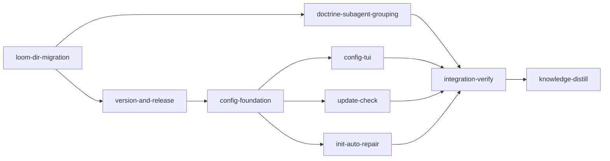

# Plan: Release Pipeline, Version Identity, Configuration, and the `.loom` Directory

## Overview

Nine changes that together give loom a real release identity and a user-facing configuration
surface, and consolidate its on-disk footprint. Three of the nine already exist in partial form and
are repaired rather than built: the release workflow publishes drafts that `loom self-update` can
never see, `loom self-update` fetches a checksum asset under a name the workflow does not publish,
and the version in `Cargo.toml` has never moved off `0.1.0`.

The largest change is structural: loom's shared orchestration state moves from `<repo>/.work/` to
`<repo>/.loom/work/`, joining the derived context cache that already lives at `<repo>/.loom/cache/`,
while `.worktrees/` stays at the project root.

## Goals

- Pushing a `v*.*.*` tag produces a live, signed, checksummed GitHub release.
- The binary knows its own version, including for development builds, and prints it under `loom -v`.
- `loom self-update` works end to end.
- Loom notices new releases and says so. It never installs anything on its own.
- `loom config` gives a TUI and a scalar get/set surface over a global `~/.loom/config.toml`, and
  every key it advertises changes real behaviour.
- `loom init` repairs the workspace instead of telling the user to run `loom repair --fix`.
- Doctrine tells orchestrators to group small tasks into one subagent.
- `<repo>/.loom/work/` replaces `<repo>/.work/`; a workspace already at `.work/` keeps working
  in place, read and write.

## Non-goals

- No migration of existing workspaces. Loom plans are ephemeral; a project already holding a
  `.work/` workspace keeps using it in place until that plan ends.
- No new release targets. The matrix stays linux-x86_64, darwin-x86_64, darwin-arm64.
- No change to hard stop 6. The subagent doctrine change is a grouping rule only.
- No automatic installation of updates, in any configuration.

## Cross-plan status: no sibling is live, and nothing is owed

Checked against the tree, not against prose. **Neither sibling plan in `doc/plans/` is running or
owes this plan a seam**, so no upstream surface is assumed and no downstream consumer is disturbed:

- `IN_PROGRESS-PLAN-fix-knowledge-bootstrap-macos.md` is **obsolete bookkeeping, not a running plan.**
  `.work/` has **no `config.toml`**, and its `stages/`, `sessions/` and `signals/` directories are
  **empty** — so `WorkDir` resolves no workspace there and there is no graph to run. `.worktrees/`
  does not exist. (Re-check all three before starting; the empty directories alone prove nothing, the
  absent `config.toml` and empty `stages/` do.) Commit `36268adc` deleted
  `loom/src/commands/knowledge/bootstrap.rs` and removed the `Bootstrap` variant; that plan's entire
  `files:` list targets a file that no longer exists.
- `PLAN-fix-sandbox-parent-traversal-denywrite.md` **has no `loom:` YAML block at all** — it is a
  prose fix doc, never a loom plan — and its fix is already in the tree
  (`sandbox/settings.rs:290-293`, `push_allow_write_rules` at `:226`, with the test it asked for at
  `sandbox/settings/tests.rs:476 test_deny_write_parent_traversal_not_in_os_sandbox`).

That test is worth naming because `loom-dir-migration` rewrites the file it lives in: **do not weaken
it while sweeping literals.**

**Precondition before `loom run`:** clear the stale `IN_PROGRESS-` prefix on
`IN_PROGRESS-PLAN-fix-knowledge-bootstrap-macos.md` — rename it `DONE-…` or delete it. The prefix is
the only thing still asserting that plan is live, and it made a pressure reviewer flag a
file-ownership collision on `src/cli/dispatch.rs` that does not exist. Nothing in this plan depends
on the rename; it exists so the next reader does not have to re-derive what is above.

The only import boundary the new modules must satisfy is the `docs` CI job — `cargo doc --workspace
--all-features --no-deps` under `RUSTDOCFLAGS: "-D warnings"` (`ci.yml:169-173`) — which was in no
stage's acceptance and would have failed only on push. It is now a criterion on every stage that adds
a module. There is no `clippy.toml`; `loom/deny.toml` is cargo-deny for licences and advisories only.

---

## Settled design decisions

These were settled before this plan was written. They are inputs, not open questions.

| Area | Decision |
| --- | --- |
| Layout | `.loom/work/` holds shared state. In a worktree, `.loom/` is a real writable directory holding the two spools, and `.loom/work` is a symlink to `../../../.loom/work`. `.loom/cache/` is unmoved. `.worktrees/` stays at the project root. |
| Why nested | One directory name cannot be both a symlink to shared state and a real local directory. The two spools must be worktree-local and writable (`fs/memory/spool.rs:1-21`); the state must be shared and read-only. Nesting the shared half keeps `WorkDir::initialize`'s existence guard valid and keeps `loom clean --state` a single recursive remove that spares the expensive cache. |
| Back-compat | The resolver keys on `config.toml`, not on directory existence: `.loom/work/config.toml` first, then `.work/config.toml`. A root that resolved to `.work/` **is** that workspace — read and write — for the rest of its life. Loom never *creates* a `.work/`. |
| Naming | `WorkDir` and `work_dir` identifiers are left alone. They appear in 317 files against 265 carrying `.work` string literals, and identifier renames are compiler-verified while string changes are not — renaming would bury the risky half of the diff under mechanical noise. |
| Version source | The tag is authoritative. `Cargo.toml` holds a placeholder; CI sets the version from the tag at build time. `build.rs` derives a development version as last tag + patch bump + dev marker. |
| Releases | Live on tag, never draft. CI fails the release if the tag and the built version disagree. |
| Updates | Check and notify only. `loom self-update` stays the sole installer. The config key is "check for updates", not "auto-update". |
| User directory | `~/.loom/`, holding `config.toml` and `update-state.json`. Matches `~/.claude/` and `~/.codex/`. |
| Collision guards | The workspace discriminator is `.loom/work/config.toml`, which never exists at the user level; the resolver's upward walk stops at the git repo root; the two get distinct types and distinct wording in every message. |
| Doctrine | Grouping rule only. Hard stop 6 is untouched. |

### One root, therefore one policy: a legacy workspace is read AND write

`WorkDir` has exactly one field — `root: PathBuf` (`fs/work_dir.rs:89-91`) — and every accessor,
mutating ones included, derives from it (`:280-323`, `write_config` at `:451-462`, `merge_section` at
`:471-495`). There is no read-root/write-root split, and this plan does not add one.

That makes "old `.work/` workspaces stay readable" and "nothing ever writes `.work/`" mutually
exclusive, and an earlier draft of this plan asserted both. **Only one is implementable, and it is
the first.** The settled policy, which every task below is written against:

- **Resolution picks the root once.** `.loom/work/config.toml`, else `.work/config.toml`, else — for
  a repo with neither — a *new* root at `<repo>/.loom/work`.
- **Whatever root resolved is the workspace, for reads and for writes.** A project mid-plan on
  `.work/` keeps getting signals, sessions, stage files, handoffs and config writes at `.work/`,
  because that is where its state already is. Splitting the roots would mean copy/merge semantics for
  every mutable state class, which is a migration — and this plan's first non-goal is no migration.
- **Loom never creates a `.work/`.** A fresh repo, and `WorkDir::initialize()` on a repo with no
  `config.toml` anywhere, always land on `.loom/work`. That is what makes the layout change stick.

The user-visible promise is therefore "your in-flight plan does not break", not "your `.work/`
directory is frozen". Say it that way in any message that mentions it.

**Every layout-dependent behaviour follows the root that resolved, not a compile-time constant.**
Three of them, each of which is silently wrong if hard-coded to the new layout:

| Behaviour | Legacy root | New root |
| --- | --- | --- |
| Worktree symlink (`ensure_work_symlink`, `git/worktree/settings.rs:49-68`) | `.worktrees/<id>/.work -> ../../.work` | `.worktrees/<id>/.loom/work -> ../../../.loom/work`, with the worktree's `.loom/` created first |
| `project_root()` / `main_project_root()` hops | one `parent()` | two |
| Worktree membership probe (`target_is_worktree`, `sandbox/settings.rs:39-47`) and teardown (`git/cleanup/worktree.rs:176`) | `.work` | `.loom/work` |

`ensure_work_symlink` currently hard-codes both halves — `repo_root.join(".work")` and
`Path::new("../../.work")` (`:53,55`). It takes `repo_root`, not a `WorkDir`, so it cannot see which
layout resolved; give it the resolved state root (or a layout enum) rather than leaving it to guess.

### Why the plan's own orchestration depends on the back-compat fallback

Loom executes this plan with the **installed** binary, which creates `.work` symlinks and reads and
writes `.work` state. The migration takes effect only once a new binary is built and installed. The
legacy policy is therefore not merely a courtesy to old projects — reinstall loom partway through the
run and the new binary inherits this plan's own half-finished `.work/` workspace. It has to keep
writing there: signals, session files and stage transitions all continue mid-run. A "read-only
fallback" would strand the orchestration executing this plan on its next state write, and a
hard-coded nested worktree symlink would strand it on its next spawned stage.

---

## Verification baseline

`cargo test --manifest-path loom/Cargo.toml --all-targets` was run at HEAD (77ef35ed) during
authoring: **3156 passed, 9 failed, 1 ignored**, in 26.81s.

All nine failures were traced to the authoring sandbox, not to HEAD:

| Test | Cause |
| --- | --- |
| `context::tests::store::open_resolves_cache_at_main_project_root_from_linked_worktree` | `TMPDIR` under `/tmp` aliases to `/private/tmp` on macOS; the test compares a canonicalized path against a raw one (`src/context/tests/store.rs:47`) |
| `daemon::rpc::tests::a_live_listener_is_answered` | needs an `AF_UNIX` socket |
| `daemon::rpc::tests::a_stale_socket_file_with_nothing_bound_is_not_listening` | needs an `AF_UNIX` socket |
| `daemon::server::peer_identity::tests::ancestry_accepts_self_and_the_real_parent_chain` | needs real process ancestry |
| `process::tests::unreaped_dead_child_is_not_alive` | needs real zombie-reaping semantics |
| `verify::criteria::tests::confine_tests::spawned_child_leads_its_own_process_group` | needs real pgid semantics |
| `fs::permissions::tests::settings_tests::test_ensure_loom_permissions_adds_home_expanded_codex_forward_entry` | writes under `~/.claude` |
| `fs::permissions::tests::settings_tests::test_ensure_loom_permissions_home_expanded_entry_no_duplicates_on_rerun` | writes under `~/.claude` |
| `commands::attach::wait::tests::diagnose_sessions_names_the_work_dir_and_every_session` | needs a live session/socket |

**How this plan handles it.** The first test is a genuine fragility in a file this plan rewrites, so
`loom-dir-migration` owns fixing it (canonicalize both sides of the assertion) and its acceptance
runs it. The other eight are excluded from every stage's gate by an explicit `--skip` list.

**`--skip` is a substring filter, not a prefix filter.** The obvious spelling
`--skip daemon::rpc::tests` removes all **six** `#[test]` fns in `loom/src/daemon/rpc.rs`, not the
two in the table: it also drops `a_readable_user_token_is_presented_verbatim` (`rpc.rs:198`),
`a_missing_user_token_yields_the_peer_identity_placeholder` (`:189`),
`a_sandbox_denying_af_unix_is_unreachable_not_not_listening` (`:275`) and
`no_socket_file_at_all_is_not_listening` (`:237`). Those four need no socket — they are `TempDir`
tests over `user_credential()`, and two of them read `<work_dir>/user.token`, a path **this plan
moves**. The gate would blind itself to exactly the tests that guard the change. Every stage
therefore skips by **exact test path**, never by module prefix, and the real coverage given up is
the eight tests in the table above.

Two further properties of the gate, both verified, that the acceptance lists below are written
around:

- **A filtered `cargo test` that matches nothing exits 0.** `cargo test --lib zzz_no_such_test`
  prints `test result: ok. 0 passed; … filtered out` and succeeds, and an unmatched `--skip` name is
  accepted silently. Any criterion naming a specific test must therefore assert a **count** —
  `2>&1 | rg -q "test result: ok\. 1 passed"` — or it passes after the executor renames or deletes
  the test it was meant to pin. A typo in the skip list degrades coverage with no signal.
- **Acceptance has a hard 300-second per-command ceiling** (`DEFAULT_COMMAND_TIMEOUT`,
  `loom/src/verify/criteria/config.rs:8`; `CriteriaConfig::default()` at
  `commands/stage/acceptance_runner.rs:177`), it is not configurable from the plan schema, and the
  runner does **not** stop at the first failure (`verify/criteria/runner.rs:73-134`). A stage
  worktree starts with no `loom/target/` (`.gitignore:51`; `CARGO_TARGET_DIR` is not in
  `process/environment.rs:14-71`), and this tree is 409 packages building five tree-sitter C
  grammars. **A cold `cargo build --all-targets` will exceed 300s and the stage fails reporting a
  timeout, which reads as a hang rather than a slow build.** Every stage description below therefore
  instructs the agent to run the build once itself, early, so acceptance runs warm.

Acceptance commands run through `sh -c` (`CommandSpec::Shell` → `Command::new("sh").arg("-c")`,
`verify/criteria/confine.rs:28,163-170`), so pipes, `;`, `$?` and the quoted skip list all behave as
written. `./loom/target/debug/loom` is the correct binary path: no `[[bin]]` section, no
`.cargo/config.toml`, and `CARGO_TARGET_DIR` cannot be forwarded into a criterion.

**The repository's canonical gate is `loom/.githooks/pre-push`, and every code stage's acceptance now
matches its shape** (`knowledge-distill` writes only markdown and keeps its own gates). Three
differences were folded in after the first draft:

- **`--no-fail-fast`.** `pre-push:109-111` runs `cargo test --all-targets --no-fail-fast`, with its
  own error text explaining why: "This run does NOT stop at the first failure — every failure above
  must be fixed before pushing." Without the flag a stage sees one failure, fixes it, re-runs, sees
  the next — turning one 300-second criterion into as many runs as there are failures. Every full
  test command in this plan carries it.
- **rustdoc.** `pre-push:90-97` runs `RUSTDOCFLAGS="-D warnings" cargo doc --workspace
  --all-features --no-deps`, matching the CI `docs` job (`ci.yml:169-173`). It was on five stages and
  missing from `loom-dir-migration`, `doctrine-subagent-grouping` and `version-and-release` — the
  three that rewrite the most doc comments. It is now on all eight code stages.
- **`cargo audit`.** `pre-push:99-106` runs it, **and `cargo-audit` is not installed on this host**
  (`cargo audit --version` → "no such command"). A criterion would therefore fail every stage. It is
  a criterion on `integration-verify` only, whose description installs it first
  (`cargo install cargo-audit --locked`, in the agent's own shell where the 300-second ceiling does
  not apply; `crates.io` is on this plan's sandbox allowlist). No other stage runs it: dependencies
  do not change in this plan — every crate it needs is already in `Cargo.lock` — so one audit at the
  end is the whole coverage a per-stage audit would give.

### Hook syntax has no gate, and two hooks were broken at HEAD

While grounding this plan, `hooks/spawn-guard.sh` and `hooks/codex-forward.sh` were both found to be
**syntactically invalid at HEAD**, which blocks every `Agent` spawn. Both had the same cause: a
heredoc inside a command substitution (`X=$(cat <<'EOF' ... EOF)`) is *not* protected by its own
`<<'EOF'` quoting, because bash's `$( )` lexer re-scans the body for quote characters. A single
apostrophe in the body (`session's`, `a file's symbols`) opened a single-quoted region spanning
dozens of lines and destroyed double-quote parity far away.

Both are fixed and committed ahead of this plan (`588a0446`, `cdbb31b4`). No test in the repository
ran `bash -n` over the hook scripts, which is why they were committed broken; `scripts/check-hook-syntax.sh`
now closes that gap and runs as its own CI job (`e40443b8`), verified by mutation. Every stage below
calls it in acceptance, so the migration's hook sweep cannot reintroduce the class.

---

## Execution Diagram



`knowledge-bootstrap` is skipped: `doc/loom/knowledge/` is hierarchical (`INDEX.md` present) and
densely populated — seven tier-1 files (4315 lines, per the counts in `INDEX.md`) plus 57 tier-2
topics (`fd -e md . doc/loom/knowledge --min-depth 2 | wc -l`). The stage would
write nothing new. `knowledge-distill` still runs.

---

## Stages

### 1. `loom-dir-migration`

**Stage Necessity: Q1.** Every other stage must branch from a tree where the paths have already
moved; running any of them first would write `.work` paths that this stage then has to sweep again.

The riskiest stage in the plan. **1523 references to `.work` across 309 files in `loom/src`** (that
is `rg -oP '\.work(?![a-zA-Z])' loom/src -g '*.rs'`, excluding `.worktrees`), plus a further 86
across 25 files in `loom/tests/`, the hook scripts, `.gitignore`, `CLAUDE.md.template`, the repo's
own `CLAUDE.md`, and the skill and agent definitions.

The work has three parts, and the first must be finished before the second begins:

**Foundation — the resolver.** A single module owns path resolution and the fallback. `WorkDir::new`
(`fs/work_dir.rs:94-137`) currently walks upward to the filesystem root with no repo boundary. It
must instead look for `.loom/work/config.toml`, fall back to `.work/config.toml`, and **stop the walk
at the git repo root** — the unbounded walk is a pre-existing hazard that `~/.loom/` would otherwise
turn into a live one (`mistakes.md` records `find_repo_root_from_cwd` returning `Some(cwd)` outside
any repo).

**The resolver must also record WHICH layout it picked, and `WorkDir` must carry it.** Per the
settled policy above there is still exactly one `root`, used for reads and writes alike — but three
behaviours branch on the layout, and none of them can re-derive it from a path suffix safely
(`LOOM_WORK_DIR` hints, symlinks and canonicalisation all blur the suffix). Add a
`Layout { Nested, Legacy }` beside `root`, set it once in `WorkDir::new`, and expose **one**
layout-aware accessor —

```rust
/// The repository root containing this workspace, whichever layout resolved.
/// `.loom/work` is two hops up, a legacy `.work` is one.
pub fn repo_root(&self) -> Option<PathBuf>
```

— which `project_root()` and `main_project_root()` both delegate to, so the hop count is decided in
one place. `main_project_root()`'s symlink branch resolves the link first and then applies the same
rule; its non-symlink branch (`:389-391`) already delegates to `project_root()` and keeps doing so.
A fixed parent count in either one puts `.loom/cache/context-v1` outside the project for one of the
two layouts, and no existing gate catches that.

**There are FIVE resolvers, not three**, and four of them are duplicates to collapse onto the shared
one:

| Resolver | Location | Note |
| --- | --- | --- |
| `WorkDir::new` | `fs/work_dir.rs:94-137` | the one that survives |
| `find_work_dir` | `commands/common/mod.rs:20-35` | **the plan previously missed this one.** Its own unbounded upward walk on `current.join(".work")`, keyed on `is_dir()`. Seven consumers: `commands/sessions.rs:18,52`, `attach/mod.rs:47`, `graph/mod.rs:57`, `handoff/create.rs:54`, `subagents/render.rs:30`, `usage/mod.rs:107`, `usage/discovery.rs:302`. Left alone, `loom handoff`, `loom attach`, `loom sessions`, `loom graph`, `loom subagents` and `loom usage` all silently stop finding state |
| `get_work_dir` | `commands/review/generate.rs:19` | keys on directory existence |
| `get_work_dir` | `commands/memory/handlers/work_dir.rs:21` | keys on directory existence |
| `get_work_dir_readonly` | `commands/memory/handlers/work_dir.rs:106` | returns `Option`, so failure is a silent `None` |

(`commands/subagents/render.rs:29 find_work_dir_quietly` merely delegates to `find_work_dir`, and
`commands/stage/admin_proof.rs:191 resolve_work_dir` is a `canonicalize()` helper, not a resolver.
Neither needs collapsing.)

**Two more foundation obligations the first draft of this plan missed:**

- **The `.work`-named-base branch is what makes every hook work.** `WorkDir::new` ends with
  `if base.file_name() == Some(".work") { root = base }` (`fs/work_dir.rs:131-135`), under a 13-line
  comment (`:118-130`) explaining why. Every hook entry point passes `LOOM_WORK_DIR`, which names the
  state directory *itself*, absolute — set at `hooks/generator.rs:91-94` and
  `orchestrator/terminal/native/wrapper.rs:289`, consumed by `commands/hook/pre_compact.rs:100`,
  `reconcile_graph.rs:147`, `user_prompt.rs:192`. After the move that value is `<root>/.loom/work`,
  whose `file_name()` is `work`, not `.work`. The branch stops firing, the resolver appends a second
  copy, and you get `<root>/.loom/work/.loom/work` — the exact phantom-directory failure the comment
  documents. **The new resolver must recognise a base whose trailing two components are
  `.loom/work`**, and keep the single-component `.work` spelling for the fallback.
- **The no-config fallback root must be stated.** Keying on `config.toml` means a fresh repo matches
  nothing, and `WorkDir::initialize()` (`fs/work_dir.rs:153-165`) creates the directory at whatever
  root `new` returned. If the fallback stays `<base>/.work`, `loom init` keeps creating `.work/`
  forever and every acceptance criterion still passes. **The no-config fallback root is
  `<root>/.loom/work`.** The same decision covers `init`'s re-entrancy path
  (`commands/init/execute.rs:111-113`, `adopt_existing` at `fs/work_dir.rs:167-183`), where the
  directory exists but `config.toml` does not yet.

**Sweep — the literals.** `sandbox/settings.rs:306-311` emits per-child rules
(`Read(.work/config.toml)`, `Read(.work/signals/**)`, `Read(.work/handoffs/**)`,
`Edit(.work/handoffs/**)`, `Read(.work/disputes/**)`, `Read(.work/memory/**)`), deliberately avoiding
a blanket `.work/**` so `admin.token` and `user.token` stay hidden — every one becomes
`.loom/work/...`, and the deliberate omission must survive. **`sandbox/settings.rs:116-192`** (not
`116-155` — the cited range stops short of the allow list at `:166-189`, which is exactly the half
whose relative twin at `:306-311` the plan does enumerate) resolves the symlink to an absolute path;
it now resolves `.loom/work`. `git/worktree/settings.rs:53-68` plants the symlink: it must `mkdir`
the worktree's `.loom/` first, then link `.loom/work -> ../../../.loom/work` (note the extra `../`;
the arithmetic is confirmed below). `is_worktree_scaffold_path` (`settings.rs:36-47`) gains the new
paths and keeps the existing `.loom/cache` and spool entries — and its doc comment at `:31-33`
("a project may legitimately track `.loom/config.toml`, which must NOT be discounted here") predates
`.loom/work/` and must be corrected, not left contradicting the new layout.

**Three more literal surfaces the first draft did not name, each of which fails silently:**

1. **`target_is_worktree` (`sandbox/settings.rs:39-47`)** decides worktree membership by
   `symlink_metadata(target.join(".work"))` — comment at `:43`: "a worktree's `.work` is a symlink;
   the main repo's is a real dir." After the move a worktree has no `.work` at all, so this returns
   `false` and `strip_worktree_escape_denies` (`:68`) strips the escape denies from a genuine
   worktree's settings. Probe **`.loom/work`**, never `.loom` — the worktree's `.loom/` is a real
   directory and only `.loom/work` is the symlink.
2. **`git/worktree/settings.rs:415-447` is a second, independent resolved-symlink permission
   emitter**, duplicating the `sandbox/settings.rs` logic: `worktree_path.join(".work")` at `:425`,
   `canonicalize()` at `:427`, absolute grants at `:442-447`. Migrate one and forget the other and
   worktree agents get no absolute-path grants on `.loom/work` — a permission prompt on every state
   read. Note it emits a *broad* `Read(/{resolved}/**)` at `:443`; that asymmetry with the narrow
   relative rules is pre-existing and deliberate (see the comment at `:433-441`) — do **not** "fix"
   it while sweeping.
3. **`fs/permissions/` is a whole sweep surface**, and one entry is depth arithmetic:
   `constants.rs:170,196` carry `Read(.work/**)` literals; `write_rules.rs:30-31` hard-codes
   `matches!(path, ".work/**" | "../../.work/**")`; and **`sync.rs:212,258 transform_worktree_path`
   rewrites `Read(../../.work/**)` → `Read(.work/**)` — the `../../` becomes `../../../`**, the same
   arithmetic as the symlink, pinned by tests at `sync.rs:511,518,561-562`.

**Sweep — the shell and the docs.** `hooks/_common.sh` **has no `.work` state paths** — its five
matches (`:1478-1498`) are all `.worktrees` worktree-membership logic that must **not** change.
Pointing a sweeping worker at the 1500-line file every hook sources, for a string that is only ever
`.worktrees` there, is how `.worktrees` handling gets mangled. Sweep instead the 22 scripts under
`hooks/` that carry real state paths (`rg -l '\.work/' hooks/`; densest are `git-add-guard.sh` 31,
`worktree-isolation.sh` 17, `commit-guard.sh` 17) **plus the 11 fixtures under `hooks/tests/`**,
which no acceptance criterion currently runs. `.gitignore` lines 45-69. And `CLAUDE.md.template` has
**five** `.work` references, not one: `:78` (Rule 3b), `:274` (Rule 10), `:278` (Rule 11), `:355` and
`:361` (the orchestration reference).

**Every hook is `include_str!`-embedded into the binary** at `fs/permissions/constants.rs:4-108`, so
a hook edit changes compiled constants that Rust tests assert against — including
`orchestrator/signals/tests_doctrine.rs:265-273`, which asserts `HOOK_CODEX_FORWARD.contains(".work/")`.
The hook territory is therefore **not** disjoint from the Rust territory; sequence them and say so in
both briefs.

Three specific traps:

1. **The worktree teardown must retarget its symlink removal.** *(This replaces the "spool drain must
   skip symlinked entries" trap in the first draft of this plan, which described a hazard that does
   not exist: `drain_stage_spools` (`orchestrator/core/spool_drain.rs:46-80`) reads stage ids from
   `.work/stages/*.md`, computes `Worktree::worktree_path()` (`:73`), and joins the fixed
   `SPOOL_RELPATH = ".loom/memory-spool.jsonl"` — it never enumerates spool candidates, so there is
   nothing to `symlink_metadata()`-skip, and the spool paths are unchanged by this migration.)* The
   real hazard is `git/cleanup/worktree.rs:176`:
   `remove_required_symlink(&worktree_path.join(".work"))` must become `.loom/work`. It is a no-op on
   a missing path (`:310-318`), so miss it and a live `work` symlink is left inside `.loom/`, which
   `remove_drained_spool` (`:210-231`) then declines to clean, and non-forced `git worktree remove`
   refuses.
2. **BOTH `project_root()` and `main_project_root()` take the extra hop, and the hop count depends on
   which layout resolved.** `main_project_root()` (`fs/work_dir.rs:369-392`) resolves the symlink and
   takes one `parent()` at `:384`; `project_root()` (`:358-360`) is a bare `self.root.parent()` with
   **18 call sites** (`commands/map.rs:36`, `orchestrator/signals/retrieval.rs:58`,
   `commands/hook/pre_compact.rs:115`, `context/retrieve/graph.rs:67`,
   `commands/hook/reconcile_graph.rs:181`, `commands/hook/user_prompt.rs:195,221`,
   `context/retrieve.rs:121`, `commands/run/checks.rs:227`, `commands/context/record_edit.rs:109`,
   `commands/status/data/collector.rs:273,294,301`, `commands/knowledge/check.rs:73`,
   `commands/knowledge/mod.rs:44`, `fs/plan_lifecycle.rs:141`, `fs/work_dir.rs:216,390`). Note
   `:390` — `main_project_root()`'s own non-symlink branch delegates to `project_root()`, so fixing
   only the symlink branch leaves the main-repo case wrong. **Two hops for a `.loom/work` root, one
   for a legacy `.work` root** — an unconditional two-hop breaks the very fallback this plan's own
   orchestration depends on, siting `.loom/cache/context-v1` outside the project.
   `ContextStore::open` (`context/store.rs:56`) is the consumer.
3. **`sun_path` is 104 bytes on macOS and nothing validates it.** The socket path grows by exactly
   five bytes (`/Users/…/loom/.work/orchestrator.sock` = 48 → `.loom/work/…` = 53), leaving 74
   characters of headroom for the containing directory. **The check cannot go where the plan first
   put it:** `daemon/server/core.rs:91` is `with_config(...) -> Self` and `:115` is
   `check_status(...) -> DaemonStatus` — neither returns a `Result`. Put it immediately before the
   bind at **`daemon/server/lifecycle.rs:216-217`**, inside `run_server(&self, …) -> Result<()>`.
   There is a ready pattern to copy: `orchestrator/terminal/tmux/mod.rs:160` and `viewer.rs:57`
   already budget for the 104-byte limit, with an asserting test at `tmux/tests.rs:11-28` that
   measures `path.as_os_str().len()` — **bytes on unix, not characters**, so it is already correct
   for a non-ASCII path. Copy that measurement exactly. Two refinements it does not make and this
   check must: the stored pathname is NUL-terminated, so the usable budget is `len() + 1 <= 104`,
   i.e. `len() < 104`; and `sun_path` is 104 on macOS/BSD against 108 on Linux, so **the 104 bound is
   the portable one** — use it on both targets rather than a `cfg`-switched capacity, which is what
   `tmux/tests.rs:22-24` already documents. The error must print the full path and its byte count,
   because a bind failure otherwise reads as a permissions problem. Unit-test the predicate at the
   boundary — 103, 104 and 105 bytes — rather than only on a realistic path, since every realistic
   path passes. Six other construction sites the plan does not otherwise name: `daemon/rpc.rs:65`,
   `daemon/server/shutdown.rs:24`, `commands/stage/control_complete.rs:51`,
   `commands/status/ui/tui/app.rs:136`, `commands/repair.rs:553`, plus the two in `core.rs`.

**`loom repair` writes `.gitignore` too.** `fix_gitignore_work` (`commands/repair.rs:870`) is
dispatched by substring-matching English prose in `issue.description` (`repair.rs:777-790`), with
detection at `:418, 524, 553, 846, 854, 1097`. The strings it writes must match the swept
`.gitignore` exactly, or `loom repair --fix` re-adds the old entries indefinitely.

Also in this stage: fix `src/context/tests/store.rs:47` to canonicalize both sides of the assertion.
`scripts/check-hook-syntax.sh` **already exists** (51 lines, committed in `e40443b8`) and already
runs as its own CI job (`.github/workflows/ci.yml:191-199`, job `hook-syntax`). Keep it passing; do
not recreate it. It excludes Python by shebang, not extension (`:32-36`), so `hooks/skill-trigger.sh`
is correctly skipped.

**The maintainability ledger.** `loom/maintainability-baseline.txt` is an **exact-match, bidirectional**
line-count ledger enforced by `loom/tests/maintainability.rs:13`, an autodiscovered target that runs
under this stage's own `cargo test --all-targets`. It errors on **shrinkage exactly as loudly as on
growth** (`mistakes/pinned-literals-ledgers-and-wiring.md:22`). This stage moves at least:
`file src/fs/work_dir.rs 669` (`:34`), `file src/git/worktree/settings.rs 637` (`:37`),
`function … create_worktree_settings 104` (`:185`), `file src/sandbox/settings.rs 532` (`:62`),
`function … generate_settings_json 105` (`:272`), `write_settings 132` (`:274`),
`file src/commands/review/generate.rs 473` (`:15`) and `execute 162` (`:103`) — the resolver collapse
*shrinks* the last two. Only the stage's main agent reconciles the baseline, after every subagent has
landed; a subagent reports its new number instead.

### 2. `doctrine-subagent-grouping`

**Stage Necessity: Q4.** Combining this with `version-and-release` would put CI semantics, cargo
version machinery, and self-update internals in one session alongside five byte-pinned doctrine
surfaces that must be edited to exact equality. The two halves share no files and no reasoning.

Add a task-grouping rule: several small tasks go to **one** subagent, never one subagent per task or
per file. State the boot cost so the trade is visible, and name the second cost — every extra
subagent forces another disjoint file set, which is the part that actually goes wrong.

The pinning, verified against the tests rather than assumed. Each equality test enumerates its own
fixed surface set, and **none of the three iterates `agents/*.md`**:

| Test | Requires the block verbatim in |
| --- | --- |
| `block_a_agrees_across_every_surface` (`tests_doctrine.rs:109`) | both signal prefixes, `CLAUDE.md.template`, `hooks/subagent-verify-guard.sh` |
| `block_b_agrees_across_every_surface` (`:129`) | `CLAUDE.md.template`, `skills/loom-plan-writer/SKILL.md` |
| `block_d_agrees_across_every_surface` (`:166`) | both signal prefixes, `CLAUDE.md.template` (and asserts ABSENCE from the two knowledge prefixes) |

`guidance_surfaces()` (`:93`) and `agent_definitions()` (`:62`) do scan every `agents/*.md`, but only
two tests consume them: a `RETIRED_PHRASES` **absence** check (`:332`) and a codex-sentinel presence
check (`:211`). A new grouping rule trips neither.

The Rule 6 shape table (`CLAUDE.md.template:140-146`) has **no copy anywhere in `loom/src`** and no
test asserts it against another surface. `cache/blocks.rs` declares only two consts
(`BINDING_RULES_POINTER:19`, `KNOWLEDGE_CONSUMPTION_CONTRACT:23`); the BLOCK-A and BLOCK-D text lives
in `push_str` literals inside its functions.

**Put the new rule in Rule 6's prose, not inside a pinned BLOCK.** Not because a block would reach
`agents/*.md` — it would not — but because BLOCK-A and BLOCK-D text is duplicated into the signal
prefix generators in `cache/blocks.rs`, so landing the rule inside either one turns a two-file edit
into a four-file byte-identical edit for no benefit. Rule 6 prose plus the plan-writer skill's
parallelization section reaches exactly the right readers.

Budget: `CLAUDE.md.template` is 27,683 bytes against the 28,672-byte ceiling at `tests_size.rs:30` —
989 bytes of headroom **at HEAD**. `loom-dir-migration` runs first and rewrites five `.work`
references in that file to `.loom/work`, adding about 25 bytes, so **re-measure with `wc -c` at the
start of this stage rather than trusting the figure above**. Fit inside the ceiling. Raise it only if
the text cannot be made to fit, and say so in the commit if you do.

**This stage is not markdown-inert and must run the full canonical gate.** `CLAUDE.md.template` is
`include_str!`'d into **six** test modules: `tests_doctrine.rs`, `tests_doctrine_blocks.rs`,
`tests_doctrine_prefixes.rs`, `tests_doctrine_waiting.rs`, `tests_size.rs`, and
**`tests_commit_timing.rs`** — which the substring filter `orchestrator::signals::tests_doctrine`
does **not** match, and which pins Rule 4's sentinel phrases byte-for-byte. With under 1 KB of
headroom the likeliest way to fit new text is compressing neighbouring prose, which is precisely what
`tests_commit_timing` exists to catch. `skills/loom-plan-writer/SKILL.md` is likewise `include_str!`'d.
A template edit cannot break `cargo build`, but it can and does break `cargo test`.

### 3. `version-and-release`

**Stage Necessity: Q1.** `config-foundation` edits `cli/types.rs`, which this stage also edits.

`Cargo.toml` becomes `version = "0.0.0-dev"` and stops moving. A new `loom/build.rs` derives the real
version and emits it for `env!`:

- `git describe --tags --exact-match` succeeds → that tag **minus a leading `v`** (this is what CI
  builds). `v` is not semver, and `self_update/mod.rs:66-68` parses the reported version with
  `semver`; a literal `v0.2.0` fails to parse and the comparison never happens.
- `git describe --tags` gives `v0.2.0-5-gabc1234` → `0.2.1-dev.5+abc1234`: last tag, patch bumped,
  commit count and SHA. Semver-correct in both directions — ahead of `0.2.0`, behind `0.2.1`.
- **No tags → `0.0.0-dev+<short sha>`**, taking the SHA from `git rev-parse --short HEAD`
  independently of `git describe`. Only a tree with no git at all yields `0.0.0-dev+unknown`.

**This repository carries ZERO tags today** (`git tag` is empty; `git describe --tags` returns
`fatal: No names found, cannot describe anything`), so the no-tag branch is the path *every* build
takes until the first `v*` tag is pushed — including every build in this plan. That is why the commit
hash must survive it: `integration-verify`'s own functional proof requires "`loom -v` prints a version
carrying a commit hash", which `0.0.0-dev+unknown` cannot satisfy. It also means the two interesting
branches are unreachable in any environment this plan runs in, so **the derivation must be unit-
testable rather than proven end-to-end**: put
`pub fn derive_version(describe_exact: Option<&str>, describe: Option<&str>, short_sha: Option<&str>) -> String`
in `loom/src/version/derive.rs`, have `build.rs` `include!` it and shell out to git only, and cover
all four branches by name in `version::derive::tests`.

**`cargo:rerun-if-changed` cannot name `.git/HEAD`.** Build scripts run with CWD = the package root =
`loom/` (there is no workspace manifest at the repo root), so `.git/HEAD` means `loom/.git/HEAD`,
which does not exist. Worse, seven of the nine stages build inside `.worktrees/<id>/`, where `.git`
is a **file** (`gitdir: …`), not a directory. And cargo treats a missing `rerun-if-changed` path as
permanently dirty, not as a no-op — verified with a probe crate: `Compiling` reappears on every
consecutive build with no source change. Combined with the 300-second acceptance ceiling, that is the
most likely way a stage in this plan fails opaquely. **Resolve the real paths first**: `git rev-parse
--git-path HEAD` (per-worktree) and `git rev-parse --git-common-dir` for `refs/tags` and
`packed-refs` — tags land in `packed-refs` after a clone or `gc`, and `.git/refs/tags` is an empty
directory here today. Emit `cargo:rerun-if-changed` for the resolved absolute paths and **emit
nothing for a path that does not exist**. Verify with two consecutive `cargo build` runs: the second
must not print `Compiling loom`.

There is no `build.rs` at the package root today, no `build =` key, no `include`/`exclude` list and no
`[build-dependencies]`, so cargo auto-detects the new file; shell out to `git` rather than adding a
dependency. Spawning `git` from a build script is unrestricted under loom's sandbox — it emits no
command allow/deny list.

`loom -v`: `#[command(version)]` at `cli/types.rs:34` gives `-V` only, and **clap cannot simply be
given a short alias**. A manual `#[arg(short = 'v', long = "version", action = ArgAction::Version)]`
collides with the auto-generated `--version`; the working shape on clap 4.6.6 is
`#[command(version, disable_version_flag = true)]` **plus** that manual arg. Second half: when both
`version` and `long_version` are set, clap prints `version` for the short form — so the commit hash
must be in the **`version`** string, not only in `long_version`, or the functional proof fails.
Nothing else claims `-v` at the top level (`Status`'s `-v` at `cli/types.rs:101-102` is a subcommand
flag, and `propagate_version` is absent so `-V` never reaches subcommands). Render version, commit,
build date, and target triple. **Adding a top-level flag invalidates the invariant `main.rs:41-44`
states** — "`Cli` declares no global options, so the first argument is always the subcommand" — which
`update-check` builds on; update that comment here.

`cli/types.rs` is **377 lines against Rule 17's 400**, and three stages add to it (this one,
`config-foundation`, `init-auto-repair`). It is not currently in the maintainability ledger, so
crossing 400 creates a *new* violation that `tests/maintainability.rs` rejects unless recorded. The
file already splits into `types_ops.rs` / `types_stage.rs` / `types_memory.rs` (`cli/types.rs:4-8`);
the `Config` variant belongs in a new `cli/types_config.rs` re-exported from `types.rs`.

Release workflow: drop `draft: true` (`release.yml:229`), and add a job that fails when the tag does
not match the version the build produced. **The `build` job checks out shallow and tagless** —
`release.yml:43` is a bare `uses: actions/checkout@v7` (default `fetch-depth: 1`, `fetch-tags: false`),
and the `fetch-depth: 0` at `:98` is on `sign-and-release`, which never compiles. Binaries are built
at `:63-65`. So `git describe --tags --exact-match` cannot succeed in the job that builds, the
"this is what CI builds" branch never fires, and **every published binary would ship the fallback
version**. Add `with: { fetch-depth: 0 }` to the checkout at `:43`. The mismatch job must compare the
tag against **the version the built binary reports**, not `steps.version.outputs.tag` — otherwise it
validates the workflow against itself and passes on a broken `build.rs`.

**`loom self-update` is broken in THREE independent ways, not one, and the checksum rename fixes only
the third.** The plan's goal "`loom self-update` works end to end" is false unless all three land
together. Each was verified against the tree:

1. **Wrong repository.** `GITHUB_REPO = "cosmix/claude-loom"` (`self_update/mod.rs:39`) feeds
   `https://api.github.com/repos/{GITHUB_REPO}/releases/latest` (`:100`). This repository's origin is
   `cosmix/loom` (`git config --get remote.origin.url` → `git@github.com:cosmix/loom.git`), and the
   releases this plan makes live are published there. The client queries a different repository than
   the workflow publishes to.
2. **Wrong asset names.** `update_binary` builds `format!("loom-{target}")` from `get_target()`
   (`:113-150`), a **target triple** — `loom-aarch64-apple-darwin`, `loom-x86_64-unknown-linux-gnu` —
   plus `{binary_name}.minisig`. The workflow publishes **os-arch** names: `loom-linux-x86_64`,
   `loom-darwin-x86_64`, `loom-darwin-arm64` and their `.minisig` partners
   (`release.yml:26-37,233-240`). No supported platform's asset is ever found. `get_target()` also
   recognises `aarch64-unknown-linux-gnu`, a fourth platform the workflow does not build at all and
   this plan's non-goals keep out of the matrix — it must map to a clear "no release asset for this
   platform" error, not to a 404.
3. **Wrong checksum asset.** `self_update/mod.rs:224` looks for `checksums.txt`; the workflow
   publishes `SHA256SUMS.txt` (`release.yml:148,161,240`). Change the client — the published name is
   conventional and already documented in the release notes.

Fix all three against **one shared source of truth, not two hand-kept lists**: a single
`release_asset` mapping (repo identifier plus target-triple → published asset base name) that the
client consumes, covering exactly the three supported targets. The workflow's matrix stays the
declaration of what is built; the mapping is what the client resolves against it.

**Prove it with a fixture test, because no acceptance command can reach a real release.** Feed the
workflow's published asset names — the literal ten from `release.yml:233-240` — to the real selector
and assert that each of the three supported targets selects both a binary and its `.minisig`, that
the checksum asset resolves, that the unsupported fourth target errors rather than selecting
something, and that the API URL names `cosmix/loom`. That test is the stage's proof; a grep for the
string `SHA256SUMS.txt` is not.

Two corrections to how this defect has been described, both of which change what the fix must do:

- **Self-update does not "update nothing".** `update_binary(&latest)` runs at `mod.rs:86`, *before*
  `update_config_files(&latest)` at `:89`. The binary is swapped, then the run errors inside
  `update_config_files`, leaving a **half-updated install** — new binary, stale `agents.zip` /
  `skills.zip` / `CLAUDE.md.template` — and no "Updated successfully" line (`:91-95` is never
  reached). That is worse than a clean bail, and it is what the knowledge correction must say.
- **`self_update/tests.rs` pins nothing.** `rg "checksums\.txt" loom/src/commands/self_update/tests.rs`
  returns zero hits; there are no test pins to update. Delete that instruction.

The literal occurs at **eight** sites in `mod.rs` — `:224, 241, 260, 263, 266, 335, 337, 340` — two
comments and four user-facing error messages among them. Update every one; the plan's wiring pattern
covers only `:224`. Ledger entries this touches: `file src/commands/self_update/mod.rs 438`
(`maintainability-baseline.txt:17`) and `function … update_config_files 88` (`:111`).

This is recorded as a known defect in `concerns.md#security-concerns` — specifically under the `###`
sub-heading *"Release Checksum Asset-Name Mismatch (LOW PRIORITY; corrected 2026-07-01)"* at
`concerns.md:26`, not under the `## Security Concerns` heading at `:24` — and again at
`architecture.md:81`. The distill stage corrects both.

### 4. `config-foundation`

**Stage Necessity: Q2.** Edits `cli/types.rs` and `cli/dispatch.rs`, which `version-and-release`
also edits.

A new module owns `~/.loom/`: resolve the directory, read and write `config.toml` through
`toml_edit` so comments and unknown keys survive, and expose a typed registry of keys. **`toml_edit`
is already a direct dependency** (`loom/Cargo.toml:39`, `toml_edit = "0.25.13"`, present in
`Cargo.lock`), so this stage adds no dependency, rewrites no lockfile and needs no registry fetch.
`dirs = "6"` is likewise present (`Cargo.toml:17`); `codex.rs:56` is the house idiom for
`dirs::home_dir()`.

Mirror the existing section-typed accessors in `fs/work_dir.rs:497-660` — `read_section<T>` (`:497`),
`rendered_section_doc<T>` (`:519`), `merge_section`, generic serde section reads plus a
`toml_edit::DocumentMut` merge that preserves comments — rather than inventing a second style. Keep
the type distinct from `WorkDir`, and note the sharper collision the plan did not name: **there is
already a bare `pub struct Config` at `fs/work_dir.rs:19`**, the `.work/config.toml` type. Every error
message must say which directory it means — "user config `~/.loom/config.toml`" or
"workspace `<repo>/.loom/`" — and never a bare "the .loom directory" or a bare `Config`.

Keys: `update.check` (bool, default true), `update.check_interval_hours` (u32, default 24),
`terminal.backend` (native|tmux, default `native`), `context.ceiling_tokens` (u32, default 800,000 —
`DEFAULT_CONTEXT_CEILING_TOKENS`, `models/constants.rs:44`).

**Two of those four keys have no production consumer unless this stage adds one, and a key that
persists and displays a value while changing nothing is the worst thing this stage could ship.**
Verified against the tree: `terminal.backend` is read only from the *workspace* config, by
`resolve_backend_flag` (`commands/run/mod.rs:166`) and `SessionBackend::from_config`
(`orchestrator/terminal/backend.rs:96-97`); the context ceiling likewise, by `Monitor::new`
(`orchestrator/monitor/core.rs:51-52`) and the hook path (`commands/hook/context_ceilings.rs:43`).
An earlier draft of this plan registered both keys and put workspace precedence out of scope, which
left `loom config -k terminal.backend tmux` writing a value nothing ever reads.

**Both funnel through exactly two functions, so the fix is small and belongs here.**
`read_terminal_config` (`fs/work_dir.rs:623-625`) and `read_context_config` (`:636-638`) are each a
one-line wrapper over `read_section`, which returns `Option<T>` — `None` when the section is absent.
Add the global tier inside those two wrappers and every consumer above picks it up unchanged:

```text
stage override (context only)  >  workspace [section] when PRESENT  >  ~/.loom/config.toml  >  built-in
```

**Precedence is section-level, not key-level, and that is deliberate.** `[context]` deserializes
through `ContextConfigRaw` (`fs/work_dir/context_config.rs:62-91`), whose whole purpose is to tell
"the TOML set this key" apart from "the TOML left this to derive" *before* the built-in defaults are
baked in by the `From` impl. By the time `read_section::<ContextConfig>` has returned, that
distinction is gone, so a key-level merge would silently treat a derived default as an explicit
setting. A present workspace section therefore wins whole; only an absent one falls through to the
user config. Say so in the `--list` origin column: a key's origin is `set`, `global`, or `default`.

The global tier supplies `context.ceiling_tokens` only. `subagent_ceiling_tokens` and
`model_window_tokens` keep deriving from the built-ins — one global key, not three, and
`ContextConfig::ceiling_for`'s stage-override rule (`context_config.rs:107-109`) is untouched.

This adds `loom/src/fs/work_dir.rs` and `loom/src/fs/work_dir/context_config.rs` to this stage's
owned files. Neither is contended: `loom-dir-migration` owns them in an earlier wave and is merged
before this stage starts.

CLI: `loom config -k <key>` prints the value; `loom config -k <key> <value>` sets it; `loom config
--list` prints every key with its value and origin (set vs default); `loom config --print` prints the
resolved configuration as TOML; bare `loom config` is `--print` until `config-tui` re-points it.

**`--print` is registered here, not in `config-tui`.** clap subcommand flags are struct-variant fields
in `cli/types.rs`, destructured in `cli/dispatch.rs:156-166` — files this stage owns and `config-tui`
does not. Registering the flag in `config-tui` would force it to edit `cli/types.rs` concurrently with
`init-auto-repair`, which also owns that file in the same wave: two branches editing one file through
auto-merge is the lost-work case.

**Output contract, so the gates can be honest:** `loom config -k <key>` prints the **bare value on
stdout and nothing else**. An unknown key, or a value that fails to parse for its type, is a non-zero
exit with a message naming the valid keys.

**Reads must not create the directory.** `-k <key>` and `--list` return defaults when
`~/.loom/config.toml` is absent; only a *set* creates `~/.loom/`. Without that rule this stage's own
acceptance writes on a read.

**Writes go through `crate::fs::locking::atomic_write_locked` (`fs/locking.rs:157`), never a bare
`fs::write`** — loom is invoked concurrently from hooks, so this is a real race, not a hypothetical
one. A `~/.loom/config.toml` that fails to parse is an **error** naming the file and the `toml_edit`
parse position on `loom config` paths, and is treated as **absent** (all defaults, no write, no
message) on every other command: a broken user config must never take down `loom run`.

**Expose exactly one accessor, `user_config::load() -> UserConfig`**, returning fully defaulted values
when the file is absent or unparseable. `config-tui` and `update-check` run in the same wave, both
consume the config, and **neither lists `loom/src/user_config/**` in its `files:`** — so the module
must be complete here and neither successor may construct its own reader. The typed key registry is
the single validator for the `-k` path, the TUI's commit, and `update.check`'s lookup.

Writes go to `~/.loom/config.toml` only — `loom config` never edits a workspace config. Reading is
the other direction: a workspace section, when present, overrides the global value per the
precedence above.

### 5. `config-tui`

**Stage Necessity: Q2.** Owns `commands/config/tui/**` and re-points bare `loom config`, which
`config-foundation` wrote.

Mirror `commands/status/ui/tui/`, whose full sequence is: `enable_raw_mode()` at `app.rs:91`,
`EnterAlternateScreen` at `:93`, **`crate::utils::install_crossterm_panic_hook()` at `:95`**,
optional mouse capture at `:97-98`, `Terminal::new(backend)` at `:101`; teardown at `:290-305`, made
idempotent by the `cleaned_up` flag at `:291-293`. **Do not skip the panic hook** — without it a
panic leaves the user's terminal in raw mode on the alternate screen. That is the crossterm shape,
not ratatui 0.30's `init()`/`restore()` — match the existing code (ratatui 0.30.2 / crossterm 0.29.0
per `Cargo.lock`).

**Reuse `crate::commands::status::ui::{theme, widgets}` directly — every module on the path is
`pub`** (`commands/mod.rs:23 pub mod status;`, `commands/status.rs:6 pub mod ui;`,
`commands/status/ui/mod.rs:1,4 pub mod theme; pub mod widgets;`, re-exported at `:6` and `:9`). The
"replicate if not reachable" branch is dead; do not replicate, and do not widen any visibility.

Bare `loom config` opens the TUI; `--print`, already registered by `config-foundation`, keeps the TOML
output. Guard on a non-TTY stdout and fall back to `--print` behaviour — the command must stay usable
in a pipe. This is load-bearing for the gate as well as for users: acceptance stdout **is** a pipe
(`Stdio::piped()` at `verify/criteria/confine.rs:124-126`), so a bare `loom config` criterion is a
real test of the fallback, and without the guard every piped or CI invocation hangs in the alternate
screen.

### 6. `update-check`

**Stage Necessity: Q2.** Owns `main.rs`, which no other stage in this wave touches.

Launch reads `~/.loom/update-state.json` — **no network on the hot path**. If it records a newer
version, print one line. If the record is older than `update.check_interval_hours`, spawn a detached
background process that fetches, rewrites the state file, and exits. The foreground command never
waits.

The gate already exists in shape: `main.rs:13` declares
`MACHINE_PROTOCOL_COMMANDS: [&str; 2] = ["hook", "context"]` and `writes_a_machine_protocol()` at
`:45` reads argv before parsing. Add a parallel predicate for commands that must never check or
notify — `hook`, `context`, `complete`, and `run` — and reuse the same argv-before-parse approach.
All three named commands are real top-level variants (`Hook` at `cli/types.rs:297`, `Context` at
`:303`, `Complete` at `:310`), so an `args().nth(1)` test does reach them.

**"The daemon's own re-entry" does not exist — do not write a case for it.** The daemon daemonizes
in-process with `fork()` + `setsid()` (`daemon/server/lifecycle.rs:18`, double-fork at `:65,85,99,103`);
it never re-execs, so there is no re-entry argv. The forked child inherits an already-run `main()`.
The one genuine `current_exe` re-entry in the tree is
`commands/hook/reconcile_graph.rs:361`, which re-enters as `["hook", "reconcile-graph"]` and is
already covered by the `hook` exclusion. Exclude `run` instead — it is the parent that forks.

**The notification line goes to STDERR.** Every loom command's stdout is somebody's input;
`MACHINE_PROTOCOL_COMMANDS` exempts only `hook` and `context`, so stdout is not available to a notice.
The argv exclusion list is a second line of defence, not the first: loom's machine-readable stdout is
wider than any list — `loom plan verify --json` promises JSON-only stdout
(`cli/types_ops.rs:13-30`, "Machine-readable JSON output (suppresses human text)"), `loom usage`
exposes JSON, and scalar `loom config -k` prints a bare value this plan's own gates match with
`rg -q "^6$"`. Stderr is what makes all of those safe at once. **Prove it**: with a state file
recording a newer version in a scratch `HOME`, `loom plan verify --json` must still emit parseable
JSON on stdout and nothing else. That criterion is the real gate; `loom --help` is not.

**The detached fetcher's shape, all six parts — settle these here, not in integration-verify:**

- **stdio:** `/dev/null` on all three descriptors. It must **never** inherit the parent's stdout.
  loom runs as a child of piped callers — acceptance criteria pipe both streams
  (`verify/criteria/confine.rs:124-126`) — and an inherited fd keeps that pipe open after loom exits,
  making the collector block for `OUTPUT_COLLECTION_TIMEOUT` = 10s per stream and substitute
  `"[output collection timed out]"` (`verify/criteria/executor.rs:19,155-159`).
- **session:** `setsid` so it survives the parent and is reparented to init; the parent never waits
  on it, so there is no zombie and nothing to reap.
- **working directory:** the user's home, never the worktree — the worktree is removed when the stage
  merges.
- **concurrency:** exactly one fetcher. loom is invoked constantly by hooks, so two invocations
  **will** race. Take an `O_EXCL` lock at `~/.loom/update-check.lock` before spawning and drop it on
  exit; a lock older than the interval is stale and ignored.
- **state write:** through `crate::fs::locking::atomic_write_locked` (`fs/locking.rs:157`), the same
  tmp-fsync-rename path the rest of loom uses. A torn `~/.loom/update-state.json` must never break a
  loom command.
- **failure:** a fetch that fails **still stamps `last_checked`**, and the state file records the
  attempt (`last_checked`, and `latest_version` left as it was). This is the part the lock does not
  cover: the `O_EXCL` lock stops two fetchers running *at once*, but if a failed fetch leaves
  `last_checked` untouched, the record stays stale forever and **every subsequent loom invocation
  spawns another fetcher** — which, with loom invoked on every Claude Code hook, is a fork storm
  during any network outage. Stamping the attempt is what turns the interval into real backoff.

**Make the worker testable, and test it.** The fetch and the clock are the two things a test cannot
have: take them as injected parameters (a fetch closure returning the latest version, and a "now")
so the state machine — fresh/stale/disabled, success, failure-stamps-the-attempt, lock-held-so-skip —
is unit-testable with no network and no spawn. Cover concurrent stale calls scheduling **at most
one** refresh. **No test may leave a detached child alive:** exercise the decision ("would spawn")
rather than the spawn itself, so the suite never forks a real fetcher.

Reuse the existing release client rather than writing a second one: `self_update/client.rs` already
exports `create_http_client()` (`:22`), `validate_response_status` (`:46`) and the download helpers as
`pub(crate)`, and `reqwest` is a dependency (`Cargo.toml:14`, `blocking` + `json`). But
`get_latest_release()` (`self_update/mod.rs:39`) and `struct Release` / `Asset` (`:49-51`) are
**private to the module** — widen them to `pub(crate)` and call `get_latest_release()`.

Notification is unconditional (subject to the interval). `update.check = false` disables the check
entirely. Nothing here ever writes the binary.

### 7. `init-auto-repair`

**Stage Necessity: Q2.** Adds `--no-repair` to `Init` in `cli/types.rs`.

`loom init` runs the full repair check set and applies **only the workspace fixes**, reporting what it
changed. `--no-repair` opts out. `loom repair` stays for standalone use.

**Where the call goes decides whether this stage works at all, and the obvious placement is too
late.** `init::execute` calls `validate_work_dir_state(&repo_root)` at `commands/init/execute.rs:75`
— before `print_header()`, before cleanup, before anything. On the corrupted-symlink case that
validator **bails** with a wall of text ending "Or run: `loom repair --fix`"
(`fs/work_integrity.rs:101-121`). That is precisely the failure this stage exists to heal, and a
repair call placed anywhere after line 75 never runs on it. **Call the repair pass after
`ensure_repo_ready_for_worktrees` (`:73`) and before `validate_work_dir_state` (`:75`)** — the
repository must exist before the workspace can be repaired, and the workspace must be repaired before
it is judged.

**And `repair::execute` cannot be that call.** It prints a logo header (`commands/repair.rs:132`), a
DRY-RUN/FIX mode banner (`:134-147`), and on a clean workspace a "No issues found — workspace is
healthy!" line before returning (`:152-158`) — then a summary when fixes run (`:186-209`). Reusing it
directly contradicts requirement 2 below ("silence on a clean workspace") on the very first
invocation. **Extract a non-printing API and call that:**

```rust
/// Apply the workspace-safe repairs, returning what was applied.
/// Prints nothing. An empty vector means the workspace was already clean.
pub fn repair_workspace(repo_root: &Path) -> Result<Vec<AppliedRepair>>
```

`init` renders one line per returned repair and **nothing at all for an empty vector**. `loom repair`
stays exactly as it is, a presentation wrapper over the same checks — its banner and summary are
correct for a command a human ran deliberately.

The wiring pattern `repair::` in `init/execute.rs` cannot tell any of this apart: it matches the
right call, the wrong call, a call placed after the validator, and a leftover import. The stage's
real proof is behavioural — scratch-repo tests covering a clean repo (no output, exit 0), each
repair family the allow-list admits, `--no-repair` (repairs skipped, workspace untouched), and the
corrupted-symlink state that fails validation today and must now be repaired past.

**"Every fix" is the wrong scope — `loom repair --fix` reaches outside the workspace and never
prompts.** `execute(fix)` (`repair.rs:128-160`) applies everything silently, and `fix_issue`
(`:775-843`) dispatches by **substring-matching English prose in `issue.description`** — its own
comment at `:776` calls this "not ideal, but works for now" — after which `fix_old_skill` and
`fix_old_agent` *string-parse a filesystem path out of that prose* before deleting under `$HOME`.

| Fix | Line | What it does |
| --- | --- | --- |
| `fix_old_skill` | `:1052-1063` | `remove_dir_all($HOME/.claude/skills/<name>)` — **outside the repo** |
| `fix_old_agent` | `:1066-1077` | `remove_file($HOME/.claude/agents/<name>.md)` — **outside the repo** |
| `fix_settings_skill_refs` | `:1111+` | rewrites `$HOME/.claude/settings.json` |
| `fix_phantom_merge` | `:1090-1105` | flips `merged = false` on stage state |
| `fix_work_symlink` | `:845-850` | `remove_file(<repo>/.work)` |
| `fix_invalid_work` | `:853-867` | removes `<repo>/.work` — but see below |

**Allow-list what `loom init` may apply unattended:** `.gitignore` entries (`fix_gitignore_work`
`:870`, `fix_gitignore_worktrees` `:1018`), hook install (`fix_hooks` `:903`), the pre-commit hook,
project `.claude` settings restore, and the skill-index rebuild (`:926`). **It must never
auto-apply** the six in the table; init reports those and leaves them to an explicit
`loom repair --fix`.

Two notes that keep this proportionate. `fix_invalid_work` is **not** the data-loss path it looks
like: it fires only on `WorkDirState::Invalid` — "`.work` exists but is neither directory nor
symlink" (`repair.rs:241-247`) — and even then branches `is_file()` → `remove_file` first. Do not
over-fix it; it stays off the unattended list because stage 1 rewrites the very shape detection it
keys on, not because it deletes live directories. And the two `$HOME` fixes are **denied in a stage
sandbox**, where `apply_fixes` (`:190-207`) counts failures rather than aborting — so leaving them in
scope makes `loom init` print `Issues failed: N` on every single invocation, contradicting this
stage's own "silence on a clean workspace" requirement.

`repair.rs` is 1131 lines against the 400-line ceiling in Rule 17, and this stage is the reason to
split it. The checks divide cleanly: workspace structure (`.work`/`.loom` shape, `.gitignore`), hooks
and skill index, `.claude` settings and sandbox, merge state (phantom merges), and process/daemon
liveness. `commands/repair/settings_checks.rs` already exists as a sibling — `commands/repair.rs` and
`commands/repair/` already coexist, alongside `commands/repair/tests.rs` — so the layout is
established; follow it.

**The split moves four ledger entries and the gate rejects shrinkage.**
`loom/maintainability-baseline.txt` pins `file src/commands/repair.rs 1131` (`:14`),
`check_all_issues 368` (`:98`), `execute 99` (`:99`) and `fix_issue 68` (`:100`), and adding
`--no-repair` grows `function src/commands/init/execute.rs execute 129` (`:85`) and
`file src/commands/init/tests.rs 700` (`:12`). It errors on shrinkage exactly as loudly as on growth.
Only the stage's main agent reconciles the baseline, after every subagent has landed.

Do not fold `--clean` into this. `--clean` is destructive and stays explicit.

### 8. `integration-verify`

Full gate, code review, and functional proof that each surface is reachable: `loom -v` prints a
version with a commit, `loom config -k update.check` round-trips, `loom init` reports repairs, a
worktree gets `.loom/work` as a symlink and `.loom/*.jsonl` as real files, and `bash -n` passes over
every shell hook. Plus the two canonical gates no earlier stage can run: `cargo audit` (after
installing `cargo-audit`), and one `cargo test` **without** the skip list.

**The unskipped run is a report, not a gate, and the plan says so rather than pretending otherwise.**
The eight excluded tests fail for host-resource reasons recorded in the Verification baseline —
`AF_UNIX` sockets, process ancestry, zombie reaping, `$HOME/.claude` writes. Making the unskipped
command an acceptance criterion would fail the stage on the environment, not on the code. So it runs
as an instruction and its result goes in the report: which of the eight pass here, so the exclusion
can be narrowed in a follow-up. The gated command keeps the skip list.

### 9. `knowledge-distill`

Curate memories. Two corrections are already known and must be applied with `replace-section`, not
`update`: `concerns.md#security-concerns` describes the checksum asset mismatch as an open defect
(stage 3 fixes it), and `architecture.md#security-model` repeats it. Every knowledge file naming
`.work/` needs re-checking against the new layout.

---

<!-- loom METADATA -->

```yaml
loom:
  version: 1
  sandbox:
    enabled: true
    auto_allow: true
    filesystem:
      # deny_read REPLACES the default list, it does not merge: FilesystemConfig
      # takes the whole struct (sandbox/config.rs:99-102) and deny_read is
      # #[serde(default = "default_deny_read")] (models/stage/types.rs:306).
      # default_deny_read() (types.rs:388-405) carries SIX entries - the four
      # credential dirs PLUS the two daemon IPC tokens. Listing only four here
      # silently drops the token denies. Both spellings, because this plan runs
      # on the installed (.work) binary and produces the .loom/work one.
      deny_read:
        - "~/.ssh/**"
        - "~/.aws/**"
        - "~/.config/gcloud/**"
        - "~/.gnupg/**"
        - ".loom/work/admin.token"
        - ".loom/work/user.token"
        - ".work/admin.token"
        - ".work/user.token"
      # allow_write is ADDITIVE (sandbox/settings/policy.rs:141-161 emits plan
      # entries + PACKAGE_MANAGER_CACHE_WRITE_PATHS + codex paths, and
      # apply_knowledge_write_grant at sandbox/config.rs:138-155 adds
      # doc/loom/knowledge/**). The worktree root and $TMPDIR come free.
      # ~/.loom does NOT - without it every `loom config` set in acceptance
      # hits EPERM, and config-foundation, config-tui, update-check and
      # integration-verify all write there.
      allow_write: ["loom/target/**", "~/.loom"]
    network:
      # api.github.com / objects.githubusercontent.com are needed by the
      # update-check fetcher and self-update. strictAllowlist is emitted
      # whenever the sandbox is enabled (settings/policy.rs:96-98), so an
      # omitted host is a hard block. No cargo fetch is needed for this plan -
      # toml_edit, dirs, semver, ratatui and crossterm are all already
      # dependencies and there are no git dependencies.
      allowed_domains:
        - "crates.io"
        - "index.crates.io"
        - "static.crates.io"
        - "api.github.com"
        - "objects.githubusercontent.com"
      allow_local_binding: false
      allow_unix_sockets: []
  stages:
    - id: loom-dir-migration
      name: "Move shared state to .loom/work"
      stage_type: standard
      model: "opus"
      reasoning_effort: "xhigh"
      implementers: ["codex", "claude"]
      subagent_timeout_secs: 1800
      description: |
        Move loom's shared orchestration state from <repo>/.work/ to <repo>/.loom/work/.
        .worktrees/ stays at the project root. .loom/cache/ does not move.
        Use parallel subagents and skills to maximize performance.

        THE BACK-COMPAT POLICY, SETTLED - READ THIS BEFORE STEP 1. An earlier draft of
        this plan said old .work/ workspaces stay "readable" AND that "nothing ever
        writes .work/". THOSE TWO ARE MUTUALLY EXCLUSIVE and the second one is the one
        that is wrong. WorkDir has exactly ONE field, root: PathBuf (work_dir.rs:89-91);
        every accessor derives from it, mutating ones included (:280-323, write_config
        :451-462, merge_section :471-495). There is no read-root/write-root split and you
        are NOT adding one - that would mean copy/merge semantics for every mutable state
        class, which is a migration, and no-migration is this plan's first non-goal.
        THE POLICY:
          - Resolution picks the root ONCE: .loom/work/config.toml, else
            .work/config.toml, else a NEW root at <repo>/.loom/work.
          - WHATEVER ROOT RESOLVED IS THE WORKSPACE, FOR READS AND FOR WRITES. A project
            mid-plan on .work/ keeps getting signals, sessions, stage files, handoffs and
            config writes at .work/, because that is where its state already is.
          - LOOM NEVER CREATES A .work/. A fresh repo, and WorkDir::initialize() on a repo
            with no config.toml anywhere, always land on .loom/work.
        The user-visible promise is "your in-flight plan does not break", NOT "your .work/
        directory is frozen". Any message you write about this says it that way.

        BUILD FIRST. Run cargo build --manifest-path loom/Cargo.toml --all-targets
        once, early, before you spawn anyone. Acceptance criteria have a HARD 300s
        per-command ceiling (verify/criteria/config.rs:8) that the plan schema cannot
        raise, and a cold worktree build of this crate (409 packages, five tree-sitter
        C grammars) exceeds it. A timed-out criterion reads as a hang, not a slow build.

        FOUNDATION STEP - do this yourself or in ONE subagent, and finish it before
        any other subagent starts, because everything else compiles against it:
        1. In loom/src/fs/work_dir.rs, rewrite WorkDir::new (lines 94-137). Resolution
           order: <root>/.loom/work/config.toml, then <root>/.work/config.toml. Key on
           the CONFIG FILE, never on directory existence - ~/.loom/config.toml exists at
           the user level and .loom/cache/ exists in projects that ran loom map.
        2. Bound the upward walk at the git repo root. Today it walks to the filesystem
           root, which with ~/.loom/ present is a live hazard.
        2b. RECORD WHICH LAYOUT RESOLVED, ON THE WorkDir. Still ONE root per the policy
           above, but add a Layout { Nested, Legacy } field beside it, set once in
           WorkDir::new. THREE behaviours branch on it and NONE of them can re-derive it
           safely from a path suffix - LOOM_WORK_DIR hints, symlinks and canonicalize()
           all blur the suffix:
             (i)   the worktree symlink: legacy plants .worktrees/<id>/.work ->
                   ../../.work; nested plants .worktrees/<id>/.loom/work ->
                   ../../../.loom/work after mkdir of the worktree's .loom/.
             (ii)  the repo-root hop count: ONE parent for legacy, TWO for nested.
             (iii) the worktree membership probe (target_is_worktree,
                   sandbox/settings.rs:39-47) and the teardown
                   (git/cleanup/worktree.rs:176): .work vs .loom/work.
           ensure_work_symlink (git/worktree/settings.rs:49-68) hard-codes BOTH halves -
           repo_root.join(".work") at :53 and Path::new("../../.work") at :55 - and takes
           repo_root, NOT a WorkDir, so it cannot see which layout resolved. Give it the
           resolved state root or the Layout; do not leave it to guess. Hard-coding it to
           the nested layout silently breaks every worktree a legacy workspace creates,
           and this plan's OWN orchestration runs on a legacy workspace until the new
           binary is installed.
        3. PRESERVE THE .work-NAMED-BASE BRANCH, retargeted. work_dir.rs:131-135 ends
           with `if base.file_name() == Some(".work") { root = base }`, under a 13-line
           comment at :118-130 explaining why. Every hook passes LOOM_WORK_DIR, which
           names the state directory ITSELF, absolute - set at hooks/generator.rs:91-94
           and orchestrator/terminal/native/wrapper.rs:289, consumed by
           commands/hook/{pre_compact.rs:100,reconcile_graph.rs:147,user_prompt.rs:192}.
           After the move that value is <root>/.loom/work, whose file_name() is "work",
           NOT ".work" - the branch stops firing, the resolver appends a second copy,
           and you get <root>/.loom/work/.loom/work, the exact phantom directory the
           comment documents. Recognize a base whose trailing TWO components are
           .loom/work; keep the single-component .work spelling for the fallback.
        4. STATE THE NO-CONFIG FALLBACK ROOT: <root>/.loom/work. Keying on config.toml
           means a fresh repo matches nothing, and WorkDir::initialize()
           (work_dir.rs:153-165) creates the directory at whatever root new() returned.
           If the fallback stays <base>/.work, loom init keeps creating .work/ forever
           and every acceptance criterion still passes. Same decision covers init's
           re-entrancy path (commands/init/execute.rs:111-113, adopt_existing at
           work_dir.rs:167-183), where the dir exists but config.toml does not yet.
        5. Collapse FOUR duplicate resolvers onto the shared one - not two:
           - commands/common/mod.rs:20-35 find_work_dir. THE ONE MOST EASILY MISSED.
             Its own unbounded upward walk keyed on is_dir(), with SEVEN consumers:
             commands/sessions.rs:18,52, attach/mod.rs:47, graph/mod.rs:57,
             handoff/create.rs:54, subagents/render.rs:30, usage/mod.rs:107,
             usage/discovery.rs:302. Left alone, loom handoff/attach/sessions/graph/
             subagents/usage all silently stop finding state.
           - commands/review/generate.rs:19 get_work_dir
           - commands/memory/handlers/work_dir.rs:21 get_work_dir
           - commands/memory/handlers/work_dir.rs:106 get_work_dir_readonly (returns
             Option, so its failure is a silent None)
           NOT resolvers, leave alone: subagents/render.rs:29 find_work_dir_quietly
           (delegates to find_work_dir) and stage/admin_proof.rs:191 resolve_work_dir
           (a canonicalize() helper).
        6. BOTH project_root() AND main_project_root() take the extra hop, and the hop
           count DEPENDS ON WHICH LAYOUT RESOLVED. main_project_root()
           (work_dir.rs:369-392) takes one parent() at :384; project_root() (:358-360)
           is a bare self.root.parent() with 18 call sites (map.rs:36,
           signals/retrieval.rs:58, hook/pre_compact.rs:115, context/retrieve/graph.rs:67,
           hook/reconcile_graph.rs:181, hook/user_prompt.rs:195,221, context/retrieve.rs:121,
           run/checks.rs:227, context/record_edit.rs:109, status/data/collector.rs:273,294,301,
           knowledge/check.rs:73, knowledge/mod.rs:44, fs/plan_lifecycle.rs:141,
           work_dir.rs:216,390). Note :390 - main_project_root()'s non-symlink branch
           delegates to project_root(), so fixing only the symlink branch leaves the
           main-repo case wrong. TWO hops for a .loom/work root, ONE for a legacy .work
           root. An unconditional two-hop breaks the fallback THIS PLAN'S OWN RUN
           depends on and sites .loom/cache/context-v1 outside the project.
           ContextStore::open (context/store.rs:56) is the consumer.
           DECIDE THE HOP COUNT IN EXACTLY ONE PLACE. Add
             pub fn repo_root(&self) -> Option<PathBuf>
           on WorkDir, branching on the Layout from step 2b, and have BOTH project_root()
           and main_project_root() delegate to it - main_project_root()'s symlink branch
           resolving the link first and then applying the same rule, its non-symlink
           branch (:389-391) delegating as it already does. Two separately-written hop
           counts drift; one of them then sites the context cache outside the project for
           one layout and no gate catches it. project_root() is also the repo root used
           to initialize doc/loom/knowledge/ (work_dir.rs:214-218, KnowledgeDir::new) -
           get it wrong for the nested layout and loom scaffolds a knowledge tree inside
           .loom/. Test BOTH consumers, not just the returned path.
        7. Add a sun_path length check. NOT at daemon/server/core.rs:93/:116 - :91 is
           with_config(...) -> Self and :115 is check_status(...) -> DaemonStatus,
           neither of which can return an error. Put it immediately before the bind at
           daemon/server/lifecycle.rs:216-217, inside run_server(&self,..) -> Result<()>.
           104 bytes on macOS; the path grows by exactly 5 (48 -> 53 for this repo),
           leaving 74 chars of headroom for the containing directory. Copy the existing
           pattern: orchestrator/terminal/tmux/mod.rs:160 and viewer.rs:57 already
           budget for the limit, with an asserting test at tmux/tests.rs:11-28 that
           measures path.as_os_str().len() - BYTES on unix, not characters, so it is
           already right for a non-ASCII path. Copy that measurement exactly. Two things
           it does not do and this check must: the stored pathname is NUL-TERMINATED, so
           the budget is len() + 1 <= 104, i.e. len() < 104; and sun_path is 104 on
           macOS/BSD against 108 on Linux, so USE THE 104 BOUND ON BOTH - it is the
           portable one and tmux/tests.rs:22-24 already documents why. The error prints
           the FULL PATH and its BYTE COUNT; without both, a bind failure reads as a
           permissions problem. Unit-test the predicate AT THE BOUNDARY - 103, 104 and
           105 bytes - not only on a realistic path, because every realistic path passes.
        8. SHIP UNIT TESTS under fs::work_dir::tests::resolver. NINE cases, and the
           acceptance criterion asserts a COUNT OF AT LEAST NINE - a bare filter that
           matches nothing exits 0, and "[1-9]" passes on one surviving test:
           (a) .loom/work/config.toml wins over a sibling .work/config.toml.
           (b) .work/config.toml alone is the fallback root.
           (c) a bare .loom/cache/ with no config.toml is NOT a workspace.
           (d) the walk stops at the git repo root.
           (e) a LOOM_WORK_DIR naming <root>/.loom/work resolves to ITSELF, not to a
               nested <root>/.loom/work/.loom/work copy.
           (f) main_project_root() AND project_root() both return the repo root for a
               .loom/work root (two hops) and for a legacy .work root (one hop) - four
               assertions, through the shared repo_root() of step 6.
           (g) NO REPO CREATES .work: WorkDir::new on a repo with neither config.toml
               returns a root ending .loom/work, and initialize() creates it there.
           (h) A LEGACY ROOT IS WRITABLE: resolve a .work/config.toml workspace, then
               write_config through it and assert the bytes landed in <repo>/.work/ and
               that no <repo>/.loom/work was created. This is the policy stated at the
               top of this description, and it is the one property with no other gate.
           (i) LAYOUT DRIVES THE SYMLINK: ensure_work_symlink on a legacy workspace
               plants .work -> ../../.work; on a nested one, .loom/work ->
               ../../../.loom/work with the worktree's .loom/ a real directory.

        THEN fan out over DISJOINT territories. Group small edits together - do NOT
        spawn one subagent per file.

        | Worker | Role | Tier | Files owned | Read-only |
        | --- | --- | --- | --- | --- |
        | W1 | Rust literal sweep, non-sandbox | codex gpt-5.6-terra | loom/src/** except sandbox/ and git/worktree/ | loom/src/fs/work_dir.rs |
        | W2 | Sandbox + worktree scaffolding | codex gpt-5.6-terra | loom/src/sandbox/**, loom/src/git/worktree/** | loom/src/fs/work_dir.rs |
        | W3 | Shell, gitignore, template, docs | codex gpt-5.6-terra | hooks/**, .gitignore, loom/.gitignore, CLAUDE.md.template, CLAUDE.md, loom/CONTRIBUTING.md, .markdownlintignore, skills/**, agents/**, scripts/** | loom/src/** |
        | W4 | Integration and e2e fixture sweep | codex gpt-5.6-terra | loom/tests/** | loom/src/**, hooks/** |

        TIER NOTE: gpt-5.6-terra and gpt-5.6-luna are the implementer tiers
        (loom/src/codex.rs:7,10; the codex block loom generates into your signal
        interpolates exactly those two, orchestrator/signals/format/codex.rs:47-48,86-88).
        gpt-5.6-sol is the PRESSURE-TEST model (commands/pressure/spawn.rs:78), not an
        implementer tier - hooks/codex-forward.sh:17 accepts the string, so naming it
        fails silently rather than loudly. Do not use it here.

        SEQUENCING - W3 AND W4 ARE NOT DISJOINT FROM W1. Every hook is include_str!'d
        into the binary at loom/src/fs/permissions/constants.rs:4-108, so a hook edit
        changes compiled constants that Rust tests assert against - including
        orchestrator/signals/tests_doctrine.rs:265-273, which asserts
        HOOK_CODEX_FORWARD.contains(".work/"). And loom/tests/integration/hooks_*.rs
        assert hook TEXT. Run W3 to completion BEFORE W4 starts, and have W4 read the
        post-sweep hook files. W1 owns the Rust-side assertions that W3's edits break.

        W2 detail. sandbox/settings.rs:306-311 emits per-child rules -
        Read(.work/config.toml), Read(.work/signals/**), Read(.work/handoffs/**),
        Edit(.work/handoffs/**), Read(.work/disputes/**), Read(.work/memory/**). Each
        becomes .loom/work/... . The deliberate ABSENCE of a blanket .work/** is a
        security property (it keeps admin.token and user.token unreadable) and MUST
        survive; sandbox/settings/tests.rs:1108,1113 assert it, do not weaken them.
        settings.rs:116-192 - NOT :116-155, the cited range stops short of the allow
        list at :166-189, which is the half whose relative twin at :306-311 is
        enumerated above - resolves the symlink to an absolute path; it now resolves
        .loom/work. git/worktree/settings.rs:53-68 must mkdir the worktree's .loom/
        first, then symlink .loom/work -> ../../../.loom/work (three levels, not two:
        the link sits at .worktrees/<id>/.loom/work, whose parent dir is
        .worktrees/<id>/.loom/, three below the repo root; the sibling CLAUDE.md link
        at settings.rs:90 already uses ../../../ from the same depth). It is a RELATIVE
        link today (Path::new at :56) and stays relative. is_worktree_scaffold_path at
        settings.rs:36-47 gains the new paths and keeps its existing .loom/cache and
        spool entries - AND its doc comment at :31-33 ("a project may legitimately track
        .loom/config.toml, which must NOT be discounted here") predates .loom/work/ and
        must be corrected, not left contradicting the layout.

        W2 - THREE SURFACES THAT FAIL SILENTLY IF MISSED:
        a) target_is_worktree at sandbox/settings.rs:39-47 decides worktree membership
           by symlink_metadata(target.join(".work")) - comment at :43: "a worktree's
           .work is a symlink; the main repo's is a real dir." After the move a worktree
           has NO .work, so this returns false and strip_worktree_escape_denies (:68)
           strips the ../../** escape denies from a genuine worktree. Probe .loom/work,
           NEVER .loom - the worktree's .loom/ is a REAL directory and only .loom/work
           is the symlink.
        b) git/worktree/settings.rs:415-447 is a SECOND, independent resolved-symlink
           permission emitter: worktree_path.join(".work") at :425, canonicalize() at
           :427, absolute grants at :442-447. Migrate one and forget the other and
           worktree agents get no absolute-path grants on .loom/work - a permission
           prompt on every state read. It emits a BROAD Read(/{resolved}/**) at :443;
           that asymmetry with the narrow relative rules is pre-existing and deliberate
           (comment at :433-441). Do NOT "fix" it while sweeping.
        c) git/cleanup/worktree.rs:176 remove_required_symlink(worktree_path.join(".work"))
           must become .loom/work. It is a NO-OP on a missing path (:310-318), so miss
           it and a live `work` symlink is left inside .loom/, which remove_drained_spool
           (:210-231) then declines to clean, and non-forced git worktree remove refuses.
        Also in W2's territory: models/stage/types.rs:388-405 default_deny_read() names
        .work/admin.token and .work/user.token; both become .loom/work/... .

        W1 detail - fs/permissions/ IS A SWEEP SURFACE, and one entry is arithmetic:
        constants.rs:170,196 carry Read(.work/**) literals (with S-1 comments at :163
        and :193 explaining the deliberate absence of Edit(.work/**) - keep that);
        write_rules.rs:30-31 hard-codes matches!(path, ".work/**" | "../../.work/**");
        and sync.rs:212,258 transform_worktree_path rewrites Read(../../.work/**) ->
        Read(.work/**) - THE ../../ BECOMES ../../../, the same arithmetic as the
        symlink, pinned by tests at sync.rs:511,518,561-562. Also settings.rs:12,127,132
        carry doc references. AND commands/repair.rs writes .gitignore:
        fix_gitignore_work (:870) is dispatched by substring-matching English prose in
        issue.description (:777-790), with detection at :418,524,553,846,854,1097 - the
        strings it writes MUST match W3's swept .gitignore exactly, or loom repair --fix
        re-adds the old entries indefinitely.

        W3 detail. hooks/_common.sh HAS NO .work STATE PATHS - its five matches at
        :1478-1498 are all .worktrees membership logic that must NOT change. Pointing a
        sweeping worker at the 1500-line file every hook sources, for a string that is
        only ever .worktrees there, is how .worktrees handling gets mangled. Sweep
        instead the 22 scripts that do carry state paths (rg -l '\.work/' hooks/;
        densest: git-add-guard.sh 31, worktree-isolation.sh 17, commit-guard.sh 17)
        PLUS the 11 fixtures under hooks/tests/, which no acceptance criterion runs
        today - add ./hooks/tests/run-all.sh to your own checks. .gitignore lines 45-69
        gain .loom/work/ and .loom/work beside the existing .loom/cache/ and spool
        patterns. CLAUDE.md.template has FIVE .work references, not one: :78 (Rule 3b),
        :274 (Rule 10), :278 (Rule 11), :355 and :361 (orchestration reference).
        scripts/check-hook-syntax.sh ALREADY EXISTS (51 lines, commit e40443b8) and
        already runs as its own CI job (.github/workflows/ci.yml:191-199) - do NOT
        recreate it; just keep it passing. It is the gate that catches a
        heredoc-inside-$() quoting break, which is exactly the failure mode a wide hook
        sweep can reintroduce, so run it after every edit. Also sweep the docs and
        guidance surfaces nobody owned before: README.md is deferred to
        knowledge-distill, but CLAUDE.md (3), loom/CONTRIBUTING.md (1), loom/.gitignore
        (2), .markdownlintignore (2), agents/loom-codex-forwarder.md (1) and
        skills/loom-{usage,ci-cd,rust,git-workflow,prompt-engineering,background-jobs,
        wiring-test}/SKILL.md (24/4/3/3/2/1/1) are all yours.
        NOTE: skills/loom-plan-writer/SKILL.md is owned by doctrine-subagent-grouping.
        Sweep its .work references anyway - that stage runs AFTER this one and edits a
        different section - but say so in your report.

        STALE DOC COMMENTS - correct them, do not leave them asserting the old shape.
        Three read false after this change and no test catches any of them:
          git/worktree/settings.rs:52    "points from .worktrees/{stage_id}/.work to
                                         ../../.work (the main repo's .work/)"
          fs/work_dir.rs:364             "In a worktree, .work is a symlink pointing to
                                         ../../.work (the main repo's .work)"
          git/worktree/settings.rs:31-33 the is_worktree_scaffold_path .loom/config.toml
                                         carve-out described in the W2 detail above
        The knowledge base already records stale comments as the standard residue of a
        large rename (mistakes/refactor-stragglers.md).

        ALSO: fix loom/src/context/tests/store.rs:47 to canonicalize BOTH sides of the
        path assertion. It currently fails whenever TMPDIR sits under a symlinked /tmp.

        THE MAINTAINABILITY LEDGER - MAIN AGENT ONLY, AFTER EVERY SUBAGENT LANDS.
        loom/maintainability-baseline.txt is an EXACT-MATCH, BIDIRECTIONAL line-count
        ledger enforced by loom/tests/maintainability.rs:13, an autodiscovered target
        that runs under this stage's own cargo test --all-targets. It errors on
        SHRINKAGE exactly as loudly as on growth (see
        doc/loom/knowledge/mistakes/pinned-literals-ledgers-and-wiring.md:22). This
        stage moves at least: file src/fs/work_dir.rs 669 (:34),
        file src/git/worktree/settings.rs 637 (:37), create_worktree_settings 104 (:185),
        file src/sandbox/settings.rs 532 (:62), generate_settings_json 105 (:272),
        write_settings 132 (:274), file src/commands/review/generate.rs 473 (:15) and
        execute 162 (:103) - the resolver collapse SHRINKS the last two. Run
        cargo test --manifest-path loom/Cargo.toml --test maintainability, then lower or
        delete every entry whose measured value moved. A subagent REPORTS its new number
        and never edits the baseline - no single subagent can reconcile it.

        CODEX: subagents must not run git at all. Check git status --short after each
        codex run. Never put a .work/ or .loom/ path in a codex subagent's file list.
        State an explicit Bash timeout of 900000 ms and --effort xhigh in every
        forwarder prompt.

        MEMORY: record mistakes/decisions/surprises via loom memory immediately.
        NEVER loom knowledge (implementation stage). NEVER Claude Code auto-memory.
      dependencies: []
      acceptance:
        - "./scripts/check-hook-syntax.sh"
        - "cargo build --manifest-path loom/Cargo.toml --all-targets"
        - "cargo fmt --manifest-path loom/Cargo.toml -- --check"
        - "cargo clippy --manifest-path loom/Cargo.toml --all-targets -- -D warnings"
        - "cargo test --manifest-path loom/Cargo.toml --all-targets --no-fail-fast -- --skip daemon::rpc::tests::a_live_listener_is_answered --skip daemon::rpc::tests::a_stale_socket_file_with_nothing_bound_is_not_listening --skip daemon::server::peer_identity::tests::ancestry_accepts_self_and_the_real_parent_chain --skip process::tests::unreaped_dead_child_is_not_alive --skip verify::criteria::tests::confine_tests::spawned_child_leads_its_own_process_group --skip fs::permissions::tests::settings_tests::test_ensure_loom_permissions_adds_home_expanded_codex_forward_entry --skip fs::permissions::tests::settings_tests::test_ensure_loom_permissions_home_expanded_entry_no_duplicates_on_rerun --skip commands::attach::wait::tests::diagnose_sessions_names_the_work_dir_and_every_session"
        - "./hooks/tests/run-all.sh"
        # Count-asserting: a filtered cargo test that matches NOTHING exits 0, so a
        # bare filter passes after the executor renames or deletes the test - and this
        # stage edits that very file.
        - 'cargo test --manifest-path loom/Cargo.toml --lib context::tests::store::open_resolves_cache_at_main_project_root_from_linked_worktree 2>&1 | rg -q "test result: ok\. 1 passed"'
        # NINE cases (a)-(i) from step 8, so the count floor is 9. "[1-9]" would have
        # passed on one surviving test, and the two cases with no other gate - a legacy
        # root staying WRITABLE (h) and the layout-driven symlink (i) - are exactly the
        # ones a partial implementation drops.
        - 'cargo test --manifest-path loom/Cargo.toml --lib fs::work_dir::tests::resolver 2>&1 | rg -q "test result: ok\. (9|[1-9][0-9]+) passed"'
        # The sun_path guard, boundary-tested. Nothing else in the gate reaches it: the
        # daemon does not bind during acceptance.
        - 'cargo test --manifest-path loom/Cargo.toml --lib daemon::server::lifecycle 2>&1 | rg -q "test result: ok\. [1-9]"'
        - "RUSTDOCFLAGS=\"-D warnings\" cargo doc --manifest-path loom/Cargo.toml --workspace --all-features --no-deps"
        # Anchored: a bare `rg -q "\.loom/work" .gitignore` passes on a rewritten
        # COMMENT (.gitignore:56 and :59 both name .work in prose) without the ignore
        # entries ever landing.
        - 'rg -q "^\.loom/work/$" .gitignore && rg -q "^\.loom/work$" .gitignore'
        # Negative: the literal sweep must not weaken the S-1 property by widening the
        # per-child rules into a blanket grant.
        - '! rg -q "Read\(\.loom/work/\*\*\)" loom/src/sandbox/settings.rs'
        # The resolver collapse is otherwise invisible to every gate.
        - '! rg -q "fn get_work_dir" loom/src'
        - '! rg -q "fn find_work_dir\(" loom/src/commands/common/mod.rs'
      files:
        - "loom/src/**"
        - "loom/tests/**"
        - "loom/maintainability-baseline.txt"
        - "hooks/**"
        - ".gitignore"
        - "loom/.gitignore"
        - ".markdownlintignore"
        - "CLAUDE.md.template"
        - "CLAUDE.md"
        - "loom/CONTRIBUTING.md"
        - "skills/**"
        - "agents/**"
        - "scripts/**"
      working_dir: "."
      artifacts:
        - "loom/src/fs/work_dir.rs"
        - "loom/src/git/worktree/settings.rs"
      wiring:
        - source: "loom/src/git/worktree/settings.rs"
          pattern: '"\.\./\.\./\.\./\.loom/work"'
          description: "Worktree symlink points three levels up at the main repo's .loom/work - anchored on the string literal, not the doc comment above it, and not on Path::new: the nested arm may build the target through the layout branch rather than a bare Path::new call"
        - source: "loom/src/git/worktree/settings.rs"
          pattern: '"\.\./\.\./\.work"'
          description: "The LEGACY arm survives. A worktree created from a .work/ workspace must still get .work -> ../../.work; deleting this literal while sweeping is how the back-compat policy dies silently, and this plan's own run is on a legacy workspace until the new binary is installed"
        - source: "loom/src/fs/work_dir.rs"
          pattern: 'fn repo_root'
          description: "One layout-aware repo-root helper, which project_root() and main_project_root() both delegate to. Two separately-written hop counts drift, and one of them then sites .loom/cache/context-v1 outside the project"
        - source: "loom/src/sandbox/settings.rs"
          pattern: '\.loom/work/signals/\*\*'
          description: "Sandbox grants the worktree agent read on the moved signals directory. Deliberately NOT anchored on the full Read(...) literal: collapsing the six adjacent allow.push calls into a loop is a correct refactor that would make the literal non-contiguous and block the stage"
        - source: "loom/src/git/worktree/settings.rs"
          pattern: '\.loom/work'
          description: "The SECOND resolved-symlink settings generator (:415-447) migrates too - missing it leaves worktree agents with no absolute-path grants"
        - source: "loom/src/git/cleanup/worktree.rs"
          pattern: '\.loom/work'
          description: "Worktree teardown removes the moved symlink; remove_required_symlink is a no-op on a missing path, so a stale target strands the worktree"
        - source: "loom/src/daemon/server/lifecycle.rs"
          pattern: 'sun_path|SUN_PATH_MAX'
          description: "sun_path length is validated before the bind at :216-217, inside run_server which can actually return an error - not in with_config or check_status, neither of which returns a Result"
        - source: "loom/src/fs/permissions/sync.rs"
          pattern: '\.\./\.\./\.\./\.work|\.\./\.\./\.\./\.loom/work'
          description: "transform_worktree_path's escape prefix grows a level with the nested layout"

    - id: doctrine-subagent-grouping
      name: "Subagent task-grouping doctrine"
      stage_type: standard
      model: "opus"
      reasoning_effort: "high"
      description: |
        Add a task-grouping rule to subagent doctrine: several small tasks go to ONE
        subagent, never one subagent per task or per file. Name both costs - the tokens
        a subagent spends before doing any work, and the disjoint file set every extra
        subagent forces.
        Use parallel subagents and skills to maximize performance.

        HARD STOP 6 IS UNTOUCHED. This is a grouping rule, not a licence for the
        orchestrator to implement. Do not reword "the main agent never implements".

        WHERE THE TEXT GOES. Put it in CLAUDE.md.template Rule 6 prose (the shape table
        is at :140-146) and in the parallelization section of
        skills/loom-plan-writer/SKILL.md. Do NOT put it in a pinned BLOCK.

        THE REASON, stated correctly - an earlier draft of this plan claimed here that
        the three equality tests assert byte-identical presence in EVERY agents/*.md.
        THAT IS FALSE, and it is the YAML you are reading, so read this instead. Each
        test enumerates its own fixed surface list:
          block_a_agrees_across_every_surface (tests_doctrine.rs:109, loop :113-118) ->
            both signal prefixes, CLAUDE.md.template, hooks/subagent-verify-guard.sh
          block_b_agrees_across_every_surface (:129, loop :130-133) ->
            CLAUDE.md.template, skills/loom-plan-writer/SKILL.md
          block_d_agrees_across_every_surface (:166, loop :170-174) ->
            both signal prefixes, CLAUDE.md.template (+ asserts ABSENCE from the two
            knowledge prefixes at :196-207)
        agent_definitions() (:62-86, a real fs::read_dir scan of agents/) and
        guidance_surfaces() (:93-106) ARE consumed - but by exactly two tests, neither
        of which a new rule trips: a RETIRED_PHRASES ABSENCE check
        (no_guidance_surface_still_tells_a_subagent_to_verify, :332) and a codex-sentinel
        PRESENCE check (:211).
        The real reason to stay out of a pinned BLOCK: cache/blocks.rs declares only two
        consts - BINDING_RULES_POINTER (:19) and KNOWLEDGE_CONSUMPTION_CONTRACT (:23) -
        while BLOCK-A and BLOCK-D text lives in push_str literals inside its functions
        (:46-77). Landing the rule inside either block turns a two-file edit into a
        four-file byte-identical edit for no benefit.

        Read tests_doctrine_blocks.rs first - it holds the block text - and confirm your
        edit does not perturb any pinned string.

        SIZE BUDGET - RE-MEASURE, DO NOT TRUST THIS NUMBER. CLAUDE.md.template was 27683
        bytes against the 28672-byte ceiling at tests_size.rs:30 at HEAD, i.e. 989 bytes
        of headroom. But loom-dir-migration runs BEFORE you and rewrites five .work
        references in that file to .loom/work, adding roughly 25 bytes. Run wc -c
        yourself. Fit inside the ceiling. If the text genuinely cannot fit, raise the
        ceiling deliberately and say so in the commit message, the way it was raised for
        BLOCK-D.

        THIS STAGE IS NOT MARKDOWN-INERT - RUN THE FULL GATE. CLAUDE.md.template is
        include_str!'d into SIX test modules: tests_doctrine.rs, tests_doctrine_blocks.rs,
        tests_doctrine_prefixes.rs, tests_doctrine_waiting.rs, tests_size.rs, and
        tests_commit_timing.rs - which the substring filter
        orchestrator::signals::tests_doctrine does NOT match, and which pins Rule 4's
        sentinel phrases byte-for-byte. With under 1 KB of headroom the likeliest way to
        fit new text is compressing neighbouring prose, which is exactly what
        tests_commit_timing exists to catch. skills/loom-plan-writer/SKILL.md is likewise
        include_str!'d. A template edit cannot break cargo build; it can and does break
        cargo test.

        This is a small, exact stage. Use ONE subagent for both files rather than one
        per file - which is the rule this stage exists to add.

        MEMORY: record decisions via loom memory. NEVER loom knowledge. NEVER auto-memory.
      dependencies: ["loom-dir-migration"]
      acceptance:
        - "./scripts/check-hook-syntax.sh"
        - "cargo build --manifest-path loom/Cargo.toml --all-targets"
        - "cargo fmt --manifest-path loom/Cargo.toml -- --check"
        - "cargo clippy --manifest-path loom/Cargo.toml --all-targets -- -D warnings"
        - "cargo test --manifest-path loom/Cargo.toml --all-targets --no-fail-fast -- --skip daemon::rpc::tests::a_live_listener_is_answered --skip daemon::rpc::tests::a_stale_socket_file_with_nothing_bound_is_not_listening --skip daemon::server::peer_identity::tests::ancestry_accepts_self_and_the_real_parent_chain --skip process::tests::unreaped_dead_child_is_not_alive --skip verify::criteria::tests::confine_tests::spawned_child_leads_its_own_process_group --skip fs::permissions::tests::settings_tests::test_ensure_loom_permissions_adds_home_expanded_codex_forward_entry --skip fs::permissions::tests::settings_tests::test_ensure_loom_permissions_home_expanded_entry_no_duplicates_on_rerun --skip commands::attach::wait::tests::diagnose_sessions_names_the_work_dir_and_every_session"
        - 'cargo test --manifest-path loom/Cargo.toml --lib orchestrator::signals::tests_doctrine 2>&1 | rg -q "test result: ok\. [1-9][0-9]* passed"'
        - 'cargo test --manifest-path loom/Cargo.toml --lib orchestrator::signals::tests_size 2>&1 | rg -q "test result: ok\. [1-9][0-9]* passed"'
        - 'cargo test --manifest-path loom/Cargo.toml --lib orchestrator::signals::tests_commit_timing 2>&1 | rg -q "test result: ok\. [1-9][0-9]* passed"'
        # Phrase-anchored: "one subagent per" alone also matches a sentence asserting
        # the opposite. Verified absent from both files at HEAD, so this is a real
        # before/after discriminator.
        - 'rg -q "never one subagent per task" CLAUDE.md.template'
        - 'rg -q "never one subagent per task" skills/loom-plan-writer/SKILL.md'
        - "RUSTDOCFLAGS=\"-D warnings\" cargo doc --manifest-path loom/Cargo.toml --workspace --all-features --no-deps"
      files:
        - "CLAUDE.md.template"
        - "skills/loom-plan-writer/SKILL.md"
      working_dir: "."
      artifacts:
        - "CLAUDE.md.template"
        - "skills/loom-plan-writer/SKILL.md"
      wiring:
        - source: "CLAUDE.md.template"
          pattern: "never one subagent per task"
          description: "Task-grouping rule present in Rule 6 prose"
        - source: "skills/loom-plan-writer/SKILL.md"
          pattern: "never one subagent per task"
          description: "Task-grouping rule present in the plan-writer parallelization section"

    - id: version-and-release
      name: "Tag-driven version identity and live releases"
      stage_type: standard
      model: "opus"
      reasoning_effort: "high"
      implementers: ["codex", "claude"]
      subagent_timeout_secs: 1800
      description: |
        Give the binary a real version, make tag pushes produce live releases, and
        repair loom self-update's checksum asset name.
        Use parallel subagents and skills to maximize performance.

        BUILD FIRST: run cargo build --manifest-path loom/Cargo.toml --all-targets once,
        early. Acceptance has a hard 300s per-command ceiling
        (verify/criteria/config.rs:8) and a cold worktree build exceeds it.

        1. loom/Cargo.toml: version = "0.0.0-dev". It stops moving from here on. No
           build = key, no include/exclude, no [build-dependencies] and no workspace
           root manifest, so cargo auto-detects the new build.rs.
        2. THE DERIVATION LIVES IN loom/src, NOT IN build.rs. This repo has ZERO tags
           (git tag is empty; git describe --tags returns "fatal: No names found"), so
           the two interesting branches are UNREACHABLE in every environment this plan
           runs in and cannot be proven end-to-end. Put
             pub fn derive_version(describe_exact: Option<&str>,
                                   describe: Option<&str>,
                                   short_sha: Option<&str>) -> String
           in loom/src/version/derive.rs, have build.rs
             include!(concat!(env!("CARGO_MANIFEST_DIR"), "/src/version/derive.rs"))
           and shell out to git only. Cover all four branches by name in
           version::derive::tests - build scripts are not test targets.
           - git describe --tags --exact-match succeeds -> that tag verbatim, minus the
             leading v. This is what CI builds.
           - git describe --tags gives v0.2.0-5-gabc1234 -> 0.2.1-dev.5+abc1234: last
             tag, patch bumped, commit count, short SHA. Semver puts this ahead of
             0.2.0 and behind 0.2.1, which is exactly right for a build sitting on
             commits past the last release.
           - NO TAGS -> 0.0.0-dev+<short sha>, from git rev-parse --short HEAD,
             INDEPENDENTLY of git describe. This is the path EVERY build takes today,
             and integration-verify requires "loom -v prints a version carrying a
             commit hash" - the sha must survive this branch.
           - no git at all -> 0.0.0-dev+unknown.
        2b. RERUN KEYS: DO NOT EMIT .git/HEAD OR .git/refs/tags. Build scripts run with
           CWD = the package root = loom/, so ".git/HEAD" means loom/.git/HEAD, which
           does not exist. And seven of nine stages build in .worktrees/<id>/, where
           .git is a FILE (gitdir: ...), not a directory. Cargo treats a missing
           rerun-if-changed path as PERMANENTLY DIRTY, not as a no-op - verified with a
           probe crate: "Compiling" reappears on every consecutive build with no source
           change. Under the 300s acceptance ceiling that is the likeliest way this
           stage fails opaquely. Instead resolve the real paths:
             git rev-parse --git-path HEAD          (per-worktree)
             git rev-parse --git-common-dir         then refs/tags AND packed-refs
           (tags land in packed-refs after a clone or gc; .git/refs/tags is an empty
           directory here today). Emit cargo:rerun-if-changed for the resolved absolute
           paths and EMIT NOTHING for a path that does not exist. Verify with two
           consecutive cargo build runs: the second must not print "Compiling loom".
           Also emit cargo:rustc-env=LOOM_VERSION plus commit, build date and target
           triple.
        3. loom/src/cli/types.rs:34 has #[command(version)], which binds -V only, and
           CLAP CANNOT SIMPLY BE GIVEN A SHORT ALIAS. A manual
           #[arg(short = 'v', long = "version", action = ArgAction::Version)] collides
           with the auto-generated --version. The working shape on clap 4.6.6 is
           #[command(version, disable_version_flag = true)] PLUS that manual arg. When
           both version and long_version are set clap prints `version` for the SHORT
           form, so the commit hash must be in `version`, not only long_version.
           Nothing else claims -v at the top level (Status's -v at types.rs:101-102 is
           a subcommand flag; propagate_version is absent so -V never propagates).
           Render version, commit, build date, target.
        3b. Adding a top-level flag INVALIDATES the invariant main.rs:41-44 states -
           "Cli declares no global options, so the first argument is always the
           subcommand" - which update-check builds on. Update that comment here.
        3c. cli/types.rs is 377 lines against Rule 17's 400 and is NOT ledgered, so
           crossing 400 creates a NEW violation that tests/maintainability.rs rejects
           unless recorded. Three stages add to this file. It already splits into
           types_ops.rs / types_stage.rs / types_memory.rs (types.rs:4-8); if you need
           room, extract rather than grow.
        4. Anything reading CARGO_PKG_VERSION must read the new value instead -
           self_update/mod.rs:40 is the one production site (rg confirms exactly one).
           Skip this and every CI-built tagged release reports 0.0.0-dev, so
           latest_version <= current at :70 is never true and self-update offers an
           update forever.
        5. .github/workflows/release.yml: remove draft: true at line 229. ALSO FIX THE
           CHECKOUT: :43 is a bare `uses: actions/checkout@v7` in the `build` job
           (:20-85), i.e. fetch-depth 1 and fetch-tags false; the fetch-depth: 0 at :98
           is on sign-and-release, which never compiles. Binaries are built at :63-65.
           So git describe --tags CANNOT succeed in the job that builds and EVERY
           published binary would ship the fallback version. Add
           `with: { fetch-depth: 0 }` to :43. Then add a job that fails the release
           when the git tag does not match the version THE BUILT BINARY REPORTS - not
           steps.version.outputs.tag, which validates the workflow against itself and
           passes on a broken build.rs. Runners are ubuntu-latest/macos-13/macos-latest
           (:26-37), no containers, so there is no safe.directory hazard.
        6. SELF-UPDATE IS BROKEN IN THREE INDEPENDENT WAYS, NOT ONE. An earlier draft of
           this plan fixed only the third and still claimed the goal "loom self-update
           works end to end". All three land together or the goal is false. Each was
           verified against the tree:
           6a. WRONG REPOSITORY. GITHUB_REPO = "cosmix/claude-loom" (self_update/mod.rs:39)
               feeds https://api.github.com/repos/{GITHUB_REPO}/releases/latest (:100).
               This repo's origin is cosmix/loom (git config --get remote.origin.url ->
               git@github.com:cosmix/loom.git), which is where the releases this plan
               makes live are published. The client queries a DIFFERENT REPOSITORY than
               the workflow publishes to.
           6b. WRONG ASSET NAMES. update_binary builds format!("loom-{target}") from
               get_target() (:113-150), a TARGET TRIPLE - loom-aarch64-apple-darwin,
               loom-x86_64-unknown-linux-gnu - plus {binary_name}.minisig. The workflow
               publishes OS-ARCH names: loom-linux-x86_64, loom-darwin-x86_64,
               loom-darwin-arm64 and their .minisig partners (release.yml:26-37,233-240).
               NO SUPPORTED PLATFORM'S ASSET IS EVER FOUND. get_target() also recognises
               aarch64-unknown-linux-gnu, a fourth platform the workflow does not build
               and this plan's non-goals keep out of the matrix - map it to a clear "no
               release asset for this platform" error, not to a 404.
           6c. WRONG CHECKSUM ASSET. self_update/mod.rs:224 looks for a release asset
               literally named "checksums.txt"; release.yml publishes SHA256SUMS.txt
               (lines 148, 161, 240). Change the CLIENT to SHA256SUMS.txt - the published
               name is conventional and already named in the release notes.
           FIX ALL THREE AGAINST ONE SHARED SOURCE OF TRUTH, NOT TWO HAND-KEPT LISTS: a
           single release_asset mapping (repo identifier, plus target triple -> published
           asset base name) covering exactly the three supported targets, which the
           client resolves against. The workflow matrix stays the declaration of what is
           built.
           PROVE IT WITH A FIXTURE TEST - no acceptance command can reach a real release.
           Feed the literal ten published asset names from release.yml:233-240 to the
           REAL selector and assert: each of the three supported targets selects both a
           binary and its .minisig; the checksum asset resolves; the unsupported fourth
           target ERRORS rather than selecting something; and the API URL names
           cosmix/loom. A grep for the string SHA256SUMS.txt is not a proof of any of it.
           TWO CORRECTIONS to how this has been described:
           - Self-update does NOT "update nothing". update_binary runs at mod.rs:86,
             BEFORE update_config_files at :89. The binary is swapped, then the run
             errors, leaving a HALF-UPDATED install (new binary, stale agents.zip /
             skills.zip / CLAUDE.md.template) and no success line (:91-95 unreached).
           - self_update/tests.rs pins NOTHING. rg "checksums\.txt" on that file returns
             zero hits. There is nothing to update there.
           The literal occurs at EIGHT sites in mod.rs - :224, 241, 260, 263, 266, 335,
           337, 340 - including two comments and four user-facing error messages.
           Update every one; the wiring pattern covers only :224.

        Group these: the version work (1-4) is one subagent, the release and
        self-update work (5-6) is another. Do not split further.

        CARGO.LOCK IS YOURS AND MUST BE COMMITTED. loom/Cargo.lock:1505-1506 records the
        loom package at version 0.1.0. Changing Cargo.toml to 0.0.0-dev makes the lock
        stale, and the first cargo build rewrites it - so the file WILL be dirty whether
        or not you planned for it. It is in this stage's files:; stage and commit it.

        MAINTAINABILITY LEDGER - MAIN AGENT ONLY, after both subagents land.
        loom/maintainability-baseline.txt is EXACT-match and errors on shrinkage as
        loudly as on growth. This stage moves file src/commands/self_update/mod.rs 438
        (:17), file src/commands/self_update/tests.rs 490 (:18 - the release-fixture
        test of 6c grows it) and function ... update_config_files 88 (:111). Run
        cargo test --manifest-path loom/Cargo.toml --test maintainability and reconcile.

        CODEX: no git commands in subagents; check git status --short after each run;
        explicit Bash timeout 900000 ms and --effort xhigh in every forwarder prompt.

        MEMORY: record decisions via loom memory. NEVER loom knowledge. NEVER auto-memory.
      dependencies: ["loom-dir-migration"]
      acceptance:
        - "./scripts/check-hook-syntax.sh"
        - "cargo build --manifest-path loom/Cargo.toml --all-targets"
        - "cargo fmt --manifest-path loom/Cargo.toml -- --check"
        - "cargo clippy --manifest-path loom/Cargo.toml --all-targets -- -D warnings"
        - "cargo test --manifest-path loom/Cargo.toml --all-targets --no-fail-fast -- --skip daemon::rpc::tests::a_live_listener_is_answered --skip daemon::rpc::tests::a_stale_socket_file_with_nothing_bound_is_not_listening --skip daemon::server::peer_identity::tests::ancestry_accepts_self_and_the_real_parent_chain --skip process::tests::unreaped_dead_child_is_not_alive --skip verify::criteria::tests::confine_tests::spawned_child_leads_its_own_process_group --skip fs::permissions::tests::settings_tests::test_ensure_loom_permissions_adds_home_expanded_codex_forward_entry --skip fs::permissions::tests::settings_tests::test_ensure_loom_permissions_home_expanded_entry_no_duplicates_on_rerun --skip commands::attach::wait::tests::diagnose_sessions_names_the_work_dir_and_every_session"
        # build.rs compiles as a build-script target, which `cargo clippy -- -D warnings`
        # does NOT cover, but CI sets RUSTFLAGS: "-Dwarnings" globally (ci.yml:18).
        - 'RUSTFLAGS="-Dwarnings" cargo build --manifest-path loom/Cargo.toml --all-targets'
        # The derivation is unit-tested because this repo has no tags: an end-to-end
        # `loom -v | rg dev` passes on a hardcoded constant.
        - 'cargo test --manifest-path loom/Cargo.toml --lib version::derive::tests 2>&1 | rg -q "test result: ok\. [3-9]"'
        - './loom/target/debug/loom -v'
        # A commit hash, not the word "dev" - which the fallback string also contains.
        - './loom/target/debug/loom -v | rg -q "[0-9a-f]{7}"'
        # Proves the version comes from build.rs rather than CARGO_PKG_VERSION.
        - 'rg -q "cargo:rustc-env=LOOM_VERSION" loom/build.rs'
        - 'rg -q "rev-parse --git-path|rev-parse --git-common-dir" loom/build.rs'
        - 'rg -q ''env!\("LOOM_VERSION"\)'' loom/src/commands/self_update/mod.rs'
        - 'rg -qF "SHA256SUMS.txt" loom/src/commands/self_update/mod.rs'
        - '! rg -qF "checksums.txt" loom/src/commands/self_update/mod.rs'
        # THE RELEASE-FIXTURE TEST is the only proof that self-update can find anything:
        # the repo id and the asset names were BOTH wrong at HEAD and the checksum
        # rename fixes neither. Count-asserting because a filter matching nothing exits 0.
        - 'cargo test --manifest-path loom/Cargo.toml --all-targets release_asset 2>&1 | rg -q "test result: ok\. [1-9]"'
        # 6a: the client must query the repository the workflow publishes to.
        - 'rg -qF ''"cosmix/loom"'' loom/src/commands/self_update/mod.rs'
        - '! rg -qF "cosmix/claude-loom" loom/src/commands/self_update'
        # 6b: os-arch asset names, not target triples. The published names are the
        # contract; assert the three the workflow actually builds.
        - 'rg -qF "loom-darwin-arm64" loom/src/commands/self_update'
        - 'rg -qF "loom-linux-x86_64" loom/src/commands/self_update'
        # RERUN KEYS: a missing rerun-if-changed path makes cargo treat the crate as
        # permanently dirty, which under the 300s ceiling is how this stage fails
        # opaquely. Two consecutive builds; the second must not recompile loom.
        - 'cargo build --manifest-path loom/Cargo.toml >/dev/null 2>&1; cargo build --manifest-path loom/Cargo.toml 2>&1 | rg -q "Compiling loom "; test $? -ne 0'
        - "RUSTDOCFLAGS=\"-D warnings\" cargo doc --manifest-path loom/Cargo.toml --workspace --all-features --no-deps"
        # `rg -q X; test $? -ne 0` also succeeds when rg exits 2 (file missing), so
        # deleting release.yml would pass. Assert the file exists first.
        - 'test -f .github/workflows/release.yml && ! rg -q "draft:\s*true" .github/workflows/release.yml'
        - 'rg -q "fetch-depth: 0" .github/workflows/release.yml'
        # The tag-vs-version guard job was prose-only: nothing failed if it was never written.
        - 'rg -q "tag.*does not match|version mismatch|Version mismatch" .github/workflows/release.yml'
      files:
        - "loom/Cargo.toml"
        - "loom/Cargo.lock"
        - "loom/build.rs"
        - "loom/src/version/**"
        - "loom/src/lib.rs"
        - "loom/src/main.rs"
        - "loom/src/cli/types.rs"
        - "loom/src/commands/self_update/**"
        - "loom/maintainability-baseline.txt"
        - ".github/workflows/**"
      working_dir: "."
      artifacts:
        - "loom/build.rs"
        - "loom/src/version/derive.rs"
      wiring:
        - source: "loom/src/commands/self_update/mod.rs"
          pattern: 'a\.name == "SHA256SUMS\.txt"'
          description: "Self-update fetches the checksum asset the release workflow actually publishes"
        - source: "loom/src/cli/types.rs"
          pattern: "LOOM_VERSION"
          description: "The version string comes from build.rs, not CARGO_PKG_VERSION"
        - source: ".github/workflows/release.yml"
          pattern: "fetch-depth"
          description: "The build job fetches tags, so git describe can see them"
        - source: "loom/src/commands/self_update/mod.rs"
          pattern: 'cosmix/loom'
          description: "The releases API is queried against the repository the workflow publishes to. GITHUB_REPO was cosmix/claude-loom at HEAD, so every check-for-update hit a different repository"
        - source: "loom/Cargo.lock"
          pattern: '0\.0\.0-dev'
          description: "The lockfile records the new package version. It was 0.1.0 at Cargo.lock:1506 and the first build rewrites it, so an unowned lockfile leaves the stage with an uncommittable dirty file"

    - id: config-foundation
      name: "Global config and loom config -k"
      stage_type: standard
      model: "opus"
      reasoning_effort: "high"
      implementers: ["codex", "claude"]
      subagent_timeout_secs: 1800
      description: |
        Add a user-level configuration file at ~/.loom/config.toml and a scalar get/set
        CLI over it.
        Use parallel subagents and skills to maximize performance.

        A new module owns ~/.loom/: resolve the directory (dirs::home_dir, already a
        dependency - see codex.rs:56 for the house idiom), read and write config.toml
        through toml_edit so comments and unknown keys survive, and expose a typed key
        registry.

        Mirror the section-typed accessor style in fs/work_dir.rs:497-660 rather than
        inventing a second one, but keep the TYPE distinct from WorkDir. These are two
        different directories that share a name prefix, and every error message must say
        which one it means: "user config ~/.loom/config.toml" or
        "workspace <repo>/.loom/". Never a bare "the .loom directory".

        KEYS (this is the whole surface for this plan):
          update.check                  bool, default true
          update.check_interval_hours   u32,  default 24
          terminal.backend              "native" | "tmux", default native
          context.ceiling_tokens        u32, default 800000
                                        (DEFAULT_CONTEXT_CEILING_TOKENS,
                                        models/constants.rs:44)

        TWO OF THOSE FOUR KEYS HAVE NO PRODUCTION CONSUMER UNLESS YOU ADD ONE, and a key
        that persists and displays a value while changing nothing is the worst thing this
        stage could ship. An earlier draft of this plan registered both and put workspace
        precedence out of scope, which left `loom config -k terminal.backend tmux`
        writing a value nothing ever reads. Verified against the tree: terminal.backend is
        read ONLY from the WORKSPACE config, by resolve_backend_flag
        (commands/run/mod.rs:166) and SessionBackend::from_config
        (orchestrator/terminal/backend.rs:96-97); the context ceiling likewise, by
        Monitor::new (orchestrator/monitor/core.rs:51-52) and the hook path
        (commands/hook/context_ceilings.rs:43).

        BOTH FUNNEL THROUGH EXACTLY TWO FUNCTIONS, so the fix is small and belongs here.
        read_terminal_config (fs/work_dir.rs:623-625) and read_context_config (:636-638)
        are each a ONE-LINE wrapper over read_section, which returns Option<T> - None when
        the section is absent. Add the global tier INSIDE those two wrappers and every
        consumer above picks it up unchanged. The order:

          stage override (context only) > workspace [section] when PRESENT
                                        > ~/.loom/config.toml > built-in

        PRECEDENCE IS SECTION-LEVEL, NOT KEY-LEVEL, AND THAT IS DELIBERATE. [context]
        deserializes through ContextConfigRaw (fs/work_dir/context_config.rs:62-91), whose
        whole purpose is to tell "the TOML set this key" apart from "the TOML left this to
        derive" BEFORE the built-in defaults are baked in by the From impl. By the time
        read_section::<ContextConfig> has returned, that distinction is GONE, so a
        key-level merge would silently treat a derived default as an explicit setting. A
        present workspace section wins WHOLE; only an absent one falls through to the user
        config. The global tier supplies context.ceiling_tokens ONLY -
        subagent_ceiling_tokens and model_window_tokens keep deriving from the built-ins,
        and ContextConfig::ceiling_for's stage-override rule (context_config.rs:107-109)
        is untouched.

        This adds loom/src/fs/work_dir.rs and loom/src/fs/work_dir/context_config.rs to
        your files:. Neither is contended - loom-dir-migration owns them in an earlier
        wave and is merged before you start - but it DOES move
        file src/fs/work_dir.rs 669 (maintainability-baseline.txt:34) a second time.

        CLI, added to cli/types.rs and dispatched in cli/dispatch.rs (dispatch is at
        dispatch.rs:155; there is NO existing Commands::Config variant to collide with):
          loom config -k <key>            print the BARE VALUE on stdout, nothing else
          loom config -k <key> <value>    set it, print the old and new values
          loom config --list              every key, its value, and its ORIGIN: set,
                                          global, or default
          loom config --print             print the resolved config as TOML
          loom config                     same as --print until config-tui re-points it

        REGISTER --print HERE, NOT IN config-tui. clap subcommand flags are struct-variant
        fields in cli/types.rs, destructured at cli/dispatch.rs:156-166 - files THIS stage
        owns and config-tui does not. Registering it there would force config-tui to edit
        cli/types.rs concurrently with init-auto-repair, which also owns that file in the
        same wave. Two branches editing one file through auto-merge is lost work.

        DECLARE THE MODULE. loom/src/commands/mod.rs is a flat `pub mod ...;` list with no
        `config` entry; without adding one, commands/config/ is unreachable and the build
        fails. loom/src/user_config/ is top-level and goes in lib.rs.

        EXPOSE EXACTLY ONE ACCESSOR: user_config::load() -> UserConfig, returning fully
        defaulted values when ~/.loom/config.toml is absent or unparseable. config-tui and
        update-check run in the SAME WAVE, both consume the config, and NEITHER lists
        loom/src/user_config/** in its files: - so the module must be complete here and
        neither successor may build its own reader. The typed key registry is the single
        validator for the -k path, the TUI's commit, and update.check's lookup.

        NAME COLLISION, sharper than "distinct from WorkDir": there is already a bare
        `pub struct Config` at fs/work_dir.rs:19 - the .work/config.toml type. Every
        message must say WHICH directory: "user config ~/.loom/config.toml" or
        "workspace <repo>/.loom/". Never a bare "the .loom directory", never a bare Config.

        READS MUST NOT CREATE THE DIRECTORY. -k <key> and --list return defaults when the
        file is absent; only a SET creates ~/.loom/. Without this rule this stage's own
        acceptance writes on a read.

        WRITES GO THROUGH crate::fs::locking::atomic_write_locked (fs/locking.rs:157),
        never a bare fs::write - loom is invoked concurrently from hooks, so this is a
        real race. A ~/.loom/config.toml that fails to parse is an ERROR naming the file
        and the toml_edit parse position on `loom config` paths, and is treated as ABSENT
        (all defaults, no write, no message) on every other command: a broken user config
        must never take down loom run.

        NO NEW DEPENDENCY. toml_edit = "0.25.13" (Cargo.toml:39) and dirs = "6" (:17) are
        already direct dependencies, present in Cargo.lock. Do not cargo add anything; do
        not hand-edit the manifest.

        cli/types.rs is 377 lines against Rule 17's 400 and is not ledgered, so crossing
        400 creates a NEW violation the maintainability test rejects. Put the Config
        variant in a new cli/types_config.rs re-exported from types.rs, following the
        existing types_ops.rs / types_stage.rs / types_memory.rs split at types.rs:4-8.

        MAINTAINABILITY LEDGER - MAIN AGENT ONLY. Adding a Commands::Config arm grows
        `function src/cli/dispatch.rs dispatch 123` (maintainability-baseline.txt:73),
        which is EXACT-match: the top-level match cannot take even one more arm without
        the baseline moving. Run cargo test --manifest-path loom/Cargo.toml --test
        maintainability and reconcile after the subagent lands.

        WRITES go to ~/.loom/config.toml only - loom config NEVER edits a workspace
        config. READS go the other way, per the section-level precedence above. Those are
        different directions and neither is "out of scope".

        Unknown key, or a value that fails to parse for its type, is an error with a
        non-zero exit and a message naming the valid keys.

        This is one coherent piece of work. Use ONE subagent for the module and the CLI
        together - splitting them would force a shared-contract foundation step for no
        benefit.

        CODEX: no git in subagents; check git status --short after each run; explicit
        Bash timeout 900000 ms and --effort xhigh.

        MEMORY: record decisions via loom memory. NEVER loom knowledge. NEVER auto-memory.
      dependencies: ["version-and-release"]
      acceptance:
        - "./scripts/check-hook-syntax.sh"
        - "cargo build --manifest-path loom/Cargo.toml --all-targets"
        - "cargo fmt --manifest-path loom/Cargo.toml -- --check"
        - "cargo clippy --manifest-path loom/Cargo.toml --all-targets -- -D warnings"
        - "cargo test --manifest-path loom/Cargo.toml --all-targets --no-fail-fast -- --skip daemon::rpc::tests::a_live_listener_is_answered --skip daemon::rpc::tests::a_stale_socket_file_with_nothing_bound_is_not_listening --skip daemon::server::peer_identity::tests::ancestry_accepts_self_and_the_real_parent_chain --skip process::tests::unreaped_dead_child_is_not_alive --skip verify::criteria::tests::confine_tests::spawned_child_leads_its_own_process_group --skip fs::permissions::tests::settings_tests::test_ensure_loom_permissions_adds_home_expanded_codex_forward_entry --skip fs::permissions::tests::settings_tests::test_ensure_loom_permissions_home_expanded_entry_no_duplicates_on_rerun --skip commands::attach::wait::tests::diagnose_sessions_names_the_work_dir_and_every_session"
        - "RUSTDOCFLAGS=\"-D warnings\" cargo doc --manifest-path loom/Cargo.toml --workspace --all-features --no-deps"
        - './loom/target/debug/loom config --list'
        - './loom/target/debug/loom config --list | rg -q "update.check"'
        # HERMETIC. The previous gate read the developer's REAL ~/.loom/config.toml and
        # passed on the compiled-in default, proving neither a write, a read-back, nor
        # that the file was created. rg -q "24" also matched "1024". HOME is forwarded
        # to confined commands (process/environment.rs:15) and dirs::home_dir() reads
        # $HOME on unix, so this redirect is real; $TMPDIR is on the allowlist.
        - 'H=$(mktemp -d); HOME="$H" ./loom/target/debug/loom config -k update.check_interval_hours | rg -q "^24$" && HOME="$H" ./loom/target/debug/loom config -k update.check_interval_hours 6 >/dev/null && HOME="$H" ./loom/target/debug/loom config -k update.check_interval_hours | rg -q "^6$" && rg -q "check_interval_hours" "$H/.loom/config.toml"'
        # A read must NOT create ~/.loom/.
        - 'H=$(mktemp -d); HOME="$H" ./loom/target/debug/loom config --list >/dev/null; test ! -e "$H/.loom"'
        # --list reports ORIGIN, not just value. Without it a user cannot tell a key they
        # set from one that happens to match its default, which is the whole reason the
        # column exists.
        - 'H=$(mktemp -d); HOME="$H" ./loom/target/debug/loom config -k update.check_interval_hours 6 >/dev/null && HOME="$H" ./loom/target/debug/loom config --list | rg -q "update\.check_interval_hours.*\bset\b" && HOME="$H" ./loom/target/debug/loom config --list | rg -q "terminal\.backend.*\bdefault\b"'
        # Unknown key is a non-zero exit naming the valid keys.
        - 'H=$(mktemp -d); HOME="$H" ./loom/target/debug/loom config -k update.no_such_key; test $? -ne 0'
        - 'cargo test --manifest-path loom/Cargo.toml --lib user_config 2>&1 | rg -q "test result: ok\. [1-9]"'
        # toml_edit is chosen so comments and unknown keys survive a set. Nothing else
        # proves it: a serde round-trip through a plain Table would pass every gate above
        # while silently dropping both.
        - 'H=$(mktemp -d); mkdir -p "$H/.loom" && printf "# keep me\n[update]\ncheck = true\nmystery = 7\n" > "$H/.loom/config.toml"; HOME="$H" ./loom/target/debug/loom config -k update.check_interval_hours 12 >/dev/null && rg -q "^# keep me$" "$H/.loom/config.toml" && rg -q "mystery = 7" "$H/.loom/config.toml"'
        # ON-PATH, not registry-only: the two keys that had NO consumer at HEAD must now
        # reach the production readers (read_terminal_config / read_context_config), with
        # a present workspace section still overriding the global one. Registry read/write
        # tests would pass on a key nothing consumes, which is the defect being fixed.
        - 'cargo test --manifest-path loom/Cargo.toml --all-targets global_config_tier 2>&1 | rg -q "test result: ok\. [2-9]"'
      files:
        - "loom/src/user_config/**"
        - "loom/src/commands/config/**"
        - "loom/src/commands/mod.rs"
        - "loom/src/cli/types.rs"
        - "loom/src/cli/types_config.rs"
        - "loom/src/cli/dispatch.rs"
        - "loom/src/fs/work_dir.rs"
        - "loom/src/fs/work_dir/**"
        - "loom/src/lib.rs"
        - "loom/maintainability-baseline.txt"
      working_dir: "."
      artifacts:
        - "loom/src/user_config/mod.rs"
        - "loom/src/commands/config/mod.rs"
      wiring:
        - source: "loom/src/cli/dispatch.rs"
          pattern: "Commands::Config"
          description: "Config command reachable from CLI dispatch"
        - source: "loom/src/fs/work_dir.rs"
          pattern: 'user_config'
          description: "read_terminal_config and read_context_config consult the user config when the workspace section is absent. Without this the two registered keys persist a value no production caller ever reads"

    - id: config-tui
      name: "loom config TUI"
      stage_type: standard
      model: "opus"
      reasoning_effort: "high"
      implementers: ["codex", "claude"]
      subagent_timeout_secs: 1800
      description: |
        Give bare `loom config` a ratatui screen over the keys config-foundation
        registered.
        Use parallel subagents and skills to maximize performance.

        Mirror the existing TUI in commands/status/ui/tui/ rather than inventing a
        second shape. Read app.rs first: enable_raw_mode and EnterAlternateScreen at
        lines 91-93, Terminal::new(backend) at 101, teardown at 296-303. That is the
        crossterm idiom - ratatui is pinned at 0.30 and crossterm at 0.29, but this code
        does NOT use ratatui::init()/restore(). Match what is there.

        DO NOT SKIP install_crossterm_panic_hook() - it sits at app.rs:95, between
        EnterAlternateScreen (:93) and Terminal::new (:101), and without it a panic
        leaves the user's terminal in raw mode on the alternate screen. Teardown is at
        :290-305, made idempotent by the cleaned_up flag at :291-293.

        REACHABILITY IS SETTLED - do not re-derive it. crate::commands::status::ui::theme
        and ::widgets are PUBLIC along the whole path: commands/mod.rs:23 `pub mod status;`,
        commands/status.rs:6 `pub mod ui;`, commands/status/ui/mod.rs:1,4
        `pub mod theme; pub mod widgets;` re-exported at :6 and :9. Reuse them directly.
        The "replicate if not reachable" branch is dead; do not replicate, and do not
        widen any visibility.

        --print IS ALREADY REGISTERED by config-foundation. You do NOT edit cli/types.rs
        or cli/dispatch.rs - init-auto-repair owns cli/types.rs in this same wave.

        Screen: a list of keys with current values, arrow/j-k navigation, Enter to edit
        the selected value inline, Esc to cancel, s to save, q to quit. Validate on
        commit using the same typed registry the -k path uses - two validators would
        drift.

        Bare `loom config` opens the TUI. `loom config --print` keeps the TOML output
        config-foundation added. Guard on a non-TTY stdout and fall back to --print, so
        the command stays usable in a pipe and in tests.

        ONE subagent. This is a single screen.

        MEMORY: record decisions via loom memory. NEVER loom knowledge. NEVER auto-memory.
      dependencies: ["config-foundation"]
      acceptance:
        - "./scripts/check-hook-syntax.sh"
        - "cargo build --manifest-path loom/Cargo.toml --all-targets"
        - "cargo fmt --manifest-path loom/Cargo.toml -- --check"
        - "cargo clippy --manifest-path loom/Cargo.toml --all-targets -- -D warnings"
        - "cargo test --manifest-path loom/Cargo.toml --all-targets --no-fail-fast -- --skip daemon::rpc::tests::a_live_listener_is_answered --skip daemon::rpc::tests::a_stale_socket_file_with_nothing_bound_is_not_listening --skip daemon::server::peer_identity::tests::ancestry_accepts_self_and_the_real_parent_chain --skip process::tests::unreaped_dead_child_is_not_alive --skip verify::criteria::tests::confine_tests::spawned_child_leads_its_own_process_group --skip fs::permissions::tests::settings_tests::test_ensure_loom_permissions_adds_home_expanded_codex_forward_entry --skip fs::permissions::tests::settings_tests::test_ensure_loom_permissions_home_expanded_entry_no_duplicates_on_rerun --skip commands::attach::wait::tests::diagnose_sessions_names_the_work_dir_and_every_session"
        - './loom/target/debug/loom config --print | rg -q "^\[update\]"'
        # THE REAL TEST OF THE NON-TTY FALLBACK: acceptance stdout is a pipe
        # (Stdio::piped(), verify/criteria/confine.rs:124-126), so the BARE form here
        # is non-TTY by construction. Without the guard this hangs in the alternate
        # screen; with --print passed explicitly the fallback is never exercised.
        - './loom/target/debug/loom config | rg -q "update"'
        - 'cargo test --manifest-path loom/Cargo.toml --lib commands::config::tui 2>&1 | rg -q "test result: ok\. [1-9]"'
        - "RUSTDOCFLAGS=\"-D warnings\" cargo doc --manifest-path loom/Cargo.toml --workspace --all-features --no-deps"
      files:
        - "loom/src/commands/config/**"
      working_dir: "."
      artifacts:
        - "loom/src/commands/config/tui/mod.rs"
      wiring:
        - source: "loom/src/commands/config/mod.rs"
          pattern: 'is_terminal\(\)'
          description: "Bare loom config enters the TUI only on a TTY. A bare `tui::run` pattern would match a dead `use self::tui::run;` or a comment"
        - source: "loom/src/commands/config/tui/mod.rs"
          pattern: "fn run"
          description: "The TUI entry point exists"

    - id: update-check
      name: "Check for updates and notify"
      stage_type: standard
      model: "opus"
      reasoning_effort: "high"
      implementers: ["codex", "claude"]
      subagent_timeout_secs: 1800
      description: |
        Notice new releases and say so. NEVER install anything - loom self-update stays
        the only installer, in every configuration.
        Use parallel subagents and skills to maximize performance.

        THE HOT PATH TAKES NO NETWORK CALL. loom is invoked constantly by Claude Code
        hooks and by stage agents; a synchronous fetch on launch would be a latency
        disaster.

        Launch reads ~/.loom/update-state.json - a small record of {last_checked,
        latest_version} - and nothing else. If latest_version is newer than the running
        version, print ONE line naming both and telling the user to run loom self-update.
        If last_checked is older than update.check_interval_hours, spawn a DETACHED
        background process that fetches from the GitHub releases API, rewrites the state
        file, and exits. The foreground command never waits on it.

        Compare with semver (already a dependency, used at self_update/mod.rs:67-68).
        A development version such as 0.2.1-dev.5+abc1234 is correctly BEHIND 0.2.1 and
        AHEAD of 0.2.0, so a dev build sitting on unreleased commits is not told it is
        out of date.

        THE GATE. main.rs already has the shape: MACHINE_PROTOCOL_COMMANDS at line 13
        (["hook", "context"]) and writes_a_machine_protocol() at line 45 read argv BEFORE
        clap parses. Add a parallel predicate for commands that must never check or
        notify - hook, context, complete, and run - reusing the same argv-before-parse
        approach rather than inspecting a parsed Cli. All are real top-level variants
        (Hook cli/types.rs:297, Context :303, Complete :310), so args().nth(1) reaches
        them. Make it a NAMED function beside writes_a_machine_protocol and unit-test it
        (main.rs:49-68 already carries an inline #[cfg(test)] mod tests, and
        cargo test --all-targets covers --bins).

        "THE DAEMON'S OWN RE-ENTRY" DOES NOT EXIST - do not write a case for it. The
        daemon daemonizes in-process with fork() + setsid()
        (daemon/server/lifecycle.rs:18, double-fork at :65,85,99,103); it never re-execs,
        so there is no re-entry argv and the forked child inherits an already-run main().
        The one genuine current_exe re-entry is commands/hook/reconcile_graph.rs:361,
        which re-enters as ["hook", "reconcile-graph"] and is already covered by `hook`.
        Exclude `run` instead - it is the parent that forks.

        THE NOTIFICATION LINE GOES TO STDERR. Every loom command's stdout is somebody's
        input - main.rs:13 exempts only hook and context, so stdout is not available to a
        notice, and this plan's own acceptance pipes `loom -v` and `loom config` into
        matchers. THE ARGV EXCLUSION LIST IS A SECOND LINE OF DEFENCE, NOT THE FIRST:
        loom's machine-readable stdout is wider than any list - loom plan verify --json
        promises JSON-only stdout (cli/types_ops.rs:13-30, "Machine-readable JSON output
        (suppresses human text)"), loom usage exposes JSON, and scalar loom config -k
        prints a bare value config-foundation's gates match with rg -q "^6$". Stderr is
        what makes all of those safe at once, which is why the notice goes there rather
        than being gated per command. PROVE IT: with a state file recording a NEWER
        version in a scratch HOME, loom plan verify --json must still emit parseable JSON
        on stdout and nothing else. That criterion is the real gate; loom --help is not.

        THE DETACHED FETCHER'S SHAPE, all six parts - settle these here:
        - stdio: /dev/null on ALL THREE descriptors. It must NEVER inherit the parent's
          stdout. loom runs as a child of piped callers (acceptance criteria pipe both
          streams, verify/criteria/confine.rs:124-126) and an inherited fd keeps that
          pipe open after loom exits, making the collector block for
          OUTPUT_COLLECTION_TIMEOUT = 10s per stream and substitute "[output collection
          timed out]" (verify/criteria/executor.rs:19,155-159).
        - session: setsid, so it survives the parent and is reparented to init. The
          parent never waits on it - no zombie, nothing to reap.
        - working directory: the user's home, NEVER the worktree - the worktree is
          removed when the stage merges.
        - concurrency: exactly ONE fetcher. loom is invoked constantly by hooks, so two
          invocations WILL race. Take an O_EXCL lock at ~/.loom/update-check.lock before
          spawning and drop it on exit; a lock older than the interval is stale, ignore it.
        - state write: through crate::fs::locking::atomic_write_locked (fs/locking.rs:157),
          the same tmp-fsync-rename path the rest of loom uses. A torn
          ~/.loom/update-state.json must never break a loom command.
        - failure: A FETCH THAT FAILS STILL STAMPS last_checked, leaving latest_version
          as it was. This is the part the lock does NOT cover. The O_EXCL lock stops two
          fetchers running AT ONCE, but if a failed fetch leaves last_checked untouched
          the record stays stale forever and EVERY subsequent loom invocation spawns
          another fetcher - which, with loom invoked on every Claude Code hook, is a fork
          storm for the whole duration of a network outage. Stamping the attempt is what
          turns the interval into real backoff.

        MAKE THE WORKER TESTABLE, AND TEST IT. The fetch and the clock are the two things
        a test cannot have: take them as INJECTED parameters (a fetch closure returning
        the latest version, and a "now") so the state machine - fresh / stale / disabled,
        success, failure-stamps-the-attempt, lock-held-so-skip - is unit-testable with no
        network and no spawn. Cover concurrent stale calls scheduling AT MOST ONE refresh.
        NO TEST MAY LEAVE A DETACHED CHILD ALIVE: exercise the DECISION ("would spawn"),
        never the spawn itself, so the suite never forks a real fetcher into the stage
        worktree that is about to be removed.

        REUSE THE EXISTING CLIENT, do not write a second one. self_update/client.rs
        already exports create_http_client() (:22), validate_response_status (:46) and the
        download helpers as pub(crate), and reqwest is a dependency (Cargo.toml:14,
        blocking + json). But get_latest_release() (self_update/mod.rs:39) and
        struct Release / Asset (:49-51) are PRIVATE to the module - widen them to
        pub(crate) and call get_latest_release().

        CONSUME user_config::load() from config-foundation. Do NOT build a second reader
        and do NOT edit loom/src/user_config/** - it is not in this stage's files: and
        config-tui runs concurrently.

        update.check = false disables the check entirely; the notification is otherwise
        unconditional, subject only to the interval.

        Failures are silent. A network error, an unreadable state file, or a missing
        home directory must never make a loom command fail or print noise - this is a
        convenience, not a feature anything depends on.

        ONE subagent for the checker plus the main.rs gate.

        MEMORY: record decisions via loom memory. NEVER loom knowledge. NEVER auto-memory.
      dependencies: ["config-foundation"]
      acceptance:
        - "./scripts/check-hook-syntax.sh"
        - "cargo build --manifest-path loom/Cargo.toml --all-targets"
        - "cargo fmt --manifest-path loom/Cargo.toml -- --check"
        - "cargo clippy --manifest-path loom/Cargo.toml --all-targets -- -D warnings"
        - "cargo test --manifest-path loom/Cargo.toml --all-targets --no-fail-fast -- --skip daemon::rpc::tests::a_live_listener_is_answered --skip daemon::rpc::tests::a_stale_socket_file_with_nothing_bound_is_not_listening --skip daemon::server::peer_identity::tests::ancestry_accepts_self_and_the_real_parent_chain --skip process::tests::unreaped_dead_child_is_not_alive --skip verify::criteria::tests::confine_tests::spawned_child_leads_its_own_process_group --skip fs::permissions::tests::settings_tests::test_ensure_loom_permissions_adds_home_expanded_codex_forward_entry --skip fs::permissions::tests::settings_tests::test_ensure_loom_permissions_home_expanded_entry_no_duplicates_on_rerun --skip commands::attach::wait::tests::diagnose_sessions_names_the_work_dir_and_every_session"
        - './loom/target/debug/loom --help'
        # A corrupt state file must be silent, not fatal.
        - 'H=$(mktemp -d); mkdir -p "$H/.loom" && printf "not json at all" > "$H/.loom/update-state.json"; HOME="$H" ./loom/target/debug/loom --help | rg -q "Commands"'
        # A missing home must be silent too.
        - 'H=$(mktemp -d); HOME="$H" ./loom/target/debug/loom --help | rg -q "Commands"'
        # STDOUT PURITY, with a notice ARMED. A state file naming a far-future version is
        # what makes the notice FIRE; `loom --help` above proves only that a BROKEN state
        # file is harmless, which is a different property. `plan verify --json` promises
        # JSON-only stdout (cli/types_ops.rs:13-30), so its stdout must still open with
        # `{` and carry no notice text. The glob covers the IN_PROGRESS- prefix `loom run`
        # adds to this plan's own filename while the plan is executing.
        - 'set -- doc/plans/*PLAN-release-versioning-config-and-loom-dir.md; H=$(mktemp -d); mkdir -p "$H/.loom" && printf ''{"last_checked":"2099-01-01T00:00:00Z","latest_version":"99.0.0"}'' > "$H/.loom/update-state.json"; HOME="$H" ./loom/target/debug/loom plan verify "$1" --json 2>/dev/null > "$H/out.json"; rg -q "^\{" "$H/out.json" && ! rg -qi "self-update|newer version" "$H/out.json"'
        # The worker's state machine, with an injected fetcher and clock: fresh/stale/
        # disabled, success, FAILURE-STAMPS-THE-ATTEMPT (the backoff that stops a fork
        # storm during an outage), and at most one refresh from concurrent stale calls.
        - 'cargo test --manifest-path loom/Cargo.toml --all-targets update_check 2>&1 | rg -q "test result: ok\. [4-9]"'
        - "RUSTDOCFLAGS=\"-D warnings\" cargo doc --manifest-path loom/Cargo.toml --workspace --all-features --no-deps"
      files:
        - "loom/src/update_check/**"
        - "loom/src/main.rs"
        - "loom/src/lib.rs"
      working_dir: "."
      artifacts:
        - "loom/src/update_check/mod.rs"
      wiring:
        - source: "loom/src/main.rs"
          pattern: "update_check::"
          description: "Update check invoked from the binary entry point"
        - source: "loom/src/update_check/mod.rs"
          pattern: 'update-state\.json'
          description: "The foreground path reads the state file rather than the network"
        - source: "loom/src/update_check/mod.rs"
          pattern: "check_interval_hours"
          description: "The interval key gates the background refresh"
        - source: "loom/src/update_check/mod.rs"
          pattern: "setsid|Stdio::null"
          description: "The background fetcher detaches and never inherits the caller's stdio"
        - source: "loom/src/update_check/mod.rs"
          pattern: "last_checked"
          description: "The attempt timestamp exists and is written on failure as well as success. Without it a failed fetch leaves the record stale and every subsequent loom invocation spawns another fetcher - a fork storm for the whole duration of an outage, which the O_EXCL lock does not prevent"

    - id: init-auto-repair
      name: "Repair on init, and split repair.rs"
      stage_type: standard
      model: "opus"
      reasoning_effort: "high"
      implementers: ["codex", "claude"]
      subagent_timeout_secs: 1800
      description: |
        Make loom init repair the workspace instead of telling the user to run
        loom repair --fix, and bring repair.rs under the 400-line ceiling.
        Use parallel subagents and skills to maximize performance.

        1. loom init runs the full check set and applies only the WORKSPACE fixes, then
           reports what it changed. Add --no-repair to opt out (cli/types.rs, the Init
           variant at types.rs:45; you must also edit the destructuring at
           cli/dispatch.rs:156-166). loom repair stays standalone, unchanged.

           WHERE THE CALL GOES DECIDES WHETHER THIS STAGE WORKS AT ALL, AND THE OBVIOUS
           PLACEMENT IS TOO LATE. init::execute calls validate_work_dir_state(&repo_root)
           at commands/init/execute.rs:75 - BEFORE print_header(), before cleanup, before
           anything. On the corrupted-symlink case that validator BAILS with a wall of
           text ending "Or run: loom repair --fix" (fs/work_integrity.rs:101-121). That
           is precisely the failure this stage exists to heal, so a repair call placed
           anywhere after line 75 NEVER RUNS ON IT. Call the repair pass AFTER
           ensure_repo_ready_for_worktrees (:73) and BEFORE validate_work_dir_state (:75):
           the repository must exist before the workspace can be repaired, and the
           workspace must be repaired before it is judged.

           AND repair::execute CANNOT BE THAT CALL. It prints a logo header (repair.rs:132),
           a DRY-RUN/FIX mode banner (:134-147), and on a clean workspace a "No issues
           found - workspace is healthy!" line before returning (:152-158), then a summary
           when fixes run (:186-209). Reusing it directly contradicts requirement 2 below
           on the very first invocation. EXTRACT A NON-PRINTING API and call that:
             pub fn repair_workspace(repo_root: &Path) -> Result<Vec<AppliedRepair>>
           It prints NOTHING; an empty vector means the workspace was already clean. init
           renders one line per returned repair and nothing at all for an empty vector.
           loom repair stays exactly as it is, a presentation wrapper over the same
           checks - its banner and summary are correct for a command a human ran
           deliberately.

           THE WIRING PATTERN CANNOT TELL ANY OF THIS APART. `repair::` in
           init/execute.rs matches the right call, the wrong call, a call placed after the
           validator, and a leftover import. The proof is behavioural - SCRATCH-REPO TESTS
           covering: a clean repo (NO output, exit 0); each repair family the allow-list
           admits; --no-repair (repairs skipped, workspace untouched); and the
           corrupted-symlink state that fails validation at HEAD and must now be repaired
           past. Those tests are this stage's acceptance, not the grep.

           "EVERY FIX" IS THE WRONG SCOPE. execute(fix) (repair.rs:128-160) applies
           everything silently - there is no interactive gate anywhere in the file - and
           fix_issue (:775-843) dispatches by SUBSTRING-MATCHING ENGLISH PROSE in
           issue.description (its own comment at :776: "not ideal, but works for now"),
           after which fix_old_skill and fix_old_agent STRING-PARSE A FILESYSTEM PATH out
           of that prose before deleting under $HOME:
             fix_old_skill          :1052-1063  remove_dir_all($HOME/.claude/skills/<n>)
             fix_old_agent          :1066-1077  remove_file($HOME/.claude/agents/<n>.md)
             fix_settings_skill_refs :1111+     rewrites $HOME/.claude/settings.json
             fix_phantom_merge      :1090-1105  flips merged = false on stage state
             fix_work_symlink       :845-850    remove_file(<repo>/.work)
             fix_invalid_work       :853-867    removes <repo>/.work
           ALLOW-LIST what init may apply unattended: .gitignore entries
           (fix_gitignore_work :870, fix_gitignore_worktrees :1018), hook install
           (fix_hooks :903), the pre-commit hook, project .claude settings restore, and
           the skill-index rebuild (:926). Init REPORTS the six above and leaves them to
           an explicit loom repair --fix.
           Two notes that keep this proportionate. fix_invalid_work is NOT the data-loss
           path it looks like: it fires only on WorkDirState::Invalid - ".work exists but
           is neither directory nor symlink" (:241-247) - and even then branches
           is_file() -> remove_file first. Do not over-fix it; it stays off the list
           because loom-dir-migration rewrites the shape detection it keys on. And the
           two $HOME fixes are DENIED in a stage sandbox, where apply_fixes (:190-207)
           COUNTS failures rather than aborting - so leaving them in scope makes loom init
           print "Issues failed: N" on every invocation, contradicting requirement 2.
        2. Report format: one line per repair applied, or nothing at all when the
           workspace was already clean. Silence on a clean workspace matters - init is
           run constantly and a repair banner on every invocation trains people to
           ignore it.
        3. Do NOT fold --clean into this. --clean removes worktrees, kills sessions and
           deletes state; it stays explicit and separate.
        4. Split commands/repair.rs (1131 lines) along the seams already present in
           check_all_issues. The groups: workspace structure (the .work/.loom shape and
           .gitignore entries, repair.rs:238-266), hooks and skill index (:274 and the
           rebuild path), .claude settings and sandbox (:315-394, joining the existing
           settings_checks.rs sibling), merge state and phantom merges (:437-498), and
           process/daemon liveness (:544-586). Keep execute(), the RepairIssue and
           Severity types, and the fix dispatch in the parent module.

        The split is mechanical and the init wiring is small. Use ONE subagent for both
        - this is exactly the grouping the doctrine stage adds.

        MAINTAINABILITY LEDGER - MAIN AGENT ONLY, after the subagent lands.
        loom/maintainability-baseline.txt is EXACT-match and BIDIRECTIONAL: it errors on
        SHRINKAGE exactly as loudly as on growth
        (mistakes/pinned-literals-ledgers-and-wiring.md:22). This stage moves
        file src/commands/repair.rs 1131 (:14), check_all_issues 368 (:98), execute 99
        (:99), fix_issue 68 (:100) - all shrinking or vanishing - AND
        function src/cli/dispatch.rs dispatch 123 (:73), which grows by the --no-repair
        field you add to the Init destructure at dispatch.rs:156-166. config-foundation
        already moved that same entry for its Commands::Config arm; yours moves it again,
        so re-measure rather than assuming the number you see in the plan text - and GROWS
        function src/commands/init/execute.rs execute 129 (:85) and
        file src/commands/init/tests.rs 700 (:12). Run
        cargo test --manifest-path loom/Cargo.toml --test maintainability, then lower or
        delete every entry whose measured value moved. A subagent reports its new number
        and never edits the baseline.

        cli/types.rs is 377 lines against Rule 17's 400 and is NOT ledgered, so crossing
        400 creates a new violation. --no-repair is one field; if it does not fit,
        extract rather than grow.

        CODEX: no git in subagents; check git status --short after each run; explicit
        Bash timeout 900000 ms and --effort xhigh.

        MEMORY: record decisions via loom memory. NEVER loom knowledge. NEVER auto-memory.
      dependencies: ["config-foundation"]
      acceptance:
        - "./scripts/check-hook-syntax.sh"
        - "cargo build --manifest-path loom/Cargo.toml --all-targets"
        - "cargo fmt --manifest-path loom/Cargo.toml -- --check"
        - "cargo clippy --manifest-path loom/Cargo.toml --all-targets -- -D warnings"
        - "cargo test --manifest-path loom/Cargo.toml --all-targets --no-fail-fast -- --skip daemon::rpc::tests::a_live_listener_is_answered --skip daemon::rpc::tests::a_stale_socket_file_with_nothing_bound_is_not_listening --skip daemon::server::peer_identity::tests::ancestry_accepts_self_and_the_real_parent_chain --skip process::tests::unreaped_dead_child_is_not_alive --skip verify::criteria::tests::confine_tests::spawned_child_leads_its_own_process_group --skip fs::permissions::tests::settings_tests::test_ensure_loom_permissions_adds_home_expanded_codex_forward_entry --skip fs::permissions::tests::settings_tests::test_ensure_loom_permissions_home_expanded_entry_no_duplicates_on_rerun --skip commands::attach::wait::tests::diagnose_sessions_names_the_work_dir_and_every_session"
        - './loom/target/debug/loom init --help | rg -q "no-repair"'
        - 'cargo test --manifest-path loom/Cargo.toml --all-targets commands::repair 2>&1 | rg -q "test result: ok\. [1-9]"'
        # The behavioural proof the `repair::` wiring grep cannot give: init must call a
        # NON-PRINTING repair pass, placed BEFORE validate_work_dir_state (which bails on
        # the corrupted symlink this stage exists to heal), and print nothing on a clean
        # workspace. Four scratch-repo cases, so the floor is 4.
        - 'cargo test --manifest-path loom/Cargo.toml --all-targets init_repair 2>&1 | rg -q "test result: ok\. [4-9]"'
        # The extracted API must be non-printing. A repair_workspace that shells back
        # through the presentation wrapper would satisfy the grep and re-introduce the
        # banner on every init.
        - 'rg -q "fn repair_workspace" loom/src/commands/repair'
        # Rule 17's ceiling as an actual gate, not a hope.
        - 'test "$(rg -c "" loom/src/commands/repair.rs)" -le 400'
        - "RUSTDOCFLAGS=\"-D warnings\" cargo doc --manifest-path loom/Cargo.toml --workspace --all-features --no-deps"
      files:
        - "loom/src/commands/repair.rs"
        - "loom/src/commands/repair/**"
        - "loom/src/commands/init/**"
        - "loom/src/cli/types.rs"
        - "loom/src/cli/dispatch.rs"
        - "loom/maintainability-baseline.txt"
      working_dir: "."
      artifacts:
        - "loom/src/commands/repair/workspace.rs"
      wiring:
        - source: "loom/src/commands/init/execute.rs"
          pattern: "repair_workspace"
          description: "Init calls the NON-PRINTING repair API, not repair::execute. A bare `repair::` pattern also matches a leftover import, the printing wrapper, and a call placed after validate_work_dir_state - which is the one placement that cannot heal the corrupted symlink"
        - source: "loom/src/commands/repair/workspace.rs"
          pattern: "fn repair_workspace"
          description: "The non-printing API exists in the split module, returning what it applied so init renders the lines and repair renders its banner"

    - id: integration-verify
      name: "Integration Verification"
      stage_type: integration-verify
      model: "opus"
      reasoning_effort: "high"
      description: |
        Final verification across all nine changes. Verify FUNCTIONAL INTEGRATION, not
        just that tests pass. NEVER Claude Code auto-memory.
        Use parallel subagents and skills to maximize performance.

        CONTEXT: read this plan, loom memory show --all, and doc/loom/knowledge/*.md.

        BUILD FIRST: run cargo build --manifest-path loom/Cargo.toml --all-targets once,
        early. Acceptance has a hard 300s per-command ceiling (verify/criteria/config.rs:8).

        INSTALL cargo-audit FIRST, in the SAME early step as the build:
        cargo install cargo-audit --locked. It is NOT present on this host (cargo audit
        --version returns "no such command"), crates.io is on this plan's sandbox
        allowlist, and it is a canonical pre-push gate (.githooks/pre-push:99-106) that no
        earlier stage could run for exactly this reason. Do it in your own shell with a
        long Bash timeout - the 300s acceptance ceiling does not apply there, and the
        acceptance criterion below assumes the binary already exists.

        BUILD & TEST, zero tolerance - fix every warning and failure, nothing is
        "pre-existing". Note that the eight tests skipped across this plan's stages are
        skipped for host-resource reasons recorded in the plan's Verification Baseline
        section; run them here WITHOUT the skip list and REPORT which pass in this
        environment, so the exclusion can be narrowed or removed in a follow-up. THAT RUN
        IS A REPORT, NOT A GATE, and deliberately so: the eight fail on the environment
        (AF_UNIX sockets, process ancestry, zombie reaping, $HOME/.claude writes), not on
        the code, so gating on it would fail the stage for the host. The gated command
        below keeps the skip list. Also
        confirm the skip list still names EXACT test paths, never a module prefix -
        --skip is a substring filter and `--skip daemon::rpc::tests` silently removed
        four extra tests, two of which read the user.token path this plan moves.

        NEVER WRITE THE DEVELOPER'S REAL ~/.loom/. Every config proof below runs under a
        scratch HOME=$(mktemp -d). HOME is forwarded to confined commands
        (process/environment.rs:15) and dirs::home_dir() reads $HOME on unix, so the
        redirect is real.

        CODE REVIEW: spawn parallel loom-code-reviewer subagents - security (via
        Skill(skill="loom-skills", args="loom-security-audit")), architecture, test
        coverage. Fix every finding with an engineer agent; the reviewer is read-only.

        FUNCTIONAL PROOF - each surface must be reachable, not merely present:
        - loom -v prints a version carrying a commit hash.
        - loom config --list names every registered key; loom config -k update.check
          false round-trips through $HOME/.loom/config.toml and back, under a scratch
          HOME - never the real one.
        - bare `loom config` in a pipe falls back to --print instead of hanging in the
          alternate screen.
        - loom init on a scratch repo reports repairs and creates .loom/work/config.toml.
        - A created worktree has .loom/work as a SYMLINK and .loom/ as a real directory.
        - An old .work/ workspace is still resolved AND IS STILL WRITABLE. Create one by
          hand, confirm loom status reads it, then confirm a write lands IN .work/ and
          that NO .loom/work was created beside it. The settled policy is "whatever root
          resolved is the workspace, for reads and for writes"; the wrong reading -
          "read-only fallback" - is unimplementable against a single-rooted WorkDir and an
          earlier draft of this plan asserted it. Also confirm the repo root: one parent
          hop for a legacy .work, two for .loom/work, through the shared repo_root().
          An unconditional two-hop sites the context cache outside the project and
          scaffolds doc/loom/knowledge/ inside .loom/, and no other gate catches it.
        - A worktree created from a LEGACY workspace still gets .work -> ../../.work,
          not .loom/work. This plan's own orchestration runs on a legacy workspace until
          the new binary is installed, so a hard-coded nested symlink breaks the run that
          is producing it.
        - loom self-update resolves a real release asset. Feed the ten asset names the
          workflow publishes (release.yml:233-240) to the selector and confirm each of the
          three supported targets picks a binary and a .minisig, that SHA256SUMS.txt
          resolves, and that the API URL names cosmix/loom - it named cosmix/claude-loom
          at HEAD, a repository this project does not publish to.
        - The two global config keys with no consumer at HEAD now have one: set
          terminal.backend and context.ceiling_tokens in a scratch ~/.loom/config.toml
          against a workspace whose [terminal] / [context] sections are ABSENT, and
          observe the value through read_terminal_config / read_context_config. Then add
          the workspace section and confirm it wins.
        - With a state file naming a far-future version in a scratch HOME, `loom plan
          verify <plan> --json` still emits JSON-only stdout. The update notice goes to
          stderr; a notice on stdout invalidates every machine protocol loom exposes.
        - loom handoff / attach / sessions / graph / subagents / usage all still find
          state: they route through commands/common/mod.rs find_work_dir, a resolver the
          first draft of this plan did not name.
        - The update fetch may be UNPROVABLE in-stage if the sandbox blocks GitHub.
          Assert the state-file read path and the notification formatting against a
          hand-written $HOME/.loom/update-state.json, and say in the report whether the
          live fetch was reachable.
        - bash -n passes over every shell hook.
        - The generated worktree sandbox settings grant .loom/work/signals/** for read
          and do NOT grant a blanket .loom/work/**.

        Record discoveries to loom memory for knowledge-distill, including any knowledge
        file the tree now contradicts: loom memory note "stale-knowledge: ...".
      dependencies:
        - "doctrine-subagent-grouping"
        - "config-tui"
        - "update-check"
        - "init-auto-repair"
      acceptance:
        - "./scripts/check-hook-syntax.sh"
        - "cargo build --manifest-path loom/Cargo.toml --all-targets"
        - "cargo fmt --manifest-path loom/Cargo.toml -- --check"
        - "cargo clippy --manifest-path loom/Cargo.toml --all-targets -- -D warnings"
        - "cargo test --manifest-path loom/Cargo.toml --all-targets --no-fail-fast -- --skip daemon::rpc::tests::a_live_listener_is_answered --skip daemon::rpc::tests::a_stale_socket_file_with_nothing_bound_is_not_listening --skip daemon::server::peer_identity::tests::ancestry_accepts_self_and_the_real_parent_chain --skip process::tests::unreaped_dead_child_is_not_alive --skip verify::criteria::tests::confine_tests::spawned_child_leads_its_own_process_group --skip fs::permissions::tests::settings_tests::test_ensure_loom_permissions_adds_home_expanded_codex_forward_entry --skip fs::permissions::tests::settings_tests::test_ensure_loom_permissions_home_expanded_entry_no_duplicates_on_rerun --skip commands::attach::wait::tests::diagnose_sessions_names_the_work_dir_and_every_session"
        - "RUSTDOCFLAGS=\"-D warnings\" cargo doc --manifest-path loom/Cargo.toml --workspace --all-features --no-deps"
        - './loom/target/debug/loom -v | rg -q "[0-9a-f]{7}"'
        - './loom/target/debug/loom config --list | rg -q "update.check"'
        - './loom/target/debug/loom init --help | rg -q "no-repair"'
        - './loom/target/debug/loom config | rg -q "update"'
        - '! rg -q "Read\(\.loom/work/\*\*\)" loom/src/sandbox/settings.rs'
        - '! rg -q "fn get_work_dir" loom/src'
        - "./hooks/tests/run-all.sh"
        # The third canonical pre-push gate (.githooks/pre-push:99-106). It runs ONLY
        # here, after the description's `cargo install cargo-audit --locked` step - the
        # binary is absent on this host and no earlier stage could install it inside the
        # 300s ceiling. Dependencies do not change in this plan, so one audit at the end
        # is the whole coverage a per-stage audit would give.
        - "cargo audit --file loom/Cargo.lock"
        # Behavioural, not grep-shaped: the four proofs whose only gate is a test.
        - 'cargo test --manifest-path loom/Cargo.toml --lib fs::work_dir::tests::resolver 2>&1 | rg -q "test result: ok\. (9|[1-9][0-9]+) passed"'
        - 'cargo test --manifest-path loom/Cargo.toml --all-targets release_asset 2>&1 | rg -q "test result: ok\. [1-9]"'
        - 'cargo test --manifest-path loom/Cargo.toml --all-targets global_config_tier 2>&1 | rg -q "test result: ok\. [2-9]"'
        - 'cargo test --manifest-path loom/Cargo.toml --all-targets init_repair 2>&1 | rg -q "test result: ok\. [4-9]"'
        # Stdout stays a protocol with the update notice ARMED.
        - 'set -- doc/plans/*PLAN-release-versioning-config-and-loom-dir.md; H=$(mktemp -d); mkdir -p "$H/.loom" && printf ''{"last_checked":"2099-01-01T00:00:00Z","latest_version":"99.0.0"}'' > "$H/.loom/update-state.json"; HOME="$H" ./loom/target/debug/loom plan verify "$1" --json 2>/dev/null > "$H/out.json"; rg -q "^\{" "$H/out.json" && ! rg -qi "self-update|newer version" "$H/out.json"'
        # The legacy arm is not swept away. This plan's own run is on a .work/ workspace.
        - 'rg -qF ''"../../.work"'' loom/src/git/worktree/settings.rs'
      working_dir: "."
      wiring:
        - source: "loom/src/main.rs"
          pattern: "update_check::"
          description: "Update check reached from the entry point"
        - source: "loom/src/cli/dispatch.rs"
          pattern: "Commands::Config"
          description: "Config command reached from dispatch"
      wiring_tests:
        # exit_code: 0 alone proved nothing. SuccessCriteria supports stdout_contains,
        # stdout_not_contains, stderr_contains and stderr_empty
        # (models/stage/types.rs:503-519) - use them.
        - name: "version flag carries a commit"
          command: "./loom/target/debug/loom -v"
          success_criteria:
            exit_code: 0
            stdout_contains: ["loom"]
            stdout_not_contains: ["0.1.0", "unknown"]
        - name: "config get/set round-trips through a scratch home"
          command: 'H=$(mktemp -d); HOME="$H" ./loom/target/debug/loom config -k update.check false >/dev/null && HOME="$H" ./loom/target/debug/loom config -k update.check && rg -q "check" "$H/.loom/config.toml" && echo ROUNDTRIP_OK'
          success_criteria:
            exit_code: 0
            stdout_contains: ["false", "ROUNDTRIP_OK"]
        - name: "worktree sandbox grants the moved signals dir and no blanket rule"
          command: 'cargo test --manifest-path loom/Cargo.toml --lib sandbox::settings 2>&1 | rg "test result:"'
          success_criteria:
            exit_code: 0
            stdout_contains: ["ok."]
            stdout_not_contains: ["0 passed"]
        - name: "a legacy .work workspace resolves and no .loom/work appears beside it"
          command: 'B="$PWD/loom/target/debug/loom"; R=$(mktemp -d); mkdir -p "$R/.work/stages" && printf "" > "$R/.work/config.toml" && (cd "$R" && git init -q && "$B" status >/dev/null 2>&1); test -f "$R/.work/config.toml" && test ! -e "$R/.loom/work" && echo LEGACY_RESOLVED_OK'
          success_criteria:
            exit_code: 0
            stdout_contains: ["LEGACY_RESOLVED_OK"]

    - id: knowledge-distill
      name: "Knowledge Distillation"
      stage_type: knowledge-distill
      model: "sonnet"
      reasoning_effort: "high"
      description: |
        Curate all stage memories into permanent knowledge; update user docs.
        NEVER Claude Code auto-memory.
        SINGLE-AGENT: do NOT spawn subagents.

        Read this plan, loom memory show --all, and doc/loom/knowledge/*.md.

        CORRECTIONS FIRST, with loom knowledge replace-section - never with
        loom knowledge update, which appends the fix BELOW the stale text. Two are
        already known before the run starts:
        - The checksums.txt / SHA256SUMS.txt asset-name mismatch, described as an open
          defect. version-and-release fixes it. TARGET THE ### SUB-HEADING BY ITS EXACT
          TEXT - "Release Checksum Asset-Name Mismatch (LOW PRIORITY; corrected
          2026-07-01)" at concerns.md:26 - NOT the ## "Security Concerns" heading at
          :24, which would replace the whole section.
        - The same claim repeated at architecture.md:81.
        Both must also be CORRECTED, not just marked fixed: self-update did not "update
        nothing". update_binary ran at self_update/mod.rs:86 BEFORE update_config_files
        at :89, so the failure left a HALF-UPDATED install - new binary, stale
        agents.zip / skills.zip / CLAUDE.md.template - and printed no success line.
        Then apply every stale-knowledge: memory the stages recorded.

        Then sweep for .work: every knowledge file describing the old layout is now
        wrong. rg -l "\.work" doc/loom/knowledge/ and correct each in place.

        New knowledge worth writing:
        - The heredoc-inside-command-substitution quoting trap that left two hooks
          syntactically broken at HEAD, and scripts/check-hook-syntax.sh as the gate
          that now catches it. This belongs in mistakes/ as a tier-2 topic.
        - The user-directory / workspace-directory naming collision and the three guards
          that keep it safe (config-file discriminator, repo-root-bounded walk, distinct
          types).
        TIER ROUTING: findings of ~40 lines or fewer go inline in the tier-1 file;
        larger ones go to loom knowledge update <category>/<slug> with a 2-4 line tier-1
        summary and link. INDEX.md regenerates on every knowledge write.

        Then loom review to prune stale entries. Update README for the new commands
        (loom config, loom -v) and the .loom/work layout - README.md carries SEVENTEEN
        .work references and no other stage owns them, so this is a real sweep, not a
        mention. Confirm rg -l "\.work" over doc/, README.md and any remaining surface
        comes back clean or deliberately unchanged.
      dependencies: ["integration-verify"]
      acceptance:
        # The old `rg -q "## "` pair passed on the UNMODIFIED files - a ## heading exists
        # either way - and `check --strict` validates structure, not claim freshness. If
        # both corrections were skipped, or applied with `update` (which appends BELOW
        # the stale text), every gate stayed green. These assert content instead.
        - '! rg -q "checksums\.txt" doc/loom/knowledge/concerns.md'
        - '! rg -q "checksums\.txt" doc/loom/knowledge/architecture.md'
        - '! rg -q "\.work/" doc/loom/knowledge/architecture.md'
        - '! rg -q "\.work/" README.md'
        - 'rg -q "\.loom/work" doc/loom/knowledge/architecture.md'
        - "loom knowledge check --strict"
      files:
        - "doc/loom/knowledge/**"
        - "README.md"
      working_dir: "."
```

<!-- END loom METADATA -->
