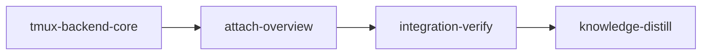

# Plan: Configurable tmux Terminal Backend

> Where prose and YAML metadata differ, the YAML metadata is authoritative.

## Overview

Add tmux as a user-selectable alternative to the native terminal-window backend for hosting loom sessions, plus a `loom attach` overview screen (tiled panes, one per live session). The old tmux implementation (removed in `8b0ce1a6`) never worked reliably — a single tmux server hosted every session and crashed under load, taking the whole run down. This plan does **not** resurrect any of that code. The new backend reuses the current, proven native spawn machinery (wrapper script → PID file → real claude PID) and replaces exactly one step — "open a terminal window" — with "start a dedicated tmux server hosting this one session". A tmux fault can then kill at most one session, which loom's existing crash-detection and retry machinery already recovers.

## Why the old tmux support failed (failure analysis only — NOT a template)

The removed implementation had five structural defects. They are listed so the new design demonstrably avoids each; no code is to be copied from git history.

1. **N-into-1 topology.** One tmux server multiplexed every Claude session. Claude Code's TUI redraws its full screen continuously on the alternate buffer; N sessions meant N full-screen escape-sequence streams parsed by one single-threaded server process. Server crash = every session dead = run dead.
2. **FD pressure.** Per-pane `pipe-pane` logging added an FD and a write per output chunk on top of each pane's PTY, against default `ulimit -n 1024` (the old README explicitly warned this "can cause tmux to crash under load").
3. **Inert mitigations.** The stability options it set (`c0-change-trigger`/`c0-change-interval`) were removed from tmux in 2.1+; the calls failed silently. `history-limit` is irrelevant to an alternate-screen TUI. The tuning never did anything.
4. **Racy spawn.** Commands were typed into a shell via `send-keys` with sleeps and Enter-retries, plus zombie-session heuristics (`is_agent_running` matching `pane_current_command`).
5. **Wrong PID.** It tracked the pane's shell PID (`#{pane_pid}`), not claude, and asked tmux (`has-session`) whether the agent was alive — coupling liveness truth to the very process that kept crashing.

## How the new backend works

The native spawn path today (`orchestrator/terminal/native/`): build the claude command → `create_wrapper_script()` writes `.work/wrappers/<pid_key>-wrapper.sh` (exports `LOOM_*` env, `cd`s into the cwd, writes `$$` to `.work/pids/<pid_key>.pid`, then `exec`s claude, so the recorded PID **is** the claude process) → open a terminal window running the wrapper → poll the PID file → record the PID on the `Session`. Liveness is layered PID checks; kill is a guarded terminate that never signals a recycled PID. All of this post-dates the tmux removal and works.

The tmux backend changes only the hosting step:

    tmux -L loom-<session-id> new-session -d -s <tracking-key> -x 220 -y 50 -c <cwd> <wrapper.sh>

- **One tmux server per session.** The `-L loom-<session-id>` socket names a dedicated server, spawned implicitly by `new-session`. Each server parses exactly one Claude TUI stream — the workload of a person running Claude Code inside tmux, which is routine. The N-into-1 topology is deleted, not tuned.
- **Same identity machinery.** Same wrapper script, same PID file, same real claude PID on the session. **tmux is never consulted for liveness** — `is_session_alive` uses *exactly* the native PID layers and native's final window-title fallback is simply dropped, not replaced. (An earlier draft put `tmux has-session` in that slot. That is wrong and is now forbidden: a server whose pane process has died but which has not yet reaped itself would report *alive*, the monitor would never file the crash, and retry would never fire — defeating the containment claim this plan is built on. The PID layers are authoritative and backend-independent.) Kill = a best-effort `tmux -L <socket> kill-server` plus the existing guarded PID terminate; the server also exits on its own when its only pane's process ends (tmux `exit-empty` default).
- **`new-session` exit status is not evidence of success.** Verified on tmux 3.7b: when the server cannot create its socket, tmux prints `error creating <path> (Operation not permitted)` to stderr and **still exits 0**. Every tmux spawn must therefore be confirmed with a follow-up `tmux -L <socket> has-session -t <name>` (exit 0) and must treat non-empty `new-session` stderr as failure. Trusting the exit code alone is the silent-failure trap in CLAUDE.md Rule 13.
- **No pipe-pane logging. No send-keys.** The wrapper is passed directly as the `new-session` command; the pane process *is* the wrapper/claude.
- **Blast radius = 1 session.** If a server dies, exactly one claude dies. The monitor's existing PID-liveness poll flags the session crashed within one 5s tick; the existing crash-report + retry/backoff respawns the stage — the same path that fires today when a native terminal window is closed mid-run. The daemon, `.work/` state, and orchestration never live inside tmux.
- **Fail-open fallback.** If tmux is missing at startup, loom warns and runs natively. If a tmux spawn fails mid-run, the backend retries that spawn natively and writes a `.work/terminal-backend-fallback` marker so subsequent spawns skip tmux — the same pattern as `.work/remote_control-unsupported`.
- **Marker lifecycle (decided here, not deferred).** The marker lives in `.work/`, so it persists across daemon restarts *and* across `loom run` invocations, exactly like `remote_control-unsupported`, which nothing ever deletes. That is deliberate but it must be escapable: `loom run --backend tmux` **deletes** the marker before writing the config (an explicit operator re-selection is a request to try tmux again), and `loom clean --state` removes it with the rest of `.work/`. Nothing else clears it. This is the only marker-clearing path; do not invent others.
- **Session-recorded backend.** Each session file records which backend hosts it (`backend: native|tmux`, serde default `native` for legacy files), and kill/liveness dispatch on the session's recorded backend, not the currently-configured one — a config flip mid-run still targets old sessions correctly.

The residual coupling is inherent to tmux: a pane's process is a child of its server. The design answers with containment (one session per server) and recovery (existing retry), not prevention. Native remains the default backend.

## Configuration surface

- `.work/config.toml` gains a `[terminal]` section: `backend = "native" | "tmux"`, seeded at `loom init` like `[remote_control]` (a documented, editable toggle). Read/written via new `read_terminal_config` / `write_terminal_config` helpers in `fs/work_dir.rs`, mirroring `read_remote_control_config` / `write_remote_control_config` (`TERMINAL_SECTION` const beside `REMOTE_CONTROL_SECTION`).
- **`loom init` chooses the backend up front.** `loom init --backend <native|tmux>` seeds the section programmatically (no prompt). Without the flag, init **asks the user interactively** ("Terminal backend for sessions [native/tmux] (native):") when stdin+stdout are TTYs — mirroring the existing `IsTerminal` + `read_line` confirm pattern in `commands/clean.rs` — and silently defaults to `native` when not a TTY, so scripted/programmatic init never hangs. Empty answer → native; invalid answer → re-prompt; EOF → native. If tmux is chosen but not installed, init warns (advisory) and seeds it anyway.
- `loom run --backend <native|tmux>` persists a changed choice to `[terminal]` before the daemon starts, and `--backend tmux` additionally **clears the fallback marker** (an explicit re-selection is a request to retry tmux). Sticky; verified that the daemon uses a real double-fork and re-reads `.work/config.toml`, so no env plumbing or `--backend` passthrough is needed. Startup preflight only warns when tmux is selected but missing — it never rewrites the config. Both `loom run` paths need this: the backgrounded `execute_background` **and** `--foreground`'s `execute`.
- `loom attach [stage-id]` (tmux backend only): with no argument, builds a tiled overview session on a dedicated `loom-view` server whose panes each run an attach client to one live session's server; with a stage id, exec's a direct `tmux -L loom-<session-id> attach`. Both paths refuse to run when stdout is not a TTY, before any `exec`.

## Implementation lanes (codex + claude)

The codex plugin (`codex@openai-codex`, user scope) is installed, and `tmux-backend-core` sets `implementers: ["codex", "claude"]` to license BOTH lanes — codex preferred for routine implementation, Claude subagents available alongside it in the same stage. Codex is used **selectively, for the simplest, fully-enumerated mechanical work only**; design-bearing and security-sensitive work stays on Claude subagents. Both lanes share ONE file-ownership table: exclusivity is enforced across lanes, not within one. Verification never delegates — each stage's opus orchestrator compiles, tests, lints, fixes, and commits.

| Unit                                    | Lane                                                    | Why                                                                                    |
| --------------------------------------- | ------------------------------------------------------- | -------------------------------------------------------------------------------------- |
| Stage 1 F — foundation (types/config/field) | `loom-software-engineer` (sonnet), spawned ALONE and green before any other subagent | Shared contract the others compile against; sequencing, not orchestrator work           |
| Stage 1 A — TmuxBackend + wrapper       | `loom-software-engineer` (sonnet)                       | The design-bearing module (spawn semantics, PID extraction, fallback marker)           |
| Stage 1 B — call-site rewiring          | `codex:codex-rescue` (gpt-5.6-luna, xhigh, foreground)  | Purely mechanical: an enumerated list of rename/replace edits at known call sites      |
| Stage 1 C — CLI flags, init prompt, seeding, cleanup | `codex:codex-rescue` (gpt-5.6-luna, xhigh, foreground) | Small, fully-specified edits with exact anchors (run/init flags, TTY prompt mirroring clean.rs, seed call, sweeps, completions) |
| Stage 2 — attach command                | `loom-software-engineer` (sonnet)                       | New user-facing command with exec/nesting semantics; needs judgment                    |
| integration-verify, knowledge-distill   | opus orchestrator + claude review/engineer subagents    | Bookends never use codex                                                               |

Codex ground rules (restated in the stage YAML, which is what the executing agent sees): codex subagents run in the **foreground** with `--model gpt-5.6-luna --effort xhigh`, own **disjoint file sets**, must **never run git**, and must never touch the loom work-state directory (the `.work` symlink) — after each codex run the orchestrator inspects `git status --short` and reverts anything outside that subagent's file set.

**Codex concurrency is fine here; codex maturity is the real risk.** Spawning A–D in one message is explicitly sanctioned: `doc/loom/knowledge/architecture/codex-concurrency.md` records foreground fan-out over disjoint file sets as verified safe up to 6 (background fan-out is the forbidden mode, and this plan uses none). But the same page records that no stage has *ever* actually run with codex listed in `implementers` — the evidence is a direct `codex-companion` spike, one level below the subagent wrapper. So the orchestrator should treat B and C as the highest-risk delegations of the stage: expect an "appears hung" heartbeat warning on long foreground runs (advisory; nothing is killed), and if either returns without a coherent file-change report, take that unit over on Claude rather than retrying blind. `subagent_timeout_secs: 900` raises the per-stage budget, but CLAUDE.md Rule 6 still caps any single wait at 300s — re-arm three times rather than blocking once for 15 minutes.

## Out of scope: remote-control eligibility on macOS Keychain

This fix is already on `main` and is **not** part of any stage here. `remote_control_eligible()`
accepts either `~/.claude/.credentials.json` or, on macOS, a `security find-generic-password -s
"Claude Code-credentials"` exit 0. `remote_control.rs` is in no subagent's file set.

Two constraints in that code must not be regressed by work in this plan:

- The Keychain lookup never passes `-w`. Without it `security` prints nothing and never triggers a
  Keychain-unlock prompt, which is what makes it safe to call on a spawn path.
- The platform check is a runtime `cfg!(target_os)` inside the function body, not a `#[cfg]`
  attribute on the function. Gating the function leaves the argv builder with no non-test caller on
  Linux, and CI runs `clippy --all-targets -D warnings` on ubuntu-latest, where the `--lib` target
  then fails on dead code while passing locally on macOS.

## Goals

- tmux backend selectable via `[terminal] backend` and `loom run --backend`, default native, fully wired into every spawn/kill/liveness path.
- Crash containment: a tmux server fault affects one session; runs never die with tmux.
- `loom attach` overview + direct attach.

## Non-goals

- No shared-server tmux mode (single point of failure — the old failure).
- No `pipe-pane` session logging.
- No resurrection of the removed `TerminalBackend` trait / `BackendDispatcher` machinery; a small concrete enum-dispatch wrapper is enough for two lanes.
- No Windows support (the terminal module is Unix-only today and stays so).
- `spawn_base_conflict_session` (`native/mod.rs`, zero callers — pre-existing dead code) is NOT carried onto the new wrapper; it stays untouched on `NativeBackend` and is recorded to memory as a concern.

## Pre-run requirement

**tmux 3.7b is already installed on this machine** (`/opt/homebrew/bin/tmux`) — verified during pressure-testing; no install step is needed. The `tmux -V` acceptance entry stays as a fail-fast guard for other machines.

**The real prerequisite is the sandbox, not the binary.** Verified during pressure-testing: inside a Claude Code sandbox, `tmux new-session -d` cannot create its socket (`error creating /private/tmp/tmux-501/<name> (Operation not permitted)`) and still exits 0; unsandboxed, the identical command succeeds. Two consequences the executor must act on:

1. `loom` never emits plan `allow_write` paths into `sandbox.filesystem.allowWrite` — that is a deliberate refusal (`src/sandbox/settings.rs`, the "Do NOT emit allowWrite" comment block); `allow_write` becomes only tool-level `permissions.allow: Write(...)` entries. So **no plan-level `allow_write` entry can grant tmux OS-level write access to its socket directory.** The only lever the plan has is `excluded_commands` (which already lists `tmux` and `cargo`), and whether that truly exempts a process tree from the OS sandbox is explicitly unresolved in `doc/loom/knowledge/mistakes/sandbox-and-settings.md`.
2. Therefore the e2e test must not depend on the default socket directory being writable: it sets `TMUX_TMPDIR` to a short directory it creates under `std::env::temp_dir()`, and restores it afterwards (details in the stage YAML). If tmux socket creation is still blocked, that is a **blocker to report**, not to work around — see CLAUDE.md Rule 13.

## Execution Diagram



`knowledge-bootstrap` is skipped: `doc/loom/knowledge/` is populated and `loom knowledge check` reports 100% source coverage (18/18 areas).

## Stages

### 1. tmux-backend-core

**Purpose:** the single implementation stage for the backend — selection config, the `SessionBackend` dispatch wrapper, the `TmuxBackend`, rewiring of every construction/spawn/kill/liveness call site, the `--backend` CLI flag, init seeding, cleanup sweeps, preflight/fallback, the session `backend` field, and an e2e test against real tmux.

**Out of scope:** the remote-control Keychain eligibility fix is already on `main`.
`remote_control.rs` belongs to no subagent in this stage.

**Necessity (why ONE stage):** the pieces form one compile unit (backend enum ↔ call sites ↔ config) — splitting by layer would be compile-order fragmentation, not merge-order dependency (Stage Necessity Q1–Q4 all answer NO for any split). A **foundation subagent (F)** lands the shared types (`SessionBackendKind`, `Session.backend`, `TerminalConfig`, `[terminal]` config helpers) and must be green before the remaining subagents fan out in one message. F is spawned ALONE and sequentially — that ordering is what lets its struct-literal fixups touch files B and C later own without conflict. The orchestrator delegates it like any other unit and never edits files itself.

**Subagents and file ownership (disjoint; foundation files frozen before fan-out):**

| Subagent                        | Lane            | Files Owned                                                                                                                                                                                                                                        | Files Read-Only                                          |
| ------------------------------- | --------------- | --------------------------------------------------------------------------------------------------------------------------------------------------------------------------------------------------------------------------------------------------- | -------------------------------------------------------- |
| A — TmuxBackend + SessionBackend | sonnet          | `terminal/mod.rs`, `terminal/backend.rs` (new), `terminal/tmux/` (new), `terminal/native/spawner.rs`, **`terminal/native/mod.rs`**, `tests/e2e/tmux_backend.rs` (new), `tests/e2e/mod.rs`                                                            | `native/pid_tracking.rs`, session types                  |
| B — call-site rewiring          | codex           | `orchestrator/liveness.rs`, `orchestrator/mod.rs`, `orchestrator/core/{orchestrator,stage_executor,merge_handler,completion_handler,event_handler,crash_handler}.rs`, `orchestrator/auto_merge.rs`, `orchestrator/continuation/mod.rs`, `commands/sessions.rs`, `commands/stage/{state,merge_resolver,skip_retry}.rs` | `terminal/backend.rs` (contract)                         |
| C — CLI flags, init prompt, seeding, cleanup | codex | `cli/types.rs`, `cli/dispatch.rs`, `completions/dynamic/commands.rs`, `commands/run/{mod,foreground}.rs`, `commands/init/{execute,plan_setup,cleanup}.rs`, **`commands/init/tests.rs`**, `commands/clean.rs`, **`tests/e2e/uncommitted_changes.rs`** | `fs/work_dir.rs`, `terminal/backend.rs`                  |

**Ownership corrections made during pressure-testing (do not revert these — each one was a compile-breaking or unreachable-symbol gap):**

- **`terminal/native/mod.rs` moved from A's read-only list to A's owned list.** Everything the tmux lane must reuse is currently unreachable from a sibling module: `fn build_claude_command` and `fn window_title_and_pid_key` are private; `mod pid_tracking;` and `mod spawner;` are *private modules* whose `pub use` re-export line omits `pid_matches_entry` entirely and exposes only `spawn_in_terminal` from the spawner. And the plan simultaneously told A to *extract* a helper out of that same read-only file. A now owns it and makes a closed list of visibility/re-export changes (enumerated in the YAML) plus the extraction. No other subagent touches the file.
- **`commands/init/tests.rs` added to C.** It contains four `initialize_with_plan(...)` call sites; C adds a parameter to that function, so without this the stage cannot compile.
- **`tests/e2e/uncommitted_changes.rs` added to C.** It calls `run::execute(manual, max_parallel, watch, auto_merge)` positionally at three sites; C adds a `backend` parameter.
- **`orchestrator/core/crash_handler.rs` added to B.** It writes `.work/remote_control-unsupported` for *any* session that dies within 15s of spawn — on the tmux lane a hosting failure would silently disable Remote Control for the rest of the run. B gates that write on the session's recorded backend.

**Key mechanics (full detail in YAML):** socket per session named `loom-<session.id>` (verified: session ids are `session-<8hex>-<unix-ts>` ≈ 27 chars, so the socket path is ≈ 46 bytes — far under the 104-byte `sun_path` limit; never key sockets on stage ids, whose `MAX_ID_LENGTH` is 128); pid_key stays `tracking_key + "-" + session.id`; PID acquisition extracted from `spawn_in_terminal` into a shared `await_session_pid` used by both lanes; kill = best-effort `kill-server` + the guarded PID terminate; **liveness = the native PID layers only — no tmux call**; fallback marker (`terminal-backend-fallback` under the work dir, mirroring `remote_control`'s `UNSUPPORTED_MARKER` mechanics) written on tmux spawn failure with a one-shot native retry.

**Acceptance:** the repo's canonical gate verbatim — `tmux -V`, `cargo build --all-targets`, `cargo fmt --check`, `cargo clippy --all-targets -- -D warnings`, `cargo test --all-targets` (CI uses `--all-targets`, not `--all`; see `.github/workflows/ci.yml`), plus `cargo test --test e2e tmux_backend` piped through a positive-count assertion; wiring proofs on the orchestrator construction site, liveness routing, init seeding, clean sweep, and Keychain fallback; `loom run --help` and `loom init --help` must both list `--backend`; before/after delta-proofs on `TmuxBackend` and `read_terminal_config`.

### 2. attach-overview

**Purpose:** `loom attach [stage-id]` — tiled overview of all live tmux sessions (viewer session `loom-overview` on dedicated socket `loom-view`, one nested attach client per pane, `remain-on-exit on`, tiled layout) and direct attach to one stage's session; clean error on the native backend.

**Necessity (separate stage):** Q2 file overlap — it edits `cli/types.rs`, `cli/dispatch.rs`, and `completions/dynamic/commands.rs`, which stage 1 subagent C also edits, so it must serialize after `tmux-backend-core`; it also compiles against the merged `TmuxBackend` socket API.

**Subagents:** ONE `loom-software-engineer` (sonnet) with the full YAML spec; the opus orchestrator verifies and commits. The overview steps (kill stale viewer → `new-session -d` → `split-window` per session → `select-layout tiled` → `remain-on-exit on` → exec attach) are implemented as a pure `build_overview_argv` builder so pane count, socket names, layout, and TMUX-stripping are unit-testable without tmux.

**Acceptance:** full gate; `loom --help` lists `attach`; `loom attach --help` exits 0; before/after delta-proof on the `Attach` dispatch arm.

### Integration Verification

Full gate (fmt, clippy `--all-targets` as errors, full tests, build, real-tmux e2e), parallel `loom-code-reviewer` subagents (security: shell-command construction in the tmux spawn path and the `security(1)` invocation; architecture: the `SessionBackend` dispatch and lazy native lane; test coverage), all findings fixed; functional proof that `--backend` and `attach` are live and the fallback-marker unit test truly asserts the lane. Bookends never use codex.

### Knowledge Distillation

Curate stage memories into knowledge — the backend architecture routes to tier-2 `architecture/terminal-backends` (it exceeds 40 lines) with a summary + link in `architecture.md`; entry-points/mistakes/concerns inline where small; `loom knowledge index` last, then `loom review`. Update README: Terminal Backends section (native default, `[terminal]` toggle, `--backend`, per-session servers and why, `loom attach`, tmux install requirement, fallback-marker semantics) and the remote-control eligibility wording (macOS Keychain).

---

<!-- loom METADATA -->

```yaml
loom:
  version: 1
  sandbox:
    enabled: true
    auto_allow: true
    excluded_commands: ["loom", "git", "cargo", "claude", "tmux"]
    filesystem:
      deny_read: ["~/.ssh/**", "~/.aws/**", "~/.config/gcloud/**", "~/.gnupg/**"]
      deny_write: ["doc/loom/knowledge/**"]
      allow_write: ["loom/**", "doc/**", "README.md", ".github/workflows/**"]
    network:
      allowed_domains: []
      additional_domains: []
      allow_local_binding: false
      allow_unix_sockets: ["/tmp/tmux-*/**", "/private/tmp/tmux-*/**"]
  stages:
    - id: tmux-backend-core
      name: "Tmux Backend Core"
      stage_type: standard
      model: "opus"
      reasoning_effort: "xhigh"
      implementers: ["codex", "claude"]
      subagent_timeout_secs: 900
      description: |
        Implement the configurable tmux terminal backend. Work happens in the
        loom/ crate (working_dir is loom). Line numbers below are advisory
        anchors from planning time - always locate edits by the quoted SYMBOL
        and snippet, not the line number.
        Use parallel subagents and skills to maximize performance.

        DO NOT copy code from the removed tmux implementation in git history
        (commit 8b0ce1a6 and earlier). It is a known-broken design (shared
        server, send-keys typing, pane-PID tracking, tmux-based liveness).
        The new backend reuses the CURRENT native wrapper/PID machinery.

        IMPLEMENTATION LANES: this stage licenses BOTH lanes and you pick the
        lane PER SUBAGENT - listing codex never makes it mandatory. EVERY line
        of implementation is delegated; you write none of it. Subagent F
        (foundation) = loom-software-engineer (sonnet), spawned ALONE and green
        before anything else. Subagent A = loom-software-engineer (sonnet): the
        design-bearing module, and it stays on sonnet even though codex is the
        stage's preferred lane for routine work. Subagents B and C =
        codex:codex-rescue, spawned in the FOREGROUND, each with "--model
        gpt-5.6-luna --effort xhigh", an explicit Bash timeout of 900000 ms,
        and a DISJOINT file set. Keep ONE file-ownership table across both
        lanes: exclusivity is enforced across lanes, not within one.
        Verification and all git operations stay with YOU, the stage main
        agent - that is your whole job, along with decomposition.

        remote_control.rs is NOT part of this stage and is owned by no subagent.

        CODEX GROUND RULES (include verbatim in B's and C's prompts, after the
        standard subagent preamble): you must NOT run git at all - no add, no
        commit, no status side effects; you must NOT create, read, or write
        anything under the loom work-state directory (the ".work" symlink at
        the repo root) or under any path outside your owned file list; report
        files changed when done. MAIN AGENT: after EACH codex run, inspect
        git status --short and revert any change outside that subagent's
        owned files before proceeding.

        SUBAGENT F - FOUNDATION (loom-software-engineer, sonnet). YOU DO NOT
        WRITE THIS CODE. Spawn F ALONE, with no other subagent running, and do
        not spawn A/B/C until F has reported AND you have confirmed the crate
        compiles green. F owns every file it touches for the duration; that
        exclusive window is what lets its struct-literal fixups land in files
        A/B/C later own. Your job here is decomposition, then verification -
        you are opus, and an orchestrator that spends its context implementing
        has none left to verify with.
        F's assignment, in full:
        1. models/session/types.rs - add after SessionStatus:
             #[derive(Debug, Clone, Copy, Serialize, Deserialize, PartialEq, Eq, Default)]
             #[serde(rename_all = "lowercase")]
             pub enum SessionBackendKind { #[default] Native, Tmux }
           with a Display impl (native / tmux), and add to struct Session (after
           tracking_key, same "Runtime identity" section):
             #[serde(default)]
             pub backend: SessionBackendKind,
           Initialize backend: SessionBackendKind::Native in Session::new()
           (models/session/methods.rs, the struct literal that currently ends
           with tracking_key: String::new()). Expect ~15-20 struct-literal
           breakages across src/ AND tests/ (see knowledge
           mistakes/sessions-and-liveness.md) - run cargo test --all-targets to surface
           them, fix each with an explicit backend: field or ..spread.
           SCOPE NOTE: these fixups land in files later owned by subagents B
           and C. That is fine BECAUSE F runs sequentially and alone - it must
           be complete and green BEFORE A/B/C are spawned. F does every
           struct-literal fixup itself; do not defer any to a later subagent.
        2. models/session/types.rs - add:
             #[derive(Debug, Clone, Default, Serialize, Deserialize, PartialEq)]
             pub struct TerminalConfig {
                 #[serde(default)]
                 pub backend: SessionBackendKind,
             }
           RATIONALE (corrected during pressure-testing - do NOT "fix" this
           back): the earlier stated reason was that models placement avoids an
           "fs -> orchestrator cycle". That reason is FALSE - fs/work_dir.rs
           already does `use crate::remote_control::RemoteControlConfig;`, and
           Rust has no intra-crate module-cycle restriction. The REAL reason is
           sequencing: the foundation must compile green BEFORE subagent A
           creates terminal/backend.rs, so TerminalConfig cannot live there.
           models/session/types.rs is the only place that exists at foundation
           time and already owns SessionBackendKind.
        3. fs/work_dir.rs - mirror the remote-control section helpers exactly.
           The concrete anchors (verified): the generic helpers are
           `fn read_section<T: DeserializeOwned>(work_dir, section) -> Result<Option<T>>`
           and its `write_section` sibling; the consts PLAN_SANDBOX_SECTION and
           REMOTE_CONTROL_SECTION sit together; read_remote_control_config is
           literally `Ok(read_section(work_dir, REMOTE_CONTROL_SECTION)?.unwrap_or_default())`.
           Add, in the same style:
             const TERMINAL_SECTION: &str = "terminal";
             pub fn read_terminal_config(work_dir: &Path) -> Result<TerminalConfig>   // missing section => default
             pub fn write_terminal_config(work_dir: &Path, config: &TerminalConfig) -> Result<()>
           Add round-trip + missing-section-defaults unit tests mirroring the
           existing remote-control config tests in src/remote_control.rs.

        AFTER F has reported and YOU have confirmed the crate compiles green,
        spawn subagents A, B and C in ONE message.

        SUBAGENT FILE ASSIGNMENTS (file sets are DISJOINT; the foundation
        files are frozen before fan-out):

          Subagent A - TmuxBackend + SessionBackend wrapper (sonnet):
            Files Owned: src/orchestrator/terminal/mod.rs,
                         src/orchestrator/terminal/backend.rs (new),
                         src/orchestrator/terminal/tmux/ (new),
                         src/orchestrator/terminal/native/spawner.rs,
                         src/orchestrator/terminal/native/mod.rs,
                         tests/e2e/tmux_backend.rs (new), tests/e2e/mod.rs
            Files Read-Only: src/orchestrator/terminal/native/pid_tracking.rs,
                         src/models/session/types.rs, src/fs/work_dir.rs
            WHY A OWNS native/mod.rs (corrected during pressure-testing): the
            two helpers the tmux lane must reuse are PRIVATE in that file -
            `fn build_claude_command(...)` (module-private, no pub) and
            `fn window_title_and_pid_key(session)` (private associated fn). A
            sibling `tmux` module cannot reach either, and the extraction task
            below edits that same file. A owns it; nobody else touches it.
            A's ONLY permitted edits to native/mod.rs are the visibility /
            re-export changes listed here, the launch-preparation extraction
            described in SUBAGENT A DETAIL, and the mechanical call-site
            updates those force. spawn_base_conflict_session stays exactly as
            it is.
            THE FULL VISIBILITY LIST (verified - `mod pid_tracking;` and
            `mod spawner;` are PRIVATE modules of `native`, and the
            `pub use pid_tracking::{...}` line re-exports only
            cleanup_stage_files / create_wrapper_script / read_pid_entry /
            read_pid_file). A sibling `tmux` module therefore cannot reach
            `pid_matches_entry` or anything in `spawner` today. A must:
              * `fn build_claude_command`      -> `pub(crate) fn`
              * `fn window_title_and_pid_key`  -> `pub(crate) fn`
              * add `pid_matches_entry` (and `discover_claude_pid` if the
                shared PID wait needs it) to the existing
                `pub use pid_tracking::{...}` list
              * add `pub use spawner::await_session_pid;` beside the existing
                `pub use spawner::spawn_in_terminal;`
              * export the new `prepare_session_launch` as `pub(crate)`
            Do NOT widen anything beyond this list.
          Subagent B - call-site rewiring (codex:codex-rescue, foreground):
            Files Owned: src/orchestrator/liveness.rs, src/orchestrator/mod.rs,
                         src/orchestrator/core/orchestrator.rs,
                         src/orchestrator/core/stage_executor.rs,
                         src/orchestrator/core/merge_handler.rs,
                         src/orchestrator/core/completion_handler.rs,
                         src/orchestrator/core/event_handler.rs,
                         src/orchestrator/core/crash_handler.rs,
                         src/orchestrator/auto_merge.rs,
                         src/orchestrator/continuation/mod.rs,
                         src/commands/sessions.rs, src/commands/stage/state.rs,
                         src/commands/stage/merge_resolver.rs,
                         src/commands/stage/skip_retry.rs
            Files Read-Only: src/orchestrator/terminal/backend.rs (contract below)
          Subagent C - CLI flags, init prompt, seeding, preflight, cleanup
          (codex:codex-rescue, foreground):
            Files Owned: src/cli/types.rs, src/cli/dispatch.rs,
                         src/completions/dynamic/commands.rs,
                         src/commands/run/mod.rs, src/commands/run/foreground.rs,
                         src/commands/init/execute.rs,
                         src/commands/init/plan_setup.rs,
                         src/commands/init/cleanup.rs,
                         src/commands/init/tests.rs,
                         src/commands/clean.rs,
                         tests/e2e/uncommitted_changes.rs
            Files Read-Only: src/fs/work_dir.rs, src/orchestrator/terminal/backend.rs
            WHY THE TWO TEST FILES ARE OWNED (added during pressure-testing;
            without them the stage cannot compile):
              - src/commands/init/tests.rs has FOUR initialize_with_plan(...)
                call sites plus its import; C adds a parameter to that fn.
              - tests/e2e/uncommitted_changes.rs calls
                run::execute(manual, max_parallel, watch, auto_merge)
                POSITIONALLY at three sites; C adds a backend parameter.
                (run::execute lives in src/commands/run/foreground.rs and is
                re-exported from src/commands/run/mod.rs.)
            C's edits to both test files are mechanical argument updates only -
            pass None / SessionBackendKind::Native and change nothing else.
        NO FILE OVERLAP between subagents confirmed. B and C code against the
        SessionBackend contract below without waiting for A; the main agent
        compiles/fixes after all report.

        SESSIONBACKEND CONTRACT (Subagent A implements in
        src/orchestrator/terminal/backend.rs; B and C compile against it):
          pub struct SessionBackend { /* work_dir, configured kind, lanes */ }
          impl SessionBackend {
            pub fn from_config(work_dir: PathBuf) -> Result<Self>
            pub fn spawn_session(&self, stage: &Stage, worktree: &Worktree, session: Session, signal_path: &Path) -> Result<Session>
            pub fn spawn_merge_session(&self, stage: &Stage, session: Session, signal_path: &Path, repo_root: &Path) -> Result<Session>
            pub fn spawn_knowledge_session(&self, stage: &Stage, session: Session, signal_path: &Path, repo_root: &Path) -> Result<Session>
            pub fn kill_session(&self, session: &Session) -> Result<()>
            pub fn is_session_alive(&self, session: &Session) -> Result<bool>
            pub fn backend_kind(&self) -> SessionBackendKind
          }
          Semantics:
          - from_config reads read_terminal_config(work_dir). Kind Native =>
            construct NativeBackend::new(work_dir) eagerly (today's behavior).
            Kind Tmux => record the configured kind and construct NOTHING
            eagerly; tmux must work headless where detect_terminal() fails,
            and the native lane is created lazily only when needed (fallback
            spawn, or kill/liveness of a native-recorded session - if lazy
            construction fails there, degrade to the PID-only layers).
          - FAIL-OPEN, CORRECTED (an earlier draft made this self-
            contradictory and unrunnable): from_config MUST NOT return Err
            merely because tmux is absent. Orchestrator::new does
            `let native = Arc::new(NativeBackend::new(config.work_dir.clone())?);`
            - an Err there aborts orchestrator construction before any spawn
            can reach the marker or the native retry, so a missing tmux would
            kill the whole run instead of falling back, contradicting the
            "Fail-open fallback" promise in the prose. Resolve tmux
            availability at SPAWN time instead:
              from_config: Ok(SessionBackend { .. }) always (barring a config
                read error).
              spawn_*: if configured Tmux AND the fallback marker is absent AND
                which::which("tmux") succeeds => tmux lane; otherwise native
                lane. When tmux is configured but unavailable, write the
                fallback marker, log the warning naming the fix (install tmux,
                or set the [terminal] backend back to "native"), stamp
                session.backend = Native, and proceed on the native lane.
            Put the availability check behind an injectable seam (e.g. a
            `tmux_available: fn() -> bool` field defaulting to a
            which::which("tmux") probe) so the "missing tmux selects the native
            lane" behaviour is unit-testable with no host dependency. That test
            is REQUIRED and is named `missing_tmux_falls_back_to_native_lane`.
            A CLI warning test proves nothing about lane selection.
          - FALLBACK MARKER: define in backend.rs
              const TERMINAL_BACKEND_FALLBACK_MARKER: &str = "terminal-backend-fallback";
            with marker-path derivation, existence check, best-effort write AND
            a best-effort REMOVE, mirroring remote_control.rs's
            UNSUPPORTED_MARKER trio (unsupported_marker_path /
            unsupported_marker_exists / write_unsupported_marker), rooted at
            the backend's work_dir field. Export the remove fn (e.g.
            pub fn clear_fallback_marker(work_dir: &Path)) - subagent C calls
            it from `loom run --backend tmux`.
            LIFECYCLE (decided, not deferred): the marker lives in .work/, so
            it survives daemon restarts AND separate `loom run` invocations,
            exactly like remote_control-unsupported, which nothing clears. The
            ONLY clearing paths are an explicit `loom run --backend tmux`
            (operator re-selection) and `loom clean --state` (removes .work/).
            Do not add any other clearing path, and do not clear it on daemon
            start - a silent auto-clear would re-run a known-broken lane on
            every restart.
          - spawn_*: resolve the lane per call: configured tmux AND fallback
            marker absent => tmux lane, else native lane. Stamp
            session.backend with the lane actually used BEFORE delegating, so
            the persisted session file carries it. If a tmux-lane spawn
            returns Err: log a warning, write the fallback marker, and retry
            the same spawn once on the native lane.
          - kill_session / is_session_alive dispatch on session.backend
            (NOT the configured kind): Tmux => TmuxBackend ops; Native =>
            NativeBackend ops (lazy on the tmux lane as above).
          - INVARIANT TO PRESERVE (verified during pressure-testing): the
            existing e2e test tests/e2e/daemon_config/stale_project_execution.rs
            asserts Orchestrator::new succeeds, and pins LOOM_TERMINAL=xterm
            precisely because Orchestrator::new eagerly builds a NativeBackend.
            from_config MUST keep that eager construction on the Native lane or
            that test regresses. Nobody owns that file; do not edit it.
          - spawn_base_conflict_session is intentionally NOT on the wrapper
            (zero callers repo-wide; left untouched on NativeBackend; record
            via loom memory note as pre-existing dead code).

        SUBAGENT A DETAIL (TmuxBackend, src/orchestrator/terminal/tmux/mod.rs;
        split a second file under tmux/ only if mod.rs would exceed 400 lines):
          pub struct TmuxBackend { work_dir: PathBuf }
          - socket_name(session) = format!("loom-{}", session.id). Session ids
            ("session-<uuid8>-<unixts>") keep the socket path well under the
            104-byte sun_path limit; NEVER key the socket on stage_id (up to
            128 chars). Panes/windows are named with session.tracking_key for
            human listing. pid_key stays tracking_key + "-" + session.id
            exactly as native (see window_title_and_pid_key, native/mod.rs).
          - Low-level helper (also the e2e test seam). NOTE THE &Path - tmux
            interprets its trailing argument as a SHELL command, which is a new
            quoting boundary the native lane never had. The wrapper path is an
            absolute path under the user's repo and may contain spaces, quotes
            or metacharacters, so take it typed and shell-escape it exactly
            once here (shell_escape::escape, already a dependency used in
            native/mod.rs and pid_tracking.rs). Never accept a pre-joined
            string. Pure-builder unit tests MUST cover a path with a space, a
            single quote, and a `$`/`;` metacharacter:
              pub(crate) fn spawn_in_tmux(socket: &str, session_name: &str, cwd: &Path, command: &Path) -> Result<()>
            runs: tmux -L <socket> new-session -d -s <session_name> -x 220 -y 50 -c <cwd> <command>
            then best-effort: tmux -L <socket> set-option -g status off
            No send-keys anywhere. No pipe-pane anywhere.
            SUCCESS DETECTION - READ THIS, THE OBVIOUS CHECK IS WRONG.
            Verified on tmux 3.7b: when the server cannot create its socket,
            tmux prints `error creating <path> (Operation not permitted)` on
            stderr and STILL EXITS 0. An exit-code check alone therefore
            reports a total failure as success (CLAUDE.md Rule 13). Treat the
            spawn as successful ONLY when ALL THREE hold:
              1. new-session exit status is 0, AND
              2. its stderr is empty, AND
              3. a follow-up `tmux -L <socket> has-session -t <session_name>`
                 exits 0.
            Otherwise return Err carrying the captured stderr verbatim. Use
            std::process::Command with .output() (not .status()) so stderr is
            actually captured. Add a unit test for the argv builder AND assert
            in the e2e that a deliberately bogus socket directory
            (TMUX_TMPDIR pointed at a non-writable path) yields Err, not Ok -
            that test is what pins this behaviour.
            NOTE: has-session here is a SPAWN-TIME success probe. It is NOT a
            liveness source; see is_session_alive below, which must not call
            tmux at all.
          - spawn(kind, ...): EXTRACTION IS MANDATORY, NOT OPTIONAL.
            An earlier draft said "mirror the ~30 lines" if extraction is
            awkward. That estimate was wrong: the assembly block in
            NativeBackend::spawn runs from the cwd UTF-8 check to the
            wrapper-path canonicalize - roughly 118 lines - and contains
            SIX behaviours that must not diverge between lanes:
              (a) session.session_type = kind; session.assign_to_stage(stage.id)
                  and the derived title / wrapper_stage_id;
              (b) pid_key = format!("{}-{}", title, session.id);
              (c) the four-arm initial-prompt match (Stage / Merge /
                  BaseConflict / Knowledge, including the `ultracode` suffix)
                  and its shell escaping;
              (d) the model/effort POLICY (Merge and BaseConflict force
                  ("opus","xhigh"); Stage and Knowledge use
                  stage.effective_model() / effective_reasoning_effort());
              (e) the permission mode resolved via
                  fs::work_dir::read_plan_sandbox + sandbox::merge_config;
              (f) find_claude_path() + remote_control::resolve(work_dir) +
                  build_claude_command + create_wrapper_script + canonicalize.
            Copying these by hand is how the tmux lane silently loses
            --permission-mode or --remote-control. So: in native/mod.rs (which
            A now owns), extract (a)-(f) into
              pub(crate) fn prepare_session_launch(
                  work_dir: &Path, kind: SessionType, stage: &Stage,
                  session: Session, signal_path: &Path, cwd: &Path,
              ) -> Result<(Session, String, String, PathBuf)>
            returning (session-with-tracking-key, title, pid_key,
            wrapper_path_abs). NativeBackend::spawn calls it and then does only
            spawn_in_terminal + set_worktree_path + set_pid + try_mark_running;
            TmuxBackend::spawn calls it and then does spawn_in_tmux +
            await_session_pid + the same three session updates.
            Also bump `fn build_claude_command` and
            `fn window_title_and_pid_key` to pub(crate) so the tmux module can
            reuse them rather than re-deriving the pid_key formula.
            IMPORTANT deviation from the native mirror: do NOT copy the
            window_exists/close_window title machinery - tmux ops replace it.
            NOTE: NativeBackend::terminal() has no non-test callers repo-wide,
            so nothing needs the emulator exposed through SessionBackend.
          - PID acquisition: extract the existing wait loop from
            native/spawner.rs spawn_in_terminal (the block that sleeps
            CLAUDE_STARTUP_DELAY_MS, polls read_pid_file up to
            PID_FILE_MAX_RETRIES, then discover_claude_pid, then falls back)
            into pub(crate) fn await_session_pid(work_dir: &Path, pid_key: &str, workdir: &Path, session_id: &str, fallback_pid: Option<u32>) -> Result<u32>
            in spawner.rs, call it from BOTH spawn_in_terminal and the tmux
            spawn path (tmux fallback_pid: None - error out if the wrapper PID
            never appears, and kill the tmux server before returning Err).
          - kill_session: best-effort tmux -L <socket> kill-server; then the
            guarded PID terminate mirroring native kill_session's PID branch
            (only signal when read_pid_entry matches - see native/mod.rs
            kill_session); then cleanup_stage_files(work_dir, pid_key).
          - is_session_alive: reuse the PID layers (read_pid_entry +
            pid_matches_entry, then session.pid + is_process_alive) identically
            to native, and then RETURN Ok(false). DO NOT call tmux.
            An earlier draft put `tmux has-session` in the slot where native
            has its window_exists fallback. That is now forbidden: a server
            whose pane process has died but which has not yet reaped itself
            answers has-session with exit 0, so the monitor would report a dead
            claude as alive, never file the crash, and never retry - which is
            precisely the containment property this whole plan exists to
            deliver. The PID layers are already authoritative and are the only
            liveness source on either lane. Add a unit test asserting
            is_session_alive is false for a session whose PID is dead even when
            a tmux server with that socket name is still running.
          - Socket housekeeping: pub(crate) fn loom_socket_dir() -> PathBuf
            honoring TMUX_TMPDIR else /tmp, joining tmux-<uid>; and
            pub(crate) fn list_loom_sockets() -> Vec<PathBuf> (files matching
            loom-* in that dir) for the clean sweeps (Subagent C calls these).
            CROSS-REPO SAFETY - REQUIRED, this is not a nicety. The tmux
            socket directory is per-USER, not per-repository, so a bare
            `loom-*` glob sees every loom socket belonging to every checkout
            this user is running. That is actively dangerous because
            `loom init` calls cleanup_orphaned_sessions() UNCONDITIONALLY, and
            it does so BEFORE the `.work/ already initialized` bail - so
            `loom init` in repo B would reach in and kill repo A's live
            session servers mid-run. Two mandatory mitigations:
              1. list_loom_sockets(work_dir: &Path) takes the work dir and
                 returns ONLY sockets whose session id has a matching
                 <work_dir>/sessions/<id>.md file, plus (for the orphan sweep)
                 those whose id matches no session file in ANY known repo -
                 which the callers cannot determine, so the safe rule is:
                 NEVER kill a socket you cannot positively attribute to THIS
                 work dir. An unattributable socket is left alone and merely
                 reported.
              2. The viewer socket must not be the fixed global name
                 "loom-view" either (two repos would fight over one overview);
                 see the attach stage - it is namespaced per work dir.
            Add a unit test that two distinct work dirs never see each other's
            sockets in list_loom_sockets.
          - terminal/mod.rs: add pub mod backend; pub mod tmux; re-export
            SessionBackend and TmuxBackend.
          - tests/e2e/tmux_backend.rs (+ `pub mod tmux_backend;` in
            tests/e2e/mod.rs - the module registration is NOT optional, see the
            after_stage guard below): gated hard on tmux being installed (the
            stage acceptance runs tmux -V first, so do NOT silently skip).
            SANDBOX ISOLATION - REQUIRED, this is why the test would otherwise
            fail. Verified during pressure-testing: inside a Claude Code
            sandbox `tmux new-session -d` cannot create a socket under the
            default dir (`error creating /private/tmp/tmux-<uid>/<name>
            (Operation not permitted)`) and still exits 0; unsandboxed the
            same command succeeds. loom deliberately never emits plan
            allow_write into sandbox.filesystem.allowWrite (see the "Do NOT
            emit allowWrite" comment in src/sandbox/settings.rs), so NO plan
            config can grant that write. Therefore the test MUST:
              * create a short temp dir under std::env::temp_dir() (e.g.
                `loom-e2e-tmux-<pid>`) and set TMUX_TMPDIR to it for the
                duration, restoring the previous value afterwards;
              * be #[serial] (it mutates process env - see knowledge
                mistakes/sessions-and-liveness.md on env-mutating tests);
              * kill-server and remove the temp dir on every exit path.
            This also stops the test from colliding with the developer's own
            tmux servers.
            Body: create a wrapper via create_wrapper_script into a tempfile
            work_dir with claude_cmd = "sleep 30" (create_wrapper_script takes
            an arbitrary command string and `exec`s it, so the PID it records
            is the sleep), spawn it via spawn_in_tmux, assert await_session_pid
            returns a live PID, assert the socket file exists, then kill via
            the TmuxBackend kill path and assert the socket is gone and the PID
            is dead.
            SECOND E2E CASE (pins the silent-failure fix): point TMUX_TMPDIR at
            a path that cannot be created/written and assert spawn_in_tmux
            returns Err - NOT Ok - even though tmux itself exits 0.
            IF tmux socket creation turns out to be blocked even with
            TMUX_TMPDIR redirected: that is a BLOCKER to report (Rule 13), not
            something to skip around. Do not add a `#[ignore]` or an
            environment sniff that lets the test vanish.
          - CI PROVISIONING IS PART OF THIS STAGE (verified gap): the e2e
            target is a normal cargo test target (loom/Cargo.toml [[test]]
            name = "e2e"), and .github/workflows/ci.yml runs
            `cargo test --all-targets` on ubuntu-latest with NO tmux install
            step - tmux is not in the GitHub Ubuntu runner image. A hard-
            failing tmux e2e therefore breaks CI the moment this stage merges.
            Add to the ci.yml `test` job, before the test step and guarded to
            the linux matrix entry:
              - name: Install tmux
                if: matrix.os == 'ubuntu-latest'
                run: sudo apt-get update && sudo apt-get install -y tmux
            The macos-latest entry only runs `cargo test --all-targets
            --no-run`, so it compiles the e2e without executing it and needs
            no tmux. Do NOT solve this by making the test skippable - that
            reintroduces exactly the silent-pass hole the acceptance gates are
            built to close. ci.yml is listed in this stage's files: as
            ../.github/workflows/ci.yml (working_dir is loom; the path is one
            level up but still inside the worktree) and .github/workflows/**
            is in the plan sandbox allow_write.
          - Unit tests in the tmux module (no tmux required): socket_name
            shape/length; spawn_in_tmux argv construction via a pure builder fn;
            and the fallback-lane test - construct a SessionBackend with
            configured kind Tmux and the fallback marker PRESENT, then assert
            on the LANE ACTUALLY CHOSEN, not merely that construction
            succeeded. Make the lane observable for that assertion (e.g. a
            `pub(crate) fn resolve_lane(&self) -> SessionBackendKind` that
            spawn_* itself calls) so the test cannot pass vacuously.

        SUBAGENT B DETAIL (codex - rewire every consumer to SessionBackend;
        every edit is an enumerated rename/replace, no design decisions):
          - orchestrator/core/orchestrator.rs: field pub(super) native:
            Arc<NativeBackend> becomes pub(super) backend: Arc<SessionBackend>;
            construction (currently Arc::new(NativeBackend::new(
            config.work_dir.clone())?) followed by LivenessService::new)
            becomes SessionBackend::from_config(config.work_dir.clone()).
          - orchestrator/liveness.rs: LivenessSource::Native(Arc<NativeBackend>)
            becomes LivenessSource::Backend(Arc<SessionBackend>);
            LivenessService::new takes Arc<SessionBackend>. Keep
            fixed_for_tests unchanged.
          - Rename every self.native.spawn_/kill_/is_session_alive call site to
            self.backend.*: stage_executor.rs (spawn_session; spawn_knowledge_session),
            merge_handler.rs (spawn_merge_session; kill_session),
            completion_handler.rs (kill_session), event_handler.rs (kill_session).
          - auto_merge.rs: the native: &NativeBackend parameter becomes
            backend: &SessionBackend (spawn_merge_session call inside).
          - continuation/mod.rs: NativeBackend::new(...) then spawn_session
            becomes SessionBackend::from_config(...) then spawn_session.
          - commands/sessions.rs, commands/stage/state.rs,
            commands/stage/merge_resolver.rs, commands/stage/skip_retry.rs:
            replace each NativeBackend::new(work_dir) construction with
            SessionBackend::from_config(work_dir); method names are unchanged.
          - orchestrator/mod.rs: extend the existing re-export line
            (pub use terminal::native::NativeBackend;) to also re-export
            SessionBackend.
          - orchestrator/core/crash_handler.rs: the fast-fail block
            (FAST_FAIL_WINDOW_SECS = 15) writes
            .work/remote_control-unsupported for ANY session that dies within
            15s of spawn while remote_control::resolve() is true. On the tmux
            lane a HOSTING failure would trip this and silently disable Remote
            Control for the rest of the run for an unrelated reason. Gate that
            write on the crashed session's recorded backend:
              if crashed_fast
                 && session.backend == SessionBackendKind::Native
                 && crate::remote_control::resolve(...)
            Leave the message text and everything else unchanged.
          - Stale comments are part of the rewiring (see knowledge
            mistakes/refactor-stragglers.md). At minimum, commands/sessions.rs
            carries `// Use the native backend for kill/liveness - all sessions
            are native.` immediately above the construction you are replacing;
            that sentence becomes false. Update it and any sibling comment that
            asserts native-only hosting.
          - Before finishing, enumerate any other NativeBackend consumers with
            rg -n "NativeBackend" src/ tests/ and route each through
            SessionBackend. ALREADY CHECKED during pressure-testing, do not
            waste a pass on them: src/orchestrator/spawner.rs and
            src/orchestrator/monitor/core.rs mention NativeBackend only in DOC
            COMMENTS (not code), and tests/e2e/daemon_config/
            stale_project_execution.rs mentions it only in a comment while
            asserting Orchestrator::new succeeds - leave all three alone except
            for correcting a doc comment that becomes false.
            Report any site you could not convert instead of leaving it
            half-wired.

        SUBAGENT C DETAIL (codex - selection UX + seeding + preflight +
        cleanup; every edit anchored below):
          - cli/dispatch.rs anchors (verified): the Init arm is
            `Commands::Init { plan_path, clean } => init::execute(Some(PathBuf::from(plan_path)), clean),`
            and the Run arm destructures { manual, max_parallel, foreground,
            watch, no_merge } and calls run::execute / run::execute_background
            with (manual, max_parallel, watch, auto_merge). Thread the new
            field through both arms and both callee signatures.
          - cli/types.rs, Run variant (flags manual/max_parallel/foreground/
            watch/no_merge): add
              #[arg(long, value_parser = ["native", "tmux"])]
              backend: Option<String>,
            help text: "Terminal backend for sessions (native|tmux);
            persisted to the [terminal] section of the loom config".
          - cli/types.rs, Init variant (currently plan_path + --clean): add
            the SAME flag with help text: "Terminal backend for sessions
            (native|tmux); skips the interactive prompt".
          - cli/dispatch.rs: pass both new fields through to commands::run /
            commands::init.
          - commands/init/execute.rs - resolve the backend choice BEFORE
            initialize_with_plan runs, as fn resolve_backend_choice(flag:
            Option<String>) -> Result<SessionBackendKind>:
              1. flag Some => parse ("native" | "tmux"; clap value_parser
                 already constrains it).
              2. flag None AND std::io::stdin().is_terminal() AND
                 std::io::stdout().is_terminal() => prompt
                 "Terminal backend for sessions [native/tmux] (native): ",
                 read a line. The pattern to mirror DOES exist and was
                 verified: commands/clean.rs imports
                 `use std::io::{IsTerminal, Write};` and has a confirm helper
                 built around `if !std::io::stdin().is_terminal() { ... }`
                 followed by `std::io::stdin().read_line(&mut response)?;` -
                 copy that shape (including the stdout flush before reading).
                 Answers: empty or "native" => Native;
                 "tmux" (case-insensitive, trimmed) => Tmux; anything else =>
                 re-prompt; EOF => Native.
              3. flag None, not a TTY => Native (programmatic init never
                 hangs).
            If the resolved kind is Tmux and which::which("tmux") fails,
            eprintln an advisory warning (install hint) and proceed - the
            choice is still seeded.
            Pass the resolved kind into initialize_with_plan.
          - commands/init/plan_setup.rs: extend initialize_with_plan with a
            terminal_backend: SessionBackendKind parameter; seed the terminal
            section via write_terminal_config(work_dir, &TerminalConfig {
            backend: terminal_backend }) immediately after the existing
            write_remote_control_config(...) seeding call, with the same
            "documented, editable toggle" comment style. Update ALL callers
            and any tests constructing initialize_with_plan arguments.
          - commands/run/mod.rs (fn execute_background) AND
            commands/run/foreground.rs (fn execute): EXACT ANCHORS, verified.
            Both functions begin with prepare_repo_for_run(&repo_root)? then
              let work_dir = WorkDir::new(".")?;
              work_dir.load()?;
            Insert the backend handling IMMEDIATELY AFTER `work_dir.load()?;`
            in BOTH (in foreground.rs that is in `execute`, before it delegates
            to execute_foreground):
              1. if the run flag is Some: parse to SessionBackendKind; if it is
                 Tmux, call the backend module's clear_fallback_marker(
                 work_dir.root()) FIRST (an explicit re-selection is a request
                 to retry tmux - this is the only marker-clearing path besides
                 `loom clean --state`); then write_terminal_config.
                 `loom run` never prompts - only `loom init` does.
              1b. DAEMON-RUNNING RULE (decided here): execute_background
                 returns early when `DaemonServer::is_running(work_dir.root())`
                 is true, and the orchestrator builds its SessionBackend ONCE
                 in Orchestrator::new - so a config flip cannot reach a live
                 daemon. Therefore: if a daemon is already running AND the
                 requested backend differs from the persisted one, print
                 "backend change requires a restart: run `loom stop`, then
                 `loom run --backend <kind>`" and DO NOT write the config.
                 Writing it would silently desync .work/config.toml from the
                 backend the running daemon actually holds.
              2. Startup preflight: read the EFFECTIVE backend via
                 read_terminal_config(work_dir.root()); if it is Tmux and
                 which::which("tmux") fails, eprintln
                 "tmux backend selected but tmux not found - sessions will
                 fail to spawn until tmux is installed or the backend is set
                 back to native". Warn only; never rewrite the config; never
                 abort.
            In execute_background this lands just above the existing advisory
            Remote Control preflight block (`if let Ok(claude_path) =
            crate::claude::find_claude_path() { ... run_startup_preflight ... }`),
            which is the STYLE to mirror. In foreground.rs that same Remote
            Control block lives in execute_foreground, one level down - do NOT
            move it; just place the tmux preflight in `execute` after the
            config write.
            MIRROR CAVEAT: mirror run_startup_preflight's advisory shape only;
            do NOT copy its OnceLock memoization - tmux availability is one
            which() call per invocation.
            WHY NO ENV PLUMBING (verified): `loom run` daemonizes with a real
            double-fork (nix, src/daemon/server/lifecycle.rs), not a re-exec,
            and the config is persisted to .work/config.toml BEFORE
            daemon.start(). The daemon therefore reads the new value itself.
            Do not add a --backend passthrough to the daemon.
          - DELETED BULLET: an earlier draft of this plan contained a SECOND,
            contradictory commands/init/plan_setup.rs instruction saying to
            seed `TerminalConfig::default()`. That is wrong and is removed. The
            authoritative instruction is the one above: seed
            `TerminalConfig { backend: terminal_backend }` with the resolved
            choice. Seeding the default would silently discard both
            `--backend` and the interactive prompt.
          - commands/clean.rs: THE QUOTED ANCHOR IN THE EARLIER DRAFT DOES NOT
            EXIST. `clean_sessions()` does not print "Session cleanup not yet
            implemented for native backend". Its real body prints:
              "  {} --sessions no longer terminates sessions; use 'loom sessions kill'"
            and returns Ok(0). That print records a DELIBERATE decision, so do
            not reverse it: `--sessions` must still not terminate live
            sessions. Keep the existing print verbatim and add an
            ORPHAN-ONLY, THIS-REPO-ONLY sweep beneath it: call
            list_loom_sockets(work_dir) (which already restricts to sockets
            attributable to this work dir - see SUBAGENT A DETAIL), and for
            each whose session is not alive, run
            `tmux -S <socket-path> kill-server` (best-effort) and remove the
            dead socket file. Count and report how many orphans were reaped,
            and report (do not kill) any unattributable loom-* socket.
            NEVER kill a socket belonging to another checkout: the socket dir
            is per-user, `loom init` calls cleanup_orphaned_sessions()
            unconditionally and BEFORE its `.work/ already initialized` bail,
            and nothing enforces a single daemon per machine (see knowledge
            concerns/daemon-singleton.md). Getting this wrong kills a
            colleague's - or your own second checkout's - running stages.
            Live teardown already works and needs no change here: `loom
            sessions kill` parses the session and calls kill_session, which
            after subagent B's rewiring dispatches on session.backend and kills
            the tmux server.
            VERIFIED: `tmux -S <socket-path> kill-server` does work against a
            server started with `-L <name>`.
          - commands/init/cleanup.rs (cleanup_orphaned_sessions no-op): add the
            SAME orphan-only sweep. `loom init --clean` runs before a plan
            exists, so treat every loom-* socket with no matching session file
            as an orphan.
          - completions/dynamic/commands.rs: these arrays are ALPHABETICALLY
            SORTED - insert in order, do not append. Add "--backend" as the
            FIRST element of the ["run"] flag list (before "--foreground") and
            as the FIRST element of the ["init"] list (before "--clean").

        VERIFICATION (main agent, after all subagents report): cargo fmt,
        cargo clippy --all-targets -- -D warnings,
        cargo test --all-targets, cargo build --all-targets (the CANONICAL
        pair - CI uses --all-targets, not --all), then the acceptance list. Commit in logical groups
        (foundation+backend, rewiring, cli/config/cleanup).
        DO NOT trust "0 tests ran" as green: `cargo test --test e2e <filter>`
        exits 0 with "0 passed; N filtered out" when the filter selects nothing
        (verified). The acceptance list pipes through a positive-count check
        for exactly this reason; if you run the command by hand, read the
        counts.

        MEMORY: record mistakes/decisions/surprises via loom memory
        immediately (subagents too, per their preamble); NEVER loom knowledge
        (implementation stage); NEVER Claude Code auto-memory. Record the
        spawn_base_conflict_session dead-code observation and the socket-name
        length constraint as notes.
      dependencies: []
      before_stage:
        - command: 'rg -q "TmuxBackend" src'
          exit_code: 1
        - command: 'rg -q "read_terminal_config" src'
          exit_code: 1
      after_stage:
        - command: 'rg -q "TmuxBackend" src'
        - command: 'rg -q "read_terminal_config" src'
        # The e2e module MUST be registered. `cargo test --test e2e <filter>`
        # exits 0 with "0 passed; N filtered out" when the filter matches
        # nothing (verified), so the acceptance run below cannot detect an
        # unregistered module on its own.
        - command: 'rg -q "pub mod tmux_backend" tests/e2e/mod.rs'
        # has-session must exist as the SPAWN-TIME success probe...
        - command: 'rg -q "has-session" src/orchestrator/terminal/tmux/'
        # ...and the named tests that pin the three corrected behaviours must
        # exist. Names are contractual - use them verbatim.
        - command: 'rg -q "fn tmux_liveness_ignores_running_server_when_pid_is_dead" src/orchestrator/terminal/tmux/'
        - command: 'rg -q "fn spawn_in_tmux_errs_when_socket_dir_is_unwritable" tests/e2e/tmux_backend.rs'
        - command: 'rg -q "fn fallback_marker_forces_native_lane" src/orchestrator/terminal/'
        - command: 'rg -q "fn missing_tmux_falls_back_to_native_lane" src/orchestrator/terminal/'
        # Legacy session files (no `backend:` key) must still deserialize.
        # (A bare `rg "serde(default)"` would be TAUTOLOGICAL - that attribute
        # already appears in this file today. Match it ON the new field.)
        - command: 'rg -U -q "#\[serde\(default\)\]\s*\n\s*pub backend:" src/models/session/types.rs'
        # The CI runners must actually get tmux, or this stage breaks CI on merge.
        - command: 'rg -q "install -y tmux" ../.github/workflows/ci.yml'
      acceptance:
        # THE REPO'S CANONICAL GATE, VERBATIM. Verified against
        # .github/workflows/ci.yml: CI runs `cargo build --all-targets` and
        # `cargo test --all-targets` - NOT `cargo build` / `cargo test --all`.
        # `--all` is a workspace selector; `--all-targets` is a target
        # selector. They are not interchangeable, and the weaker pair let
        # benches/examples rot. Do not substitute.
        - "tmux -V"
        - "cargo build --all-targets"
        - "cargo fmt --check"
        - "cargo clippy --all-targets -- -D warnings"
        - "cargo test --all-targets"
        # Piped through a positive-count assertion: a bare `cargo test --test
        # e2e tmux_backend` exits 0 even when it selects ZERO tests, which
        # would let an unbuilt or unregistered e2e pass silently.
        - "cargo test --test e2e tmux_backend 2>&1 | rg -q '[1-9][0-9]* passed'"
        # Same trap for the fallback-lane and liveness unit tests.
        - "cargo test --all-targets tmux 2>&1 | rg -q '[1-9][0-9]* passed'"
      files: ["src/**", "tests/**", "../.github/workflows/ci.yml"]
      working_dir: "loom"
      # Artifacts now name every file that carries a promised capability, not
      # just the two new modules. A prose promise with no artifact is a
      # deliverable no stage owns.
      artifacts:
        - "src/orchestrator/terminal/backend.rs"
        - "src/orchestrator/terminal/tmux/mod.rs"
        - "tests/e2e/tmux_backend.rs"
        - "src/models/session/types.rs"
        - "src/fs/work_dir.rs"
        - "src/commands/init/execute.rs"
        - "src/commands/init/plan_setup.rs"
        - "src/commands/init/cleanup.rs"
        - "src/commands/run/mod.rs"
        - "src/commands/run/foreground.rs"
        - "src/commands/clean.rs"
        - "src/cli/types.rs"
      # NOTE ON WIRING SEMANTICS (verified in src/verify/goal_backward/wiring.rs):
      # `pattern` is a REGEX matched against the WHOLE FILE, comments included.
      # A bare identifier therefore passes on a doc comment. Every pattern below
      # is anchored on syntax that can only appear in real code.
      wiring:
        - source: "src/orchestrator/core/orchestrator.rs"
          pattern: 'SessionBackend::from_config\('
          description: "Orchestrator composition root CALLS the configurable backend constructor"
        - source: "src/orchestrator/liveness.rs"
          pattern: 'LivenessSource::Backend\(|Arc<SessionBackend>'
          description: "Monitor liveness routes through the backend wrapper (type-level, not a mention)"
        - source: "src/commands/init/plan_setup.rs"
          pattern: 'write_terminal_config\('
          description: "[terminal] section seeded at loom init"
        - source: "src/commands/init/execute.rs"
          pattern: 'fn resolve_backend_choice'
          description: "init resolves the backend from flag / TTY prompt / non-TTY default"
        - source: "src/commands/run/mod.rs"
          pattern: 'write_terminal_config\('
          description: "run --backend persists the choice before the daemon forks"
        - source: "src/commands/run/foreground.rs"
          pattern: 'write_terminal_config\('
          description: "foreground run honours --backend too (the commonly-missed second spawn path)"
        - source: "src/commands/clean.rs"
          pattern: 'list_loom_sockets\('
          description: "clean reaps ORPHANED loom tmux servers"
        - source: "src/commands/init/cleanup.rs"
          pattern: 'list_loom_sockets\('
          description: "init --clean reaps orphaned loom tmux servers"
        - source: "src/orchestrator/core/crash_handler.rs"
          pattern: 'SessionBackendKind::Native'
          description: "Remote-Control fast-fail is gated to native-hosted sessions"
        - source: "src/orchestrator/terminal/native/spawner.rs"
          pattern: 'pub\(crate\) fn await_session_pid'
          description: "PID acquisition extracted once and shared by both lanes"
        - source: "src/orchestrator/terminal/tmux/mod.rs"
          pattern: 'await_session_pid\('
          description: "the tmux lane uses the SHARED PID wait, not a copy"
      wiring_tests:
        - name: "run --backend flag registered"
          command: "./target/debug/loom run --help"
          success_criteria:
            exit_code: 0
            stdout_contains: ["--backend"]
        - name: "init --backend flag registered"
          command: "./target/debug/loom init --help"
          success_criteria:
            exit_code: 0
            stdout_contains: ["--backend"]
        # --help only proves clap registered the flag; it proves nothing about
        # the value reaching disk, and nothing at all about the interactive
        # prompt. Those two are proven instead by REQUIRED named tests, which
        # the after_stage guards above pin by name and the piped-count
        # acceptance proves actually ran:
        #   * a round-trip test over read_terminal_config/write_terminal_config
        #     (foundation step 3);
        #   * a resolve_backend_choice test covering flag=Some("tmux") -> Tmux,
        #     flag=None + non-TTY -> Native (must return, never block on
        #     stdin), and empty/invalid answers on the prompt path.
        # Subagent C MUST factor resolve_backend_choice so the non-TTY and
        # parse paths are unit-testable without a real terminal.
        - name: "non-TTY init never blocks on the backend prompt"
          command: "./target/debug/loom init --help < /dev/null"
          success_criteria:
            exit_code: 0

    - id: attach-overview
      name: "Attach Overview Screen"
      stage_type: standard
      model: "opus"
      reasoning_effort: "xhigh"
      description: |
        Add loom attach [stage-id] for the tmux backend: a tiled overview of
        all live sessions, and direct attach to one. Working_dir is loom.
        Locate edits by symbol; line numbers are advisory.
        Use parallel subagents and skills to maximize performance.

        This stage is separate from tmux-backend-core because it edits
        cli/types.rs, cli/dispatch.rs, and completions/dynamic/commands.rs,
        which that stage also edits (file overlap forces sequencing), and it
        compiles against the merged TmuxBackend socket API.

        Spawn ONE loom-software-engineer (sonnet) subagent with this full
        detail; the stage main agent verifies and commits. No codex on this
        stage (new user-facing command with exec/nesting semantics).

        1. cli/types.rs: add to Commands:
             /// Attach to loom sessions (tmux backend only)
             Attach {
                 /// Stage id to attach to directly; omit for a tiled overview
                 stage_id: Option<String>,
             },
        2. cli/dispatch.rs: add the dispatch arm calling
           commands::attach::execute(stage_id).
        3. New src/commands/attach.rs (register pub mod attach; in
           src/commands/mod.rs alphabetically), <= 400 lines:
           - Resolve the work dir like sibling commands (WorkDir discovery;
             error "No active plan" style if absent - mirror
             commands/sessions.rs setup).
           - DO NOT gate on read_terminal_config. Gating on the CURRENTLY
             configured backend contradicts this plan's own session-recorded-
             backend rule: after a config flip to native, live tmux-hosted
             sessions still exist and must remain attachable. Discover instead:
             scan the session files (below) and keep those with
             session.backend == Tmux that are alive. Only if that set is EMPTY
             consult read_terminal_config, purely to choose the message:
               * configured Native => "loom attach requires the tmux backend
                 (set [terminal] backend = \"tmux\" in .work/config.toml or run
                 loom run --backend tmux)"
               * configured Tmux   => "No live tmux sessions" and exit 0.
           - Load sessions. THERE IS NO BULK SESSION LOADER - verified:
             commands/sessions.rs::list() only read_dir's and prints file
             names, and only kill_single_session parses (via find_session_file
             + parse_from_markdown). So write the loop explicitly:
               find_work_dir()? -> read_dir(work_dir.join("sessions")) ->
               keep entries with extension "md" -> read_to_string ->
               parse_from_markdown::<Session>(&content, "Session").
             Skip (do not fail on) any file that fails to parse - a corrupt or
             half-written session file must not take down `loom attach`.
             Keep sessions whose status is Running or Spawning AND
             session.backend == Tmux AND
             SessionBackend::from_config(...).is_session_alive(...) is true.
             Construct the SessionBackend ONCE outside the loop.
           - Direct mode (stage_id given): DO NOT use find_session_for_stage.
             Verified: it returns the FIRST session file in filesystem
             iteration order and never looks at status or liveness, while
             multiple sessions per stage are explicitly supported (see the
             sibling find_sessions_for_stage and `loom sessions kill --stage`).
             It would happily attach you to a long-dead session.
             Instead select from the already-parsed live tmux set built above,
             filtered to session.stage_id == <stage_id>. If exactly one, use
             it. If several, pick the newest by created_at AND print which one
             was chosen with its session id. If none, error and list the live
             stage ids.
             Then exec tmux -L loom-<session.id> attach-session -t
             <tracking_key> via std::os::unix::process::CommandExt::exec with
             .env_remove("TMUX") so it works from inside another tmux.
           - Overview mode (no stage_id): if no live tmux sessions, print
             "No live tmux sessions" and exit 0. Otherwise build the viewer
             on socket "loom-view", session name "loom-overview":
               a. best-effort: tmux -L loom-view kill-session -t loom-overview
               b. tmux -L loom-view new-session -d -s loom-overview -x 220 -y 50 <attach-cmd-1>
               c. for each further session: tmux -L loom-view split-window -t loom-overview <attach-cmd-N>
               d. tmux -L loom-view select-layout -t loom-overview tiled
               e. tmux -L loom-view set-option -t loom-overview remain-on-exit on
               f. exec tmux -L loom-view attach-session -t loom-overview  (env_remove TMUX)
             where <attach-cmd-N> is the string
             "tmux -L loom-<session.id> attach-session -t <tracking_key>"
             (each pane hosts a nested attach client; a dead inner server
             leaves a dead-pane message instead of collapsing the layout).
             TMUX CLI FACTS VERIFIED ON tmux 3.7b (do not re-derive, and do not
             "fix" the forms below):
               * `set-option -t <session> remain-on-exit on` and
                 `set-option -w -t <session> remain-on-exit on` BOTH exit 0.
                 Use the -w form: remain-on-exit is a window option, and the
                 -w form says so explicitly.
               * `split-window -t <session> <cmd>` with no -h/-v exits 0, and
                 `select-layout -t <session> tiled` then applies.
               * Step (e) must run AFTER all splits (a pane whose process exits
                 before remain-on-exit is set still collapses).
               * `set-option -g status off` exits 0 against a running server.
               * tmux session names may contain ':' - and loom's tracking_key
                 never will anyway: stage ids are validated to
                 [A-Za-z0-9_-] only (MAX_ID_LENGTH 128).
               * On macOS the socket path is /private/tmp/tmux-<uid>/<name>.
             THE SAME SILENT-FAILURE TRAP APPLIES HERE: `new-session` exits 0
             even when the viewer server cannot be created. After step (b),
             confirm with `tmux -L loom-view has-session -t loom-overview`
             before issuing any split, and bail with the captured stderr
             otherwise. Do not proceed into `exec` on an unverified server -
             exec replaces the loom process, so a failure after that point is
             unreportable.
           - NON-TTY BEHAVIOUR (decided here, not deferred): before either
             exec, require std::io::stdout().is_terminal(); if it is not a
             TTY, bail with "loom attach must be run from a terminal" rather
             than exec'ing tmux, which would fail obscurely. Both exec paths
             also .env_remove("TMUX") so attach works from inside another tmux.
           - INNER PANES MUST CLEAR $TMUX THEMSELVES. Each pane command runs
             INSIDE the viewer server, where tmux sets $TMUX in the pane's
             environment; tmux then refuses the nested attach ("sessions
             should be nested with care, unset $TMUX to force"). Removing TMUX
             from the OUTER exec does nothing for the inner clients. So each
             pane command string must be
               "unset TMUX; exec tmux -L loom-<session.id> attach-session -t <tracking_key>"
             (`exec` so the pane process IS the attach client, which keeps
             pane death meaningful). Note the corollary: asserting "TMUX is
             not in the argv" is VACUOUS - $TMUX is an environment property,
             not an argv token. Assert on the emitted pane command string
             containing the unset instead.
           - Implement steps a-e as a pure builder
             fn build_overview_argv(sessions: &[(String, String)]) -> Vec<Vec<String>>
             (input: (session_id, tracking_key) pairs) so it is unit-testable
             without tmux; the executor loops the argv lists. Unit-test the
             builder: pane count, tiled layout present, socket names, the
             per-repo viewer socket name, and that EVERY inner pane command
             clears TMUX.
           - VIEWER SOCKET MUST BE PER-REPO, not the fixed global "loom-view".
             The tmux socket dir is per-USER, so two checkouts running loom at
             once would collide on one overview session (and step (a)'s
             kill-session would tear down the other repo's viewer). Use
             loom-view-<short stable hash of the canonicalized repo root>, and
             derive it in one helper shared by the builder and the executor so
             the test pins it.
        4. completions/dynamic/commands.rs: add "attach" to TOP_LEVEL_COMMANDS.
           That array is ALPHABETICALLY SORTED and currently starts with
           "check" - insert "attach" as the FIRST element, do not append.
        5. Do NOT touch README here - knowledge-distill owns docs.
        6. FILE-LIST NOTE: this stage's files: list is explicit. src/commands/
           mod.rs is included for the `pub mod attach;` registration. The
           build_overview_argv unit tests live inline in
           src/commands/attach.rs (#[cfg(test)]), so no tests/ path is needed.

        VERIFICATION (stage main agent): full gate + acceptance list.
        Commits: feat(attach): tmux overview and direct attach.

        MEMORY: loom memory for mistakes/decisions/surprises immediately;
        NEVER loom knowledge here; NEVER auto-memory.
      dependencies: ["tmux-backend-core"]
      before_stage:
        - command: 'rg -q "Commands::Attach" src/cli/dispatch.rs'
          exit_code: 1
      after_stage:
        - command: 'rg -q "Commands::Attach" src/cli/dispatch.rs'
        - command: 'rg -q "fn build_overview_argv" src/commands/attach.rs'
      acceptance:
        # Same full canonical gate as stage 1, including the real-tmux e2e:
        # this stage links against the tmux module, so a regression there must
        # surface here too.
        - "tmux -V"
        - "cargo build --all-targets"
        - "cargo fmt --check"
        - "cargo clippy --all-targets -- -D warnings"
        - "cargo test --all-targets"
        - "cargo test --test e2e tmux_backend 2>&1 | rg -q '[1-9][0-9]* passed'"
        # The builder tests must actually run, not merely compile.
        - "cargo test --all-targets build_overview_argv 2>&1 | rg -q '[1-9][0-9]* passed'"
      files:
        - "src/cli/types.rs"
        - "src/cli/dispatch.rs"
        - "src/commands/attach.rs"
        - "src/commands/mod.rs"
        - "src/completions/dynamic/commands.rs"
      working_dir: "loom"
      artifacts:
        - "src/commands/attach.rs"
      # `pattern` is a regex over the whole file INCLUDING comments, so a bare
      # "Attach" would pass on a doc comment. Anchor on the dispatch call.
      wiring:
        - source: "src/cli/dispatch.rs"
          pattern: 'commands::attach::execute\(|attach::execute\('
          description: "attach command dispatched to its handler"
        - source: "src/commands/mod.rs"
          pattern: 'pub mod attach;'
          description: "attach module registered in the command tree"
        - source: "src/completions/dynamic/commands.rs"
          pattern: '"attach"'
          description: "attach offered by dynamic shell completions"
      wiring_tests:
        - name: "attach command registered"
          command: "./target/debug/loom --help"
          success_criteria:
            exit_code: 0
            stdout_contains: ["attach"]
        - name: "attach help reachable"
          command: "./target/debug/loom attach --help"
          success_criteria:
            exit_code: 0

    - id: integration-verify
      name: "Integration Verification"
      stage_type: integration-verify
      model: "opus"
      reasoning_effort: "xhigh"
      description: |
        Final verification after all stages. Verify FUNCTIONAL INTEGRATION,
        not just tests passing. NEVER Claude Code auto-memory. No codex on
        this stage (bookends never use codex).
        Use parallel subagents and skills to maximize performance.
        CONTEXT: read the plan (doc/plans/), loom memory show --all,
        doc/loom/knowledge/ (INDEX.md first - hierarchical layout).
        BUILD & TEST (zero tolerance - fix ALL warnings/errors): the full
        acceptance list below; nothing is "pre-existing".
        CODE REVIEW: spawn parallel loom-code-reviewer subagents (security -
        note the shell-command construction seams in the tmux spawn path;
        architecture - the
        SessionBackend dispatch and lazy native lane; test coverage); fix ALL
        findings with an engineer subagent (reviewers are read-only).
        FUNCTIONAL: prove the features are WIRED IN -
        - run --backend surfaced and attach registered (wiring_tests below);
        - the real-tmux e2e passes (acceptance);
        - spot-check the fallback: the tmux-backend-core unit test
          `fallback_marker_forces_native_lane` must assert the lane ACTUALLY
          CHOSEN (via resolve_lane), not merely that the backend constructed.
          Read the test body; a test that only calls from_config is vacuous.
        - confirm `is_session_alive` on the tmux lane makes NO tmux call, and
          that `tmux_liveness_ignores_running_server_when_pid_is_dead` exists
          and passes.
        - confirm every tmux invocation that can fail checks stderr + a
          has-session probe rather than trusting the exit code (tmux
          new-session exits 0 on socket-creation failure).
        - confirm `loom run --backend tmux` clears .work/terminal-backend-fallback
          and that nothing else does.
        Record discoveries to loom memory for knowledge-distill.
        SANDBOX BLOCKER PROTOCOL: if the real-tmux e2e cannot create a socket
        even with TMUX_TMPDIR redirected under $TMPDIR, that is a genuine
        blocker (CLAUDE.md Rule 13) - report it with the exact stderr; do NOT
        mark the stage green by skipping or #[ignore]-ing the test.
      dependencies: ["attach-overview"]
      acceptance:
        - "tmux -V"
        - "cargo build --all-targets"
        - "cargo fmt --check"
        - "cargo clippy --all-targets -- -D warnings"
        - "cargo test --all-targets"
        - "cargo test --test e2e tmux_backend 2>&1 | rg -q '[1-9][0-9]* passed'"
      working_dir: "loom"
      wiring:
        - source: "src/orchestrator/core/orchestrator.rs"
          pattern: 'SessionBackend::from_config\('
          description: "Backend construction reachable from the orchestrator boot path"
        - source: "src/cli/dispatch.rs"
          pattern: 'attach::execute\('
          description: "attach dispatch arm present"
      wiring_tests:
        - name: "backend flag live (run)"
          command: "./target/debug/loom run --help"
          success_criteria:
            exit_code: 0
            stdout_contains: ["--backend"]
        - name: "backend flag live (init)"
          command: "./target/debug/loom init --help"
          success_criteria:
            exit_code: 0
            stdout_contains: ["--backend"]
        - name: "attach live"
          command: "./target/debug/loom attach --help"
          success_criteria:
            exit_code: 0

    - id: knowledge-distill
      name: "Knowledge Distillation"
      stage_type: knowledge-distill
      model: "opus"
      reasoning_effort: "xhigh"
      description: |
        Curate all stage memories into permanent knowledge; update user docs.
        NEVER Claude Code auto-memory. No codex on this stage (bookends never
        use codex).
        Use parallel subagents and skills to maximize performance.
        CONTEXT DISCIPLINE (200k): delegate memory/diff gathering to read-only
        subagents returning compact summaries; stay the sole writer of
        knowledge files.
        Read the plan + loom memory show --all + doc/loom/knowledge/ (INDEX.md
        first - hierarchical layout).
        Curate via loom knowledge update (never Write/Edit knowledge files).
        CRITICAL MECHANIC (verified - the acceptance below fails without it):
        `loom knowledge update <category>/<slug>` APPENDS TO THE TIER-2 FILE
        ONLY. It does NOT write a summary or a link back into the tier-1 file.
        So routing a topic to tier-2 always takes TWO calls:
          loom knowledge update architecture/terminal-backends "<full detail>"
          loom knowledge update architecture "<2-4 line summary + a markdown
            link to architecture/terminal-backends.md>"
        The second call is what satisfies
        `rg -q "terminal-backends" doc/loom/knowledge/architecture.md`.
        Run `loom knowledge index` LAST, after every update.
        - architecture: the SessionBackend/TmuxBackend design (per-session
          servers, PID-file liveness independence with NO tmux liveness call
          and why, the spawn-time has-session probe and the `new-session exits
          0 on failure` trap, fallback marker + its clearing paths,
          session-recorded backend dispatch) - this exceeds 40 lines, so route
          it to architecture/terminal-backends via the TWO calls above.
        - mistakes: record `tmux new-session exits 0 when the server fails to
          start` as an actionable prevention rule, and the sandbox finding
          (plan allow_write never reaches sandbox.filesystem.allowWrite, so it
          cannot grant a subprocess OS-level write access).
        - entry-points: [terminal] config helpers, attach command, --backend
          flag (inline if <= 40 lines).
        - mistakes/patterns: any recorded during execution, as actionable
          prevention rules.
        - concerns: spawn_base_conflict_session dead code note if recorded.
        TIER ROUTING: findings ~40 lines or fewer go inline in the tier-1
        file; larger via loom knowledge update <category>/<slug>. Run
        loom knowledge index LAST, then loom review to prune stale entries.
        README.md (repo root): add/replace the terminal behavior docs -
        a Terminal Backends section documenting: native default; tmux opt-in
        via .work/config.toml [terminal] backend = "tmux" or loom run
        --backend tmux; one tmux server per session and why (crash
        containment); loom attach overview/direct usage; tmux must be
        installed; the .work/terminal-backend-fallback marker semantics; and
        update the remote-control section's eligibility wording to mention
        macOS Keychain credentials. Only touch relevant sections.
      dependencies: ["integration-verify"]
      acceptance:
        # (The old `rg -q "## " architecture.md` entry was removed: that file
        # already has ## headings today, so the gate was tautological.)
        - 'rg -q "terminal-backends" doc/loom/knowledge/architecture.md'
        - 'test -f doc/loom/knowledge/architecture/terminal-backends.md'
        - 'rg -q "terminal-backends" doc/loom/knowledge/INDEX.md'
        - 'rg -q -- "--backend" README.md'
        - 'rg -q "loom attach" README.md'
        - 'rg -q "terminal-backend-fallback" README.md'
        - 'rg -q "Keychain" README.md'
        - 'rg -q "new-session" doc/loom/knowledge/mistakes.md doc/loom/knowledge/mistakes/'
      files: ["doc/loom/knowledge/**", "README.md"]
      working_dir: "."
```

<!-- END loom METADATA -->
