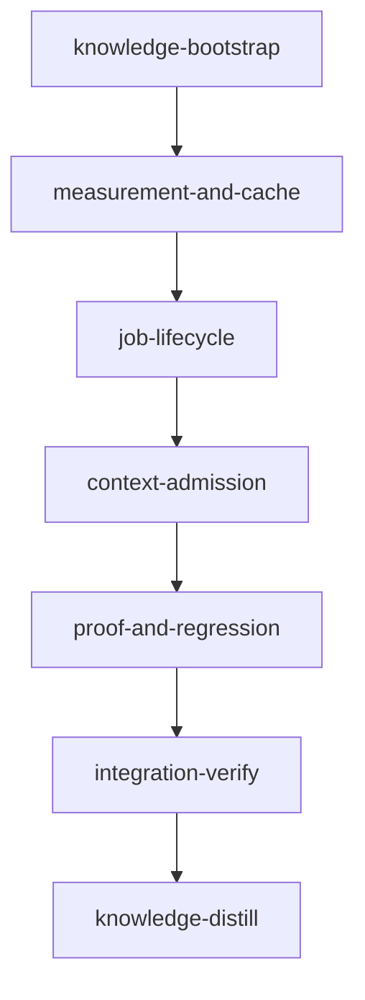

# Loom subscription-token optimization

Created: **2026-09-13** (Europe/Athens).
Evidence cutoff: **2026-09-12T20:12:13Z**. Audited source: `61847ac9afe57399c123f03fdb9b996e67deeb5f`.
Status: initialized 2026-09-13. The knowledge-bootstrap stage revalidated the plan's source contracts and ran the stage-sandbox baseline at `7d6a14ca`, recorded under "Baseline, activation and sandbox". The host scratch root (`/tmp/loom-token-optimization-checks`) is the one remaining operator prerequisite.

## Outcome and constraints

Reduce subscription consumption while preserving quality and elapsed time. Implement the concrete accounting, wait, context-admission and verification defects found in the [audit](../token-optimization-2026-09-12-codex.md), with an offline evaluator that distinguishes a token proxy from measured subscription savings. No promised percentage: the two polling cases expose 434.37M Claude resident-input tokens, not guaranteed recoverable savings. Keep Claude and Codex consumption separate.

Every orchestrator is **Opus/high**, deliberately overriding the knowledge/IV/distill defaults as requested. Standard implementation/execution workers use **GPT-5.6 Sol or Terra/xhigh**, assigned below. No lower-model routing, effort reduction, context-cap cut, mandatory early reset, reduced independent review, skipped quality gate or cache-TTL change. An observed quality or elapsed-time regression rejects a candidate; unknown evidence remains inconclusive. A false verification pass is not a valid fast baseline.

Read [common execution rules](briefs/token-optimization-2026-09-13/common.md) and the assigned full brief. Standard workers write implementation/tests but run no verification or git commands; the orchestrator runs gates and checks changed-file ownership. All new interface names in briefs are proposed deliverables unless explicitly identified as existing.

## Execution graph and stage necessity



| Stage | Why a separate stage is necessary | Within-stage execution |
| --- | --- | --- |
| measurement-and-cache | Q3: false cache passes invalidate later proof; establish corrected accounting before optimization | Sol cache and Terra quota concurrent; Sol provider normalization concurrent, final quota join after quota contract lands |
| job-lifecycle | Q2: later changes reuse measurement's models/usage; Q3: actual worker completion must be authoritative before suppressing polling | Sol protocol/producer/join first, Terra reader/wait/guard next; final producer-consumer inspection by orchestrator |
| context-admission | Q2: shares hook/CLI composition files with lifecycle; must retain its receipt behavior | Terra skill and Terra read-receipt units parallel; Sol worker-brief/central registration after receipt handler lands |
| proof-and-regression | Q2: usage, dispatch and signals follow earlier edits; Q3: cross-feature negative fixtures and Pareto decision checkpoint | Sol comparison, Terra evidence freshness and Terra verification ownership parallel, disjoint files |

Compile dependencies inside a stage are serial waves, not extra worktrees. Do not run overlapping sibling plans concurrently. `PLAN-loop-recovery.md` owns many of the same lifecycle/wait/guard/signal seams and proposes a hook-directory rename; `PLAN-model-router-hooks.md` overlaps spawn/model hooks; `PLAN-strengthen-verification.md` is a draft, not a shipped dependency; it proposes changes to `loom/src/plan/schema/validation.rs`, which context-admission's skill-routing-ownership also edits, so it must not run concurrently either. The active pre-commit plan owns CI/pre-commit work: this plan does not edit CI. Bootstrap checks actual committed contracts; if a sibling landed, amend this plan's ownership/paths/tests to reuse it before execution. If absent, this plan builds its own complete named capability. No dependence on a sibling's overview prose.

## Complete issue disposition

| Audit issue / original proposal | Owning stage and proof | Policy retained or deferred |
| --- | --- | --- |
| P0: stream undercount, IDs, event-time bounds, role/run provenance, Codex coverage, quota | measurement-and-cache provider/quota fixtures; job-lifecycle exact forward join; proof comparison CLI | No API-price or arbitrary subscription-weight score; mixed streams remain explicitly ambiguous |
| Newly reproduced criterion-cache false pass; environment/content/timing gaps | measurement-and-cache cache contract and negative-output regression; cross-feature contracts test | Cache only a fully evaluated, input-bound pass; unknown eligibility misses |
| P3/P11: wrapper/job mismatch, global newest evidence, list polling | job-lifecycle producer, exact identity adapter, named wait, watch overlay and shell fixtures | One normal watch; unknown writer retains ownership; no automatic cancel/retry |
| P2/P5: reduced template/signal composition already shipped | proof-and-regression existing size/doctrine regressions | Preserve current caps/required content; no second prompt diet project |
| Skill generic-keyword false positives and mandatory/advisory collapse | context-admission routing replay and rendered signal tests | Explicit and strong domain matches still load full selected skill |
| P4: attempted Read treated as delivery, stale ranges, media proxies | context-admission bounded pre/post receipt and guard tests | Media/persisted/uncorrelatable results never justify text reuse; preserve graph-first first-read guard |
| Fable §8 incidental defects | Eight fixed/superseded, retained by full IV; context-admission fixes remaining invalid-stage read hint | No repeated implementation of shipped retirement, asset install, budget or handoff repairs |
| P6/P8: missing task-scoped worker retrieval, ownership overlap, batching | context-admission nonce-bound child brief and advisory worker-table diagnostics; common batching protocol | Original task/constraints preserved; no second Codex navigation kit; independent review is not deduplicated |
| P7: knowledge packing shipped, source evidence can be stale | proof-and-regression working-tree evidence/strict-evidence fixtures; distill source annotations | Existing source/verified frontmatter and retrieval reused; no full-corpus rebuild per task |
| P6: repeated full verification ownership | proof-and-regression single named canonical verifier and signal tests | Full IV and post-review-fix gate retained; independent review dimensions unchanged |
| P1/P9/P10: long context, one-shot workers, fresh-spawn/maxTurns ideas | proof preserves current ceiling/one-shot contracts; comparison records complete accepted-unit cost | Forced resets, universal lower ceilings, lower effort/model and cache TTL experiments deferred pending positive Pareto evidence |
| Subscription attribution and elapsed/quality denominators missing | proof-and-regression offline versioned comparison and canary protocol | No live paid trials, automatic rollout or subscription win claimed from raw tokens alone |

Bash-shaped reads are still subject to the existing conservative graph/read policy; this plan does not invent exact content receipts for arbitrary shell programs. Same-file reads across workers remain a proxy. The worker-table checker is advisory over an explicit Markdown table, not a new hard ownership schema. These scope limits preserve quality while addressing each finding honestly.

The report separately validates all eleven Fable §7 questions. Harness context delivery, Task-model inheritance, exact assignment size, cache-key internals and wake-up reliability remain uncertain where no runtime evidence exists. Explicit models, source/recipient evidence and paired evaluation avoid assuming the answers. No plugin uninstall or harness-system-prompt change is included.

## Baseline, activation and sandbox

Host baseline at the audited HEAD in a detached worktree: all-target build and clippy (`-D warnings`) passed; Rust all-target tests **4,549 passed, 0 failed, 6 ignored** across 12 groups; **63 hook cases passed**; format check passed; **104 shell scripts parsed cleanly**. Strict read-only knowledge check passed with 0 structural issues and 130 informational review references. Commands/log hashes and reproduction limits are in the [evidence README](../token-optimization-2026-09-12-data/README.md). New test targets below do not yet exist and are not claimed as baseline results; existing module tests were selected by the full baseline suite.

Concurrent work advanced HEAD to `bacc5fd3c200a67833f51ffdc4c6c9058459921b` during final review. The delta is documentation and pre-commit/CI regression work, not the audited token/runtime seams. Preserve it. The host counts above remain explicitly tied to `61847ac9`; activation revalidates current HEAD and the added pre-commit regression rather than relabeling old evidence as a new full baseline. The hook-directory rename landed in `a5520004` (`hooks/` -> `loom-hooks/`), and every brief already uses `loom-hooks/`.

The isolated cache diagnostic printed `first_passed=false second_passed=true second_cached=true` for a forbidden-output criterion. Its saved test asserts the current defect; the implementation regression must assert both runs fail. No implementation or live model calls were made for this proposal.

`loom repair` read-only dry run succeeded outside the tool harness's SIGCHLD sandbox limitation. The exact Claude stage runtime was not available for a standalone matching sandbox run. **Before activation, run the gate set once in the actual project stage sandbox and record the result.** A resource failure requires a scoped fixture/repair amendment, never an unverified acceptance bypass or broader permission. The result is recorded in "Stage-sandbox baseline (knowledge-bootstrap, 2026-09-13)" below.

In the same disposable stage-equivalent worktree, probe the normal assigned Codex worker edit mechanism against a minimal fixture under `loom-hooks/` and restore it. That source root replaced the protected bare-git name on 2026-09-13. Executing hooks alone does not prove the worker's edit path is usable. No live model request is required for the probe. If denied, activation stops for a scoped tooling/ownership amendment and revalidation; never use unsandboxed escape. This plan's activation check remains explicit alongside its gate prerequisite.

Use the user-approved **existing project policy**: credential/runtime-token read denials, confined commands, no unsandboxed escape, no added network domains, local listeners or host sockets. Rust/Bun/Python tools and their existing cache grants remain available; this Rust/hook plan requires no installs or web build. Existing Codex-licensed transport/state grants remain those emitted by Loom. Acceptance uses offline/locked dependencies. Plan-specific writes below cover owned source/tests/docs, normal Cargo outputs and a dedicated scratch root; worker file inventories narrow those grants. Do not alter global HOME or redirected package-cache variables. Preserve current tmux environment-sensitive skip behavior and expose its counts; do not weaken tests.

### Stage-sandbox baseline (knowledge-bootstrap, 2026-09-13)

Ran at HEAD `7d6a14ca` (`loom 0.7.2-dev.62+7d6a14ca`) inside the knowledge-bootstrap session's sandbox, which applies this plan's policy; it is the main checkout, not a stage worktree.

All-target build, clippy `-D warnings`, fmt check: pass. `cargo test --offline --locked --all-targets --no-fail-fast`: 4,575 passed, 0 failed, 6 ignored. `loom-hooks/tests/run-all.sh`: 64 passed, 0 failed. `scripts/check-hook-syntax.sh`: pass. `scripts/test-pre-commit-partial-staging.sh`: 6 cases passed.

Scoped filter selection counts at HEAD:

| Filter | Count |
| --- | --- |
| `--lib commands::usage` | 36 |
| `commands::subagents::ledger` | 9 |
| `quota::` | 79 |
| `verify::criteria` | 73 |
| `commands::subagents` | 54 |
| `commands::hook` | 81 |
| `context::` | 484 |
| `plan::schema` | 136 |
| `orchestrator::signals` | 189 |
| `fs::knowledge` | 127 |
| `commands::knowledge` | 94 |
| `--test integration hooks_poll_guard` | 14 |
| `--test integration hooks_` | 111 |
| `models::execution_receipt` | 0 |
| `models::forward_receipt` | 0 |

`models::execution_receipt` and `models::forward_receipt` are new deliverables: the orchestrator must see a nonzero count before accepting. `orchestrator::signals::format::codex` is 0 (no test module in `format/codex.rs`); amended to `--lib orchestrator::signals` in job-lifecycle acceptance index 8 through `loom stage amend` (plan version 1).

Scratch root: `/tmp/loom-token-optimization-checks` did not exist, and the stage sandbox cannot create it (`mkdir` fails with `Read-only file system`); a stage `setup` mkdir only no-ops when the directory already exists. Operator prerequisite: run `mkdir -p /tmp/loom-token-optimization-checks` on the host before measurement-and-cache spawns, and again after any reboot before a later stage spawns. The operator agreed to create it on 2026-09-13. `loom stage amend` cannot change `setup`.

A TMPDIR inside the checkout does not substitute for it: with TMPDIR under `loom/target/`, 290 tests failed (283 lib, 7 e2e) that assume their tempdir is outside any repository, and between 00:12:36 and 00:12:54 UTC that run also wrote fixture state into the live repository and `.loom/work` — a junk section in `doc/loom/knowledge/entry-points.md` (restored), fixture state under `.loom/work/disputes/build-api/1/`, `.loom/work/context/test-plan/stage-a/`, `.loom/work/context/default/stage-1/`, and `.loom/work/context/_local/map-.tmpQ8ePxd/`, a false crash report at `.loom/work/crashes/20260913-001236-knowledge-bootstrap.md` for the live session, and a rewrite of `.loom/work/config.toml` (content still correct afterwards; no prior copy to diff). The stray files are left for operator cleanup; agents never edit `.loom/work` directly. The same suite passed with the harness TMPDIR outside the repo, which wrote none of this.

The hook suite is not hermetic against a live stage session's environment either, independent of TMPDIR placement: running `loom-hooks/tests/codex-forward-guard-blocks-edit.sh`, `codex-forward-guard-quoting.sh`, and `codex-forward-guard-bash-companion-only.sh` inside this session, with the harness TMPDIR correctly outside the repo, appended fake forward records (`stage_id: knowledge-bootstrap`, real session ID, `gpt-5.6-terra`/`gpt-5.6-luna`, `xhigh`) to the live `.loom/work/subagents/knowledge-bootstrap/codex.jsonl` — 6 records from the gate run at 00:13:28 UTC and 5 more from an attribution rerun at 00:22:00 UTC, 11 lines total, none from a real Codex job. The tests inherit `LOOM_STAGE_ID`/`LOOM_SESSION_ID`/`LOOM_WORK_DIR` from the session and the guard writes its ledger through them; exact routing lines were not traced. Consequence: job-lifecycle, context-admission, and integration-verify each run `bash loom-hooks/tests/run-all.sh` inside their own sessions, so every gate run appends fake worker-provenance records to its own stage ledger — the exact data measurement/job-lifecycle is meant to make exact. Stray records are left for operator cleanup; agents never edit `.loom/work` directly.

Edit-path probe: a sandboxed Bash write and removal of a fixture under `loom-hooks/` succeeded and was restored. On Linux the forwarder always takes the companion lane (`loom-hooks/codex-forward.sh:211`), whose Codex sandbox is fixed at `workspace-write` inside the outer Bash sandbox; the direct lane (`--sandbox danger-full-access`, `codex-forward.sh:150-151`) is a macOS fallback. No live model request was made, so the probe covers the outer sandbox only.

Sibling plans at `7d6a14ca`: PLAN-loop-recovery, PLAN-model-router-hooks, PLAN-strengthen-verification, PLAN-secure-distilled-loom-v2 and PLAN-adopt-ecc-best-practices are untracked and not started. None of their proposed contracts exist in committed source, except that PLAN-strengthen-verification's `check_cross_stage_wiring_coverage` already exists (`loom/src/plan/schema/validation.rs:1101`, called from `validate_structural_preflight` at `:929`). PLAN-loop-recovery's worker-evidence and owned-waits stages overlap almost all job-lifecycle files; PLAN-model-router-hooks' router-core overlaps `loom/src/cli/dispatch.rs`. This plan keeps every named owning stage.

## Verification and rollout

Each producing stage proves real CLI/hook consumers and negative cases, not only file existence. Standard stages use scoped tests plus build/clippy/fmt; full Rust tests run in IV, following the later explicit plan-writer rule. Hook stages run the complete hook suite. Inspect nonzero test selection and all warnings. Independent reviewers retain source access and review coverage. Fixes invalidate verification evidence where inputs changed.

IV exercises provider normalization → exact worker completion → scoped admission → comparison through offline fixtures, including streamed IDs, concurrent same-model jobs, missing background acknowledgement, notification loss/restart, failed/canceled/unknown jobs, source edits/compaction, output-criterion cache failures, and quota reset/precision ambiguity. The offline comparison is the rollout decision surface; live canaries are separately scheduled and require user authority. Retain all matched outcomes. Reject any quality or elapsed regression; do not average it away. Distill corrects high-impact source-backed knowledge in place after verification.

[Pressure review](codex-PLAN-token-optimization-2026-09-13.md): cross-project receipt-root isolation and the private worker-recipient facade gaps were corrected. Knowledge-bootstrap ran both the stage-sandbox gate and the edit-path probe (see "Stage-sandbox baseline (knowledge-bootstrap, 2026-09-13)" above). Structural validation has zero errors and four optional before/after suggestions; discriminating cold/warm and mutation tests are owned by the producing stages, rather than baseline commands against nonexistent future test targets.

<!-- loom METADATA -->

```yaml
loom:
  version: 1
  auto_merge: null
  sandbox:
    enabled: true
    auto_allow: true
    allow_unsandboxed_escape: false
    excluded_commands: []
    filesystem:
      deny_read:
      - ~/.ssh/**
      - ~/.aws/**
      - ~/.config/gcloud/**
      - ~/.gnupg/**
      - .loom/work/admin.token
      - .loom/work/user.token
      deny_write:
      - ../../**
      allow_write:
      - loom/src/**
      - loom/tests/**
      - loom/target/**
      - target/**
      - loom-hooks/**
      - agents/loom-codex-forwarder.md
      - doc/loom/knowledge/**
      - doc/token-optimization-evaluation.md
      - README.md
      - /tmp/loom-token-optimization-checks
    network:
      allowed_domains: []
      additional_domains: []
      allow_local_binding: false
      allow_unix_sockets: []
      allow_all_unix_sockets: false
    linux:
      enable_weaker_nested: false
    command_confinement: confined
  stages:
  - id: knowledge-bootstrap
    name: Revalidate source contracts and focused knowledge
    description: |
      Read common.md under doc/plans/briefs/token-optimization-2026-09-13/ and the audit.
      Use parallel Explore subagents for usage/cache, worker lifecycle and context seams;
      return exact source-contract differences and proposed knowledge CLI corrections.
      Read INDEX first and relevant mistakes only, never the entire knowledge corpus.
      Check sibling plan conflicts before implementation; amend this plan to reuse landed
      source contracts or retain its named owning stage if absent. Revalidate after amendment.
      Resolve the exact stage-sandbox baseline prerequisite before any standard stage starts.
      Correct stale ceilings, hook phase, retrieval and telemetry guidance in place through
      loom knowledge replace-section; annotate actual source/revision, never assumed truth.
      Use loom knowledge sync only as the bookend task, never as worktree acceptance.
      Preserve tier routing: compact tier-1 summaries, focused linked detail, generated INDEX.
    dependencies: []
    parallel_group: null
    acceptance:
    - loom knowledge check --strict
    setup: []
    files:
    - doc/loom/knowledge/**
    - doc/plans/PLAN-token-optimization-2026-09-13.md
    - doc/plans/briefs/token-optimization-2026-09-13/**
    auto_merge: null
    working_dir: .
    stage_type: knowledge
    artifacts:
    - doc/loom/knowledge/INDEX.md
    wiring: []
    context_ceiling_tokens: null
    sandbox: {}
    model: opus
    reasoning_effort: high
    ultracode: false
    implementers:
    - claude
  - id: measurement-and-cache
    name: Correct provider accounting and reusable verification proof
    description: |
      Read common.md and measurement-and-cache/*.md under the dated briefs directory.
      Spawn foreground loom-codex-forwarder units with explicit Bash timeout 600000 ms,
      models below and effort xhigh. Workers never run git or verification; inspect
      git status --short after each actual worker settles. Orchestrator verifies/commits.
      Use parallel subagents and skills to maximize performance within disjoint ownership.
      | Worker | Files owned |
      | Sol provider-ledger | loom/src/commands/usage/**; loom/src/models/mod.rs; loom/src/models/execution_receipt.rs; loom/src/commands/subagents/ledger.rs; loom/src/commands/subagents/ledger_tests.rs |
      | Terra quota-history | loom/src/quota/** |
      | Sol cache-correctness | loom/src/verify/criteria/** |
      Run independent normalization/cache/quota work concurrently; provider final history
      consumption follows Terra's actual QuotaHistoryRead contract. No stub imports.
      Preserve legacy usage keys, unknown provider fields, exact UTC bounds and provenance.
      Cache only the fully evaluated bound criterion; convert the diagnostic to a regression.
    dependencies:
    - knowledge-bootstrap
    parallel_group: null
    acceptance:
    - TMPDIR=/tmp/loom-token-optimization-checks cargo build --offline --locked --manifest-path loom/Cargo.toml --all-targets
    - TMPDIR=/tmp/loom-token-optimization-checks cargo clippy --offline --locked --manifest-path loom/Cargo.toml --all-targets -- -D warnings
    - TMPDIR=/tmp/loom-token-optimization-checks cargo fmt --manifest-path loom/Cargo.toml --check
    - TMPDIR=/tmp/loom-token-optimization-checks cargo test --offline --locked --manifest-path loom/Cargo.toml --lib commands::usage
    - TMPDIR=/tmp/loom-token-optimization-checks cargo test --offline --locked --manifest-path loom/Cargo.toml --lib commands::subagents::ledger
    - 'TMPDIR=/tmp/loom-token-optimization-checks cargo test --offline --locked --manifest-path loom/Cargo.toml --lib quota::'
    - TMPDIR=/tmp/loom-token-optimization-checks cargo test --offline --locked --manifest-path loom/Cargo.toml --lib verify::criteria
    - TMPDIR=/tmp/loom-token-optimization-checks cargo test --offline --locked --manifest-path loom/Cargo.toml --lib models::execution_receipt
    setup:
    - mkdir -p /tmp/loom-token-optimization-checks
    files:
    - loom/src/commands/usage/**
    - loom/src/models/mod.rs
    - loom/src/models/execution_receipt.rs
    - loom/src/commands/subagents/ledger.rs
    - loom/src/commands/subagents/ledger_tests.rs
    - loom/src/quota/**
    - loom/src/verify/criteria/**
    auto_merge: null
    working_dir: .
    stage_type: standard
    artifacts:
    - loom/src/commands/usage/mod.rs
    - loom/src/models/execution_receipt.rs
    - loom/src/quota/history.rs
    - loom/src/verify/criteria/cache_contract.rs
    - loom/src/verify/criteria/tests/cache_contract_tests.rs
    wiring:
    - source: loom/src/commands/usage/mod.rs
      pattern: normalize_provider_events\(
      description: Usage executes provider normalization; usage fixtures prove semantics
    - source: loom/src/commands/usage/mod.rs
      pattern: read_history\(
      description: Usage consumes optional quota observations without adding token totals
    - source: loom/src/quota/poller.rs
      pattern: record_successful_observation\(
      description: Successful poll records bounded history; failure fixtures prove exclusion
    - source: loom/src/verify/criteria/runner.rs
      pattern: CriterionContract
      description: Runner binds the complete criterion; cold/warm negative tests prove verdicts
    context_ceiling_tokens: null
    sandbox: {}
    model: opus
    reasoning_effort: high
    ultracode: false
    implementers:
    - codex
    subagent_timeout_secs: 900
  - id: job-lifecycle
    name: Bind waits and usage to the actual forwarded execution
    description: |
      Read common.md and both job-lifecycle briefs under the dated briefs directory.
      Spawn foreground loom-codex-forwarder units using the named model/xhigh and
      explicit Bash timeout 600000 ms. No worker git/verification; orchestrator checks
      git status --short after settled workers and runs gates. No unknown ownership release.
      | Worker | Files owned |
      | Sol forwarding-receipts | loom/src/models/mod.rs; loom/src/models/forward_receipt.rs; loom/src/commands/hook/forward_receipt*; loom/src/commands/hook/mod.rs; loom/src/cli/types_ops.rs; loom/src/cli/dispatch.rs; loom/src/commands/usage/**; loom-hooks/codex-forward.sh; loom-hooks/codex-forward-guard.sh; loom-hooks/post-tool-use.sh; loom-hooks/tests/codex-forward* |
      | Terra wait-and-poll | loom/src/commands/subagents/forward_jobs*; loom/src/commands/subagents/mod.rs; loom/src/commands/subagents/classify*; loom/src/commands/subagents/render*; loom/src/commands/subagents/table*; loom-hooks/poll-guard.sh; loom-hooks/tests/poll-guard*; agents/loom-codex-forwarder.md; loom/src/orchestrator/signals/format/codex.rs; loom/tests/integration/hooks_poll_guard* |
      Sol additionally owns loom/src/models/forward_receipt/** for the shared pure reader.
      Terra additionally owns loom/src/commands/subagents/summary.rs constructors.
      Sol publishes complete independent ForwardReceipt and pure evidence adapter first;
      Terra consumes it in a second wave. List/watch readers never write shared state.
      Exact observed tool/job IDs replace newest scans; absent evidence remains unknown.
      Preserve foreground forwarding and naturally backgrounded acknowledgement handling.
      Usage joins only proven lifecycle identity; no summing receipt and transcript copies.
    dependencies:
    - measurement-and-cache
    parallel_group: null
    acceptance:
    - TMPDIR=/tmp/loom-token-optimization-checks cargo build --offline --locked --manifest-path loom/Cargo.toml --all-targets
    - TMPDIR=/tmp/loom-token-optimization-checks cargo clippy --offline --locked --manifest-path loom/Cargo.toml --all-targets -- -D warnings
    - TMPDIR=/tmp/loom-token-optimization-checks cargo fmt --manifest-path loom/Cargo.toml --check
    - TMPDIR=/tmp/loom-token-optimization-checks cargo test --offline --locked --manifest-path loom/Cargo.toml --lib commands::subagents
    - TMPDIR=/tmp/loom-token-optimization-checks cargo test --offline --locked --manifest-path loom/Cargo.toml --lib commands::hook
    - TMPDIR=/tmp/loom-token-optimization-checks cargo test --offline --locked --manifest-path loom/Cargo.toml --lib models::forward_receipt
    - TMPDIR=/tmp/loom-token-optimization-checks cargo test --offline --locked --manifest-path loom/Cargo.toml --lib commands::usage
    - TMPDIR=/tmp/loom-token-optimization-checks cargo test --offline --locked --manifest-path loom/Cargo.toml --test integration hooks_poll_guard
    - TMPDIR=/tmp/loom-token-optimization-checks cargo test --offline --locked --manifest-path loom/Cargo.toml --lib orchestrator::signals
    - TMPDIR=/tmp/loom-token-optimization-checks bash loom-hooks/tests/run-all.sh
    - TMPDIR=/tmp/loom-token-optimization-checks bash scripts/check-hook-syntax.sh
    setup:
    - mkdir -p /tmp/loom-token-optimization-checks
    files:
    - loom/src/models/mod.rs
    - loom/src/models/forward_receipt.rs
    - loom/src/models/forward_receipt/**
    - loom/src/commands/hook/forward_receipt*
    - loom/src/commands/hook/mod.rs
    - loom/src/cli/types_ops.rs
    - loom/src/cli/dispatch.rs
    - loom/src/commands/usage/**
    - loom/src/commands/subagents/forward_jobs*
    - loom/src/commands/subagents/mod.rs
    - loom/src/commands/subagents/classify*
    - loom/src/commands/subagents/render*
    - loom/src/commands/subagents/table*
    - loom/src/commands/subagents/summary.rs
    - loom-hooks/codex-forward.sh
    - loom-hooks/codex-forward-guard.sh
    - loom-hooks/post-tool-use.sh
    - loom-hooks/tests/codex-forward*
    - loom-hooks/poll-guard.sh
    - loom-hooks/tests/poll-guard*
    - agents/loom-codex-forwarder.md
    - loom/src/orchestrator/signals/format/codex.rs
    - loom/tests/integration/hooks_poll_guard*
    auto_merge: null
    working_dir: .
    stage_type: standard
    artifacts:
    - loom/src/models/forward_receipt.rs
    - loom/src/commands/hook/forward_receipt.rs
    - loom/src/commands/subagents/forward_jobs.rs
    - loom/src/commands/usage/forward_join.rs
    wiring:
    - source: loom-hooks/post-tool-use.sh
      pattern: forward-receipt
      description: Observed hook completion invokes receipt adapter
    - source: loom/src/commands/subagents/render.rs
      pattern: 'forward_jobs::'
      description: List/watch consume exact forward state; lifecycle fixtures prove settlement
    - source: loom/src/commands/usage/mod.rs
      pattern: 'forward_join::'
      description: Usage joins exact execution identity instead of newest-model inference
    - source: loom/src/cli/dispatch.rs
      pattern: ForwardReceipt
      description: Hook CLI dispatch reaches the receipt command
    context_ceiling_tokens: null
    sandbox: {}
    model: opus
    reasoning_effort: high
    ultracode: false
    implementers:
    - codex
    subagent_timeout_secs: 900
  - id: context-admission
    name: Admit relevant skills and proven task context
    description: |
      Read common.md and all three context-admission briefs in the dated directory.
      Foreground loom-codex-forwarder, model below/xhigh, Bash timeout 600000 ms.
      No worker git/verification. Orchestrator checks git status --short after settled
      units, verifies and commits. Use parallel subagents with exclusive files.
      | Worker | Files owned |
      | Terra skill-routing-ownership | loom-hooks/skill-trigger.sh; loom/src/orchestrator/signals/format/skills.rs; loom/src/plan/schema/structural_checks.rs; loom/src/plan/schema/validation.rs; loom/tests/integration/hooks_skill_trigger.rs |
      | Terra read-receipts | loom-hooks/_read_ledger.sh; loom-hooks/_read_discipline.sh; loom-hooks/read-guard.sh; loom-hooks/post-tool-use.sh; loom/src/context/read_receipts.rs; loom/src/context/mod.rs; loom/src/commands/hook/read_receipt.rs; loom/tests/integration/hooks_read_guard*; loom-hooks/tests/post-tool-use* |
      | Sol scoped-worker-briefs | loom/src/commands/hook/worker_brief.rs; loom/src/commands/hook/tests_worker_brief.rs; loom/src/commands/hook/mod.rs; loom/src/orchestrator/signals/retrieval.rs; loom/src/context/delivery/session.rs; loom/src/cli/types_ops.rs; loom/src/cli/dispatch.rs; loom-hooks/spawn-guard.sh; loom-hooks/subagent-start.sh; loom/src/context/tests/delivery*; loom/tests/integration/hooks_spawn_guard*; loom-hooks/tests/subagent-start-ledger.sh |
      Terra units first in parallel; Sol follows with worker-brief and read-receipt CLI
      registration and exclusively owns loom/src/context/delivery.rs facade exports.
      Preserve the earlier forward-receipt dispatch/PostToolUse behavior.
      Pre/post generation, exact result correlation and epoch proof precede repeat advice.
      Child nonce binding never gives a Codex rollout credit for a Claude forwarder receipt.
    dependencies:
    - job-lifecycle
    parallel_group: null
    acceptance:
    - TMPDIR=/tmp/loom-token-optimization-checks cargo build --offline --locked --manifest-path loom/Cargo.toml --all-targets
    - TMPDIR=/tmp/loom-token-optimization-checks cargo clippy --offline --locked --manifest-path loom/Cargo.toml --all-targets -- -D warnings
    - TMPDIR=/tmp/loom-token-optimization-checks cargo fmt --manifest-path loom/Cargo.toml --check
    - TMPDIR=/tmp/loom-token-optimization-checks cargo test --offline --locked --manifest-path loom/Cargo.toml --test integration hooks_
    - TMPDIR=/tmp/loom-token-optimization-checks cargo test --offline --locked --manifest-path loom/Cargo.toml --lib commands::hook
    - 'TMPDIR=/tmp/loom-token-optimization-checks cargo test --offline --locked --manifest-path loom/Cargo.toml --lib context::'
    - TMPDIR=/tmp/loom-token-optimization-checks cargo test --offline --locked --manifest-path loom/Cargo.toml --lib plan::schema
    - TMPDIR=/tmp/loom-token-optimization-checks cargo test --offline --locked --manifest-path loom/Cargo.toml --lib orchestrator::signals
    - TMPDIR=/tmp/loom-token-optimization-checks bash loom-hooks/tests/run-all.sh
    - TMPDIR=/tmp/loom-token-optimization-checks bash scripts/check-hook-syntax.sh
    setup:
    - mkdir -p /tmp/loom-token-optimization-checks
    files:
    - loom-hooks/skill-trigger.sh
    - loom/src/orchestrator/signals/format/skills.rs
    - loom/src/plan/schema/structural_checks.rs
    - loom/src/plan/schema/validation.rs
    - loom/tests/integration/hooks_skill_trigger.rs
    - loom-hooks/_read_ledger.sh
    - loom-hooks/_read_discipline.sh
    - loom-hooks/read-guard.sh
    - loom-hooks/post-tool-use.sh
    - loom/src/context/read_receipts.rs
    - loom/src/context/mod.rs
    - loom/src/commands/hook/read_receipt.rs
    - loom/tests/integration/hooks_read_guard*
    - loom-hooks/tests/post-tool-use*
    - loom/src/commands/hook/worker_brief.rs
    - loom/src/commands/hook/tests_worker_brief.rs
    - loom/src/commands/hook/mod.rs
    - loom/src/orchestrator/signals/retrieval.rs
    - loom/src/context/delivery/session.rs
    - loom/src/context/delivery.rs
    - loom/src/cli/types_ops.rs
    - loom/src/cli/dispatch.rs
    - loom-hooks/spawn-guard.sh
    - loom-hooks/subagent-start.sh
    - loom/src/context/tests/delivery*
    - loom/tests/integration/hooks_spawn_guard*
    - loom-hooks/tests/subagent-start-ledger.sh
    auto_merge: null
    working_dir: .
    stage_type: standard
    artifacts:
    - loom/src/commands/hook/worker_brief.rs
    - loom/src/commands/hook/read_receipt.rs
    - loom/src/context/read_receipts.rs
    - loom/src/orchestrator/signals/format/skills.rs
    - loom/src/plan/schema/structural_checks.rs
    wiring:
    - source: loom-hooks/spawn-guard.sh
      pattern: worker-brief
      description: Authorized spawn requests scoped material; exact prompt tests prove preservation
    - source: loom-hooks/read-guard.sh
      pattern: read-receipt
      description: Read admission checks proven generation; failure/epoch fixtures prevent false reuse
    - source: loom-hooks/post-tool-use.sh
      pattern: read-receipt
      description: Completed Read reaches bounded correlation adapter
    - source: loom/src/cli/dispatch.rs
      pattern: WorkerBrief
      description: Worker brief command is reachable via CLI
    context_ceiling_tokens: null
    sandbox: {}
    model: opus
    reasoning_effort: high
    ultracode: false
    implementers:
    - codex
    subagent_timeout_secs: 900
  - id: proof-and-regression
    name: Preserve quality and evaluate the subscription frontier
    description: |
      Read common.md and the three proof-and-regression briefs. Use parallel foreground
      loom-codex-forwarder units, model below/xhigh, Bash timeout 600000 ms. Workers
      never run git/verification; orchestrator checks git status --short, verifies/commits.
      | Worker | Files owned |
      | Sol pareto-comparison | loom/src/commands/usage/**; loom/tests/token_optimization_comparison.rs; loom/tests/fixtures/token_optimization/comparison/**; doc/token-optimization-evaluation.md |
      | Terra verification-ownership | loom/src/orchestrator/signals/cache.rs; loom/src/orchestrator/signals/tests_cache.rs; loom/src/orchestrator/signals/tests_doctrine.rs; loom/src/orchestrator/signals/tests_doctrine_prefixes.rs; loom/src/orchestrator/signals/tests_commit_timing.rs; loom/src/orchestrator/signals/tests_size.rs; loom/tests/token_optimization_contracts.rs |
      | Terra evidence-freshness | loom/src/fs/knowledge/catalog.rs; loom/src/fs/knowledge/catalog/**; loom/src/fs/knowledge/tests/catalog*; loom/src/commands/knowledge/check.rs; loom/src/commands/knowledge/tests_check*; loom/src/cli/types_memory.rs; loom/src/cli/dispatch.rs; loom/tests/token_optimization_knowledge.rs |
      Keep token-proxy and subscription verdicts separate; reject every quality or latency
      regression, retain inconclusive missing/ambiguous data. No live model experiments.
      Strict evidence is opt-in on declared source facts; never mark unassessed prose true.
      Name one canonical verifier, preserving every independent review and final quality gate.
    dependencies:
    - context-admission
    parallel_group: null
    acceptance:
    - TMPDIR=/tmp/loom-token-optimization-checks cargo build --offline --locked --manifest-path loom/Cargo.toml --all-targets
    - TMPDIR=/tmp/loom-token-optimization-checks cargo clippy --offline --locked --manifest-path loom/Cargo.toml --all-targets -- -D warnings
    - TMPDIR=/tmp/loom-token-optimization-checks cargo fmt --manifest-path loom/Cargo.toml --check
    - TMPDIR=/tmp/loom-token-optimization-checks cargo test --offline --locked --manifest-path loom/Cargo.toml --lib commands::usage
    - TMPDIR=/tmp/loom-token-optimization-checks cargo test --offline --locked --manifest-path loom/Cargo.toml --lib orchestrator::signals
    - TMPDIR=/tmp/loom-token-optimization-checks cargo test --offline --locked --manifest-path loom/Cargo.toml --lib fs::knowledge
    - TMPDIR=/tmp/loom-token-optimization-checks cargo test --offline --locked --manifest-path loom/Cargo.toml --lib commands::knowledge
    - TMPDIR=/tmp/loom-token-optimization-checks cargo test --offline --locked --manifest-path loom/Cargo.toml --test token_optimization_comparison --test token_optimization_contracts --test token_optimization_knowledge
    setup:
    - mkdir -p /tmp/loom-token-optimization-checks
    files:
    - loom/src/commands/usage/**
    - loom/tests/token_optimization_comparison.rs
    - loom/tests/fixtures/token_optimization/comparison/**
    - doc/token-optimization-evaluation.md
    - loom/src/orchestrator/signals/cache.rs
    - loom/src/orchestrator/signals/tests_cache.rs
    - loom/src/orchestrator/signals/tests_doctrine.rs
    - loom/src/orchestrator/signals/tests_doctrine_prefixes.rs
    - loom/src/orchestrator/signals/tests_commit_timing.rs
    - loom/src/orchestrator/signals/tests_size.rs
    - loom/tests/token_optimization_contracts.rs
    - loom/src/fs/knowledge/catalog.rs
    - loom/src/fs/knowledge/catalog/**
    - loom/src/fs/knowledge/tests/catalog*
    - loom/src/commands/knowledge/check.rs
    - loom/src/commands/knowledge/tests_check*
    - loom/src/cli/types_memory.rs
    - loom/src/cli/dispatch.rs
    - loom/tests/token_optimization_knowledge.rs
    auto_merge: null
    working_dir: .
    stage_type: standard
    artifacts:
    - loom/src/commands/usage/comparison.rs
    - loom/tests/token_optimization_comparison.rs
    - loom/tests/token_optimization_contracts.rs
    - loom/tests/token_optimization_knowledge.rs
    - doc/token-optimization-evaluation.md
    wiring:
    - source: loom/src/commands/usage/mod.rs
      pattern: comparison::compare\(
      description: Offline comparison reaches its verdict engine before discovery
    - source: loom/src/cli/dispatch.rs
      pattern: strict_evidence
      description: Knowledge check dispatch carries explicit evidence policy
    - source: loom/src/fs/knowledge/catalog.rs
      pattern: changed_since_verified\(
      description: Catalog invokes improved source-evidence check; working-tree fixtures discriminate
    context_ceiling_tokens: null
    sandbox: {}
    model: opus
    reasoning_effort: high
    ultracode: false
    implementers:
    - codex
    subagent_timeout_secs: 900
  - id: integration-verify
    name: Independent review and complete functional verification
    description: |
      Read plan, focused source changes, assigned briefs and loom memory show --all.
      Spawn parallel independent loom-code-reviewer units for correctness/security,
      architecture and coverage. Preserve all review dimensions and source access.
      One canonical verification owner runs full build/clippy/fmt/tests and all hook cases.
      Fix every finding through a scoped engineer, then rerun invalidated gates; do not
      waive missing requirements or unknown worker completion. Exercise all three new CLI
      integration targets plus exact-job/read/skill/cache negative fixtures from earlier stages.
      Check no new CLI is orphaned, no zero-test filter passed and no shared-state writes
      occurred in list/usage/check. No live provider requests or automatic deployment.
      Record stale-knowledge corrections and unresolved measurement uncertainty in memory.
    dependencies:
    - proof-and-regression
    parallel_group: null
    acceptance:
    - TMPDIR=/tmp/loom-token-optimization-checks cargo build --offline --locked --manifest-path loom/Cargo.toml --all-targets
    - TMPDIR=/tmp/loom-token-optimization-checks cargo clippy --offline --locked --manifest-path loom/Cargo.toml --all-targets -- -D warnings
    - TMPDIR=/tmp/loom-token-optimization-checks cargo fmt --manifest-path loom/Cargo.toml --check
    - TMPDIR=/tmp/loom-token-optimization-checks cargo test --offline --locked --manifest-path loom/Cargo.toml --all-targets --no-fail-fast
    - TMPDIR=/tmp/loom-token-optimization-checks bash loom-hooks/tests/run-all.sh
    - TMPDIR=/tmp/loom-token-optimization-checks bash scripts/check-hook-syntax.sh
    - TMPDIR=/tmp/loom-token-optimization-checks ./scripts/test-pre-commit-partial-staging.sh
    setup:
    - mkdir -p /tmp/loom-token-optimization-checks
    files:
    - loom/src/**
    - loom/tests/**
    - loom-hooks/**
    - agents/loom-codex-forwarder.md
    - doc/token-optimization-evaluation.md
    auto_merge: null
    working_dir: .
    stage_type: integration-verify
    artifacts: []
    wiring: []
    context_ceiling_tokens: null
    sandbox: {}
    model: opus
    reasoning_effort: high
    ultracode: false
    implementers:
    - claude
  - id: knowledge-distill
    name: Correct and annotate durable knowledge
    description: |
      SINGLE AGENT: no subagents. Read plan, loom memory show --all, INDEX and relevant
      knowledge sections only. Correct stale-knowledge entries first in place with
      loom knowledge replace-section, then curate through loom knowledge update.
      Annotate source/revision for ceilings, hook phases, exact wait authority, signal caps,
      provider ledger semantics and receipt lifecycle using existing knowledge annotate.
      No blanket semantic-truth claim; changed evidence remains a review signal.
      Preserve compact tier-1 summaries and linked detail; INDEX regenerates automatically.
      Resolve every memory with promoted/merged/discarded/deferred receipt and target/reason.
      Update README's affected usage/wait sections and the evaluation protocol, then loom review.
      Finish with strict structural knowledge and pending-memory checks, not corpus-wide
      strict-evidence activation over unassessed pages. No auto-memory or live experiments.
    dependencies:
    - integration-verify
    parallel_group: null
    acceptance:
    - loom knowledge check --strict
    - loom memory pending --strict
    setup: []
    files:
    - doc/loom/knowledge/**
    - README.md
    - doc/token-optimization-evaluation.md
    auto_merge: null
    working_dir: .
    stage_type: knowledge-distill
    artifacts: []
    wiring: []
    context_ceiling_tokens: null
    sandbox: {}
    model: opus
    reasoning_effort: high
    ultracode: false
    implementers:
    - claude
```

<!-- END loom METADATA -->
