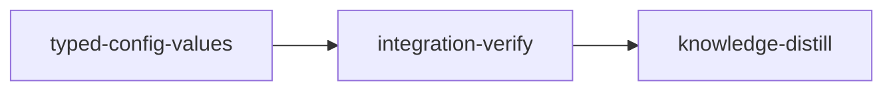

# Plan: Typed Configuration Values

## Overview

Loom's config registry already knows each key's type, and the write path already
honours it: `KeySpec::parse` (`loom/src/user_config/keys.rs:186-218`) turns
operator text into a real `toml_edit::Value`, and every writer — the CLI, the
TUI, the dashboard's `POST /api/config` — goes through that one function. The
read path throws the type away. `UserConfig::value_of`
(`loom/src/user_config/render.rs:17-43`) returns `(String, Origin)` for every
key regardless of kind, and every surface downstream inherits a string: the TUI
row, the JSON wire, and the TypeScript client, which then re-derives the type it
was never sent: `formatValue` tests a value with `/^\d+$/` before calling
`Number()` (`web/src/components/settings-model.ts:244`), `displayValue` compares
`value === "true"` (`:62`), and `settings-control.tsx:52` compares the same
string again.

The operator-visible cost is the config TUI. `terminal.backend` accepts exactly
`native` or `tmux`, the registry says so, and the TUI still presents a blank
text field: changing backends means deleting a word and typing another, with no
indication of what is legal until the commit is rejected.

This plan introduces a typed `ConfigValue` at that read seam and threads it
through all four surfaces, adds a free-text `String` kind alongside the existing
`Bool`/`Number`/`Enum`, and gives the TUI per-kind editing.

### Sibling plans this one must not run beside

Two live plans claim paths this one writes. Neither is a code conflict; both are
sequencing constraints, and either order works so long as the two do not run
concurrently.

- `PLAN-web-host-graft-followthrough` claims the glob
  `loom/src/commands/status/web/**` in the `files:` of both its stages, a strict
  superset of the three `config_api` paths W3 owns. There is no compile
  coupling: its worker owns `config_api/request.rs`, which reaches the payload
  only through `super::payload(base)` and names no value type, and
  `commands/status/web/tests.rs` already declares `mod config_api;` so W3's new
  submodule needs no edit there.
- `IN_PROGRESS-PLAN-loop-recovery` claims `web/dist/index.html` as an artifact,
  grants `web/dist/**` write, and claims twelve `web/src` files
  (`completion-recovery.files`: `api/schema.ts`, `api/schema.test.ts`, four
  status components, two component tests, `lib/format*`, `lib/graph*`) — none
  of which this plan's explicit `web/src` list names. The hazard is the two
  `web/dist` rebuilds conflicting on merge, not the sources.

Three more path groups are shared with a sibling and are why the plans must be
serialized rather than merely rebased:

- `loom/maintainability-baseline.txt` is in every code stage's `files:` in all
  three plans. This plan expects no ledger edit, but the ledger is exact, so
  whichever plan merges second re-runs `cargo test --test maintainability`
  against the merged tree.
- `doc/loom/knowledge/**` is owned by all three `knowledge-distill` stages, and
  `README.md`/`CONTRIBUTING.md` by this plan's and loop-recovery's. Knowledge
  curation from two plans at once rewrites `INDEX.md` twice.
- `web/dist/**`: whichever plan merges second rebuilds the bundle on the merged
  `web/src` (`bun run --cwd web build`) rather than resolving a textual
  conflict in minified output.

The rule for the executor: do not `loom run` this plan while either sibling
has a stage `Executing`; if one merged since this plan's worktree was cut,
rebase, rebuild `web/dist`, and re-run the full gate before
`loom stage complete`. This plan's stage `files:` names the `config_api`
paths W3 writes one by one rather than `config_api/**`, so
`config_api/request.rs` and `config_api/csrf.rs` — the HTTP framing the
graft-followthrough worker owns — are not claimed here at all.

## Goals

- One typed value, `ConfigValue`, produced and consumed everywhere a config
  value crosses a boundary — no surface re-derives a type from a string.
- `ValueKind` gains `String` (free text) and renames `U32` to `Number`, so the
  registry can describe a key whose value is a name rather than a choice.
- The TUI edits by kind: `←`/`→` (and `h`/`l`, space) step an enum's variants
  or toggle a bool, and only `Number`/`String` get a text field. `Enter` opens
  the editor for those two kinds and steps a `Bool`/`Enum` forward, so no
  keystroke opens a text field on a closed vocabulary. The footer reads
  `↑↓/k/j move  ←/→/space cycle  Enter edit or cycle  s save  Esc/q quit  * pending`.
- `/api/config` carries native JSON — `true`, `800000`, `"opus"` — and the SPA
  stops re-parsing strings.
- Non-goal: converting `ModelsConfig`/`PressureConfig`'s serde fields
  (`loom/src/fs/work_dir/config_sections/`) to typed enums. Their
  `Option<String>` fields feed `resolve_stage_model_effort` and every
  model-string consumer in the daemon; typing them is a separate blast radius
  with no bearing on what an operator sees. The dashboard's own reader of that
  tier IS fixed — see "The dashboard's project-tier reader" below — because it
  is what renders the project-scope control.
- Non-goal: adding a registry key that uses `ValueKind::String`. The variant is
  plumbed and tested; the first key that needs free text just declares it.
- Non-goal: making `UserConfig::load` strict. `load` deliberately swallows a
  parse failure into all-defaults (`loom/src/user_config/mod.rs:202-210`) so a
  broken user config cannot take down `loom run`, while `load_strict`
  (`:216-227`) surfaces it. The callers split cleanly along that line: the CLI
  and the TUI use strict (`commands/config/mod.rs:64`, `:86`, `:108`;
  `tui/state.rs:87`, `:220`), the dashboard uses `load` (`config_api.rs:68`,
  `:126`, `workspace.rs:105`). `ConfigValue`'s "never a silent `None`" rule
  governs the value layer beneath that choice and does not change it.

The POST body follows the same typing. `checked` rejects a JSON string for a
`Bool` or `Number` key, so W4's `ConfigWrite.value` becomes `ConfigValue | null`
and a string-valued POST for those two kinds is a 400 after this stage.

## What "typed" means concretely

`ConfigValue` is a three-shape union, because those are the shapes TOML and JSON
both express natively:

```text
ValueKind::Bool           -> ConfigValue::Bool(bool)        -> JSON true
ValueKind::Number         -> ConfigValue::Number(u32)       -> JSON 800000
ValueKind::Enum(variants) -> ConfigValue::Text(String)      -> JSON "opus"
ValueKind::String         -> ConfigValue::Text(String)      -> JSON "anything"
```

An `Enum` and a `String` share a value shape and are told apart by the key's
`kind`, which every surface already receives. What makes the enum typed is the
construction rule: a `ConfigValue` is only ever built through
`ConfigValue::parse`, `ConfigValue::from_toml_value`, or `ConfigValue::checked`,
all of which take the key's `ValueKind`, so a `Text` produced for an `Enum` key
is always one of that key's variants. That invariant is what lets the TUI cycle
and the dashboard populate a `<select>` without a second validation table.

A JSON number outside `u32` matches none of the three variants, and that is a
deliberate, accepted consequence of `#[serde(untagged)]`. A body carrying `-1`
or `1.5` fails `serde_json::from_slice::<ConfigUpdate>` before the registry
validator runs, so `config_api.rs:110-111` answers 400 with serde's own
`data did not match any variant of untagged enum ConfigValue` rather than
`context.ceiling_tokens: "-1" is not a u32 (expected a non-negative integer)`.
Today the client sends strings, so the second message is what an operator sees.
Two things keep the change harmless. The SPA never sends such a number: W5's
`NumberField` commits a JSON number only when the trimmed draft matches
`/^\+?[0-9]+$/` and is at most 4294967295 — the exact language of the server's
`raw.parse::<u32>()` — and everything else as the raw string, which reaches
`checked` and answers with the registry's wording. A guard built on
JavaScript's `Number()` would be wrong, not merely loose: `Number("0x10")` is
16, `Number("1e3")` is 1000 and `Number("1.0000000000000001")` is 1, so hex,
exponent and precision-lossy input would be committed as values the CLI and TUI
reject. W5's `NumberField commits %s as %s` table pins every one of those, plus
`-1`, `1.5`, `4294967296`, `0`, `4294967295`, `+5` and `00042`, by the exact
value handed to the write callback. And W3 pins the behaviour with
`a_negative_number_is_rejected_before_checked`, which asserts the 400 and not
its text, so the message is chosen here rather than discovered in review. A
per-key message for this class would mean deserializing into `serde_json::Value`
first, which throws away the typing this plan exists to add.

## Registry today (read, not recalled)

18 keys, `loom/src/user_config/keys.rs:43-170`:

| Key | Kind today | Kind after |
| --- | --- | --- |
| `update.check` | `Bool` | `Bool` |
| `update.check_interval_hours` | `U32` | `Number` |
| `terminal.backend` | `Enum(["native","tmux"])` | unchanged |
| `context.ceiling_tokens` | `U32` | `Number` |
| `pressure.{claude,address}_model` | `Enum(CLAUDE_MODELS)` | unchanged |
| `pressure.{claude,address}_effort` | `Enum(ALLOWED_REASONING_EFFORTS)` | unchanged |
| `pressure.codex_model` | `Enum(CODEX_MODELS)` | unchanged |
| `pressure.codex_effort` | `Enum(CODEX_EFFORTS)` | unchanged |
| `models.{standard,knowledge,knowledge_distill,integration_verify}_model` | `Enum(CLAUDE_MODELS)` | unchanged |
| `models.{standard,knowledge,knowledge_distill,integration_verify}_effort` | `Enum(ALLOWED_REASONING_EFFORTS)` | unchanged |

No key is free text today, which is why `ValueKind::String` needs its own test
coverage rather than riding along on a real key — see the Realizability note
under Stage 1.

## Execution Diagram



### Why there is no knowledge-bootstrap stage

`doc/loom/knowledge/` is already populated with real content: `INDEX.md` exists
(hierarchical layout), all seven tier-1 files carry `##` sections describing this
codebase, and it indexes 106 tier-2 topics alongside them. `loom knowledge sync`
at HEAD reports `Catalog already current`, and `loom knowledge check --strict`
exits 0. The skill's skip condition is met.

### Why there is one implementation stage

Applying the Stage Necessity Test to the five work territories (user-config core
- CLI, TUI, web Rust API, web TS client, web React):

- **Q1 — merge-order dependency?** No. Every dependency between the territories
  is compile-order: the TUI compiles against `ConfigValue`, the React components
  against the TS `ConfigValue`. The skill is explicit that a compile-order
  dependency is a foundation step inside one stage, not a stage boundary. The
  shared contracts are written out verbatim in this plan (Rust below, TypeScript
  in W4/W5's briefs), so later workers do not need an earlier worker's output to
  compile against.
- **Q2 — file overlap?** No. The five territories are disjoint; the ownership
  table below is exhaustive, and it names the new files the briefs create as
  well as the ones they edit.
- **Q3 — verification checkpoint?** No. Nothing between the territories would go
  undetected if checked once at the end; the gate is the same gate either way.
- **Q4 — context budget?** No. Worker briefs are committed files, so the stage's
  orchestrator spawns against paths rather than composing briefs in its own
  context, and absorbs five compact reports plus the gate output.

All four answer NO, so the work is one stage with waved subagents.

## The shared Rust contract

Written here because three workers compile against it and only one writes it.
W1 creates `loom/src/user_config/value.rs` with exactly this public surface; W2
and W3 consume it without waiting to read W1's output.

```rust
/// A config value in its own type rather than its rendering.
///
/// Constructed only through `parse`, `from_toml_value` and `checked`, each of
/// which takes the key's `ValueKind` — so a `Text` built for an `Enum` key is
/// always one of that key's variants, and a surface can cycle or populate a
/// picker from `ValueKind::Enum` without revalidating.
#[derive(Debug, Clone, PartialEq, Eq, Serialize, Deserialize)]
#[serde(untagged)]
pub enum ConfigValue {
    Bool(bool),
    Number(u32),
    Text(String),
}

impl ConfigValue {
    /// Operator text -> value, against `kind`. `name` appears in every error.
    /// This is the body that lives in `KeySpec::parse` today, plus a
    /// `ValueKind::String` arm that accepts any text.
    pub fn parse(kind: &ValueKind, name: &str, raw: &str) -> anyhow::Result<Self>;

    /// A `toml::Value` from the workspace config -> value, against `kind`.
    /// A shape mismatch is an error naming the key and the TOML type found,
    /// never a silent `None`.
    pub fn from_toml_value(kind: &ValueKind, name: &str, value: &toml::Value)
        -> anyhow::Result<Self>;

    /// Re-check a value that arrived from outside — a JSON request body. The
    /// untagged `Deserialize` distinguishes a JSON bool from a number from a
    /// string, but knows nothing about an `Enum`'s vocabulary or whether the
    /// client sent the shape this key accepts.
    ///
    /// The error text is `parse`'s, byte for byte: build the message with
    /// `let raw = self.to_string();` and the same `{raw:?}` interpolation
    /// `parse` uses, so `Text("abc").checked(&ValueKind::Number, k)` reproduces
    /// `parse(&ValueKind::Number, k, "abc")`. The operator-facing 400 body is
    /// pinned at `config_api/tests/updates.rs:207-210` and mirrored in the SPA
    /// test at `settings-dialog.test.tsx:153`, so a second wording is a
    /// user-visible regression.
    pub fn checked(self, kind: &ValueKind, name: &str) -> anyhow::Result<Self>;

    /// The value as `toml_edit` writes it to disk.
    pub fn to_toml_edit(&self) -> toml_edit::Value;

    /// The right-hand side of a TOML assignment: `true`, `24`, `"opus"`.
    /// `Text` goes through `toml_edit`'s own escaping so this stays in
    /// lockstep with what `write.rs` puts on disk.
    pub fn to_toml_literal(&self) -> String;
}

/// Renders exactly what `value_of` returns today: `true`, `24`, `opus` —
/// unquoted. `loom config -k <key>` output is byte-identical after this plan.
impl std::fmt::Display for ConfigValue { /* ... */ }

/// In `loom/src/user_config/keys.rs`.
pub enum ValueKind {
    Bool,
    Number,                        // renamed from U32
    Enum(&'static [&'static str]),
    String,                        // new: free text
}
```

Changed signatures, all in W1's territory, all compiled against by W2/W3:

```text
KeySpec::parse(&self, raw: &str)            -> Result<ConfigValue>     (was toml_edit::Value)
UserConfig::value_of(&self, spec)           -> (ConfigValue, Origin)   (was (String, Origin))
user_config::set(spec, value: ConfigValue)  -> Result<(ConfigValue, ConfigValue)>
user_config::unset(spec)                    -> Result<(ConfigValue, ConfigValue)>
```

`crate::fs::work_dir::insert_key` keeps its `toml_edit::Value` parameter and is
NOT edited by this plan; callers pass `value.to_toml_edit()`.

## The dashboard's project-tier reader

`Workspace::section_key`
(`loom/src/commands/status/web/config_api/workspace.rs:161-166`) reads a
project-tier value with `toml::Value::as_str` and trusts any string it finds.
The daemon reads the same `[models]`/`[pressure]` sections differently: through
serde structs with `Option<String>` fields and `deny_unknown_fields`
(`models_config.rs:22-34`, `pressure_config.rs:14-24`), dropping a section that
fails to deserialize whole (`models_config.rs:82-90`,
`pressure_config.rs:92-100`) and an out-of-vocabulary string per key with a
warning (`config_sections/allowed.rs:12-28`). So
`[models] standard_model = "claude-opus-5"` — a real on-disk state, since the
daemon happily reads the file — is shown by the dashboard as the project value
in force while the daemon ignores it and runs the user tier's model. That is
the substantive bug in W3's territory, and the page disagreeing with the daemon
is exactly what `config_api/tests/resolution.rs` exists to prevent.

**The policy: the dashboard resolves a project value exactly as the daemon
does.** `section_key` returns `Option<ConfigValue>`:

- a section the daemon cannot deserialize (not a table, an entry that is not a
  registry key of that section, or a non-string value) yields `None` for every
  key in it — decided by a new private `section_readable`, checked against
  `KEYS`, whose `[models]`/`[pressure]` keys are exactly those structs' fields
  (8 and 6);
- otherwise the value goes through `ConfigValue::from_toml_value`, and an
  `Err` (an off-list string) is logged with `tracing::warn!` naming the key and
  yields `None`;
- `None` means the key falls through to the user tier, as in the daemon.

What that buys, and why the strict alternative was rejected:

- **The page never fails to load over a project value.** Failing the whole
  `/api/config` payload (the earlier draft of this plan) would have made the
  settings page unusable for any operator whose file names an off-list model,
  while the daemon kept running on it.
- **A bad value can be repaired from the page.** `apply::project`
  (`config_api/apply.rs:54-60`) reads the old value with `?` before editing,
  inside the lock. With a strict reader that read fails, so neither an
  overwrite nor an unset could run. With this policy the old value is the
  inherited one, `ConfigUpdated.old` stays a plain `ConfigValue`, and the lock
  discipline is unchanged. The project scope still reports `set: true`
  (`has_key` reads the file), which is what offers the operator the clear
  action.
- **The `Enum` invariant holds.** An off-list string never becomes a
  `ConfigValue`, so every `Text` built for an `Enum` key is still a listed
  variant.
- **No new wire surface.** A per-entry diagnostic field would be a shape W4's
  zod schema, W5's controls and the fixture must all learn; the warning goes to
  the loom log instead.

Unchanged and out of scope: `[terminal] backend = 42` fails the whole payload
and a POST to that key at HEAD, because
`TerminalConfig::backend_from_section`
(`loom/src/fs/work_dir/config_sections/terminal_config.rs:32-42`) errors and
lives in `fs/work_dir/**`, which this plan does not edit.

W3 proves the policy with three pinned tests in `config_api/tests/typed_values.rs`:
`an_off_list_project_value_falls_through_like_the_daemon`,
`a_non_string_project_value_drops_its_section_like_the_daemon` (a sibling
`standard_effort = "low"` in the same section must not show as in force), and
`an_invalid_project_value_can_be_replaced_and_cleared` (a POST of `"opus"` then
of `null`, from both files, each a 200). The first two compare against
`resolve_stage_model_effort` on the same tree.

## Stages

### 1. Typed Configuration Values

Five workers in three waves. Wave 2 starts when W1 returns; wave 3 when W2 and
W3 both return. Territories are disjoint and every worker is a leaf.

| Worker | Role | Tier | Files owned (write) | Shared context (read-only) | Brief |
| --- | --- | --- | --- | --- | --- |
| W1 | Typed value core, user config, CLI | sonnet (`loom-software-engineer`) | `loom/src/user_config/**`, `loom/src/user_config/value.rs`, `loom/src/user_config/tests/value.rs`, `loom/src/commands/config/mod.rs`, `loom/src/commands/config/tests.rs` | — | `doc/plans/briefs/typed-config-values/typed-config-values/w1-core.md` |
| W2 | TUI per-kind editing | codex `gpt-5.6-terra`, units `w2a-state`, `w2b-keys-render`, `w2c-tests` | `loom/src/commands/config/tui/**`, `loom/src/commands/config/tui/tests/cycling.rs` | `loom/src/user_config/value.rs`, `keys.rs` | `.../w2-tui.md` |
| W3 | Dashboard Rust API + fixture | codex `gpt-5.6-terra`, units `w3a-wire-entries`, `w3b-handlers-workspace`, `w3c-existing-tests`, `w3d-typed-values-fixture` | `loom/src/commands/status/web/config_api.rs`, `loom/src/commands/status/web/config_api/wire.rs`, `loom/src/commands/status/web/config_api/entries.rs`, `loom/src/commands/status/web/config_api/apply.rs`, `loom/src/commands/status/web/config_api/workspace.rs`, `loom/src/commands/status/web/config_api/tests.rs`, `loom/src/commands/status/web/config_api/tests/resolution.rs`, `loom/src/commands/status/web/config_api/tests/updates.rs`, `loom/src/commands/status/web/config_api/tests/typed_values.rs`, `loom/src/commands/status/web/tests/config_api.rs`, `web/src/api/fixtures/config.json` | `loom/src/user_config/value.rs`, `keys.rs` | `.../w3-web-api.md` |
| W4 | TS wire schema + settings model | codex `gpt-5.6-terra`, one unit `w4-web-model` | `web/src/api/config.ts`, `web/src/components/settings-model.ts`, `web/src/components/settings-model.test.ts` | `web/src/api/fixtures/config.json` | `.../w4-web-model.md` |
| W5 | React controls + test kit | codex `gpt-5.6-terra`, units `w5a-control-kit`, `w5b-cards-lanes`, `w5c-dialog-tests`, `w5d-number-field` | `web/src/components/settings-control.tsx`, `web/src/components/settings-cards.tsx`, `web/src/components/settings-dialog.tsx`, `web/src/components/settings-lanes.tsx`, `web/src/components/settings-lanes-cells.tsx`, `web/src/test/settings-kit.tsx`, `web/src/components/settings-cards.test.tsx`, `web/src/components/settings-dialog.test.tsx`, `web/src/components/settings-entry.test.tsx`, `web/src/components/settings-string-field.test.tsx`, `web/src/components/settings-number-field.test.tsx` | `web/src/api/config.ts`, `settings-model.ts` | `.../w5-web-controls.md` |

Six of those paths do not exist yet and are created by this stage:
`loom/src/user_config/value.rs` and `loom/src/user_config/tests/value.rs` (W1),
`loom/src/commands/config/tui/tests/cycling.rs` (W2),
`loom/src/commands/status/web/config_api/tests/typed_values.rs` (W3), and
`web/src/components/settings-string-field.test.tsx` and
`web/src/components/settings-number-field.test.tsx` (W5). Each is a stage
artifact and is named in a stage gate, so none of them can be quietly skipped.

W4 and W5 run concurrently despite W5 importing W4's types: the TypeScript
contract is written verbatim in both briefs, which is the same foundation-step
device the Rust contract above uses.

`web/src/api/fixtures/config.json` belongs to W3, not to a web worker: it is
regenerated from a payload the Rust test builds — the doc comment on
`the_config_fixture_matches_a_real_payload` (`config_api/tests.rs:181-191`)
documents the procedure — so only the Rust side can produce it. W4 and W5 read
it.

`web/dist/**` belongs to the stage's orchestrator, not to any worker. It is a
committed build output embedded by `loom/build/assets.rs:114-130`, so after W4
and W5 return the orchestrator runs `bun run --cwd web build` and then
`cargo build` — that is verification, not implementation. Nothing about the
filenames marks a skipped rebuild: `web/vite.config.ts:18-24` pins
`assets/[name].js`, so a rebuild changes file contents in place and a stale
bundle leaves the tree looking clean. The `after_stage` grep for the bare text
`u32` in `web/dist/assets/index.js` is the staleness marker: the committed
bundle carries it three times today, as the zod literal, the `formatValue`
comparison and the `ValueControl` switch arm, all in backtick strings because
the minifier rewrites quotes — so the pattern is unquoted on purpose. No
other `web/dist/assets/*.js` contains it, and a real rebuild removes all three.

#### Codex units

Each codex worker's territory is forwarded as a SEQUENCE of units, never as one
call. The wrapper cancels a unit at 540 s, so a unit is at most three files and
three steps, sized to finish inside that deadline; W5's brief marks its two
four-file units, whose extra files are one-line type retypes, and says where to
re-split them. W4 fits one unit. W2, W3 and W5 are
split into the units named in the table above, and each of those briefs carries
a `## Codex units` section giving, per unit, the files it writes, its steps, and
the interface the NEXT unit compiles against, quoted in full. Quote it rather
than pointing at it: a codex worker's source-graph lookups answer from the
published base layer, so it cannot see the edits the previous unit just made.
The units of one worker run sequentially in the foreground; the workers
themselves still run concurrently within their wave. An exit 124 is the wrapper
cancelling an oversized unit — re-split the remainder, never re-forward the same
unit unchanged.

#### Files inside a territory that need no change

`loom/src/user_config/redirect.rs` falls inside W1's glob and is untouched: it
is a `#[cfg(test)]` thread-local path redirect with a Drop guard, holding no
value type and no `value_of` call. W1's brief says so explicitly so the worker
does not spend context deciding. `config_api/csrf.rs` and `config_api/request.rs`
are framing only — neither names `ConfigUpdate` or any value shape — and are
excluded from W3's owned set for the same reason.

#### Build timing, and why the first cargo run goes in the background

sccache is DISABLED for every stage of this plan, deliberately.
`sccache_usable_in`
(`loom/src/orchestrator/terminal/native/build_cache.rs:145-147`) returns true
only when the sandbox is off or `network.allow_all_unix_sockets` is set, and
this plan sets neither — an exported `RUSTC_WRAPPER` fails closed under the
stage sandbox with `Operation not permitted` before a single crate compiles. So
each worktree compiles all 391 lock entries from scratch, and the orchestrator
runs the FIRST cargo invocation through the Bash tool's `run_in_background`: a
foreground call cannot exceed 600000 ms, and a kill at that ceiling is
indistinguishable from a build failure.

The verification caps are fixed and no plan key can widen them. An acceptance
criterion is capped at 300 s (`loom/src/verify/criteria/config.rs:11`) and a
`wiring_tests` entry at 30 s
(`loom/src/verify/goal_backward/wiring_tests.rs:13`). The stage agent therefore
runs the full gate itself in the worktree BEFORE `loom stage complete`, so the
acceptance phase runs warm. Warm timings at HEAD are in the baseline table
below; the longest criterion, integration-verify's `scripts/flake-check.sh`,
took 183 s, which is inside 300 s but not by a wide margin — nothing else may
hold the cargo target lock while it runs.

#### Realizability note: `ValueKind::String` has no key

No registry key uses the new variant, so nothing exercises its path by
accident — exactly the shape of a test that cannot fail. Three workers carry an
explicit obligation for it:

- W1 constructs a `KeySpec` with `ValueKind::String` directly in
  `loom/src/user_config/tests/value.rs` and drives `parse`, `from_toml_value`,
  `checked`, `Display` and `to_toml_literal` through it, in a test named
  `the_string_kind_accepts_free_text`.
- W3 asserts `ConfigKind::from(&ValueKind::String)` serializes as
  `{"type":"string"}`, in `the_string_kind_serializes_as_type_string`.
- W2 asserts `opens_editor(&ValueKind::String)` is true, in
  `enter_edits_only_the_free_form_kinds`.
- W5 adds a synthetic `ValueKind::String` entry to `settings-kit.tsx`'s
  `SNAPSHOT` and a test named `StringField commits the trimmed text` that
  renders the new control and asserts the exact string it commits.

A grep proves a test was written, not that it ran: a file nobody declares with
`mod` compiles to nothing, and a cargo name filter matching zero tests exits 0.
So each Rust obligation is gated by running the named test by full path with
`--exact` and requiring the libtest summary `1 passed`. The web obligations are
covered by the stage's whole `bun run --cwd web test`, which executes every
`*.test.tsx` file under `web/src` without a module declaration to forget, plus
a grep for the test's name.

Each obligation has a gate, because an obligation stated only in prose is the
same unexecuted variant one layer up:

| Obligation | Gate |
| --- | --- |
| The registry can express the kind | `after_stage`: the bare declaration `^\s+String,$` present in `keys.rs` (exit 0), paired with the same pattern absent in `before_stage` |
| W1 drives every method through it | acceptance: `user_config::tests::value::the_string_kind_accepts_free_text` runs with `--exact` and reports `1 passed`; repeated in integration-verify |
| W2 dispatches Enter by kind, String included | acceptance: `commands::config::tui::tests::cycling::enter_edits_only_the_free_form_kinds` runs, `1 passed` |
| W3 asserts the wire arm | `after_stage`: `ValueKind::String` in `config_api/tests/typed_values.rs`; acceptance: `...::tests::typed_values::the_string_kind_serializes_as_type_string` runs, `1 passed` |
| W5 renders and commits it | `after_stage`: `StringField commits the trimmed text` in `web/src/components/settings-string-field.test.tsx`, and `type: "string"` in `web/src/test/settings-kit.tsx`; acceptance: `bun run --cwd web test` |

The registry gate greps the variant's declaration line rather than the
qualified name. The `ValueKind` variants are declared bare in `keys.rs`
(`Bool`, `U32`, `Enum(...)`), and W1 collapses `KeySpec::parse` into a two-line
delegation, so after this stage the literal text `ValueKind::String` does not
appear in `keys.rs` at all — it lives in `value.rs` and in the tests. W1's
brief pins the declaration as `String,` alone on its line, which no comment
can imitate. The `after_stage` greps for `ValueKind::U32|^\s+U32,$` in
`keys.rs` and `"u32"` in `web/src/api/config.ts` at exit 1 close the other
half: a worker cannot satisfy the rename by adding `Number` beside a surviving
`U32`.

#### Baselines observed at HEAD

The repository's canonical gate is CONTRIBUTING.md "The Gate", i.e.
`loom/.githooks/pre-push:97-139`: fmt, clippy `--all-targets`, rustdoc with
`-D warnings`, `cargo audit`, `cargo test --all-targets --no-fail-fast` and
`scripts/flake-check.sh`, plus `bun run check` for `web/`. Integration-verify
runs all of it, translated to the repository root (`working_dir: "."`). The
implementation stage runs the parts that prove its own code — fmt, clippy,
rustdoc (it adds public doc comments, and nothing else runs the rustdoc lints),
the module filters, the maintainability target and the named tests — and leaves
the unfiltered suite, the audit and the flake runs to integration-verify, per
the recorded mistake "The Same Suite Ran Once Per Stage, Per Check, Per Judge"
(`doc/loom/knowledge/mistakes/testing-and-lint.md`). Every command below was
run from the repository root at HEAD, warm, and observed green:

| Command | Observed |
| --- | --- |
| `cargo build --manifest-path loom/Cargo.toml` | exit 0 |
| `cargo clippy --manifest-path loom/Cargo.toml --all-targets -- -D warnings` | exit 0 |
| `cargo fmt --manifest-path loom/Cargo.toml --check` | exit 0 |
| `RUSTDOCFLAGS="-D warnings" cargo doc --manifest-path loom/Cargo.toml --workspace --all-features --no-deps` | exit 0, 7 s |
| `cargo audit --no-fetch --stale --file loom/Cargo.lock` | exit 0, under 1 s, 391 crates scanned |
| `cargo test --manifest-path loom/Cargo.toml --all-targets --no-fail-fast` | 5520 passed, 0 failed, 57 s (tree carried uncommitted `loom/src/assets` edits; the earlier plain `cargo test` count was 5526) |
| `scripts/flake-check.sh` | exit 0, 183 s (4 filters, 20 runs each, load 8) |
| `cargo test ... --lib user_config::` | 25 passed |
| `cargo test ... --lib commands::config::` | 14 passed |
| `cargo test ... --lib commands::status::web::config_api::` | 35 passed |
| `cargo test ... --lib commands::status::web::tests::config_api` | 13 passed |
| `bun install --cwd web --frozen-lockfile` | exit 0 |
| `bun run --cwd web typecheck` / `lint` / `format:check` | exit 0 |
| `bun run --cwd web test` | 329 passed, 29 files |
| `bun run --cwd web build` | exit 0, `web/dist` unchanged (deterministic) |

`cargo audit` is the one command translated beyond a path. The hook's plain
`cargo audit` fetches the advisory database from github.com, which the stage
sandbox does not allow, so integration-verify runs it offline against the local
database (`~/.cargo/advisory-db`, write-granted along with its lock file for
the lock `cargo audit` takes) with `--stale` so an old database does not block
a stage that cannot refresh it. The verdict depends only on `Cargo.lock`, which
this plan does not edit, and the pre-push hook runs the fetching audit before
any push.

`cargo test --test maintainability` (inside integration-verify's
`--all-targets` too) is a separate implementation-stage criterion because
`loom/maintainability-baseline.txt` is an exact ledger that must be enforced in
the stage that could breach it — CI runs the same check on every push
(`.github/workflows/ci.yml:125-150`). No file this plan touches has a ledger
entry, so any breach this stage introduces is a new violation. The limits are
400 lines per file and 50 lines per function
(`loom/tests/maintainability/scanner.rs:6-7`), measured over the crate's
`build`, `src` and `tests` roots. The bodies under pressure are
`ConfigValue::parse`, `from_toml_value` and `checked` (four kinds each),
`render_row` (35 lines today, becoming kind-aware), the new
`ConfigState::cycle` and the extracted `dispatch_key`; W1, W2 and W3's briefs
all carry the 50-line rule as a gate rather than a style note.

The five named-test criteria (`... -- --exact 2>&1 | rg -q "test result: ok\. 1 passed"`)
were dry-run at HEAD against an existing test and a missing one:

```text
--lib user_config::tests::keys_are_typed_as_documented -- --exact   -> exit 0
--lib user_config::tests::no_such_test -- --exact                   -> exit 1
```

The three behavioural CLI criteria were run the same way and observed green —
one read per kind the CLI can reach, and a write-then-read round trip for the
two whose value shape changes underneath:

```text
loom config -k terminal.backend                      | rg -qx "native"   -> exit 0
loom config -k update.check_interval_hours 48 && ...  | rg -qx "48"      -> exit 0
loom config -k update.check false && ...              | rg -qx "false"   -> exit 0
```

Each runs the binary this stage built (`loom/target/debug/loom`), never the one
on `PATH` — a `PATH` loom is the previously installed build and would pass while
proving nothing about this stage's code. `LOOM_HOME` points every read and write
at a fresh scratch directory (`user_config::config_path` honours it,
`loom/src/user_config/mod.rs:149-158`), so no criterion touches the operator's
real `~/.loom/config.toml`.

### Before/after checks

The stage carries `before_stage` and `after_stage` checks pinning the four
symptoms this plan exists to remove. Each was run at HEAD and observed at the
exit code the YAML asserts: the wire types every value as `String` (exit 0, at
`wire.rs:83` and `:92`), the TUI has no `KeyCode::Left` (exit 1), the registry
has no free-text kind (exit 1 — no bare `String,` declaration in `keys.rs`), and
the fixture ships `update.check` as a quoted string (exit 0).

All four have an `after_stage` inverse, including the wire one. That was the gap
worth closing: the plan's headline symptom, a `String`-typed wire, was the one
before check with no after proof, and the inverse is reachable because `wire.rs`
carries `pub value: String` only at `:83` (`ScopeValue`) and `:92`
(`EffectiveValue`), both of which W3 retypes — the remaining `String` fields are
`ProjectScope.path`, `ConfigEntry.name`/`help`, `ConfigUpdate.scope`/`name` and
`ConfigError.error`, none of them named `value`.

Beyond the four inverses the `after_stage` block carries four more classes of
check, each closing a way the stage could pass while shipping nothing:

- **The old names are gone.** `ValueKind::U32` or a bare `U32,` in `keys.rs`, and `"u32"` in
  `web/src/api/config.ts`, both at exit 1, so the rename cannot be satisfied by
  an addition that leaves the old variant standing.
- **The new tests exist by name.** A grep per test function —
  `refuses_to_cycle_a_number_key`,
  `a_string_for_a_bool_key_is_rejected_by_checked`,
  `an_invalid_project_value_can_be_replaced_and_cleared`,
  `a_non_string_project_value_drops_its_section_like_the_daemon` — because a cargo
  filter matching zero tests exits 0. Same device for
  `StringField commits the trimmed text`, `NumberField commits` and the kit's
  `type: "string"` entry on the web side. The acceptance list goes further for
  the Rust tests that carry a plan promise: it RUNS them by full path and
  requires `1 passed`, which a written-but-undeclared module fails.
- **The number guard is not JavaScript's.** `Number.isInteger` /
  `Number.isFinite` absent from `settings-control.tsx` (exit 1): W5's
  `asU32` decides numeric-ness by the decimal `u32` syntax instead.
- **The embedded bundle was rebuilt.** The bare text `u32` absent from
  `web/dist/assets/index.js`.

#### Dry-run of the two fixture criteria

These assert facts about `web/src/api/fixtures/config.json` as this stage will
regenerate it, so they are red at HEAD and the baseline rule cannot reach them.
Both were dry-run against a hand-built good fixture and a deliberately broken
one:

```text
jq -e '[.entries[] | select(.name == "update.check") | .user.value | type] == ["boolean"]'
  good fixture (bool value true)          -> exit 0
  broken fixture (value "false" quoted)   -> exit 1

jq -e '[.entries[] | select(.kind.type == "number") | .user.value | type] | unique == ["number"]'
  good fixture (numeric values)           -> exit 0
  broken fixture (value "800000" quoted)  -> exit 1
```

Both bind their assertion in one expression and let `jq -e` set the exit code.

### 2. Integration Verification

Full gate with zero tolerance, parallel `loom-code-reviewer` subagents, and
functional proof that each surface actually reaches the typed value: the CLI
prints it, the TUI cycles an enum without a text field, and the dashboard's JSON
carries native types.

### 3. Knowledge Distillation

Curates the stage memories. **This stage owns a pre-existing red criterion.**
`loom memory pending --strict` exits 1 at HEAD with 10 pending entries left by
earlier, unrelated work (`loom memory pending` lists them). Resolving every
pending memory — the 10 inherited ones as well as this plan's own — is this
stage's job, so it repairs the criterion rather than inheriting it. The stage
description says so explicitly. `loom knowledge check --strict` exits 0 at HEAD
(0 issues, 171 review notes; notes do not fail it).

---

<!-- loom METADATA -->

```yaml
loom:
  version: 1
  sandbox:
    enabled: true
    auto_allow: true
    filesystem:
      deny_read: ["~/.ssh/**", "~/.aws/**", "~/.config/gcloud/**", "~/.gnupg/**"]
      allow_write:
        - "loom/src/**"
        - "loom/target/**"
        - "loom/maintainability-baseline.txt"
        - "web/src/**"
        - "web/dist/**"
        - "web/node_modules/**"
        - "doc/**"
        - "~/.cargo/advisory-db"
        - "~/.cargo/advisory-db..lock"
    network:
      allowed_domains:
        - "registry.npmjs.org"
        - "crates.io"
        - "index.crates.io"
        - "static.crates.io"
      allow_local_binding: false
      allow_unix_sockets: []
  stages:
    - id: typed-config-values
      name: "Typed Configuration Values"
      stage_type: standard
      implementers: ["codex", "claude"]
      subagent_timeout_secs: 900
      description: |
        Give the user-config registry a typed value that survives to every
        surface, and give the TUI per-kind editing. Today KeySpec::parse
        (loom/src/user_config/keys.rs:186-218) produces a real typed
        toml_edit::Value on the WRITE path, but UserConfig::value_of
        (loom/src/user_config/render.rs:17-43) returns (String, Origin) on the
        READ path, so the CLI, the TUI, the JSON wire and the TypeScript client
        all handle strings and the TS side re-derives the type it was never
        sent.

        Use parallel subagents and skills to maximize performance.

        FIVE WORKERS IN THREE WAVES. Territories are DISJOINT. Workers NEVER
        spawn subagents. Spawn each wave's workers BY AGENT TYPE, ALL in ONE
        message, each with the fixed prompt plus the line
        "Your brief: <path>. Read it in full before anything else."

        Wave 1: W1. Wave 2: W2 and W3, after W1 returns. Wave 3: W4 and W5,
        after W2 and W3 return.

        | Worker | Role | Tier | Files owned | Brief path |
        | --- | --- | --- | --- | --- |
        | W1 | typed value core, user_config, CLI | sonnet (loom-software-engineer) | loom/src/user_config/**, loom/src/user_config/value.rs, loom/src/user_config/tests/value.rs, loom/src/commands/config/mod.rs, loom/src/commands/config/tests.rs | doc/plans/briefs/typed-config-values/typed-config-values/w1-core.md |
        | W2 | TUI per-kind editing | codex gpt-5.6-terra, units w2a-state, w2b-keys-render, w2c-tests | loom/src/commands/config/tui/**, loom/src/commands/config/tui/tests/cycling.rs | doc/plans/briefs/typed-config-values/typed-config-values/w2-tui.md |
        | W3 | dashboard Rust API + JSON fixture | codex gpt-5.6-terra, units w3a-wire-entries, w3b-handlers-workspace, w3c-existing-tests, w3d-typed-values-fixture | loom/src/commands/status/web/config_api.rs, loom/src/commands/status/web/config_api/wire.rs, loom/src/commands/status/web/config_api/entries.rs, loom/src/commands/status/web/config_api/apply.rs, loom/src/commands/status/web/config_api/workspace.rs, loom/src/commands/status/web/config_api/tests.rs, loom/src/commands/status/web/config_api/tests/resolution.rs, loom/src/commands/status/web/config_api/tests/updates.rs, loom/src/commands/status/web/config_api/tests/typed_values.rs, loom/src/commands/status/web/tests/config_api.rs, web/src/api/fixtures/config.json | doc/plans/briefs/typed-config-values/typed-config-values/w3-web-api.md |
        | W4 | TS wire schema + settings model | codex gpt-5.6-terra, one unit w4-web-model | web/src/api/config.ts, web/src/components/settings-model.ts, web/src/components/settings-model.test.ts | doc/plans/briefs/typed-config-values/typed-config-values/w4-web-model.md |
        | W5 | React controls + test kit | codex gpt-5.6-terra, units w5a-control-kit, w5b-cards-lanes, w5c-dialog-tests, w5d-number-field | web/src/components/settings-control.tsx, web/src/components/settings-cards.tsx, web/src/components/settings-dialog.tsx, web/src/components/settings-lanes.tsx, web/src/components/settings-lanes-cells.tsx, web/src/test/settings-kit.tsx, web/src/components/settings-cards.test.tsx, web/src/components/settings-dialog.test.tsx, web/src/components/settings-entry.test.tsx, web/src/components/settings-string-field.test.tsx, web/src/components/settings-number-field.test.tsx | doc/plans/briefs/typed-config-values/typed-config-values/w5-web-controls.md |

        CODEX LANE. Spawn W2-W5 as loom-codex-forwarder subagents in the
        FOREGROUND, each with --model gpt-5.6-terra --effort xhigh and an
        explicit Bash timeout of 600000 ms. A codex worker cannot see edits made
        during this run: its source-graph lookups answer from the published base
        layer. W2 and W3 therefore get the full text of W1's new
        loom/src/user_config/value.rs contract inside their briefs rather than
        being told to look it up, and W5 gets W4's TypeScript contract the same
        way.

        ONE FORWARD PER UNIT, NOT PER WORKER. The wrapper cancels a unit at
        540000 ms, so a territory is forwarded as a sequence of units of at most
        three files and three steps each (W5's brief marks its two four-file
        units, whose extra files are one-line type retypes, and says where to
        re-split them). Assign the unit id in the prompt with
        --unit-id and never invent one: W4 is the single unit w4-web-model; W2
        is w2a-state, w2b-keys-render, w2c-tests; W3 is w3a-wire-entries,
        w3b-handlers-workspace, w3c-existing-tests, w3d-typed-values-fixture;
        W5 is w5a-control-kit, w5b-cards-lanes, w5c-dialog-tests,
        w5d-number-field. Each brief's
        "Codex units" section names the files a unit writes, its steps, and the
        interface the next unit compiles against. The units of ONE worker run
        SEQUENTIALLY, one loom-codex-forwarder spawn each; W2 and W3 still run
        concurrently with each other, and so do W4 and W5. An exit 124 means
        the unit exceeded the deadline and was cancelled: RE-SPLIT the
        remainder against the partial tree, never re-forward the same unit as
        is. Tell every codex subagent NOT to run git at all, and check
        git status --short yourself after each codex run.

        ORCHESTRATOR OWNS THE BUILD OUTPUT. No worker touches web/dist. After
        W4 and W5 return, run bun install --cwd web --frozen-lockfile, then
        bun run --cwd web build, then cargo build --manifest-path
        loom/Cargo.toml so the SPA is re-embedded. web/dist is committed, so
        stage it with the rest. The after_stage check greps "u32" out of
        web/dist/assets/index.js: vite pins the bundle filenames, so a skipped
        rebuild leaves the tree looking clean.

        SCCACHE IS OFF AND THE FIRST CARGO RUN IS COLD. sccache_usable_in
        (loom/src/orchestrator/terminal/native/build_cache.rs:145-147) requires
        network.allow_all_unix_sockets, which this plan deliberately does not
        set, so this worktree compiles all 391 lock entries from scratch. Run
        the FIRST cargo invocation through the Bash tool's run_in_background: a
        foreground call cannot exceed 600000 ms and a kill at that ceiling reads
        exactly like a build failure. The same applies to W1's first cargo test.
        Then run the FULL gate yourself in the worktree before
        loom stage complete, so the acceptance phase - capped at 300 s per
        criterion (loom/src/verify/criteria/config.rs:11), unraisable from a
        plan - runs warm. This stage's acceptance proves this stage's code:
        fmt, clippy --all-targets, rustdoc with -D warnings (this stage adds
        public doc comments, and build/clippy/test never run the rustdoc
        lints), the four module filters, the maintainability target, and five
        named tests run by full path. The unfiltered suite, cargo audit and
        scripts/flake-check.sh belong to integration-verify alone (recorded
        mistake: "The Same Suite Ran Once Per Stage, Per Check, Per Judge").
        Before loom stage complete, run cargo test --manifest-path
        loom/Cargo.toml --all-targets --no-fail-fast ONCE yourself so a
        cross-module break surfaces here rather than one stage later; it took
        57 s warm at HEAD.

        SIBLING PLANS. PLAN-web-host-graft-followthrough and
        IN_PROGRESS-PLAN-loop-recovery share loom/src/commands/status/web/**,
        web/dist/**, loom/maintainability-baseline.txt and the knowledge tree
        with this plan. If either merged after this worktree was cut: rebase,
        rebuild web/dist, and re-run the full gate before completing. Never
        touch config_api/request.rs or config_api/csrf.rs.

        TUI ENTER. Enter opens the text editor only for Number/String keys and
        steps a Bool/Enum forward (W2's brief, Task 2). This is the plan's
        goal; do not accept a W2 report that kept the old Enter-edits-all.

        PROJECT VALUES. An invalid [models]/[pressure] project value falls
        through to the user tier exactly as the daemon does - it never fails
        GET /api/config and never blocks a POST that overwrites or clears it
        (W3's brief, Task 4). Reject a W3 report that made section_key
        strict.

        SPLIT A TEST FILE RATHER THAN GROWING IT PAST 400 LINES, AND NO
        FUNCTION PAST 50. Both are gates, not style notes:
        loom/tests/maintainability/scanner.rs:6-7 measures them against the
        exact ledger in loom/maintainability-baseline.txt, and this stage's
        acceptance runs cargo test --test maintainability so a breach lands in
        the stage that caused it. Three test files are already close:
        web/src/components/settings-dialog.test.tsx (380),
        loom/src/commands/status/web/config_api/tests/updates.rs (366),
        loom/src/user_config/tests.rs (357). Each brief names the submodule to
        add instead. W2's loom/src/commands/config/tui/tests/cycling.rs is
        UNCONDITIONAL, declared with mod cycling; from tui/tests.rs, not from
        tui/mod.rs.

        RETYPE THE POST BODIES. Every POST body in
        config_api/tests/updates.rs and commands/status/web/tests/config_api.rs
        carries value as a JSON string today, and nothing type-checks a string
        literal inside a raw-string body - the compiler stays silent while the
        assertions invert. W3's brief lists every line. The one that flips
        meaning is a_malformed_body_is_rejected_without_naming_a_path
        (updates.rs:289-302), which asserts 400 for
        {"scope":"user","name":"update.check","value":true} - after this stage
        that is the CORRECT body and returns 200.

        MEMORY: record mistakes, decisions and surprises via loom memory
        immediately; NEVER loom knowledge (this is an implementation stage);
        NEVER Claude Code auto-memory.
      dependencies: []
      acceptance:
        - "bun install --cwd web --frozen-lockfile"
        - "bun run --cwd web typecheck"
        - "bun run --cwd web lint"
        - "bun run --cwd web format:check"
        - "bun run --cwd web test"
        - "bun run --cwd web build"
        - "cargo build --manifest-path loom/Cargo.toml"
        - "cargo clippy --manifest-path loom/Cargo.toml --all-targets -- -D warnings"
        - "cargo fmt --manifest-path loom/Cargo.toml --check"
        - 'RUSTDOCFLAGS="-D warnings" cargo doc --manifest-path loom/Cargo.toml --workspace --all-features --no-deps'
        - "cargo test --manifest-path loom/Cargo.toml --lib user_config::"
        - "cargo test --manifest-path loom/Cargo.toml --lib commands::config::"
        - "cargo test --manifest-path loom/Cargo.toml --lib commands::status::web::config_api::"
        - "cargo test --manifest-path loom/Cargo.toml --lib commands::status::web::tests::config_api"
        - "cargo test --manifest-path loom/Cargo.toml --test maintainability"
        - 'cargo test --manifest-path loom/Cargo.toml --lib user_config::tests::value::the_string_kind_accepts_free_text -- --exact 2>&1 | rg -q "test result: ok\. 1 passed"'
        - 'cargo test --manifest-path loom/Cargo.toml --lib commands::config::tui::tests::cycling::enter_edits_only_the_free_form_kinds -- --exact 2>&1 | rg -q "test result: ok\. 1 passed"'
        - 'cargo test --manifest-path loom/Cargo.toml --lib commands::config::tui::tests::cycling::cycle_keys_dispatch_through_the_key_handler -- --exact 2>&1 | rg -q "test result: ok\. 1 passed"'
        - 'cargo test --manifest-path loom/Cargo.toml --lib commands::status::web::config_api::tests::typed_values::the_string_kind_serializes_as_type_string -- --exact 2>&1 | rg -q "test result: ok\. 1 passed"'
        - 'cargo test --manifest-path loom/Cargo.toml --lib commands::status::web::config_api::tests::typed_values::an_invalid_project_value_can_be_replaced_and_cleared -- --exact 2>&1 | rg -q "test result: ok\. 1 passed"'
        - 'H=$(mktemp -d "${TMPDIR:-/tmp}/loom-cfg.XXXXXX") && [ -n "$H" ] && LOOM_HOME="$H" loom/target/debug/loom config -k terminal.backend | rg -qx "native"'
        - 'H=$(mktemp -d "${TMPDIR:-/tmp}/loom-cfg.XXXXXX") && [ -n "$H" ] && LOOM_HOME="$H" loom/target/debug/loom config -k update.check_interval_hours 48 && LOOM_HOME="$H" loom/target/debug/loom config -k update.check_interval_hours | rg -qx "48"'
        - 'H=$(mktemp -d "${TMPDIR:-/tmp}/loom-cfg.XXXXXX") && [ -n "$H" ] && LOOM_HOME="$H" loom/target/debug/loom config -k update.check false && LOOM_HOME="$H" loom/target/debug/loom config -k update.check | rg -qx "false"'
        - 'jq -e "[.entries[] | select(.name == \"update.check\") | .user.value | type] == [\"boolean\"]" web/src/api/fixtures/config.json'
        - 'jq -e "[.entries[] | select(.kind.type == \"number\") | .user.value | type] | unique == [\"number\"]" web/src/api/fixtures/config.json'
      files:
        - "loom/src/user_config/**"
        - "loom/src/commands/config/**"
        - "loom/src/commands/status/web/config_api.rs"
        - "loom/src/commands/status/web/config_api/wire.rs"
        - "loom/src/commands/status/web/config_api/entries.rs"
        - "loom/src/commands/status/web/config_api/apply.rs"
        - "loom/src/commands/status/web/config_api/workspace.rs"
        - "loom/src/commands/status/web/config_api/tests.rs"
        - "loom/src/commands/status/web/config_api/tests/resolution.rs"
        - "loom/src/commands/status/web/config_api/tests/updates.rs"
        - "loom/src/commands/status/web/config_api/tests/typed_values.rs"
        - "loom/src/commands/status/web/tests/config_api.rs"
        - "loom/maintainability-baseline.txt"
        - "web/src/api/config.ts"
        - "web/src/api/fixtures/config.json"
        - "web/src/components/settings-model.ts"
        - "web/src/components/settings-model.test.ts"
        - "web/src/components/settings-control.tsx"
        - "web/src/components/settings-cards.tsx"
        - "web/src/components/settings-dialog.tsx"
        - "web/src/components/settings-lanes.tsx"
        - "web/src/components/settings-lanes-cells.tsx"
        - "web/src/components/settings-cards.test.tsx"
        - "web/src/components/settings-dialog.test.tsx"
        - "web/src/components/settings-entry.test.tsx"
        - "web/src/components/settings-string-field.test.tsx"
        - "web/src/components/settings-number-field.test.tsx"
        - "web/src/test/settings-kit.tsx"
        - "web/dist/**"
      working_dir: "."
      before_stage:
        - command: 'rg -q "pub value: String" loom/src/commands/status/web/config_api/wire.rs'
          exit_code: 0
          description: "Before: the wire types every value as String"
        - command: 'rg -q "KeyCode::Left" loom/src/commands/config/tui/mod.rs'
          exit_code: 1
          description: "Before: the TUI has no cycle key, so an enum can only be retyped"
        - command: 'rg -q "^\s+String,$" loom/src/user_config/keys.rs'
          exit_code: 1
          description: "Before: the registry cannot express a free-text key"
        - command: 'jq -e "[.entries[] | select(.name == \"update.check\") | .user.value | type] == [\"string\"]" web/src/api/fixtures/config.json'
          exit_code: 0
          description: "Before: a bool key ships to the browser as a quoted string"
      after_stage:
        - command: 'rg -q "KeyCode::Left" loom/src/commands/config/tui/mod.rs'
          exit_code: 0
          description: "After: the TUI cycles an enum without the text editor"
        - command: 'rg -q "^\s+String,$" loom/src/user_config/keys.rs'
          exit_code: 0
          description: "After: the registry declares the free-text variant"
        - command: 'jq -e "[.entries[] | select(.name == \"update.check\") | .user.value | type] == [\"boolean\"]" web/src/api/fixtures/config.json'
          exit_code: 0
          description: "After: a bool key ships to the browser as a JSON boolean"
        - command: 'rg -q "ValueKind::String" loom/src/user_config/tests/value.rs'
          exit_code: 0
          description: "After: the free-text kind is exercised by a test, not merely defined"
        - command: 'rg -q "pub value: String" loom/src/commands/status/web/config_api/wire.rs'
          exit_code: 1
          description: "After: no wire field types a config value as a String"
        - command: 'rg -q "ValueKind::U32|^\s+U32,$" loom/src/user_config/keys.rs'
          exit_code: 1
          description: "After: the old U32 variant is gone, not left beside Number"
        - command: 'rg -q "\"u32\"" web/src/api/config.ts'
          exit_code: 1
          description: "After: the SPA schema no longer knows the u32 tag"
        - command: 'rg -q "fn refuses_to_cycle_a_number_key" loom/src/commands/config/tui/tests/cycling.rs'
          exit_code: 0
          description: "After: a real test drives the cycle key, not just its presence in the key handler"
        - command: 'rg -q "fn a_string_for_a_bool_key_is_rejected_by_checked" loom/src/commands/status/web/config_api/tests/typed_values.rs'
          exit_code: 0
          description: "After: a test drives the POST revalidation, not just the call site"
        - command: 'rg -q "ValueKind::String" loom/src/commands/status/web/config_api/tests/typed_values.rs'
          exit_code: 0
          description: "After: the free-text wire arm is asserted, not merely declared"
        - command: 'rg -q "StringField commits the trimmed text" web/src/components/settings-string-field.test.tsx'
          exit_code: 0
          description: "After: the free-text control is rendered and committed by a test"
        - command: 'rg -q "NumberField commits" web/src/components/settings-number-field.test.tsx'
          exit_code: 0
          description: "After: the number control's commit language is pinned input by input"
        - command: 'rg -q "Number\.isInteger|Number\.isFinite" web/src/components/settings-control.tsx'
          exit_code: 1
          description: "After: NumberField does not decide numeric-ness with JavaScript's Number() guards"
        - command: 'rg -q "fn an_invalid_project_value_can_be_replaced_and_cleared" loom/src/commands/status/web/config_api/tests/typed_values.rs'
          exit_code: 0
          description: "After: repairing an invalid project value through POST is tested"
        - command: 'rg -q "fn a_non_string_project_value_drops_its_section_like_the_daemon" loom/src/commands/status/web/config_api/tests/typed_values.rs'
          exit_code: 0
          description: "After: the section-level fall-through matches the daemon's reader"
        - command: 'rg -q "type: \"string\"" web/src/test/settings-kit.tsx'
          exit_code: 0
          description: "After: the SPA test kit carries a free-text entry"
        - command: 'rg -q "u32" web/dist/assets/index.js'
          exit_code: 1
          description: "After: the embedded SPA was rebuilt against the renamed kind"
      artifacts:
        - "loom/src/user_config/value.rs"
        - "loom/src/user_config/tests/value.rs"
        - "loom/src/commands/config/tui/state.rs"
        - "loom/src/commands/config/tui/tests/cycling.rs"
        - "loom/src/commands/status/web/config_api/wire.rs"
        - "loom/src/commands/status/web/config_api/workspace.rs"
        - "loom/src/commands/status/web/config_api/tests/typed_values.rs"
        - "web/src/api/config.ts"
        - "web/src/api/fixtures/config.json"
        - "web/src/components/settings-control.tsx"
        - "web/src/components/settings-string-field.test.tsx"
        - "web/src/components/settings-number-field.test.tsx"
      wiring:
        - source: "loom/src/commands/config/tui/mod.rs"
          pattern: "KeyCode::Left"
          description: "TUI key handler dispatches the enum/bool cycle key"
        - source: "loom/src/commands/config/tui/mod.rs"
          pattern: 'activate\(\)'
          description: "Enter goes through the kind-aware activate, not straight to begin_edit"
        - source: "loom/src/commands/status/web/config_api.rs"
          pattern: '\.checked\('
          description: "POST handler revalidates the deserialized value against the key's kind"
        - source: "web/src/components/settings-control.tsx"
          pattern: 'case "string":'
          description: "Control switch dispatches the new free-text kind"
        - source: "loom/src/user_config/render.rs"
          pattern: "ConfigValue"
          description: "The read seam returns the typed value rather than a String"
        - source: "loom/src/commands/config/tui/render.rs"
          pattern: '"\[x\] on"'
          description: "The value cell renders a bool as a checkbox rather than as text"
        - source: "loom/src/commands/status/web/config_api/workspace.rs"
          pattern: "section_readable"
          description: "The project reader drops a section the daemon cannot deserialize, as the daemon does"
        - source: "loom/src/commands/status/web/config_api/workspace.rs"
          pattern: "from_toml_value"
          description: "A project value is parsed against the key's kind, so an off-list string is not shown as in force"

    - id: integration-verify
      name: "Integration Verification"
      stage_type: integration-verify
      description: |
        Final verification. Verify FUNCTIONAL INTEGRATION, not just tests
        passing. NEVER Claude Code auto-memory.

        Use parallel subagents and skills to maximize performance.

        CONTEXT: read doc/plans/PLAN-typed-config-values.md (or its
        IN_PROGRESS- name), the worker briefs under
        doc/plans/briefs/typed-config-values/, loom memory show --all, and
        doc/loom/knowledge/INDEX.md.

        BUILD & TEST, zero tolerance, nothing is "pre-existing": the full
        canonical gate from CONTRIBUTING.md / loom/.githooks/pre-push (fmt,
        clippy --all-targets, rustdoc with -D warnings, cargo audit, cargo test
        --all-targets --no-fail-fast, scripts/flake-check.sh) and the whole web
        check script. cargo audit runs offline (--no-fetch --stale): its fetch
        host, github.com, is outside this sandbox, and the plan changes no
        lockfile.

        CODE REVIEW: spawn parallel loom-code-reviewer subagents covering
        security (via Skill loom-skills with args loom-security-audit),
        architecture, and test coverage. Fix ALL findings with an engineer
        agent; the reviewer is read-only.

        FUNCTIONAL VERIFICATION - prove each of the four surfaces reaches the
        typed value, not just that it compiles:
        1. CLI: with an isolated LOOM_HOME, loom/target/debug/loom config --list
           and --print render every kind, and a rejected value still names the
           key and its expected values.
        2. TUI: the headless state machine cycles terminal.backend from native
           to tmux and back WITHOUT the text editor, and refuses to cycle
           context.ceiling_tokens. Enter through the key dispatcher opens the
           editor only on a Number/String key and steps a Bool/Enum.
        2b. Project tier: a scratch workspace with [models]
           standard_model = "claude-opus-5", then with standard_model = 42,
           loads GET /api/config, shows the daemon's resolved model as
           effective, and accepts a POST that overwrites and then clears the
           key.
        3. Web wire: the regenerated web/src/api/fixtures/config.json carries a
           JSON boolean for update.check, a JSON number for both Number keys,
           and a JSON string for every enum key - and the page's zod schema
           parses it.
        4. ValueKind::String: confirm the variant is exercised by a real test on
           both sides, not merely defined. A variant no test drives is the
           failure this check exists to catch.

        Also confirm web/dist was rebuilt and committed after the last web/src
        edit: loom/build/assets.rs embeds it, so a stale dist ships an old SPA
        against the new wire.

        WIRING TESTS ARE CAPPED AT 30 s
        (loom/src/verify/goal_backward/wiring_tests.rs:13) and no plan key can
        widen that. Both entries run AFTER the acceptance phase, so the lib test
        binary is already built - never make a wiring test the first build of a
        target. Both filters are deliberately narrow, and a cargo filter that
        matches zero tests exits 0, which is why stage 1's after_stage greps for
        the test function names by hand.

        Record discoveries to loom memory for knowledge-distill, including any
        knowledge file contradicted by the tree:
        loom memory note "stale-knowledge: ...".
      dependencies: ["typed-config-values"]
      acceptance:
        - "bun install --cwd web --frozen-lockfile"
        - "bun run --cwd web check"
        - "bun run --cwd web build"
        - "cargo build --manifest-path loom/Cargo.toml"
        - "cargo clippy --manifest-path loom/Cargo.toml --all-targets -- -D warnings"
        - "cargo fmt --manifest-path loom/Cargo.toml --check"
        - 'RUSTDOCFLAGS="-D warnings" cargo doc --manifest-path loom/Cargo.toml --workspace --all-features --no-deps'
        - "cargo audit --no-fetch --stale --file loom/Cargo.lock"
        - "cargo test --manifest-path loom/Cargo.toml --all-targets --no-fail-fast"
        - "scripts/flake-check.sh"
        - 'H=$(mktemp -d "${TMPDIR:-/tmp}/loom-iv.XXXXXX") && [ -n "$H" ] && LOOM_HOME="$H" loom/target/debug/loom config --list | rg -q "^update.check +true +default" && LOOM_HOME="$H" loom/target/debug/loom config --list | rg -q "^context.ceiling_tokens +800000 +default" && LOOM_HOME="$H" loom/target/debug/loom config --list | rg -q "^terminal.backend +native +default"'
        - 'H=$(mktemp -d "${TMPDIR:-/tmp}/loom-iv.XXXXXX") && [ -n "$H" ] && LOOM_HOME="$H" loom/target/debug/loom config --print | rg -qF "backend = \"native\""'
        - 'H=$(mktemp -d "${TMPDIR:-/tmp}/loom-iv.XXXXXX") && [ -n "$H" ] && ! LOOM_HOME="$H" loom/target/debug/loom config -k terminal.backend screen 2>/dev/null && LOOM_HOME="$H" loom/target/debug/loom config -k terminal.backend screen 2>&1 | rg -q "terminal.backend.*is not one of the expected values: native, tmux"'
        - 'jq -e "[.entries[] | select(.kind.type == \"enum\") | .effective.value | type] | unique == [\"string\"]" web/src/api/fixtures/config.json'
        - 'jq -e "[.entries[] | select(.name == \"update.check\") | .user.value | type] == [\"boolean\"]" web/src/api/fixtures/config.json'
        - 'jq -e "[.entries[] | select(.kind.type == \"number\") | .user.value | type] | unique == [\"number\"]" web/src/api/fixtures/config.json'
        - 'cargo test --manifest-path loom/Cargo.toml --lib user_config::tests::value::the_string_kind_accepts_free_text -- --exact 2>&1 | rg -q "test result: ok\. 1 passed"'
        - 'cargo test --manifest-path loom/Cargo.toml --lib commands::status::web::config_api::tests::typed_values::an_invalid_project_value_can_be_replaced_and_cleared -- --exact 2>&1 | rg -q "test result: ok\. 1 passed"'
      working_dir: "."
      wiring:
        - source: "loom/src/commands/config/mod.rs"
          pattern: "ConfigValue"
          description: "CLI reads the typed value through the registry seam"
        - source: "loom/src/commands/status/web/config_api/entries.rs"
          pattern: "ConfigValue"
          description: "Wire projection carries the typed value into the payload"
      wiring_tests:
        - name: "the TUI cycles an enum key without a text editor"
          command: "cargo test --manifest-path loom/Cargo.toml --lib commands::config::tui::tests::cycling::"
          success_criteria:
            exit_code: 0
        - name: "the typed value round-trips through the user config file"
          command: "cargo test --manifest-path loom/Cargo.toml --lib user_config::tests::value::"
          success_criteria:
            exit_code: 0

    - id: knowledge-distill
      name: "Knowledge Distillation"
      stage_type: knowledge-distill
      description: |
        Curate all stage memories into permanent knowledge; update user docs.
        NEVER Claude Code auto-memory.

        SINGLE-AGENT: do NOT spawn subagents - the memories are compact
        summaries; lean on them and keep code spot-reads narrow.

        Read the plan, loom memory show --all, and doc/loom/knowledge/INDEX.md.

        CORRECTIONS FIRST: apply every stale-knowledge memory in place with
        loom knowledge replace-section <file> "<heading>" "<body>" - never with
        loom knowledge update, which appends the fix below the stale text.

        Then curate this plan's own material. At minimum, the config type
        model belongs in knowledge: conventions/model-and-effort-config.md
        describes the [pressure] and [models] sections and their precedence
        chain but says nothing about value types, and the new ConfigValue seam
        is exactly the kind of cross-surface contract that goes stale first.
        TIER ROUTING: a finding of ~40 lines or fewer goes inline in the tier-1
        file; anything larger goes to loom knowledge update <category>/<slug>
        with a 2-4 line tier-1 summary and link. INDEX.md regenerates on every
        knowledge write; then run loom review to prune stale entries.

        Update README/CONTRIBUTING only where behaviour visible to a user
        changed - the TUI's new key bindings are the likely one. If nothing
        user-facing changed, skip and record why in memory.

        PRE-EXISTING PENDING MEMORIES ARE THIS STAGE'S JOB. loom memory
        pending --strict exits 1 at HEAD: 10 entries from earlier, unrelated
        work already carry no receipt. Resolve those as well as this plan's own
        - promoted, merged, discarded or deferred, each with --target or
        --reason. The acceptance criterion below cannot pass until they are all
        resolved, and that is deliberate: this stage repairs the queue rather
        than inheriting it.

        RECEIPTS: every Note/Decision/Question taken into knowledge gets
        loom memory resolve <id> --outcome promoted|merged|discarded|deferred
        right after the write that used it; finish with
        loom memory pending --strict and resolve whatever it lists.
      dependencies: ["integration-verify"]
      acceptance:
        - 'rg -q "## " doc/loom/knowledge/architecture.md'
        - 'rg -q "## " doc/loom/knowledge/conventions.md'
        - "loom knowledge check --strict"
        - "loom memory pending --strict"
      files:
        - "doc/loom/knowledge/**"
        - "README.md"
        - "CONTRIBUTING.md"
      working_dir: "."
```

<!-- END loom METADATA -->
