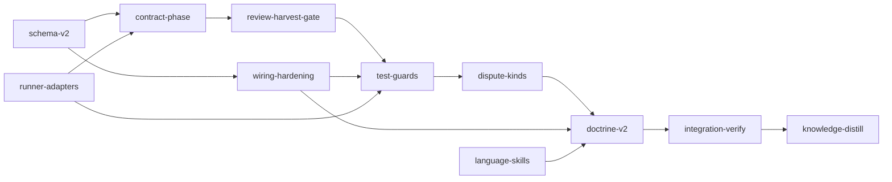

# Plan: Verification v2

## Overview

`doc/verification-report.md` measured 208 stage sessions. Acceptance criteria caught 0 major
defects at `loom stage complete`, and integration-verify still found escaped majors in 61% of
plan runs. Criteria pass because they check that code exists, that it builds, and that tests the
implementer wrote pass. They reject "did nothing" and "does not compile", but not a plausible
wrong implementation. Review found most defects, and nothing records or enforces it.

This plan adds plan format `version: 2`. v1 plans keep today's behaviour exactly. In a v2 plan:

- every standard stage carries **contracts**: named tests, each with a scenario and the wrong
  implementation it must reject. A separate loom-spawned session writes them before anyone
  implements, loom freezes them, and completion requires them to pass unchanged;
- **review is recorded and blocks completion**. Reviewer findings are harvested at
  `SubagentStop`, and every finding must be fixed and re-reviewed or ruled on through an extended
  **dispute → adjudication** mechanism. Reviewer suggestions go to loom memory, integration-verify
  considers them, and knowledge-distill records the rest;
- **test-runner adapters** for the major languages parse runner output: a criterion that selects
  zero tests fails, contracts prove the named test ran, and completion also runs the tests the
  change reaches;
- **test integrity**: deleted tests, deleted or edited assertions and ratchet-file edits need an
  adjudicated acceptance;
- wiring checks gain glob sources, literal patterns, definition-site exclusion and a `reachable`
  form, beside the existing regex form;
- `plan verify` rejects criteria that cannot work: unknown `loom` subcommands, regex hazards,
  network without a domain, knowledge checks that cannot pass, and Rust test filters that match
  nothing.

This plan itself is a **v1** plan: the `loom` that runs it accepts only version 1.

## Goals

- Implement `doc/plans/briefs/verification-v2/DESIGN.md` (sections D0–D17). That file is
  authoritative. The plan prose summarises it, and where they differ the design file wins.
- v1 plans behave exactly as today.
- Non-goals: mutation testing; removing or weakening any existing verification layer.

## Report coverage

| Report finding | What addresses it | Stage |
| --- | --- | --- |
| 1. Acceptance only re-runs the gate | Contracts: named tests with a stated wrong implementation, written by a separate session and frozen before implementation | contract-phase, doctrine-v2 |
| 2. Goal-backward matches text | Glob `source`, `literal`, definition-site exclusion, `reachable`; regex lints | schema-v2, wiring-hardening |
| 3. Review finds most defects, unrecorded | Harvested review rounds, blocking findings, re-review of fix diffs, dispute → adjudication | review-harvest-gate, dispute-kinds |
| 4. Gate catches seam breaks | No change needed; the gate still runs | — |
| 5. Escapes need a wider view | Contract risk checklist (untrusted input, paths, I/O volume, config propagation, lifecycle, reachability, external data); impact-selected tests; IV reachability re-verification | doctrine-v2, test-guards |
| 6. IV completes with findings open | v2 IV review gate; IV never defers; carried findings; full test command required | review-harvest-gate, dispute-kinds, contract-phase |
| 7. Fixes need review; tests bent to pass | Re-review at the final fingerprint; frozen contracts; test-integrity events including edited assertions; ratchet files | review-harvest-gate, test-guards |
| 8. Module-scoped criteria miss other modules | Impact-selected tests at completion | test-guards |
| Criterion bugs (47 false alarms) | Unknown `loom` subcommands, regex hazards, Rust filters matching nothing, zero-test guard | schema-v2, contract-phase |
| Environment (30 false alarms) | Static checks only: network without a domain, ungrantable resources, the rustc wrapper warning. `plan verify` runs on the host and cannot probe a stage sandbox | schema-v2 |

Out of scope by decision: mutation testing; a separate smoke-test requirement.

## Baseline (observed at `042e0fb3`, host, 2026-09-24)

| Command | Result |
| --- | --- |
| `cargo build --manifest-path loom/Cargo.toml --all-targets` | exit 0 |
| `cargo clippy --manifest-path loom/Cargo.toml --all-targets -- -D warnings` | exit 0 |
| `cargo fmt --manifest-path loom/Cargo.toml --all -- --check` | exit 0 |
| `cargo test --manifest-path loom/Cargo.toml --all-targets` | 5,836 passed, 0 failed, 6 ignored; 56 s warm |
| `cargo test --manifest-path loom/Cargo.toml --test maintainability` | exit 0 |
| `bash loom-hooks/tests/run-all.sh` | exit 0 |
| `loom knowledge check --strict --baseline doc/loom/knowledge/check-baseline.txt` | exit 0 |

Module filters used by stage acceptance select tests at HEAD: `plan::schema::` 196,
`models::stage::` 110, `verify::goal_backward::` 27, `verify::criteria::` 82,
`skills::project::` 14, `orchestrator::adjudication::` 74, `orchestrator::signals::` 199,
`fs::memory::` 42, `commands::memory::` 42, `orchestrator::core::` 206, `daemon::server::` 102,
`relay::` 132, `commands::stage::` 166, `commands::hook::` 164, `models::session::` 49,
`context::` 517.

Named-test criteria use libtest's multi-filter form,
`cargo test --lib -- name1 name2 ... 2>&1 | rg -qF 'test result: ok. N passed;'`. Verified at
HEAD: two existing names give `ok. 2 passed;`, and replacing one with a missing name gives
`ok. 1 passed;`, so the criterion fails when a named test is missing or renamed.

These baselines were observed on the host. The stage sandbox was not reproduced from the plan
session. If sccache blocks cargo inside a stage (`mistakes/sandbox-tooling-and-network`), the
operator runs `LOOM_SCCACHE=0 loom run`; criteria carry no workaround prefix.

Test-runner fixtures: real output of 14 runners was captured on this host into
`doc/plans/briefs/verification-v2/fixtures/` (versions and the no-match exit table in its
`NOTES.md`). Nine of the fourteen exit 0 when a name filter matches nothing.

## Execution Diagram



`schema-v2`, `runner-adapters` and `language-skills` run in parallel; `contract-phase` and
`wiring-hardening` run in parallel.

## Stages

Knowledge bootstrap is skipped: the tier-1 files describe this codebase, `loom knowledge sync`
runs clean, and `loom knowledge check --strict --baseline ...` passes at HEAD.

Every code stage runs its main agent on opus at xhigh effort (operator directive: critical
plan). Implementation subagents are `loom-senior-software-engineer` (opus) and, on stages that
list codex, `loom-codex-forwarder` with `--model gpt-6-sol --effort xhigh`. Worker briefs live
under `doc/plans/briefs/verification-v2/<stage-id>/`.

### 1. schema-v2 — plan version 2, v2 fields, lints

Version gating (D1), runtime `plan_version` (D2), the v2 fields and their validation (D3),
`plan verify` lints including G5 (D4), and v2 glob/literal wiring with the plan version threaded
to every wiring call site (D11, first half). **Necessity: Q1** — every later code stage compiles
against these types, so they must be merged first.

### 2. runner-adapters — adapters, language profiles, detection, `loom project detect`

The `testrun` module with 23 adapters (D5), language profiles (D6), detection and the
`loom project detect` command (D7). **Necessity: Q1** — `contract-phase` and `test-guards` run
contracts and select tests through these adapters, so they must be merged first. It runs in
parallel with `schema-v2` because its files are disjoint.

### 3. language-skills — ten new language skills, adapter sections in four

`loom-java`, `loom-kotlin`, `loom-scala`, `loom-csharp`, `loom-ruby`, `loom-php`, `loom-swift`,
`loom-elixir`, `loom-cpp`, `loom-dart`. Each gets a `## Loom Test Runner Adapter` section, and so
do `loom-rust`, `loom-golang`, `loom-python` and `loom-typescript`. **Necessity: Q4** — about 5,000
lines of expert content cannot share a session with any code stage. Adapter names and command
forms are pinned in DESIGN D5/D7, so it needs nothing merged first.

### 4. contract-phase — contract session, freeze, completion check, zero-test guard

`SessionType::Contract`, spawned before the implementation session, plus the freeze command and
daemon record (D8), the completion-time contract check (D9), the zero-test guard (D10), and the
contract runner / IV full-run lints (D4 rows 11–13). **Necessity: Q1** — the review gate, test
guards and disputes build on its session, store and v2 signal section.

### 5. wiring-hardening — worktree graph, definition-site exclusion, `reachable`

The in-memory worktree graph, definition-site exclusion and `reachable` checks (D11).
**Necessity: Q4** — combined with `contract-phase` the work would pass 500,000 tokens, and its
files are disjoint from that stage's, so it runs in parallel.

### 6. review-harvest-gate — recorded review, suggestions to memory

Reviewer output format, the `SubagentStop` harvest, review rounds, the change fingerprint,
`loom stage review status`, the review gate, the `suggestion` memory kind and the `implemented`
receipt, and the v2 signal sections (D12, D16). **Necessity: Q2** — it edits
`complete_verification.rs` and the v2 signal section, which `contract-phase` owns.

### 7. test-guards — test integrity, impact-selected tests, IV reachability

Test-integrity events including edited assertions (D13, G2), impact-selected tests (D14, G1), and
integration-verify re-verification of every stage's `reachable` checks. **Necessity: Q2 and
Q4** — it edits `complete_verification.rs` after `review-harvest-gate`, and together they would
pass 500,000 tokens.

### 8. dispute-kinds — findings, contract and integrity disputes

Dispute kinds, CLI, daemon filing, per-kind budgets and judge prompts, the new verdicts, apply,
carried findings, and "integration-verify never defers" (D15). **Necessity: Q1** — it writes the
rulings, carried-findings and integrity files whose formats stages 6–7 define, and updates their
failure messages.

### 9. doctrine-v2 — plan-writer and orchestration skills, BLOCK-E

The plan-writer skill's v2 template, contract risk checklist and `loom project detect` step;
the orchestration skill's v2 stage flow; the BLOCK-E pin; the adapter-to-skill coverage test
(D16). **Necessity: Q1** — the doctrine must describe merged behaviour of every feature stage.

### 10. integration-verify

Full gate once (the only full-suite run in the plan), parallel reviews, fixes, and behavioural
checks of `plan verify` on v1/v2 fixture plans and of `loom project detect` on this repository.

### 11. knowledge-distill

Curates every memory, including the nine adapters whose fixtures come from documented formats,
into knowledge; updates README and CONTRIBUTING for plan v2.

<!-- loom METADATA -->

```yaml
loom:
  version: 1
  sandbox:
    enabled: true
    auto_allow: true
    filesystem:
      deny_read:
        - "~/.ssh/**"
        - "~/.aws/**"
        - "~/.config/gcloud/**"
        - "~/.gnupg/**"
        - ".loom/work/admin.token"
        - ".loom/work/user.token"
      allow_write:
        - "loom/src/**"
        - "loom/tests/**"
        - "loom/target/**"
        - "loom/maintainability-baseline.txt"
        - "loom-hooks/**"
        - "skills/**"
        - "agents/**"
        - "README.md"
        - "CONTRIBUTING.md"
    network:
      allowed_domains: ["crates.io", "index.crates.io", "static.crates.io"]
      allow_local_binding: true
      allow_unix_sockets: []
  stages:
    - id: knowledge-bootstrap
      name: "Re-verify the knowledge this plan builds on"
      stage_type: knowledge
      working_dir: "."
      dependencies: []
      description: |
        The knowledge base already describes this codebase; this stage re-verifies the
        topics every later stage will be briefed from, so no stage acts on a stale claim.
        NEVER Claude Code auto-memory. Use the loom knowledge CLI, never Write/Edit on
        knowledge files.
        Use parallel subagents and skills to maximize performance.
        1. Run loom knowledge sync, then loom knowledge check. Its "review:" lines name
           topics whose cited files changed since they were verified.
        2. Spawn parallel Explore subagents, one per group below, each told to re-read the
           cited source for every section of its topics and return, per stale claim, the
           exact loom knowledge replace-section command that corrects it (heading plus the
           full corrected body, naming the wrong claim), or "verified" when nothing changed:
           - memory and hooks: architecture/memory-spool.md, architecture/hook-system.md,
             mistakes/sandbox-state-channels.md;
           - retrieval and signals: architecture/source-graph.md,
             architecture/signal-generation.md, architecture/token-accounting-and-receipts.md
             (the criterion cache section);
           - verification and adjudication: architecture/plan-lifecycle-and-fields.md,
             patterns/stage-lifecycle-and-verification.md,
             architecture/adjudication-lifecycle.md,
             conventions/dispute-and-adjudication.md, architecture/skill-catalog.md.
        3. Apply every returned command yourself, read each command's output (a
           non-matching heading appends and says so), then run
           loom knowledge annotate <file> --verified HEAD for every topic above.
        4. Finish with loom knowledge check --strict --baseline
           doc/loom/knowledge/check-baseline.txt.
        TIER ROUTING: a correction longer than about 40 lines goes to a tier-2 topic with a
        2-4 line tier-1 summary and link. INDEX.md regenerates on every knowledge write.
      acceptance:
        - "loom knowledge check --strict --baseline doc/loom/knowledge/check-baseline.txt"
        - 'out=$(loom knowledge check 2>&1) && ! printf "%s\n" "$out" | rg -q "^review: (architecture/(memory-spool|hook-system|source-graph|signal-generation|token-accounting-and-receipts|plan-lifecycle-and-fields|adjudication-lifecycle|skill-catalog)|patterns/stage-lifecycle-and-verification|conventions/dispute-and-adjudication|mistakes/sandbox-state-channels)\.md:"'
      files: ["doc/loom/knowledge/**"]
      artifacts:
        - "doc/loom/knowledge/architecture.md"
        - "doc/loom/knowledge/patterns.md"

    - id: schema-v2
      name: "Plan version 2: schema, runtime version, lints, v2 wiring"
      stage_type: standard
      model: "opus"
      reasoning_effort: "xhigh"
      skills: ["loom-rust"]
      working_dir: "."
      dependencies: ["knowledge-bootstrap"]
      description: |
        Implement DESIGN D1, D2, D3, D4 (every row except the three marked stage
        contract-phase) and the glob/literal half of D11, from
        doc/plans/briefs/verification-v2/DESIGN.md. Read D0 first: v1 behaviour is
        unchanged, the maintainability ledger is exact-match, new code goes into new modules.
        Use parallel subagents and skills to maximize performance.
        MODEL: opus at xhigh by operator directive (critical plan). Every worker is
        loom-senior-software-engineer.

        STAGE NECESSITY: Q1. Every later code stage compiles against these types.

        WAVES. Territories are DISJOINT. Workers NEVER spawn subagents. Spawn every worker
        BY AGENT TYPE, each with the fixed prompt plus "Your brief: <path>. Read it in full
        before anything else." Wave 1: W1 and W2 in ONE message (the new field names and
        signatures are pinned in DESIGN D2/D3, so they work in parallel). Wave 2, after both
        report: W3, W4, W5 in ONE message.

        | Worker | Role | Tier | Files owned | Shared context | Brief path |
        | ------ | ---- | ---- | ----------- | -------------- | ---------- |
        | W1 | Schema and runtime types | opus | loom/src/plan/schema/types.rs, loom/src/plan/schema/types_v2.rs, loom/src/models/stage/types.rs, loom/src/models/stage/checks.rs, loom/src/models/stage/methods.rs, loom/src/models/stage/methods_v2_tests.rs, loom/src/fs/stage_loading.rs, loom/src/commands/init/plan_setup.rs | DESIGN D2, D3 | doc/plans/briefs/verification-v2/schema-v2/w1-types.md |
        | W2 | Construction sites and version tests | opus | loom/src/plan/graph/tests.rs, loom/src/fs/tests_stage_loading_round_trip.rs, loom/tests/e2e/daemon_config/mod.rs, loom/tests/e2e/daemon_config/tests.rs, loom/tests/e2e/criteria_validation/mod.rs, loom/tests/e2e/criteria_validation/structure.rs, loom/tests/integration/helpers.rs, loom/src/commands/init/tests.rs, loom/src/commands/run/tests/mod.rs, loom/src/orchestrator/core/event_handler/tests.rs, loom/src/orchestrator/core/knowledge_completion_tests.rs, loom/src/orchestrator/core/recovery_guard_tests.rs, loom/src/orchestrator/core/recovery_sync_tests.rs, loom/src/orchestrator/core/recovery_terminal_tests.rs, loom/src/orchestrator/core/mod.rs, loom/src/orchestrator/signals/retrieval.rs, loom/src/git/worktree/base.rs, loom/src/plan/amendment.rs, loom/src/plan/tests/amendment.rs, loom/src/plan/schema/host_paths/tests.rs, loom/src/plan/schema/structural_checks.rs, loom/src/plan/schema/structural_checks/declared_skills.rs, loom/src/plan/schema/structural_checks/worker_table_tests.rs, loom/src/plan/schema/tests/acceptance_tests.rs, loom/src/plan/schema/tests/base_tree_tests.rs, loom/src/plan/schema/tests/criterion_hazard_tests.rs, loom/src/plan/schema/tests/stage_id_tests.rs, loom/src/plan/schema/tests/validation_tests.rs, loom/src/plan/parser/validation.rs, loom/src/plan/parser/mod.rs, loom/tests/integration/plan_verify.rs | DESIGN D1, D3 | doc/plans/briefs/verification-v2/schema-v2/w2-sites.md |
        | W3 | v2 validation and wiring into validate/verify | opus | loom/src/plan/schema/validation.rs, loom/src/plan/schema/validation/v2_fields.rs, loom/src/plan/schema/tests/mod.rs, loom/src/plan/schema/tests/v2_tests.rs, loom/src/commands/plan/verify.rs, loom/tests/fixtures/plans/v2-valid.md, loom/tests/fixtures/plans/v1-uses-contracts.md | DESIGN D1, D3, D4 | doc/plans/briefs/verification-v2/schema-v2/w3-validation.md |
        | W4 | plan verify lints | opus | loom/src/plan/schema/validation/v2_lints/mod.rs, loom/src/plan/schema/validation/v2_lints/loom_subcommands.rs, loom/src/plan/schema/validation/v2_lints/regex_patterns.rs, loom/src/plan/schema/validation/v2_lints/sandbox_capability.rs, loom/src/plan/schema/validation/v2_lints/knowledge_check.rs, loom/src/plan/schema/validation/v2_lints/rust_filters.rs, loom/src/plan/schema/tests/v2_lint_tests.rs | DESIGN D4 | doc/plans/briefs/verification-v2/schema-v2/w4-lints.md |
        | W5 | v2 wiring semantics and version threading | opus | loom/src/verify/goal_backward/wiring.rs, loom/src/verify/goal_backward/wiring_v2.rs, loom/src/verify/goal_backward/mod.rs, loom/src/commands/stage/complete_verification.rs, loom/src/commands/verify.rs | DESIGN D11 | doc/plans/briefs/verification-v2/schema-v2/w5-wiring.md |

        LEDGER: you own loom/maintainability-baseline.txt. Workers report the exact new line
        counts of every ledgered file or function they touched; lower those entries (or
        remove them once back under the limit). No ledgered item may grow.

        NAMED TESTS (binding names; the acceptance counts them): the 14 names listed in the
        last acceptance entry. Each brief says which worker writes which.

        MEMORY: record mistakes, decisions and surprises via loom memory immediately,
        subagents too; NEVER loom knowledge (implementation stage); NEVER Claude Code
        auto-memory. Knowledge files are cited by section heading.
      files:
        - "loom/src/plan/**"
        - "loom/src/models/stage/**"
        - "loom/src/fs/stage_loading.rs"
        - "loom/src/fs/tests_stage_loading_round_trip.rs"
        - "loom/src/commands/init/**"
        - "loom/src/commands/run/tests/**"
        - "loom/src/commands/plan/verify.rs"
        - "loom/src/commands/verify.rs"
        - "loom/src/commands/stage/complete_verification.rs"
        - "loom/src/orchestrator/core/**"
        - "loom/src/orchestrator/signals/retrieval.rs"
        - "loom/src/git/worktree/base.rs"
        - "loom/src/verify/goal_backward/**"
        - "loom/tests/e2e/**"
        - "loom/tests/integration/plan_verify.rs"
        - "loom/tests/integration/helpers.rs"
        - "loom/tests/fixtures/plans/**"
        - "loom/maintainability-baseline.txt"
      before_stage:
        - command: "test ! -e loom/src/plan/schema/types_v2.rs"
          description: "plan v2 types do not exist yet"
      after_stage:
        - command: "test -e loom/src/plan/schema/types_v2.rs"
          description: "the stage created loom/src/plan/schema/types_v2.rs"
      artifacts:
        - "loom/src/plan/schema/types_v2.rs"
        - "loom/src/plan/schema/validation/v2_fields.rs"
        - "loom/src/plan/schema/validation/v2_lints/mod.rs"
        - "loom/src/verify/goal_backward/wiring_v2.rs"
        - "loom/tests/fixtures/plans/v2-valid.md"
        - "loom/tests/fixtures/plans/v1-uses-contracts.md"
      wiring:
        - source: "loom/src/plan/schema/validation.rs"
          pattern: "v2_fields::"
          description: "validate() calls the v2 field rules"
        - source: "loom/src/commands/plan/verify.rs"
          pattern: "v2_lints::run"
          description: "plan verify runs the v2 lints"
        - source: "loom/src/commands/init/plan_setup.rs"
          pattern: "PlanIdentity"
          description: "init passes the plan version into Stage::from_definition"
      acceptance:
        - "cargo build --manifest-path loom/Cargo.toml --all-targets"
        - "cargo clippy --manifest-path loom/Cargo.toml --all-targets -- -D warnings"
        - "cargo fmt --manifest-path loom/Cargo.toml --all -- --check"
        - "cargo test --manifest-path loom/Cargo.toml --test maintainability"
        - "cargo test --manifest-path loom/Cargo.toml --lib plan::"
        - "cargo test --manifest-path loom/Cargo.toml --lib models::stage::"
        - "cargo test --manifest-path loom/Cargo.toml --lib verify::goal_backward::"
        - "cargo test --manifest-path loom/Cargo.toml --test integration plan_verify::"
        - 'cargo test --manifest-path loom/Cargo.toml --lib -- v1_plan_with_contracts_requires_version_2 v2_standard_stage_without_contracts_is_rejected v2_plan_with_valid_contract_passes unsupported_version_3_is_rejected from_definition_copies_v2_fields v2_fields_survive_stage_file_round_trip v2_glob_source_matches_any_file v1_glob_source_stays_a_literal_path v2_literal_pattern_matches_metacharacters_literally unknown_loom_subcommand_is_error_in_v2 dash_leading_rg_pattern_is_flagged rust_filter_matching_no_module_warns knowledge_strict_check_without_baseline_is_flagged network_binary_without_domains_is_error_in_v2 2>&1 | rg -qF "test result: ok. 14 passed;"'

    - id: runner-adapters
      name: "Test-runner adapters, language profiles, detection"
      stage_type: standard
      model: "opus"
      reasoning_effort: "xhigh"
      implementers: ["codex", "claude"]
      subagent_timeout_secs: 900
      skills: ["loom-rust"]
      working_dir: "."
      dependencies: ["knowledge-bootstrap"]
      description: |
        Implement DESIGN D5, D6, D7 from doc/plans/briefs/verification-v2/DESIGN.md.
        Read D0 first. Real runner output for 14 adapters is captured under
        doc/plans/briefs/verification-v2/fixtures/ (read its NOTES.md): copy it, never edit it.
        Use parallel subagents and skills to maximize performance.
        MODEL: opus at xhigh by operator directive. Claude workers are
        loom-senior-software-engineer; codex units are loom-codex-forwarder in the
        FOREGROUND with --model gpt-6-sol --effort xhigh and an explicit 600000 ms Bash
        timeout, one adapter file per unit (plus fixtures for the uncaptured runners).

        STAGE NECESSITY: Q1. contract-phase and test-guards run contracts and select tests
        through these adapters.

        WAVES. Territories are DISJOINT. Workers NEVER spawn subagents. Spawn every worker
        BY AGENT TYPE with the fixed prompt plus "Your brief: <path>. Read it in full before
        anything else."
        Wave 1 (ONE message): W1, W2, W3.
        Wave 2 (after W1 reports; the trait is then on disk): the 22 codex units in rows
        CX-A to CX-D, at most 6 in flight at a time, each unit told which single adapter file
        it owns. A codex unit cannot compile its file until it is registered, so its proof is
        rustfmt --edition 2021 --check on its file. Tell every codex unit NOT to run git;
        after each codex run check git status --short yourself.
        Wave 3 (you): add every returned adapter to the single adapters!(...) invocation in
        loom/src/testrun/adapters/mod.rs (one identifier each; a small edit), then run
        cargo test --lib testrun:: and send each failing adapter back to a FRESH codex unit
        with the compiler or test output. Re-split a timed-out unit against the partial tree.

        | Worker | Role | Tier | Files owned | Shared context | Brief path |
        | ------ | ---- | ---- | ----------- | -------------- | ---------- |
        | W1 | testrun core, registry, cargo-test reference adapter, captured fixtures | opus | loom/src/lib.rs, loom/src/testrun/mod.rs, loom/src/testrun/outcome.rs, loom/src/testrun/recognize.rs, loom/src/testrun/registry.rs, loom/src/testrun/fixture_support.rs, loom/src/testrun/tests.rs, loom/src/testrun/adapters/mod.rs, loom/src/testrun/adapters/cargo_test.rs, loom/src/testrun/fixtures/cargo-test/**, loom/src/testrun/fixtures/go-test/**, loom/src/testrun/fixtures/pytest/**, loom/src/testrun/fixtures/unittest/**, loom/src/testrun/fixtures/node-test/**, loom/src/testrun/fixtures/bun-test/**, loom/src/testrun/fixtures/vitest/**, loom/src/testrun/fixtures/jest/**, loom/src/testrun/fixtures/mocha/**, loom/src/testrun/fixtures/ctest/**, loom/src/testrun/fixtures/dart-test/**, loom/src/testrun/fixtures/flutter-test/**, loom/src/testrun/fixtures/dotnet-test/**, loom/src/testrun/fixtures/minitest/** | DESIGN D5; fixtures NOTES.md | doc/plans/briefs/verification-v2/runner-adapters/w1-core.md |
        | W2 | Detection and runner selection | opus | loom/src/skills/project.rs, loom/src/skills/project/markers.rs, loom/src/skills/project/runners.rs, loom/src/skills/project/tests.rs, loom/src/skills/project/runners_tests.rs, loom/src/skills/recommend.rs | DESIGN D7 | doc/plans/briefs/verification-v2/runner-adapters/w2-detection.md |
        | W3 | loom project detect command | opus | loom/src/cli/types.rs, loom/src/cli/types_project.rs, loom/src/cli/dispatch.rs, loom/src/commands/mod.rs, loom/src/commands/project.rs, loom/tests/integration/project_detect.rs, loom/tests/integration/mod.rs | DESIGN D7 | doc/plans/briefs/verification-v2/runner-adapters/w3-command.md |
        | CX-A | codex units: captured JS/Go/Python adapters | codex gpt-6-sol | loom/src/testrun/adapters/go_test.rs, loom/src/testrun/adapters/pytest.rs, loom/src/testrun/adapters/unittest.rs, loom/src/testrun/adapters/vitest.rs, loom/src/testrun/adapters/jest.rs, loom/src/testrun/adapters/mocha.rs | DESIGN D5 | doc/plans/briefs/verification-v2/runner-adapters/cx-adapters.md |
        | CX-B | codex units: captured Bun/Node/C++/Dart/.NET adapters | codex gpt-6-sol | loom/src/testrun/adapters/bun_test.rs, loom/src/testrun/adapters/node_test.rs, loom/src/testrun/adapters/ctest.rs, loom/src/testrun/adapters/dart_test.rs, loom/src/testrun/adapters/flutter_test.rs, loom/src/testrun/adapters/dotnet_test.rs | DESIGN D5 | doc/plans/briefs/verification-v2/runner-adapters/cx-adapters.md |
        | CX-C | codex units: minitest and documented-format adapters | codex gpt-6-sol | loom/src/testrun/adapters/minitest.rs, loom/src/testrun/adapters/cargo_nextest.rs, loom/src/testrun/adapters/gradle.rs, loom/src/testrun/adapters/maven.rs, loom/src/testrun/adapters/sbt.rs, loom/src/testrun/adapters/rspec.rs, loom/src/testrun/fixtures/cargo-nextest/**, loom/src/testrun/fixtures/gradle/**, loom/src/testrun/fixtures/maven/**, loom/src/testrun/fixtures/sbt/**, loom/src/testrun/fixtures/rspec/** | DESIGN D5 | doc/plans/briefs/verification-v2/runner-adapters/cx-adapters.md |
        | CX-D | codex units: documented-format adapters, language profiles | codex gpt-6-sol | loom/src/testrun/adapters/phpunit.rs, loom/src/testrun/adapters/pest.rs, loom/src/testrun/adapters/swift_test.rs, loom/src/testrun/adapters/mix_test.rs, loom/src/testrun/languages.rs, loom/src/testrun/fixtures/phpunit/**, loom/src/testrun/fixtures/pest/**, loom/src/testrun/fixtures/swift-test/**, loom/src/testrun/fixtures/mix-test/** | DESIGN D5, D6 | doc/plans/briefs/verification-v2/runner-adapters/cx-adapters.md |

        LEDGER: this stage runs in parallel with schema-v2, which owns
        loom/maintainability-baseline.txt, so this stage never edits the ledger. Every ledgered
        file or function you touch keeps its EXACT recorded count: cli/dispatch.rs `dispatch`
        is ledgered at 86 lines, so W3 moves exactly as many lines out of it as its new arm
        adds.

        MEMORY: record mistakes, decisions and surprises via loom memory immediately,
        subagents too; NEVER loom knowledge; NEVER Claude Code auto-memory. Record one memory
        note naming the nine adapters whose fixtures come from documented formats.
      files:
        - "loom/src/lib.rs"
        - "loom/src/testrun/**"
        - "loom/src/skills/**"
        - "loom/src/cli/types.rs"
        - "loom/src/cli/types_project.rs"
        - "loom/src/cli/dispatch.rs"
        - "loom/src/commands/mod.rs"
        - "loom/src/commands/project.rs"
        - "loom/tests/integration/project_detect.rs"
        - "loom/tests/integration/mod.rs"
      before_stage:
        - command: "test ! -e loom/src/testrun/mod.rs"
          description: "the testrun module does not exist yet"
      after_stage:
        - command: "test -e loom/src/testrun/mod.rs"
          description: "the stage created loom/src/testrun/mod.rs"
      artifacts:
        - "loom/src/testrun/mod.rs"
        - "loom/src/testrun/registry.rs"
        - "loom/src/testrun/languages.rs"
        - "loom/src/skills/project/runners.rs"
        - "loom/src/commands/project.rs"
      wiring:
        - source: "loom/src/cli/dispatch.rs"
          pattern: "Commands::Project"
          description: "loom project is dispatched"
        - source: "loom/src/skills/project.rs"
          pattern: "runners::detect_runner"
          description: "package details use runner detection"
      acceptance:
        - "cargo build --manifest-path loom/Cargo.toml --all-targets"
        - "cargo clippy --manifest-path loom/Cargo.toml --all-targets -- -D warnings"
        - "cargo fmt --manifest-path loom/Cargo.toml --all -- --check"
        - "cargo test --manifest-path loom/Cargo.toml --test maintainability"
        - "cargo test --manifest-path loom/Cargo.toml --lib testrun::"
        - "cargo test --manifest-path loom/Cargo.toml --lib skills::"
        - 'cargo test --manifest-path loom/Cargo.toml --lib -- registry_lists_every_adapter every_fixture_classifies_as_expected recognizes_prefixed_invocations full_run_detection_ignores_filtered_runs package_script_indirection_is_recognized every_language_profile_counts_samples detects_runner_for_each_ecosystem javascript_package_maps_to_typescript_skill vitest_dependency_wins_over_bun_lockfile 2>&1 | rg -qF "test result: ok. 9 passed;"'
        - 'cargo test --manifest-path loom/Cargo.toml --test integration -- project_detect_json_reports_packages 2>&1 | rg -qF "test result: ok. 1 passed;"'

    - id: language-skills
      name: "Language skills with test-runner adapter sections"
      stage_type: standard
      model: "opus"
      reasoning_effort: "xhigh"
      working_dir: "."
      dependencies: ["knowledge-bootstrap"]
      description: |
        Write ten new catalogued language skills and add a Loom Test Runner Adapter section to
        four existing ones, per doc/plans/briefs/verification-v2/language-skills/SPEC.md
        (structure, frontmatter, the adapter section's exact contents from DESIGN D5/D7).
        Use parallel subagents and skills to maximize performance.
        MODEL: opus at xhigh by operator directive; every worker is
        loom-senior-software-engineer.

        STAGE NECESSITY: Q4. About 5,000 lines of expert content cannot share a session with a
        code stage; adapter names and command forms are pinned in DESIGN, so nothing must be
        merged first.

        Territories are DISJOINT. Workers NEVER spawn subagents. Spawn all five BY AGENT TYPE
        in ONE message, each with the fixed prompt plus "Your brief: <path>. Read it in full
        before anything else."

        | Worker | Role | Tier | Files owned | Shared context | Brief path |
        | ------ | ---- | ---- | ----------- | -------------- | ---------- |
        | W1 | JVM skills | opus | skills/loom-java/SKILL.md, skills/loom-kotlin/SKILL.md, skills/loom-scala/SKILL.md | SPEC.md; skills/loom-python/SKILL.md as the shape reference | doc/plans/briefs/verification-v2/language-skills/w1-jvm.md |
        | W2 | .NET and C++ skills | opus | skills/loom-csharp/SKILL.md, skills/loom-cpp/SKILL.md | SPEC.md | doc/plans/briefs/verification-v2/language-skills/w2-csharp-cpp.md |
        | W3 | Ruby, PHP, Elixir skills | opus | skills/loom-ruby/SKILL.md, skills/loom-php/SKILL.md, skills/loom-elixir/SKILL.md | SPEC.md | doc/plans/briefs/verification-v2/language-skills/w3-ruby-php-elixir.md |
        | W4 | Swift and Dart skills | opus | skills/loom-swift/SKILL.md, skills/loom-dart/SKILL.md | SPEC.md | doc/plans/briefs/verification-v2/language-skills/w4-swift-dart.md |
        | W5 | Adapter sections in existing skills, catalog table | opus | skills/loom-rust/SKILL.md, skills/loom-golang/SKILL.md, skills/loom-python/SKILL.md, skills/loom-typescript/SKILL.md, skills/loom-skills/SKILL.md | SPEC.md | doc/plans/briefs/verification-v2/language-skills/w5-existing.md |

        MEMORY: record mistakes, decisions and surprises via loom memory immediately,
        subagents too; NEVER loom knowledge; NEVER Claude Code auto-memory.
      files:
        - "skills/**"
      before_stage:
        - command: "test ! -e skills/loom-java/SKILL.md"
          description: "the new language skills do not exist yet"
      after_stage:
        - command: "test -e skills/loom-java/SKILL.md"
          description: "the stage created skills/loom-java/SKILL.md"
      wiring:
        - source: "skills/loom-skills/SKILL.md"
          pattern: "`loom-java`"
          description: "the catalog table lists the new skills"
        - source: "skills/loom-skills/SKILL.md"
          pattern: "`loom-dart`"
          description: "the catalog table lists the new skills"
      artifacts:
        - "skills/loom-java/SKILL.md"
        - "skills/loom-kotlin/SKILL.md"
        - "skills/loom-scala/SKILL.md"
        - "skills/loom-csharp/SKILL.md"
        - "skills/loom-cpp/SKILL.md"
        - "skills/loom-ruby/SKILL.md"
        - "skills/loom-php/SKILL.md"
        - "skills/loom-elixir/SKILL.md"
        - "skills/loom-swift/SKILL.md"
        - "skills/loom-dart/SKILL.md"
      acceptance:
        - "cargo build --manifest-path loom/Cargo.toml"
        - "cargo test --manifest-path loom/Cargo.toml --lib assets::"
        - 'test "$(rg -l ''^## Loom Test Runner Adapter$'' skills/loom-java/SKILL.md skills/loom-kotlin/SKILL.md skills/loom-scala/SKILL.md skills/loom-csharp/SKILL.md skills/loom-cpp/SKILL.md skills/loom-ruby/SKILL.md skills/loom-php/SKILL.md skills/loom-elixir/SKILL.md skills/loom-swift/SKILL.md skills/loom-dart/SKILL.md skills/loom-rust/SKILL.md skills/loom-golang/SKILL.md skills/loom-python/SKILL.md skills/loom-typescript/SKILL.md | rg -c .)" -eq 14'
        - 'test "$(rg -c ''^\| `loom-(java|kotlin|scala|csharp|cpp|ruby|php|elixir|swift|dart)` \|'' skills/loom-skills/SKILL.md)" -eq 10'

    - id: contract-phase
      name: "Contract session, freeze, contract completion check, zero-test guard"
      stage_type: standard
      model: "opus"
      reasoning_effort: "xhigh"
      skills: ["loom-rust"]
      working_dir: "."
      dependencies: ["schema-v2", "runner-adapters"]
      description: |
        Implement DESIGN D8, D9, D10 and the D4 rows marked stage contract-phase, from
        doc/plans/briefs/verification-v2/DESIGN.md. Read D0 first.
        Use parallel subagents and skills to maximize performance.
        MODEL: opus at xhigh by operator directive; every worker is
        loom-senior-software-engineer.

        STAGE NECESSITY: Q1. The review gate, test guards and disputes build on the Contract
        session, the freeze store, the v2 signal section and the completion hook this stage
        adds.

        Territories are DISJOINT; the shared interfaces are pinned in DESIGN D8 and in each
        brief. Workers NEVER spawn subagents. Spawn all five BY AGENT TYPE in ONE message,
        each with the fixed prompt plus "Your brief: <path>. Read it in full before anything
        else." The tree compiles once all five report; then run the gate and triage.

        | Worker | Role | Tier | Files owned | Shared context | Brief path |
        | ------ | ---- | ---- | ----------- | -------------- | ---------- |
        | W1 | Contract session type plumbing | opus | loom/src/models/session/types.rs, loom/src/models/session/methods.rs, loom/src/orchestrator/terminal/backend.rs, loom/src/orchestrator/terminal/native/launch.rs, loom/src/orchestrator/terminal/native/session_settings/contents.rs, loom/src/orchestrator/session_registry.rs, loom/src/relay/emit/session_type.rs, loom-hooks/commit-guard.sh, loom-hooks/tests/commit-guard-contract-session.sh, loom-hooks/tests/run-all.sh | DESIGN D8 | doc/plans/briefs/verification-v2/contract-phase/w1-session-type.md |
        | W2 | Contract spawn, exit handling, contract signal, v2 signal section | opus | loom/src/orchestrator/core/stage_executor.rs, loom/src/orchestrator/core/stage_spawn.rs, loom/src/orchestrator/core/mod.rs, loom/src/orchestrator/core/event_handler.rs, loom/src/orchestrator/core/event_handler/contract_phase.rs, loom/src/orchestrator/monitor/events.rs, loom/src/orchestrator/monitor/session_events.rs, loom/src/orchestrator/monitor/detection.rs, loom/src/orchestrator/signals/contract.rs, loom/src/orchestrator/signals/v2_section.rs, loom/src/orchestrator/signals/mod.rs, loom/src/orchestrator/signals/generate.rs | DESIGN D8, D16 | doc/plans/briefs/verification-v2/contract-phase/w2-orchestration.md |
        | W3 | Freeze, show, restore commands | opus | loom/src/cli/types_stage.rs, loom/src/cli/types_stage_amend.rs, loom/src/cli/types_stage_contracts.rs, loom/src/cli/dispatch_stage.rs, loom/src/commands/stage/mod.rs, loom/src/commands/stage/contracts.rs, loom/src/commands/stage/contracts/freeze.rs, loom/src/commands/stage/contracts/show.rs, loom/src/commands/stage/contracts/restore.rs, loom/src/sandbox/settings.rs | DESIGN D8 | doc/plans/briefs/verification-v2/contract-phase/w3-freeze-cli.md |
        | W4 | Freeze daemon record, relay, contract completion check | opus | loom/src/daemon/protocol.rs, loom/src/daemon/server/mod.rs, loom/src/daemon/server/contracts.rs, loom/src/relay/matrix.rs, loom/src/relay/kind.rs, loom/src/relay/payload.rs, loom/src/relay/tests_matrix.rs, loom/src/fs/stage_request/types.rs, loom/src/fs/stage_request/apply.rs, loom/src/orchestrator/core/inbox_drain/apply.rs, loom/src/orchestrator/core/inbox_drain/tests_matrix.rs, loom/src/verify/mod.rs, loom/src/verify/contracts/mod.rs, loom/src/verify/contracts/store.rs, loom/src/verify/contracts/completion.rs | DESIGN D8, D9 | doc/plans/briefs/verification-v2/contract-phase/w4-daemon-store.md |
        | W5 | Zero-test guard, completion hook, contract lints | opus | loom/src/verify/criteria/criterion_eval.rs, loom/src/verify/criteria/cache_contract.rs, loom/src/verify/criteria/runner.rs, loom/src/verify/criteria/zero_tests.rs, loom/src/verify/criteria/tests/zero_test_tests.rs, loom/src/verify/criteria/tests/mod.rs, loom/src/commands/stage/complete_verification.rs, loom/src/plan/schema/validation/v2_lints/mod.rs, loom/src/plan/schema/validation/v2_lints/contracts.rs, loom/src/plan/schema/tests/v2_contract_lint_tests.rs, loom/src/plan/schema/tests/mod.rs, loom/tests/fixtures/plans/v2-valid.md, loom/tests/fixtures/plans/v1-uses-contracts.md | DESIGN D4, D9, D10 | doc/plans/briefs/verification-v2/contract-phase/w5-guards.md |

        LEDGER: you own loom/maintainability-baseline.txt. start_stage (357),
        stage_executor.rs (780) and handle_one_event (116) are ledgered: W2 extracts the spawn
        tail into stage_spawn.rs, which both shrinks them and gives the contract-exit handler
        its spawn path.

        MEMORY: record mistakes, decisions and surprises via loom memory immediately,
        subagents too; NEVER loom knowledge; NEVER Claude Code auto-memory.
      files:
        - "loom/src/models/session/**"
        - "loom/src/orchestrator/**"
        - "loom/src/relay/**"
        - "loom/src/fs/stage_request/**"
        - "loom/src/cli/**"
        - "loom/src/commands/stage/**"
        - "loom/src/sandbox/settings.rs"
        - "loom-hooks/**"
        - "loom/src/daemon/**"
        - "loom/src/verify/mod.rs"
        - "loom/src/verify/contracts/**"
        - "loom/src/verify/criteria/**"
        - "loom/src/plan/schema/**"
        - "loom/tests/fixtures/plans/**"
        - "loom/maintainability-baseline.txt"
      before_stage:
        - command: "test ! -e loom/src/verify/contracts/store.rs"
          description: "the contract store does not exist yet"
      after_stage:
        - command: "test -e loom/src/verify/contracts/store.rs"
          description: "the stage created loom/src/verify/contracts/store.rs"
      artifacts:
        - "loom/src/orchestrator/core/stage_spawn.rs"
        - "loom/src/orchestrator/core/event_handler/contract_phase.rs"
        - "loom/src/orchestrator/signals/contract.rs"
        - "loom/src/orchestrator/signals/v2_section.rs"
        - "loom/src/commands/stage/contracts/freeze.rs"
        - "loom/src/daemon/server/contracts.rs"
        - "loom/src/verify/contracts/store.rs"
        - "loom/src/verify/contracts/completion.rs"
        - "loom/src/verify/criteria/zero_tests.rs"
      wiring:
        - source: "loom/src/orchestrator/core/stage_executor.rs"
          pattern: "new_contract"
          description: "start_stage spawns a Contract session before the implementation session"
        - source: "loom/src/commands/stage/complete_verification.rs"
          pattern: "contracts::completion"
          description: "completion runs the contract check"
        - source: "loom/src/orchestrator/signals/generate.rs"
          pattern: "v2_section"
          description: "v2 stages get the v2 signal section"
      acceptance:
        - "cargo build --manifest-path loom/Cargo.toml --all-targets"
        - "cargo clippy --manifest-path loom/Cargo.toml --all-targets -- -D warnings"
        - "cargo fmt --manifest-path loom/Cargo.toml --all -- --check"
        - "cargo test --manifest-path loom/Cargo.toml --test maintainability"
        - "cargo test --manifest-path loom/Cargo.toml --lib models::session::"
        - "cargo test --manifest-path loom/Cargo.toml --lib orchestrator::"
        - "cargo test --manifest-path loom/Cargo.toml --lib relay::"
        - "cargo test --manifest-path loom/Cargo.toml --lib daemon::"
        - "cargo test --manifest-path loom/Cargo.toml --lib verify::"
        - "cargo test --manifest-path loom/Cargo.toml --lib commands::stage::"
        - "bash loom-hooks/tests/run-all.sh"
        - 'cargo test --manifest-path loom/Cargo.toml --lib -- contract_session_spawns_before_stage_session contract_phase_finished_spawns_stage_session contract_session_exit_without_freeze_respawns freeze_rejects_non_contract_changes freeze_rejects_passing_contract freeze_rejects_unselected_contract freeze_handler_records_hashes_and_copies completion_fails_when_frozen_contract_changed completion_fails_when_contract_not_selected zero_test_criterion_fails_in_v2 zero_test_criterion_passes_in_v1 contract_with_unknown_runner_is_rejected v2_iv_without_full_test_command_is_rejected 2>&1 | rg -qF "test result: ok. 13 passed;"'

    - id: wiring-hardening
      name: "Worktree graph, definition-site exclusion, reachable checks"
      stage_type: standard
      model: "opus"
      reasoning_effort: "xhigh"
      skills: ["loom-rust"]
      working_dir: "."
      dependencies: ["schema-v2"]
      description: |
        Implement the second half of DESIGN D11 (worktree graph, definition-site exclusion,
        reachable) from doc/plans/briefs/verification-v2/DESIGN.md. Read D0 first.
        Use parallel subagents and skills to maximize performance.
        MODEL: opus at xhigh by operator directive; every worker is
        loom-senior-software-engineer.

        STAGE NECESSITY: Q4. Combined with contract-phase the work would pass 500,000 tokens;
        its files are disjoint from that stage's, so it runs in parallel.

        Territories are DISJOINT; build_worktree_graph's signature is pinned in each brief.
        Workers NEVER spawn subagents. Spawn all three BY AGENT TYPE in ONE message, each with
        the fixed prompt plus "Your brief: <path>. Read it in full before anything else."

        | Worker | Role | Tier | Files owned | Shared context | Brief path |
        | ------ | ---- | ---- | ----------- | -------------- | ---------- |
        | W1 | In-memory worktree graph | opus | loom/src/context/worktree_graph.rs, loom/src/context/worktree_graph_tests.rs, loom/src/context/mod.rs | DESIGN D11 | doc/plans/briefs/verification-v2/wiring-hardening/w1-graph.md |
        | W2 | Definition-site exclusion | opus | loom/src/verify/goal_backward/wiring_v2.rs, loom/src/verify/goal_backward/definition_sites.rs, loom/src/verify/goal_backward/definition_sites_tests.rs | DESIGN D11 | doc/plans/briefs/verification-v2/wiring-hardening/w2-definitions.md |
        | W3 | Reachable checks | opus | loom/src/verify/goal_backward/reachable.rs, loom/src/verify/goal_backward/reachable_tests.rs, loom/src/verify/goal_backward/mod.rs, loom/src/verify/goal_backward/result.rs | DESIGN D11 | doc/plans/briefs/verification-v2/wiring-hardening/w3-reachable.md |

        LEDGER: this stage can run in parallel with contract-phase and review-harvest-gate,
        which own loom/maintainability-baseline.txt, so this stage never edits the ledger.
        Every file it touches is new or unledgered (schema-v2 already restructured
        verify_wiring); a ledgered item you must touch keeps its EXACT recorded count.

        MEMORY: record mistakes, decisions and surprises via loom memory immediately,
        subagents too; NEVER loom knowledge; NEVER Claude Code auto-memory.
      files:
        - "loom/src/context/**"
        - "loom/src/verify/goal_backward/**"
      before_stage:
        - command: "test ! -e loom/src/context/worktree_graph.rs"
          description: "the worktree graph does not exist yet"
      after_stage:
        - command: "test -e loom/src/context/worktree_graph.rs"
          description: "the stage created loom/src/context/worktree_graph.rs"
      artifacts:
        - "loom/src/context/worktree_graph.rs"
        - "loom/src/verify/goal_backward/definition_sites.rs"
        - "loom/src/verify/goal_backward/reachable.rs"
      wiring:
        - source: "loom/src/verify/goal_backward/mod.rs"
          pattern: "reachable::"
          description: "goal-backward verification runs reachable checks for v2 stages"
        - source: "loom/src/verify/goal_backward/wiring_v2.rs"
          pattern: "definition_sites::"
          description: "v2 wiring excludes definition-site matches"
      acceptance:
        - "cargo build --manifest-path loom/Cargo.toml --all-targets"
        - "cargo clippy --manifest-path loom/Cargo.toml --all-targets -- -D warnings"
        - "cargo fmt --manifest-path loom/Cargo.toml --all -- --check"
        - "cargo test --manifest-path loom/Cargo.toml --test maintainability"
        - "cargo test --manifest-path loom/Cargo.toml --lib context::"
        - "cargo test --manifest-path loom/Cargo.toml --lib verify::goal_backward::"
        - 'cargo test --manifest-path loom/Cargo.toml --lib -- worktree_graph_includes_uncommitted_new_file wiring_match_only_at_definition_is_a_gap wiring_match_at_consumer_passes reachable_through_call_chain_passes unreachable_symbol_is_a_gap v1_wiring_ignores_definition_sites 2>&1 | rg -qF "test result: ok. 6 passed;"'

    - id: review-harvest-gate
      name: "Recorded review, suggestions to memory, review gate"
      stage_type: standard
      model: "opus"
      reasoning_effort: "xhigh"
      implementers: ["claude", "codex"]
      subagent_timeout_secs: 900
      skills: ["loom-rust"]
      working_dir: "."
      dependencies: ["contract-phase"]
      description: |
        Implement DESIGN D12 and the D16 review, suggestion and distill sections, from
        doc/plans/briefs/verification-v2/DESIGN.md. Read D0 first.
        Use parallel subagents and skills to maximize performance.
        MODEL: opus at xhigh by operator directive. Claude workers are
        loom-senior-software-engineer; the two codex units are loom-codex-forwarder in the
        FOREGROUND with --model gpt-6-sol --effort xhigh and an explicit 600000 ms Bash
        timeout. Tell them NOT to run git; check git status --short after each.

        STAGE NECESSITY: Q2. It edits complete_verification.rs and the v2 signal section, which
        contract-phase owns.

        Territories are DISJOINT; every shared signature is pinned in the briefs. Workers NEVER
        spawn subagents. Spawn all six BY AGENT TYPE in ONE message, each with the fixed prompt
        plus "Your brief: <path>. Read it in full before anything else." The two codex units
        cannot compile until W1's verify/review/mod.rs declares them; their proof is
        rustfmt --edition 2021 --check on their file, and you run the tests after W1 reports.

        | Worker | Role | Tier | Files owned | Shared context | Brief path |
        | ------ | ---- | ---- | ----------- | -------------- | ---------- |
        | W1 | Review store and gate | opus | loom/src/verify/mod.rs, loom/src/verify/review/mod.rs, loom/src/verify/review/store.rs, loom/src/verify/review/gate.rs, loom/src/verify/review/gate_tests.rs, loom/src/commands/stage/complete_verification.rs | DESIGN D12 | doc/plans/briefs/verification-v2/review-harvest-gate/w1-store-gate.md |
        | W2 | Harvest hook, delegate, review status command | opus | loom-hooks/subagent-stop.sh, loom-hooks/tests/subagent-stop-review-harvest.sh, loom-hooks/tests/run-all.sh, loom/src/commands/hook/mod.rs, loom/src/commands/hook/review_harvest.rs, loom/src/commands/hook/review_harvest_tests.rs, loom/src/cli/types_ops.rs, loom/src/cli/dispatch.rs, loom/src/cli/types_stage.rs, loom/src/cli/types_stage_review.rs, loom/src/cli/dispatch_stage.rs, loom/src/commands/stage/mod.rs, loom/src/commands/stage/review_status.rs, loom/src/sandbox/settings.rs | DESIGN D12 | doc/plans/briefs/verification-v2/review-harvest-gate/w2-harvest.md |
        | W3 | Suggestion memory kind, implemented receipt | opus | loom/src/fs/memory/types.rs, loom/src/fs/memory/query.rs, loom/src/fs/memory/export.rs, loom/src/fs/memory/export_suggestions.rs, loom/src/commands/memory/handlers/pending.rs, loom/src/commands/memory/handlers/pending_groups.rs, loom/src/commands/memory/handlers/resolve.rs, loom/src/commands/memory/handlers/suggestion_tests.rs | DESIGN D12 | doc/plans/briefs/verification-v2/review-harvest-gate/w3-memory.md |
        | W4 | Reviewer format, v2 review/suggestion/distill signal sections | opus | agents/loom-code-reviewer.md, loom/src/orchestrator/signals/v2_section.rs, loom/src/orchestrator/signals/v2_section_review.rs, loom/src/orchestrator/signals/v2_section_tests.rs | DESIGN D12, D16 | doc/plans/briefs/verification-v2/review-harvest-gate/w4-format-signals.md |
        | CX | codex units: report parser, change fingerprint | codex gpt-6-sol | loom/src/verify/review/report.rs, loom/src/verify/review/fingerprint.rs | DESIGN D12 | doc/plans/briefs/verification-v2/review-harvest-gate/cx-parser-fingerprint.md |

        ORDER DOCTRINE (DESIGN D16 BLOCK-E wording is introduced by W4 and pinned later by
        doctrine-v2): fix -> gate -> final review -> complete.

        LEDGER: you own loom/maintainability-baseline.txt (fs/memory/export.rs
        format_memory_for_signal 92 and format_memory_for_handoff 80, fs/memory/query.rs
        generate_summary 52, cli/dispatch.rs dispatch 86, dispatch_stage 51 and
        sandbox/settings.rs 445 are ledgered).

        MEMORY: record mistakes, decisions and surprises via loom memory immediately,
        subagents too; NEVER loom knowledge; NEVER Claude Code auto-memory.
      files:
        - "loom/src/verify/mod.rs"
        - "loom/src/verify/review/**"
        - "loom/src/commands/**"
        - "loom/src/cli/**"
        - "loom/src/fs/memory/**"
        - "loom/src/orchestrator/signals/**"
        - "loom/src/sandbox/settings.rs"
        - "loom-hooks/**"
        - "agents/loom-code-reviewer.md"
        - "loom/maintainability-baseline.txt"
      before_stage:
        - command: "test ! -e loom/src/verify/review/gate.rs"
          description: "the review gate does not exist yet"
      after_stage:
        - command: "test -e loom/src/verify/review/gate.rs"
          description: "the stage created loom/src/verify/review/gate.rs"
      artifacts:
        - "loom/src/verify/review/report.rs"
        - "loom/src/verify/review/fingerprint.rs"
        - "loom/src/verify/review/store.rs"
        - "loom/src/verify/review/gate.rs"
        - "loom/src/commands/hook/review_harvest.rs"
        - "loom/src/commands/stage/review_status.rs"
        - "loom-hooks/tests/subagent-stop-review-harvest.sh"
      wiring:
        - source: "loom-hooks/subagent-stop.sh"
          pattern: "review-harvest"
          description: "SubagentStop hands reviewer transcripts to the harvest delegate"
        - source: "loom/src/commands/stage/complete_verification.rs"
          pattern: "review::gate"
          description: "completion runs the review gate"
        - source: "agents/loom-code-reviewer.md"
          pattern: "loom-review"
          description: "reviewer emits the loom-review block"
      acceptance:
        - "cargo build --manifest-path loom/Cargo.toml --all-targets"
        - "cargo clippy --manifest-path loom/Cargo.toml --all-targets -- -D warnings"
        - "cargo fmt --manifest-path loom/Cargo.toml --all -- --check"
        - "cargo test --manifest-path loom/Cargo.toml --test maintainability"
        - "cargo test --manifest-path loom/Cargo.toml --lib verify::"
        - "cargo test --manifest-path loom/Cargo.toml --lib fs::memory::"
        - "cargo test --manifest-path loom/Cargo.toml --lib commands::memory::"
        - "cargo test --manifest-path loom/Cargo.toml --lib commands::hook::"
        - "cargo test --manifest-path loom/Cargo.toml --lib orchestrator::signals::"
        - "bash loom-hooks/tests/run-all.sh"
        - 'cargo test --manifest-path loom/Cargo.toml --lib -- parses_loom_review_block finding_without_scenario_or_rule_becomes_suggestion fingerprint_ignores_commits harvest_writes_round_and_suggestions harvest_skips_v1_stage gate_fails_without_review_at_current_fingerprint gate_fails_with_open_finding gate_passes_when_later_round_resolves_finding suggestion_entries_are_pending_until_resolved implemented_outcome_requires_reason 2>&1 | rg -qF "test result: ok. 10 passed;"'

    - id: test-guards
      name: "Test integrity, impact-selected tests, IV reachability"
      stage_type: standard
      model: "opus"
      reasoning_effort: "xhigh"
      skills: ["loom-rust"]
      working_dir: "."
      dependencies: ["review-harvest-gate", "wiring-hardening", "runner-adapters"]
      description: |
        Implement DESIGN D13, D14 and the integration-verify reachable re-verification of
        D11, from doc/plans/briefs/verification-v2/DESIGN.md. Read D0 first.
        Use parallel subagents and skills to maximize performance.
        MODEL: opus at xhigh by operator directive; every worker is
        loom-senior-software-engineer.

        STAGE NECESSITY: Q2 and Q4. It edits complete_verification.rs after
        review-harvest-gate, and together they would pass 500,000 tokens.

        Territories are DISJOINT. Workers NEVER spawn subagents. Spawn all three BY AGENT TYPE
        in ONE message, each with the fixed prompt plus "Your brief: <path>. Read it in full
        before anything else."

        | Worker | Role | Tier | Files owned | Shared context | Brief path |
        | ------ | ---- | ---- | ----------- | -------------- | ---------- |
        | W1 | Test-integrity events, gate, status command | opus | loom/src/verify/integrity/mod.rs, loom/src/verify/integrity/count.rs, loom/src/verify/integrity/edits.rs, loom/src/verify/integrity/gate.rs, loom/src/verify/integrity/tests.rs, loom/src/cli/types_stage_review.rs, loom/src/commands/stage/integrity_status.rs, loom/src/commands/stage/mod.rs, loom/src/cli/dispatch_stage.rs | DESIGN D13 | doc/plans/briefs/verification-v2/test-guards/w1-integrity.md |
        | W2 | Impact-selected tests | opus | loom/src/verify/impact_tests.rs, loom/src/verify/impact_tests_tests.rs | DESIGN D14 | doc/plans/briefs/verification-v2/test-guards/w2-impact.md |
        | W3 | Completion wiring and IV reachable re-verification | opus | loom/src/verify/mod.rs, loom/src/commands/stage/complete_verification.rs, loom/src/commands/stage/complete_verification_v2.rs, loom/src/commands/stage/complete_verification_v2_tests.rs | DESIGN D11, D13, D14 | doc/plans/briefs/verification-v2/test-guards/w3-wiring.md |

        LEDGER: you own loom/maintainability-baseline.txt.

        MEMORY: record mistakes, decisions and surprises via loom memory immediately,
        subagents too; NEVER loom knowledge; NEVER Claude Code auto-memory.
      files:
        - "loom/src/verify/**"
        - "loom/src/commands/stage/**"
        - "loom/src/cli/**"
        - "loom/maintainability-baseline.txt"
      before_stage:
        - command: "test ! -e loom/src/verify/integrity/gate.rs"
          description: "the integrity gate does not exist yet"
      after_stage:
        - command: "test -e loom/src/verify/integrity/gate.rs"
          description: "the stage created loom/src/verify/integrity/gate.rs"
      artifacts:
        - "loom/src/verify/integrity/count.rs"
        - "loom/src/verify/integrity/edits.rs"
        - "loom/src/verify/integrity/gate.rs"
        - "loom/src/verify/impact_tests.rs"
        - "loom/src/commands/stage/complete_verification_v2.rs"
      wiring:
        - source: "loom/src/commands/stage/complete_verification.rs"
          pattern: "complete_verification_v2::"
          description: "completion runs the v2 test guards"
        - source: "loom/src/commands/stage/complete_verification_v2.rs"
          pattern: "impact_tests::"
          description: "v2 completion runs impact-selected tests"
      acceptance:
        - "cargo build --manifest-path loom/Cargo.toml --all-targets"
        - "cargo clippy --manifest-path loom/Cargo.toml --all-targets -- -D warnings"
        - "cargo fmt --manifest-path loom/Cargo.toml --all -- --check"
        - "cargo test --manifest-path loom/Cargo.toml --test maintainability"
        - "cargo test --manifest-path loom/Cargo.toml --lib verify::"
        - "cargo test --manifest-path loom/Cargo.toml --lib commands::stage::"
        - 'cargo test --manifest-path loom/Cargo.toml --lib -- deleted_test_declaration_is_an_integrity_event removed_assertion_is_an_integrity_event edited_assertion_in_base_test_is_an_integrity_event moved_assertion_is_not_an_integrity_event ratchet_file_change_is_an_integrity_event accepted_event_passes_until_it_worsens impact_selection_runs_reached_tests impact_selection_skips_unsupported_adapters aggregated_reachable_reverified_in_iv 2>&1 | rg -qF "test result: ok. 9 passed;"'

    - id: dispute-kinds
      name: "Findings, contract and integrity disputes"
      stage_type: standard
      model: "opus"
      reasoning_effort: "xhigh"
      implementers: ["claude", "codex"]
      subagent_timeout_secs: 900
      skills: ["loom-rust"]
      working_dir: "."
      dependencies: ["test-guards"]
      description: |
        Implement DESIGN D15 from doc/plans/briefs/verification-v2/DESIGN.md. Read D0 first.
        Use parallel subagents and skills to maximize performance.
        MODEL: opus at xhigh by operator directive. Claude workers are
        loom-senior-software-engineer; the prompt units are loom-codex-forwarder in the
        FOREGROUND with --model gpt-6-sol --effort xhigh and an explicit 600000 ms Bash
        timeout. Tell them NOT to run git; check git status --short after each.

        STAGE NECESSITY: Q1. It writes the rulings, carried-findings and integrity files whose
        formats review-harvest-gate and test-guards define, and updates their failure messages.

        WAVES. Territories are DISJOINT. Workers NEVER spawn subagents. Spawn every worker BY
        AGENT TYPE with the fixed prompt plus "Your brief: <path>. Read it in full before
        anything else." Wave 1 (ONE message): W1, W2, W3. Wave 2 (after W1 and W3 report, since
        the prompt units read W1's snapshot types and implement W3's prompt input type): the
        three CX units in ONE message. W3 declares their modules, so the tree compiles once they
        return.

        | Worker | Role | Tier | Files owned | Shared context | Brief path |
        | ------ | ---- | ---- | ----------- | -------------- | ---------- |
        | W1 | Dispute model, CLI, daemon filing, budgets | opus | loom/src/models/dispute.rs, loom/src/models/stage/types.rs, loom/src/models/stage/methods.rs, loom/src/models/stage/dispute_budgets.rs, loom/src/cli/types_stage.rs, loom/src/cli/types_stage_amend.rs, loom/src/cli/types_stage_disputes.rs, loom/src/cli/dispatch_stage.rs, loom/src/commands/stage/mod.rs, loom/src/commands/stage/dispute_criteria.rs, loom/src/commands/stage/dispute_transport.rs, loom/src/commands/stage/dispute_kinds.rs, loom/src/daemon/protocol.rs, loom/src/daemon/server/mod.rs, loom/src/daemon/server/dispute.rs, loom/src/daemon/server/dispute_kinds.rs, loom/src/relay/matrix.rs, loom/src/relay/kind.rs, loom/src/relay/payload.rs, loom/src/relay/tests_matrix.rs, loom/src/fs/stage_request/types.rs, loom/src/fs/stage_request/apply.rs, loom/src/orchestrator/core/inbox_drain/apply.rs, loom/src/orchestrator/core/inbox_drain/tests_matrix.rs | DESIGN D15 | doc/plans/briefs/verification-v2/dispute-kinds/w1-filing.md |
        | W2 | Verdict validation, apply per kind, carried findings, contract amendment | opus | loom/src/orchestrator/adjudication/verdict.rs, loom/src/orchestrator/adjudication/verdict_kinds.rs, loom/src/orchestrator/adjudication/apply.rs, loom/src/orchestrator/adjudication/apply_kinds.rs, loom/src/orchestrator/adjudication/apply_kinds_tests.rs, loom/src/orchestrator/adjudication/mod.rs, loom/src/plan/amendment.rs, loom/src/plan/amendment_fields.rs, loom/src/verify/contracts/store.rs, loom/src/verify/review/mod.rs, loom/src/verify/review/verdict_records.rs, loom/tests/adjudication_e2e.rs, loom/tests/adjudication_e2e/kinds.rs | DESIGN D15 | doc/plans/briefs/verification-v2/dispute-kinds/w2-apply.md |
        | W3 | Adjudication signal and prompt dispatch per kind, failure messages, feedback rendering | opus | loom/src/orchestrator/signals/adjudication.rs, loom/src/orchestrator/adjudication/prompt.rs, loom/src/orchestrator/signals/v2_section_review.rs, loom/src/orchestrator/signals/generate.rs, loom/src/verify/contracts/completion.rs, loom/src/verify/review/gate.rs, loom/src/verify/integrity/gate.rs | DESIGN D15, D16 | doc/plans/briefs/verification-v2/dispute-kinds/w3-signals.md |
        | CX | codex units: judge prompts per kind | codex gpt-6-sol | loom/src/orchestrator/adjudication/prompt/findings.rs, loom/src/orchestrator/adjudication/prompt/contract.rs, loom/src/orchestrator/adjudication/prompt/integrity.rs | DESIGN D15 | doc/plans/briefs/verification-v2/dispute-kinds/cx-prompts.md |

        LEDGER: you own loom/maintainability-baseline.txt (daemon/server/dispute.rs 510 and
        handle_dispute_criteria 176, adjudication apply.rs, models/stage files are ledgered).

        MEMORY: record mistakes, decisions and surprises via loom memory immediately,
        subagents too; NEVER loom knowledge; NEVER Claude Code auto-memory.
      files:
        - "loom/src/models/**"
        - "loom/src/cli/**"
        - "loom/src/commands/stage/**"
        - "loom/src/daemon/**"
        - "loom/src/relay/**"
        - "loom/src/fs/stage_request/**"
        - "loom/src/orchestrator/**"
        - "loom/src/plan/**"
        - "loom/src/verify/**"
        - "loom/tests/**"
        - "loom/maintainability-baseline.txt"
      before_stage:
        - command: "test ! -e loom/src/orchestrator/adjudication/apply_kinds.rs"
          description: "the new dispute kinds do not exist yet"
      after_stage:
        - command: "test -e loom/src/orchestrator/adjudication/apply_kinds.rs"
          description: "the stage created loom/src/orchestrator/adjudication/apply_kinds.rs"
      artifacts:
        - "loom/src/commands/stage/dispute_kinds.rs"
        - "loom/src/daemon/server/dispute_kinds.rs"
        - "loom/src/orchestrator/adjudication/apply_kinds.rs"
        - "loom/src/orchestrator/adjudication/verdict_kinds.rs"
        - "loom/src/orchestrator/adjudication/prompt/findings.rs"
        - "loom/src/orchestrator/adjudication/prompt/contract.rs"
        - "loom/src/orchestrator/adjudication/prompt/integrity.rs"
      wiring:
        - source: "loom/src/orchestrator/adjudication/apply.rs"
          pattern: "apply_kinds::"
          description: "verdict apply dispatches the new kinds"
        - source: "loom/src/cli/types_stage.rs"
          pattern: "DisputeFindings"
          description: "dispute-findings is a stage subcommand"
      acceptance:
        - "cargo build --manifest-path loom/Cargo.toml --all-targets"
        - "cargo clippy --manifest-path loom/Cargo.toml --all-targets -- -D warnings"
        - "cargo fmt --manifest-path loom/Cargo.toml --all -- --check"
        - "cargo test --manifest-path loom/Cargo.toml --test maintainability"
        - "cargo test --manifest-path loom/Cargo.toml --lib orchestrator::adjudication::"
        - "cargo test --manifest-path loom/Cargo.toml --lib daemon::"
        - "cargo test --manifest-path loom/Cargo.toml --lib commands::stage::"
        - "cargo test --manifest-path loom/Cargo.toml --lib plan::"
        - "cargo test --manifest-path loom/Cargo.toml --test adjudication_e2e"
        - 'cargo test --manifest-path loom/Cargo.toml --lib -- finding_dispute_records_kind_and_evidence dismiss_ruling_closes_finding defer_ruling_carries_finding_to_target defer_from_integration_verify_is_coerced contract_accept_refreezes_current_content contract_reject_requeues_with_restore_feedback integrity_accept_records_counts finding_dispute_budget_escalates_to_human_review criterion_dispute_behaviour_is_unchanged 2>&1 | rg -qF "test result: ok. 9 passed;"'
        - 'cargo test --manifest-path loom/Cargo.toml --test adjudication_e2e -- findings_dispute_round_trip 2>&1 | rg -qF "test result: ok. 1 passed;"'

    - id: doctrine-v2
      name: "Plan-writer and orchestration doctrine for v2, BLOCK-E"
      stage_type: standard
      model: "opus"
      reasoning_effort: "xhigh"
      skills: ["loom-rust"]
      working_dir: "."
      dependencies: ["dispute-kinds", "wiring-hardening", "language-skills"]
      description: |
        Implement the doctrine half of DESIGN D16 and teach plan authors and stage
        orchestrators the v2 flow, from doc/plans/briefs/verification-v2/DESIGN.md.
        Read D0 first. Describe the MERGED behaviour: read the code, not the design, where
        they differ, and record any difference with loom memory.
        Use parallel subagents and skills to maximize performance.
        MODEL: opus at xhigh by operator directive; both workers are
        loom-senior-software-engineer.

        STAGE NECESSITY: Q1. The doctrine must describe the merged behaviour of every feature
        stage.

        Territories are DISJOINT. Workers NEVER spawn subagents. Spawn both BY AGENT TYPE in
        ONE message, each with the fixed prompt plus "Your brief: <path>. Read it in full
        before anything else."

        | Worker | Role | Tier | Files owned | Shared context | Brief path |
        | ------ | ---- | ---- | ----------- | -------------- | ---------- |
        | W1 | Plan-writer skill v2 | opus | skills/loom-plan-writer/SKILL.md, skills/loom-plan-writer/references/verification-rules.md, skills/loom-plan-writer/references/bookend-stages.md, skills/loom-plan-writer/references/v2-contracts.md | DESIGN D1-D17 | doc/plans/briefs/verification-v2/doctrine-v2/w1-plan-writer.md |
        | W2 | Orchestration skill v2, BLOCK-E and coverage pins | opus | skills/loom-orchestration/SKILL.md, loom/src/orchestrator/signals/tests_doctrine_blocks.rs, loom/src/orchestrator/signals/tests_doctrine_v2.rs, loom/src/orchestrator/signals/mod.rs, loom/src/orchestrator/signals/v2_section_review.rs | DESIGN D16 | doc/plans/briefs/verification-v2/doctrine-v2/w2-orchestration.md |

        Doctrine surfaces pinned byte-for-byte (BLOCK-A/B/C/D) are not edited.

        MEMORY: record mistakes, decisions and surprises via loom memory immediately,
        subagents too; NEVER loom knowledge; NEVER Claude Code auto-memory.
      files:
        - "skills/loom-plan-writer/**"
        - "skills/loom-orchestration/SKILL.md"
        - "loom/src/orchestrator/signals/**"
      before_stage:
        - command: "test ! -e skills/loom-plan-writer/references/v2-contracts.md"
          description: "the v2 plan-writer reference does not exist yet"
      after_stage:
        - command: "test -e skills/loom-plan-writer/references/v2-contracts.md"
          description: "the stage created skills/loom-plan-writer/references/v2-contracts.md"
      artifacts:
        - "skills/loom-plan-writer/references/v2-contracts.md"
        - "loom/src/orchestrator/signals/tests_doctrine_v2.rs"
      wiring:
        - source: "skills/loom-plan-writer/SKILL.md"
          pattern: "references/v2-contracts.md"
          description: "the plan-writer skill routes v2 authors to the contracts reference"
        - source: "loom/src/orchestrator/signals/mod.rs"
          pattern: "tests_doctrine_v2"
          description: "the v2 doctrine pins are compiled into the test suite"
      acceptance:
        - "cargo build --manifest-path loom/Cargo.toml --all-targets"
        - "cargo clippy --manifest-path loom/Cargo.toml --all-targets -- -D warnings"
        - "cargo fmt --manifest-path loom/Cargo.toml --all -- --check"
        - "cargo test --manifest-path loom/Cargo.toml --test maintainability"
        - "cargo test --manifest-path loom/Cargo.toml --lib orchestrator::signals::"
        - 'cargo test --manifest-path loom/Cargo.toml --lib -- block_e_agrees_across_every_surface every_adapter_is_named_in_its_language_skill plan_writer_skill_names_project_detect 2>&1 | rg -qF "test result: ok. 3 passed;"'

    - id: integration-verify
      name: "Integration verification"
      stage_type: integration-verify
      skills: ["loom-rust", "loom-security-audit"]
      working_dir: "."
      dependencies:
        - "schema-v2"
        - "runner-adapters"
        - "language-skills"
        - "contract-phase"
        - "wiring-hardening"
        - "review-harvest-gate"
        - "test-guards"
        - "dispute-kinds"
        - "doctrine-v2"
      description: |
        Final verification of the merged tree. This plan is version 1: its own stages follow
        v1 doctrine. Verify FUNCTIONAL INTEGRATION, not just tests passing.
        NEVER Claude Code auto-memory.
        CONTEXT: doc/plans/briefs/verification-v2/DESIGN.md, loom memory show --all,
        doc/loom/knowledge/INDEX.md and the sections it points to.
        BUILD AND TEST (zero tolerance, one canonical verifier per tree): the acceptance
        commands below, with all stderr read.
        CODE REVIEW: parallel loom-code-reviewer subagents, one per dimension: security (the
        daemon RPCs for freeze and disputes, the harvest delegate's transcript parsing, file
        writes under .loom/work, glob expansion, command construction in the adapters);
        v1 compatibility (every v2 behaviour gated on plan_version; a v1 plan's plan verify
        errors and stage outcomes unchanged); lifecycle (contract session respawn budget,
        daemon restart with a live Contract session, verdict apply for each new kind, sibling
        disputes); token discipline (DESIGN D17: cache reuse for contract, impact and
        zero-test runs; delta re-review). Fix every finding with an engineer agent and review
        each fix diff again.
        FUNCTIONAL: run loom plan verify on the v1 and v2 fixture plans; run loom project
        detect on this repository; drive a v2 contract freeze and a findings dispute through
        the tests that exercise them and read their output.
        Record in loom memory: every discovery; one note naming the nine adapters whose
        fixtures come from documented formats (knowledge-distill lists them in concerns); any
        knowledge file the tree contradicts, as loom memory note "stale-knowledge: ...".
      acceptance:
        - "cargo build --manifest-path loom/Cargo.toml --all-targets"
        - "cargo clippy --manifest-path loom/Cargo.toml --all-targets -- -D warnings"
        - "cargo fmt --manifest-path loom/Cargo.toml --all -- --check"
        - "cargo test --manifest-path loom/Cargo.toml --all-targets"
        - "bash loom-hooks/tests/run-all.sh"
        - "cargo run -q --manifest-path loom/Cargo.toml -- plan verify --strict loom/tests/fixtures/plans/v2-valid.md"
        - 'cargo run -q --manifest-path loom/Cargo.toml -- plan verify loom/tests/fixtures/plans/v1-uses-contracts.md 2>&1 | rg -qF ''requires `version: 2`'''
        - 'cargo run -q --manifest-path loom/Cargo.toml -- project detect --json . | rg -qF "\"runner\":\"cargo-test\""'
        - 'cargo run -q --manifest-path loom/Cargo.toml -- project detect --json . | rg -qF "\"runner\":\"vitest\""'

    - id: knowledge-distill
      name: "Knowledge distillation"
      stage_type: knowledge-distill
      working_dir: "."
      dependencies: ["integration-verify"]
      description: |
        Curate all stage memories into permanent knowledge; update user docs.
        NEVER Claude Code auto-memory.
        SINGLE-AGENT: do NOT spawn subagents. Memories are compact summaries; keep code
        spot-reads narrow.
        START with loom memory pending --group (corrections, mistakes, decisions, other);
        read doc/plans/briefs/verification-v2/DESIGN.md and the knowledge sections it touches.
        CORRECTIONS FIRST: apply every stale-knowledge: memory in place with
        loom knowledge replace-section <file> "<heading>" "<body>", never with loom knowledge
        update, which appends the fix below the stale text.
        Then curate mistakes (prevention rules), patterns, decisions and conventions via
        loom knowledge update. Topics this plan must leave current: the plan lifecycle and
        fields (plan v2, contracts, reachable, literal and glob wiring, ratchet_files), stage
        lifecycle and verification (contract phase, review gate, test integrity, impact tests,
        zero-test guard), dispute and adjudication (kinds, verdicts, budgets, carried
        findings), memory (suggestion kind, implemented receipt), hooks (review harvest), the
        skill catalog (ten new language skills), and a concerns entry naming the nine adapters
        whose fixtures come from documented formats. TIER ROUTING: findings of about 40 lines
        or fewer go inline in the tier-1 file; larger ones go via loom knowledge update
        <category>/<slug> with a 2-4 line tier-1 summary and link. INDEX.md regenerates on
        every knowledge write.
        Update README.md and CONTRIBUTING.md for plan version 2 and loom project detect
        (relevant sections only).
        RECEIPTS: every note, decision and question taken into knowledge gets
        loom memory resolve <id> --outcome promoted|merged|discarded|deferred right after the
        write that used it; finish with loom memory pending --strict and resolve whatever it
        lists.
        LAST, if this stage removed structural issues, ratchet the baseline:
        loom knowledge check --write-baseline doc/loom/knowledge/check-baseline.txt
      acceptance:
        - "loom knowledge check --strict --baseline doc/loom/knowledge/check-baseline.txt"
        - "loom memory pending --strict"
      files: ["doc/loom/knowledge/**", "README.md", "CONTRIBUTING.md"]
```

<!-- END loom METADATA -->
