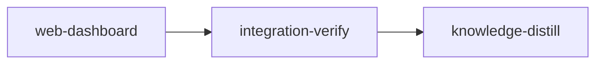

# Plan: Web Dashboard (`loom status --web`)

## Overview

Add a read-only web dashboard to loom: `loom status --web [PORT]` starts a minimal HTTP server
bound to `127.0.0.1`, serves an embedded single-page React application, and streams the exact
payload `loom status --live` renders over a WebSocket, so a browser shows the same ledger (one row
per stage, attention panel, activity log, alerts, legend) with live updates. The page is a React 19

+ TypeScript application (React Router 8, Jotai 2, shadcn/ui on Tailwind 4, Inter and IBM Plex Mono
bundled from npm) whose production build is committed under `web/dist` and embedded into the loom
binary at compile time, so the shipped binary needs no Node toolchain and no network.

The plan has one implementation stage plus the two mandatory bookends. `knowledge-bootstrap` is
skipped: `doc/loom/knowledge/` is hierarchical (`INDEX.md` present, seven tier-1 files with `##`
sections) and `loom knowledge sync` ran clean on 2026-09-04 (`✓ Rebuilt the context catalog`,
exit 0).

## Blocking prerequisite — commit this plan and its briefs before `loom run`

A loom stage runs in a git worktree of branch `loom/<stage-id>`, which materialises only COMMITTED
content. At the time of writing, `git ls-files doc/plans/PLAN-web-dashboard.md` and
`git ls-files doc/plans/briefs/web-dashboard` both return nothing — this plan and all four worker
briefs are untracked, while the sibling `doc/plans/briefs/embed-assets-self-update/**` is tracked.
Every worker prompt ends with "Your brief: `<path>`. Read it in full before anything else", and the
stage description opens with "Read the plan `doc/plans/PLAN-web-dashboard.md` first". In a worktree
built from today's HEAD, none of those files exist, and four workers would start from nothing.

```bash
git add doc/plans/PLAN-web-dashboard.md doc/plans/briefs/web-dashboard
git commit -m "docs(plans): add the web dashboard plan and its worker briefs"
```

This is a hard gate: do not run `loom init`/`loom run` on this plan until `git ls-files` lists all
five files.

## Goals

+ `loom status --web` serves the live dashboard at `http://127.0.0.1:7373/` (`--web 0` picks a free
  port and prints it); the process runs until Ctrl-C.
+ Live updates over a WebSocket at `/ws`; a JSON snapshot at `/api/status`; the SPA at `/` with
  history-mode routes (`/stages/:stageId`) falling back to `index.html`.
+ Same data model as `--live`: the pushed value is `StatusData` from the daemon's `SubscribeStatus`
  channel, wrapped with the attention entries, scheduler alerts, daemon state and tick age the TUI
  computes client-side.
+ Works without a daemon: when the socket is unreachable the server polls the state files every
  2 s and reports `daemon` as stopped/unreachable in the header, instead of refusing to start.
+ The ASCII logo (`loom/src/lib.rs:36-39`) recreated as an inline SVG on the page.
+ Exceptionally well designed: the visual work is done by a fable subagent under the
  `frontend-design:frontend-design` skill; everything else is codex `gpt-5.6-terra`/`gpt-5.6-luna`.

Non-goals: authentication, remote binding, any write action from the page, a `--json` flag, a
rewrite of the TUI, SSR, or any change to the daemon protocol.

## Grounding (every claim below was read from the tree on 2026-09-04, HEAD `7440a423`)

| Claim | Where it is true |
| --- | --- |
| The live TUI subscribes with `Request::SubscribeStatus` and receives `Response::StatusUpdate { data: StatusData }` | `loom/src/daemon/protocol.rs:100-110,251-259`; client helpers `connect`/`subscribe` in `loom/src/commands/status/ui/tui/daemon_client.rs:15-71` |
| The daemon broadcasts a fresh `StatusData` every 1000 ms to every subscriber, and nothing is pushed on subscribe itself | `loom/src/daemon/server/broadcast.rs:25,158-222` (`STATUS_BROADCAST_INTERVAL_MS`, `run_status_broadcaster`) |
| `StatusData`, `StageSummary`, `MergeSummary`, `ProgressSummary` derive `Serialize`/`Deserialize`; `cleanup_warning` is `skip_serializing_if = "Option::is_none"` | `loom/src/commands/status/data/mod.rs:61-172` |
| Static/compact status build the same model from files via `collect_status_data(&WorkDir)` | `loom/src/commands/status/data/collector.rs:352` |
| Serde names: `StageStatus` is renamed per variant (`waiting-for-deps`, `queued`, `executing`, `waiting-for-input`, `blocked`, `completed`, `needs-handoff`, `skipped`, `merge-conflict`, `completed-with-failures`, `merge-blocked`, `needs-human-review`, `needs-adjudication`) | `loom/src/models/stage/types.rs:853-917` |
| `StageType` is `kebab-case`; `FailureType` is `kebab-case`; `SessionType` and `SessionBackendKind` are `lowercase` (`baseconflict` is one word); `ActivityStatus` has no rename attribute, so it serializes as `Idle`/`Working`/`Error`/`Stale`/`Orphaned` | `types.rs:11-14`; `loom/src/models/failure.rs:10-12`; `loom/src/models/session/types.rs:6-8,66-68`; `data/mod.rs:17-18` |
| `AttentionEntry` (not `Serialize`) and `attention_entries`/`failure_label` are reachable from `commands::status::render` | `loom/src/commands/status/render/attention_model.rs:12-24,27`; re-exports at `render/mod.rs:13` |
| `Alert { severity: Severity, text }`, `Severity { Info, Warning, Critical }`, neither `Serialize`; `alerts(work_dir, daemon_running)` | `loom/src/orchestrator/scheduling_report.rs:140-165` |
| Tick age: `orchestrator::tick::read(work_dir) -> Result<Option<Tick>>`, `Tick::age_secs(now)`, stalled at 60 s | `loom/src/orchestrator/tick.rs:33,72-87,112` |
| Daemon state: `DaemonServer::check_status(work_dir) -> DaemonStatus { NotRunning, Running, ProcessOnly, Unreachable }`; `Unreachable` means the caller's sandbox denies `socket()` and is rendered as healthy | `loom/src/daemon/server/core.rs:16-36,115` |
| The TUI header shows "daemon running · tick Ns ago", "loop stalled Ns" at ≥60, progress "N of M stages complete" with a half-up percentage, and a summary line executing · queued · waiting · need attention · done | `loom/src/commands/status/ui/tui/ledger/header.rs:57-200` |
| Ledger cell semantics (activity text, context meter 5 cells at 60/90 % bands, models `model›exec,exec+N`, time, merge) | `loom/src/commands/status/ui/tui/ledger/cells.rs:42-345`; bands in `loom/src/orchestrator/monitor/context.rs:25-36` |
| Row order is level ascending then id; the activity log records started/completed/blocked/ready/needs-handoff transitions, 20 entries max | `loom/src/commands/status/ui/tui/state.rs:48-165`; `loom/src/plan/graph/levels.rs:68` |
| Legend text for the 13 states | `loom/src/commands/status/ui/tui/ledger/legend.rs:14-66` |
| State icon/label/colour table | `loom/src/models/stage/types.rs:986-1096` (summarised in `doc/loom/knowledge/architecture/status-data-model.md` § StageStatus) |
| `format_elapsed`: `30s`, `1m30s`, `1h1m` | `loom/src/utils.rs:38-46` |
| `Status` CLI variant has exactly three bool flags; dispatch arm at `cli/dispatch.rs:229-233` | `loom/src/cli/types.rs:81-93`, `loom/src/cli/dispatch.rs:229` |
| `status.rs` is 398 lines, `cli/types.rs` 391, `dispatch.rs` 322, `build.rs` 367 (not scanned: the scanner walks `src` and `tests` only); the ledger records `function src/cli/dispatch.rs dispatch 124` | `wc -l`; `loom/tests/maintainability/scanner.rs:6-7,31`; `loom/maintainability-baseline.txt:67` |
| `build.rs` embeds asset roots into `$OUT_DIR/embedded_assets.rs` with `include_str!` after `validate_utf8`; `emit_if_exists` emits `rerun-if-changed` for existing paths only | `loom/build.rs:22-56,199-266,351-355`; consumer `loom/src/assets/mod.rs:6` |
| `daemon_client` is a private module of `ui/tui`; `ledger` is `pub(crate)` | `loom/src/commands/status/ui/tui/mod.rs:14-18` |
| `is_read_timeout` is a private fn in `app.rs`, `is_socket_disconnected` is `pub` in `daemon_client.rs` | `app.rs:367`, `daemon_client.rs:74` |
| Sandbox probes for tests that need OS resources: `sandbox_probe::skip_unless(probe_ok, name, why)` | `loom/src/process/sandbox_probe.rs:62-146` |
| Loom's stage sandbox maps `network.allow_local_binding` to Claude Code's `allowLocalBinding` | `loom/src/sandbox/settings/policy.rs:90-91` |
| No Rust HTTP or WebSocket server crate is in the tree; `httparse 1.10.1`, `tokio`, `base64`, `bytes` are (transitively); `sha1`, `data-encoding` are not; `rand` is at 0.8.8 | `cargo tree -i <crate>` in `loom/` |
| `cargo-deny` policy: `multiple-versions = "warn"`, licences allow MIT/Apache-2.0/ISC/BSD-3 | `loom/deny.toml` |
| The sibling `IN_PROGRESS-PLAN-embed-assets-and-complete-self-update.md` stage `embed-assets` is merged (`5ebdf07c`, `5b4d280e`, `7dc63522`); its remaining stage owns `cli/types.rs`, `cli/dispatch.rs`, `Cargo.toml`, `Cargo.lock`, `maintainability-baseline.txt`, `README.md` but NOT `build.rs`; no workspace is active (`.loom/` holds only `cache/`) | `git log -- loom/build.rs`; sibling plan lines 655-700, 879-895 |
| The codex forwarder accepts `gpt-5.6-sol | gpt-5.6-terra | gpt-5.6-luna` and efforts up to `ultra`; the plugin`codex@openai-codex 1.0.6` is installed at user scope | `hooks/codex-forward.sh:16-30`; `claude plugin list --json` |
| The `frontend-design:frontend-design` skill is installed (plugin `frontend-design@claude-code-plugins 1.0.0`) | `claude plugin list --json` |

### Verified third-party facts (registry and installed source, 2026-09-04)

| Fact | Evidence |
| --- | --- |
| `tungstenite 0.30.0` (default feature `handshake`): `accept(stream) -> Result<WebSocket<S>, HandshakeError<..>>`, `HandshakeError::{Interrupted, Failure}`, `WebSocket::{read, send, flush, close, get_mut}`, `Message::{Text(Utf8Bytes), Binary, Ping, Pong, Close}`, `Message::text(..)`, `Error::{ConnectionClosed, AlreadyClosed, Io(io::Error), Protocol, ..}`; `read()` queues the pong/close replies and writes them on the next read/write/flush | `~/.cargo/registry/src/*/tungstenite-0.30.0/src/{server.rs:36,handshake/mod.rs:57-62,protocol/mod.rs:178-343,protocol/message.rs:157-178,error.rs:28-58}` |
| `tungstenite 0.30.0` is `MIT OR Apache-2.0`; its `default = ["handshake"]` feature pulls `data-encoding`, `http`, `httparse`, `sha1`, plus unconditional `bytes`, `log`, `rand`, `thiserror`. Only **`sha1 0.11.0` and `data-encoding 2.11.1` are new** — `httparse 1.10.1`, `http 1.5.0`, `bytes 1.12.1`, `log 0.4.34`, `thiserror` 1+2 and **`rand 0.10.2` alongside `rand 0.8.8`** are already in `loom/Cargo.lock` today, so tungstenite introduces no new duplicate-version warning (the plan previously claimed it added the second `rand`; it does not) | `~/.cargo/registry/src/*/tungstenite-0.30.0/Cargo.toml:46,56-62,138-166`; `loom/Cargo.lock:939,972,1391,1929,1938,2773,2782`; `rg '^name = "(sha1\|data-encoding\|tungstenite)"' loom/Cargo.lock` → no match |
| No local gate runs `cargo-deny`, but CI does, and `cargo-deny` is not installed on this host | `.github/workflows/ci.yml:220-227`; `loom/deny.toml` (`wildcards = "deny"`, `unknown-registry = "deny"`, closed licence allowlist); `command -v cargo-deny` → missing. Addressed by correction C14 |
| The local gate that DOES run is `loom/.githooks/pre-push`, and it runs three checks no earlier draft of this plan had: `bunx markdownlint-cli2` over tracked markdown minus `doc/plans/` and `loom/tests/fixtures/` (`:21-78`), `cargo audit` (`:100-107`), and the suite under `env -u GIT_INDEX_FILE -u GIT_DIR -u GIT_WORK_TREE` (`:109-118`). `cargo-audit-audit 0.22.0` IS installed on this host; `markdownlint-cli2` is not a binary and is not meant to be — the hook invokes it through `bunx`. `.markdownlintignore` lists `doc/plans/`, `loom/tests/fixtures/`, `.work/`, `.loom/work/`, `.worktrees/`, so `README.md`, `loom/CONTRIBUTING.md`, `web/README.md` and `doc/loom/knowledge/**` are all linted | `loom/.githooks/pre-push:21-118`; `.markdownlintignore`; `.markdownlint.json`; `cargo audit --version`. Addressed by correction C18 |
| `httparse::Request::new(&mut headers).parse(buf) -> Result<Status<usize>>` | `~/.cargo/registry/src/*/httparse-1.10.1/src/lib.rs:458-552` |
| npm latest with peer ranges that close: react 19.2.8, react-dom 19.2.8, react-router 8.3.1 (peers react ≥19.2.7), jotai 2.20.3, zod 4.5.4, vite 8.2.2, @vitejs/plugin-react 6.1.1 (peer vite ^8), vitest 5.0.0 (peer vite ^8), tailwindcss 4.3.3, @tailwindcss/vite 4.3.3 (peer vite ^8), shadcn 4.21.0, lucide-react 1.41.0, radix-ui 1.6.7, @fontsource-variable/inter 5.3.0, @fontsource/ibm-plex-mono 5.3.0, oxlint 1.81.0, oxfmt 0.66.0, @testing-library/react 16.3.3, jsdom 30.0.1 | `curl registry.npmjs.org/<pkg>/latest`; `bun add` of the whole set installed with no peer error |
| `bun create vite <dir> --template react-ts` scaffolds vite 8.2.2, typescript ~6.0.2, oxlint, three tsconfigs (`tsconfig.json` with references, `tsconfig.app.json`, `tsconfig.node.json`), scripts `build: tsc -b && vite build`, and a `.gitignore` that ignores `dist` | scratch `webprobe2` |
| `bunx shadcn@4.21.0 init -b radix -p nova -y --css-variables --no-monorepo` is non-interactive once a `@/*` path alias exists in `tsconfig.json` + `vite.config.ts`; it writes `components.json` (style `radix-nova`), `src/lib/utils.ts`, rewrites `src/index.css` (imports `tailwindcss`, `tw-animate-css`, `shadcn/tailwind.css`, `@fontsource-variable/geist`, sets `--font-sans`), adds deps `shadcn`, `cn`, `radix-ui`, `lucide-react`, `tw-animate-css`, `class-variance-authority`, `@fontsource-variable/geist`, and adds `compilerOptions.paths` to `tsconfig.json` itself | scratch `webprobe2` (init run twice: without the alias it stops with "Could not find valid path aliases") |
| `bunx shadcn@4.21.0 add -y badge table dialog tooltip scroll-area separator progress button card kbd` writes those ten files under `src/components/ui/`; the registry host is `https://ui.shadcn.com` | scratch `webprobe2`; `grep -o https://ui.shadcn.com node_modules/shadcn/dist/index.js` |
| Vite 8 `build.rolldownOptions.output.{entryFileNames,chunkFileNames,assetFileNames}` produce `dist/index.html`, `dist/assets/index.js`, `dist/assets/index.css`, and the font files under `dist/assets/<name>.woff2`; `rollupOptions` is a deprecated alias | `node_modules/vite/dist/node/index.d.ts:867-884`; scratch build output (840 KB `dist/`, 40 files) |
| `@fontsource-variable/inter/index.css` and `@fontsource/ibm-plex-mono/{400,500}.css` bundle cleanly through Tailwind 4 and Vite | scratch build |
| `server.proxy` entries accept `{ target, ws: true }` | `node_modules/vite/dist/node/index.d.ts:381,558` |
| `createBrowserRouter`, `RouterProvider`, `useParams`, `Link` are exported from `react-router` 8; `createStore` from `jotai/vanilla`, `Provider` from `jotai/react` | installed `.d.ts` files; a probe file type-checked with `tsc --noEmit` |

### Baselines observed at HEAD (main checkout, 2026-09-04)

| Command | Result |
| --- | --- |
| `cargo build` / `cargo build --all-targets` | ok |
| `cargo clippy --all-targets -- -D warnings` | ok, no warnings |
| `cargo fmt --check` | ok |
| `RUSTDOCFLAGS="-D warnings" cargo doc --workspace --all-features --no-deps` | ok |
| `cargo test --lib` | 3600 passed, 0 failed, 1 ignored |
| `cargo test --all-targets --no-fail-fast` | every binary ok: lib 3600, main 4, adjudication_e2e 10, completion_flow 3, e2e 133 (5 ignored), failure_resume 16, integration 166, maintainability 8, phantom_merge 7, plan_amendment_integration 4, stage_transitions 3, worktree_remove_safety 8 |
| `loom knowledge sync` | exit 0 |

One run of `cargo test --all-targets` failed `version::derive::tests::the_embedded_commit_matches_the_built_tree` because HEAD moved (three commits landed from another session) between the build and the test; the re-run passed. A stage worktree builds from its own HEAD, so this does not recur there.

## Design decisions (settled)

### CLI surface

`loom status --web [PORT]`. One new field on `Commands::Status` (`loom/src/cli/types.rs`, after
`verbose`):

```rust
        /// Serve the live dashboard as a web page on 127.0.0.1 (PORT defaults to 7373; 0 picks a free port)
        #[arg(long, value_name = "PORT", num_args = 0..=1, default_missing_value = "7373", conflicts_with_all = ["live", "compact"])]
        web: Option<u16>,
```

The dispatch arm (`loom/src/cli/dispatch.rs:229-233`) becomes a `match` on `web`:
`Some(port) => status::web::execute(port)`, `None => status::execute(live, compact, verbose)`.
`status.rs` gains exactly one line, `pub mod web;`, next to `pub mod data;` — the file is at 398
lines and the 400-line limit forbids putting the branch there. The ledger entry
`function src/cli/dispatch.rs dispatch 124` grows by the arm and is set to the exact value the
maintainability test reports.

### Server stack

`std::net` for HTTP/1.1 (GET only, `Connection: close`, one thread per connection) with `httparse`
for the request head, and `tungstenite` for the WebSocket handshake and framing. No tokio, no
axum: the daemon and the TUI are synchronous thread code and the server matches them.
New Cargo dependencies: `tungstenite = "0.30"` and `httparse = "1"` (added with `cargo add`).

Routing is decided from a `TcpStream::peek` of the request head: if the path is `/ws` and the head
carries `Upgrade: websocket`, the untouched stream goes to `tungstenite::accept`; otherwise the head
is consumed and routed. Read timeouts are set on the stream only AFTER `accept` returns (a timeout
during the handshake would surface as `HandshakeError::Interrupted`).

**A partial peek is a RETRY, never a fall-through — see correction C2.** The head can arrive in more
than one packet, and consuming it with `read_head` before the `/ws` test destroys the handshake.
One `MAX_HEAD_BYTES` (16 KiB) bounds both the peek loop and `read_head`.

Security posture: bind `127.0.0.1` only; every **HTTP** response the server writes itself — 200,
403, 404, 408, 431, 503 — carries `Cache-Control: no-store`,
`X-Content-Type-Options: nosniff`, `X-Frame-Options: DENY`, and
`Content-Security-Policy: default-src 'self'; style-src 'self' 'unsafe-inline'; img-src 'self' data:; font-src 'self'; connect-src 'self' ws: wss:`.
**The 101 upgrade response carries none of them — see correction C17**, which explains why that is
right rather than a gap. `/ws` and `/api/status` reject a request whose `Origin` header names a host other than
`127.0.0.1` or `localhost` (any port) with 403 — this blocks cross-site WebSocket hijacking from
another page open in the same browser. React escapes every string it renders and the page never
uses `dangerouslySetInnerHTML`; evidence lines are untrusted data.

### Wire contract — one JSON object for `/api/status` and every WebSocket frame

`loom/src/commands/status/web/model.rs`:

```rust
pub struct WebSnapshot {                 // Serialize + Deserialize
    pub status: StatusData,              // the exact --live payload
    pub attention: Vec<WebAttention>,    // attention_entries(&status.stages), converted
    pub alerts: Vec<WebAlert>,           // scheduling_report::alerts(work_path, daemon_running), converted
    pub daemon: DaemonState,             // kebab-case: running | process-only | not-running | unreachable
    pub tick_age_secs: Option<i64>,      // tick::read(work_path).age_secs(Utc::now())
    pub source: SnapshotSource,          // kebab-case: daemon | files
    pub generated_at: DateTime<Utc>,     // RFC 3339 string
}
pub struct WebAttention { id, name, label: String, hint: String, failure_type: Option<FailureType>,
    failure_label: Option<String>, evidence: Vec<String>, review_reason: Option<String>,
    cleanup_warning: Option<String>, has_human_review_choices: bool, dispute_count: Option<u32>,
    judge_heartbeat_secs: Option<u64> }
pub struct WebAlert { severity: WebSeverity /* lowercase: info | warning | critical */, text: String }
pub fn collect_snapshot(work_path: &Path, status: StatusData, source: SnapshotSource) -> WebSnapshot
```

`daemon_running` passed to `alerts` is `matches!(daemon, Running | Unreachable)`, matching the
knowledge note that `Unreachable` renders as healthy. `WebSnapshot` cannot derive `PartialEq`
(`StatusData` does not), so "changed" is decided on the serialized JSON string.

The TypeScript mirror is a zod schema (`web/src/api/schema.ts`), and one fixture
(`web/src/api/fixtures/snapshot.json`) is the contract between the two sides: a Rust test builds a
`WebSnapshot` in code, serializes it, and asserts `serde_json::Value` equality with the fixture
(printing the expected JSON on mismatch); a vitest test parses the same file with the zod schema.
The fixture carries seven stages covering `completed` (knowledge type), `executing` (Working, a
context reading, execution models), `completed-with-failures` (failure info with evidence),
`waiting-for-deps`, `needs-human-review` (held, review reason), `merge-conflict`, and a
`sonnet`-model `knowledge-distill`; three alerts (one per severity); `daemon: "running"`;
`tick_age_secs: 4`; `source: "daemon"`.

### Broadcaster — daemon push first, file poll as fallback

Corrections C3, C4, C6 and C15 govern this section: the read timeout is 50 ms (not 1 s), a stream
error reconnects instead of falling back, a `Response::Error` is a degraded signal that drops to the
file poller, dedup compares the frame without `generated_at`, and the daemon lane cannot run inside
a stage worktree at all.

One broadcaster thread per server (not per browser tab) owns the daemon subscription:

1. Try `daemon_client::connect` + `subscribe` (the same helpers the TUI uses; the module becomes
   `pub(crate) mod daemon_client;`). Set a **50 ms** read timeout (C3). Every response goes through
   `classify_response` (C15): `Response::StatusUpdate { data }` becomes a frame via
   `collect_snapshot(work_path, data, Daemon)`; `Response::Error { message }` is **degraded** — the
   daemon could not fit the payload on the wire — and drops to step 2 carrying `message` as the
   snapshot's `notice`; every other response is ignored. A read timeout continues; a disconnect or
   a stream error reconnects rather than falling back (C3).
2. Fallback: every 2 s, `collect_status_data(&WorkDir)` → `collect_snapshot(.., Files)`; publish
   when the JSON differs from the last published frame. After 10 s in fallback, go back to step 1.

Publishing stores the frame as the `latest` and sends it to every subscribed `mpsc::Sender`
(dead senders are dropped). A new WebSocket client receives `latest` immediately on subscribe, so
a page never waits a broadcast interval for its first frame. `/api/status` returns `latest`, or a
fresh file snapshot if nothing has been published yet.

Each WebSocket connection is one thread: after `accept`, set a 250 ms read timeout, then loop —
drain the receiver and `send` each frame as `Message::text`, then `read()` once; `Close` or
`Error::ConnectionClosed`/`AlreadyClosed` ends the loop, `Error::Io` with kind `WouldBlock` or
`TimedOut` is the idle case, any other error ends the loop. Client frames are otherwise ignored
(the dashboard is read-only).

### Assets — committed `web/dist`, embedded by `build.rs`

Corrections C1, C9 and C10 govern this section: the rerun key is emitted unconditionally (never
through `emit_if_exists`), `web/dist/**` is not an `artifacts:` entry, and only the latin font
subsets are imported.

`web/dist` is committed. `loom/build.rs` gains `WEB_DIST_ROOT = "web/dist"` and
`generate_web_assets(&repo_root)`: it walks `web/dist` (binary files allowed — no
`validate_utf8`), writes `$OUT_DIR/web_assets.rs` containing
`pub const WEB_ASSETS: &[WebAsset] = &[("index.html", include_bytes!("<abs>")), ("assets/index.js", ..), ..]`
sorted by key, and emits `cargo:rerun-if-changed` for the directory unconditionally. When
`web/dist/index.html` is absent it writes an empty table and a `cargo:warning` naming the fix
(`cd web && bun install && bun run build`), and the server answers `/` with 503 and that text —
so a binary built from a partial tree fails loudly at the smoke test, never silently.

Vite writes stable names (`assets/index.js`, `assets/index.css`, `assets/<font>.woff2`) so the
committed diff on a rebuild is content-only. The scaffold's `web/.gitignore` must drop its `dist`
line; the root `.gitignore` gains `web/node_modules/`.

### Frontend layout

```text
web/
  package.json  bun.lock  index.html  vite.config.ts  tsconfig.json  tsconfig.app.json  tsconfig.node.json
  components.json  .oxlintrc.json  .oxfmtrc.json  .prettierignore  .gitignore  README.md
  src/main.tsx  src/router.tsx  src/index.css  src/vite-env.d.ts  src/test/setup.ts
  src/api/schema.ts  src/api/ws.ts  src/api/fixtures/snapshot.json  src/api/fixtures/statuses.json  src/api/schema.test.ts  src/api/ws.test.ts
  src/state/store.ts  src/state/atoms.ts  src/state/apply.ts  src/state/atoms.test.ts
  src/lib/utils.ts (shadcn)  src/lib/format.ts  src/lib/levels.ts  src/lib/activity.ts  src/lib/states.ts  src/lib/*.test.ts
  src/components/ui/*.tsx (shadcn, generated)  src/components/*.tsx  src/routes/*.tsx  src/routes/ledger.test.tsx
  dist/ (committed build output)
```

Scripts: `dev` (vite, proxying `/api` and `/ws` to `http://127.0.0.1:7373`), `build`
(`tsc -b && vite build`), `typecheck` (`tsc -b --noEmit`), `lint` (`oxlint --deny-warnings`),
`format` / `format:check` (`oxfmt` / `oxfmt --check`), `test` (`vitest run`), and
`check` = typecheck && lint && format:check && test. `src/components/ui/**` and `dist/**` are
ignored by oxlint and oxfmt (generated code).

TypeScript stays at the scaffold's `~6.0.2`. No `baseUrl` anywhere (`paths` only). React Router in
data mode with `createBrowserRouter`; Jotai with one module-level `createStore()` that the
WebSocket layer writes into from outside React; no React Query, no Redux.

### Size ceilings

Every new Rust file stays under 400 lines and every function under 50 (`cargo test --test
maintainability`); the web server is split into seven modules for that reason. `status.rs` may
grow by exactly one line (398 → 399); `cli/types.rs` by at most eight (391 → 399); nothing else
pre-existing grows except `dispatch.rs`'s arm.

### Sibling-plan constraint

Four sibling plans carry executable loom metadata and claim files this plan writes. Do not run any
of them concurrently with this one; whichever runs second re-bases on the other's merged tree.
**Two of the overlaps are whole-crate, not single-file** — the earlier draft of this table
understated them, which is the point the pressure test caught.

| Sibling | Overlapping paths | Evidence |
| --- | --- | --- |
| `IN_PROGRESS-PLAN-fix-knowledge-bootstrap-macos.md` (`working_dir: loom`) — **IN PROGRESS, highest risk** | stage `fix-bootstrap` declares `src/cli/dispatch.rs`; its `integration-verify` declares `src/**/*.rs`, which under `working_dir: loom` is **every file this plan writes below `loom/src/`** | sibling `:81,122-123` and `:136,171-172` |
| `IN_PROGRESS-PLAN-embed-assets-and-complete-self-update.md` (stage `rewire-update-paths`) | `loom/src/cli/types.rs`, `loom/src/cli/dispatch.rs`, `loom/Cargo.toml`, `loom/Cargo.lock`, `loom/maintainability-baseline.txt`, `README.md` — but NOT `build.rs` | sibling lines 655-700, 879-895 |
| `PLAN-model-router-hooks.md` | `router-core` declares `loom/src/cli/types.rs`, `loom/src/cli/dispatch.rs`; its `integration-verify` declares **`loom/src/**`**; its `knowledge-distill` declares `doc/loom/knowledge/**`, `README.md`, `CONTRIBUTING.md` | sibling `:327-328`, `:450`, `:490-492` |
| `PLAN-loom-config-command.md` | prose claims `loom/Cargo.toml`, `loom/src/cli/types.rs`, `loom/src/cli/dispatch.rs` but its stage `files:` do NOT declare them (a stale plan — the `Config` command is already merged); its `knowledge-bootstrap` stage declares `doc/loom/knowledge/**` | sibling `:55-76` (prose), `:174-175` (declared) |

Two rules follow from the two whole-crate rows, and they bind the operator, not a worker:

1. **Serialize every broad `loom/src/**` owner.** `fix-bootstrap`'s and `model-router-hooks`'
   integration stages verify against a source tree they own wholesale. Running either alongside
   this plan means one of them verifies a tree that is not the tree that later merges. Start this
   plan only when `loom status` reports no active workspace for those two.
2. **Serialize every README/knowledge finalizer.** `model-router-hooks`' and
   `loom-config-command`'s knowledge stages write the same `doc/loom/knowledge/**` and `README.md`
   this plan's `knowledge-distill` writes. Whichever runs second re-reads the merged files first.

Three further drafts touch the same surfaces but carry **no `<!-- loom METADATA -->` block**, so
`loom run` cannot schedule them and they are a manual-coordination risk only, not a concurrency one:
`PLAN-fix-loom-stop-hang.md` (the daemon broadcast/lifecycle seam this plan's broadcaster consumes —
if it lands first, re-read `daemon/server/broadcast.rs` before implementing C15),
`PLAN-subagent-hierarchy-guidance.md` and `PLAN-secure-distilled-loom-v2.md` (both write
`doc/loom/knowledge/**`, the latter also `README`/`CONTRIBUTING`).

`loom/maintainability-baseline.txt` is an exact-match ledger shared by every worktree in a plan and
exactly one concurrent stage may own it (`doc/loom/knowledge/conventions.md:583-604`). This plan's
`web-dashboard` stage owns it.

**The `cli/types.rs` line budget is measured against today's tree and expires the moment a sibling
merges.** `wc -l loom/src/cli/types.rs` is 391 right now; the embed-assets sibling recorded it at
375 (sibling line 74) and plans to extend it further. The 400-line file cap is enforced by
`cargo test --test maintainability` (`loom/tests/maintainability/scanner.rs:6`). The stage MUST
re-measure `wc -l loom/src/cli/types.rs` before W1 writes; if 391 + 4 would reach 400, W1 moves the
`web` field into a `#[command(flatten)]` args struct in a new file rather than improvising.

### Sandbox entries loom silently drops

`loom/src/sandbox/settings/policy.rs:46` filters every `deny_read` entry containing `../`, and
`:131` does the same for `deny_write`. So `../../**`, `../.worktrees/**`, `../.loom/work/*.token`,
`../.work/*.token` and the entire `deny_write: ["../../**"]` list reach the sandbox as nothing —
this is the subject of the sibling `PLAN-fix-sandbox-parent-traversal-denywrite.md`. They are kept
below because they cost nothing and become correct once that sibling lands, but **do not treat the
worktree as read-isolated from the parent repo**, and do not add a rule that only works if they do.

What DOES survive is `.loom/work/user.token` and `.loom/work/admin.token`, and that has a
consequence for this feature — see "The daemon lane cannot run inside a stage worktree" below.

## Pressure-test corrections (BINDING — these override the briefs wherever they differ)

Each item below was validated against the tree on 2026-09-04. Where a correction contradicts
`doc/plans/briefs/web-dashboard/web-dashboard/*.md`, this section wins, and the worker prompt must
quote the correction inline so a worker with a stale brief still gets it.

### C1. `build.rs` must emit the `web/dist` rerun key UNCONDITIONALLY

The W1 brief says `emit_if_exists(&dist)`. That is wrong here. `loom/build.rs:302-305` documents the
rule and `:351-355` implements it: *"A path that does not exist is permanently dirty to cargo,
forcing a rebuild every time, so nothing is emitted for one."* The stage's own BUILD-WARM-FIRST step
runs `cargo build --all-targets` **before** `web/dist` exists, so `emit_if_exists` would emit no key
at all, and cargo would then not re-run `build.rs` when `web/dist` later appears — leaving a binary
with an empty `WEB_ASSETS` table that answers 503 while every gate stays green.

`generate_web_assets` emits the key with a bare `println!`, never `emit_if_exists`:

```rust
    // Unconditional: a missing web/dist must keep build.rs permanently dirty so
    // the first `bun run build` triggers a re-embed. emit_if_exists() would emit
    // nothing here and silently freeze an empty table (build.rs:302-305).
    println!("cargo:rerun-if-changed={}", dist.display());
```

Proven from cargo's own record of the build script's stdout, the technique the embed-assets sibling
already uses (`IN_PROGRESS-PLAN-embed-assets-and-complete-self-update.md:648-649`):

```text
rg -q "cargo:rerun-if-changed=.*/web/dist$" loom/target/debug/build/loom-*/output
```

### C2. Route `/ws` only after the head is COMPLETE — a partial peek is a retry, never a fall-through

The W1 brief §8 step 1 says a partial peek falls through to step 3 with `read_head`. Step 2 (the
`/ws` + `Upgrade` test) has already run and failed by then, and `read_head` CONSUMES the head, so
`tungstenite::accept` can never see the handshake: `/ws` lands in step 4's SPA fallback and the
browser is handed `index.html` instead of a 101. Any request head split across two packets — which
is what happens under load, and what a long `Cookie`/`User-Agent` produces — breaks the dashboard's
live channel while `curl` still passes every smoke check.

`connection::handle` becomes:

```text
1. stream.set_read_timeout(Some(5 s))
2. loop: peek up to MAX_HEAD_BYTES; http::parse_head(&buf)
     Some(head) -> break with head
     None       -> if elapsed > 5 s or buf.len() >= MAX_HEAD_BYTES -> write 408/431 and return;
                   else sleep 5 ms and peek again          <- RETRY, never fall through
3. route on the COMPLETE head:
     /ws + Upgrade: websocket -> origin check, set_read_timeout(None),
                                 ws::handle(stream, broadcaster.subscribe())   (bytes still unread)
     everything else          -> http::read_head(&mut stream) to consume, then §8 step 4 routing
```

`MAX_HEAD_BYTES` is one constant (16 KiB) used by both the peek loop and `read_head`; the brief's
separate "8 KiB peek" number is dropped.

### C3. Broadcaster read timeout is 50 ms, and a stream error RECONNECTS instead of falling back

The brief's 1 s read timeout is exactly the daemon's broadcast period
(`loom/src/daemon/server/broadcast.rs:25`, `STATUS_BROADCAST_INTERVAL_MS = 1000`) — the worst
possible pairing. `loom/src/commands/status/ui/tui/app.rs:195-201` documents why: a timeout landing
mid-frame desynchronises the stream because `read_exact` cannot tell the two apart, and recovery
only happens on the next read once a bogus frame length is decoded. The TUI therefore uses a 50 ms
timeout (`app.rs:121-123`) and a dedicated `reconnect_after_read_error` (`app.rs:220-241`). With
the brief's rule ("any other error → return"), every desync would drop the whole server into the
file poller for 10 s, so the dashboard would flap between daemon and file data.

+ `daemon_session` sets `set_read_timeout(Some(Duration::from_millis(50)))` after `subscribe`.
+ `forward_daemon` returns a `DaemonExit` telling the caller what to do:
  `Disconnected` (`is_socket_disconnected`) and `StreamError` (any other non-timeout error) both
  mean **reconnect**; only a failed `connect`/`subscribe` means **fall back to the file poller**.
+ The producer loop sleeps 500 ms after any `forward_daemon` return before reconnecting, and after
  `RECONNECT_ATTEMPTS = 3` consecutive immediate failures falls through to `poll_files` — without
  that sleep the loop spins on connect + Ping + SubscribeStatus with no backoff whenever the daemon
  is restarting.

### C4. Dedup on the frame WITHOUT `generated_at`

`collect_snapshot` stamps `generated_at: Utc::now()` on every frame (W0 brief), so the brief's
`publish` rule ("compare with `latest`; if equal, return") and `poll_files`' "publish only if it
differs" can never fire: two snapshots of an identical tree never compare equal, and the dedup is
dead code that reads as a working optimisation.

`Broadcaster` keeps a second field, `last_body: Mutex<Option<String>>`, holding the frame serialized
from a `WebSnapshot` whose `generated_at` is `DateTime::<Utc>::UNIX_EPOCH`. `publish` compares
against `last_body`, and sends the real (fresh-timestamp) frame only when `last_body` changed.
A required test, `publish_skips_an_unchanged_tree`, asserts two `poll_files` cycles over an
untouched work dir yield exactly one frame on a subscriber.

### C5. W2 and W3 format and lint ONLY their own paths

W0 pins `"format": "oxfmt"` and `"lint": "oxlint --deny-warnings"` — neither takes a path, so both
walk the whole `web/` tree. W3's single permitted check (`cd web && bun run format && bun run lint`)
would therefore reformat W2's `src/api`, `src/state` and `src/lib` mid-flight and fail its own lint
on W2's half-written files, while W2 and W3 run in parallel. This is the documented `cargo fmt`
failure mode transplanted to the web tree (`doc/loom/knowledge/conventions.md:480-484`: *"Never run
`cargo fmt` while sibling subagents are live … it formats the ENTIRE crate, silently reformatting
files another agent owns"*).

+ W2's one check: `cd web && bunx oxfmt src/api src/state src/lib src/test && bunx vitest run`.
+ W3's one check: `cd web && bunx oxfmt src/components src/routes src/main.tsx src/router.tsx src/index.css web/index.html && bunx oxlint --deny-warnings src/components src/routes src/main.tsx src/router.tsx`.
+ Repo-wide `bun run check` (which includes `format:check` and `lint`) is the ORCHESTRATOR's, run
  once after all four workers return.

Verified for the pinned versions: `oxlint --deny-warnings` respects `.gitignore` (so `node_modules`
is skipped only because `web/.gitignore` keeps its `node_modules` line — keep it) and honours
`ignorePatterns` in `.oxlintrc.json`; `oxfmt --check` exits 1 on a format difference and honours
`.prettierignore`. Both `ignorePatterns: ["dist/**", "src/components/ui/**"]` and a
`web/.prettierignore` of `dist/` + `src/components/ui/` are mandatory once the `dist` line leaves
`web/.gitignore`, or the committed bundle is linted and formatted.

### C6. The daemon lane cannot run inside a stage worktree — do not assert it

`daemon_client::connect` and `subscribe` both authenticate with `read_auth_token`
(`daemon_client.rs:26,50-56`), which reads `.loom/work/user.token`
(`loom/src/daemon/server/tokens.rs:96-98`). That path is in this plan's `deny_read` and, unlike the
`../`-bearing entries, it SURVIVES loom's filter (`policy.rs:46`). So every in-stage run of
`loom status --web` — `scripts/smoke-web-dashboard.sh`, any Playwright pass in `integration-verify` —
exercises the file-poll lane only, and reports `daemon` as `process-only`, not `running`.

+ The smoke script MUST NOT assert `source == "daemon"` or `daemon == "running"`.
+ The daemon lane is proven instead by a pure function extracted for the purpose:
  `pub fn snapshot_frame(work_path: &Path, data: StatusData, source: SnapshotSource) -> Result<String>`
  in `broadcast.rs` (the exact body `forward_daemon` calls per `Response::StatusUpdate`), pinned by
  the required test `snapshot_frame_serializes_a_daemon_update`, which feeds it a `StatusData` and
  asserts the JSON parses back as a `WebSnapshot` with `source == Daemon`.

### C7. `--verbose` must conflict with `--web`, not be silently dropped

The dispatch arm `Some(port) => status::web::execute(port)` discards `verbose`, which
`loom/src/cli/types.rs:91-93` still accepts. `conflicts_with_all` gains `"verbose"`:

```rust
        #[arg(long, value_name = "PORT", num_args = 0..=1, default_missing_value = "7373", conflicts_with_all = ["live", "compact", "verbose"])]
        web: Option<u16>,
```

### C8. Vite must not inject an inline module-preload polyfill

`build.modulePreload.polyfill` defaults to `true` and writes an INLINE `<script type="module">` into
`dist/index.html`. This plan's CSP declares no `script-src`, so it falls back to
`default-src 'self'`, which blocks inline scripts — a CSP violation logged on every page load.
`web/vite.config.ts`'s `build` block gains `modulePreload: { polyfill: false }`.

### C9. `web/dist/**` leaves `artifacts:` and is proven by explicit criteria instead

`loom/src/verify/goal_backward/artifacts.rs:36-100` reads every artifact in full and rejects it if
the text contains any of `STUB_PATTERNS` (`:12-21`), which includes the bare substring `TODO`. A
minified third-party bundle is exactly the kind of file that can acquire that substring from a
dependency bump with no change to this codebase. A probe build of this exact stack is clean today
(45 files, 872 KB, zero `TODO`/`FIXME` in `index.html`/`index.js`/`index.css`), but the check is
fragile by construction and the artifact entries prove less than a direct file test does — nothing
currently asserts `dist/assets/index.css` exists at all.

Drop `web/dist/index.html`, `web/dist/assets/index.js` and `web/dist/assets/index.css` from
`artifacts:`; the acceptance list gains
`test -s web/dist/index.html && test -s web/dist/assets/index.js && test -s web/dist/assets/index.css`.

### C10. Only the latin font subsets are imported

`@fontsource-variable/inter` and `@fontsource/ibm-plex-mono` bundle every subset in BOTH `.woff2`
and legacy `.woff`: a probe build produced 22 `.woff2` (371 KB) plus 15 `.woff` (131 KB) across
cyrillic, cyrillic-ext, greek, vietnamese and latin. All of it is committed AND `include_bytes!`-ed
into every loom binary, for a localhost dashboard in a modern browser. W0 imports the latin faces
only:

```css
@import "@fontsource-variable/inter/latin.css";
@import "@fontsource/ibm-plex-mono/latin-400.css";
@import "@fontsource/ibm-plex-mono/latin-500.css";
@import "@fontsource/ibm-plex-mono/latin-600.css";
```

W0 confirms the exact file names exist under `node_modules/@fontsource*/` before writing them and
reports the resulting `du -sh web/dist` and file count.

### C11. `execute` installs the Ctrl-C handler that `serve`'s shutdown flag exists for

As briefed, `serve(listener, base, shutdown)` is only ever passed an `AtomicBool` that production
never sets, so the documented "runs until Ctrl-C" path is the one nothing exercises. `execute`
mirrors the TUI (`app.rs:126-133`): build the `Arc<AtomicBool>`, `ctrlc::set_handler` to store
`false`, pass it to `serve`. `ctrlc` is already a dependency.

### C12. Two smaller corrections to W1's brief

+ `IntoClientRequest` is implemented for `&str` WITHOUT the `url` feature
  (`tungstenite-0.30.0/src/client.rs:199-203`), so the brief's fallback "build an `http::Request` by
  hand" branch is dead instruction: use `"ws://127.0.0.1:{port}/ws".into_client_request()?`.
+ W0's `bun add -d @types/node@26.4.1` overwrites the scaffold's own `^24.13.3` for no stated
  reason (`bun create vite web --template react-ts` ships `@types/node: ^24.13.3`, verified). Drop
  `@types/node` from W0's install line and keep the scaffold's pin.

### C13. The stage runs the repo's real test gate before it merges

Auto-merge fires at stage completion (`loom/src/orchestrator/auto_merge.rs:79`, enabled by default
`:51-59`) — that is, BEFORE `integration-verify` ever runs. The `web-dashboard` stage as briefed
runs only `cargo test --lib commands::status::web::` while editing `cli/types.rs`,
`cli/dispatch.rs`, `build.rs` and `ui/tui/mod.rs`, every one of which is reachable from
`loom/tests/**`. `doc/loom/knowledge/conventions.md:605-620` is explicit: *"Never write plain
`cargo test` into a loom plan's acceptance criteria"* — the gate is
`cargo test --all-targets --no-fail-fast`. Both stages now run exactly that.

Note the two non-hermetic stage-finalisation tests documented at `conventions.md:622-637`: inside a
loom worktree session they fail on ambient `LOOM_STAGE_ID`/`LOOM_SESSION_ID`. Re-run with
`env -u LOOM_STAGE_ID -u LOOM_SESSION_ID` before concluding the change broke them; do NOT apply the
`EnvGuard` fix from this plan, which does not own those files. **Correction C18 folds those unsets
into the criterion itself**, together with the pre-push hook's `-u GIT_INDEX_FILE -u GIT_DIR
-u GIT_WORK_TREE`, so the criterion is hermetic and this paragraph is now advice for a manual run
rather than a step you have to remember. C18 also corrects a wider error: what this plan called
"the full gate" was missing the hook's markdownlint and `cargo audit`.

### C14. `cargo-deny` covers the two new dependency trees

CI runs `EmbarkStudios/cargo-deny-action@v2` (`.github/workflows/ci.yml:220-227`) against a
`loom/deny.toml` that sets `wildcards = "deny"`, `unknown-registry = "deny"` and a closed licence
allowlist. This stage adds the first new dependency trees in the plan's scope (`tungstenite 0.30.0`
pulls `sha1 0.11.0` and `data-encoding 2.11.1`; `http`, `bytes`, `log`, `thiserror` and `rand
0.10.2` are already in `loom/Cargo.lock`), and no criterion runs cargo-deny locally — so a licence
or ban failure would first appear in CI after the merge.

`integration-verify` runs `cargo deny --manifest-path loom/Cargo.toml check licenses bans sources`.
`advisories` is deliberately excluded — not for network reasons (correction C18 adds `github.com`
to `allowed_domains` for `cargo audit`, which is the advisory check the pre-push hook actually runs)
but because one advisory source is enough and duplicating it in cargo-deny buys nothing. If
`cargo-deny` is not installed the criterion fails loudly rather than
passing vacuously; install it in the stage with `cargo install cargo-deny --locked` (crates.io is
already allowed) or, if that install is denied, record the gap with
`loom memory note "cargo-deny unavailable in-stage; licences/bans for tungstenite+httparse are unverified until CI"`
and say so in the completion report.

### C15. An oversized daemon broadcast is a DEGRADED signal, not a response to ignore

`loom/src/daemon/server/broadcast.rs:259-285` replaces a status frame that will not fit
`MAX_RESPONSE_BYTES` (2 MiB, `loom/src/daemon/wire.rs:15`) with `Response::Error { message }` and
**deliberately retains the subscriber**. Its own doc comment says so: *"A response that will not fit
is replaced by a `Response::Error` carrying the size and the cap, not silently dropped … The TUI
routes `Response::Error` into the footer."* The broadcaster as briefed ignores every response other
than `StatusUpdate` and leaves the daemon lane only on a disconnect or a stream error — so the
moment the payload crosses the cap the subscription stays healthy, delivers nothing but ignored
error frames, and the page shows its last good snapshot **forever**, under a header still reading
`daemon: running`. That is the exact failure the file-poll fallback exists for and the one case
that never reaches it.

Response handling becomes a pure function so it is testable without a socket (the C6 problem: the
daemon lane cannot run in a worktree at all):

```rust
pub enum DaemonStep {
    Frame(String),        // a StatusUpdate, already serialized by snapshot_frame
    Ignore,               // any other successful response
    Degraded(String),     // Response::Error - the daemon could not fit the payload on the wire
}
pub fn classify_response(work_path: &Path, response: Response) -> Result<DaemonStep>
```

+ `forward_daemon` loops `read_message::<Response>` into `classify_response` and returns
  `DaemonExit::Degraded(message)` on the third arm.
+ The producer loop treats `Degraded` like a failed `connect`: go straight to `poll_files` (which
  rebuilds `StatusData` locally and has no wire cap) and retry the daemon after the same 10 s.
+ `WebSnapshot` gains `pub notice: Option<String>` (`skip_serializing_if = "Option::is_none"`),
  set from that message on the frames published while degraded, so the page can say WHY it is on
  file data. The zod mirror gets `notice: z.string().optional()`; W3 renders it in the connection
  badge's tooltip. `snapshot.json` keeps the key absent (the healthy case), which the existing
  "a copy without `cleanup_warning` keys still parses" test shape already covers.

Required test `oversized_daemon_response_is_degraded`: `classify_response(.., Response::Error {
message: "…" })` returns `DaemonStep::Degraded` carrying that message, and a `StatusUpdate` returns
`Frame`. The loop arm that turns `Degraded` into `poll_files` is proven by review and by the
`DaemonExit::Degraded` wiring check, not by a test — for the same reason C6 gives, the socket lane
cannot execute inside the stage worktree. Say that plainly in the completion report rather than
claiming socket coverage the stage cannot have.

### C16. The level port reproduces Rust exactly — a missing dependency and a self-cycle are level 1

The W2 brief's test list (`w2-client.md:165`) says *"a self-cycle `a → a` gives 0; a missing
dependency gives 0"*. Both are wrong, and implementing to them would reorder browser rows against
`loom status --live` — a direct violation of this plan's parity goal.

`loom/src/plan/graph/levels.rs:34-43` returns 0 from the **recursive** call for a cycle
(`visiting.contains`) or an unknown stage id (`stage_map.get` → `None`). But `:46-57` then computes
the caller's own level as `max(dependency levels) + 1` whenever its dependency list is non-empty:

+ a stage whose only dependency is absent from the map → `max(0) + 1` = **1**
+ a stage that depends on itself → the inner frame hits the `visiting` guard and returns 0, the
  outer frame adds one → **1**

Only a stage with an EMPTY dependency list is level 0. The brief's prose (`w2-client.md:84`) already
describes this correctly; it is the test expectations that contradict it. `levels.test.ts` asserts
**1** for both cases and carries a `// correction C16` comment at those two assertions. Changing the
Rust side instead is out of scope — "a rewrite of the TUI" and any change to existing semantics are
non-goals.

### C17. The security headers are an HTTP-response contract; the 101 upgrade carries none

`tungstenite::accept` builds the switching-protocols response from `Connection`, `Upgrade` and
`Sec-WebSocket-Accept` only (`tungstenite-0.30.0/src/handshake/server.rs:79-86`); `accept_hdr`
(`src/server.rs:57-67`) is the only form whose callback can add reply headers. So the earlier
"every response carries CSP, nosniff, frame and cache headers" promise was false for the 101 while
every declared wiring check and every ordinary-HTTP test stayed green.

The plan keeps plain `accept` and narrows the promise instead. CSP, `X-Frame-Options` and
`X-Content-Type-Options` tell a browser how to treat a **document**; a 101 is not one, and no
browser applies them to a WebSocket upgrade. Adding them through `accept_hdr` would be ceremony
that proves nothing. What actually defends `/ws` is the Origin allowlist, which runs BEFORE the
handshake in `connection::handle` and is pinned by `websocket_rejects_foreign_origin`.

The contract, everywhere it is stated: **every HTTP response the server writes itself** — 200, 403,
404, 408, 431, 503 — carries the four headers; the 101 tungstenite writes carries none. Required
test `every_http_response_carries_the_security_headers` walks the server's own response builders and
asserts all four on each; it does not touch `/ws`.

### C18. The canonical gate is the pre-push hook — markdownlint and `cargo audit` are part of it

Calling this plan's list "the full gate" was wrong. `loom/.githooks/pre-push` is the repository's
real gate and runs three things no criterion here ran:

| Hook step | Where | This plan before |
| --- | --- | --- |
| `bunx markdownlint-cli2 --fix` over `git ls-files '*.md'` minus `doc/plans/` and `loom/tests/fixtures/` | `:21-78` | absent |
| `cargo audit` | `:100-107` | absent (only `cargo deny check licenses bans sources`, C14) |
| `env -u GIT_INDEX_FILE -u GIT_DIR -u GIT_WORK_TREE cargo test --all-targets --no-fail-fast` | `:109-118` | the unsets were absent |

+ **Markdown.** This plan adds `web/README.md` (W3) and edits `README.md`,
  `loom/CONTRIBUTING.md` and `doc/loom/knowledge/**` (knowledge-distill). All four are tracked and
  none is in `.markdownlintignore` (which lists only `doc/plans/`, `loom/tests/fixtures/`,
  `.work/`, `.loom/work/`, `.worktrees/`), so all four block a push and nothing here checked them.
  Each stage now lints the markdown IT writes; `integration-verify` lints all of it. Use the
  non-mutating form — **no `--fix`**: the hook's fix-then-detect-mutation dance exists to fail a
  push, and a criterion that rewrites the tree mid-verification is a different bug. Config resolves
  by upward search to the repo-root `.markdownlint.json` (`MD013`, `MD033`, `MD036`, `MD041`,
  `MD060` off; `MD024` siblings-only), so `web/README.md` is held to the same rules as the rest.
  A criterion pair per stage: one asserting exit 0, one asserting the `markdownlint-cli2 v` banner —
  the hook's own comment explains why the banner is needed (`bunx` dies silently when it cannot
  write its cache or reach the registry, which is Rule 13's silent failure).
+ **`cargo audit`.** Installed on this host (`cargo-audit-audit 0.22.0`); `cargo-deny` is not. It
  needs the RustSec advisory DB from `github.com`, so `github.com` joins `allowed_domains`, and
  `-d loom/target/advisory-db` puts the clone inside the stage's `allow_write` (`loom/**`) rather
  than in `~/.cargo/advisory-db`, which is not writable there. It runs in `integration-verify`
  beside `cargo deny`. If the fetch is denied, do NOT delete the criterion — record
  `loom memory note "cargo audit unavailable in-stage; advisories for tungstenite+httparse are unverified until CI"`
  and say so in the completion report, exactly as C14 rules for cargo-deny.
+ **Git environment.** The hook unsets `GIT_INDEX_FILE`, `GIT_DIR` and `GIT_WORK_TREE` because the
  tests build their own repositories and ambient values corrupt them. Both stages' full-suite
  criterion adopts the same prefix, and folds in the `LOOM_STAGE_ID`/`LOOM_SESSION_ID` unsets C13
  documents so the two non-hermetic stage-finalisation tests are hermetic in the criterion itself
  rather than needing a manual re-run to interpret. C13's instruction stands otherwise: do not
  apply the `EnvGuard` fix, which belongs to a plan that owns those files.

### C19. Ledger parity is proven by a shared status table, not by prose

"Same ledger as `--live`" is asserted across 13 serialized `StageStatus` values
(`loom/src/models/stage/types.rs:853-917`), a three-band context meter
(`loom/src/orchestrator/monitor/context.rs:25-36`), branch-heavy activity/merge/time cells
(`ledger/cells.rs:52-115,301-343`) and a 13-line legend (`ledger/legend.rs:14-66`). The proof was
one fixture render in `ledger.test.tsx` plus a ≥20 total test count — a wrong label, an
unrepresented status or a shifted context band ships green under that.

+ **W0** writes `web/src/api/fixtures/statuses.json`: 13 objects `{ status, icon, label, legend }`
  in the Rust table's own order, taken from `types.rs:986-1096` and `legend.rs:14-66`. The Rust
  test `statuses_fixture_matches_stage_status` iterates every `StageStatus` variant and asserts
  serde name, icon, label and legend text match the fixture entry for entry. When the Rust tables
  change, that test fails and the fixture is the one place to fix — the second half of the
  "two sides, one fixture" contract this plan already runs for `snapshot.json`.
+ **W0** writes `web/src/lib/states.ts`, whose `STAGE_STATES: Record<StageStatus, StageStateMeta>`
  and `LEGEND: readonly StageStateMeta[]` are derived FROM that imported JSON, so no hand-typed
  second copy exists. `legend-dialog.tsx` and `state-badge.tsx` import from it (W3).
+ **W2** writes `web/src/lib/states.test.ts`: `LEGEND.length === 13`, every `STAGE_STATES` key is a
  member of `stageStatusSchema.options` and vice versa, and no `label` or `legend` string is empty.
+ **W2**'s `format.test.ts` becomes table-driven over the branches rather than the happy path:
  context ratios 0, 0.59, 0.60, 0.89, 0.90 and 1.0 (band and filled-cell count at each boundary),
  `formatElapsed` at 0/59/60/3599/3600, the merge cell across merged / unmerged / conflict /
  cleanup-warning (`cells.rs:318-343`), time suppression (`:301-315`), and every `ActivityStatus`
  (`Idle`, `Working`, `Error`, `Stale`, `Orphaned`) including the incoherent, held and retry
  branches at `cells.rs:52-92`.
+ **W2**'s `levels.test.ts` covers level ordering including the two C16 cases.

The vitest floor rises from 20 to 40 to match, and `states.test.ts` and `levels.test.ts` are each
invoked directly by acceptance rather than only through the aggregate run.

### C20. Everything C5 and C10 mandate must be provable

C5 makes `web/.oxlintrc.json`'s `ignorePatterns` and a `web/.prettierignore` mandatory the moment
the `dist` line leaves `web/.gitignore`; C10 makes the latin-only font imports mandatory. None of
the three appeared in `artifacts:`, `acceptance:` or `wiring:`, so a worker could skip all of them
and stay green — and the committed bundle would then be linted and reformatted on the next run.

+ `web/.oxlintrc.json`, `web/.prettierignore`, `web/tsconfig.json`, `web/tsconfig.app.json`,
  `web/tsconfig.node.json`, `web/components.json` and `web/README.md` join `artifacts:`.
+ Acceptance asserts both ignore files carry `dist` and `src/components/ui`.
+ Acceptance asserts the built dist actually carries both font families and that C10 held: at least
  four `.woff2` files, at most eight. A full-subset build produces 22 (C10's probe), so the upper
  bound is what proves latin-only — the fonts are the largest thing `include_bytes!` puts in the
  binary and nothing asserted they arrived at all.

### C21. Two regressions the corrections argue for but nothing ran

+ **Split head (C2).** The entire point of the peek-retry loop is a request head arriving in more
  than one packet; a wiring regex on `MAX_HEAD_BYTES` proves none of it, and a local single-write
  test never reproduces it. Required test `handshake_survives_a_split_head`: connect on loopback,
  write the request line, flush, sleep 20 ms, write the headers up to but not including the final
  CRLF, flush, sleep 20 ms, write the final CRLF — then assert a 101 arrives and a frame follows.
  `split_head_get_is_routed_normally` does the same for `GET /` and asserts a 200 with the four
  security headers. Both self-skip through `sandbox_probe::loopback_bindable()`.
+ **Cold embed (C1).** The criterion greps cargo's build-script output for the rerun key, which
  proves the key was emitted — not that a `web/dist` appearing after a Rust build actually gets
  embedded. The orchestrator's step 3 already walks that sequence; make its outcome assertable:
  `scripts/smoke-web-dashboard.sh` asserts the body served at `/` contains the `assets/index.js`
  reference that `web/dist/index.html` carries. An empty `WEB_ASSETS` table answers 503 and a stale
  one serves a different body, so both fail the script. Nothing needs to watch `web/`'s parent
  directory: `emit_if_exists` skips a missing path precisely because a missing path is
  **permanently dirty** to cargo (`loom/build.rs:302-305`), and permanently dirty until the first
  `bun run build` is exactly the behaviour C1 wants.

## Execution Diagram



## Stages

### 1. `web-dashboard` — server, embedding, CLI wiring, and the React application

Stage Necessity: this is the only implementation stage. Splitting server and frontend would answer
NO to Q1 (the frontend compiles against a fixture, not against merged Rust), NO to Q2 (disjoint
files), NO to Q3, NO to Q4 (four worker reports and one gate fit one session comfortably), so they
stay one stage.

Execution: one FOUNDATION unit runs alone, then three units run in parallel. Workers are spawned
by agent type; codex workers as `loom-codex-forwarder` in the foreground with an explicit Bash
timeout of 600000 ms and `--effort xhigh`; the design worker as `loom-senior-software-engineer`
with `model: "fable"`.

| Worker | Role | Tier | Files owned (write) | Read-only context | Brief |
| --- | --- | --- | --- | --- | --- |
| W0 | Foundation: web scaffold, Rust wire model, both fixtures, zod schema, shared state table | codex gpt-5.6-luna | `web/**` (initial scaffold; see brief for the exact list), plus `web/src/api/fixtures/statuses.json` and `web/src/lib/states.ts` (C19) and `web/.prettierignore` (C20), `loom/src/commands/status/web/mod.rs` (skeleton), `loom/src/commands/status/web/model.rs` (including `notice` per C15), `loom/src/commands/status.rs` (the one `pub mod web;` line), `loom/Cargo.toml`, `loom/Cargo.lock`, `.gitignore` | `loom/src/commands/status/data/mod.rs`, `render/attention_model.rs`, `orchestrator/scheduling_report.rs`, `orchestrator/tick.rs`, `daemon/server/core.rs` | `doc/plans/briefs/web-dashboard/web-dashboard/w0-foundation.md` |
| W1 | Rust server, embedding, CLI wiring, smoke script | codex gpt-5.6-terra | `loom/src/commands/status/web/{mod.rs (finish), http.rs, ws.rs, broadcast.rs, connection.rs, assets.rs, tests.rs}`, `loom/src/commands/status/ui/tui/mod.rs` (one visibility line), `loom/src/process/sandbox_probe.rs` (one probe fn), `loom/src/cli/types.rs`, `loom/src/cli/dispatch.rs`, `loom/build.rs`, `scripts/smoke-web-dashboard.sh` | `web/model.rs`, `ui/tui/daemon_client.rs`, `ui/tui/app.rs:117-125,199-245`, `daemon/protocol.rs`, `fs/work_dir.rs` | `doc/plans/briefs/web-dashboard/web-dashboard/w1-server.md` |
| W2 | TypeScript data layer: WebSocket client, Jotai state, pure formatters, parity tests | codex gpt-5.6-terra | `web/src/api/ws.ts`, `web/src/api/ws.test.ts`, `web/src/api/schema.test.ts`, `web/src/state/**`, `web/src/lib/format.ts`, `web/src/lib/levels.ts`, `web/src/lib/activity.ts`, `web/src/lib/*.test.ts` (including `states.test.ts`, C19), `web/src/test/setup.ts` | `web/src/api/schema.ts`, `web/src/api/fixtures/snapshot.json`, `web/src/api/fixtures/statuses.json`, `web/src/lib/states.ts`, the Rust files named in the brief | `doc/plans/briefs/web-dashboard/web-dashboard/w2-client.md` |
| W3 | Visual design and React components, routes, SVG logo, theme | fable (`loom-senior-software-engineer` with `model: "fable"`; loads `frontend-design:frontend-design` first) | `web/src/main.tsx`, `web/src/router.tsx`, `web/src/index.css`, `web/index.html`, `web/public/**`, `web/src/components/**` (including new shadcn additions under `ui/`), `web/src/routes/**`, `web/README.md` | `web/src/api/schema.ts`, both fixtures, `web/src/lib/states.ts` (the legend and state badge import `LEGEND`/`STAGE_STATES` from it, C19), the pinned exports of W2's modules (in the brief), the TUI files named in the brief | `doc/plans/briefs/web-dashboard/web-dashboard/w3-design.md` |

Full task detail lives in the briefs. The stage description in the YAML carries the orchestrator's
own checklist (build warm first, gate, ledger reconciliation, `bun run build` before committing
`web/dist`, memory).

### 2. `integration-verify`

The repository's canonical gate with zero tolerance — the pre-push hook's list, not a subset:
fmt, markdownlint, clippy, rustdoc, `cargo audit`, and the full suite under the hook's own
`env -u GIT_*` prefix (correction C18), plus `cargo deny check licenses bans sources` (C14) and the
web `bun run check`. Then parallel `loom-code-reviewer` subagents (security, architecture, test
coverage) with every finding fixed, and functional proof: the binary serves the embedded page,
`/api/status` parses, the SPA fallback works, the WebSocket handshake completes and delivers a
frame (Rust loopback test), and `scripts/smoke-web-dashboard.sh` passes against the built binary.

### 3. `knowledge-distill`

Curates memories into `doc/loom/knowledge/` and updates `README.md` (the `loom status` section at
lines 215-225 gains `--web`) and `loom/CONTRIBUTING.md` (the committed `web/dist` rule).

## Acceptance notes

+ Every cargo criterion uses `--manifest-path loom/Cargo.toml` because `working_dir` is `.` (the
  plan writes on both sides of the repo). Criteria run under a 300 s ceiling each; the stage
  builds `--all-targets` warm before the gate.
+ **"Full gate" means the pre-push hook's list (correction C18).** The full-suite criterion carries
  the hook's `env -u GIT_INDEX_FILE -u GIT_DIR -u GIT_WORK_TREE` prefix (`pre-push:109-118`, the
  tests build their own repositories and ambient git env corrupts them) and adds
  `-u LOOM_STAGE_ID -u LOOM_SESSION_ID` so the two non-hermetic stage-finalisation tests
  (`conventions.md:622-637`) are hermetic in the criterion rather than needing a manual re-run to
  interpret. Markdown is linted per stage over the files that stage writes, `cargo audit` runs in
  `integration-verify`, and neither may be dropped silently if its tool cannot run — record a
  `loom memory note` and say so in the completion report, the rule C14 already sets.
+ **Both code stages run `cargo test --all-targets --no-fail-fast` (correction C13).** The stage
  auto-merges to `main` at completion (`loom/src/orchestrator/auto_merge.rs:79`, on by default
  `:51-59`), i.e. before `integration-verify` exists, so a scoped `--lib commands::status::web::`
  subset would merge a tree that breaks `loom/tests/**` with nothing reporting it;
  `doc/loom/knowledge/conventions.md:605-620` names this exact gate and forbids plain `cargo test`
  in a plan. Cost measured at HEAD on a warm target: **20.2 s wall for the whole suite**
  (`time cargo test --all-targets --no-fail-fast --manifest-path loom/Cargo.toml`, all targets
  green), comfortably inside the 300 s per-criterion ceiling
  (`loom/src/verify/criteria/config.rs:11`). The stage's warm build makes that hold; a cold target
  would not, which is why BUILD WARM FIRST is not optional.
  **`loom plan verify` warns about this on purpose and the warning is accepted**: its structural
  preflight advises leaving the unfiltered suite to `integration-verify`. That advice assumes the
  implementation stage's tree is not published until verification runs, which is not true here —
  auto-merge lands it first. The filtered run stays too (criterion #6 pins a non-zero pass count
  for `commands::status::web::`), so the module has its own proof independent of the big run.
  Tier-2 warnings never block `loom init`/`loom run`
  (`doc/loom/knowledge/patterns.md:361-380`); do not "fix" this one by deleting the criterion.
+ `bun install --frozen-lockfile` and `bun run check` run from `web/` inside one criterion; bun's
  cache directory is pre-granted by loom, `web/**` is in `allow_write`.
+ The "dist is fresh" criterion rebuilds and requires `git status --short web/dist` to be empty.
  Determinism was checked in the scratch project: with Tailwind's automatic source detection left
  on, a committed `dist/` gets SCANNED on the next build (the minified bundle contains words such
  as `hidden`, `visible`, `resize`) and the CSS grows by four utilities every rebuild, so two
  builds never match. With `@import "tailwindcss" source(none);` plus explicit
  `@source "./";` and `@source "../index.html";` in `web/src/index.css`, two builds with a stale
  copy of `dist/` present were byte-identical (`diff -rq` empty, `index.css` 47333 bytes both
  times). That directive is mandatory and pinned by a wiring check.
+ `scripts/smoke-web-dashboard.sh <binary>` starts `status --web 0`, reads the printed port, and
  curls `/`, `/api/status`, `/stages/anything`, `/assets/index.js`, a 404 path, and `/api/status`
  with `Origin: http://evil.example` expecting 403. **The `/` check asserts the served body
  contains the `assets/index.js` reference that `web/dist/index.html` carries (correction C21)** —
  that is the cold-embed regression: an empty `WEB_ASSETS` table answers 503 and a stale one serves
  a different body, so both fail here rather than passing a bare 200 check. It ends by printing
  `smoke-web-dashboard: ok`
  on port N — the `after_stage` check greps for that string, so keep it. It runs in the worktree,
  where `.loom/work` is the run's own state, and needs `allow_local_binding: true` (set in the
  sandbox block; mapped to Claude Code's `allowLocalBinding` at
  `loom/src/sandbox/settings/policy.rs:90-91`, and a loopback bind + loopback `curl` were both
  confirmed to work under a sandbox on 2026-09-04). Rust loopback tests self-skip through the new
  `sandbox_probe::loopback_bindable()` when the bind is denied — its shape follows
  `unix_socket_bindable` and `skip_unless(probe_ok: bool, test_name: &str, why: &str) -> bool`
  (`loom/src/process/sandbox_probe.rs:104,146`).
+ **The smoke script must not assert the daemon lane (correction C6).** `.loom/work/user.token` is
  deny-read, and both `daemon_client::connect` and `subscribe` authenticate with it, so every
  in-stage run reaches only the file poller and reports `daemon` as `process-only`. Asserting
  `source == "daemon"` or `daemon == "running"` would fail for a correct implementation.
+ Required tools the script and the criteria assume, all present on this host: `curl`, `jq`, `rg`,
  `bun`, `find`, and `cargo audit` (`cargo-audit-audit 0.22.0`). `jq` is already a hard loom
  requirement (`doc/loom/knowledge/stack.md`, "Hook Runtime Dependencies"). `markdownlint-cli2` is
  NOT installed as a binary and is not meant to be — the pre-push hook runs it through `bunx`
  against `registry.npmjs.org`, which is in `allowed_domains`, and every markdown criterion here
  does the same. `cargo-deny` is still absent and C14's install-or-record rule covers it.
+ **The markdown criteria never pass `--fix`** (correction C18). The hook fixes then fails on the
  mutation because its job is to stop a push; a criterion that rewrites the tree during
  verification would invalidate the `git status --short web/dist` freshness check running beside
  it. Each markdown criterion is a pair: exit 0, and the `markdownlint-cli2 v` banner, because
  `bunx` exits non-zero both when the lint fails and when the tool never ran (Rule 13).
+ **The font criteria bound the dist in both directions (correction C20).** At least four `.woff2`
  files proves the two families arrived; at most eight proves C10's latin-only imports held, since
  a full-subset build produces 22.
+ **Parity is asserted against a Rust-pinned fixture (correction C19).** `statuses.json` is checked
  for exactly 13 entries by `jq`, matched against every `StageStatus` variant by
  `statuses_fixture_matches_stage_status`, and consumed by `web/src/lib/states.ts`;
  `states.test.ts` and `levels.test.ts` are invoked directly rather than only through the
  aggregate run, and the aggregate floor rises from 20 tests to 40.
+ Acceptance criteria are each one line handed to `sh -c` (`loom/src/verify/criteria/confine.rs:28,164-167`),
  so `cd`, `;`, `$?`, `|`, `$(...)` and `!` all work and no `cd` leaks between criteria. Passes are
  cached by command text plus tree state, and a command naming a git-ignored path (anything under
  `loom/target/`) is never cached (`loom/src/verify/criteria/cache.rs:11-41`) — which is why the
  binary-dependent criteria re-run every time.
+ `wiring:` entries are a plain regex over the raw file text with no comment stripping
  (`loom/src/verify/goal_backward/wiring.rs:23-80`), so every pattern above is chosen to be a token
  that only real code carries. A wiring check proves presence, never behaviour; the behaviour
  proofs are the pinned test names and the smoke script.
+ `artifacts:` are verified for existence AND scanned for stub strings, `TODO` included, over the
  file's whole text (`loom/src/verify/goal_backward/artifacts.rs:12-21,36-100`) — the reason
  `web/dist/**` is proven by `test -s` instead (correction C9).
+ `cargo deny check licenses bans sources` runs in `integration-verify` (correction C14) beside
  `cargo audit -f loom/Cargo.lock -d loom/target/advisory-db` (correction C18). `github.com` is in
  `allowed_domains` for the RustSec DB clone and `-d` keeps that clone inside `allow_write`.
  cargo-deny's own `advisories` check stays excluded: `cargo audit` is the advisory check the
  pre-push hook runs, and a second copy of the same database proves nothing.
+ No criterion opens loom's shared context store (`loom map`, `loom knowledge context`).

---

<!-- loom METADATA -->

```yaml
loom:
  version: 1
  sandbox:
    enabled: true
    auto_allow: true
    allow_unsandboxed_escape: false
    excluded_commands: []
    filesystem:
      deny_read:
        - "~/.ssh/**"
        - "~/.aws/**"
        - "~/.config/gcloud/**"
        - "~/.gnupg/**"
        - ".loom/work/admin.token"
        - ".loom/work/user.token"
        - "../.loom/work/admin.token"
        - "../.loom/work/user.token"
        - ".work/admin.token"
        - ".work/user.token"
        - "../.work/admin.token"
        - "../.work/user.token"
        - "../../**"
        - "../.worktrees/**"
      deny_write:
        - "../../**"
      allow_write:
        - "loom/**"
        - "web/**"
        - "scripts/**"
        - ".gitignore"
        - "README.md"
    network:
      allowed_domains:
        - "crates.io"
        - "static.crates.io"
        - "index.crates.io"
        - "registry.npmjs.org"
        - "ui.shadcn.com"
        # cargo audit clones the RustSec advisory DB from github.com (correction C18);
        # cargo deny's `advisories` check uses the same source and stays excluded per C14.
        - "github.com"
      additional_domains: []
      allow_local_binding: true
      allow_unix_sockets: []
      allow_all_unix_sockets: false
    linux:
      enable_weaker_nested: false
    command_confinement: confined
  stages:
    - id: web-dashboard
      name: "Web dashboard: server, embedding, CLI, React app"
      stage_type: standard
      model: "opus"
      reasoning_effort: "high"
      implementers: ["codex", "claude"]
      subagent_timeout_secs: 900
      description: |
        Ship `loom status --web [PORT]`: a std::net + httparse + tungstenite server that serves
        the embedded React dashboard from web/dist and streams WebSnapshot JSON frames over /ws;
        the React 19 + TypeScript + React Router 8 + Jotai + shadcn/ui page that renders them.
        Read the plan doc/plans/PLAN-web-dashboard.md first: every decision (CLI flag shape, wire
        contract, broadcaster, embedding, size ceilings) is settled there and in the four briefs.
        Use parallel subagents and skills to maximize performance.

        CORRECTIONS OVERRIDE THE BRIEFS. The plan's section "Pressure-test corrections (BINDING)"
        supersedes the four worker briefs wherever they differ: C1
        (build.rs emits the web/dist rerun key UNCONDITIONALLY, never via emit_if_exists), C2 (a
        partial peek RETRIES; never fall through to read_head for /ws), C3 (50 ms daemon read
        timeout; a stream error reconnects, it does not fall back), C4 (dedup on the frame without
        generated_at), C5 (W2 and W3 format/lint only their own paths), C6 (the daemon lane cannot
        run inside a worktree - the token is deny-read - so never assert source=="daemon"), C7
        (--verbose conflicts with --web), C8 (modulePreload polyfill off), C9 (web/dist is not an
        artifact), C10 (latin font subsets only), C11 (ctrlc handler in execute), C12 (two brief
        fixes), C13 (the full test gate runs in THIS stage, before auto-merge), C14 (cargo-deny),
        C15 (a daemon Response::Error is DEGRADED - classify_response drops to the file poller and
        stamps WebSnapshot.notice; ignoring it strands the page forever), C16 (the level port
        returns 1, NOT 0, for a missing dependency and for a self-cycle - the W2 brief's test list
        at line 165 is wrong, its prose at line 84 is right), C17 (the four security headers are an
        HTTP-response contract; the 101 upgrade carries none and that is correct), C18 (the
        canonical gate is the pre-push hook: markdownlint, cargo audit, and the env -u GIT_*
        prefix), C19 (parity comes from statuses.json + web/src/lib/states.ts, not from prose;
        table-driven format/levels tests; vitest floor 40), C20 (.prettierignore, .oxlintrc.json
        ignorePatterns and the dist fonts are all provable), C21 (split-head and cold-embed
        regressions).
        COPY THE RELEVANT CORRECTION TEXT INTO EACH WORKER PROMPT - a worker reading only its brief
        would implement the wrong thing. C15, C16, C17, C19 and C21 each contradict a brief
        directly, so quoting them is not optional.

        FIRST, BEFORE ANYTHING: confirm the plan and the four briefs are present in this worktree
        (`test -f doc/plans/PLAN-web-dashboard.md && ls doc/plans/briefs/web-dashboard/web-dashboard/`).
        A worktree is built from committed content only; if they are missing the plan was run
        before it was committed - stop and report that as a blocker, do not improvise briefs.

        THEN re-measure the size budget: `wc -l loom/src/cli/types.rs loom/src/commands/status.rs`.
        The plan's 391/398 figures are from 2026-09-04 and expire the moment a sibling plan merges.
        If types.rs + the four new lines would reach 400, W1 moves the `web` field into a
        `#[command(flatten)]` args struct in a new file instead of growing types.rs.

        BUILD WARM FIRST. A fresh worktree has no loom/target. Before spawning anyone run
        `cargo build --all-targets --manifest-path loom/Cargo.toml` so every later cargo criterion
        runs against a warm target directory (criteria run under a hard 300 s ceiling).

        ORDER. W0 (foundation) runs ALONE and must return before W1, W2 and W3 spawn: it creates
        the web/ scaffold, the Rust wire model, the shared fixture and the zod schema that the
        other three compile against. After W0 returns, check `git status --short`, then spawn W1,
        W2 and W3 in ONE message. Territories are DISJOINT. Workers NEVER spawn subagents.
        Every spawn gets the fixed prompt plus "Your brief: <path>. Read it in full before
        anything else."

        | Worker | Role | Tier | Files owned | Shared context | Brief path |
        | ------ | ---- | ---- | ----------- | -------------- | ---------- |
        | W0 | Foundation: scaffold, wire model, BOTH fixtures, schema, shared state table | codex gpt-5.6-luna | web/** (scaffold) incl. web/src/api/fixtures/statuses.json + web/src/lib/states.ts (C19) + web/.prettierignore (C20), loom/src/commands/status/web/mod.rs (skeleton), loom/src/commands/status/web/model.rs (with `notice`, C15), loom/src/commands/status.rs (one line), loom/Cargo.toml, loom/Cargo.lock, .gitignore | loom/src/commands/status/data/mod.rs, render/attention_model.rs, orchestrator/scheduling_report.rs, orchestrator/tick.rs, models/stage/types.rs:986-1096, ui/tui/ledger/legend.rs:14-66 (read-only) | doc/plans/briefs/web-dashboard/web-dashboard/w0-foundation.md |
        | W1 | Rust server, build.rs embedding, CLI wiring, smoke script | codex gpt-5.6-terra | loom/src/commands/status/web/{mod.rs,http.rs,ws.rs,broadcast.rs,connection.rs,assets.rs,tests.rs}, loom/src/commands/status/ui/tui/mod.rs, loom/src/process/sandbox_probe.rs, loom/src/cli/types.rs, loom/src/cli/dispatch.rs, loom/build.rs, scripts/smoke-web-dashboard.sh | web/model.rs, ui/tui/daemon_client.rs, ui/tui/app.rs, daemon/protocol.rs (read-only) | doc/plans/briefs/web-dashboard/web-dashboard/w1-server.md |
        | W2 | TS data layer: WebSocket client, Jotai atoms, formatters, parity tests | codex gpt-5.6-terra | web/src/api/ws.ts, web/src/api/ws.test.ts, web/src/api/schema.test.ts, web/src/state/**, web/src/lib/format.ts, web/src/lib/levels.ts, web/src/lib/activity.ts, web/src/lib/*.test.ts (incl. states.test.ts, C19), web/src/test/setup.ts | web/src/api/schema.ts, both fixtures, web/src/lib/states.ts (read-only) | doc/plans/briefs/web-dashboard/web-dashboard/w2-client.md |
        | W3 | Visual design, components, routes, SVG logo, theme | fable via loom-senior-software-engineer model=fable | web/src/main.tsx, web/src/router.tsx, web/src/index.css, web/index.html, web/public/**, web/src/components/**, web/src/routes/**, web/README.md | web/src/api/schema.ts, both fixtures, web/src/lib/states.ts (legend-dialog and state-badge import LEGEND/STAGE_STATES from it, C19), W2's pinned exports (read-only) | doc/plans/briefs/web-dashboard/web-dashboard/w3-design.md |

        CODEX WORKERS (W0, W1, W2) are spawned as `loom-codex-forwarder` subagents in the
        FOREGROUND, each with an explicit Bash timeout of 600000 ms (the Bash tool's maximum),
        `--effort xhigh`, and the tier named in the table (`--model gpt-5.6-luna` for W0,
        `--model gpt-5.6-terra` for W1 and W2). Tell every codex worker NOT to run git at all and
        check `git status --short` after each codex run returns. A codex run longer than 300 s
        makes `loom status` print "appears hung"; that line is advisory; judge liveness with
        `loom subagents`, never by elapsed time.

        THE DESIGN WORKER (W3) is spawned as `loom-senior-software-engineer` with the model
        override `fable`. Its prompt must tell it to load `Skill(skill="frontend-design:frontend-design")`
        and `Skill(skill="loom-skills", args="loom-react loom-typescript loom-accessibility")`
        before writing anything. It designs AND writes the components; the design is the code.

        W3's one permitted check is PATH-SCOPED (correction C5) - `bun run format` and
        `bun run lint` take no path and walk the whole web/ tree, so they would reformat W2's
        files mid-flight and fail on W2's half-written ones while both run in parallel (the
        cargo fmt failure mode, conventions.md:480-484). W3 runs exactly:
        `cd web && bunx oxfmt src/components src/routes src/main.tsx src/router.tsx src/index.css index.html && bunx oxlint --deny-warnings src/components src/routes src/main.tsx src/router.tsx`
        and W2 runs exactly `cd web && bunx oxfmt src/api src/state src/lib src/test && bunx vitest run`.
        The repo-wide `bun run check` is YOURS, once, after all four return.

        AFTER ALL FOUR RETURN, you (the orchestrator) verify and integrate:
        1. `cd web && bun install --frozen-lockfile && bun run check` — fix type errors at the
           seams between W2's exports and W3's imports with a fresh sonnet
           (`loom-software-engineer`) subagent briefed with the exact errors; never edit yourself.
        2. `cd web && bun run build` — this rewrites web/dist. Run it again and confirm
           `git status --short web/dist` is empty between the two runs (determinism). The built
           dist is committed together with the sources.
        3. `cargo build --all-targets --manifest-path loom/Cargo.toml` (build.rs embeds web/dist).
           This MUST come after step 2: the warm build at the top of this stage ran with no
           web/dist, and only C1's unconditional rerun key makes cargo re-run build.rs once the
           directory appears. Prove it from cargo's own record, not from a grep over build.rs:
           `rg -q "cargo:rerun-if-changed=.*/web/dist$" loom/target/debug/build/loom-*/output`
           and `loom/target/debug/loom status --web 0` must NOT print the "assets are not
           embedded" warning. Then the full acceptance list below - note it now includes
           `cargo test --all-targets --no-fail-fast` (C13): this stage auto-merges to main before
           integration-verify runs, so the repo's real test gate belongs HERE. Two stage-
           finalisation tests are non-hermetic inside a worktree session; re-run with
           `env -u LOOM_STAGE_ID -u LOOM_SESSION_ID` before concluding you broke them
           (conventions.md:622-637) - the criterion itself now carries that prefix plus the
           pre-push hook's `-u GIT_INDEX_FILE -u GIT_DIR -u GIT_WORK_TREE` (C18). This step is
           ALSO the cold-embed regression C21 names: the warm build at the top of the stage ran
           with no web/dist, this build is the first one that sees it, and the smoke script's `/`
           check (which asserts the served body carries the assets/index.js reference from
           web/dist/index.html) is what proves the table is neither empty nor stale. Finish with
           `scripts/smoke-web-dashboard.sh loom/target/debug/loom`.
        4. LEDGER: no worker edits loom/maintainability-baseline.txt. Run
           `cargo test --manifest-path loom/Cargo.toml --test maintainability`; set
           `function src/cli/dispatch.rs dispatch <n>` to the exact value it reports and lower or
           delete any entry it says shrank. Every NEW file must need no entry (under 400/50).
        5. MARKDOWN: `bunx markdownlint-cli2 web/README.md` (no --fix, C18). W3 writes the only
           new markdown in this stage; README.md and CONTRIBUTING.md belong to knowledge-distill.
           A non-zero exit can also mean bunx never ran, so check the `markdownlint-cli2 v` banner
           before concluding the file is clean (Rule 13).
        6. Mini adversarial code review, fix findings with a sonnet subagent, gate green again,
           then commit in logical groups (deps; server + CLI; web app; dist) and complete.

        SIZE BUDGET: loom/src/commands/status.rs is at 398 lines and may gain ONLY the
        `pub mod web;` line; loom/src/cli/types.rs is at 391 and gains one three-line field plus a
        blank line; the server is split into seven modules so none passes 400 lines or 50 lines
        per function.

        TWO SIDES, ONE FIXTURE: web/src/api/fixtures/snapshot.json is written by W0 from the
        Rust test's expected output; the Rust test `fixture_matches_serde_output` (W0) and the
        vitest test `schema.test.ts` (W2) both consume it. If either side changes the shape,
        both must be updated in the same stage.

        MEMORY: record mistakes, decisions and surprises via loom memory immediately (subagents
        too). NEVER loom knowledge (implementation stage). NEVER Claude Code auto-memory.
      dependencies: []
      acceptance:
        - 'cargo fmt --check --manifest-path loom/Cargo.toml'
        - 'cargo build --all-targets --manifest-path loom/Cargo.toml'
        - 'cargo clippy --all-targets --manifest-path loom/Cargo.toml -- -D warnings'
        - 'RUSTDOCFLAGS="-D warnings" cargo doc --workspace --all-features --no-deps --manifest-path loom/Cargo.toml'
        - 'env -u GIT_INDEX_FILE -u GIT_DIR -u GIT_WORK_TREE -u LOOM_STAGE_ID -u LOOM_SESSION_ID cargo test --all-targets --no-fail-fast --manifest-path loom/Cargo.toml'
        - 'cargo test --manifest-path loom/Cargo.toml --lib commands::status::web:: 2>&1 | rg -q "test result: ok\. [1-9][0-9]* passed"'
        - 'cargo test --manifest-path loom/Cargo.toml --lib commands::status::web:: -- --list 2>/dev/null | rg -q "fixture_matches_serde_output"'
        - 'cargo test --manifest-path loom/Cargo.toml --lib commands::status::web:: -- --list 2>/dev/null | rg -q "websocket_delivers_a_snapshot"'
        - 'cargo test --manifest-path loom/Cargo.toml --lib commands::status::web:: -- --list 2>/dev/null | rg -q "websocket_rejects_foreign_origin"'
        - 'cargo test --manifest-path loom/Cargo.toml --lib commands::status::web:: -- --list 2>/dev/null | rg -q "api_status_rejects_foreign_origin"'
        - 'cargo test --manifest-path loom/Cargo.toml --lib commands::status::web:: -- --list 2>/dev/null | rg -q "index_reports_missing_assets"'
        - 'cargo test --manifest-path loom/Cargo.toml --lib commands::status::web:: -- --list 2>/dev/null | rg -q "broadcaster_publishes_file_snapshot_without_daemon"'
        - 'cargo test --manifest-path loom/Cargo.toml --lib commands::status::web:: -- --list 2>/dev/null | rg -q "snapshot_frame_serializes_a_daemon_update"'
        - 'cargo test --manifest-path loom/Cargo.toml --lib commands::status::web:: -- --list 2>/dev/null | rg -q "publish_skips_an_unchanged_tree"'
        - 'cargo test --manifest-path loom/Cargo.toml --lib commands::status::web:: -- --list 2>/dev/null | rg -q "route_prefers_assets_then_api_then_spa_fallback"'
        - 'cargo test --manifest-path loom/Cargo.toml --lib commands::status::web:: -- --list 2>/dev/null | rg -q "oversized_daemon_response_is_degraded"'
        - 'cargo test --manifest-path loom/Cargo.toml --lib commands::status::web:: -- --list 2>/dev/null | rg -q "every_http_response_carries_the_security_headers"'
        - 'cargo test --manifest-path loom/Cargo.toml --lib commands::status::web:: -- --list 2>/dev/null | rg -q "handshake_survives_a_split_head"'
        - 'cargo test --manifest-path loom/Cargo.toml --lib commands::status::web:: -- --list 2>/dev/null | rg -q "split_head_get_is_routed_normally"'
        - 'cargo test --manifest-path loom/Cargo.toml --lib commands::status::web:: -- --list 2>/dev/null | rg -q "statuses_fixture_matches_stage_status"'
        - 'cargo test --manifest-path loom/Cargo.toml --test maintainability'
        - 'loom/target/debug/loom status --help | rg -q -- "--web"'
        - 'loom/target/debug/loom status --web --verbose 2>&1 | rg -q "cannot be used with"'
        - 'rg -q "cargo:rerun-if-changed=.*/web/dist$" loom/target/debug/build/loom-*/output'
        - 'rg -qF "tungstenite" loom/Cargo.toml'
        - 'rg -qF "httparse" loom/Cargo.toml'
        - 'cd web && bun install --frozen-lockfile && bun run check'
        - 'cd web && bun run build >/dev/null 2>&1 && test -z "$(git status --short --untracked-files=all dist)"'
        - 'test -s web/dist/index.html && test -s web/dist/assets/index.js && test -s web/dist/assets/index.css'
        - 'rg -qF "assets/index.js" web/dist/index.html'
        - 'test "$(find web/dist/assets -iname "*.woff2" | wc -l)" -ge 4'
        - 'test "$(find web/dist/assets -iname "*.woff2" | wc -l)" -le 8'
        - 'test -n "$(find web/dist/assets -iname "*inter*" -print -quit)" && test -n "$(find web/dist/assets -iname "*plex*" -print -quit)"'
        - 'test -f web/.prettierignore && rg -q "^dist/?$" web/.prettierignore && rg -qF "src/components/ui" web/.prettierignore'
        - 'rg -qF "dist/**" web/.oxlintrc.json && rg -qF "src/components/ui/**" web/.oxlintrc.json'
        - 'test -f web/.gitignore && ! rg -q "^dist/?$" web/.gitignore'
        - 'rg -q "^node_modules/?$" web/.gitignore'
        - 'rg -qF "web/node_modules" .gitignore'
        - 'test -f web/src/lib/format.test.ts && test -f web/src/lib/levels.test.ts && test -f web/src/lib/activity.test.ts'
        - 'test -f web/src/api/ws.test.ts && test -f web/src/api/schema.test.ts && test -f web/src/state/atoms.test.ts && test -f web/src/routes/ledger.test.tsx'
        - 'test -f web/src/lib/states.ts && test -f web/src/lib/states.test.ts && test -f web/src/api/fixtures/statuses.json'
        - 'test "$(jq "length" web/src/api/fixtures/statuses.json)" -eq 13'
        - 'cd web && bunx vitest run src/lib/states.test.ts 2>&1 | rg -q "Tests +[1-9]"'
        - 'cd web && bunx vitest run src/lib/levels.test.ts 2>&1 | rg -q "Tests +[1-9]"'
        - 'cd web && bunx vitest run src/lib/format.test.ts 2>&1 | rg -q "Tests +[1-9][0-9]+"'
        - 'rg -q "toBe\(1\)" web/src/lib/levels.test.ts'
        - 'rg -qF "assets/index.js" scripts/smoke-web-dashboard.sh'
        - 'cd web && bunx vitest run 2>&1 | rg -q "Tests +([4-9][0-9]|[1-9][0-9]{2,}) passed"'
        - 'bunx markdownlint-cli2 web/README.md'
        - 'bunx markdownlint-cli2 web/README.md 2>&1 | rg -q "markdownlint-cli2 v"'
        - 'test -x scripts/smoke-web-dashboard.sh && scripts/smoke-web-dashboard.sh loom/target/debug/loom'
      before_stage:
        - command: "rg -o 'status::web::execute' loom/src/cli/dispatch.rs || true"
          stdout_not_contains: ["status::web::execute"]
          description: "Nothing dispatches --web to a web server before this stage"
        - command: "test -f web/package.json && echo web-app-present || echo web-app-absent"
          stdout_not_contains: ["web-app-present"]
          description: "The web/ application does not exist before this stage"
      after_stage:
        - command: "scripts/smoke-web-dashboard.sh loom/target/debug/loom"
          stdout_contains: ["smoke-web-dashboard: ok"]
          exit_code: 0
          description: "The built binary serves the embedded page, the JSON snapshot, the SPA fallback and a 403 for a foreign origin"
      files:
        - "loom/src/commands/status/web/**"
        - "loom/src/commands/status.rs"
        - "loom/src/commands/status/ui/tui/mod.rs"
        - "loom/src/process/sandbox_probe.rs"
        - "loom/src/cli/types.rs"
        - "loom/src/cli/dispatch.rs"
        - "loom/build.rs"
        - "loom/Cargo.toml"
        - "loom/Cargo.lock"
        - "loom/maintainability-baseline.txt"
        - "web/**"
        - "scripts/smoke-web-dashboard.sh"
        - ".gitignore"
      working_dir: "."
      artifacts:
        - "loom/src/commands/status/web/mod.rs"
        - "loom/src/commands/status/web/model.rs"
        - "loom/src/commands/status/web/http.rs"
        - "loom/src/commands/status/web/ws.rs"
        - "loom/src/commands/status/web/broadcast.rs"
        - "loom/src/commands/status/web/connection.rs"
        - "loom/src/commands/status/web/assets.rs"
        - "loom/src/commands/status/web/tests.rs"
        - "scripts/smoke-web-dashboard.sh"
        - "web/package.json"
        - "web/bun.lock"
        - "web/vite.config.ts"
        - "web/src/api/schema.ts"
        - "web/src/api/ws.ts"
        - "web/src/api/fixtures/snapshot.json"
        - "web/src/state/store.ts"
        - "web/src/state/atoms.ts"
        - "web/src/state/apply.ts"
        - "web/src/lib/format.ts"
        - "web/src/lib/levels.ts"
        - "web/src/lib/activity.ts"
        - "web/src/lib/states.ts"
        - "web/src/lib/states.test.ts"
        - "web/src/api/fixtures/statuses.json"
        - "web/tsconfig.json"
        - "web/tsconfig.app.json"
        - "web/tsconfig.node.json"
        - "web/components.json"
        - "web/.oxlintrc.json"
        - "web/.prettierignore"
        - "web/README.md"
        - "web/src/main.tsx"
        - "web/src/router.tsx"
        - "web/src/components/logo.tsx"
        - "web/src/components/header.tsx"
        - "web/src/components/ledger-table.tsx"
        - "web/src/components/legend-dialog.tsx"
        - "web/src/components/attention-panel.tsx"
        - "web/src/components/activity-panel.tsx"
        - "web/src/components/alerts-band.tsx"
        - "web/src/components/connection-badge.tsx"
        - "web/src/components/state-badge.tsx"
        - "web/src/components/context-meter.tsx"
        - "web/src/routes/shell.tsx"
        - "web/src/routes/ledger.tsx"
        - "web/src/routes/stage.tsx"
        - "web/src/routes/error.tsx"
        - "web/src/routes/ledger.test.tsx"
        - "web/src/index.css"
        - "web/index.html"
        - "web/public/favicon.svg"
        - "web/src/test/setup.ts"
        - "loom/src/process/sandbox_probe.rs"
        # web/dist/** is deliberately NOT listed: verify_artifacts reads every artifact in
        # full and rejects any non-markdown file containing the bare substring "TODO"
        # (verify/goal_backward/artifacts.rs:12-21) - a minified third-party bundle is the
        # wrong thing to run that check over. The built dist is proven by the explicit
        # `test -s web/dist/...` acceptance criterion instead (correction C9).
      wiring:
        - source: "loom/src/cli/dispatch.rs"
          pattern: 'status::web::execute\('
          description: "The --web dispatch arm starts the server (consumer, not just a flag)"
        - source: "loom/src/cli/types.rs"
          pattern: 'web:\s*Option<u16>'
          description: "The Status variant carries the --web port"
        - source: "loom/src/commands/status.rs"
          pattern: 'pub mod web;'
          description: "The web module is reachable from commands::status"
        - source: "loom/src/commands/status/web/connection.rs"
          pattern: 'ws::handle\('
          description: "/ws hands the stream to the WebSocket handler"
        - source: "loom/src/commands/status/web/ws.rs"
          pattern: 'tungstenite::accept\('
          description: "The WebSocket handshake is tungstenite's"
        - source: "loom/src/commands/status/web/broadcast.rs"
          pattern: 'read_message::<Response'
          description: "The broadcaster consumes the daemon's push channel"
        - source: "loom/src/commands/status/web/broadcast.rs"
          pattern: 'collect_status_data\('
          description: "File-poll fallback is wired"
        - source: "loom/src/commands/status/web/assets.rs"
          pattern: 'include!\(concat!\(env!\("OUT_DIR"\),\s*"/web_assets\.rs"\)\)'
          description: "The generated web asset table is pulled into the crate"
        - source: "loom/build.rs"
          pattern: 'web_assets\.rs'
          description: "build.rs writes the web asset table"
        - source: "loom/src/commands/status/ui/tui/mod.rs"
          pattern: 'pub\(crate\) mod daemon_client;'
          description: "The TUI's daemon client is shared with the web server"
        - source: "web/src/main.tsx"
          pattern: 'connectStatusSocket\('
          description: "The WebSocket client starts at boot"
        - source: "web/src/main.tsx"
          pattern: 'RouterProvider'
          description: "React Router is mounted"
        - source: "web/src/api/ws.ts"
          pattern: '\$\{host\}/ws'
          description: "The client connects to the server's WebSocket path"
        - source: "web/src/routes/ledger.tsx"
          pattern: 'LedgerTable'
          description: "The ledger route renders the table component"
        - source: "web/src/components/logo.tsx"
          pattern: 'aria-label="loom"'
          description: "The inline SVG logo carries its accessible name"
        - source: "web/src/index.css"
          pattern: 'Inter Variable'
          description: "Inter is the sans font"
        - source: "web/src/index.css"
          pattern: 'IBM Plex Mono'
          description: "IBM Plex Mono is the mono font"
        - source: "web/src/index.css"
          pattern: '@import "tailwindcss" source\(none\);'
          description: "Tailwind scans only the explicit @source roots, never the committed dist"
        - source: "web/src/index.css"
          pattern: '@source "\./";'
          description: "src/ is the explicit Tailwind source root"
        - source: "web/vite.config.ts"
          pattern: 'entryFileNames'
          description: "Stable asset names for the committed dist"
        # --- added by the pressure test: capabilities the prose promised and nothing proved ---
        - source: "loom/src/process/sandbox_probe.rs"
          pattern: 'pub fn loopback_bindable'
          description: "The loopback probe the socket tests self-skip on exists"
        - source: "loom/src/commands/status/web/http.rs"
          pattern: 'Content-Security-Policy'
          description: "Every response carries the CSP header"
        - source: "loom/src/commands/status/web/http.rs"
          pattern: 'pub fn origin_allowed'
          description: "The Origin allowlist that blocks cross-site WebSocket hijacking exists"
        - source: "loom/src/commands/status/web/http.rs"
          pattern: 'httparse::Request::new'
          description: "The request head is parsed with httparse (consumer, not just a dependency line)"
        - source: "loom/src/commands/status/web/connection.rs"
          pattern: 'MAX_HEAD_BYTES'
          description: "Routing bounds the peeked head with the shared limit (correction C2)"
        - source: "loom/src/commands/status/web/broadcast.rs"
          pattern: 'pub fn snapshot_frame'
          description: "The daemon-update conversion is a testable pure function (correction C6)"
        - source: "loom/src/commands/status/web/broadcast.rs"
          pattern: 'last_body'
          description: "Dedup compares the frame without generated_at (correction C4)"
        - source: "loom/src/commands/status/web/mod.rs"
          pattern: 'ctrlc::set_handler'
          description: "Ctrl-C sets the shutdown flag serve() waits on (correction C11)"
        - source: "loom/src/cli/types.rs"
          pattern: 'default_missing_value'
          description: "--web with no value takes a default port"
        - source: "loom/src/commands/status/web/mod.rs"
          pattern: 'DEFAULT_PORT: u16 = 7373'
          description: "The default port is 7373; clap's default_missing_value literal must match this const"
        - source: "loom/src/cli/types.rs"
          pattern: 'conflicts_with_all'
          description: "--web declares conflicts; that it covers verbose is proven at runtime by the 'cannot be used with' criterion (correction C7)"
        - source: "loom/build.rs"
          pattern: 'cargo:rerun-if-changed=\{\}"[\s\S]{0,40}dist\.display\(\)'
          description: "The web/dist rerun key is emitted unconditionally, not through emit_if_exists (correction C1); the executable proof is the criterion that greps cargo's own build-script output"
        - source: "web/vite.config.ts"
          pattern: 'polyfill:\s*false'
          description: "No inline module-preload script, which the CSP would block (correction C8)"
        - source: "web/src/router.tsx"
          pattern: 'stages/:stageId'
          description: "The stage detail route is registered"
        - source: "web/src/routes/ledger.tsx"
          pattern: 'AttentionPanel'
          description: "The ledger route renders the attention panel"
        - source: "web/src/routes/ledger.tsx"
          pattern: 'ActivityPanel'
          description: "The ledger route renders the activity log"
        - source: "web/src/routes/ledger.tsx"
          pattern: 'AlertsBand'
          description: "The ledger route renders the scheduler alerts band"
        - source: "web/src/routes/shell.tsx"
          pattern: 'LegendDialog'
          description: "The legend dialog is mounted in the app shell"
        - source: "web/src/components/legend-dialog.tsx"
          pattern: 'LEGEND'
          description: "The legend renders the 13 states from the shared table, not a hand-written copy"
        - source: "web/src/api/ws.ts"
          pattern: 'snapshotSchema\.safeParse'
          description: "Every frame is validated against the zod mirror before it reaches the store"
        # --- added by the second pressure test: C15-C21 ---
        - source: "loom/src/commands/status/web/broadcast.rs"
          pattern: 'pub fn classify_response'
          description: "Daemon responses go through one classifier, so the degraded arm is testable without a socket (correction C15)"
        - source: "loom/src/commands/status/web/broadcast.rs"
          pattern: 'Degraded'
          description: "A daemon Response::Error drops the server to the file poller instead of being ignored (correction C15)"
        - source: "loom/src/commands/status/web/model.rs"
          pattern: 'notice:\s*Option<String>'
          description: "The snapshot carries why the server left the daemon lane (correction C15)"
        - source: "web/src/api/schema.ts"
          pattern: 'notice'
          description: "The zod mirror accepts the degraded notice (correction C15)"
        - source: "web/src/components/connection-badge.tsx"
          pattern: 'notice'
          description: "The page says WHY it left the daemon lane instead of degrading silently (correction C15)"
        - source: "web/src/lib/states.ts"
          pattern: 'statuses\.json'
          description: "The state table is derived from the Rust-pinned fixture, never hand-typed (correction C19)"
        - source: "web/src/lib/states.ts"
          pattern: 'STAGE_STATES'
          description: "The shared status table the legend and the badges both read (correction C19)"
        - source: "web/src/components/legend-dialog.tsx"
          pattern: '@/lib/states'
          description: "The legend imports the shared table rather than restating the 13 states (correction C19)"
        - source: "web/src/components/state-badge.tsx"
          pattern: 'STAGE_STATES'
          description: "The state badge reads the shared table (correction C19)"
        - source: "web/src/lib/levels.test.ts"
          pattern: 'correction C16'
          description: "The level tests cite the correction that overrides the brief's wrong 0 expectations (correction C16)"

    - id: integration-verify
      name: "Integration Verification"
      stage_type: integration-verify
      model: "opus"
      reasoning_effort: "high"
      description: |
        Final verification after web-dashboard. Verify FUNCTIONAL INTEGRATION, not just tests
        passing. NEVER Claude Code auto-memory.
        CONTEXT: read doc/plans/PLAN-web-dashboard.md, loom memory show --all, and the
        Knowledge Brief; pull doc/loom/knowledge only when the brief is silent.
        BUILD WARM FIRST: `cargo build --all-targets --manifest-path loom/Cargo.toml` before the
        gate (300 s ceiling per criterion).
        BUILD & TEST (zero tolerance, fix ALL warnings/errors, nothing is pre-existing): the full
        cargo gate below, `cd web && bun install --frozen-lockfile && bun run check`, and the
        dist-freshness criterion. Sandbox-sensitive Rust tests self-skip through
        process/sandbox_probe.rs; never add a --skip list.
        THE GATE BELOW IS THE PRE-PUSH HOOK'S LIST, NOT A SUBSET (plan correction C18).
        loom/.githooks/pre-push runs three things earlier drafts of this plan omitted:
        `bunx markdownlint-cli2` over tracked markdown (:21-78), `cargo audit` (:100-107), and the
        suite under `env -u GIT_INDEX_FILE -u GIT_DIR -u GIT_WORK_TREE` (:109-118). All three are
        criteria now. Do NOT pass --fix to markdownlint: the hook fixes-then-fails to stop a push,
        and a criterion that rewrites the tree mid-verification breaks the dist-freshness check
        running beside it. A non-zero bunx exit also means "the tool never ran" (no cache, no
        registry), so read the `markdownlint-cli2 v` banner before concluding markdown is broken.
        CODE REVIEW: spawn parallel loom-code-reviewer subagents: (1) security — load
        Skill(skill="loom-skills", args="loom-security-audit"); focus on the HTTP parser bounds,
        the Origin check on /ws and /api/status, the CSP header, the 127.0.0.1 bind, untrusted
        evidence strings reaching the DOM; (2) architecture — thread lifecycle, broadcaster
        fallback, build.rs embedding, size ceilings; (3) test coverage — the fixture contract,
        loopback WebSocket test, vitest coverage of format/levels/activity. Fix ALL findings with
        a loom-software-engineer (sonnet) subagent; re-run the gate.
        FUNCTIONAL: prove the feature is WIRED IN end to end. Run
        scripts/smoke-web-dashboard.sh against loom/target/debug/loom. Then, if the Playwright
        MCP tools can launch a browser in this session, start `loom/target/debug/loom status --web 0`
        in the background, open the printed URL, take a screenshot of the ledger and of a
        /stages/<id> route, confirm the connection badge reads "live" and the SVG logo renders,
        and record what you saw with loom memory note; if the sandbox denies the browser, record
        that instead and rely on the smoke script plus web/src/routes/ledger.test.tsx.
        The connection badge reading "live" means the WEBSOCKET is connected; it does NOT mean the
        frames came from the daemon. Inside this worktree they cannot: .loom/work/user.token is
        deny-read and both daemon_client::connect and subscribe authenticate with it, so `source`
        is "files" and `daemon` is "process-only" for a CORRECT implementation (plan correction
        C6). Do not treat that as a defect and do not "fix" it.
        CARGO-DENY AND CARGO-AUDIT: the gate below runs `cargo deny check licenses bans sources`
        because CI runs cargo-deny (.github/workflows/ci.yml:220-227) and this plan added the first
        new dependency trees (sha1, data-encoding). If the binary is absent, `cargo install
        cargo-deny --locked` (crates.io is allowed); if that install is denied, do NOT drop the
        criterion silently - record `loom memory note "cargo-deny unavailable in-stage; licences/bans for tungstenite are unverified until CI"`
        and say so in the completion report. It also runs `cargo audit`, which the pre-push hook
        runs and no earlier draft did (C18): the binary is installed, github.com is in
        allowed_domains for the RustSec DB clone, and `-d loom/target/advisory-db` keeps that clone
        inside allow_write. cargo-deny's own `advisories` check stays excluded (C14) - one advisory
        source is enough and cargo audit is the one the hook uses. Same rule if the DB fetch is
        denied: record `loom memory note "cargo audit unavailable in-stage; advisories for tungstenite+httparse are unverified until CI"`
        and report it - never delete the criterion.
        EMBEDDING FRESHNESS: confirm the binary actually carries the assets, not just that the
        files exist - `rg -q "cargo:rerun-if-changed=.*/web/dist$" loom/target/debug/build/loom-*/output`
        and no "assets are not embedded" warning from `loom/target/debug/loom status --web 0`.
        Record discoveries to loom memory for knowledge-distill, including any knowledge file the
        tree contradicts: loom memory note "stale-knowledge: ...". Do NOT curate knowledge here.
      dependencies: ["web-dashboard"]
      acceptance:
        - 'cargo fmt --check --manifest-path loom/Cargo.toml'
        - 'cargo build --all-targets --manifest-path loom/Cargo.toml'
        - 'cargo clippy --all-targets --manifest-path loom/Cargo.toml -- -D warnings'
        - 'RUSTDOCFLAGS="-D warnings" cargo doc --workspace --all-features --no-deps --manifest-path loom/Cargo.toml'
        - 'env -u GIT_INDEX_FILE -u GIT_DIR -u GIT_WORK_TREE -u LOOM_STAGE_ID -u LOOM_SESSION_ID cargo test --all-targets --no-fail-fast --manifest-path loom/Cargo.toml'
        - 'cargo deny --manifest-path loom/Cargo.toml check licenses bans sources'
        - 'cargo audit -f loom/Cargo.lock -d loom/target/advisory-db'
        - 'bunx markdownlint-cli2 README.md loom/CONTRIBUTING.md web/README.md "doc/loom/knowledge/**/*.md"'
        - 'bunx markdownlint-cli2 README.md 2>&1 | rg -q "markdownlint-cli2 v"'
        - 'cd web && bun install --frozen-lockfile && bun run check'
        - 'cd web && bun run build >/dev/null 2>&1 && test -z "$(git status --short --untracked-files=all dist)"'
        - 'test -s web/dist/index.html && test -s web/dist/assets/index.js && test -s web/dist/assets/index.css'
        - 'test "$(find web/dist/assets -iname "*.woff2" | wc -l)" -ge 4'
        - 'test "$(find web/dist/assets -iname "*.woff2" | wc -l)" -le 8'
        - 'rg -q "cargo:rerun-if-changed=.*/web/dist$" loom/target/debug/build/loom-*/output'
        - 'loom/target/debug/loom status --help | rg -q -- "--web"'
        - 'loom/target/debug/loom status --web --verbose 2>&1 | rg -q "cannot be used with"'
        - 'cd web && bunx vitest run 2>&1 | rg -q "Tests +([4-9][0-9]|[1-9][0-9]{2,}) passed"'
        - 'scripts/smoke-web-dashboard.sh loom/target/debug/loom'
      working_dir: "."
      wiring:
        - source: "loom/src/cli/dispatch.rs"
          pattern: 'status::web::execute\('
          description: "--web reaches the server through the dispatch arm"
        - source: "web/src/main.tsx"
          pattern: 'connectStatusSocket\('
          description: "The page opens the WebSocket at boot"
      wiring_tests:
        - name: "status --web is a registered flag"
          command: "loom/target/debug/loom status --help"
          success_criteria:
            exit_code: 0
            stdout_contains: ["--web"]
        - name: "the embedded dashboard is served end to end"
          command: "scripts/smoke-web-dashboard.sh loom/target/debug/loom"
          success_criteria:
            exit_code: 0

    - id: knowledge-distill
      name: "Knowledge Distillation"
      stage_type: knowledge-distill
      model: "sonnet"
      reasoning_effort: "high"
      description: |
        Curate all stage memories into permanent knowledge; update user docs.
        NEVER Claude Code auto-memory.
        SINGLE-AGENT: do NOT spawn subagents; memories are compact summaries; lean on them and
        keep code spot-reads narrow.
        Read doc/plans/PLAN-web-dashboard.md, loom memory show --all, and the current knowledge.
        CORRECTIONS FIRST: apply every `stale-knowledge:` memory in place with
        loom knowledge replace-section <file> "<heading>" "<body>" - never with
        loom knowledge update, which appends the fix below the stale text.
        Then curate mistakes (prevention rules), patterns, decisions, conventions via
        loom knowledge update. TIER ROUTING: findings ~40 lines or fewer go inline in the tier-1
        file; larger findings go via loom knowledge update <category>/<slug> with a 2-4 line
        tier-1 summary + link. Expected topics: architecture/web-dashboard (server stack,
        broadcaster fallback, committed dist + build.rs embedding, the fixture contract), and a
        stale-knowledge correction to architecture/status-data-model.md whose "What the Live TUI
        Renders Today" section should now name the web dashboard as a third consumer of
        StatusData. INDEX.md regenerates automatically on every knowledge write; then run
        loom review to prune stale entries.
        DOCS: README.md — THREE places, not one: the `loom status [--live] [--compact] [--verbose]`
        synopsis (line ~215) and the paragraph below it (line ~225) gain `--web [PORT]` with two
        sentences (127.0.0.1 only, port 7373 default, live over WebSocket, works without the daemon
        by polling files), AND the tmux cheat sheet at line ~707, which currently lists only
        `loom status --live`, gains a `loom status --web` line. `rg -n -- "loom status" README.md`
        to confirm nothing else lists the flags;
        loom/CONTRIBUTING.md gains a short "Web dashboard" subsection: web/ is a Bun + Vite
        project, web/dist is committed and embedded by build.rs, rebuild with
        `cd web && bun install && bun run build` and commit dist with the source change.
        MARKDOWN LINT (plan correction C18): every file you touch here is tracked markdown outside
        .markdownlintignore, so the pre-push hook lints all of it. Run
        `bunx markdownlint-cli2 README.md loom/CONTRIBUTING.md "doc/loom/knowledge/**/*.md"`
        yourself before completing - WITHOUT --fix, and check the `markdownlint-cli2 v` banner,
        because bunx exits non-zero both when the lint fails and when it never ran (Rule 13).
        Every fenced block you add needs a language tag (Rule 8) - MD040 is on.
      dependencies: ["integration-verify"]
      acceptance:
        - 'rg -q "## " doc/loom/knowledge/architecture.md'
        - 'rg -q "## " doc/loom/knowledge/patterns.md'
        - 'loom knowledge check --strict'
        - 'test "$(rg -c -- "--web" README.md || echo 0)" -ge 3'
        - 'rg -q "loom status \[--live\] \[--compact\] \[--verbose\] \[--web" README.md'
        - 'rg -qF "web/dist" loom/CONTRIBUTING.md'
        - 'rg -q "bun run build" loom/CONTRIBUTING.md'
        - 'rg -q "web-dashboard" doc/loom/knowledge/INDEX.md'
        - 'bunx markdownlint-cli2 README.md loom/CONTRIBUTING.md "doc/loom/knowledge/**/*.md"'
        - 'bunx markdownlint-cli2 README.md 2>&1 | rg -q "markdownlint-cli2 v"'
      files: ["doc/loom/knowledge/**", "README.md", "loom/CONTRIBUTING.md"]
      working_dir: "."
```

<!-- END loom METADATA -->
