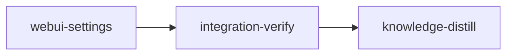

# Plan: Dashboard settings — theme picker and desktop notifications

## Overview

The web dashboard's settings dialog shows only what the daemon serves from `~/.loom/config.toml`.
This plan adds a second kind of setting to it — a `dashboard` section holding preferences that belong
to the browser, not to loom's config — and fills it with two: a theme picker offering four themes, and
a desktop-notification switch that raises an OS notification when a stage needs a human.

Both preferences persist to `localStorage` through jotai's `atomWithStorage`, the mechanism the three
theme atoms already use.

## Goals

- A `dashboard` section in the settings dialog, rendered whether or not `/api/config` answers, and
  filtered by the dialog's own filter box like every other section.
- A theme picker offering Ledger, Aubergine, Pacific (dark blue) and Graphite (dark gray), each drawn
  as a miniature of loom's stage graph in that theme's own palette.
- A desktop notification when a stage enters the server's `attention` set under a label that needs a
  human, when a stage needs a handoff, and when the whole run settles (every stage merged or skipped).
- Non-goals: no new theme tokens, no Rust changes, no new dependency, no change to the existing
  sun/moon toggle, no service worker.

## What is already true (verified against the tree at HEAD `ebe48f3f`)

Two findings reshaped this plan, and both cut work out of it.

**The blue and gray dark themes are already vendored.** `web/src/aurora-ui/shared/styles/tokens.css`
carries `.dark[data-dark-theme="gray"]` at lines 321-362 and `.dark[data-dark-theme="blue"]` at
365-406, byte-identical to the aurora-ui kit, alongside green, slate, sand and two light variants.
`web/src/aurora-ui/shared/atoms/theme.ts` already declares `"blue"` and `"gray"` in `DarkVariant` and
`ALL_DARK_VARIANTS`, and persists all three theme atoms to `localStorage` under `loom:theme`,
`loom:light-variant` and `loom:dark-variant` with `{ getOnInit: true }`. `ThemeProvider`
(`web/src/aurora-ui/theme/ThemeProvider.tsx`) already writes the `dark` class and both `data-*`
attributes onto `<html>`.

What is missing is a control. `ThemeToggle` only flips `themeAtom`; a repo-wide grep finds no writer
of `lightVariantAtom` or `darkVariantAtom` outside `theme.ts` and `ThemeProvider.tsx`. So the CSS work
is zero and the atom work is zero — the deliverable is UI.

**The dashboard receives snapshots, not events.** `snapshotSchema`
(`web/src/api/schema.ts:168-181`) is `.strict()` and carries no message-type discriminator; the same
shape serves the `/ws` frame and the `/api/status` GET. `applySnapshot` (`web/src/state/apply.ts:7-18`)
replaces `snapshotAtom` wholesale. There is no "the agent asked a question" field anywhere: an
`AskUserQuestion` call reaches the browser only as a stage flipping to `waiting-for-input`, which the
server also publishes as an `attention` entry labelled `NEEDS INPUT`
(`loom/src/commands/status/render/attention_model.rs:126-143`). A notification must therefore be
derived by diffing the previous snapshot against the next, and the precedent for exactly that is
`appendTransitions` in `web/src/lib/activity.ts:41-67`, already called from `applySnapshot` with both
snapshots in scope.

Four facts about that wire shape the notification rules, and each was checked against the Rust side:

- **`attention` is one entry per stage, and its label is not a function of stage status.**
  `attention_entry` (`loom/src/commands/status/render/attention_model.rs:36-45`) returns the first of
  three sources: a cleanup warning (`CLEANUP FAILED`), then a completion blocker
  (`COMPLETION PENDING`, `COMPLETION BLOCKED`, `WRITER UNCONFIRMED`, `:86-92`), and only then the
  status table (`BLOCKED`, `MERGE CONFLICT`, `ACCEPTANCE FAILED`, `MERGE ERROR`, `NEEDS REVIEW`,
  `NEEDS INPUT`, `ADJUDICATING`, `:128-134`). A stage that is merely `executing` carries
  `COMPLETION PENDING` while loom watches a first completion failure
  (`loom/src/commands/status/data/completion_view/mod.rs:102-138`) - nobody is being asked for
  anything. The other two blocker labels do need a human: a `needs-human-review` stage with a blocker
  is published as `COMPLETION BLOCKED` or `WRITER UNCONFIRMED` in place of `NEEDS REVIEW` (`:161-177`).
  So the notifier skips exactly one label, `COMPLETION PENDING`, and keys on id AND label.
- **`merge.pending` is not "work left".** `build_merge_report` (`loom/src/git/merge/status.rs:163-178`)
  looks only at stages already `completed`, so `pending` holds completed-but-unmerged stages and
  empties after EVERY individual merge, while other stages are still queued or executing. It cannot
  signal the end of a run. The per-stage `merged` boolean (`web/src/api/schema.ts:95`) can: a run is
  settled when every stage is `skipped`, or `completed` with `merged: true`, and `merge.conflicts` is
  empty.
- **A reconnect does not re-baseline.** `snapshotAtom` starts `null` (`web/src/state/atoms.ts:28`) and
  only `applySnapshot` writes it; `reconnect` in `web/src/api/ws.ts` calls `openSocket()` and never
  refetches `/api/status`. The first frame after an outage is diffed against the pre-outage snapshot.
- **The socket and the React tree share one jotai store** (`web/src/main.tsx:15` and `:19`), so a
  preference set in the dialog is visible to the notifier on the next frame.

Note that `loom-hooks/ask-user-pre.sh` already fires an OS notification through `osascript` /
`notify-send` on the machine running the session. That is a separate mechanism and stays as it is;
this one serves a browser that may be on another machine.

## Decisions settled here

- **Four themes, not nine.** `tokens.css` defines nine combinations. The picker offers Ledger,
  Aubergine, Pacific and Graphite, because loom's own `--tone-*`, `--ledger-rule` and `--logo` tokens
  (`web/src/index.css:35-76`) have only ever been tuned against Ledger and Aubergine, and the other
  five have had no visual pass.
- **The swatch is loom's stage graph.** aurora-ui's `ThemePicker` draws a generic sidebar-and-card
  thumbnail. Ours draws a header strip over five stage cards on two ranks joined by orthogonal edges
  with arrowheads, the middle stage carrying the accent. The geometry is fixed in W2's brief because
  the drawing has already been reviewed and approved.
- **Swatch colours are literal `oklch`, not `var(--…)`.** A swatch shows a theme the viewer is not in;
  CSS variables would resolve against the active theme and render four identical copies.
- **The picker lives in `web/src/components/`, not in the vendored `aurora-ui/theme/`.** The art and
  the option list are loom's, not the kit's; keeping them out of the vendored subtree keeps that copy
  a faithful copy.
- **`<button aria-pressed>`, never `role="radio"`.** `web/src/components/settings-dialog.test.tsx:30`
  asserts there is no element with `role="radio"` anywhere in the dialog. The picker renders inside it.
- **The section renders above `LoadNotice` and outside the `load.phase === "ready"` guard**, because
  its state is browser-local and must survive `/api/config` being unreachable.
- **Notifications are opt-in and fire regardless of tab visibility.** `notificationsEnabledAtom`
  defaults to `false`; turning it on requests permission from inside the click handler, which is the
  only place browsers grant the prompt.
- **Three event rules.** (1) A new `${id}:${label}` in `attention`, skipping the one informational
  label `COMPLETION PENDING`. (2) A stage transitioning to `needs-handoff`, the one attention-worthy
  status the server leaves out of that array. (3) The run settling: the previous frame was not
  settled and the next one is, where settled means at least one stage, no `merge.conflicts`, and
  every stage either `skipped` or `completed` with `merged: true`. `merge.pending` emptying is NOT
  the signal - it empties after every single merge (see above), and an earlier draft of this plan
  that used it would have announced "run finished" once per stage. The predicate reads each frame's
  whole stage set, so it needs no intermediate pending-merge frame: a last stage that goes from
  `executing` to `completed` + merged between two frames, with `merge.pending` empty in both, still
  announces. Every `stage_type` counts alike — knowledge and distill stages are merged by the same
  handler and loom's own end-of-run check (`all_stages_merged`, `loom/src/fs/plan_lifecycle.rs:91`)
  makes no type exception. A `completed` stage with `merged: false` keeps the run unsettled, which
  also covers merge states the web never sees (the server's merge-status warnings are dropped from
  the web payload, `loom/src/commands/status/data/collector.rs:274-282`).
- **At most five attention/handoff notifications per frame; run-finished is never dropped.** One frame
  of a wide DAG can flip a dozen stages at once, so rules 1 and 2 together cap at five. The
  run-finished event is delivered after the cap, always. Events cut by the cap are gone for good -
  the next frame's `previous` already contains them - and that is the accepted cost of not raising a
  wall of notifications.
- **The notification body names the stage, not a CLI command.** Body is `${entry.name} (${entry.id})`.
  The server's `hint` is a command such as `loom stage resume client`, useless to a viewer on another
  machine, which is the viewer this feature exists for.
- **A reconnect delivers a catch-up diff, on purpose.** The baseline is not reset on reconnect; the
  first frame after an outage notifies for what changed during it, capped as above. The settled-run
  predicate is what keeps that catch-up from mislabelling a partial run as finished.
- **Every open tab notifies independently.** Each document runs its own socket. Cross-tab
  de-duplication is left to the browser's `tag` replacement, which is why every notification carries a
  stable `tag`.
- **A preference changed in one tab reaches every open tab, dialog open or not.** jotai's
  `atomWithStorage` listens for the `storage` event only while the atom is mounted (`onMount`,
  `web/node_modules/jotai/esm/vanilla/utils.mjs:455-460`), and `store.get` never mounts it, so the
  dialog's `useAtom` alone would leave a tab with settings closed notifying after the user opted out
  elsewhere. `watchNotificationPreference(store)` in `state/notifications.ts` holds a `store.sub` on
  the atom, and `web/src/main.tsx` calls it once beside `connectStatusSocket(store)` for the app's
  lifetime - the same lifecycle that file already documents for the socket.
- **The switch shows what is delivered.** It reads on only when the preference is on AND permission is
  `granted`. If permission was revoked or reset after the user opted in, the section turns the
  persisted preference back off when it mounts, so the user never sees an on switch that is disabled
  and delivers nothing.
- **A filter that matches only the dashboard section shows no "nothing matches" line.** The server
  table renders `nothing matches "<query>"` whenever its own sections are empty
  (`settings-cards.tsx:47-48`, `settings-lanes.tsx:100-107`), which would sit beside a visible theme
  picker for a query such as `theme`. `Body` therefore skips the server table when the query is
  non-empty, no server section matches, and the dashboard section does match.
- **Known limitation, accepted: two tone tokens keep Aubergine's hue under Pacific and Graphite.**
  `--tone-pending` and `--tone-dimmed` are `oklch(… 0.025 325)` for every `.dark` variant
  (`web/src/index.css:63` and `:67`). At chroma 0.025 they read as near-gray, and "no new theme
  tokens" stays a non-goal. Every other loom token either derives from `var(--primary)` /
  `var(--border)` or is hue-neutral. knowledge-distill records this in `concerns.md`.
- **An insecure origin is a supported state, not an error.** `loom status --web --host <lan-ip>`
  serves plain HTTP off loopback on purpose (`loom/src/cli/types_status_web.rs:20-25`), and the
  Notifications API needs a secure context — `https`, `localhost` or `127.0.0.0/8`. The switch
  disables itself there and says why. `PLAN-web-host-graft-followthrough.md` owns that CLI file and
  adds a wildcard bind while scoping TLS out, so this state becomes more common once it lands.

## Execution diagram



There is no `knowledge-bootstrap` stage: `doc/loom/knowledge/` is already populated (tier-1 files with
`##` sections plus 116 `INDEX.md` entries), `loom knowledge sync` reports the catalog current, and
`loom knowledge check --strict` exits 0 at HEAD.

## Stages

### 1. Dashboard settings section (`webui-settings`)

One stage, three workers in two waves. Why one and not several: no worker needs another's code
*merged* before it can start (Q1 no — W3's dependency on W1 and W2 is compile-order, resolved by
pinning their signatures in W3's brief and running it in wave 2), no two workers write the same file
(Q2 no), nothing needs a verification checkpoint mid-feature (Q3 no), and the whole stage is a few
hundred lines of TypeScript well under the context budget (Q4 no). Splitting it would buy three
worktrees, three sessions and three merges for nothing.

| Worker | Role | Tier | Files owned | Shared context | Brief path |
| --- | --- | --- | --- | --- | --- |
| W1 | notifications core | codex `gpt-5.6-terra`, units `w1a-notify-lib`, `w1b-notify-state`, `w1c-apply-wiring` | `web/src/lib/notify.ts`, `web/src/lib/notify.test.ts`, `web/src/state/notifications.ts`, `web/src/state/notifications.test.ts`, `web/src/state/apply.ts`, `web/src/state/apply.test.ts`, `web/src/main.tsx` | `web/src/lib/activity.ts`, `web/src/api/schema.ts` (read-only) | `doc/plans/briefs/webui-settings/webui-settings/w1-notifications.md` |
| W2 | theme picker + swatch art | codex `gpt-5.6-sol`, units `w2a-theme-picker`, `w2b-picker-test` | `web/src/components/theme-picker.tsx`, `web/src/components/theme-picker.test.tsx` | `web/src/aurora-ui/shared/atoms/theme.ts`, `tokens.css` (read-only) | `doc/plans/briefs/webui-settings/webui-settings/w2-theme-picker.md` |
| W3 | dashboard section + dialog mount | codex `gpt-5.6-terra`, units `w3a-webui-section`, `w3b-dialog-mount`, `w3c-section-test` | `web/src/components/settings-webui.tsx`, `web/src/components/settings-webui.test.tsx`, `web/src/components/settings-dialog.tsx` | W1 and W2 contracts, pinned verbatim in the brief | `doc/plans/briefs/webui-settings/webui-settings/w3-settings-section.md` |

Territories are DISJOINT. Workers NEVER spawn subagents. Wave 1 is W1 and W2, spawned in ONE message;
wave 2 is W3, after both return.

Between the waves the orchestrator runs `bun run --cwd web typecheck` and wave 1's four test files.
W3 works from pinned signatures it cannot look up, so a broken wave 1 has to surface before wave 2
spends its budget.

Each codex forward carries ONE unit, and the task text has to say which: the forwarder strips the
`--unit-id` line before codex sees the task (`~/.claude/agents/loom-codex-forwarder.md`, "The single
Bash call"), so the id is a correlation tag for `loom subagents watch` and nothing more. Every brief
therefore gives each unit its own heading and its own done-when line, and a unit never runs a test
file that a later unit creates.

W3's dialog edit is two changes in `Body`: the mount, and the guard that keeps the server
table's "nothing matches" line from appearing beside a matching dashboard section.

W2 goes to `gpt-5.6-sol` because the swatch is visual work with a fixed brief but real drawing
judgment; W1 and W3 are ordinary implementation and go to `gpt-5.6-terra`.

Two existing assertions the stage must not break, both in `settings-dialog.test.tsx`: `:30` requires
that no element in the dialog has `role="radio"`, and `:288` compares every `.settings-key-name` in
the document against the server-config rows. The briefs forbid both shapes; the full suite catches it
either way.

### 2. Integration verification (`integration-verify`)

The full web gate with zero tolerance, parallel `loom-code-reviewer` subagents, and functional proof
that the section is reachable and the notifier is called from the real snapshot path.

No `cargo` command appears in this plan. Nothing under `loom/` changes, and the one Rust-side
consequence — the SPA embedded by `loom/build/assets.rs:114-130` — is covered by rebuilding
`web/dist`, committing it, and gating on `git status` being clean, which is precisely what CI's own
`web` job does (`.github/workflows/ci.yml:285-289`). What that leaves out is CI's
`smoke-web-dashboard` job
(`scripts/smoke-web-dashboard.sh`). A stage sandbox CAN be granted a listening port -
`allow_local_binding: true`, which the merged settings-lanes plan used for exactly that script - so
the omission is a choice this plan makes: the script only `curl`s routes and checks status codes
and content types, all of it served by Rust code this plan does not touch, and it never executes the
bundle. It would cost a cold 391-crate `cargo build` per worktree and prove nothing about this
feature. The wiring proof instead comes from `settings-webui.test.tsx`, which drives the real dialog
through the real router, from `apply.test.ts`, and from the source and bundle greps in `after_stage`.
No gate in this plan executes the built bundle in a browser; that gap is inherited from the repo's
web gate and is recorded for knowledge-distill rather than closed here.

### 3. Knowledge distillation (`knowledge-distill`)

Curate the stage memories, then update `README.md` / `CONTRIBUTING.md` only where dashboard behaviour
changed.

This stage owns a repair it did not cause. `loom memory pending --strict` exits 1 at HEAD with five
unresolved ad-hoc entries, which would strand the stage on its own acceptance:

```text
108d0ea48b9c4c8aa7cf81acce5d4a3b  note      found/gotcha: loom clean --all never stops the daemon
6279373a58f3462cb6c2c24543086d99  note      found/gotcha: ExecutionGraph::mark_queued …
d6d1c0641ab143369676f8c8a35c0def  decision  literal "orchestrator.lock" string in state_identity.rs
0c52702712c24a2fb4dbbd805abea85b  decision  recovery_guards.rs registered as a top-level module
ad2f94052be1427f9425dc964797cadd  note      web terminal scroll uses bounded JSON {scroll:{pages}}
```

Resolve each with `loom memory resolve <id> --outcome promoted|merged|discarded|deferred` alongside
this plan's own memories.

None of the five concerns the dashboard: they cover `loom clean --all`, `ExecutionGraph::mark_queued`,
the `orchestrator.lock` literal, `recovery_guards.rs` placement and the web-terminal scroll protocol.
Curating them needs narrow reads of the Rust files each memory cites, which the stage's single-agent
rule allows. The memory queue is global, so the stage's own notes count too: anything it records after
its last `resolve` leaves `loom memory pending --strict` red on its own entry.

## Baselines, observed at HEAD `ebe48f3f`

Every acceptance command below was run from this checkout before the plan was written:

```text
bun install --cwd web --frozen-lockfile        exit 0   "Checked 529 installs across 608 packages (no changes)"
bun run --cwd web typecheck                    exit 0
bun run --cwd web lint                         exit 0
bun run --cwd web format:check                 exit 0   "All matched files use the correct format" (127 files)
bun run --cwd web test                         exit 0   34 test files, 356 tests, 4.34 s
bun run --cwd web build                        exit 0   built in 422 ms
test -z "$(git status --short --untracked-files=all web/dist)"   exit 0 after a fresh rebuild
loom knowledge check --strict                  exit 0   (0 issues, 170 review notes)
bunx markdownlint-cli2 README.md CONTRIBUTING.md "doc/loom/knowledge/**/*.md"   exit 0   (119 files, 0 issues)
loom plan verify doc/plans/PLAN-webui-settings-themes-notifications.md          exit 0   (0 errors, 1 warning: no knowledge-bootstrap, answered above)
loom memory pending --strict                   exit 1   (five entries — owned by knowledge-distill, above)
```

The three marker criteria assert facts about a bundle that does not exist yet, so they cannot be
baselined green. They were dry-run against two fixtures instead — a file containing
`` `loom:notifications` ``, `"Graphite"` and `"Pacific"`, and a file containing neither:

```text
rg -qF "loom:notifications" <good>  exit 0     rg -qF "loom:notifications" <broken>  exit 1
rg -qF Graphite <good>              exit 0     rg -qF Graphite <broken>              exit 1
rg -qF Pacific  <good>              exit 0     rg -qF Pacific  <broken>              exit 1
```

All three are absent from `web/src` and from `web/dist/assets/index.js` at HEAD, so each is red before
the work and green after. The patterns carry no quote characters so they match whichever quote style
the minifier picks for a given literal (the bundle mixes double quotes and backticks).

What the markers prove, and what they do not: `loom:notifications` proves `state/notifications.ts` is
in the shipped entry's import graph, and the two labels prove the picker's option list reached the
bundle. None of them proves `deliverNotifications` is called or that the switch renders - the
`wiring` pattern, `apply.test.ts` and `settings-webui.test.tsx` carry that. The bundle filename is
stable because `web/vite.config.ts` pins `entryFileNames: "assets/[name].js"` with sourcemaps off, and
a rebuild at HEAD leaves `web/dist` byte-identical.

Vitest exits 1 on a missing test file and on a file with no tests, so the two `wiring_tests` prove
their files exist and are non-empty. `vitest run <file> -t "<name>"` exits 0 when no test matches the
name, so a pinned test name is NOT usable as a gate; the `after_stage` greps on test names and the
test-count check stand in for it.

The full web suite runs on the implementation stage as well as on integration-verify. That is
deliberate and differs from this repo's Rust doctrine, which reserves the unfiltered suite for
integration-verify because `cargo test --all-targets` costs 57 s warm; `bun run --cwd web test` costs
4.3 s, and the two merged settings plans (settings-lanes, typed-config-values) ran `bun run check` on
their implementation stages the same way. The six web acceptance lines are CI's `web` job verbatim:
`check` in `web/package.json:16` is `typecheck && lint && format:check && test`, followed by the build
and the clean-`dist` test (`.github/workflows/ci.yml:280-289`). `lint` is `oxlint --deny-warnings`
with the default correctness category plus one rule (`web/.oxlintrc.json`): `zod` may only be imported
through `@/api/zod`. There is no eslint and no type-aware lint pass in this repo.

## Sibling plans

`IN_PROGRESS-PLAN-loop-recovery.md` lists twelve `web/src` paths in its `completion-recovery` stage
and names `web/dist/index.html` in one stage's `artifacts`. None of them is in this plan's `files:`,
and that web work is ALREADY MERGED: commit `1f7e1867` is an ancestor of HEAD, and its wire changes
(`completionBlockerSchema`, `completion_blocker` on a stage, the completion-blocker attention labels)
are the tree this plan was checked against. Only the plan file's `IN_PROGRESS-` prefix is outstanding,
so there is no `web/dist` race left with it.

The collision that IS live is the last stage. Both plans' `knowledge-distill` stages own
`doc/loom/knowledge/**`, `README.md` and `CONTRIBUTING.md`, both gate on
`loom memory pending --strict`, and the memory queue is global. **Do not run this plan while any other
plan's knowledge-distill stage is pending or executing**: two curations rewrite `INDEX.md` twice, and
whichever runs first resolves or discards the other's memories.

The `settings-*` files W3 edits came from the merged settings-lanes and typed-config-values plans;
their code is what W3 edits against. Their `DONE-` plan files are gitignored (`.gitignore:80`) or
uncommitted, so they exist in no worktree - nothing in this plan depends on reading them.
`PLAN-web-host-graft-followthrough.md` claims `loom/src/commands/status/web/**` and `loom/src/cli/**`,
Rust only, and does not overlap; it owns `loom/src/cli/types_status_web.rs`, the file cited above for
the plain-HTTP origin, and explicitly leaves TLS out of scope. The dashboard's CSP
(`loom/src/commands/status/web/http.rs`) has no `Permissions-Policy` and nothing in it restricts the
Notifications API; the briefs set no notification icon, so `img-src` never applies.

**Preflight:** `loom run` refuses to start while the plan or a brief is uncommitted
(`loom/src/commands/run/plan_inputs.rs:38`). Stage exactly these four paths and nothing else under
`doc/plans/`:

```text
doc/plans/PLAN-webui-settings-themes-notifications.md
doc/plans/briefs/webui-settings/webui-settings/w1-notifications.md
doc/plans/briefs/webui-settings/webui-settings/w2-theme-picker.md
doc/plans/briefs/webui-settings/webui-settings/w3-settings-section.md
```

A sweep of `doc/plans/` would also commit unrelated untracked plans and review files that sit beside
this one.

---

<!-- loom METADATA -->

```yaml
loom:
  version: 1
  sandbox:
    enabled: true
    auto_allow: true
    filesystem:
      deny_read:
        - "~/.ssh/**"
        - "~/.aws/**"
        - "~/.config/gcloud/**"
        - "~/.gnupg/**"
      allow_write:
        - "web/src/**"
        - "web/dist/**"
        - "web/node_modules/**"
        - "doc/loom/knowledge/**"
        - "README.md"
        - "CONTRIBUTING.md"
    network:
      allowed_domains:
        - "registry.npmjs.org"
      allow_local_binding: false
      allow_unix_sockets: []
  stages:
    - id: webui-settings
      name: "Dashboard Settings Section"
      stage_type: standard
      implementers: ["codex", "claude"]
      subagent_timeout_secs: 900
      description: |
        Add a browser-local `dashboard` section to the settings dialog: a theme
        picker over four themes (Ledger, Aubergine, Pacific, Graphite), and a
        desktop-notification switch. Both persist through jotai atomWithStorage
        to localStorage.

        Use parallel subagents and skills to maximize performance.

        THREE WORKERS IN TWO WAVES. Territories are DISJOINT. Workers NEVER
        spawn subagents. Spawn each wave's workers BY AGENT TYPE, ALL in ONE
        message, each with the fixed prompt plus the line
        "Your brief: <path>. Read it in full before anything else."

        Wave 1: W1 and W2, concurrently. Wave 2: W3, after both return.

        INTER-WAVE GATE. After W1 and W2 both return and BEFORE spawning W3,
        run bun install --cwd web --frozen-lockfile (a fresh worktree has no
        web/node_modules), then bun run --cwd web typecheck, then
        bun run --cwd web test src/lib/notify.test.ts src/state/notifications.test.ts src/state/apply.test.ts src/components/theme-picker.test.tsx
        W3 builds on pinned signatures it cannot look up. A red gate here is
        repaired by a FRESH forward of the failing unit with the failure output
        in its task text, before wave 2 starts - never after.

        | Worker | Role | Tier | Files owned | Brief path |
        | --- | --- | --- | --- | --- |
        | W1 | notifications core | codex gpt-5.6-terra, units w1a-notify-lib, w1b-notify-state, w1c-apply-wiring | web/src/lib/notify.ts, web/src/lib/notify.test.ts, web/src/state/notifications.ts, web/src/state/notifications.test.ts, web/src/state/apply.ts, web/src/state/apply.test.ts, web/src/main.tsx | doc/plans/briefs/webui-settings/webui-settings/w1-notifications.md |
        | W2 | theme picker and swatch art | codex gpt-5.6-sol, units w2a-theme-picker, w2b-picker-test | web/src/components/theme-picker.tsx, web/src/components/theme-picker.test.tsx | doc/plans/briefs/webui-settings/webui-settings/w2-theme-picker.md |
        | W3 | dashboard section and dialog mount | codex gpt-5.6-terra, units w3a-webui-section, w3b-dialog-mount, w3c-section-test | web/src/components/settings-webui.tsx, web/src/components/settings-webui.test.tsx, web/src/components/settings-dialog.tsx | doc/plans/briefs/webui-settings/webui-settings/w3-settings-section.md |

        CODEX LANE. Spawn every worker as a loom-codex-forwarder subagent in the
        FOREGROUND, with --effort xhigh, an explicit Bash timeout of 600000 ms,
        and the tier its row names: --model gpt-5.6-terra for W1 and W3,
        --model gpt-5.6-sol for W2. A codex worker cannot see edits made during
        this run - its source-graph lookups answer from the published base
        layer - which is why W3 runs in wave 2 and why its brief pins W1's and
        W2's exported signatures verbatim rather than telling it to look them
        up.

        ONE FORWARD PER UNIT, NOT PER WORKER. The wrapper cancels a unit at
        540000 ms, so each territory is forwarded as a sequence of units of at
        most one file plus its test. Pass the unit id with --unit-id and never
        invent one: W1 is w1a-notify-lib, w1b-notify-state, w1c-apply-wiring;
        W2 is w2a-theme-picker, w2b-picker-test; W3 is w3a-webui-section,
        w3b-dialog-mount, w3c-section-test. The units of ONE worker run
        SEQUENTIALLY, one forwarder spawn each; W1 and W2 still run
        concurrently with each other. An exit 124 means the unit exceeded the
        deadline and was cancelled: RE-SPLIT the remainder against the partial
        tree, never re-forward the same unit as is. Tell every codex subagent
        NOT to run git at all, and check git status --short yourself after each
        codex run.

        THE TASK TEXT NAMES THE UNIT. The forwarder strips the --unit-id line
        before codex sees the task, so the id alone tells codex nothing. Every
        forwarded task text must read: "Your brief: <path>. Read it in full
        before anything else. Do ONLY the section headed `Unit <unit-id>` and
        stop when that unit's own Done-when line holds. Earlier units are
        already on disk; later units are not yours." The eight unit ids above
        are the only registry: loom subagents watch --worker codex:<id> binds
        the exact string you passed to --unit-id, so a typo watches nothing.
        If a brief file is missing from the worktree, the plan and briefs were
        not committed before loom run - stop and report; never reconstruct a
        brief from this description.

        ORCHESTRATOR OWNS THE BUILD OUTPUT. No worker touches web/dist. After
        W3 returns, run bun install --cwd web --frozen-lockfile, then
        bun run --cwd web build, and stage the rebuilt web/dist with the rest:
        it is committed and embedded into the binary by loom/build/assets.rs.
        Vite pins the bundle filenames, so a skipped rebuild leaves the tree
        looking clean while the binary serves the old SPA - the marker
        criteria on web/dist/assets/index.js are what catch that.

        NO CARGO. Nothing under loom/ changes in this stage.

        TWO EXISTING ASSERTIONS THIS STAGE MUST NOT BREAK, both in
        web/src/components/settings-dialog.test.tsx, which no worker owns:
        line 30 asserts no element in the dialog has role="radio" (so the
        picker uses button + aria-pressed), and line 288 compares every
        .settings-key-name in the document against the server-config rows (so
        the new section must not use that class). Reject a worker report that
        introduced either.

        SECTION PLACEMENT IS SETTLED: <SettingsWebui query={query} /> is the
        FIRST child of <div className="settings-scroll"> in Body, above
        LoadNotice and outside the load.phase === "ready" guard, so it still
        renders when /api/config is unreachable. Do not accept a report that
        put it inside that guard. The same Body edit also skips the server
        table when the query is non-empty, no server section matches and
        webuiMatches(query) is true, so "nothing matches" never sits beside a
        visible dashboard section.

        NOTIFICATION RULES ARE SETTLED - reject a W1 report that departs from
        them. "Run finished" means the previous frame was not settled and the
        next one is: at least one stage, merge.conflicts empty, every stage
        skipped or completed with merged true. merge.pending emptying is NOT
        that signal - it empties after every single merge. Attention arrivals
        skip the label COMPLETION PENDING and no other. Attention and handoff
        events cap at five per frame combined; run-finished is delivered after
        the cap and never dropped. The deliverNotifications call is the LAST
        statement of applySnapshot, after both store.set lines, so a stale
        frame returns before notifying. The settled predicate needs no
        intermediate pending-merge frame and treats every stage_type alike.
        web/src/main.tsx calls watchNotificationPreference(store) once, beside
        connectStatusSocket(store), so a preference changed in another tab
        reaches this tab's notifier while its settings dialog is closed -
        reject a report that leaves the dialog's useAtom as the only
        subscriber.

        SWATCH COLOURS ARE LITERAL oklch( STRINGS. Reject a theme-picker.tsx
        that contains var(-- anywhere: a CSS variable resolves against the
        ACTIVE theme and renders four identical swatches while every test
        still passes.

        MEMORY: record mistakes, decisions and surprises via loom memory
        immediately; NEVER loom knowledge (this is an implementation stage);
        NEVER Claude Code auto-memory.
      dependencies: []
      acceptance:
        - "bun install --cwd web --frozen-lockfile"
        - "bun run --cwd web typecheck"
        - "bun run --cwd web lint"
        - "bun run --cwd web format:check"
        - "bun run --cwd web test"
        - "bun run --cwd web build"
        - 'test -z "$(git status --short --untracked-files=all web/dist)"'
        - 'rg -qF "loom:notifications" web/dist/assets/index.js'
        - "rg -qF Graphite web/dist/assets/index.js"
        - "rg -qF Pacific web/dist/assets/index.js"
      files:
        - "web/src/lib/notify.ts"
        - "web/src/lib/notify.test.ts"
        - "web/src/state/notifications.ts"
        - "web/src/state/notifications.test.ts"
        - "web/src/state/apply.ts"
        - "web/src/state/apply.test.ts"
        - "web/src/main.tsx"
        - "web/src/components/theme-picker.tsx"
        - "web/src/components/theme-picker.test.tsx"
        - "web/src/components/settings-webui.tsx"
        - "web/src/components/settings-webui.test.tsx"
        - "web/src/components/settings-dialog.tsx"
        - "web/dist/**"
      working_dir: "."
      artifacts:
        - "web/src/lib/notify.ts"
        - "web/src/lib/notify.test.ts"
        - "web/src/state/notifications.ts"
        - "web/src/state/notifications.test.ts"
        - "web/src/components/theme-picker.tsx"
        - "web/src/components/theme-picker.test.tsx"
        - "web/src/components/settings-webui.tsx"
        - "web/src/components/settings-webui.test.tsx"
      wiring:
        - source: "web/src/state/apply.ts"
          pattern: "(?s)store\\.set\\(snapshotAtom.*deliverNotifications\\("
          description: "The snapshot funnel calls the notifier AFTER storing the frame, so it sits past the stale-frame guard"
        - source: "web/src/main.tsx"
          pattern: "watchNotificationPreference\\(store\\)"
          description: "The app root keeps the preference atom mounted, so another tab's opt-out reaches this tab's notifier"
        - source: "web/src/components/settings-dialog.tsx"
          pattern: "<SettingsWebui"
          description: "The dashboard section is rendered by the dialog body, not merely imported"
        - source: "web/src/components/settings-dialog.tsx"
          pattern: "webuiMatches\\("
          description: "Body consults the dashboard section's filter before showing the server table's empty state"
        - source: "web/src/components/settings-webui.tsx"
          pattern: "<ThemePicker"
          description: "The section renders the picker"
        - source: "web/src/components/settings-webui.tsx"
          pattern: "notificationsEnabledAtom"
          description: "The switch reads and writes the persisted atom"
        - source: "web/src/components/theme-picker.tsx"
          pattern: "darkVariantAtom"
          description: "The picker writes the dark variant atom that nothing wrote before"
      wiring_tests:
        - name: "the dashboard section renders inside the real settings dialog"
          command: "bun run --cwd web test src/components/settings-webui.test.tsx"
          success_criteria:
            exit_code: 0
        - name: "the snapshot funnel raises notifications"
          command: "bun run --cwd web test src/state/apply.test.ts"
          success_criteria:
            exit_code: 0
      before_stage:
        - command: "rg -q ThemePicker web/src"
          exit_code: 1
          description: "Before: no theme picker exists anywhere in the dashboard"
        - command: 'rg -qF "loom:notifications" web/src'
          exit_code: 1
          description: "Before: nothing persists a notification preference"
        - command: "rg -q darkVariantAtom web/src/components"
          exit_code: 1
          description: "Before: no component writes the dark variant atom"
        - command: "rg -qF Graphite web/dist/assets/index.js"
          exit_code: 1
          description: "Before: the shipped bundle names no theme beyond the defaults"
      after_stage:
        - command: "rg -q darkVariantAtom web/src/components/theme-picker.tsx"
          exit_code: 0
          description: "After: the picker sets the dark variant"
        - command: "rg -q deliverNotifications web/src/state/apply.ts"
          exit_code: 0
          description: "After: the notifier is called from the snapshot funnel"
        - command: 'rg -qF "loom:notifications" web/dist/assets/index.js'
          exit_code: 0
          description: "After: the rebuilt bundle carries the notification preference key"
        - command: "rg -qF Graphite web/dist/assets/index.js"
          exit_code: 0
          description: "After: the rebuilt bundle carries the new theme labels"
        - command: 'rg -q "role=.radio." web/src/components/theme-picker.tsx'
          exit_code: 1
          description: "After: the picker uses aria-pressed buttons, keeping the dialog free of radios"
        - command: 'rg -qF "0 0 120 76" web/src/components/theme-picker.tsx'
          exit_code: 0
          description: "After: each option carries the stage-graph swatch, not a bare label"
        - command: 'rg -qF "oklch(" web/src/components/theme-picker.tsx'
          exit_code: 0
          description: "After: swatch palettes are literal oklch strings"
        - command: 'rg -qF "var(--" web/src/components/theme-picker.tsx'
          exit_code: 1
          description: "After: no CSS variable in the picker, so each swatch shows its own theme and not the active one"
        - command: 'rg -qF "loom:notifications" web/src/state/notifications.ts'
          exit_code: 0
          description: "After: the preference key lives in the notifications state module"
        - command: 'rg -qF "COMPLETION PENDING" web/src/lib/notify.ts'
          exit_code: 0
          description: "After: the informational attention label is excluded by name"
        - command: 'rg -qF "mid-run merge" web/src/lib/notify.test.ts'
          exit_code: 0
          description: "After: the regression case for run-finished firing on every merge exists by its pinned name"
        - command: 'rg -qF "another tab" web/src/state/notifications.test.ts'
          exit_code: 0
          description: "After: the cross-tab preference regression exists by its pinned name"
        - command: 'rg -qF "every theme applies" web/src/components/theme-picker.test.tsx'
          exit_code: 0
          description: "After: all four theme mappings are asserted through the real ThemeProvider by a pinned name"
        - command: 'rg -qF "both breakpoints" web/src/components/settings-webui.test.tsx'
          exit_code: 0
          description: "After: the filter empty-state is asserted at the wide and the narrow layout by a pinned name"
        - command: 'rg -q "renderAt" web/src/components/settings-webui.test.tsx'
          exit_code: 0
          description: "After: the section test drives the REAL dialog at ?settings=1, not the section in isolation"
        - command: 'test "$(rg -c "^\s*it\(" web/src/state/apply.test.ts)" -ge 4'
          exit_code: 0
          description: "After: apply.test.ts gained the three notifier cases (new entry, stale frame, first frame) beside its original one"

    - id: integration-verify
      name: "Integration Verification"
      stage_type: integration-verify
      description: |
        Final verification. Verify FUNCTIONAL INTEGRATION, not just tests
        passing. NEVER Claude Code auto-memory.

        CONTEXT: read doc/plans/PLAN-webui-settings-themes-notifications.md,
        loom memory show --all, and the knowledge INDEX.

        BUILD AND TEST, zero tolerance - fix ALL warnings and failures, nothing
        is "pre-existing": the full web gate plus the build and the committed
        bundle check.

        CODE REVIEW: spawn parallel loom-code-reviewer subagents (security via
        Skill(skill="loom-skills", args="loom-security-audit"); architecture;
        test coverage). Stage any diff a reviewer needs INSIDE this worktree -
        a reviewer has no Bash tool and the worktree guard blocks every file
        tool outside it, so a diff left in $TMPDIR makes the reviewer silently
        blind. Write that diff to review-diff.patch at the worktree root
        (git diff <base>...HEAD -- web/src > review-diff.patch), NEVER git add
        it, and delete it before the final commit: git status --short must not
        list it when you complete. Fix ALL findings with an engineer agent; the
        reviewer is read-only.

        REVIEW FOCUS, beyond the generic passes - each of these survives every
        automated gate: (a) notify.ts decides "run finished" from per-stage
        merged/skipped state, never from merge.pending alone; (b) the
        five-per-frame cap cannot drop the run-finished event; (c) the switch
        never renders on-and-disabled (persisted true with permission denied
        or default must read off); (d) theme-picker.tsx palettes match
        web/src/aurora-ui/shared/styles/tokens.css for --background, --card,
        --foreground, --muted-foreground, --border, --primary and
        --primary-foreground in the :root, .dark,
        .dark[data-dark-theme="blue"] and .dark[data-dark-theme="gray"] blocks;
        (e) a filter query matching only the dashboard section shows no
        "nothing matches" line, at the wide AND the narrow layout, and a total
        miss shows exactly one; (f) web/src/main.tsx keeps
        notificationsEnabledAtom subscribed for the app's lifetime, so an
        opt-out in another tab stops this tab's notifications while its
        settings dialog is closed; (g) theme-picker.test.tsx states its
        expected theme mappings and palettes as literals, not read back from
        THEME_OPTIONS.

        FUNCTIONAL: prove the feature is WIRED IN.
        1. The dashboard section is reachable through the REAL dialog:
           bun run --cwd web test src/components/settings-webui.test.tsx
           drives it through the router at ?settings=1.
        2. The notifier is reached from the real snapshot path:
           bun run --cwd web test src/state/apply.test.ts.
        3. The shipped bundle carries the work: the marker greps over
           web/dist/assets/index.js. If any is red, web/dist was not rebuilt -
           rebuild and re-commit it.
        NO cargo command belongs in this plan: nothing under loom/ changed.
        scripts/smoke-web-dashboard.sh is deliberately out of scope: it only
        curls routes served by Rust code this plan does not touch and never
        executes the bundle, so it would cost a cold cargo build and prove
        nothing about this feature. No gate here runs the built bundle in a
        browser; record that gap to memory for knowledge-distill.

        Record discoveries to loom memory for knowledge-distill, including any
        knowledge file the tree contradicts:
        loom memory note "stale-knowledge: ...".
      dependencies: ["webui-settings"]
      acceptance:
        - "bun install --cwd web --frozen-lockfile"
        - "bun run --cwd web typecheck"
        - "bun run --cwd web lint"
        - "bun run --cwd web format:check"
        - "bun run --cwd web test"
        - "bun run --cwd web build"
        - 'test -z "$(git status --short --untracked-files=all web/dist)"'
        - 'rg -qF "loom:notifications" web/dist/assets/index.js'
        - "rg -qF Graphite web/dist/assets/index.js"
        - "rg -qF Pacific web/dist/assets/index.js"
        - "bun run --cwd web test src/components/settings-webui.test.tsx"
        - 'rg -qF "var(--" web/src/components/theme-picker.tsx; test $? -eq 1'
        - 'rg -qF "mid-run merge" web/src/lib/notify.test.ts'
        - 'rg -qF "another tab" web/src/state/notifications.test.ts'
        - 'test -z "$(git status --short -- review-diff.patch)"'
      working_dir: "."
      wiring:
        - source: "web/src/components/settings-dialog.tsx"
          pattern: "<SettingsWebui"
          description: "The dialog still renders the dashboard section after every fix"
        - source: "web/src/state/apply.ts"
          pattern: "(?s)store\\.set\\(snapshotAtom.*deliverNotifications\\("
          description: "The snapshot funnel still raises notifications, past the stale-frame guard, after every fix"
        - source: "web/src/main.tsx"
          pattern: "watchNotificationPreference\\(store\\)"
          description: "The app root still holds the preference subscription after every fix"
      wiring_tests:
        - name: "the whole web suite is green on the merged tree"
          command: "bun run --cwd web test"
          success_criteria:
            exit_code: 0

    - id: knowledge-distill
      name: "Knowledge Distillation"
      stage_type: knowledge-distill
      description: |
        Curate all stage memories into permanent knowledge; update user docs.
        NEVER Claude Code auto-memory.

        SINGLE-AGENT: do NOT spawn subagents - the memories are compact
        summaries; lean on them and keep code spot-reads narrow.

        Read the plan, loom memory show --all, and the knowledge INDEX.

        CORRECTIONS FIRST: apply every `stale-knowledge:` memory in place with
        loom knowledge replace-section <file> "<heading>" "<body>" - never with
        loom knowledge update, which appends the fix below the stale text.

        Then curate: the localStorage-backed dashboard preference pattern
        (jotai atomWithStorage, the loom: key prefix), the snapshot-diff shape
        that notifications share with appendTransitions, the secure-context
        limit on the Notifications API under --host, and the two
        settings-dialog test assertions that constrain anything rendered inside
        that dialog. Also record, in concerns.md, the two accepted gaps this
        plan leaves: --tone-pending and --tone-dimmed keep hue 325 under the
        Pacific and Graphite themes (web/src/index.css), and no gate in the
        web pipeline executes the built bundle in a browser. TIER ROUTING:
        findings of about 40 lines or fewer go
        inline in the tier-1 file; larger ones go via
        loom knowledge update <category>/<slug> with a 2-4 line tier-1 summary
        and link. INDEX.md regenerates on every knowledge write; then
        loom review prunes stale entries.

        Update README.md / CONTRIBUTING.md only where dashboard behaviour
        changed; if nothing user-facing changed, skip and record WHY in memory.

        RECEIPTS: every Note/Decision/Question taken into knowledge gets
        loom memory resolve <id> --outcome promoted|merged|discarded|deferred
        right after the write that used it (--target/--reason as appropriate).

        PRE-EXISTING PENDING MEMORIES: loom memory pending --strict exits 1 at
        HEAD with five ad-hoc entries this plan did not create -
        108d0ea48b9c4c8aa7cf81acce5d4a3b, 6279373a58f3462cb6c2c24543086d99,
        d6d1c0641ab143369676f8c8a35c0def, 0c52702712c24a2fb4dbbd805abea85b and
        ad2f94052be1427f9425dc964797cadd. This stage owns them: read each,
        promote what belongs in knowledge, merge or discard the rest, and
        resolve all five. None concerns the dashboard - they are Rust daemon
        and graph findings - so a narrow read of the file each one cites is
        expected. Finish with loom memory pending --strict clean. YOUR OWN
        MEMORIES COUNT: the queue is global, so resolve every entry you record
        in this stage too, mistake notes included, as the last thing before
        loom stage complete.
      dependencies: ["integration-verify"]
      acceptance:
        - 'rg -q "## " doc/loom/knowledge/architecture.md'
        - 'rg -q "## " doc/loom/knowledge/patterns.md'
        - "loom knowledge check --strict"
        - 'bunx markdownlint-cli2 README.md CONTRIBUTING.md "doc/loom/knowledge/**/*.md"'
        - "loom memory pending --strict"
      files:
        - "doc/loom/knowledge/**"
        - "README.md"
        - "CONTRIBUTING.md"
      working_dir: "."
```

<!-- END loom METADATA -->
