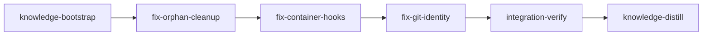

# PLAN: Container Backend Hardening

## Overview

Four issues surfaced during the first end-to-end container-backend run (bookscan, 2026-05-12). The backend now works (stages execute, commit, complete, merge), but four operational/security gaps need closing before the backend is daily-driver quality:

1. **Orphan resource leak on stage failure.** When `spawn_session` fails (or the orchestrator retries a Blocked stage), the previous attempt's podman container, git worktree, and `loom/<id>` branch persist. The retry then hits `podman run` with `Error: the container name "loom-apply-fixes" is already in use … or use --replace`. Worktrees and branches also linger after the container exits, requiring manual `loom clean`.

2. **Global hooks never fire inside the container.** `commit-filter.sh` (strips `Co-Authored-By: Claude` trailers), `commit-guard.sh`, `prefer-modern-tools.sh`, `skill-trigger.sh`, etc. live in the operator's `~/.claude/settings.json` on the host. That file is NOT bind-mounted into the container — only `~/.claude/hooks/loom/` (the scripts themselves) is mounted ro at `/home/loom/.claude/hooks/loom/`. The worktree-level `settings.local.json` that loom generates only emits SESSION-SPECIFIC hooks because `loom/src/hooks/generator.rs` intentionally excludes "global" hooks to avoid duplication with the host settings — but for container backend, those host settings are invisible, so the hooks silently no-op. Observed symptom: agent commits contain `Co-Authored-By: Claude` trailers that `commit-filter.sh` would have rejected.

3. **`settings.local.json` with in-container paths leaks back to host.** Inside the container, `/home/loom/.claude/hooks/loom/<script>.sh` paths are baked into the worktree's `.claude/settings.local.json`. The worktree is a bind mount, so the file is on host disk. Nothing prevents the agent from `git add`-ing it, and the user reports having seen these `/home/loom/` paths land on the host after merges.

4. **Git identity not configurable; commits attributed wrong.** Inside the container there is no `git config user.name` or `user.email`, so commits either fail or fall back to "loom@host" defaults. There is no way for the operator to specify the desired identity in the plan or in `.work/config.toml`, and no automatic inheritance from the host's `git config --global` settings.

## Goals

- Stage failure/retry leaves the workspace in the same shape as a clean state (no orphan containers, worktrees, or branches).
- All hooks (global + session-specific) execute inside container-backed agent sessions.
- `settings.local.json` is automatically gitignored per-worktree, so agents cannot accidentally commit container-specific paths.
- `git config user.name`/`user.email` is configurable per-project and defaults to the host's git identity.
- Container backend continues to be the default for this plan (we are dogfooding the very feature we are hardening).

## Non-Goals

- Refactoring `loom stage complete` to use daemon IPC instead of direct file writes (separate plan).
- Re-architecting the ro-base mount topology (already addressed in the prior dogfooding session; current model is acceptable).
- Native backend changes — these fixes are container-backend specific.

## Execution Diagram



Sequential rather than parallel: all four implementation stages touch overlapping files in `loom/src/orchestrator/terminal/container/mod.rs`, `loom/src/orchestrator/core/stage_executor.rs`, and/or `loom/src/hooks/` (the hook generator + the place that calls it). Sequential keeps merges clean.

---

## Stages

### 1. Knowledge Bootstrap

**Purpose:** Re-read existing container-backend knowledge before implementing. The prior dogfooding session left substantial knowledge in `doc/loom/knowledge/architecture.md`, `mistakes.md`, `concerns.md`, etc. about the container topology, mount ordering, capability requirements, etc. Implementation stages need to internalize this so they don't undo recent fixes.

**Tasks:**

- Run `loom knowledge check` — it should report ≥ 50% coverage already.
- Read `architecture.md` (container topology, mount layout, lifecycle, naming), `mistakes.md` (mount ordering, UID collision, capability requirements, hooks chicken-and-egg), `concerns.md` (host_repo_root sanity, probe network mismatch, forward_credentials default).
- Update knowledge ONLY if there are gaps — do not rewrite working content.

**Files:** `doc/loom/knowledge/**`

**Acceptance:** Knowledge files contain sections with `## ` headers.

---

### 2. Fix Orphan Resource Cleanup

**Purpose:** Container, worktree, and branch from a failed/cancelled stage attempt must be removed before the orchestrator retries — otherwise `podman run` fails on name collision and stale worktrees pile up.

**Dependencies:** `knowledge-bootstrap`

**Tasks:**

1. **In `loom/src/orchestrator/terminal/container/mod.rs::spawn_common`**: at the top of the function (before the network/mount setup), preemptively run `<runtime> rm -f <container_name>` so any leftover container with the target name is removed. Best-effort (ignore errors — if there's no container, `rm -f` exits 0 anyway on modern docker/podman). Comment must explain that this is the cheap defense against retry-name-collision; the failure path's own log capture + rm in `kill_session` remains the canonical cleanup.

2. **In `loom/src/orchestrator/core/stage_executor.rs`**: extend the spawn-failure rollback (the block that marks the stage `Blocked` with `FailureInfo::InfrastructureError` — added in the prior session) to ALSO remove the leftover worktree + branch + container. The intent is that a retry starts from a clean slate. Specifically:
   - Call `self.dispatcher.for_stage(stage_backend).kill_session(&placeholder_session_with_just_the_tracking_key)` — or, more pragmatically, invoke the runtime directly with `rm -f loom-<stage-id>` so we don't need a fully-populated Session.
   - Call `git::worktree::remove_worktree(repo_root, stage_id, force=true)` (use the existing helper at `loom/src/git/worktree/operations.rs` — confirm its signature first).
   - Call `git::branch::delete_branch(repo_root, &branch_name_for_stage(stage_id), force=true)` — again use existing helper if present, otherwise add one.
   - All three should be wrapped in `let _ = ...` (best-effort cleanup; spawn already failed, so partial-cleanup errors should not mask the original failure).

3. **Worktree-stage path**: do the same cleanup at the existing failure-rollback site for Standard/IntegrationVerify stages (the spawn match arm). Knowledge stages need only container removal (no worktree).

4. **Tests**: add a unit test in `loom/src/orchestrator/terminal/container/mod.rs::tests` that confirms `spawn_common`'s rm-f preamble is in the run args (or that the function calls `<runtime> rm -f` via a mock). Add an integration test that simulates a spawn-fail-then-retry sequence and asserts the second attempt succeeds.

**Files:**

- `loom/src/orchestrator/terminal/container/mod.rs`
- `loom/src/orchestrator/core/stage_executor.rs`
- `loom/src/git/worktree/operations.rs` (potentially — only if a new helper is needed)
- `loom/src/git/branch.rs` (potentially)

**Acceptance:** `cargo test`, `cargo clippy -- -D warnings`, `cargo build`.

**Verification:**

- Artifacts: `src/orchestrator/terminal/container/mod.rs`, `src/orchestrator/core/stage_executor.rs` exist with the cleanup logic.
- Wiring: `mod.rs` contains a preemptive `rm -f` invocation in `spawn_common`; `stage_executor.rs` failure-rollback calls runtime + worktree + branch cleanup.

---

### 3. Fix Container Hook Installation

**Purpose:** All hooks (global + session-specific) must fire inside the container. Today only session-specific hooks land in worktree `settings.local.json`; global hooks live in the host's `~/.claude/settings.json` which is invisible to the container. Co-Authored-By trailers slip through because `commit-filter.sh` never runs.

Also: auto-gitignore `.claude/settings.local.json` per-worktree so agents cannot accidentally commit container-baked `/home/loom/` paths back to the host repo.

**Dependencies:** `fix-orphan-cleanup`

**Tasks:**

1. **In `loom/src/hooks/generator.rs::generate_hooks_settings`**: detect the backend (it's a field on `HooksConfig` already — `loom/src/hooks/config.rs:102+`). When `backend == BackendType::Container`, emit the FULL hook set in the worktree's `settings.local.json`, not just the session-specific subset. The full set includes:

   - `PreToolUse`: `commit-filter.sh`, `commit-guard.sh` (for Bash matcher), `git-add-guard.sh`, `prefer-modern-tools.sh`, `worktree-isolation.sh`, `worktree-file-guard.sh`, `skill-trigger.sh`
   - `PostToolUse`: existing post-tool-use hooks + `learning-validator.sh` (Stop) — keep current behavior
   - `SessionStart`: `session-start.sh`
   - `SessionEnd`: `session-end.sh`
   - `PreCompact`: `pre-compact.sh`
   - `Stop`: `learning-validator.sh`
   - `UserPromptSubmit`: `ask-user-pre.sh` / `ask-user-post.sh` (if applicable)

   Use `HooksConfig::script_path(event)` (`loom/src/hooks/config.rs:140`) — it already returns `/home/loom/.claude/hooks/loom/<script>` for container backend. So the existing path-emission logic is correct; only the SET of hooks needs to expand.

   Concrete approach: instead of two separate paths ("global hooks go to host settings, session hooks go to worktree settings"), unify so that for container backend, ALL hooks are emitted to worktree `settings.local.json`. Native backend can keep its current split (global lives in host settings, session in worktree settings) since the host settings file is naturally available there.

   Look at `loom/src/fs/permissions/hooks.rs:22+` for the canonical list of PreToolUse hooks (this is what gets written to the HOST's `~/.claude/settings.json` during `loom init`) — emit the same set into container worktree settings.

2. **Verify the hook scripts work inside the container.** Most hooks shell out to `loom`, which is now mounted at `/usr/local/bin/loom` (from the prior session). Re-confirm no hook hard-codes a host path. If any hook does (`/home/dkaponis/...` or similar), file it as a separate concern — but the fixes from the prior session should already have addressed the obvious cases.

3. **In `loom/src/git/worktree/settings.rs`** (or wherever the worktree's initial files are written during `git worktree add`): write a `.gitignore` entry to the worktree-local `.git/info/exclude` file containing the line `.claude/settings.local.json`. Per-worktree exclude rather than top-level `.gitignore` so we don't pollute the user's repo `.gitignore`. The file path is `<worktree>/.git/info/exclude` for worktrees, or `<main_repo>/.git/info/exclude` for the main repo (knowledge stages run there).

   If a `.git/info/exclude` file already exists with other entries, append rather than overwrite.

4. **Tests**: unit test for `generate_hooks_settings` asserting that for `BackendType::Container`, all global-hook scripts appear in the output JSON's `PreToolUse` array with `/home/loom/` paths. Unit test for the worktree `.gitignore` insertion (using a temp dir).

**Files:**

- `loom/src/hooks/generator.rs`
- `loom/src/hooks/config.rs` (potentially, for any new helper)
- `loom/src/fs/permissions/hooks.rs` (read-only reference for the canonical hook list)
- `loom/src/git/worktree/settings.rs` (or whichever file owns worktree-setup writes)
- `loom/src/git/worktree/operations.rs` (potentially)

**Acceptance:** `cargo test`, `cargo clippy -- -D warnings`, `cargo build`.

**Verification:**

- Artifacts: `src/hooks/generator.rs` exists with container-backend hook expansion.
- Wiring: `src/hooks/generator.rs` references `BackendType::Container` AND emits the global hook script names; worktree setup writes `.claude/settings.local.json` to `.git/info/exclude`.

---

### 4. Fix Git Identity Inheritance

**Purpose:** Container-backed agent commits must use the operator's git identity (or a per-plan override), not a default "loom" identity.

**Dependencies:** `fix-container-hooks`

**Tasks:**

1. **Extend `ProjectContainerConfig` in `loom/src/plan/schema/execution.rs`**: add two new optional fields:

   - `git_user_name: Option<String>`
   - `git_user_email: Option<String>`

   Use `#[serde(default)]` and `skip_serializing_if = "Option::is_none"` so old config.toml files without these fields keep working.

2. **In `loom/src/commands/init/execute.rs::apply_project_backend`** (the `BackendType::Container` arm that writes `[project_execution.container]`): default these fields by reading the host's git config:

   - `git config user.name` (via `std::process::Command::new("git").args(["config", "user.name"]).output()`)
   - `git config user.email` (same pattern)

   Fall back to `None` (don't write the field) if either command fails or returns empty — better to leave commits with no identity than to silently inject a wrong one. Print a warning in that case so the operator knows.

   If the user already has values in an existing `.work/config.toml` (reconfigure path), preserve them — don't overwrite.

3. **In `loom/src/orchestrator/terminal/container/mod.rs::build_env_for_session`**: read `self.git_user_name` / `self.git_user_email` (which need to be added to `ContainerBackend` and populated in `ContainerBackend::new` from the project config). When present, inject these env vars into the container:

   - `GIT_AUTHOR_NAME` = git_user_name
   - `GIT_AUTHOR_EMAIL` = git_user_email
   - `GIT_COMMITTER_NAME` = git_user_name
   - `GIT_COMMITTER_EMAIL` = git_user_email

   Git respects these env vars over `git config user.*`, so no additional `git config` step is needed inside the wrapper.

4. **In `loom/src/fs/work_dir.rs`**: ensure `read_project_execution` / `write_project_execution` round-trip the new fields. The toml_edit-based writer needs to emit them when present, the toml-based reader (via `try_into::<ProjectContainerConfig>()`) inherits them automatically once the struct has the fields with serde defaults.

5. **Tests**: round-trip test for the new fields in `loom/src/fs/work_dir.rs::tests`. Unit test in `container/mod.rs` confirming env vars are injected when fields are set. Init test confirming `loom init --backend container` reads host git config and writes them.

**Files:**

- `loom/src/plan/schema/execution.rs`
- `loom/src/commands/init/execute.rs`
- `loom/src/orchestrator/terminal/container/mod.rs`
- `loom/src/fs/work_dir.rs`

**Acceptance:** `cargo test`, `cargo clippy -- -D warnings`, `cargo build`.

**Verification:**

- Artifacts: `src/plan/schema/execution.rs` has the new fields; `src/commands/init/execute.rs` reads from host git config; `src/orchestrator/terminal/container/mod.rs` injects the env vars.
- Wiring: `execution.rs` declares `git_user_name` AND `git_user_email`; `container/mod.rs` references `GIT_AUTHOR_NAME` AND `GIT_COMMITTER_NAME`.

---

### 5. Integration Verification

**Purpose:** Verify all four fixes integrate cleanly. CRITICAL: tests passing is NOT enough — we need observable container behavior. This stage is opus because integration-verify always runs opus, but also because the verification scenarios require judgment (the smoke tests touch a live container runtime).

**Dependencies:** `fix-git-identity`

**Tasks:**

Use parallel subagents and skills to maximize performance.

CONTEXT GATHERING (FIRST):

- Read the plan file from `doc/plans/IN_PROGRESS-PLAN-container-backend-hardening.md`
- Run `loom memory show --all` to read all stage memories from this plan
- Read `doc/loom/knowledge/architecture.md`, `mistakes.md`, `concerns.md`

BUILD & TEST (zero tolerance — fix ALL warnings/errors):

- `cargo test` (full workspace test suite)
- `cargo clippy -- -D warnings`
- `cargo build` (debug) and `cargo build --release`
- Verify no `unused_imports` / `dead_code` warnings introduced by the new fields

CODE REVIEW (MANDATORY — use loom-code-reviewer subagents in parallel):

  Subagent 1 — Security review (loom-code-reviewer + /loom-security-audit skill):
    Files reviewed: src/orchestrator/terminal/container/mod.rs (rm -f preamble, env injection), src/commands/init/execute.rs (git config exec)
    Focus: command injection in the runtime rm invocation; env var injection if git_user_name contains shell-meaningful chars

  Subagent 2 — Architecture review (loom-code-reviewer):
    Files reviewed: src/hooks/generator.rs, src/hooks/config.rs
    Focus: native-vs-container hook split is cleanly expressed; no surprise behavior changes for native backend

  Subagent 3 — Testing review (loom-code-reviewer):
    Files reviewed: all *test* additions in this plan's stages
    Focus: integration test that simulates retry-after-failure actually covers the orphan cleanup path

FUNCTIONAL VERIFICATION (MANDATORY — these are NEW, container-runtime-touching tests):

- Smoke test 1 (orphan cleanup): create a fixture stage that fails its first spawn (e.g., by configuring an invalid mount path), confirm the failure rollback removes the worktree+branch+container, then trigger a retry and confirm it succeeds.
- Smoke test 2 (container hooks fire): spawn a stage in a test container, exec `cat /repo/.worktrees/<id>/.claude/settings.local.json` inside, verify it contains `commit-filter.sh` and `commit-guard.sh` references at `/home/loom/.claude/hooks/loom/`.
- Smoke test 3 (settings.local.json gitignored): in a test worktree, verify `.git/info/exclude` contains `.claude/settings.local.json`.
- Smoke test 4 (git identity): with `git_user_name = "Test User"` and `git_user_email = "test@example.com"` in config.toml, spawn a stage, exec `env | grep GIT_AUTHOR` inside, verify the values match.

For smoke tests 1, 2, and 4 — gate them on `podman` being available; skip with a clear `#[ignore]` reason if not.

MEMORY RECORDING (loom memory ONLY):

- Record any surprises in test execution: `loom memory note "found: ..."`
- Record any decisions made during review fixes: `loom memory decision "..." --context "..."`
- Do NOT use `loom knowledge update` — knowledge-distill will curate.

⛔ NEVER use Claude Code's auto-memory (`~/.claude/projects/*/memory/`).

**Files:** `loom/src/**`, `loom/tests/**` (smoke tests).

**Acceptance:**

- `cargo test`
- `cargo clippy -- -D warnings`
- `cargo build`
- `cargo build --release`

**Verification:**

- Truths: `./target/release/loom --version` succeeds (release binary builds and runs)
- Wiring: `src/hooks/generator.rs` has container-backend branch; `src/orchestrator/terminal/container/mod.rs` has GIT_AUTHOR env injection; `src/plan/schema/execution.rs` has `git_user_name` field; `src/orchestrator/core/stage_executor.rs` has failure-rollback cleanup of worktree + branch + container.

---

### 6. Knowledge Distillation

**Purpose:** Curate this plan's stage memories into permanent knowledge files. Particular focus on the container-backend learnings — the prior dogfooding session already established the topology and capability requirements; this plan adds the cleanup-on-failure pattern, the hook-emission asymmetry between native and container, and the git-identity inheritance pattern.

**Dependencies:** `integration-verify`

**Tasks:** see standard knowledge-distill template (in the YAML metadata below).

**Files:** `doc/loom/knowledge/**`, `README.md` (if any user-visible behavior changed — likely yes for the new `git_user_name`/`git_user_email` config fields).

**Acceptance:** Knowledge files contain sections with `## ` headers.

---

<!-- loom METADATA -->

```yaml
loom:
  version: 1

  sandbox:
    enabled: true
    auto_allow: true
    excluded_commands:
      - "loom"
    filesystem:
      deny_read:
        - "~/.ssh/**"
        - "~/.aws/**"
        - "~/.config/gcloud/**"
        - "~/.gnupg/**"
      allow_write:
        - "loom/src/**"
        - "loom/tests/**"
        - "doc/loom/knowledge/**"
        - "doc/plans/**"
        - "README.md"
        - "CONTRIBUTING.md"
    network:
      allowed_domains:
        - "crates.io"
        - "index.crates.io"
        - "static.crates.io"
      allow_local_binding: false
      allow_unix_sockets: []

  stages:
    - id: knowledge-bootstrap
      name: "Bootstrap Knowledge Base"
      stage_type: knowledge
      model: "sonnet"
      reasoning_effort: "high"
      description: |
        MANDATORY first stage. Re-read existing container-backend knowledge
        before any implementation. The prior dogfooding session populated
        substantial knowledge — preserve and extend, do not rewrite.

        Use parallel subagents and skills to maximize performance.

        Step 0 — CHECK EXISTING KNOWLEDGE:
          loom knowledge check
          Review the output to identify any gaps (likely none — coverage
          should already be ≥ 50% for this codebase).

        Step 1 — READ THE CONTAINER-RELEVANT KNOWLEDGE:
          - doc/loom/knowledge/architecture.md (Container Backend Topology,
            Mount-Topology Hardening Decision, Container Naming, Lifetime/Log Capture)
          - doc/loom/knowledge/mistakes.md (Mount order inversion, UID 1000
            collision, host repo mount requirement, gosu privilege drop,
            hook ownership .claude dir issue, firewall DNS rule order)
          - doc/loom/knowledge/concerns.md (host_repo_root sanity, probe network
            mismatch, forward_credentials default, container/mod.rs size)

        Step 2 — BACKFILL GAPS ONLY (do not rewrite working content):
          If loom knowledge check reports anything missing related to the
          four issues in this plan (orphan cleanup, container hooks,
          gitignore, git identity), document what you found via:
            loom knowledge update <file> "..."

        ⛔ NEVER use Claude Code's auto-memory (~/.claude/projects/*/memory/).
        ALL memory/knowledge goes through loom memory and loom knowledge commands.

        MEMORY RECORDING:
        - Record surprises: loom memory note "found: ..."
        - Do NOT record procedural actions (read file, ran command)
      dependencies: []
      acceptance:
        - "loom knowledge check"
        - 'rg -q "## " doc/loom/knowledge/architecture.md'
        - 'rg -q "## " doc/loom/knowledge/mistakes.md'
      files:
        - "doc/loom/knowledge/**"
      working_dir: "."
      artifacts:
        - "doc/loom/knowledge/architecture.md"
        - "doc/loom/knowledge/mistakes.md"
        - "doc/loom/knowledge/concerns.md"

    - id: fix-orphan-cleanup
      name: "Fix Orphan Container/Worktree/Branch Cleanup"
      stage_type: standard
      model: "sonnet"
      reasoning_effort: "high"
      description: |
        Ensure containers, worktrees, and branches from a failed or
        cancelled stage attempt are removed before retry. Currently the
        retry hits "container name already in use" and the workspace
        accumulates orphan worktrees/branches.

        Use parallel subagents and skills to maximize performance.

        TASK 1 — Preemptive rm -f in spawn_common:
          In src/orchestrator/terminal/container/mod.rs, at the top of
          spawn_common (after the existing tracking_key computation,
          BEFORE network::write_allowlist), invoke the runtime to remove
          any leftover container with the target name:

            let _ = Command::new(self.runtime.binary())
                .args(["rm", "-f", &container_name])
                .output();

          Comment must explain this is the cheap retry-collision defense;
          the canonical cleanup path is kill_session with log capture.
          Do NOT add this to spawn_common's success path — only the
          preamble. Errors are silently ignored (rm -f exits 0 even when
          there's no container).

        TASK 2 — Failure-rollback cleanup in stage_executor.rs:
          The prior session added a failure-rollback block in
          start_knowledge_stage (around lines 130-145) and start_stage
          worktree path (around lines 350-380) that marks the stage
          Blocked with FailureInfo::InfrastructureError. Extend both
          blocks to also clean up the leftover resources:

          a) Container removal — invoke the runtime directly via
             Command::new(self.config.backend_type-derived binary)
             .args(["rm", "-f", &format!("loom-{}", stage_id)])
             OR use a method on the dispatcher that exposes this. Look
             at how kill_session in container/mod.rs:660+ does it; the
             pattern is: get the runtime binary, run rm -f, swallow errors.

          b) Worktree removal — call git::worktree::remove_worktree (look
             at loom/src/git/worktree/operations.rs for the existing
             signature; if it takes a Worktree, use the stored
             active_worktrees entry; if it takes a stage_id, pass that).
             Wrap in let _ = ... — best-effort, do not propagate.

          c) Branch removal — call into git::branch:: (look at
             loom/src/git/branch.rs for branch_name_for_stage and
             delete_branch helpers). Use the canonical
             branch_name_for_stage(stage_id) to get the name.

          d) For knowledge stages (start_knowledge_stage path): skip the
             worktree+branch cleanup (knowledge stages have neither). Only
             do the container removal.

        TASK 3 — Unit test in container/mod.rs::tests:
          Add build_run_args_includes_rm_preamble that confirms... wait,
          the rm preamble is NOT in build_run_args (that's just args for
          the spawn). The rm is a separate Command invocation in
          spawn_common. So the unit test approach is:
          - Refactor the rm preamble into a small standalone function
            preemptive_remove_existing(runtime: Runtime, name: &str) -> ()
            that takes mockable inputs.
          - Test that it constructs the correct args.
          OR just rely on the integration test for verification (Task 4)
          and skip the unit test if refactoring for testability is
          excessive.

        TASK 4 — Integration test (tests/e2e/ if appropriate, or
        loom/tests/<file>): only if the existing test infrastructure
        supports it — gate on podman being available, skip otherwise.

        ⛔ NEVER use Claude Code's auto-memory (~/.claude/projects/*/memory/).
        ALL memory/knowledge goes through loom memory and loom knowledge commands.

        MEMORY RECORDING:
        - Record any surprises about existing git::worktree / git::branch
          helpers: loom memory note "found: ..."
        - Decisions about test approach: loom memory decision "..." --context "..."
        - Do NOT record procedural actions.
      dependencies: ["knowledge-bootstrap"]
      acceptance:
        - "cargo test"
        - "cargo clippy -- -D warnings"
        - "cargo build"
      files:
        - "src/orchestrator/terminal/container/mod.rs"
        - "src/orchestrator/core/stage_executor.rs"
        - "src/git/worktree/operations.rs"
        - "src/git/branch.rs"
      working_dir: "loom"
      artifacts:
        - "src/orchestrator/terminal/container/mod.rs"
        - "src/orchestrator/core/stage_executor.rs"
      wiring:
        - source: "src/orchestrator/terminal/container/mod.rs"
          pattern: 'args\(\["rm", "-f", &container_name\]\)'
          description: "Preemptive rm -f preamble is present in spawn_common"
        - source: "src/orchestrator/core/stage_executor.rs"
          pattern: "remove_worktree"
          description: "Failure rollback removes the worktree"

    - id: fix-container-hooks
      name: "Fix Container Hook Installation + Auto-Gitignore Settings"
      stage_type: standard
      model: "sonnet"
      reasoning_effort: "high"
      description: |
        Two related fixes:
        (a) Container backend must emit ALL hooks (global + session) into
            the worktree's settings.local.json with /home/loom/ paths.
            Native backend keeps current behavior (global in host settings,
            session in worktree settings).
        (b) .claude/settings.local.json is auto-added to the worktree's
            .git/info/exclude so agents cannot accidentally commit
            container-baked paths back to the host repo.

        Use parallel subagents and skills to maximize performance.

        TASK 1 — Container-backend hook expansion in hooks/generator.rs:
          a) Read loom/src/hooks/generator.rs to understand the current
             structure of generate_hooks_settings(config, existing_settings).
          b) Read loom/src/fs/permissions/hooks.rs:22+ to see the canonical
             list of GLOBAL PreToolUse hooks that get written to the host's
             ~/.claude/settings.json during loom init. This is the set to
             replicate for container backend.
          c) In generate_hooks_settings, branch on config.backend:
             - BackendType::Native: keep existing behavior (session hooks only)
             - BackendType::Container: emit BOTH session hooks AND the
               full global hook set, all with /home/loom/.claude/hooks/loom/
               paths (use HooksConfig::script_path(event), which already
               returns the correct in-container path).
          d) Be careful with hook order — match the host's PreToolUse
             ordering from fs/permissions/hooks.rs so behavior is consistent.

        TASK 2 — Auto-gitignore settings.local.json on worktree creation:
          a) Find where worktrees are created — likely
             loom/src/git/worktree/operations.rs (look for git worktree add).
          b) Right after the worktree is created (and any initial files
             like settings.local.json are written), append the line
             ".claude/settings.local.json" to <worktree>/.git/info/exclude.
             If .git/info/exclude doesn't exist, create it (with leading
             "# loom: container-backend-generated paths\n" comment).
             If it exists, check whether the line is already present
             (idempotency); append only if not.
          c) For knowledge stages (no worktree), do the same write to the
             MAIN REPO's .git/info/exclude. Locate the setup path for
             knowledge stages (likely
             loom/src/orchestrator/core/stage_executor.rs::start_knowledge_stage)
             and add a one-time helper call after setup_hooks_for_worktree.

        TASK 3 — Unit tests:
          a) In loom/src/hooks/generator.rs::tests: add
             test_generate_hooks_settings_container_includes_global_hooks
             that constructs a HooksConfig with BackendType::Container and
             asserts the resulting JSON's PreToolUse array contains
             entries for commit-filter.sh, commit-guard.sh,
             prefer-modern-tools.sh with /home/loom/ paths.
          b) Test for the gitignore writer: pass a temp dir, call the
             helper, assert .git/info/exclude exists and contains the
             expected line.

        ⛔ NEVER use Claude Code's auto-memory (~/.claude/projects/*/memory/).
        ALL memory/knowledge goes through loom memory and loom knowledge commands.

        MEMORY RECORDING:
        - If you discover hooks that hardcode host paths despite the
          backend-aware design: loom memory note "gotcha: ..."
        - Decisions about where to put the gitignore helper:
          loom memory decision "..." --context "..."
      dependencies: ["fix-orphan-cleanup"]
      acceptance:
        - "cargo test"
        - "cargo clippy -- -D warnings"
        - "cargo build"
      files:
        - "src/hooks/generator.rs"
        - "src/hooks/config.rs"
        - "src/git/worktree/operations.rs"
        - "src/orchestrator/core/stage_executor.rs"
      working_dir: "loom"
      artifacts:
        - "src/hooks/generator.rs"
      wiring:
        - source: "src/hooks/generator.rs"
          pattern: "BackendType::Container"
          description: "Hook generator branches on container backend"
        - source: "src/hooks/generator.rs"
          pattern: "commit-filter|commit-guard"
          description: "Global hooks are emitted for container backend"

    - id: fix-git-identity
      name: "Fix Git Identity in Container Commits"
      stage_type: standard
      model: "sonnet"
      reasoning_effort: "high"
      description: |
        Container-backed stage commits must use the operator's git
        identity (or a per-plan override), not a default "loom".
        Approach: new optional fields in ProjectContainerConfig, default
        from host git config at init time, plumb to wrapper via
        GIT_AUTHOR_* / GIT_COMMITTER_* env vars.

        Use parallel subagents and skills to maximize performance.

        TASK 1 — Schema fields in plan/schema/execution.rs:
          Read loom/src/plan/schema/execution.rs and find
          ProjectContainerConfig. Add two new optional fields:

            #[serde(default, skip_serializing_if = "Option::is_none")]
            pub git_user_name: Option<String>,
            #[serde(default, skip_serializing_if = "Option::is_none")]
            pub git_user_email: Option<String>,

          The serde defaults ensure existing config.toml files without
          these fields parse without error.

          Update the round-trip test in execution.rs::tests (look for
          project_execution_config_round_trip) to include the new fields.

        TASK 2 — Default from host git config in commands/init/execute.rs:
          In the BackendType::Container arm of apply_project_backend
          (around lines 240-275), BEFORE write_project_execution, call
          host git config:

            fn host_git_config(key: &str) -> Option<String> {
                let out = std::process::Command::new("git")
                    .args(["config", "--global", key])
                    .output()
                    .ok()?;
                if !out.status.success() { return None; }
                let v = String::from_utf8(out.stdout).ok()?;
                let v = v.trim();
                if v.is_empty() { None } else { Some(v.to_string()) }
            }

          Use to populate git_user_name / git_user_email in
          ProjectContainerConfig. On failure, leave them as None and
          print a warning:
            println!("  ! No git user.name/email on host; commits inside
                     container will use defaults. Set via:
                     git config --global user.name '...'");

          On reconfigure (existing .work/config.toml has values), preserve
          them — the prior session's host_repo_root code shows the pattern
          for reading-then-merging existing config.

        TASK 3 — Round-trip in fs/work_dir.rs:
          The toml-based read path (read_project_execution) goes through
          toml::Value::try_into::<ProjectContainerConfig>(), so the new
          fields are picked up automatically once the struct has them.

          The toml_edit-based write path (write_project_execution) needs
          to handle the new fields. Look at how forward_credentials is
          emitted in write_project_execution — replicate that pattern for
          git_user_name and git_user_email (skip writing when None).

          Add a round-trip test in fs/work_dir.rs::tests.

        TASK 4 — Env var injection in container/mod.rs:
          a) Add fields to ContainerBackend struct:
               git_user_name: Option<String>,
               git_user_email: Option<String>,
          b) Populate them in ContainerBackend::new from the
             ProjectContainerConfig.
          c) In build_env_for_session (around line 350), when both fields
             are Some, append:
               ("GIT_AUTHOR_NAME".to_string(), name.clone()),
               ("GIT_AUTHOR_EMAIL".to_string(), email.clone()),
               ("GIT_COMMITTER_NAME".to_string(), name.clone()),
               ("GIT_COMMITTER_EMAIL".to_string(), email.clone()),
             When either is None, skip ALL four (partial identity is worse
             than no identity — git would fall back to inconsistent values).
          d) Unit test asserting env_set contains the four vars when both
             config fields are populated, and is empty when both are None.

        ⛔ NEVER use Claude Code's auto-memory (~/.claude/projects/*/memory/).
        ALL memory/knowledge goes through loom memory and loom knowledge commands.

        MEMORY RECORDING:
        - If host git config isn't trivially readable on macOS vs Linux:
          loom memory note "gotcha: ..."
        - Decision about partial-identity handling:
          loom memory decision "..." --context "..."
      dependencies: ["fix-container-hooks"]
      acceptance:
        - "cargo test"
        - "cargo clippy -- -D warnings"
        - "cargo build"
      files:
        - "src/plan/schema/execution.rs"
        - "src/commands/init/execute.rs"
        - "src/orchestrator/terminal/container/mod.rs"
        - "src/fs/work_dir.rs"
      working_dir: "loom"
      artifacts:
        - "src/plan/schema/execution.rs"
        - "src/orchestrator/terminal/container/mod.rs"
      wiring:
        - source: "src/plan/schema/execution.rs"
          pattern: "git_user_name"
          description: "Schema has git_user_name field"
        - source: "src/plan/schema/execution.rs"
          pattern: "git_user_email"
          description: "Schema has git_user_email field"
        - source: "src/orchestrator/terminal/container/mod.rs"
          pattern: "GIT_AUTHOR_NAME"
          description: "Container backend injects GIT_AUTHOR_NAME env var"
        - source: "src/orchestrator/terminal/container/mod.rs"
          pattern: "GIT_COMMITTER_NAME"
          description: "Container backend injects GIT_COMMITTER_NAME env var"

    - id: integration-verify
      name: "Integration Verification"
      stage_type: integration-verify
      model: "opus[1m]"
      reasoning_effort: "xhigh"
      description: |
        Final integration verification for the four container-backend
        hardening fixes. CRITICAL: tests passing is NOT enough — observable
        container behavior (smoke tests against the live podman runtime)
        is required.

        Use parallel subagents and skills to maximize performance.

        ⛔ NEVER use Claude Code's auto-memory (~/.claude/projects/*/memory/).
        ALL memory/knowledge goes through loom memory and loom knowledge commands.

        CONTEXT GATHERING (FIRST):
        - Read .work/config.toml -> [plan].source_path to find the in-progress
          plan filename, then read it from doc/plans/
        - Run: loom memory show --all  (read all stage memories)
        - Read doc/loom/knowledge/architecture.md, mistakes.md, concerns.md

        BUILD & TEST (zero tolerance — fix ALL warnings/errors):
        - cargo test  (full workspace)
        - cargo clippy -- -D warnings
        - cargo build  (debug)
        - cargo build --release
        - Verify no unused_imports / dead_code introduced by the new fields

        CODE REVIEW (MANDATORY — parallel loom-code-reviewer subagents):

          Subagent 1 — Security review (loom-code-reviewer + /loom-security-audit):
            Files Owned: (read-only review)
            Files Read: src/orchestrator/terminal/container/mod.rs
                       (rm -f preamble, env injection),
                       src/commands/init/execute.rs (git config exec)
            Focus: command injection in runtime rm; env var injection
                   if git_user_name has shell-meaningful chars; whether
                   the new env vars leak into other contexts.

          Subagent 2 — Architecture review (loom-code-reviewer):
            Files Owned: (read-only review)
            Files Read: src/hooks/generator.rs, src/hooks/config.rs
            Focus: native-vs-container hook split cleanly expressed; no
                   surprise behavior changes for native backend; no hook
                   duplication.

          Subagent 3 — Testing review (loom-code-reviewer):
            Files Owned: (read-only review)
            Files Read: any new test code added by stages 2-4
            Focus: tests genuinely cover the cleanup-on-failure path;
                   mocks aren't masking real-runtime behavior.

        Fix ALL issues found by reviewers using loom-software-engineer
        subagents in parallel where files don't overlap.

        FUNCTIONAL VERIFICATION (MANDATORY — gate on podman available, skip otherwise):

        Smoke 1 — Orphan cleanup on retry:
          Spawn a stage that intentionally fails its first attempt (e.g.,
          set an invalid bind mount source in a test fixture). Confirm
          that after the failure rollback fires, the next spawn for the
          same stage succeeds (i.e., the leftover container/worktree/branch
          were cleaned up).

        Smoke 2 — Container hooks present:
          Run a stage (any kind). Once the container is up, exec
            podman exec <container> cat /repo/.worktrees/<id>/.claude/settings.local.json
          (or for knowledge stages, /repo/.claude/settings.local.json)
          and grep for "commit-filter.sh" AND "commit-guard.sh" AND
          "/home/loom/" — all three must be present.

        Smoke 3 — settings.local.json gitignored:
          For a worktree stage, after worktree creation, exec
            cat <worktree>/.git/info/exclude
          on the host and confirm it contains ".claude/settings.local.json".

        Smoke 4 — Git identity propagation:
          With a config.toml containing
            [project_execution.container]
            git_user_name = "Test User"
            git_user_email = "test@example.com"
          spawn a stage, then exec
            podman exec <container> env | grep ^GIT_
          and confirm GIT_AUTHOR_NAME=Test User, GIT_AUTHOR_EMAIL=test@example.com,
          GIT_COMMITTER_NAME=..., GIT_COMMITTER_EMAIL=...

        Smoke 5 — Co-Authored-By stripping inside container:
          Spawn a container stage, exec a git commit with
          "Co-Authored-By: Claude" in the message body, confirm the
          commit-filter.sh hook BLOCKS the commit (or rewrites it). This
          is the headline regression fix for hook installation.

        These smoke tests do NOT need to be permanent CI tests — they
        require the live podman runtime. Record their pass/fail in
        loom memory and describe the methodology in the commit message
        so future verifications can replay them.

        MEMORY RECORDING (for knowledge-distill to curate):
        - Record what was newly discovered during verification:
            loom memory note "found: ..."
        - Decisions about review fixes:
            loom memory decision "..." --context "..."
        - Do NOT record procedural actions.
      dependencies: ["fix-git-identity"]
      acceptance:
        - "cargo test"
        - "cargo clippy -- -D warnings"
        - "cargo build"
        - "cargo build --release"
      files:
        - "src/**"
        - "tests/**"
        - "README.md"
        - "CONTRIBUTING.md"
      working_dir: "loom"
      truths:
        - "./target/release/loom --version"
      wiring:
        - source: "src/orchestrator/terminal/container/mod.rs"
          pattern: "GIT_AUTHOR_NAME"
          description: "Container backend injects GIT_AUTHOR_NAME"
        - source: "src/hooks/generator.rs"
          pattern: "BackendType::Container"
          description: "Hook generator has container-backend branch"
        - source: "src/plan/schema/execution.rs"
          pattern: "git_user_name"
          description: "Schema has git_user_name field"
        - source: "src/orchestrator/core/stage_executor.rs"
          pattern: "remove_worktree|delete_branch"
          description: "Failure rollback cleans worktree or branch"

    - id: knowledge-distill
      name: "Knowledge Distillation"
      stage_type: knowledge-distill
      model: "sonnet"
      reasoning_effort: "high"
      description: |
        Curate this plan's stage memories into permanent knowledge files,
        with particular focus on the container-backend learnings.

        Use parallel subagents and skills to maximize performance.

        ⛔ NEVER use Claude Code's auto-memory (~/.claude/projects/*/memory/).
        ALL memory/knowledge goes through loom memory and loom knowledge commands.

        CONTEXT GATHERING (FIRST):
        - Read .work/config.toml -> [plan].source_path, then read that file
          from doc/plans/
        - Run: loom memory show --all  (all stage memories)
        - Read doc/loom/knowledge/*.md to understand current state

        MEMORY CURATION:
        - Synthesize mistakes as actionable prevention rules under
          doc/loom/knowledge/mistakes.md using loom knowledge update.
          Specifically expected from this plan:
            - "Container retry collisions: stale containers from failed
               spawns block re-spawn. Preemptive rm -f in spawn_common
               plus full cleanup on failure rollback (worktree, branch,
               container) is the canonical fix."
            - "Hook installation asymmetry: native backend relies on
               host ~/.claude/settings.json for global hooks; container
               backend doesn't see that file. Container worktree's
               settings.local.json must contain ALL hooks (global +
               session) with /home/loom/ paths."
            - "settings.local.json with /home/loom/ paths inside a
               container worktree must be excluded from git via
               .git/info/exclude, not the user's main .gitignore."
            - "Container backend git identity: GIT_AUTHOR_* /
               GIT_COMMITTER_* env vars are how to inject the operator's
               identity since the container has no .gitconfig."
        - Curate decisions, patterns, conventions discovered.

        KNOWLEDGE REVIEW:
        - Run: loom review (if available)
        - Check for stale or outdated entries from prior container-backend
          knowledge that this plan invalidates (none expected; this plan
          ADDS to the container model rather than changing it).

        DOCUMENTATION UPDATE (MANDATORY):
        - README.md: add a section or update an existing one to document
          the new [project_execution.container].git_user_name /
          git_user_email config fields. Show an example .work/config.toml
          fragment.
        - CONTRIBUTING.md: if it mentions container backend or commit
          attribution rules, update for the new hook behavior.
        - Only update sections relevant to the changes — do NOT rewrite
          entire files.
      dependencies: ["integration-verify"]
      acceptance:
        - 'rg -q "## " doc/loom/knowledge/architecture.md'
        - 'rg -q "## " doc/loom/knowledge/mistakes.md'
        - 'rg -q "git_user_name|git_user_email" README.md'
      files:
        - "doc/loom/knowledge/**"
        - "README.md"
        - "CONTRIBUTING.md"
      working_dir: "."
```

<!-- END loom METADATA -->
