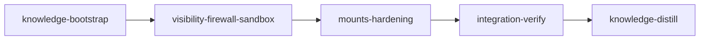

# Plan: Container Backend Hardening

## Context

The container backend (`DONE-PLAN-container-backend.md`) shipped a working per-stage Docker/Podman/Apple Container runtime, but production use surfaced three classes of issues:

1. **Silent crashes.** Containers are spawned with `run -d --rm` and the orchestrator never calls `<runtime> logs`. When the entrypoint or `firewall.sh` dies — common on rootless Podman without slirp4netns ≥ 1.2.3 and on Apple Container's limited Linux capability emulation — the container auto-removes before anyone can inspect it. The resulting crash report contains a generic `"Process no longer running"` reason with `log_tail: None` and `log_path: None`. Users see "stage failed" with no actionable diagnostic.

2. **Sandbox layering is muddled in container mode.** Claude Code's `settings.local.json` (network deny list, FS deny list) is written even when the container's `firewall.sh` enforces the same network policy at the kernel level. The dual policy is a maintenance burden and obscures which layer is load-bearing.

3. **The container's blast radius is wider than the threat model claims.** Earlier in this discussion we agreed `BypassPermissions` is the right default *because* the container is the safety boundary. But the boundary leaks: `/repo` is bind-mounted rw including `.git/`, sibling worktrees, `doc/plans/`, knowledge files, and the host-shared `.work/config.toml` (where `forward_credentials` can be escalated for the next stage). Hooks are enforced by a file (`.claude/settings.local.json`) that lives inside that rw mount, so a bypass-permission agent can disable hooks before doing anything else. Firewall failures kill the container (fail-safe) but `loom init --backend container` and `loom container doctor` only *warn* on runtimes that can't enforce — they don't refuse.

This plan addresses all three classes in one orchestrated change.

Already merged on `main` (out of scope for this plan): default `permission_mode = BypassPermissions` when `backend == Container` (`loom/src/sandbox/config.rs::default_mode_for`).

## Goals

- **Crash visibility.** Every container failure produces a crash report with `<runtime> logs` tail attached. Containers persist long enough for log capture before removal. `loom container logs <stage-id>` reads the live container's stdout/stderr on demand.
- **Live visibility.** The auto-attached terminal tails the container's full stdout/stderr (entrypoint + firewall + wrapper + claude) instead of just the post-exec session log. Users see firewall failures the moment they happen, not after the session log starts.
- **Sandbox harmonization.** When `backend == Container`, Claude Code's `settings.local.json` skips the network deny list (firewall enforces) and retains FS deny rules as defense-in-depth. The decision is documented in code.
- **Mount-topology hardening.** Standard / integration-verify / knowledge-distill containers see `/repo` as **read-only** with explicit rw layers re-mounted on top of (a) the stage's worktree subtree, (b) per-stage `.work/` write paths only, and (c) nothing else. The host-written `.claude/settings.local.json` is mounted ro over its rw position so bypass-permission agents cannot tamper with hook registration.
- **Per-stage `.work/` isolation.** Signals, stage state files, other stages' memory/logs, and `.work/config.toml` are ro to a container. Only `.work/sessions/<this-session>.log`, `.work/memory/<this-stage>.md`, `.work/handoffs/`, `.work/crashes/`, and `.work/network/allowed_domains.txt` (already ro) are accessible per-stage.
- **Firewall fail-closed enforcement.** `loom init --backend container` runs a smoke container that verifies iptables/ipset actually deny non-allowlisted traffic. If the smoke test fails the runtime is rejected with remediation instructions. `--allow-insecure-runtime` is the documented escape hatch.

## Non-Goals

- Image attestation / SBOM signing (still TOFU).
- Replacing `dig`-based DNS allowlist resolution with a continuously-rotating resolver.
- Removing the worktree relative-symlink design (we keep `/repo` mounted; we just make most of it ro).
- Knowledge stages getting per-file `/repo` write granularity beyond `doc/loom/knowledge/`.
- Sandbox changes for the native backend — native behavior is unchanged.

## Execution Diagram



Two parallel-subagent stages between the bookends. Stage 2 splits into three subagent workstreams with disjoint file ownership (diagnostics/CLI vs. firewall fail-closed vs. sandbox harmonization). Stage 3 hardens the mount topology and wires the diagnostic capture into the lifecycle changes; it must follow stage 2 because it consumes the `logs_capture` module stage 2 creates.

---

## Stages

### 1. Knowledge Bootstrap

**Purpose:** Verify and supplement existing knowledge for the container backend, mount topology, and crash detection paths so subsequent stages don't relitigate decisions. The existing knowledge files already cover most of this — bootstrap mostly confirms coverage and fills gaps around `--rm` log loss and overlay-mount semantics.

**Tasks:**

- Run `loom knowledge check`. If coverage shows gaps in `entry-points.md` or `architecture.md` regarding container crash paths, fill them.
- Record knowledge note: stacking a ro bind-mount over `/repo` and then layering targeted rw mounts back on is the chosen approach for mount-topology hardening (vs. mounting only `.worktrees/<stage>`, which would break the relative `.git` gitdir and `.work` symlink).
- Record knowledge note: `<runtime> logs` is only usable while the container exists, which is why `--rm` must be removed and replaced with explicit post-capture cleanup.

**Files:** `doc/loom/knowledge/**`

---

### 2. Visibility + Firewall Fail-Closed + Sandbox Harmonization

**Purpose:** Land the three independent workstreams in parallel. Disjoint file ownership lets three subagents run concurrently.

**Dependencies:** knowledge-bootstrap

**Subagent A — Diagnostics & CLI (loom-software-engineer):**

- Create `loom/src/orchestrator/terminal/container/logs_capture.rs` with:
  - `pub fn capture_logs(runtime: Runtime, name: &str, tail_lines: Option<usize>) -> Result<String>` — wraps `<runtime> logs --tail=N <name>`. Returns stderr+stdout combined as a single string. Best-effort: returns `Err` only on `Command::new` failure; runtime "no such container" maps to an empty string.
  - `pub fn persist_log(work_dir: &Path, stage_id: &str, session_id: &str, content: &str) -> Result<PathBuf>` — writes to `<work_dir>/crashes/<stage_id>-<timestamp>-<session_id>.container.log` and returns the path. Creates the directory if missing.
  - `pub const DEFAULT_TAIL: usize = 500;` — default log-tail line count.
- Create `loom/src/commands/container/logs.rs` modeled on `loom/src/commands/container/shell.rs:14-63`. Same session-lookup pattern (scan `.work/sessions/*.md`, match by `stage_id`). On match, exec `<runtime> logs -f <container_name>` (follows live; user Ctrl-C to exit) when `--follow` flag is set, else `<runtime> logs --tail=N <container_name>` once. CLI signature: `loom container logs <stage-id> [--follow] [--tail N]`.
- Register the command:
  - `loom/src/commands/container/mod.rs`: add `pub mod logs;`
  - `loom/src/cli/types.rs`: add `Logs { stage_id: String, #[arg(long)] follow: bool, #[arg(long, default_value_t = 500)] tail: usize }` to `ContainerCommands` enum (around lines 305-330).
  - `loom/src/cli/dispatch.rs`: add match arm `ContainerCommands::Logs { stage_id, follow, tail } => loom::commands::container::logs::execute(stage_id, follow, tail)` (around lines 23-34).
- Wire crash report log capture in `loom/src/orchestrator/monitor/handlers.rs::handle_session_crash` (lines 125-161):
  - After the `CrashReport::new(...)` call, branch on `session.backend == BackendType::Container`. If container:
    - Resolve runtime via `<container_name>` and the persisted `session.runtime` field.
    - Call `logs_capture::capture_logs(runtime, container_name, Some(DEFAULT_TAIL))`.
    - Call `logs_capture::persist_log(...)` to write the file.
    - Update the report builder: `.with_log_tail(tail_string).with_log_path(persisted_path)`.
  - Subagent must look up the runtime from `session.runtime: Option<String>` (already persisted by `Session::set_container_identity`).

**Files Owned (write):**

- `loom/src/orchestrator/terminal/container/logs_capture.rs` (NEW)
- `loom/src/orchestrator/terminal/container/mod.rs` — ONE LINE ONLY: add `pub mod logs_capture;` near the other `pub mod` declarations. **No other edits to this file in stage 2.**
- `loom/src/commands/container/logs.rs` (NEW)
- `loom/src/commands/container/mod.rs`
- `loom/src/cli/types.rs`
- `loom/src/cli/dispatch.rs`
- `loom/src/orchestrator/monitor/handlers.rs`

**Files Read-Only:** `loom/src/orchestrator/spawner.rs`, `loom/src/commands/container/shell.rs`, `loom/src/models/session/types.rs`.

**Subagent B — Firewall Fail-Closed (loom-senior-software-engineer):**

- Create `loom/src/orchestrator/terminal/container/probe.rs`:
  - `pub fn run_firewall_smoke_test(runtime: Runtime, image_ref: &str) -> Result<ProbeResult>` — spawns a short-lived container with the same cap-drop/cap-add and network policy used in production. Runs an inline shell snippet that: (a) installs the firewall as root via `loom-firewall.sh`, (b) tries `curl --max-time 3 https://1.1.1.1` from the `loom` user, (c) reports the curl exit code. Smoke test passes if curl exits non-zero (firewall blocked it) and fails if curl exits 0 (firewall failed to enforce).
  - `pub struct ProbeResult { pub enforced: bool, pub diagnostic: String }` — `diagnostic` carries the captured stderr/stdout for reporting.
  - The probe uses an empty allowlist file so `1.1.1.1` is definitely not allowlisted.
- Wire the probe at init in `loom/src/commands/init/plan_setup.rs`:
  - When `--backend container` is being configured AND the user did NOT pass `--allow-insecure-runtime`, after the image build/pin step, call `probe::run_firewall_smoke_test`. If `!result.enforced`, bail with: actionable error naming the runtime and pointing at `docs/container-backend.md` for remediation. Include `result.diagnostic` in the error.
- Add `--allow-insecure-runtime` flag to `loom/src/cli/types.rs::InitCommand` (or its Container subset).
- Update `loom/src/commands/container/doctor.rs` to also run the probe (existing rootless-Podman / Apple-Container warnings at lines 46-61 become actual hard `✗` failures when probe fails). Doctor still does not exit non-zero (it's a diagnostic command), but the report clearly distinguishes "warn" from "fail".

**Files Owned (write):**

- `loom/src/orchestrator/terminal/container/probe.rs` (NEW)
- `loom/src/commands/init/plan_setup.rs`
- `loom/src/commands/container/doctor.rs`
- `loom/src/cli/types.rs` (NOTE: shared with Subagent A — see ownership note below)

**Files Read-Only:** `loom/resources/entrypoint.sh`, `loom/resources/firewall.sh`, `loom/src/orchestrator/terminal/container/lifecycle.rs`.

**⚠️ Ownership conflict on `loom/src/cli/types.rs`:** Both Subagent A (adds `Logs` variant) and Subagent B (adds `--allow-insecure-runtime` flag) need to edit it. **Resolution:** Subagent A edits this file. Subagent B writes its flag patch as a clearly-labeled snippet in its final memory note and the main agent applies it sequentially before integration-verify. Alternatively, the main agent applies both edits up-front and hands subagents read-only copies.

**Subagent C — Sandbox Harmonization (loom-software-engineer):**

- In `loom/src/sandbox/settings.rs::generate_settings_json`:
  - Add `backend: BackendType` parameter (already plumbed through `merge_config` after the prior change).
  - When `backend == BackendType::Container`, skip writing the `permissions.deny` entries for network (the `Network(...)` patterns currently generated in the network section). Keep FS deny entries (write/read deny under `/etc/`, `/proc`, etc.) and excluded-commands.
  - Add a leading comment that documents the choice: container firewall is the load-bearing network policy; Claude-level network deny is redundant and removed to reduce two-layer drift.
- Update `loom/src/sandbox/settings.rs::write_settings` to accept and forward the new `backend` parameter.
- Update all call sites:
  - `loom/src/orchestrator/core/stage_executor.rs:269` and the knowledge-stage parallel at `:394` to pass `stage_backend`.
  - `loom/src/commands/repair.rs:fix_sandbox_settings` to pass `BackendType::Native`.
  - Test in `loom/src/sandbox/settings.rs::tests::test_no_path_in_both_allow_and_deny` to pass `BackendType::Native` for the existing parametric loop; add a new test `test_container_skips_network_deny` covering the container branch.

**Files Owned (write):** `loom/src/sandbox/settings.rs`, `loom/src/orchestrator/core/stage_executor.rs`, `loom/src/commands/repair.rs`.

**Files Read-Only:** `loom/src/sandbox/config.rs`, `loom/src/plan/schema/execution.rs`.

**File ownership table:**

| Subagent | Files Owned (write) | Files Read-Only |
| --- | --- | --- |
| A — Diagnostics + CLI | `container/logs_capture.rs` (new), `container/mod.rs` (one-line `pub mod` only), `commands/container/logs.rs` (new), `commands/container/mod.rs`, `cli/types.rs`, `cli/dispatch.rs`, `monitor/handlers.rs` | `spawner.rs`, `commands/container/shell.rs`, `models/session/types.rs` |
| B — Firewall fail-closed | `container/probe.rs` (new), `commands/init/plan_setup.rs`, `commands/container/doctor.rs` | `entrypoint.sh`, `firewall.sh`, `container/lifecycle.rs` |
| C — Sandbox harmonization | `sandbox/settings.rs`, `orchestrator/core/stage_executor.rs`, `commands/repair.rs` | `sandbox/config.rs`, `plan/schema/execution.rs` |

The one-line-only edit by Subagent A to `container/mod.rs` is the single inter-subagent coupling. Sequence the merge so Subagent A's edit lands first; B and C are independent.

**Acceptance:**

- `cargo build` and `cargo clippy --all-targets -- -D warnings` pass.
- `cargo test` passes including new tests for `logs_capture`, `probe`, and the container sandbox branch.
- `loom container logs --help` shows the new command.
- `loom init --help` shows `--allow-insecure-runtime`.

---

### 3. Mount-Topology Hardening + Diagnostic Wire-Up

**Purpose:** Make `/repo` read-only from the container's perspective and re-mount specific rw subtrees back on top. Wire the `logs_capture` module from stage 2 into `spawn_common` (on `wait_until_running` failure) and `kill_session` (before `rm -f`). Remove `--rm` and replace it with explicit post-capture removal.

**Dependencies:** visibility-firewall-sandbox

**Tasks:**

This stage uses two parallel subagents with strictly disjoint files.

**Subagent A — Mount Topology + Lifecycle (loom-senior-software-engineer):**

- In `loom/src/orchestrator/terminal/container/mod.rs::build_mounts` (lines 175-207):
  - First mount: `Mount::ro(self.host_repo_root()?, REPO_MOUNT)` — was rw; now ro.
  - **Stage-rw layers** (added after the ro base, in order):
    - For Standard / IntegrationVerify stages: `Mount::rw(host_repo_root/.worktrees/<stage_id>, /repo/.worktrees/<stage_id>)` — the worktree subtree is rw.
    - For Knowledge / KnowledgeDistill / Merge / BaseConflict stages: `Mount::rw(host_repo_root/doc/loom/knowledge, /repo/doc/loom/knowledge)` so knowledge writes succeed; the rest of `/repo` stays ro. Merge stages additionally need rw on `/repo` itself for staged file edits — see "knowledge/merge variants" note below.
    - `Mount::rw(host_repo_root/.work/sessions, /repo/.work/sessions)` — session logs go here.
    - `Mount::rw(host_repo_root/.work/memory, /repo/.work/memory)` — `loom memory` writes land here.
    - `Mount::rw(host_repo_root/.work/handoffs, /repo/.work/handoffs)` — handoff files.
    - `Mount::rw(host_repo_root/.work/crashes, /repo/.work/crashes)` — crash report directory.
    - `Mount::rw(host_repo_root/.work/wrappers, /repo/.work/wrappers)` — wrapper scripts (host-written but agents need to *execute*; execute-bit needs rw mount semantics on some runtimes; verify with tests).
    - `Mount::rw(host_repo_root/.work/pids, /repo/.work/pids)` — wrapper writes its PID here.
  - **Hooks-ro overlay:** After hooks are registered into `<worktree>/.claude/settings.local.json` by the existing pipeline (happens BEFORE container spawn), add `Mount::ro(host_path_to_settings_local_json, /repo/.worktrees/<stage>/.claude/settings.local.json)`. This is the ro overlay that prevents the agent from rewriting hook config from inside the container.
  - Document the design with a module-level comment explaining the ro base + rw layers pattern.
- In `loom/src/orchestrator/terminal/container/lifecycle.rs::build_run_args` (lines 61-104):
  - Remove `"--rm".to_string()` from the initial args vector. Containers persist after exit so their logs can be captured.
- In `loom/src/orchestrator/terminal/container/mod.rs::spawn_common`:
  - On `wait_until_running` failure (after line 345), call `logs_capture::capture_logs(self.runtime, &container_name, Some(logs_capture::DEFAULT_TAIL))`. Persist via `logs_capture::persist_log` and include the persisted path + first ~20 lines of tail in the returned error context.
  - After capture, attempt `<runtime> rm -f <name>` so the dead container doesn't accumulate. Best-effort; ignore errors.
- In `loom/src/orchestrator/terminal/container/mod.rs::kill_session` (lines 507-545):
  - Before `<runtime> rm -f <name>`, call `logs_capture::capture_logs` and `logs_capture::persist_log`. Best-effort: if capture fails, log to stderr and proceed with removal.
  - This is the cleanup path called by the monitor's crash handler AND by `loom sessions kill`, so the crash report path AND user-driven kill both produce persisted logs.
- In `loom/src/orchestrator/terminal/container/mod.rs::spawn_common`, change the optional terminal-attach (lines 368-395) to tail container stdout rather than the post-exec session log:
  - Replace the `exec_cmd` that does `<runtime> exec -it <name> /bin/bash -lc 'tail -f <session-log>'` with `<runtime> logs -f <name>`.
  - Reasoning: container stdout/stderr includes entrypoint, firewall, wrapper, and claude output — strictly more informative. Also removes the race where the attach terminal opens before the session log file exists.
  - Keep the host-side terminal detection and best-effort attach semantics unchanged.

**Knowledge/merge variants:** Knowledge, KnowledgeDistill, Merge, and BaseConflict sessions run from `/repo` directly (not from a worktree). They need broader write access than standard stages. Acceptable surface:

- Knowledge stages: rw on `/repo/doc/loom/knowledge` (the only directory they should write to per the existing hook policy), plus the per-stage `.work/` rw mounts.
- Merge / BaseConflict stages: rw on `/repo` itself — these resolve conflicts by editing the working tree. They retain the previous (broader) blast radius by necessity. The hooks-ro overlay still applies. Document this in the module comment.

**Knowledge stages also use the hooks-ro overlay:** the file lives at `/repo/.claude/settings.local.json` (main repo, not worktree). Mount source = host's `.claude/settings.local.json`, target = `/repo/.claude/settings.local.json`, ro.

**Files Owned (write):** `loom/src/orchestrator/terminal/container/mod.rs`, `loom/src/orchestrator/terminal/container/lifecycle.rs`.

**Files Read-Only:** `loom/src/orchestrator/terminal/container/logs_capture.rs` (consumed; written in stage 2), `loom/src/git/worktree/settings.rs`, `loom/src/sandbox/settings.rs`.

**Subagent B — Tests + `.work/config.toml` protection (loom-software-engineer):**

- Add tests to `loom/src/orchestrator/terminal/container/mod.rs::tests`:
  - `build_mounts_standard_stage_has_ro_repo_and_rw_worktree` — verify the mount vector for a Standard stage contains `Mount::ro(_, REPO_MOUNT)` first, then `Mount::rw(_, "/repo/.worktrees/<id>")` for the worktree, plus the four `.work/` subtree rw mounts.
  - `build_mounts_knowledge_stage_includes_knowledge_rw` — verify Knowledge stage's mount vector contains `Mount::rw(_, "/repo/doc/loom/knowledge")`.
  - `build_mounts_includes_settings_local_ro_overlay` — verify the hooks-ro overlay is present and comes after the worktree rw mount.
  - `build_run_args_omits_rm_flag` — assert `--rm` is NOT in the args vector returned by `build_run_args`.
- Confirm `.work/config.toml` ends up under the ro base mount (`/repo/.work/config.toml`) since it sits at the root of `.work/` and is NOT in the per-stage rw mount list. Add an explicit test asserting the constructed mount layout does not include any rw mount overlapping `.work/config.toml`.
- Update existing snapshot tests in `loom/src/orchestrator/terminal/container/lifecycle.rs::tests` that assert `args[2] == "--rm"` to remove that assertion. Rebuild the snapshot expectations.

**Files Owned (write):** Test sections of `mod.rs` and `lifecycle.rs`. **Subagent B writes ONLY inside `#[cfg(test)] mod tests { ... }` blocks of those two files. Subagent A writes ONLY outside those blocks.** This is the file-overlap split.

**Files Read-Only:** Everything outside test blocks; `logs_capture.rs`.

| Subagent | Files Owned (write) | Files Read-Only |
| --- | --- | --- |
| A — Mount topology + lifecycle | Production code in `container/mod.rs` and `container/lifecycle.rs` (outside `#[cfg(test)]`) | `logs_capture.rs`, `git/worktree/settings.rs`, `sandbox/settings.rs` |
| B — Tests + `.work/config.toml` protection | `#[cfg(test)]` blocks in `container/mod.rs` and `container/lifecycle.rs` | All other files |

**Acceptance:**

- `cargo build` and `cargo clippy --all-targets -- -D warnings` pass.
- `cargo test` passes including the new mount-layout assertions.
- Manual smoke test (documented for integration-verify): spawn a container session, exec into it, verify `touch /repo/.git/test` fails with "Read-only file system", verify `touch /repo/.worktrees/<stage>/scratch` succeeds, verify `cat /repo/.claude/settings.local.json` works but `echo foo > /repo/.claude/settings.local.json` fails.

---

### 4. Integration Verification

**Purpose:** Run the full test/build/clippy gate and verify that all three workstreams produce a working containerized session end-to-end. Confirm the threat model claims in the goals section actually hold via in-container probes.

**Dependencies:** mounts-hardening

**Tasks:**

_Context gathering (first):_

- Read the plan source (`.work/config.toml::plan.source_path`).
- Read ALL stage memories: `loom memory show --all`.
- Read `doc/loom/knowledge/*.md` for current state.

_Build & test (zero tolerance — fix all warnings/errors):_

- `cargo test --all-targets`
- `cargo clippy --all-targets -- -D warnings`
- `cargo build --release`

_Code review (parallel `loom-code-reviewer` subagents):_

- Security review: focus on whether the new ro overlays close the audit gaps. Inspect mount construction for ordering bugs (rw before ro inversion would silently leave the rw mount effective).
- Architecture review: `logs_capture` boundary, `probe` boundary, the new backend parameter threading through sandbox config.
- Test coverage: gaps around `build_mounts` for the four session types (standard, knowledge, merge, base-conflict).

_Functional verification (mandatory — these prove the feature actually works, not just compiles):_

- `loom container logs --help` lists the new command in the help output.
- `loom init --help` lists `--allow-insecure-runtime`.
- Spawn a real container session and verify with `<runtime> exec -it <name> /bin/bash`:
  - `test -w /repo` → fails (ro).
  - `test -w /repo/.worktrees/<stage>` → succeeds (rw layer).
  - `test -w /repo/.git` → fails (ro).
  - `test -w /repo/.work/config.toml` → fails (ro — under the ro base).
  - `test -w /repo/.work/memory` → succeeds (rw layer).
  - `test -w /repo/.claude/settings.local.json` and write attempt → fails (ro overlay).
- Stop a stage's container manually (`docker stop`), confirm:
  - The crash report under `.work/crashes/` contains a `log_file:` reference.
  - That log file exists and contains the container's stdout/stderr.
- Run `loom container logs <stage-id> --tail 50` while a session is alive and confirm it prints the wrapper-script + claude output.
- Pretend the firewall is broken: invoke `probe::run_firewall_smoke_test` against a runtime known to enforce, expect `enforced: true`. (We can't easily simulate a broken runtime in tests; document the manual verification path.)

_Record findings to memory:_

- Use `loom memory note` for any surprise discovered during functional verification.
- Use `loom memory decision` for any architecture choice the implementing subagents had to make that wasn't fully specified above (e.g., exact tail length, exact directory layout for rw layers).

**Acceptance:**

- All build/test/clippy gates pass.
- `loom container logs --help` succeeds.
- All `test -w` probes inside a real container produce the expected pass/fail pattern.
- `<work_dir>/crashes/<stage>-*.container.log` exists after a forced container stop.

**Files:** Reads only; no production changes here other than fixing review-driven issues.

---

### 5. Knowledge Distillation

**Purpose:** Curate stage memories into permanent knowledge. Update `architecture.md`, `concerns.md`, `mistakes.md`, and `entry-points.md` to reflect the new ro-base + rw-overlay mount topology, the `logs_capture` + `probe` modules, and the firewall fail-closed gate.

**Dependencies:** integration-verify

**Tasks:**

- Read all stage memories: `loom memory show --all`.
- Update `doc/loom/knowledge/architecture.md` § "Container Backend Topology": replace the mount table with the new ro-base + per-stage-rw layout. Note the hooks-ro overlay explicitly.
- Update `doc/loom/knowledge/entry-points.md` to reference `container/logs_capture.rs`, `container/probe.rs`, and `commands/container/logs.rs`.
- Update `doc/loom/knowledge/concerns.md`:
  - Mark "container/mod.rs Exceeds 400-line Limit" status — likely still over but with new structure noted.
  - Mark "forward_credentials Default Is Empty" — gap closed at the runtime level: `.work/config.toml` is no longer container-writable so the credential-escalation path is blocked even when an agent edits the file.
  - Add new entries for any remaining gaps surfaced during integration-verify (e.g., merge/base-conflict containers still get broad rw; image is still TOFU).
- Update `doc/loom/knowledge/mistakes.md` with actionable prevention rules captured during the work.
- Update `README.md` and `CONTRIBUTING.md` if user-facing behavior changed (new `loom container logs` command, new `--allow-insecure-runtime` init flag, new threat-model statements).

**Files:** `doc/loom/knowledge/**`, `README.md`, `CONTRIBUTING.md`.

---

## Sandbox Configuration

Network access required for: `crates.io` (cargo), `index.crates.io`, `static.crates.io`. Build/test will spawn containers via `docker`/`podman`/`container` — those binaries must be in `excluded_commands`.

```yaml
sandbox:
  enabled: true
  auto_allow: true
  excluded_commands:
    - "loom"
    - "docker"
    - "podman"
    - "container"
    - "cargo"
  filesystem:
    deny_read:
      - "~/.ssh/**"
      - "~/.aws/**"
      - "~/.config/gcloud/**"
      - "~/.gnupg/**"
    deny_write:
      - ".work/stages/**"
      - "doc/loom/knowledge/**"
  network:
    allowed_domains:
      - "crates.io"
      - "index.crates.io"
      - "static.crates.io"
      - "api.github.com"
    allow_local_binding: false
    allow_unix_sockets: []
```

---

## Critical Files Modified

| File | Stage | Purpose |
| --- | --- | --- |
| `loom/src/orchestrator/terminal/container/mod.rs` | 2 (1 line), 3 | Add `pub mod logs_capture;`; rewrite `build_mounts`; wire log capture into `spawn_common` + `kill_session` |
| `loom/src/orchestrator/terminal/container/lifecycle.rs` | 3 | Remove `--rm` |
| `loom/src/orchestrator/terminal/container/logs_capture.rs` | 2 (NEW) | `capture_logs`, `persist_log` |
| `loom/src/orchestrator/terminal/container/probe.rs` | 2 (NEW) | Firewall smoke test |
| `loom/src/commands/container/logs.rs` | 2 (NEW) | `loom container logs` |
| `loom/src/commands/container/mod.rs` | 2 | Register `logs` module |
| `loom/src/commands/container/doctor.rs` | 2 | Run probe; turn warnings into fails |
| `loom/src/commands/init/plan_setup.rs` | 2 | Run probe; refuse if not enforced |
| `loom/src/cli/types.rs` | 2 | `Logs` variant; `--allow-insecure-runtime` flag |
| `loom/src/cli/dispatch.rs` | 2 | Dispatch `Logs` |
| `loom/src/orchestrator/monitor/handlers.rs` | 2 | Capture logs in crash path |
| `loom/src/sandbox/settings.rs` | 2 | Skip network deny in container mode |
| `loom/src/orchestrator/core/stage_executor.rs` | 2 | Thread `backend` into `write_settings` |
| `loom/src/commands/repair.rs` | 2 | Thread `backend` into `write_settings` |

<!-- loom METADATA -->

```yaml
loom:
  version: 1
  sandbox:
    enabled: true
    auto_allow: true
    excluded_commands:
      - "loom"
      - "docker"
      - "podman"
      - "container"
      - "cargo"
    filesystem:
      deny_read:
        - "~/.ssh/**"
        - "~/.aws/**"
        - "~/.config/gcloud/**"
        - "~/.gnupg/**"
      deny_write:
        - ".work/stages/**"
        - "doc/loom/knowledge/**"
    network:
      allowed_domains:
        - "crates.io"
        - "index.crates.io"
        - "static.crates.io"
        - "api.github.com"
      allow_local_binding: false
      allow_unix_sockets: []
  stages:
    - id: knowledge-bootstrap
      name: "Bootstrap container-hardening knowledge"
      stage_type: knowledge
      model: "sonnet"
      reasoning_effort: "high"
      description: |
        Confirm doc/loom/knowledge/ covers the container backend deeply enough
        that subsequent stages don't re-derive decisions. Most coverage exists
        already from DONE-PLAN-container-backend; this stage fills gaps and
        records two decisions specific to this plan.

        Use parallel subagents and skills to maximize performance.

        Step 0 — CHECK EXISTING KNOWLEDGE:
          Run: loom knowledge check
          Review output. If coverage on entry-points or architecture for the
          container backend shows gaps, fill them.

        Step 1 — RECORD DECISIONS via loom knowledge update mistakes/architecture:
          Decision 1 — Mount topology: stack a ro bind-mount over /repo and
          layer rw mounts back on for the stage's worktree subtree and
          per-stage .work/ paths. We do NOT mount only .worktrees/<stage>
          because git worktree uses relative symlinks (.work -> ../../.work,
          .git as a file with relative gitdir) that require the parent tree.
          Decision 2 — Container lifetime: remove `run -d --rm` because
          `<runtime> logs` is only usable while the container exists.
          Replace `--rm` with explicit post-capture removal in kill_session
          and on wait_until_running failure.

        Step 2 — PARALLEL EXPLORATION (only if loom knowledge check shows gaps):

          Subagent 1 — Mount topology nuances (loom-software-engineer):
            Read loom/src/git/worktree/settings.rs to confirm relative-symlink
            structure for `.work` and the relative `.git` gitdir. Document any
            findings to loom knowledge update architecture.

          Subagent 2 — Crash detection path (loom-software-engineer):
            Trace from monitor/detection.rs through monitor/handlers.rs into
            spawner.rs::CrashReport. Confirm the existing log_tail/log_path
            fields are unused for container sessions. Document to
            loom knowledge update entry-points.

        MEMORY & KNOWLEDGE RECORDING:
          loom memory note "observation" / loom memory decision "choice" --context "..."
          loom knowledge update mistakes "..."
          ⛔ NEVER use Claude Code's auto-memory (~/.claude/projects/*/memory/).
      dependencies: []
      acceptance:
        - "loom knowledge check --min-coverage 50"
      files:
        - "doc/loom/knowledge/**"
      working_dir: "."
      artifacts:
        - "doc/loom/knowledge/architecture.md"
        - "doc/loom/knowledge/entry-points.md"

    - id: visibility-firewall-sandbox
      name: "Visibility, Firewall Fail-Closed, Sandbox Harmonization"
      stage_type: standard
      model: "opus[1m]"
      reasoning_effort: "high"
      description: |
        Three parallel subagent workstreams with disjoint file ownership.

        Use parallel subagents and skills to maximize performance.

        SUBAGENT FILE ASSIGNMENTS:

          Subagent A — Diagnostics & CLI (loom-software-engineer):
            Files Owned (write):
              loom/src/orchestrator/terminal/container/logs_capture.rs (NEW)
              loom/src/orchestrator/terminal/container/mod.rs  (ONLY add the
                line `pub mod logs_capture;` near the other `pub mod`
                declarations near the top of the file — no other edits)
              loom/src/commands/container/logs.rs (NEW)
              loom/src/commands/container/mod.rs
              loom/src/cli/types.rs
              loom/src/cli/dispatch.rs
              loom/src/orchestrator/monitor/handlers.rs
            Files Read-Only:
              loom/src/orchestrator/spawner.rs
              loom/src/commands/container/shell.rs
              loom/src/models/session/types.rs

            Tasks:
            - Create logs_capture module:
              - pub fn capture_logs(runtime: Runtime, name: &str,
                tail_lines: Option<usize>) -> Result<String>
                Wraps `<runtime> logs --tail=N <name>`. Returns combined
                stdout+stderr. Best-effort: empty string on "no such container".
              - pub fn persist_log(work_dir: &Path, stage_id: &str,
                session_id: &str, content: &str) -> Result<PathBuf>
                Writes to <work_dir>/crashes/<stage_id>-<ts>-<session_id>.container.log
              - pub const DEFAULT_TAIL: usize = 500;
            - Create commands/container/logs.rs modeled on
              commands/container/shell.rs lines 14-63 (same session lookup):
              - Function signature: pub fn execute(stage_id: String, follow: bool, tail: usize) -> Result<()>
              - On match: exec `<runtime> logs -f <container_name>` if follow,
                else `<runtime> logs --tail=N <container_name>` once.
            - Register module:
              - commands/container/mod.rs: add `pub mod logs;`
              - cli/types.rs: in ContainerCommands enum (~lines 305-330), add:
                Logs { stage_id: String, #[arg(long)] follow: bool,
                  #[arg(long, default_value_t = 500)] tail: usize }
              - cli/dispatch.rs: in the container match (~lines 23-34), add
                arm dispatching to commands::container::logs::execute.
            - Wire crash report log capture in
              orchestrator/monitor/handlers.rs::handle_session_crash
              (lines 125-161):
              After CrashReport::new, branch on
              session.backend == BackendType::Container. If container:
                let runtime = session.runtime.as_deref()
                  .and_then(|s| Runtime::from_binary(s)).unwrap_or(Runtime::Docker);
                let container_name = session.container_name.as_deref().unwrap_or("");
                let tail = logs_capture::capture_logs(runtime, container_name,
                  Some(logs_capture::DEFAULT_TAIL)).unwrap_or_default();
                let path = logs_capture::persist_log(&self.config.work_dir,
                  stage_id, &session.id, &tail).ok();
                let mut report = CrashReport::new(...);
                if !tail.is_empty() { report = report.with_log_tail(tail); }
                if let Some(p) = path { report = report.with_log_path(p); }
              (Subagent must add Runtime::from_binary helper if not present in
              container/runtime.rs — that helper lives in Subagent A scope
              ONLY if it doesn't already exist; if it exists, reuse it.)

          Subagent B — Firewall fail-closed (loom-senior-software-engineer):
            Files Owned (write):
              loom/src/orchestrator/terminal/container/probe.rs (NEW)
              loom/src/commands/init/plan_setup.rs
              loom/src/commands/container/doctor.rs
            Files Read-Only:
              loom/resources/entrypoint.sh
              loom/resources/firewall.sh
              loom/src/orchestrator/terminal/container/lifecycle.rs

            Tasks:
            - Create probe module:
              - pub struct ProbeResult { pub enforced: bool, pub diagnostic: String }
              - pub fn run_firewall_smoke_test(runtime: Runtime, image_ref: &str)
                  -> Result<ProbeResult>
                Spawns a transient container with the SAME cap-drop=ALL +
                NET_ADMIN + NET_RAW used in production. Empty allowlist file.
                Runs inline shell: install firewall as root, drop to loom user
                via gosu, attempt `curl --max-time 3 -sf https://1.1.1.1`.
                Smoke test PASSES if curl exits non-zero (blocked).
                Smoke test FAILS if curl exits 0 (firewall not enforcing).
                Captures stderr+stdout into diagnostic field for reporting.
            - Add --allow-insecure-runtime flag to cli/types.rs Init command
              (NOTE: cli/types.rs is owned by Subagent A; coordinate via the
              main agent — see ownership conflict resolution below).
            - In commands/init/plan_setup.rs, after image build/pin step,
              when --backend container AND NOT --allow-insecure-runtime:
                let result = probe::run_firewall_smoke_test(runtime, &digest)?;
                if !result.enforced {
                  bail!("Firewall enforcement failed on this runtime. ...
                    Pass --allow-insecure-runtime to override. Details: {}",
                    result.diagnostic);
                }
            - In commands/container/doctor.rs, replace the existing rootless
              Podman + Apple Container WARNINGS (lines 46-61) with an
              authoritative probe run. Print ✓ if probe.enforced, ✗ otherwise.
              Doctor itself still exits 0 (it's diagnostic) but the report
              clearly differentiates "warn" from "fail".

            ⚠️ OWNERSHIP CONFLICT on loom/src/cli/types.rs:
            Subagent A owns this file (adds Logs variant). Subagent B needs
            to add --allow-insecure-runtime to the Init command. Resolution:
            Subagent B writes its required patch as a clearly-labeled
            "DEFER TO MAIN AGENT" note via loom memory, including the exact
            field addition. Main agent applies it after subagents complete.

          Subagent C — Sandbox harmonization (loom-software-engineer):
            Files Owned (write):
              loom/src/sandbox/settings.rs
              loom/src/orchestrator/core/stage_executor.rs
              loom/src/commands/repair.rs
            Files Read-Only:
              loom/src/sandbox/config.rs
              loom/src/plan/schema/execution.rs

            Tasks:
            - In sandbox/settings.rs::generate_settings_json, add a
              BackendType parameter (already plumbed through merge_config).
              When backend == BackendType::Container, skip emitting the
              network deny entries (the `Network(...)` patterns). Keep
              filesystem deny entries and excluded_commands.
            - Add comment at the branch: container firewall enforces network
              policy authoritatively; Claude-level network deny is redundant
              and removed to reduce two-layer drift.
            - Update sandbox/settings.rs::write_settings signature to accept
              and forward BackendType.
            - Update call sites:
              orchestrator/core/stage_executor.rs:269 — pass stage_backend.
              orchestrator/core/stage_executor.rs:394 — pass stage_backend.
              commands/repair.rs::fix_sandbox_settings — pass BackendType::Native.
            - Update existing test
              sandbox/settings.rs::tests::test_no_path_in_both_allow_and_deny
              to pass BackendType::Native for the existing parametric loop.
            - Add new test test_container_skips_network_deny: build a config
              with allowed_domains and a deny entry, call generate_settings_json
              with BackendType::Container, assert no `Network(...)` deny
              entries appear. Then call with BackendType::Native and assert
              the deny entries DO appear.

        NO FILE OVERLAP between subagents except the documented cli/types.rs
        coupling between A and B (resolved via memory deferral).

        MEMORY RECORDING (use loom memory ONLY — never auto-memory):
          ⛔ NEVER use Claude Code's auto-memory (~/.claude/projects/*/memory/)
          ⛔ NEVER use loom knowledge update (reserved for bootstrap/integration-verify/distill)
          - Mistakes: loom memory note "mistake: tried X, failed because Y, fixed by Z"
          - Decisions: loom memory decision "chose X" --context "Y was worse because Z"
          - Surprises: loom memory note "found: description in file:line"

        SUBAGENT MEMORY — every subagent must record memories:
          Include in every subagent Task prompt: "Record mistakes, decisions,
          and surprises using loom memory. Do NOT record procedural actions."
      dependencies: ["knowledge-bootstrap"]
      acceptance:
        - "cargo build"
        - "cargo test --lib sandbox::"
        - "cargo test --lib container::logs_capture"
        - "cargo test --lib container::probe"
        - "cargo clippy --all-targets -- -D warnings"
        - 'loom container logs --help'
        - 'loom init --help | rg -q "allow-insecure-runtime"'
      files:
        - "loom/src/orchestrator/terminal/container/**"
        - "loom/src/commands/container/**"
        - "loom/src/commands/init/plan_setup.rs"
        - "loom/src/cli/types.rs"
        - "loom/src/cli/dispatch.rs"
        - "loom/src/orchestrator/monitor/handlers.rs"
        - "loom/src/sandbox/**"
        - "loom/src/orchestrator/core/stage_executor.rs"
        - "loom/src/commands/repair.rs"
      working_dir: "loom"
      artifacts:
        - "src/orchestrator/terminal/container/logs_capture.rs"
        - "src/orchestrator/terminal/container/probe.rs"
        - "src/commands/container/logs.rs"
      wiring:
        - source: "src/commands/container/mod.rs"
          pattern: "pub mod logs;"
          description: "Logs command registered"
        - source: "src/orchestrator/terminal/container/mod.rs"
          pattern: "pub mod logs_capture;"
          description: "Log capture module exposed"
        - source: "src/cli/dispatch.rs"
          pattern: "ContainerCommands::Logs"
          description: "Logs command dispatched"
        - source: "src/orchestrator/monitor/handlers.rs"
          pattern: "capture_logs"
          description: "Crash handler captures container logs"
        - source: "src/commands/init/plan_setup.rs"
          pattern: "run_firewall_smoke_test"
          description: "Init probes firewall enforcement"
        - source: "src/sandbox/settings.rs"
          pattern: "BackendType::Container"
          description: "Sandbox settings branch on backend"

    - id: mounts-hardening
      name: "Mount-topology hardening and diagnostic wire-up"
      stage_type: standard
      model: "opus[1m]"
      reasoning_effort: "high"
      description: |
        Make /repo read-only and layer specific rw subtrees back on top.
        Wire stage 2's logs_capture into spawn_common (on wait_until_running
        failure) and kill_session (before rm -f). Remove --rm.

        Use parallel subagents and skills to maximize performance.

        SUBAGENT FILE ASSIGNMENTS:

          Subagent A — Mount topology + lifecycle (loom-senior-software-engineer):
            Files Owned (write):
              loom/src/orchestrator/terminal/container/mod.rs
                (PRODUCTION CODE ONLY — outside any #[cfg(test)] block)
              loom/src/orchestrator/terminal/container/lifecycle.rs
                (PRODUCTION CODE ONLY — outside #[cfg(test)] block)
            Files Read-Only:
              loom/src/orchestrator/terminal/container/logs_capture.rs
              loom/src/git/worktree/settings.rs
              loom/src/sandbox/settings.rs

            Tasks:
            - Rewrite container/mod.rs::build_mounts (lines 175-207):
              1. Base layer: Mount::ro(host_repo_root, REPO_MOUNT)
              2. Per-stage rw layers, computed from the stage and session_type:
                 a. Standard / IntegrationVerify:
                    Mount::rw(host/.worktrees/<id>, /repo/.worktrees/<id>)
                 b. Knowledge / KnowledgeDistill:
                    Mount::rw(host/doc/loom/knowledge, /repo/doc/loom/knowledge)
                 c. Merge / BaseConflict:
                    Mount::rw(host_repo_root, /repo)  (replaces ro base for
                    these session types — they need broad write access to
                    resolve conflicts; document the trade-off in comments)
              3. Always-rw .work/ subtree layers (all stages):
                    Mount::rw(host/.work/sessions, /repo/.work/sessions)
                    Mount::rw(host/.work/memory,   /repo/.work/memory)
                    Mount::rw(host/.work/handoffs, /repo/.work/handoffs)
                    Mount::rw(host/.work/crashes,  /repo/.work/crashes)
                    Mount::rw(host/.work/wrappers, /repo/.work/wrappers)
                    Mount::rw(host/.work/pids,     /repo/.work/pids)
              4. Hooks ro overlay (always, AFTER worktree rw mount):
                 settings_local_host_path = host/.worktrees/<id>/.claude/settings.local.json
                   for Standard/IntegrationVerify, or
                   host/.claude/settings.local.json for Knowledge/Merge.
                 if settings_local_host_path.exists():
                   Mount::ro(settings_local_host_path,
                     /repo/.worktrees/<id>/.claude/settings.local.json or
                     /repo/.claude/settings.local.json respectively)
              5. Hooks dir ro (existing) and credentials ro (existing,
                 conditional) — keep as-is.
            - Add a module-level comment under the existing topology doc
              comment explaining: ro base + rw overlays pattern, mount order
              matters (later mounts shadow earlier), Merge/BaseConflict are
              the broad-access exception.
            - In container/lifecycle.rs::build_run_args (lines 61-104),
              remove the `"--rm".to_string()` entry from the args vector.
              Containers persist after exit; cleanup is explicit elsewhere.
            - In container/mod.rs::spawn_common, on wait_until_running
              failure (after line 345):
                let tail = logs_capture::capture_logs(self.runtime,
                  &container_name, Some(logs_capture::DEFAULT_TAIL))
                  .unwrap_or_default();
                let path = logs_capture::persist_log(&self.work_dir,
                  &stage.id, &session.id, &tail).ok();
                let first_lines: String = tail.lines().take(20)
                  .collect::<Vec<_>>().join("\n");
                let _ = Command::new(self.runtime.binary())
                  .args(["rm", "-f", &container_name]).status();
                bail!("Container `{}` did not reach Running state within {} \
                  seconds. Captured logs saved to {:?}. Tail: {}",
                  container_name, timeout.as_secs(), path, first_lines);
            - In container/mod.rs::kill_session (lines 507-545):
              Before the `<runtime> rm -f` call:
                if let Some(name) = session.container_name.as_deref() {
                  let tail = logs_capture::capture_logs(self.runtime, name,
                    Some(logs_capture::DEFAULT_TAIL)).unwrap_or_default();
                  let _ = logs_capture::persist_log(&self.work_dir,
                    session.stage_id.as_deref().unwrap_or(&session.id),
                    &session.id, &tail);
                }
              (Keep best-effort semantics — never let log capture failure
              block container removal.)
            - In container/mod.rs::spawn_common, change the optional
              terminal-attach (lines 368-395) so the host terminal shows
              container stdout/stderr (entrypoint + firewall + wrapper +
              claude) instead of just the post-exec session log. Replace:
                let exec_cmd = format!(
                  "{rt} exec -it {name} /bin/bash -lc 'tail -f {log}'",
                  rt = self.runtime.binary(),
                  name = escape(Cow::Borrowed(&container_name)),
                  log = escaped_log,
                );
              with:
                let exec_cmd = format!(
                  "{rt} logs -f {name}",
                  rt = self.runtime.binary(),
                  name = escape(Cow::Borrowed(&container_name)),
                );
              Drop the now-unused log_in_container / escaped_log locals.
              Keep the surrounding detect_terminal + spawn_in_terminal
              flow unchanged (still best-effort, still gated by !no_attach).

          Subagent B — Tests + .work/config.toml protection assertions (loom-software-engineer):
            Files Owned (write):
              loom/src/orchestrator/terminal/container/mod.rs
                (TEST BLOCKS ONLY — only edits inside #[cfg(test)] mod tests)
              loom/src/orchestrator/terminal/container/lifecycle.rs
                (TEST BLOCKS ONLY — only edits inside #[cfg(test)] mod tests)
            Files Read-Only:
              All production code in those files; logs_capture.rs.

            Tasks:
            - Update lifecycle.rs test snapshots that previously asserted
              `args[2] == "--rm"`. Remove those assertions; rebuild snapshot
              expectations so the next arg is what was at position 3.
            - Add to mod.rs::tests:
              - build_mounts_standard_stage_has_ro_repo_and_rw_worktree:
                Build mounts for a Standard stage. Assert:
                  mounts[0] == Mount::ro(host_repo_root, "/repo")
                  Some mount equals Mount::rw(_, "/repo/.worktrees/<id>")
                  All four .work/ rw layers exist (sessions, memory,
                  handoffs, crashes).
              - build_mounts_knowledge_stage_includes_knowledge_rw:
                Build mounts for a Knowledge stage. Assert
                  Mount::rw(_, "/repo/doc/loom/knowledge") is present.
              - build_mounts_includes_settings_local_ro_overlay:
                Pre-create the settings.local.json fixture file. Assert the
                ro overlay mount is present in the returned vector and
                appears AFTER the worktree rw mount (order check via index).
              - build_mounts_no_rw_overlap_with_work_config_toml:
                Confirm no rw mount source path overlaps the host
                .work/config.toml file. (Iterate mounts; assert none have a
                source that is or contains `.work/config.toml`.)
              - build_mounts_merge_session_has_rw_repo:
                Merge / BaseConflict session types get the broad rw mount
                on /repo (documented exception).

        NO FILE OVERLAP between subagents:
        A writes only production code (outside #[cfg(test)] blocks).
        B writes only inside #[cfg(test)] blocks.
        rust-analyzer/cargo will resolve both views of the same file
        cleanly because the test blocks are a compile-gated section.

        MEMORY RECORDING (use loom memory ONLY — never auto-memory):
          ⛔ NEVER use Claude Code's auto-memory (~/.claude/projects/*/memory/)
          ⛔ NEVER use loom knowledge update (reserved for bootstrap/integration-verify/distill)
          Record mistakes, decisions, and surprises immediately.
          SUBAGENT MEMORY — every subagent must record memories.
      dependencies: ["visibility-firewall-sandbox"]
      acceptance:
        - "cargo build"
        - "cargo test --lib container::"
        - "cargo clippy --all-targets -- -D warnings"
      files:
        - "loom/src/orchestrator/terminal/container/mod.rs"
        - "loom/src/orchestrator/terminal/container/lifecycle.rs"
      working_dir: "loom"
      wiring:
        - source: "src/orchestrator/terminal/container/mod.rs"
          pattern: "Mount::ro"
          description: "ro base mount used in build_mounts"
        - source: "src/orchestrator/terminal/container/mod.rs"
          pattern: "logs_capture::capture_logs"
          description: "Log capture wired into spawn_common and kill_session"
        - source: "src/orchestrator/terminal/container/lifecycle.rs"
          pattern: "build_run_args"
          description: "--rm flag removed from build_run_args"

    - id: integration-verify
      name: "Integration Verification"
      stage_type: integration-verify
      model: "opus[1m]"
      reasoning_effort: "high"
      description: |
        Final integration verification — runs after all hardening stages
        complete. Verifies FUNCTIONAL INTEGRATION, not just tests passing.

        Use parallel subagents and skills to maximize performance.

        ⛔ NEVER use Claude Code's auto-memory (~/.claude/projects/*/memory/).
        ALL memory/knowledge goes through loom memory and loom knowledge commands.

        CONTEXT GATHERING (FIRST — before any verification):
        - Read the plan file from doc/plans/ (.work/config.toml::plan.source_path)
        - Read ALL stage memories: loom memory show --all
        - Read doc/loom/knowledge/*.md for architecture context and mistakes

        ⛔ ZERO TOLERANCE: ALL compiler warnings, linter errors, test failures
        must be FIXED (not suppressed). Nothing is "pre-existing".

        BUILD & TEST:
        1. cargo test --all-targets
        2. cargo clippy --all-targets -- -D warnings
        3. cargo build --release
        4. Check for unintended regressions in adjacent modules

        CODE REVIEW (parallel loom-code-reviewer subagents):
        5. Security review (loom-code-reviewer + /loom-security-audit):
             Focus areas: mount-order correctness (rw before ro inverts the
             policy and leaves rw effective); ro overlay covers the
             host-written file path exactly (no symlink redirection
             possible); firewall probe runs with the SAME caps as production
             (otherwise false-positive enforcement); logs_capture command
             injection (container name is shell-escaped before passing to
             `<runtime> logs`).
        6. Architecture review (loom-code-reviewer):
             logs_capture / probe module boundaries; backend parameter
             threading through sandbox config; merge/base-conflict broad
             rw documented and intentional; container/mod.rs line count
             (still over 400 — concern, not blocker).
        7. Test coverage (loom-code-reviewer):
             Verify mount construction tests cover all four session types
             (Standard, Knowledge, Merge, BaseConflict). Verify probe has
             a unit test for the ProbeResult struct. Verify logs.rs CLI
             has at least a smoke test that exercises session lookup.
        8. Fix ALL issues using loom-senior-software-engineer or
           loom-software-engineer (loom-code-reviewer is read-only).

        FUNCTIONAL VERIFICATION (MANDATORY — these prove the feature
        actually works, not just compiles):

        9. CLI surface:
             loom container logs --help        — succeeds, mentions stage_id
             loom init --help                  — mentions --allow-insecure-runtime

        10. In-container probe (requires a real container runtime
            available — if not available on the integration-verify host,
            document the manual verification path in memory and skip):

            For a Standard stage, spawn a session and run:
              docker exec -it <name> /bin/bash -c "test -w /repo"        → exits 1 (ro)
              docker exec -it <name> /bin/bash -c "test -w /repo/.git"   → exits 1 (ro)
              docker exec -it <name> /bin/bash -c "test -w /repo/.worktrees/<id>" → exits 0 (rw)
              docker exec -it <name> /bin/bash -c "test -w /repo/.work/config.toml" → exits 1 (ro under base)
              docker exec -it <name> /bin/bash -c "test -w /repo/.work/memory" → exits 0 (rw layer)
              docker exec -it <name> /bin/bash -c "echo x > /repo/.claude/settings.local.json"
                → fails (ro overlay over the host-written file)

        11. Crash visibility:
              Force-kill a running container via `docker stop <name>`.
              Wait for monitor poll to detect death.
              Verify .work/crashes/ contains a new <stage>-<ts>-<sid>.container.log
              with non-empty content. Verify the crash report markdown
              (.work/crashes/<ts>-<stage>.md) has a log_file: line pointing
              at the .container.log path.

        12. loom container logs:
              While a session is alive:
                loom container logs <stage-id> --tail 50
              Confirm output includes wrapper-script and claude lines.
                loom container logs <stage-id> --follow
              Tails live; Ctrl-C exits cleanly.

        12a. Auto-attached terminal:
              Spawn a session with the default !no_attach path. Confirm the
              host terminal that opens is running `<runtime> logs -f <name>`
              (visible in the terminal's command line / window title or via
              `ps`). Confirm it shows the wrapper script's exports before
              claude starts (proves we are tailing container stdout, not
              the post-exec session log).

        13. Firewall probe (manual):
              On a known-good runtime (Docker on Linux), run
                loom container doctor
              Verify "Firewall enforcement: ✓" line appears.
              Run loom init --backend container on a fresh tree — verify
              it does NOT bail.

        Record functional findings to loom memory so knowledge-distill
        can curate them. NO knowledge writes from this stage.
      dependencies: ["mounts-hardening"]
      acceptance:
        - "cargo test --all-targets"
        - "cargo clippy --all-targets -- -D warnings"
        - "cargo build --release"
        - 'loom container logs --help'
        - 'loom init --help | rg -q "allow-insecure-runtime"'
      files:
        - "loom/**"
      working_dir: "loom"
      truths:
        - "./target/debug/loom container logs --help"
        - './target/debug/loom init --help 2>&1 | rg -q "allow-insecure-runtime"'
      wiring:
        - source: "src/orchestrator/terminal/container/mod.rs"
          pattern: "Mount::ro"
          description: "ro base mount present in build_mounts"
        - source: "src/orchestrator/terminal/container/mod.rs"
          pattern: "logs_capture"
          description: "Log capture invoked from container backend"
        - source: "src/orchestrator/monitor/handlers.rs"
          pattern: "logs_capture::capture_logs"
          description: "Crash handler captures container logs"

    - id: knowledge-distill
      name: "Knowledge Distillation"
      stage_type: knowledge-distill
      model: "sonnet"
      reasoning_effort: "high"
      description: |
        Knowledge distillation — runs after integration-verify to curate
        all stage memories into permanent knowledge files.

        ⛔ NEVER use Claude Code's auto-memory (~/.claude/projects/*/memory/).
        ALL memory/knowledge goes through loom memory and loom knowledge commands.

        CONTEXT GATHERING (FIRST):
        1. Read the plan file from doc/plans/
        2. Read ALL stage memories: loom memory show --all
        3. Read doc/loom/knowledge/*.md to understand current state

        MEMORY CURATION:
        4. Synthesize stage memories — find patterns, mistakes, decisions
           worth preserving.
        5. Update doc/loom/knowledge/architecture.md § "Container Backend
           Topology" with the new ro-base + per-stage-rw layout. Replace
           the old mount table. Document the merge/base-conflict broad rw
           exception. Document the hooks-ro overlay.
        6. Update doc/loom/knowledge/entry-points.md with new module refs:
             loom/src/orchestrator/terminal/container/logs_capture.rs
             loom/src/orchestrator/terminal/container/probe.rs
             loom/src/commands/container/logs.rs
        7. Update doc/loom/knowledge/concerns.md:
             - "forward_credentials Default Is Empty": gap status changed.
               .work/config.toml is now ro inside the container so an agent
               can't escalate forward_credentials for the next stage. Note
               the residual concern: host-side editing is still possible.
             - "container/mod.rs Exceeds 400-line Limit": likely still
               over; note new size. Consider follow-up refactor.
             - New entries for any residual gaps from integration-verify
               (e.g., merge/base-conflict broad rw is intentional;
               image is still TOFU).
        8. Update doc/loom/knowledge/mistakes.md with actionable prevention
           rules captured during the work (e.g., "mount order matters:
           rw-before-ro inverts policy" if any subagent hit that).

        KNOWLEDGE REVIEW:
        9. Run loom review.
        10. Remove stale entries that no longer apply (network deny in
            container mode, since we removed it).

        DOCUMENTATION UPDATE:
        11. Update README.md — mention loom container logs command and
            --allow-insecure-runtime init flag in the container-backend
            section.
        12. If CONTRIBUTING.md describes the container backend's threat
            model, update to reflect the ro-base + rw-overlay design.
        13. Only update sections relevant to this plan's changes.
      dependencies: ["integration-verify"]
      acceptance:
        - 'rg -q "## " doc/loom/knowledge/architecture.md'
        - 'rg -q "## " doc/loom/knowledge/entry-points.md'
        - 'rg -q "## " doc/loom/knowledge/concerns.md'
      files:
        - "doc/loom/knowledge/**"
        - "README.md"
        - "CONTRIBUTING.md"
      working_dir: "."
```

<!-- END loom METADATA -->
