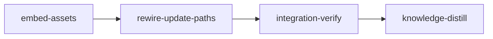

# Plan: Embed Loom's Installable Assets and Make `loom update` Complete

## Overview

Two gaps, one root cause. Loom's installable assets — agents, skills, commands, hooks,
`CLAUDE.md` — live in three places at once: files in the repo, copy loops in `install.sh`, and a
download-and-extract path in `loom self-update`. The three disagree. `loom self-update` refreshes
the binary, `~/.claude/CLAUDE.md`, `~/.claude/agents/` and `~/.claude/skills/` and nothing else:
hooks, slash commands and the codex-side assets are never updated. Codex gets almost nothing at
all — `install.sh` places one skill at `~/.codex/skills/pressure/` and loom ships no `AGENTS.md`
anywhere, so a codex session starts with no project doctrine unless `hooks/codex-forward.sh`
prepends it.

This plan makes the binary the single source of every installable asset. A build script embeds
`agents/`, `skills/`, `commands/`, `codex/skills/`, `CLAUDE.md.template` and a new
`AGENTS.md.template` the way `hooks/` is already embedded, a new `loom install-assets` command
places all of them into `~/.claude` and `~/.codex`, the update command re-executes the
freshly-installed binary on that command, and `install.sh` delegates to it instead of carrying its
own copy loops. The command is renamed `self-update` → `update` along the way: it no longer updates
only itself.

## Goals

- `loom update` — the renamed `self-update`, with no alias left behind — refreshes **every**
  installed asset: binary, hooks, agents, skills, slash commands, `~/.claude/CLAUDE.md`,
  `~/.codex/AGENTS.md`, the codex skills, `~/.claude/loom-install.toml`, the skill keyword index
  and any existing shell completions.
- Codex gets the same skill surface Claude Code gets — the recorded `core`/`all` layout, resident
  skills in `~/.codex/skills/` and the rest in `~/.codex/loom-skill-catalog/` — plus a
  codex-authored `~/.codex/AGENTS.md`.
- One definition of every asset. `install.sh` stops carrying per-asset copy loops, and the
  five-site hook registration checklist in `constants_tests.rs` loses two of its sites.
- **Non-goals:** `loom repair` is not taught to install assets (it keeps its existing hook-scripts
  repair); `install.sh`'s curl-pipe binary download is not given signature verification; no
  migration or compatibility shim is written for older installs (this project ships none).

## Verified ground

Everything below was read or executed against `main` at `b54dd824` before this plan was written.
The pressure-test round of 2026-09-03 re-verified every row against `f064beeb` (two later commits,
both outside the files this plan cites) and added the rows marked **(pressure)**.

| Claim | Evidence |
| --- | --- |
| `loom self-update` updates only binary, `CLAUDE.md`, agents, skills | `loom/src/commands/self_update/mod.rs` `execute` → `update_binary` + `update_config_files`; the latter handles `CLAUDE.md.template`, `agents.zip`, `skills.zip` and nothing else |
| The CLI subcommand is `self-update` today | `loom/src/cli/types.rs:170-171` (`SelfUpdate`), `loom --help`. This plan renames it to `update`; see "Naming" below |
| `self-update` is named in six places outside its own module | `README.md:272`, `loom/CONTRIBUTING.md:124` (whose path is already stale — the minisign key lives in `self_update/signature.rs`, not `self_update.rs`), `loom/src/update_check/mod.rs` (the notice string and `commands::self_update::get_latest_release`), `loom/src/update_check/tests.rs`, `loom/tests/integration/update_notice.rs`, `loom/src/commands/mod.rs:20` |
| The release publishes only binaries, `.minisig`, `SHA256SUMS.txt`, `CLAUDE.md.template`, `agents.zip`, `skills.zip` | `.github/workflows/release.yml:173-188, 264-267` |
| Hooks are already embedded in the binary and installed from it | `loom/src/fs/permissions/constants.rs:4-136` (`include_str!` per hook, `LOOM_HOOKS` table), `loom/src/fs/permissions/hooks.rs:38-70` (`install_loom_hooks`, `install_loom_hooks_to`) |
| Codex loads `~/.codex/AGENTS.md` **and** a cwd `AGENTS.md` into the model-visible prompt | probe: wrote a marker into each, ran `codex debug prompt-input "hi"` from a scratch dir, both markers present in the rendered input; probe file removed afterwards |
| Codex truncates a project doc at 32768 bytes by default | `project_doc_max_bytes = 32768` in the default config embedded in the codex 0.152.0 native binary |
| `CLAUDE.md.template` is 28,193 bytes | `wc -c CLAUDE.md.template` |
| Codex lists every resident skill's name and description in the session prompt | the `<skills_instructions>` developer message from the same `codex debug prompt-input` run; skill roots `r0 = ~/.codex/skills`, `r1 = ~/.agents/skills`, `r2 = ~/.codex/skills/.system` |
| Codex skills use the same `name:`/`description:` frontmatter loom's skills already carry | `head -8 ~/.codex/skills/rusure/SKILL.md` vs `head -8 skills/loom-plan-writer/SKILL.md` |
| `codex-forward.sh` accepts `gpt-5.6-sol`, `gpt-5.6-terra`, `gpt-5.6-luna` | `hooks/codex-forward.sh:16-22` |
| The codex plugin is installed at user scope | `claude plugin list --json` → `codex@openai-codex` 1.0.6, `"scope": "user"` |
| `skills/` holds 62 `loom-*` directories; `skills/core-skills.txt` names 9 core skills | `ls -d skills/loom-*/ \| wc -l`; the manifest's nine name lines |
| The `zip` crate and the checksum helpers are used **only** by `self_update`'s config-asset path | `rg 'ZipArchive\|parse_checksums\|verify_checksum' loom/src` returns hits in `self_update/` alone |
| Assets weigh 1.7 MB (`skills/`) + 36 KB (`agents/`) + 20 KB (`commands/`) + 20 KB (`codex/`) against a 26 MB release binary | `du -sh`, `ls -l ~/.local/bin/loom` |
| The maintainability gate is an exact ledger — growth **and** staleness both fail | `loom/tests/maintainability/baseline.rs:71-73, 185`; limits `FILE_LINE_LIMIT = 400`, `FUNCTION_LINE_LIMIT = 50` (`scanner.rs:6-7`) |
| `doc/loom/knowledge/` is populated and `loom knowledge sync` is clean | `INDEX.md` present, tier-2 directories present, `architecture.md` 41 `##` sections; `loom knowledge sync` → "Catalog already current" |
| **(pressure)** `loom/build.rs` already exists and must be EXTENDED, not created | committed by `02955c5a`/`652d024d`/`b3bb05ee`; it `include!`s `src/version/derive.rs` (`build.rs:8-11`), emits `LOOM_VERSION`/`LOOM_COMMIT`/`LOOM_BUILD_DATE`/`LOOM_TARGET` (`:26-29`) and owns `emit_rerun_keys`/`emit_if_exists` (`:74-103`); `self_update/mod.rs:40` pins `env!("LOOM_VERSION")`, so dropping an env var is a compile error |
| **(pressure)** `build.rs` is `std`-only — no directory-walk crate is available | `loom/Cargo.toml` has no `[build-dependencies]` section; `walkdir` is in `Cargo.lock` only transitively |
| **(pressure)** A post-swap `std::env::current_exe()` is a DELETED path on Linux | `self_update/install.rs:35-39,60`: the running binary is renamed onto a `NamedTempFile` backup, the new binary renamed into place, and the backup unlinked when the `TempPath` drops. `/proc/self/exe` follows the inode, so it resolves to `<backup> (deleted)`; `update_binary` computes the destination at `mod.rs:231` and returns `Result<()>` |
| **(pressure)** With no `loom-install.toml` and no catalog directory, `SkillLayout::read` infers `All` | `loom/src/skills/install_layout.rs:35-60` (`read` → `infer`); `install.sh:199-201` defaults to `core` |
| **(pressure)** `install.sh` has no `main()`-scope `loom_bin`; it is `local` in three functions | `install.sh:142,627,654,829`; `set -euo pipefail` at `:4` |
| **(pressure)** `apply_install_layout` has exactly one production caller, which stage 2 deletes | `self_update/mod.rs:328` (inside `update_config_files`); re-exported at `skills/mod.rs:37`. Under `Core` it moves ANY `loom-*` directory (`install_layout.rs:117-134`), embedded or not, and under `All` it `remove_dir_all`s the catalog (`:111`) |
| **(pressure)** `loom knowledge check --strict` exits 1 on the current tree | 679 pre-existing issues (tier-1 oversize, unresolvable source refs); plain `loom knowledge check` exits 0 |
| **(pressure)** A cold `cargo build --all-targets` in a fresh worktree exceeds the 300 s per-criterion ceiling | `verify/criteria/config.rs:11` `DEFAULT_COMMAND_TIMEOUT`, not overridable from the plan schema; no `sccache` on this machine; measured and recorded by `IN_PROGRESS-PLAN-release-versioning-config-and-loom-dir.md:175-183` |
| **(pressure)** Sandbox-sensitive tests self-skip; the full suite needs no `--skip` list | `loom/src/process/sandbox_probe.rs` (`skip_unless`, `process_tree_visible`, …) guards them; `mistakes/testing-and-lint.md` § "Sandbox-Sensitive Tests Carried a Skip List" |
| **(pressure)** The full suite runs ONCE, in integration-verify; standard stages scope their tests | `plan/schema/validation_suite.rs::is_full_suite_run` warns otherwise; `mistakes/testing-and-lint.md` § "The Same Suite Ran Once Per Stage" |
| **(pressure)** Acceptance criteria run under `sh -c` (dash), no `set -e`, no `pipefail`, `HOME`/`TMPDIR` forwarded | `verify/criteria/confine.rs:28`; `process/environment.rs:15-56` |
| **(pressure)** Goal-backward checks run AFTER acceptance; `wiring` is an unanchored regex over one exact path; markdown artifacts skip stub detection | `commands/stage/complete.rs:459-474`; `verify/goal_backward/wiring.rs:27-74`; `artifacts.rs:61-64` |
| **(pressure)** Four files this plan extends are at or near the 400-line cap | `commands/skill_index.rs` 396, `completions/install.rs` 372 (inline `mod tests` at `:356`), `cli/types.rs` 375, `update_check/mod.rs` 400 (no ledger entry: 400 does not exceed the limit) |
| **(pressure)** `python3 -c 'import yaml'` succeeds on this machine | used by the release-workflow parse criterion in stage 2 |
| **(pressure)** Cargo writes each build script's stdout to `loom/target/debug/build/loom-<hash>/output` | the `cargo:rerun-if-changed=` lines from today's `build.rs` are present there; the asset-root criteria read that file |
| **(pressure)** The sibling `IN_PROGRESS-PLAN-release-versioning-config-and-loom-dir.md` is fully merged but still prefixed | every declared artifact exists on `main` (`user_config/`, `commands/config/`, `build.rs`, `update_check/`, `SHA256SUMS.txt` at `self_update/mod.rs:67`); `.work/` holds no `config.toml` and an empty `stages/` |

### Observed baseline (repo root, `main` @ `b54dd824`)

Every command below was run before this plan existed and observed green:

| Command | Result |
| --- | --- |
| `cargo fmt --check --manifest-path loom/Cargo.toml` | exit 0 |
| `cargo build --all-targets --manifest-path loom/Cargo.toml` | ok |
| `cargo clippy --all-targets --manifest-path loom/Cargo.toml -- -D warnings` | ok, no warnings |
| `cargo test --all-targets --manifest-path loom/Cargo.toml` | 3449 passed / 1 ignored (lib) plus every integration target green; 0 failed anywhere |
| `cargo test --manifest-path loom/Cargo.toml --test maintainability` | 8 passed |
| `./scripts/check-hook-syntax.sh` | 85 shell scripts parse cleanly |
| `bunx markdownlint-cli2@0.23.2 ../codex/skills/pressure/SKILL.md` | 0 issues |
| `bunx markdownlint-cli2 $(git ls-files '*.md' ':!:loom/tests/fixtures/**')` | 0 issues in 147 files |

The pinned `markdownlint-cli2@0.23.2` resolves from bun's cache without the registry — verified by
running it with `BUN_CONFIG_REGISTRY=http://127.0.0.1:1` and again with `--prefer-offline`, both
green. Loom pre-grants the bun cache directory to every stage sandbox, so the markdown criteria do
not depend on network egress on a machine that has fetched that version once.
`registry.npmjs.org` stays in `allowed_domains` for the machine that has not.

**Red at baseline, excluded by a narrow filter:** an unfiltered
`bunx markdownlint-cli2 $(git ls-files '*.md')` reports 2 errors, both in deliberately malformed
test fixtures (`loom/tests/fixtures/knowledge/hierarchical/architecture/duplicate-headings.md:7`
MD024, `.../fenced-code.md:10` MD048). `.markdownlintignore` already lists `loom/tests/fixtures/`,
but markdownlint-cli2 does not apply ignores to files named explicitly on the command line, so
every markdown criterion in this plan carries the `':!:loom/tests/fixtures/**'` pathspec. Coverage
given up: none — those two files exist to be malformed.

### Criteria dry-run record

The four `install-assets` shell criteria assert facts about an artifact no stage has produced yet,
so the baseline rule cannot reach them: they are red at HEAD, and a criterion nobody has ever
executed is where a quoting or `mktemp` bug hides until it strands a finished stage. Each was
therefore run verbatim against hand-built fixtures — a stub `target/debug/loom` that creates the
expected tree, and stubs that break in exactly the way the criterion exists to catch:

| Criterion | good | no-op stub | codex-less stub | ignores core/catalog split | wipes the destination |
| --- | --- | --- | --- | --- | --- |
| C1 `<claude>` tree | 0 | 1 | — | — | — |
| C2 `<codex>` tree | 0 | — | 1 | — | — |
| C3 core/catalog split | 0 | 1 | — | 1 | — |
| C4 preservation | 0 | 0 | — | — | 1 |

C4 passing against a no-op stub is expected and harmless — a binary that writes nothing does
preserve everything, and C1 already fails that case. Every exit code above was observed, not
predicted.

**`working_dir` is `"."` for every stage**, not `"loom"`: this plan writes files on both sides of
the `loom/` package boundary (`AGENTS.md.template`, `install.sh`, `codex/`, `.github/`), and
`artifacts`/`wiring.source` resolve relative to `working_dir`. Cargo is reached with
`--manifest-path loom/Cargo.toml`, and the built binary as `loom/target/debug/loom`; all four forms
were baselined above.

The criteria added by the pressure test were parsed with `sh -n` and run against HEAD to confirm
each fails before its stage runs; they were not run against hand-built stubs the way C1-C4 were.

### Preflight — the operator does this before `loom run`

1. **Commit this plan and `doc/plans/briefs/embed-assets-self-update/` on `main`.** Both are
   untracked today. A stage worktree is `git worktree add -b loom/<id> … <base>`
   (`git/worktree/operations.rs:64-71`) and loom's scaffolding adds only the `.loom/work` symlink,
   `.claude/` and two `CLAUDE.md` symlinks (`:130-146`), so an untracked brief does not exist inside
   the worktree, and `hooks/worktree-file-guard.sh:334` blocks reading it from the main repo. Every
   worker is told "Your brief: `<path>`" and the integration-verify description reads the plan
   file by its committed name; both only work after this commit. The main-repo copy is renamed
   `IN_PROGRESS-…` at run start (`fs/plan_lifecycle.rs:218`); the worktree keeps the committed name.
2. **Rename the merged sibling to `DONE-PLAN-release-versioning-config-and-loom-dir.md`.** It is
   fully merged (see Verified ground) but still `IN_PROGRESS-`, and its `version-and-release` stage
   carries a wiring pin on `a\.name == "SHA256SUMS\.txt"` in `self_update/mod.rs` — a line stage 2
   of this plan deletes. Re-running it after this plan would fail for a reason nobody would connect
   here.
3. **Know the 300 s ceiling.** Every stage description below tells the agent to run
   `cargo build --all-targets` itself, early, so acceptance runs against a warm `loom/target/`.

## Design

### The asset table

`loom/build.rs` generates `$OUT_DIR/embedded_assets.rs`, which `loom/src/assets/mod.rs` pulls in
with `include!`. The generated file defines these, in exactly this shape:

```rust
pub type Asset = (&'static str, &'static str);   // (path relative to the group root, contents)

pub const CLAUDE_AGENTS: &[Asset];      // agents/**            e.g. ("loom-advisor.md", "...")
pub const CLAUDE_COMMANDS: &[Asset];    // commands/**          e.g. ("pressure.md", "...")
pub const SKILLS: &[Asset];             // skills/loom-*/**     e.g. ("loom-rust/SKILL.md", "...")
pub const CODEX_SKILLS: &[Asset];       // codex/skills/**      e.g. ("pressure/SKILL.md", "...")
pub const CLAUDE_MD_TEMPLATE: &str;     // CLAUDE.md.template
pub const AGENTS_MD_TEMPLATE: &str;     // AGENTS.md.template
```

Each row's contents come from an `include_str!` of an absolute path, so rustc tracks file contents
itself; `build.rs` additionally emits `cargo:rerun-if-changed=` for each source root so an added or
removed file regenerates the table. `skills/core-skills.txt` is a manifest, not a skill, and is
excluded from `SKILLS` — it is already `include_str!`-ed by `loom/src/skills/index_catalog.rs`.

**`loom/build.rs` already exists and is extended, never rewritten.** It derives the version
(`include!` of `src/version/derive.rs`, four `cargo:rustc-env` lines, `emit_rerun_keys`,
`emit_if_exists`); all of that stays byte-for-byte. The asset generator is one new function called
from `main()`, and it is **`std`-only**: `loom/Cargo.toml` has no `[build-dependencies]` section
and W1 owns no manifest, so the directory walk is a hand-rolled recursion over
`std::fs::read_dir`, not `walkdir`.

Selection rules the walk applies, so the generated file is deterministic and never embeds a
binary: skip any path component that starts with `.` and any component named `__pycache__`
(the working tree carries an untracked `skills/loom-md-tables/__pycache__/*.pyc`; `include_str!`
of a non-UTF-8 file is a compile error); for every surviving file, `panic!` naming the path if it
is not valid UTF-8; sort rows by key; keys use `/`. The walk reads the working tree, not the git
index, so a local build embeds whatever an operator has under `skills/loom-*/` — release binaries
are built by CI from a clean checkout, which is the reproducibility guarantee.

Three literals must appear in `build.rs` because the stage's wiring checks pin them there: the
group name `CLAUDE_AGENTS`, the generated file name `embedded_assets.rs`, and the source root
`codex/skills`. The `cargo:rerun-if-changed=` keys are proven from cargo's own record of the build
script's stdout, `loom/target/debug/build/loom-<hash>/output`, not from a grep over `build.rs`.

### Placement

`loom install-assets [--claude-dir <path>] [--codex-dir <path>] [--skills core|all]`, defaulting to
`~/.claude` and `~/.codex`. The skill layout resolves in this order, and `install_assets::execute`
owns the resolution (`SkillLayout::read` is not changed):

1. an explicit `--skills` flag;
2. otherwise, if `<claude>/loom-install.toml` is absent **and** `<claude>/skills` does not exist
   (a fresh tree), `Core` — the same default `install.sh` has always applied;
3. otherwise `SkillLayout::read(&claude)` (`loom/src/skills/install_layout.rs:35`): the recorded
   value, or, for a pre-`loom-install.toml` machine, `Core` when a catalog directory exists and
   `All` when it does not.

Without step 2 a bare `loom install-assets` on a clean machine would infer `All` from an empty
directory and install all 62 skills resident, which `install.sh` never did. It places:

| Asset | Destination |
| --- | --- |
| `CLAUDE_AGENTS` | `<claude>/agents/` |
| `CLAUDE_COMMANDS` | `<claude>/commands/` |
| hooks (`LOOM_HOOKS`) | `<claude>/hooks/loom/`, via the existing `install_loom_hooks_to` |
| `SKILLS`, core or `--skills all` | `<claude>/skills/<name>/` |
| `SKILLS`, non-core under `core` | `<claude>/loom-skill-catalog/<name>/` |
| `CLAUDE_MD_TEMPLATE` | `<claude>/CLAUDE.md`, with the timestamp header |
| codex skills, same core/catalog split | `<codex>/skills/<name>/`, `<codex>/loom-skill-catalog/<name>/` |
| `AGENTS_MD_TEMPLATE` | `<codex>/AGENTS.md`, with the timestamp header |
| the applied layout | `<claude>/loom-install.toml` |

The codex skill set is `SKILLS` with two substitutions: `loom-skills` comes from `CODEX_SKILLS`
(the codex-flavoured loader, which reads catalog files with `cat` rather than a Read tool), and
`pressure` from `CODEX_SKILLS` is always resident. Everything else follows the same
`is_core_skill` split the Claude side uses, so the two stay in lockstep by construction.

**The placer touches only what loom ships.** `install.sh` guarantees this today — a user's own
`~/.claude/skills/rust/`, a custom agent, a hand-written slash command all survive an install, and
`loom/src/fs/permissions/tests/constants_tests.rs` proves it by sourcing the script's bash
functions. Those functions disappear in stage 2, so the guarantee moves into `assets/install.rs`
and its tests: never remove a directory whose name is not an embedded skill name (a user's own
`loom-`-prefixed directory included), never remove an agent, command or hook file that is not an
embedded one, never clear a destination directory wholesale. The only removals are: the other-root
cleanup, scoped to the single skill being placed, by exact name; and, under `All`, the catalog
directory itself **only if it is empty** once every embedded skill has moved out.

**`apply_install_layout` is not called by the placer and is retired in stage 2.** Its `Core` branch
moves ANY `loom-*` directory into the catalog (`install_layout.rs:117-134`), embedded or not, and
its `All` branch `remove_dir_all`s the catalog (`:111`) — both contradict the invariant above, and
the placer's own per-skill split already does the job. Its single production caller is
`update_config_files` (`self_update/mod.rs:328`), which stage 2 deletes, so stage 2 also deletes
`apply_install_layout`, its helpers and tests in `install_layout.rs` and its re-export in
`skills/mod.rs`; `SkillLayout` and `SkillLayout::read` stay.

**What is deliberately not cleaned up.** An asset loom stops shipping in a later release — a
removed skill, agent, command or hook — stays on the machine; `install_loom_hooks_to` has never
pruned (`fs/permissions/hooks.rs:52-72`) and the placer inherits that. A file inside a shipped
skill directory that loom no longer ships (`~/.claude/skills/loom-plan-writer/stale.md`) also
stays. Recording the decision here is what stops a later reader from filing either as a defect.

**Backups.** Before overwriting `CLAUDE.md` or `AGENTS.md` with different content, the previous
file moves to `<dest>.bak.<UTC %Y%m%d-%H%M%S>` and, before that, every older `<dest>.bak.*` loom
wrote is deleted — at most one backup per file survives. `install.sh`'s interactive
`cleanup_backups` goes with the copy loops, so this cap is the only thing keeping `~/.claude` from
accumulating one file per update. The header is the Rust form,
`# claude-loom | updated <UTC %Y-%m-%d %H:%M:%S>` between two box-drawing rule lines; a fresh
install therefore stamps `updated`, not `install.sh`'s old `installed`.

**Module layout is pinned.** `loom/src/assets/install.rs` stays the module root (the edition-2021
sibling layout, `install.rs` + `install/claude.rs` + `install/codex.rs`; never `install/mod.rs`),
stays under 400 lines, and holds the call sites for `install_loom_hooks_to`,
`crate::assets::AGENTS_MD_TEMPLATE`, `crate::assets::CODEX_SKILLS`,
`skill_index::execute_in_claude_dir` and `completions::install::refresh_existing_in`. The artifact
entry and five wiring checks read that exact file, and integration-verify replays every stage's
wiring; a split that moves those call sites into a submodule fails a correct implementation.

**What runs beyond the two directories.** The skill keyword index is rebuilt on every run — it
writes `<claude>/hooks/loom/skill-keywords.json`, inside the tree the caller named, so tests can
drive it. Shell completions are refreshed only when the operator passed neither `--claude-dir`
nor `--codex-dir`, because the completion files live outside both trees;
`install_all(paths, layout, refresh_completions: bool)` takes that decision as an argument and
`install_assets::execute` computes it from the flags, so the branch is unit-testable with
`false` and the write hazard never reaches a test.

### Re-exec

The update command verifies the minisign signature, swaps the binary, then re-executes the binary
**at the path it was just installed to** with `install-assets`. The running process holds the
**old** embedded assets, so it must not place them itself — the new binary on disk is the only
correct source. When the installed version is already the latest, the command still runs the
asset install: the assets are embedded in the running binary, so the pass is free, idempotent, and
repairs a partial install.

**The path is captured before the swap; a fresh `env::current_exe()` after it is wrong on Linux.**
`install_binary` (`self_update/install.rs:35-60`) renames the running binary onto a `NamedTempFile`
backup, renames the staged binary into place, and unlinks the backup when its `TempPath` drops.
`/proc/self/exe` follows the inode, so after that a fresh `std::env::current_exe()` returns
`<backup> (deleted)` and `Command::new` on it fails with ENOENT — after the binary has already been
replaced, and only on Linux (macOS returns the launch path string, so the defect is invisible
there). The shape that avoids it:

```rust
/// Returns the path the new binary now occupies — the same PathBuf that was
/// handed to `install_binary`, captured before the swap. Never call
/// `env::current_exe()` after the swap: on Linux it names a deleted inode.
fn update_binary(release: &Release) -> Result<PathBuf>;

/// Re-executes `exe install-assets`; spawn failure and non-zero exit are
/// distinguishable errors that name `exe`.
fn run_asset_install(exe: &Path) -> Result<()>;
```

`execute()` has ONE call to `run_asset_install`, after the version comparison, so both branches
reach it by construction and no test has to prove "both branches":

```rust
let exe = if latest_version <= current {
    println!("… already latest; refreshing installed assets");
    env::current_exe()?          // no swap happened; the running file is still on disk
} else {
    update_binary(&latest)?      // the installed path, captured before the swap
};
run_asset_install(&exe)
```

Failure contract: if `run_asset_install` fails after a successful swap, `loom update` exits
non-zero with a message that names the path, states that the binary was updated but the assets
were not, and tells the operator to run `loom install-assets`. Before reporting success on the
update path, `run_asset_install`'s caller runs `<exe> --version` and checks that the output names
the new release's version — the only proof the re-executed file is the new binary. The re-exec
passes no flags: the new binary resolves the layout from `loom-install.toml` exactly as a direct
`loom install-assets` would. `update_check`'s `update-state.json` is untouched; only its notice
string changes spelling.

Because assets now travel inside a signature-verified binary, the config-asset download path goes
away entirely: `agents.zip`, `skills.zip` and `CLAUDE.md.template` stop being release assets, and
with them go `self_update/zip.rs`, `download_verify_and_extract_zip`, `parse_checksums`,
`verify_checksum` and the `zip` dependency. This is a net security gain, not a loss — a sha256 row
in an unsigned `SHA256SUMS.txt` served from the same host was strictly weaker than the minisign
signature that now covers the same bytes. `SHA256SUMS.txt` keeps being published for humans.

### Naming: `update`, and nothing else

`self-update` becomes `update`. One name, no alias — an alias would leave two spellings of one
command in `--help`, in completions and in every document that has to pick one. The short form
wins because the command stops being self-referential here: after this plan it refreshes hooks,
agents, skills, slash commands and two doctrine files as well as the binary, so "self" names the
smallest thing it does. This is an unreleased project, so nothing carries the old spelling forward.

The rename is a **CLI-surface** change: `Commands::SelfUpdate` → `Commands::Update`, its dispatch
arm, the `update_check` notice text and the two tests pinning that string, plus every site that
names the old spelling. The table above under-counted them; the full set at HEAD, outside the
module itself, is:

| Site | What it is | Owner |
| --- | --- | --- |
| `README.md:272` | the command line in "Other Commands" | WB3 |
| `loom/CONTRIBUTING.md:124` | reads `src/commands/self_update.rs:18` — underscore, so a `self-update` grep never sees it; the path is also stale (the constant is `self_update/signature.rs::MINISIGN_PUBLIC_KEY`) | WB3 |
| `loom/src/update_check/mod.rs:2,97` | doc comment and the notice string | WB1 |
| `loom/src/update_check/tests.rs:76`, `loom/tests/integration/update_notice.rs:66,72` | assertions pinning the notice | WB1 |
| `loom/src/commands/init/execute.rs:169` | the printed hint "Run install.sh or loom self-update to install loom rules." — a user-facing straggler | WB1 |
| `loom/src/skills/install_layout.rs:2,6,65` | three doc comments describing the retired zip flow | WB3 |
| `hooks/codex-forward.sh:32-33` | the comment "loom ships no AGENTS.md", false after stage 1 | WB5 |
| `loom/src/commands/mod.rs:20` | `pub mod self_update;` — stays; the module keeps its name | — |

The module keeps its name — `commands::self_update` is an accurate internal description of the
code that replaces loom's own binary, it sits next to `update_check` which would otherwise be easy
to misread, and renaming the directory would churn `maintainability-baseline.txt` path entries for
nothing. Its module doc gains one line saying which CLI name it serves. `client.rs:26`'s HTTP user
agent `loom-self-update` is inside the module and is left alone. The gate that proves the rename
is a repository-wide grep that excludes only the module directory and the archived documentation
tree — not a grep over two markdown files.

### The write hazard, stated once

`loom install-assets` with no flags writes the operator's real `~/.claude` and `~/.codex`. **No
task, test or acceptance criterion in this plan may invoke it that way.** Every criterion passes
both `--claude-dir` and `--codex-dir` under `$TMPDIR`; every test uses `TempDir` and the
`*_to`/`*_in` forms, never the no-argument `install_loom_hooks()` or `skill_index::execute()`.
Two existing helpers resolve `~` internally and must gain directory-taking forms before
`install-assets` can call them safely: `skill_index::execute_in_home` (private,
`loom/src/commands/skill_index.rs:55`) becomes `pub fn execute_in_claude_dir(claude_dir: &Path,
verbose: bool)` with `execute_in_home` delegating; and completions refresh
(`loom/src/completions/install.rs`, which resolves `$HOME` through its own `home_dir()` at `:18`)
gains `pub fn refresh_existing_in(home: &Path) -> Result<usize>` with a no-argument
`refresh_existing()` wrapper. Tests drive the `_in`/`_dir` forms against a `TempDir`; a no-argument
form never appears in a test. The skill index runs on every placement (it writes inside
`<claude>`); the completion files are refreshed only when the operator passed no directory flag.

### Size ceilings on files this plan extends

The maintainability gate (`cargo test --test maintainability`) is an exact ledger with a 400-line
file cap and a 50-line function cap; it fails on growth **and** on shrinkage of a recorded entry,
and a file that crosses 400 lines with no entry is a new violation. Existing files this plan
touches, measured at HEAD:

| File | Lines | Headroom | Rule |
| --- | --- | --- | --- |
| `loom/src/commands/skill_index.rs` | 396 | 4 | W2 renames `execute_in_home` into `execute_in_claude_dir` in place and re-points the two callers, adding no net lines; the new test goes in the existing `skill_index/tests.rs` (already a `#[path]` child, `skill_index.rs:394-396`) |
| `loom/src/completions/install.rs` | 372 | 28, but `mod tests` is inline at `:356` | W2 first moves the inline test module to `completions/install/tests.rs` via `#[cfg(test)] #[path = "install/tests.rs"] mod tests;`, then adds `refresh_existing_in` and its two tests there |
| `loom/src/cli/types.rs` | 375 | 25 | W3's variant is three flags with one-line doc comments, no blank-line padding |
| `loom/src/update_check/mod.rs` | 400 | 0 | WB1 changes the notice string and doc comments without adding a line; if rustfmt rewraps, shorten the sentence |
| `loom/src/completions/install.rs::install` | ledger 52 | exact | untouched by W2; do not reflow it |
| `loom/src/cli/dispatch.rs::dispatch` | ledger 119 | exact | grows by W3's arm; the orchestrator sets the new exact value |
| `loom/src/commands/self_update/mod.rs::update_binary` | ledger 63 | exact | changes shape in stage 2 (returns the path); the orchestrator sets the new exact value or deletes the entry if it drops under 50 |

**The orchestrator reconciles the ledger after every worker has landed, in both directions.** No
worker edits `loom/maintainability-baseline.txt`; each reports the numbers the gate prints. A
worker that must add code to a file with no headroom splits it into a sibling submodule (the
`<name>.rs` + `<name>/` layout, never `<name>/mod.rs`) rather than adding a ledger entry.

### Verification gate, warm builds and the 300-second ceiling

Every acceptance criterion runs under a hard 300 s ceiling (`verify/criteria/config.rs:11`, not
overridable from the plan). A stage worktree starts with no `loom/target/`, this tree builds 409
packages including five tree-sitter grammars, and no `sccache` is installed, so a **cold**
`cargo build --all-targets` exceeds the ceiling and the criterion fails reporting a timeout that
reads as a hang. Every stage description therefore instructs the agent to run
`cargo build --all-targets --manifest-path loom/Cargo.toml` itself, early, so every later cargo
criterion runs warm.

The repository's canonical gate (`loom/.githooks/pre-push`) is fmt, build, clippy, the rustdoc
lint `RUSTDOCFLAGS="-D warnings" cargo doc --workspace --all-features --no-deps`, and
`cargo test --all-targets --no-fail-fast`. Per this repository's recorded doctrine
(`mistakes/testing-and-lint.md`, "The Same Suite Ran Once Per Stage"; `loom plan verify` warns
otherwise), the full test run happens **once, in integration-verify**, and the standard stages run
name-filtered tests; the pressure test kept that split. What it added: the rustdoc lint to every
code stage (CI's docs job runs it and no other local check does — it has blocked three pushes),
`--no-fail-fast` on the one full run, and the caveat that the stage-finalisation tests in
`commands/stage/tests/complete.rs` read `LOOM_STAGE_ID`/`LOOM_SESSION_ID` from the ambient
environment: a red run of those from inside a stage session is re-run with
`env -u LOOM_STAGE_ID -u LOOM_SESSION_ID` before anything else is concluded. Sandbox-sensitive
tests self-skip through `process/sandbox_probe.rs`; no criterion in this plan carries a `--skip`
list and none may be added.

Two spawn-time facts for the codex lane: the Bash tool's maximum timeout is **600000 ms**, so a
foreground `loom-codex-forwarder` spawn states `600000`, not the 900000 the plan-writer skill
still names; and `subagent_timeout_secs: 900` is advisory signal text — the monitor's hung
threshold stays `DEFAULT_HUNG_TIMEOUT_SECS = 300` (`orchestrator/monitor/heartbeat.rs:22`), so a
long codex run produces an "appears hung" line in `loom status` that the orchestrator must not act
on.

## Execution Diagram



## Stages

**No `knowledge-bootstrap` stage.** `doc/loom/knowledge/` is already hierarchical and populated —
`INDEX.md` exists, `architecture.md` alone carries 41 `##` sections, and `loom knowledge sync`
reports "Catalog already current". The skill's skip condition is met.

### 1. `embed-assets` — embed every asset and add `loom install-assets`

Extends the existing build script with the asset table, and creates the placement module, the
CLI command, the codex skill loader and `AGENTS.md.template`. Four workers over disjoint
territories; the exact `loom/src/assets/mod.rs` surface is written into this plan so no runtime
foundation step is needed. The orchestrator, not a worker, reconciles
`loom/maintainability-baseline.txt` once all four have landed.

### 2. `rewire-update-paths` — point `self-update`, `install.sh` and the release at it

Rewrites `self_update` around the re-exec, deletes the zip path and its dependency, replaces
`install.sh`'s copy loops with one delegation call, trims the release workflow, replaces the
install.sh/`LOOM_HOOKS` drift test with one that drives the delegation through a stub binary,
retires `apply_install_layout` (its only caller goes with the zip path), and sweeps every
remaining `self-update` spelling, including the `loom init` hint and a stale hook comment. Five
workers: four on the codex lane and one Claude sonnet worker for the comment-only edit in
`hooks/codex-forward.sh`, a directory the Claude Code sandbox write-protects against shell writes
(`concerns/sandbox-protected-hooks-dir.md`), so it must be edited with the Edit tool.

**Stage Necessity (Q3):** this stage is separate from `embed-assets` because both `install.sh` and
`self-update` become thin callers of `loom install-assets` — if that command places files wrongly,
their own tests (which assert the invocation, not its effects) still pass, and the defect surfaces
only on a user's machine. Gating on a merged, verified `embed-assets` is what makes the delegation
safe. Q1 also applies: `install.sh` must be rewritten against a `loom` binary that actually has the
subcommand.

**Shared file, serialised by the DAG:** both stages edit `loom/maintainability-baseline.txt`
(stage 1 raises the `dispatch` entry, stage 2 removes the `self_update` entries). The dependency
edge serialises the worktrees, so there is no conflict — but stage 2 must **re-read** the file
rather than trust any line number in this plan.

### 3. Integration Verification

Full gate, parallel review subagents, and a functional proof that `loom update` reaches
`install-assets` and that `install-assets` populates both trees.

### 4. Knowledge Distillation

Curate stage memories; update `README.md` and `loom/CONTRIBUTING.md` for the changed install and
update behaviour (the README command table gains `loom install-assets`); correct the four
current-state knowledge files that still describe `loom self-update` and the zip flow.

---

<!-- loom METADATA -->

```yaml
loom:
  version: 1
  sandbox:
    enabled: true
    auto_allow: true
    filesystem:
      # deny_read/deny_write are deliberately NOT set: naming `deny_read` replaces the
      # default list wholesale (models/stage/types.rs:388-425 supplies the four credential
      # globs plus the daemon-token and parent-traversal carve-outs), so the earlier explicit
      # list dropped ten entries.
      allow_write:
        - "loom/**"
        - "install.sh"
        - "AGENTS.md.template"
        - "codex/**"
        - ".github/workflows/**"
        - "README.md"
        - "hooks/codex-forward.sh"
    network:
      allowed_domains:
        - "crates.io"
        - "static.crates.io"
        - "index.crates.io"
        - "registry.npmjs.org"
      allow_local_binding: false
      allow_unix_sockets: []

  stages:
    - id: embed-assets
      name: "Embed Installable Assets and Add loom install-assets"
      stage_type: standard
      model: "opus"
      reasoning_effort: "high"
      implementers: ["codex", "claude"]
      subagent_timeout_secs: 900
      description: |
        Embed every installable asset in the loom binary and add the command that places them.
        Use parallel subagents and skills to maximize performance.

        WHY: hooks are already embedded (fs/permissions/constants.rs LOOM_HOOKS) and installed
        from the binary; agents, skills, commands, CLAUDE.md.template and the codex assets are
        not. That asymmetry is why loom self-update cannot refresh them and why install.sh must
        carry duplicate copy loops.

        WRITE HAZARD - READ FIRST. `loom install-assets` with no flags writes the operator's real
        ~/.claude and ~/.codex. NO task, test or check in this stage may invoke it that way. Every
        invocation passes BOTH --claude-dir and --codex-dir under $TMPDIR. Every test uses TempDir
        and the directory-taking forms; never call install_loom_hooks() or skill_index::execute()
        (the no-argument forms resolve the real home).

        Territories below are DISJOINT. Workers NEVER spawn subagents. Spawn every worker BY AGENT
        TYPE, ALL in ONE message, each with the fixed prompt plus
        "Your brief: <path>. Read it in full before anything else."

        Codex workers are spawned as `loom-codex-forwarder` subagents in the FOREGROUND, with an
        explicit Bash timeout of 600000 ms (the Bash tool's maximum; the plan-writer skill's
        900000 exceeds it), `--effort xhigh`, and the tier named in the table. Tell every codex
        worker NOT to run git at all, and check `git status --short` after each codex run returns.
        A codex run longer than 300 s makes `loom status` print "appears hung" - that line is
        advisory (`DEFAULT_HUNG_TIMEOUT_SECS`); judge liveness by `loom subagents`, not by it.

        BUILD WARM FIRST. Acceptance criteria run under a hard 300 s ceiling and a fresh worktree
        has no loom/target/. Before anything else, run
        `cargo build --all-targets --manifest-path loom/Cargo.toml` yourself so every later cargo
        criterion runs against a warm target directory; a cold build exceeds the ceiling and fails
        as a timeout that reads like a hang.

        | Worker | Role | Tier | Files owned | Shared context | Brief path |
        | ------ | ---- | ---- | ----------- | -------------- | ---------- |
        | W1 | Asset table | codex gpt-5.6-terra | loom/build.rs, loom/src/assets/mod.rs | loom/src/fs/permissions/constants.rs (read-only) | doc/plans/briefs/embed-assets-self-update/embed-assets/w1-asset-table.md |
        | W2 | Placement logic | codex gpt-5.6-terra | loom/src/assets/install.rs, loom/src/assets/install/** (new submodules), loom/src/assets/tests.rs, loom/src/skills/mod.rs, loom/src/commands/skill_index.rs, loom/src/commands/skill_index/tests.rs, loom/src/completions/install.rs, loom/src/completions/install/tests.rs (new; the inline test module moves here) | loom/src/skills/install_layout.rs, loom/src/skills/index_catalog.rs, loom/src/fs/permissions/hooks.rs (read-only) | doc/plans/briefs/embed-assets-self-update/embed-assets/w2-placement.md |
        | W3 | CLI wiring + codex loader | codex gpt-5.6-luna | loom/src/commands/install_assets.rs, loom/src/commands/mod.rs, loom/src/cli/types.rs, loom/src/cli/dispatch.rs, loom/src/lib.rs, codex/skills/loom-skills/SKILL.md | skills/loom-skills/SKILL.md (read-only) | doc/plans/briefs/embed-assets-self-update/embed-assets/w3-cli-and-codex-loader.md |
        | W4 | AGENTS.md doctrine | codex gpt-5.6-sol | AGENTS.md.template | hooks/codex-forward.sh, CLAUDE.md.template (read-only) | doc/plans/briefs/embed-assets-self-update/embed-assets/w4-agents-md.md |

        W4 is the one slice on the top codex tier: it is doctrine authoring, and the document is
        addressed to codex, so a codex session judges its own reading of it better than a Claude
        one would. Everything else is mechanical enough for terra or luna.

        BUILD COUPLING - W1 CANNOT COMPILE WITHOUT W4. The generated asset table `include_str!`s
        AGENTS.md.template, which W4 writes. The two workers touch different files, so this is not
        a race, but nothing in this stage builds until W4's file exists, and a missing one fails as
        a compile error rather than a bad install. If W4 returns without writing the file, RE-SPAWN
        it (subagents are one-shot; brief the fresh one with the previous report) before running the
        gate. Do not stub the template to make the build pass - a placeholder would ship as global
        codex doctrine.

        SIZE CONSTRAINT: the maintainability gate is an exact ledger with a 400-line file limit and
        a 50-line function limit. Every NEW file must stay under both so it needs no ledger entry;
        split into submodules rather than record new debt. Three EXISTING files this stage extends
        are nearly full and carry no ledger entry: commands/skill_index.rs is at 396 (W2 renames
        execute_in_home into execute_in_claude_dir in place, adding no net lines),
        completions/install.rs is at 372 with its test module inline (W2 moves that module to
        completions/install/tests.rs via `#[cfg(test)] #[path = "install/tests.rs"] mod tests;`
        BEFORE adding refresh_existing_in), and cli/types.rs is at 375 (W3's variant is three
        flags with one-line doc comments). See the plan's "Size ceilings" table.

        LEDGER: NO worker edits loom/maintainability-baseline.txt. The orchestrator reconciles it
        after all four workers have landed and the crate builds - `function src/cli/dispatch.rs
        dispatch 119` grows by W3's arm; set it to the exact value the test reports, and lower or
        delete any entry the test says shrank.

        MODULE LAYOUT: loom/src/assets/install.rs stays the module root (sibling layout,
        install.rs + install/claude.rs + install/codex.rs; NEVER install/mod.rs) and holds the call
        sites the wiring checks pin: install_loom_hooks_to, crate::assets::AGENTS_MD_TEMPLATE,
        crate::assets::CODEX_SKILLS, skill_index::execute_in_claude_dir and
        completions::install::refresh_existing_in.

        LAYOUT DEFAULT: install_assets::execute resolves --skills > (fresh tree: no
        loom-install.toml AND no <claude>/skills -> Core) > SkillLayout::read. The placer does NOT
        call apply_install_layout; stage 2 deletes it.

        VERIFY AND COMMIT YOURSELF. Run the full acceptance list, fix everything it reports, then
        run the mini adversarial code review, fix its findings, re-verify, and commit.

        MEMORY: record mistakes, decisions and surprises via loom memory immediately. NEVER loom
        knowledge (this is an implementation stage). NEVER Claude Code auto-memory.
      dependencies: []
      acceptance:
        - "cargo fmt --check --manifest-path loom/Cargo.toml"
        - "cargo build --all-targets --manifest-path loom/Cargo.toml"
        - "cargo clippy --all-targets --manifest-path loom/Cargo.toml -- -D warnings"
        - 'RUSTDOCFLAGS="-D warnings" cargo doc --workspace --all-features --no-deps --manifest-path loom/Cargo.toml'
        - "cargo test --manifest-path loom/Cargo.toml --lib assets::"
        - 'cargo test --manifest-path loom/Cargo.toml --lib assets:: 2>&1 | rg -q "test result: ok\. [1-9][0-9]* passed"'
        - 'cargo test --manifest-path loom/Cargo.toml --lib assets:: -- --list 2>/dev/null | rg -q "codex_loader_differs_from_claude_loader"'
        - 'cargo test --manifest-path loom/Cargo.toml --lib assets:: -- --list 2>/dev/null | rg -q "reinstall_is_idempotent"'
        - 'cargo test --manifest-path loom/Cargo.toml --lib assets:: -- --list 2>/dev/null | rg -q "user_owned_assets_survive"'
        - 'cargo test --manifest-path loom/Cargo.toml --lib assets:: -- --list 2>/dev/null | rg -q "all_after_core_moves_catalogued_skill_back"'
        - "cargo test --manifest-path loom/Cargo.toml --lib skills::"
        - "cargo test --manifest-path loom/Cargo.toml --lib commands::skill_index::"
        - "cargo test --manifest-path loom/Cargo.toml --lib completions::"
        - 'cargo test --manifest-path loom/Cargo.toml --lib completions:: -- --list 2>/dev/null | rg -q "refresh_existing_in"'
        - "cargo test --manifest-path loom/Cargo.toml --test maintainability"
        - '[ "$(wc -c < AGENTS.md.template)" -le 12288 ]'
        - 'rg -q "cargo:rerun-if-changed=.*/codex/skills$" loom/target/debug/build/loom-*/output'
        - 'rg -q "cargo:rerun-if-changed=.*/AGENTS\.md\.template$" loom/target/debug/build/loom-*/output'
        - "loom/target/debug/loom install-assets --help"
        - 'H=$(mktemp -d "${TMPDIR:-/tmp}/loomassets.XXXXXX") && [ -n "$H" ] && loom/target/debug/loom install-assets --claude-dir "$H/claude" --codex-dir "$H/codex" --skills core && test -f "$H/claude/CLAUDE.md" && rg -q "claude-loom \| updated" "$H/claude/CLAUDE.md" && test -f "$H/claude/agents/loom-software-engineer.md" && test -x "$H/claude/hooks/loom/post-tool-use.sh" && test -f "$H/claude/commands/pressure.md" && rg -q ''^skills = "core"'' "$H/claude/loom-install.toml"'
        - 'H=$(mktemp -d "${TMPDIR:-/tmp}/loomcodex.XXXXXX") && [ -n "$H" ] && loom/target/debug/loom install-assets --claude-dir "$H/claude" --codex-dir "$H/codex" --skills core && test -f "$H/codex/AGENTS.md" && rg -q "claude-loom \| updated" "$H/codex/AGENTS.md" && test -f "$H/codex/skills/loom-skills/SKILL.md" && ! diff -q "$H/codex/skills/loom-skills/SKILL.md" skills/loom-skills/SKILL.md >/dev/null && rg -qF "~/.codex/loom-skill-catalog" "$H/codex/skills/loom-skills/SKILL.md" && test -f "$H/codex/skills/pressure/SKILL.md" && test -f "$H/codex/loom-skill-catalog/loom-rust/SKILL.md"'
        - 'H=$(mktemp -d "${TMPDIR:-/tmp}/loomsplit.XXXXXX") && [ -n "$H" ] && mkdir -p "$H/claude/loom-skill-catalog/loom-plan-writer" "$H/codex/loom-skill-catalog/loom-skills" && touch "$H/claude/loom-skill-catalog/loom-plan-writer/SKILL.md" "$H/codex/loom-skill-catalog/loom-skills/SKILL.md" && loom/target/debug/loom install-assets --claude-dir "$H/claude" --codex-dir "$H/codex" --skills core && test -f "$H/claude/skills/loom-plan-writer/SKILL.md" && test ! -e "$H/claude/loom-skill-catalog/loom-plan-writer" && test ! -e "$H/codex/loom-skill-catalog/loom-skills" && test -f "$H/claude/loom-skill-catalog/loom-rust/SKILL.md" && test -f "$H/claude/loom-skill-catalog/loom-md-tables/fix-md-tables.py" && test ! -e "$H/claude/skills/loom-rust"'
        - 'H=$(mktemp -d "${TMPDIR:-/tmp}/loomkeep.XXXXXX") && [ -n "$H" ] && mkdir -p "$H/claude/skills/rust" "$H/claude/skills/loom-mine" "$H/claude/agents" "$H/claude/commands" "$H/codex/skills/my-codex-skill" && touch "$H/claude/skills/rust/SKILL.md" "$H/claude/skills/loom-mine/SKILL.md" "$H/claude/agents/my-agent.md" "$H/claude/commands/my-cmd.md" "$H/codex/skills/my-codex-skill/SKILL.md" && loom/target/debug/loom install-assets --claude-dir "$H/claude" --codex-dir "$H/codex" --skills core && test -f "$H/claude/skills/rust/SKILL.md" && test -f "$H/claude/skills/loom-mine/SKILL.md" && test -f "$H/claude/agents/my-agent.md" && test -f "$H/claude/commands/my-cmd.md" && test -f "$H/codex/skills/my-codex-skill/SKILL.md"'
        - 'H=$(mktemp -d "${TMPDIR:-/tmp}/loomall.XXXXXX") && [ -n "$H" ] && loom/target/debug/loom install-assets --claude-dir "$H/claude" --codex-dir "$H/codex" --skills all && rg -q ''^skills = "all"'' "$H/claude/loom-install.toml" && test -f "$H/claude/skills/loom-rust/SKILL.md" && test ! -e "$H/claude/loom-skill-catalog" && test -f "$H/codex/skills/loom-rust/SKILL.md" && test ! -e "$H/codex/loom-skill-catalog" && test -f "$H/codex/skills/pressure/SKILL.md"'
        - 'H=$(mktemp -d "${TMPDIR:-/tmp}/loomfresh.XXXXXX") && [ -n "$H" ] && loom/target/debug/loom install-assets --claude-dir "$H/claude" --codex-dir "$H/codex" && rg -q ''^skills = "core"'' "$H/claude/loom-install.toml" && test -f "$H/claude/loom-skill-catalog/loom-rust/SKILL.md" && test ! -e "$H/claude/skills/loom-rust"'
        - 'H=$(mktemp -d "${TMPDIR:-/tmp}/loomidem.XXXXXX") && [ -n "$H" ] && loom/target/debug/loom install-assets --claude-dir "$H/a/claude" --codex-dir "$H/a/codex" --skills core && cp -a "$H/a" "$H/b" && loom/target/debug/loom install-assets --claude-dir "$H/b/claude" --codex-dir "$H/b/codex" --skills core && diff -r "$H/a" "$H/b" && ! rg --files "$H" | rg -q "\.bak\."'
        - 'bunx markdownlint-cli2@0.23.2 codex/skills/loom-skills/SKILL.md'
      files:
        - "loom/build.rs"
        - "loom/src/assets/**"
        - "loom/src/skills/mod.rs"
        - "loom/src/commands/install_assets.rs"
        - "loom/src/commands/mod.rs"
        - "loom/src/commands/skill_index.rs"
        - "loom/src/commands/skill_index/tests.rs"
        - "loom/src/completions/install.rs"
        - "loom/src/completions/install/tests.rs"
        - "loom/src/cli/types.rs"
        - "loom/src/cli/dispatch.rs"
        - "loom/src/lib.rs"
        - "loom/maintainability-baseline.txt"
        - "AGENTS.md.template"
        - "codex/skills/loom-skills/SKILL.md"
      working_dir: "."
      artifacts:
        - "loom/build.rs"
        - "loom/src/assets/mod.rs"
        - "loom/src/assets/install.rs"
        - "loom/src/commands/install_assets.rs"
        - "AGENTS.md.template"
        - "codex/skills/loom-skills/SKILL.md"
      wiring:
        - source: "loom/src/cli/dispatch.rs"
          pattern: 'Commands::InstallAssets\s*\{[^}]*\}\s*=>\s*install_assets::execute\('
          description: "install-assets is dispatched from the match arm, not merely mentioned"
        - source: "loom/src/assets/mod.rs"
          pattern: 'include!\(concat!\(env!\("OUT_DIR"\),\s*"/embedded_assets\.rs"\)\)'
          description: "The generated asset table is pulled into the crate"
        - source: "loom/build.rs"
          pattern: "CLAUDE_AGENTS"
          description: "build.rs emits the asset table, not only the version env vars (the file pre-exists, so the artifact check alone proves nothing)"
        - source: "loom/build.rs"
          pattern: 'embedded_assets\.rs'
          description: "build.rs writes the generated table file"
        - source: "loom/build.rs"
          pattern: "codex/skills"
          description: "The codex skill root is one of the walked source roots"
        - source: "loom/src/assets/install.rs"
          pattern: 'install_loom_hooks_to\('
          description: "Hook placement goes through the existing installer, not a second copy"
        - source: "loom/src/assets/install.rs"
          pattern: 'crate::assets::AGENTS_MD_TEMPLATE'
          description: "The codex doctrine template is consumed, not merely embedded"
        - source: "loom/src/assets/install.rs"
          pattern: 'crate::assets::CODEX_SKILLS'
          description: "The codex skill set is consumed by the placer"
        - source: "loom/src/assets/install.rs"
          pattern: 'skill_index::execute_in_claude_dir\('
          description: "The placer rebuilds the skill keyword index"
        - source: "loom/src/assets/install.rs"
          pattern: 'completions::install::refresh_existing_in\('
          description: "The placer refreshes shell completions that already exist, through the directory-taking form"
      wiring_tests:
        - name: "install-assets is a registered subcommand"
          command: "loom/target/debug/loom install-assets --help"
          success_criteria:
            exit_code: 0
      before_stage:
        - command: "test -f AGENTS.md.template"
          exit_code: 1
          description: "The codex doctrine template does not exist yet"
        - command: "test -f codex/skills/loom-skills/SKILL.md"
          exit_code: 1
          description: "The codex skills loader does not exist yet"
        - command: 'rg -q "install_assets" loom/src/cli/dispatch.rs'
          exit_code: 1
          description: "The CLI has no install-assets dispatch arm yet"
      after_stage:
        - command: "test -f AGENTS.md.template"
          exit_code: 0
          description: "The codex doctrine template exists"
        - command: "test -f codex/skills/loom-skills/SKILL.md"
          exit_code: 0
          description: "The codex skills loader exists"
        - command: 'rg -q "Commands::InstallAssets" loom/src/cli/dispatch.rs'
          exit_code: 0
          description: "install-assets is reachable from CLI dispatch"

    - id: rewire-update-paths
      name: "Rename to loom update, Rewire install.sh and the Release onto install-assets"
      stage_type: standard
      model: "opus"
      reasoning_effort: "high"
      implementers: ["codex", "claude"]
      subagent_timeout_secs: 900
      description: |
        Make loom self-update, install.sh and the release workflow use the embedded assets.
        Use parallel subagents and skills to maximize performance.

        WRITE HAZARD: unchanged from embed-assets. No task, test or check may run
        `loom install-assets` without both --claude-dir and --codex-dir under $TMPDIR, and no test
        may run install.sh against the real HOME.

        RE-READ BEFORE EDITING: embed-assets already edited loom/maintainability-baseline.txt,
        loom/src/cli/types.rs and loom/src/cli/dispatch.rs, all three of which this stage touches
        again. The dependency edge serialises the worktrees so there is no conflict, but every line
        number in this plan is advisory - anchor edits by symbol and snippet.

        RENAME: the command becomes `loom update`, with NO alias. `Commands::SelfUpdate` becomes
        `Commands::Update`, its dispatch arm follows, and so do the update_check notice string and
        the two tests pinning it, the `loom init` hint in commands/init/execute.rs:169, the three
        doc comments in skills/install_layout.rs and the "loom ships no AGENTS.md" comment in
        hooks/codex-forward.sh. The module stays `commands::self_update` - see the plan's Naming
        section for why, and do not rename the directory. The gate is a repository-wide grep that
        excludes only the module directory.

        RE-EXEC PATH: `update_binary` returns the PathBuf it installed to, captured BEFORE the
        swap, and `execute()` has ONE `run_asset_install(&exe)` call after the version match. A
        fresh `env::current_exe()` after the swap is a deleted inode on Linux (`/proc/self/exe`
        follows the renamed-then-unlinked backup) - see the plan's Re-exec section for the exact
        shape and the failure contract. On the update path, `<exe> --version` must report the new
        version before success is printed.

        RETIRE apply_install_layout: its only caller is update_config_files, which WB1 deletes.
        WB3 then deletes apply_install_layout, restore_all, split_core and their tests from
        skills/install_layout.rs and the re-export from skills/mod.rs; SkillLayout and
        SkillLayout::read stay. The placer never called it (stage 1).

        Territories below are DISJOINT. Workers NEVER spawn subagents. Spawn every worker BY AGENT
        TYPE, ALL in ONE message, each with the fixed prompt plus
        "Your brief: <path>. Read it in full before anything else."

        Codex workers are spawned as `loom-codex-forwarder` subagents in the FOREGROUND, with an
        explicit Bash timeout of 600000 ms (the Bash tool's maximum; the plan-writer skill's
        900000 exceeds it), `--effort xhigh`, and the tier named in the table. Tell every codex
        worker NOT to run git at all, and check `git status --short` after each codex run returns.
        A codex run longer than 300 s makes `loom status` print "appears hung" - that line is
        advisory (`DEFAULT_HUNG_TIMEOUT_SECS`); judge liveness by `loom subagents`, not by it.

        BUILD WARM FIRST. Acceptance criteria run under a hard 300 s ceiling and a fresh worktree
        has no loom/target/. Before anything else, run
        `cargo build --all-targets --manifest-path loom/Cargo.toml` yourself so every later cargo
        criterion runs against a warm target directory; a cold build exceeds the ceiling and fails
        as a timeout that reads like a hang.

        | Worker | Role | Tier | Files owned | Shared context | Brief path |
        | ------ | ---- | ---- | ----------- | -------------- | ---------- |
        | WB1 | update rewrite + rename | codex gpt-5.6-terra | loom/src/commands/self_update/** , loom/src/cli/types.rs, loom/src/cli/dispatch.rs, loom/src/update_check/** , loom/tests/integration/update_notice.rs, loom/src/commands/init/execute.rs (one string), loom/Cargo.toml, loom/Cargo.lock | loom/src/assets/install.rs (read-only) | doc/plans/briefs/embed-assets-self-update/rewire-update-paths/wb1-self-update.md |
        | WB2 | install.sh delegation | codex gpt-5.6-luna | install.sh | loom/src/commands/install_assets.rs (read-only) | doc/plans/briefs/embed-assets-self-update/rewire-update-paths/wb2-install-sh.md |
        | WB3 | release + stale docs + retire apply_install_layout | codex gpt-5.6-luna | .github/workflows/release.yml, loom/src/skills/install_layout.rs, loom/src/skills/mod.rs, README.md, loom/CONTRIBUTING.md | - | doc/plans/briefs/embed-assets-self-update/rewire-update-paths/wb3-release.md |
        | WB4 | drift test replacement | codex gpt-5.6-terra | loom/src/fs/permissions/tests/constants_tests.rs | install.sh (read-only) | doc/plans/briefs/embed-assets-self-update/rewire-update-paths/wb4-drift-test.md |
        | WB5 | stale hook comment | loom-software-engineer (sonnet) | hooks/codex-forward.sh (the comment block at lines 32-35 only; no code) | AGENTS.md.template (read-only) | no brief - the whole task: replace the comment's claim that "loom ships no AGENTS.md" with one sentence saying `loom install-assets` writes ~/.codex/AGENTS.md as standing doctrine and this preamble remains the per-task stage contract. Use the Edit tool, never a shell write - the Claude Code sandbox write-protects hooks/ against shell writes. |

        WB2 and WB4 must agree on install.sh's final shape without talking to each other. The
        contract is fixed here: install.sh performs asset placement with EXACTLY ONE invocation,
        written literally as

            "$loom_bin" install-assets --skills "$SKILLS_MODE"

        and retains no per-asset copy loop, no `all_hooks` array, no `update_completions` (the
        binary refreshes completions) and no `cleanup_backups` (the placer caps backups). Three
        facts about install.sh's current shape that the contract depends on: `loom_bin` is a
        `local` in three functions and does NOT exist at main() scope (install.sh:142,627,654,829),
        so under `set -u` main() must declare `loom_bin="$HOME/.local/bin/loom"` right after the
        binary-install step and assert `[[ -x "$loom_bin" ]]`; before delegating, main() probes
        `"$loom_bin" install-assets --help >/dev/null 2>&1` and on failure `err`s naming the
        version skew (a curl-pipe install downloads releases/latest, which has no such subcommand
        until a release carrying this plan exists); and install_loom_local falls back to a remote
        download when loom/target/release/loom is absent, so `./install.sh` from a checkout
        without a release build installs the RELEASED binary's assets - print one `info` line
        saying so rather than silently placing them.

        LEDGER: this stage removes ledger entries rather than adding them. self_update/mod.rs and
        self_update/tests.rs both shrink below the 400-line limit, and the recorded functions
        download_verify_and_extract_zip, update_config_files and zip.rs's safe_extract_path cease
        to exist, while `update_binary 63` changes shape. Stale entries fail the gate exactly as
        growth does - the orchestrator owns loom/maintainability-baseline.txt and reconciles it in
        both directions against what the test reports, after every worker has landed. NO worker
        edits it. update_check/mod.rs is at exactly 400 lines with no entry: WB1's string and
        doc-comment edits there must add no net line.

        VERIFY AND COMMIT YOURSELF, then the mini adversarial code review, fixes, re-verify, commit.

        MEMORY: loom memory only, immediately. NEVER loom knowledge. NEVER auto-memory.
      dependencies: ["embed-assets"]
      acceptance:
        - "cargo fmt --check --manifest-path loom/Cargo.toml"
        - "cargo build --all-targets --manifest-path loom/Cargo.toml"
        - "cargo clippy --all-targets --manifest-path loom/Cargo.toml -- -D warnings"
        - 'RUSTDOCFLAGS="-D warnings" cargo doc --workspace --all-features --no-deps --manifest-path loom/Cargo.toml'
        - "cargo test --manifest-path loom/Cargo.toml --lib commands::self_update::"
        - 'cargo test --manifest-path loom/Cargo.toml --lib commands::self_update:: -- --list 2>/dev/null | rg -q "run_asset_install"'
        - "cargo test --manifest-path loom/Cargo.toml --lib update_check::"
        - "cargo test --manifest-path loom/Cargo.toml --lib fs::permissions::"
        - 'cargo test --manifest-path loom/Cargo.toml --lib fs::permissions:: -- --list 2>/dev/null | rg -q "install_sh_invokes_the_binary_exactly_once"'
        - "cargo test --manifest-path loom/Cargo.toml --lib skills::"
        - "cargo test --manifest-path loom/Cargo.toml --test integration"
        - "cargo test --manifest-path loom/Cargo.toml --test maintainability"
        - "./scripts/check-hook-syntax.sh"
        - "bash -n install.sh"
        - "loom/target/debug/loom update --help"
        - 'loom/target/debug/loom self-update --help >/dev/null 2>&1; test $? -ne 0'
        - 'rg -n "self-update" README.md loom/CONTRIBUTING.md CLAUDE.md.template install.sh dev-install.sh agents skills hooks codex commands loom/src loom/tests --glob "!loom/src/commands/self_update/**"; test $? -eq 1'
        - 'rg -q "src/commands/self_update\.rs" loom/CONTRIBUTING.md; test $? -eq 1'
        - 'rg -qF "self_update/signature.rs" loom/CONTRIBUTING.md'
        - 'rg -q "loom ships no AGENTS.md" hooks/codex-forward.sh; test $? -eq 1'
        - 'rg -q "fn update_binary\(.*\) -> Result<PathBuf>" loom/src/commands/self_update/mod.rs'
        - 'rg -q "apply_install_layout|restore_all|split_core" loom/src; test $? -eq 1'
        - '[ "$(rg -c -F "install-assets --skills" install.sh)" = "1" ]'
        - 'rg -qF ''"$loom_bin" install-assets --skills "$SKILLS_MODE"'' install.sh'
        - 'rg -q "all_hooks|install_skills_from_source|install_agents_remote|install_skills_remote|install_claude_md_remote|install_hooks_remote|install_commands|install_codex_skill|download_and_extract_zip|update_completions|cleanup_backups|agents\.zip|skills\.zip" install.sh; test $? -eq 1'
        - 'rg -q "LOOM_INSTALL_LIB_ONLY" install.sh'
        - 'rg -q "agents\.zip|skills\.zip|CLAUDE\.md\.template" .github/workflows/release.yml; test $? -eq 1'
        - '[ "$(rg -c -F ".minisig" .github/workflows/release.yml)" -ge 3 ]'
        - 'rg -qF "sha256sum loom-* > SHA256SUMS.txt" .github/workflows/release.yml'
        - "python3 -c \"import yaml; yaml.safe_load(open('.github/workflows/release.yml'))\""
        - 'rg -q "^zip" loom/Cargo.toml; test $? -eq 1'
        - 'test ! -e loom/src/commands/self_update/zip.rs'
      files:
        - "loom/src/commands/self_update/**"
        - "loom/src/commands/init/execute.rs"
        - "loom/src/cli/types.rs"
        - "loom/src/cli/dispatch.rs"
        - "loom/src/update_check/**"
        - "loom/tests/integration/update_notice.rs"
        - "loom/src/fs/permissions/tests/constants_tests.rs"
        - "loom/src/skills/install_layout.rs"
        - "loom/src/skills/mod.rs"
        - "loom/Cargo.toml"
        - "loom/Cargo.lock"
        - "loom/maintainability-baseline.txt"
        - "install.sh"
        - "hooks/codex-forward.sh"
        - ".github/workflows/release.yml"
        - "README.md"
        - "loom/CONTRIBUTING.md"
      working_dir: "."
      artifacts:
        - "install.sh"
        - "loom/src/commands/self_update/mod.rs"
      wiring:
        - source: "loom/src/commands/self_update/mod.rs"
          pattern: '\.arg\("install-assets"\)'
          description: "The update command re-executes the installed binary with install-assets (a bare string match would accept a comment)"
        - source: "loom/src/commands/self_update/mod.rs"
          pattern: 'run_asset_install\(&'
          description: "The re-exec seam is called, not merely defined"
        - source: "loom/src/cli/dispatch.rs"
          pattern: 'Commands::Update\s*=>\s*self_update::execute'
          description: "The renamed variant is dispatched"
        - source: "install.sh"
          pattern: '"\$loom_bin" install-assets --skills "\$SKILLS_MODE"'
          description: "install.sh delegates asset placement to the binary through the pinned literal"
      wiring_tests:
        - name: "the command answers to update"
          command: "loom/target/debug/loom update --help"
          success_criteria:
            exit_code: 0
      before_stage:
        - command: "test -f loom/src/commands/self_update/zip.rs"
          exit_code: 0
          description: "The zip extraction path is still present"
        - command: 'rg -qF "install-assets --skills" install.sh'
          exit_code: 1
          description: "install.sh still carries its own copy loops"
        - command: 'rg -q "SelfUpdate" loom/src/cli/types.rs'
          exit_code: 0
          description: "The command is still named self-update"
      after_stage:
        - command: "test -f loom/src/commands/self_update/zip.rs"
          exit_code: 1
          description: "The zip extraction path is gone"
        - command: '[ "$(rg -c -F "install-assets --skills" install.sh)" = "1" ]'
          exit_code: 0
          description: "install.sh delegates asset placement to the binary exactly once"
        - command: 'rg -q "SelfUpdate" loom/src/cli/types.rs'
          exit_code: 1
          description: "No SelfUpdate variant survives the rename"

    - id: integration-verify
      name: "Integration Verification"
      stage_type: integration-verify
      model: "opus"
      reasoning_effort: "high"
      description: |
        Final verification after both implementation stages. Verify FUNCTIONAL INTEGRATION, not
        just tests passing. Use parallel subagents and skills to maximize performance.
        NEVER Claude Code auto-memory.

        CONTEXT: read doc/plans/PLAN-embed-assets-and-complete-self-update.md,
        loom memory show --all, and doc/loom/knowledge/*.md.

        BUILD & TEST, zero tolerance - fix ALL warnings, lints and failures; nothing is
        "pre-existing". The full suite runs here, once.

        CODE REVIEW: spawn parallel loom-code-reviewer subagents - security (via
        Skill(skill="loom-skills", args="loom-security-audit"), with particular attention to the
        removed checksum path and to path handling in the asset placer), architecture, and test
        coverage. Fix every finding with an engineer agent; the reviewer is read-only.

        BUILD WARM FIRST: run `cargo build --all-targets --manifest-path loom/Cargo.toml` before
        anything else; acceptance criteria have a 300 s ceiling and a cold build exceeds it. If
        the stage-finalisation tests in commands/stage/tests/complete.rs fail, re-run them with
        `env -u LOOM_STAGE_ID -u LOOM_SESSION_ID` before concluding anything - they read those
        from the ambient environment. Never add a `--skip` list; sandbox-sensitive tests self-skip
        through process/sandbox_probe.rs, and a test that does not must be given a probe.

        FUNCTIONAL VERIFICATION - prove the feature is wired in, not merely present:
        - `loom install-assets` is registered and populates BOTH trees into temp directories
          (the acceptance criteria below do this; read their output, do not just trust exit 0).
        - `loom update` works and `loom self-update` is gone - from the CLI and from every
          tracked surface outside commands/self_update/ (the repository-wide grep below). A
          rename that leaves one spelling behind is the straggler class this check exists to
          catch; the `loom init` hint and the skills/install_layout.rs doc comments were the
          ones the first draft missed.
        - `loom update`'s re-exec targets the path `update_binary` returned, never a post-swap
          `env::current_exe()` - read execute() and confirm; on Linux the latter is a deleted
          inode.
        - install.sh contains exactly one install-assets invocation, declares `loom_bin` at
          main() scope, probes `install-assets --help` before delegating, and has no per-asset
          copy loop.
        - The release workflow no longer publishes agents.zip, skills.zip or CLAUDE.md.template,
          still publishes the binaries, their .minisig files and SHA256SUMS.txt, and still parses.
        - `~/.codex/AGENTS.md`'s source template stays under 12288 bytes.
        - apply_install_layout is gone and nothing under loom/src names it.

        WRITE HAZARD: never invoke `loom install-assets` without both directory flags pointing
        under $TMPDIR.

        Record discoveries to loom memory for knowledge-distill, including any knowledge file the
        tree contradicts: loom memory note "stale-knowledge: ...".
      dependencies: ["rewire-update-paths"]
      acceptance:
        - "cargo fmt --check --manifest-path loom/Cargo.toml"
        - "cargo build --all-targets --manifest-path loom/Cargo.toml"
        - "cargo clippy --all-targets --manifest-path loom/Cargo.toml -- -D warnings"
        - 'RUSTDOCFLAGS="-D warnings" cargo doc --workspace --all-features --no-deps --manifest-path loom/Cargo.toml'
        - "cargo test --all-targets --no-fail-fast --manifest-path loom/Cargo.toml"
        - "./scripts/check-hook-syntax.sh"
        - "bash -n install.sh"
        - 'bunx markdownlint-cli2@0.23.2 $(git ls-files "*.md" ":!:loom/tests/fixtures/**")'
        - "loom/target/debug/loom update --help"
        - 'loom/target/debug/loom self-update --help >/dev/null 2>&1; test $? -ne 0'
        - 'rg -n "self-update" README.md loom/CONTRIBUTING.md CLAUDE.md.template install.sh dev-install.sh agents skills hooks codex commands loom/src loom/tests --glob "!loom/src/commands/self_update/**"; test $? -eq 1'
        - 'rg -q "src/commands/self_update\.rs" loom/CONTRIBUTING.md; test $? -eq 1'
        - 'rg -q "apply_install_layout|restore_all|split_core" loom/src; test $? -eq 1'
        - '[ "$(wc -c < AGENTS.md.template)" -le 12288 ]'
        - 'H=$(mktemp -d "${TMPDIR:-/tmp}/loomiv.XXXXXX") && [ -n "$H" ] && loom/target/debug/loom install-assets --claude-dir "$H/claude" --codex-dir "$H/codex" --skills core && rg -q "claude-loom \| updated" "$H/claude/CLAUDE.md" && rg -q "claude-loom \| updated" "$H/codex/AGENTS.md" && test -x "$H/claude/hooks/loom/codex-forward.sh" && test -f "$H/claude/commands/distill.md" && rg -q ''^skills = "core"'' "$H/claude/loom-install.toml" && test -f "$H/codex/skills/pressure/SKILL.md"'
        - 'H=$(mktemp -d "${TMPDIR:-/tmp}/loomivall.XXXXXX") && [ -n "$H" ] && loom/target/debug/loom install-assets --claude-dir "$H/claude" --codex-dir "$H/codex" --skills all && test -f "$H/claude/skills/loom-rust/SKILL.md" && test -f "$H/codex/skills/loom-rust/SKILL.md" && test ! -e "$H/claude/loom-skill-catalog" && test ! -e "$H/codex/loom-skill-catalog" && test -f "$H/codex/skills/pressure/SKILL.md" && rg -q ''^skills = "all"'' "$H/claude/loom-install.toml"'
        - 'H=$(mktemp -d "${TMPDIR:-/tmp}/loomivkeep.XXXXXX") && [ -n "$H" ] && mkdir -p "$H/claude/skills/rust" "$H/claude/agents" "$H/claude/commands" "$H/codex/skills/my-codex-skill" && touch "$H/claude/skills/rust/SKILL.md" "$H/claude/agents/my-agent.md" "$H/claude/commands/my-cmd.md" "$H/codex/skills/my-codex-skill/SKILL.md" && loom/target/debug/loom install-assets --claude-dir "$H/claude" --codex-dir "$H/codex" --skills core && test -f "$H/claude/skills/rust/SKILL.md" && test -f "$H/claude/agents/my-agent.md" && test -f "$H/claude/commands/my-cmd.md" && test -f "$H/codex/skills/my-codex-skill/SKILL.md"'
        - 'H=$(mktemp -d "${TMPDIR:-/tmp}/loomivfresh.XXXXXX") && [ -n "$H" ] && loom/target/debug/loom install-assets --claude-dir "$H/claude" --codex-dir "$H/codex" && rg -q ''^skills = "core"'' "$H/claude/loom-install.toml" && test -f "$H/claude/loom-skill-catalog/loom-rust/SKILL.md"'
        - 'H=$(mktemp -d "${TMPDIR:-/tmp}/loomividem.XXXXXX") && [ -n "$H" ] && loom/target/debug/loom install-assets --claude-dir "$H/a/claude" --codex-dir "$H/a/codex" --skills core && cp -a "$H/a" "$H/b" && loom/target/debug/loom install-assets --claude-dir "$H/b/claude" --codex-dir "$H/b/codex" --skills core && diff -r "$H/a" "$H/b" && ! rg --files "$H" | rg -q "\.bak\."'
        - '[ "$(rg -c -F "install-assets --skills" install.sh)" = "1" ]'
        - 'rg -qF ''"$loom_bin" install-assets --skills "$SKILLS_MODE"'' install.sh'
        - 'rg -q "all_hooks|install_skills_from_source|download_and_extract_zip|update_completions|cleanup_backups|agents\.zip|skills\.zip" install.sh; test $? -eq 1'
        - 'rg -q "agents\.zip|skills\.zip|CLAUDE\.md\.template" .github/workflows/release.yml; test $? -eq 1'
        - '[ "$(rg -c -F ".minisig" .github/workflows/release.yml)" -ge 3 ]'
        - 'rg -qF "sha256sum loom-* > SHA256SUMS.txt" .github/workflows/release.yml'
        - "python3 -c \"import yaml; yaml.safe_load(open('.github/workflows/release.yml'))\""
      files:
        - "loom/src/**"
        - "install.sh"
        - ".github/workflows/release.yml"
        - "README.md"
        - "loom/CONTRIBUTING.md"
      working_dir: "."
      wiring:
        - source: "loom/src/commands/self_update/mod.rs"
          pattern: 'run_asset_install\(&'
          description: "The update command reaches the asset installer after the binary swap"
        - source: "loom/src/assets/install.rs"
          pattern: 'crate::assets::CODEX_SKILLS'
          description: "The codex skill set is consumed by the placer"
      wiring_tests:
        - name: "install-assets honours the recorded layout when no flag is given"
          command: 'H=$(mktemp -d "${TMPDIR:-/tmp}/loomwt.XXXXXX") && [ -n "$H" ] && mkdir -p "$H/claude" && printf "# Managed by loom\nskills = \"core\"\n" > "$H/claude/loom-install.toml" && loom/target/debug/loom install-assets --claude-dir "$H/claude" --codex-dir "$H/codex" && test -f "$H/claude/CLAUDE.md" && test -f "$H/codex/AGENTS.md" && test -f "$H/claude/loom-skill-catalog/loom-rust/SKILL.md" && test ! -e "$H/claude/skills/loom-rust"'
          success_criteria:
            exit_code: 0

    - id: knowledge-distill
      name: "Knowledge Distillation"
      stage_type: knowledge-distill
      model: "sonnet"
      reasoning_effort: "high"
      description: |
        Curate all stage memories into permanent knowledge; update user-facing docs.
        NEVER Claude Code auto-memory.

        SINGLE-AGENT: do NOT spawn subagents - the memories are compact summaries; lean on them
        and keep code spot-reads narrow.

        Read the plan, loom memory show --all, and doc/loom/knowledge/*.md.

        CORRECTIONS FIRST: apply every `stale-knowledge:` memory in place with
        loom knowledge replace-section <file> "<heading>" "<body>" - never with
        loom knowledge update, which appends the fix below the stale text. Known corrections
        to apply, verified against the tree when this plan was pressure-tested:
        - architecture/codex-plugin.md:316 claims "loom ships no AGENTS.md anywhere - not at the
          repo root, not in a worktree, not at ~/.codex/AGENTS.md"; now false for the global path.
        - architecture.md § "Security Model" and § "Skills Module", entry-points.md (the command
          table row `self-update` and the "Other Modules" line for self_update/mod.rs),
          architecture/skill-catalog.md § "Install and Migration Hazards" (the
          download_verify_and_extract_zip bullet) all describe `loom self-update`, the zip assets
          or apply_install_layout; rewrite them for `loom update` + `loom install-assets`.
        - concerns.md: DELETE "Release Checksum Asset-Name Mismatch" (the sibling plan fixed the
          name; this plan removes the download) and "Remote Releases Do Not Deliver Hooks" (hooks
          now travel in the binary and install.sh delegates on both paths); replace
          "`loom pressure` Known Gaps > Vendored commands / Codex skill install LOCAL-only" with
          the residual, if any.
        - mistakes/testing-and-lint.md's historical entries keep their wording - they record
          what happened, not current behaviour.
        The acceptance grep below names the current-state files that must no longer mention the
        old command.

        Then curate mistakes (as prevention rules), patterns, decisions and conventions via
        loom knowledge update. TIER ROUTING: findings of roughly 40 lines or fewer go inline in
        the tier-1 file; larger findings go to loom knowledge update <category>/<slug> with a 2-4
        line tier-1 summary and link. INDEX.md regenerates on every knowledge write; then run
        loom review to prune stale entries.

        Update README.md and loom/CONTRIBUTING.md for the changed behaviour - what `loom update`
        now refreshes, what install.sh now delegates (on BOTH the local and the curl-pipe path,
        so a curl-pipe install now also places slash commands and the codex tree), the
        codex-side install surface, and a `loom install-assets` row in README's "Other Commands"
        table. Relevant sections only.

        The knowledge gate is the plain `loom knowledge check`: `--strict` exits 1 on this tree
        today (679 pre-existing issues - tier-1 oversize and unresolvable source references
        recorded under concerns.md "Tier-1 Knowledge Housekeeping Backlog") and is not this
        stage's debt to clear. Report the issue count before and after your edits in your final
        summary; it must not grow.
      dependencies: ["integration-verify"]
      acceptance:
        - 'rg -q "## " doc/loom/knowledge/architecture.md'
        - 'rg -q "## " doc/loom/knowledge/patterns.md'
        - "loom knowledge check"
        - 'rg -q "self-update" doc/loom/knowledge/architecture.md doc/loom/knowledge/entry-points.md doc/loom/knowledge/concerns.md doc/loom/knowledge/architecture/skill-catalog.md; test $? -eq 1'
        - 'rg -q "ships no .AGENTS.md. anywhere" doc/loom/knowledge/architecture/codex-plugin.md; test $? -eq 1'
        - 'rg -q "loom update" README.md'
        - 'rg -q "install-assets" README.md'
        - 'bunx markdownlint-cli2@0.23.2 $(git ls-files "*.md" ":!:loom/tests/fixtures/**")'
      files:
        - "doc/loom/knowledge/**"
        - "README.md"
        - "loom/CONTRIBUTING.md"
      working_dir: "."
```

<!-- END loom METADATA -->
