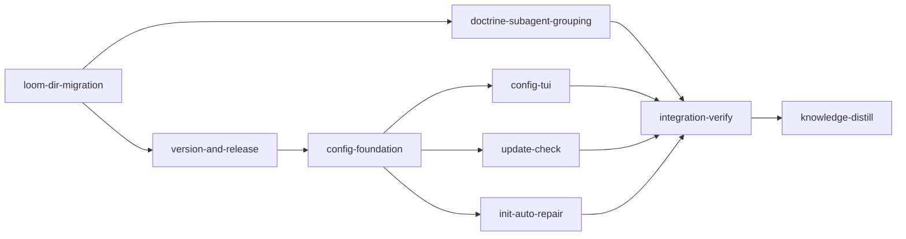

# Plan: Release Pipeline, Version Identity, Configuration, and the `.loom` Directory

## Overview

Nine changes that together give loom a real release identity and a user-facing configuration
surface, and consolidate its on-disk footprint. Three of the nine already exist in partial form and
are repaired rather than built: the release workflow publishes drafts that `loom self-update` can
never see, `loom self-update` fetches a checksum asset under a name the workflow does not publish,
and the version in `Cargo.toml` has never moved off `0.1.0`.

The largest change is structural: loom's shared orchestration state moves from `<repo>/.work/` to
`<repo>/.loom/work/`, joining the derived context cache that already lives at `<repo>/.loom/cache/`,
while `.worktrees/` stays at the project root.

## Goals

- Pushing a `v*.*.*` tag produces a live, signed, checksummed GitHub release.
- The binary knows its own version, including for development builds, and prints it under `loom -v`.
- `loom self-update` works end to end.
- Loom notices new releases and says so. It never installs anything on its own.
- `loom config` gives a TUI and a scalar get/set surface over a global `~/.loom/config.toml`.
- `loom init` repairs the workspace instead of telling the user to run `loom repair --fix`.
- Doctrine tells orchestrators to group small tasks into one subagent.
- `<repo>/.loom/work/` replaces `<repo>/.work/`, with old `.work/` workspaces still readable.

## Non-goals

- No migration of existing workspaces. Loom plans are ephemeral; old `.work/` projects keep working
  through a read fallback and are never rewritten.
- No new release targets. The matrix stays linux-x86_64, darwin-x86_64, darwin-arm64.
- No change to hard stop 6. The subagent doctrine change is a grouping rule only.
- No automatic installation of updates, in any configuration.

---

## Settled design decisions

These were settled before this plan was written. They are inputs, not open questions.

| Area | Decision |
| --- | --- |
| Layout | `.loom/work/` holds shared state. In a worktree, `.loom/` is a real writable directory holding the two spools, and `.loom/work` is a symlink to `../../../.loom/work`. `.loom/cache/` is unmoved. `.worktrees/` stays at the project root. |
| Why nested | One directory name cannot be both a symlink to shared state and a real local directory. The two spools must be worktree-local and writable (`fs/memory/spool.rs:1-21`); the state must be shared and read-only. Nesting the shared half keeps `WorkDir::initialize`'s existence guard valid and keeps `loom clean --state` a single recursive remove that spares the expensive cache. |
| Back-compat | The resolver keys on `config.toml`, not on directory existence: `.loom/work/config.toml` first, then `.work/config.toml`. No writes to `.work/`, ever. |
| Naming | `WorkDir` and `work_dir` identifiers are left alone. They appear in 317 files against 265 carrying `.work` string literals, and identifier renames are compiler-verified while string changes are not — renaming would bury the risky half of the diff under mechanical noise. |
| Version source | The tag is authoritative. `Cargo.toml` holds a placeholder; CI sets the version from the tag at build time. `build.rs` derives a development version as last tag + patch bump + dev marker. |
| Releases | Live on tag, never draft. CI fails the release if the tag and the built version disagree. |
| Updates | Check and notify only. `loom self-update` stays the sole installer. The config key is "check for updates", not "auto-update". |
| User directory | `~/.loom/`, holding `config.toml` and `update-state.json`. Matches `~/.claude/` and `~/.codex/`. |
| Collision guards | The workspace discriminator is `.loom/work/config.toml`, which never exists at the user level; the resolver's upward walk stops at the git repo root; the two get distinct types and distinct wording in every message. |
| Doctrine | Grouping rule only. Hard stop 6 is untouched. |

### Why the plan's own orchestration depends on the back-compat fallback

Loom executes this plan with the **installed** binary, which creates `.work` symlinks and reads
`.work` state. The migration takes effect only once a new binary is built and installed. The
fallback is therefore not merely a courtesy to old projects — without it, reinstalling loom partway
through the run would strand the orchestration executing this plan.

---

## Verification baseline

`cargo test --manifest-path loom/Cargo.toml --all-targets` was run at HEAD (77ef35ed) during
authoring: **3156 passed, 9 failed, 1 ignored**, in 26.81s.

All nine failures were traced to the authoring sandbox, not to HEAD:

| Test | Cause |
| --- | --- |
| `context::tests::store::open_resolves_cache_at_main_project_root_from_linked_worktree` | `TMPDIR` under `/tmp` aliases to `/private/tmp` on macOS; the test compares a canonicalized path against a raw one (`src/context/tests/store.rs:47`) |
| `daemon::rpc::tests::a_live_listener_is_answered` | needs an `AF_UNIX` socket |
| `daemon::rpc::tests::a_stale_socket_file_with_nothing_bound_is_not_listening` | needs an `AF_UNIX` socket |
| `daemon::server::peer_identity::tests::ancestry_accepts_self_and_the_real_parent_chain` | needs real process ancestry |
| `process::tests::unreaped_dead_child_is_not_alive` | needs real zombie-reaping semantics |
| `verify::criteria::tests::confine_tests::spawned_child_leads_its_own_process_group` | needs real pgid semantics |
| `fs::permissions::tests::settings_tests::test_ensure_loom_permissions_adds_home_expanded_codex_forward_entry` | writes under `~/.claude` |
| `fs::permissions::tests::settings_tests::test_ensure_loom_permissions_home_expanded_entry_no_duplicates_on_rerun` | writes under `~/.claude` |
| `commands::attach::wait::tests::diagnose_sessions_names_the_work_dir_and_every_session` | needs a live session/socket |

**How this plan handles it.** The first test is a genuine fragility in a file this plan rewrites, so
`loom-dir-migration` owns fixing it (canonicalize both sides of the assertion) and its acceptance
runs it. The other eight are excluded from every stage's gate by an explicit `--skip` list. The
coverage given up is exactly those eight tests, all of which exercise host resources rather than
loom's logic. If they pass in the stage environment the skips are harmless.

### Hook syntax has no gate, and two hooks were broken at HEAD

While grounding this plan, `hooks/spawn-guard.sh` and `hooks/codex-forward.sh` were both found to be
**syntactically invalid at HEAD**, which blocks every `Agent` spawn. Both had the same cause: a
heredoc inside a command substitution (`X=$(cat <<'EOF' ... EOF)`) is *not* protected by its own
`<<'EOF'` quoting, because bash's `$( )` lexer re-scans the body for quote characters. A single
apostrophe in the body (`session's`, `a file's symbols`) opened a single-quoted region spanning
dozens of lines and destroyed double-quote parity far away.

Both are fixed and committed ahead of this plan (`588a0446`, `cdbb31b4`). No test in the repository
ran `bash -n` over the hook scripts, which is why they were committed broken; `scripts/check-hook-syntax.sh`
now closes that gap and runs as its own CI job (`e40443b8`), verified by mutation. Every stage below
calls it in acceptance, so the migration's hook sweep cannot reintroduce the class.

---

## Execution Diagram



`knowledge-bootstrap` is skipped: `doc/loom/knowledge/` is hierarchical (`INDEX.md` present) and
densely populated — seven tier-1 files (4315 lines, per the counts in `INDEX.md`) plus 57 tier-2
topics (`fd -e md . doc/loom/knowledge --min-depth 2 | wc -l`). The stage would
write nothing new. `knowledge-distill` still runs.

---

## Stages

### 1. `loom-dir-migration`

**Stage Necessity: Q1.** Every other stage must branch from a tree where the paths have already
moved; running any of them first would write `.work` paths that this stage then has to sweep again.

The riskiest stage in the plan. 1006 references to `.work` across 265 files in `loom/src`, plus the
hook scripts, `.gitignore`, and `CLAUDE.md.template`.

The work has three parts, and the first must be finished before the second begins:

**Foundation — the resolver.** A single module owns path resolution and the fallback. `WorkDir::new`
(`fs/work_dir.rs:94-138`) currently walks upward to the filesystem root with no repo boundary. It
must instead look for `.loom/work/config.toml`, fall back to `.work/config.toml`, and **stop the walk
at the git repo root** — the unbounded walk is a pre-existing hazard that `~/.loom/` would otherwise
turn into a live one (`mistakes.md` records `find_repo_root_from_cwd` returning `Some(cwd)` outside
any repo). There are at least three independent resolvers to reconcile, not one: `WorkDir::new`,
`get_work_dir` in `commands/review/generate.rs:19`, and `get_work_dir` in
`commands/memory/handlers/work_dir.rs:21`. Collapse them onto the shared one.

**Sweep — the literals.** `sandbox/settings.rs:306-311` emits per-child rules
(`Read(.work/config.toml)`, `Read(.work/signals/**)`, `Read(.work/handoffs/**)`,
`Edit(.work/handoffs/**)`, `Read(.work/disputes/**)`, `Read(.work/memory/**)`), deliberately avoiding
a blanket `.work/**` so `admin.token` and `user.token` stay hidden — every one becomes
`.loom/work/...`, and the deliberate omission must survive. `sandbox/settings.rs:116-155` resolves the
symlink to an absolute path to add denies; it now resolves `.loom/work`.
`git/worktree/settings.rs:53-68` plants the symlink: it must `mkdir` the worktree's `.loom/` first,
then link `.loom/work -> ../../../.loom/work` (note the extra `../`).
`is_worktree_scaffold_path` (`settings.rs:36-47`) gains the new paths and keeps the existing
`.loom/cache` and spool entries.

**Sweep — the shell and the docs.** Every hook under `hooks/` referencing `.work`, including
`_common.sh` which the others source; `.gitignore` lines 45-69; and `CLAUDE.md.template`'s Rule 10.

Three specific traps:

1. **The spool drain must skip symlinked entries.** Attribution comes from *which worktree* the
   daemon drained from (`fs/memory/spool.rs:17-21`); a worktree's `.loom/work` is now a symlink into
   the main repo, and following it would drain the main repo's own spool and attribute those entries
   to a stage. Skip any candidate whose `symlink_metadata()` reports a symlink — a string prefix test
   is not a containment check.
2. **`main_project_root()` takes one more parent hop.** It resolves the symlink and walks up; with
   `.loom/work` that is two levels, not one. `ContextStore::open` (`context/store.rs:56`) depends on
   it for `.loom/cache/context-v1`.
3. **`sun_path` is 104 bytes on macOS and nothing validates it.** The socket path grows by five
   bytes (`daemon/server/core.rs:93,116`). Add an explicit length check with a clear error rather
   than letting `bind` fail opaquely.

Also in this stage: fix `src/context/tests/store.rs:47` to canonicalize both sides of the assertion,
and add `scripts/check-hook-syntax.sh` (runs `bash -n` over every `hooks/**/*.sh` whose shebang is
not Python — `hooks/skill-trigger.sh` is Python with a `.sh` extension and must be excluded).

### 2. `doctrine-subagent-grouping`

**Stage Necessity: Q4.** Combining this with `version-and-release` would put CI semantics, cargo
version machinery, and self-update internals in one session alongside five byte-pinned doctrine
surfaces that must be edited to exact equality. The two halves share no files and no reasoning.

Add a task-grouping rule: several small tasks go to **one** subagent, never one subagent per task or
per file. State the boot cost so the trade is visible, and name the second cost — every extra
subagent forces another disjoint file set, which is the part that actually goes wrong.

The pinning, verified against the tests rather than assumed. Each equality test enumerates its own
fixed surface set, and **none of the three iterates `agents/*.md`**:

| Test | Requires the block verbatim in |
| --- | --- |
| `block_a_agrees_across_every_surface` (`tests_doctrine.rs:109`) | both signal prefixes, `CLAUDE.md.template`, `hooks/subagent-verify-guard.sh` |
| `block_b_agrees_across_every_surface` (`:129`) | `CLAUDE.md.template`, `skills/loom-plan-writer/SKILL.md` |
| `block_d_agrees_across_every_surface` (`:166`) | both signal prefixes, `CLAUDE.md.template` (and asserts ABSENCE from the two knowledge prefixes) |

`guidance_surfaces()` (`:93`) and `agent_definitions()` (`:62`) do scan every `agents/*.md`, but only
two tests consume them: a `RETIRED_PHRASES` **absence** check (`:332`) and a codex-sentinel presence
check (`:211`). A new grouping rule trips neither.

The Rule 6 shape table (`CLAUDE.md.template:140-146`) has **no copy anywhere in `loom/src`** and no
test asserts it against another surface. `cache/blocks.rs` declares only two consts
(`BINDING_RULES_POINTER:19`, `KNOWLEDGE_CONSUMPTION_CONTRACT:23`); the BLOCK-A and BLOCK-D text lives
in `push_str` literals inside its functions.

**Put the new rule in Rule 6's prose, not inside a pinned BLOCK.** Not because a block would reach
`agents/*.md` — it would not — but because BLOCK-A and BLOCK-D text is duplicated into the signal
prefix generators in `cache/blocks.rs`, so landing the rule inside either one turns a two-file edit
into a four-file byte-identical edit for no benefit. Rule 6 prose plus the plan-writer skill's
parallelization section reaches exactly the right readers.

Budget: `CLAUDE.md.template` is 27,683 bytes against the 28,672-byte ceiling at `tests_size.rs:30` —
989 bytes of headroom. Fit inside it. Raise the ceiling only if the text cannot be made to fit, and
say so in the commit if you do.

### 3. `version-and-release`

**Stage Necessity: Q1.** `config-foundation` edits `cli/types.rs`, which this stage also edits.

`Cargo.toml` becomes `version = "0.0.0-dev"` and stops moving. A new `loom/build.rs` derives the real
version and emits it for `env!`:

- `git describe --tags --exact-match` succeeds → that tag verbatim (this is what CI builds).
- `git describe --tags` gives `v0.2.0-5-gabc1234` → `0.2.1-dev.5+abc1234`: last tag, patch bumped,
  commit count and SHA. Semver-correct in both directions — ahead of `0.2.0`, behind `0.2.1`.
- No tags, or no git → `0.0.0-dev+unknown`.

`build.rs` must emit `cargo:rerun-if-changed=.git/HEAD` and `.git/refs/tags` or the version staleness
is invisible. There is no `build.rs` at the package root today and no `[build-dependencies]`; shell
out to `git` rather than adding a dependency.

`loom -v`: `#[command(version)]` at `cli/types.rs:34` gives `-V` only. Add the short alias. Nothing
else claims `-v` at the top level (`Status`'s `-v` is a subcommand flag). Render version, commit,
build date, and target triple.

Release workflow: drop `draft: true` (`release.yml:229`), and add a job that fails when the tag does
not match the version the build produced.

Also here, because it is an asset-naming question: `self_update/mod.rs:224` looks for an asset named
`checksums.txt` while `release.yml:148,161,240` publishes `SHA256SUMS.txt`, so self-update bails at
`mod.rs:241` and cannot update anything. Change the client to `SHA256SUMS.txt` — the published name
is conventional and already documented in the release notes. This is recorded as a known defect in
`concerns.md#security-concerns`, which the distill stage should correct.

### 4. `config-foundation`

**Stage Necessity: Q2.** Edits `cli/types.rs` and `cli/dispatch.rs`, which `version-and-release`
also edits.

A new module owns `~/.loom/`: resolve the directory, read and write `config.toml` through
`toml_edit` so comments and unknown keys survive, and expose a typed registry of keys. Mirror the
existing section-typed accessors in `fs/work_dir.rs:497-660` rather than inventing a second style,
but keep the type distinct from `WorkDir` — the two must never be confusable in a message.

Keys: `update.check` (bool, default true), `update.check_interval_hours` (u32, default 24),
`terminal.backend` (native|tmux), `context.ceiling_tokens` (u32).

CLI: `loom config -k <key>` prints the value; `loom config -k <key> <value>` sets it; `loom config
--list` prints every key with its value and origin (set vs default); bare `loom config` prints the
resolved configuration as TOML. The bare form becomes the TUI in the next stage — it is complete and
useful now, not a stub.

Writes go to `~/.loom/config.toml` only. Workspace overrides are explicitly out of scope.

### 5. `config-tui`

**Stage Necessity: Q2.** Owns `commands/config/tui/**` and re-points bare `loom config`, which
`config-foundation` wrote.

Mirror `commands/status/ui/tui/`: `enable_raw_mode` and `EnterAlternateScreen` at `app.rs:91-93`,
`Terminal::new(backend)` at `:101`, teardown at `:296-303`. That is the crossterm shape, not ratatui
0.30's `init()`/`restore()` — match the existing code. Reuse `status/ui/theme.rs` and
`status/ui/widgets.rs` if they are reachable from a sibling command module; replicate rather than
re-export if they are not.

Bare `loom config` opens the TUI; `loom config --print` keeps the TOML output. Guard on a non-TTY
stdout and fall back to `--print` behaviour — the command must stay usable in a pipe.

### 6. `update-check`

**Stage Necessity: Q2.** Owns `main.rs`, which no other stage in this wave touches.

Launch reads `~/.loom/update-state.json` — **no network on the hot path**. If it records a newer
version, print one line. If the record is older than `update.check_interval_hours`, spawn a detached
background process that fetches, rewrites the state file, and exits. The foreground command never
waits.

The gate already exists in shape: `main.rs:13` declares `MACHINE_PROTOCOL_COMMANDS` and
`writes_a_machine_protocol()` at `:45` reads argv before parsing. Add a parallel predicate for
commands that must never check or notify — `hook`, `context`, `complete`, and the daemon's own
re-entry — and reuse the same argv-before-parse approach.

Notification is unconditional (subject to the interval). `update.check = false` disables the check
entirely. Nothing here ever writes the binary.

### 7. `init-auto-repair`

**Stage Necessity: Q2.** Adds `--no-repair` to `Init` in `cli/types.rs`.

`loom init` runs the full repair check set and applies every fix, reporting what it changed.
`--no-repair` opts out. `loom repair` stays for standalone use.

`repair.rs` is 1131 lines against the 400-line ceiling in Rule 17, and this stage is the reason to
split it. The checks divide cleanly: workspace structure (`.work`/`.loom` shape, `.gitignore`), hooks
and skill index, `.claude` settings and sandbox, merge state (phantom merges), and process/daemon
liveness. `settings_checks.rs` already exists as a sibling; follow it.

Do not fold `--clean` into this. `--clean` is destructive and stays explicit.

### 8. `integration-verify`

Full gate, code review, and functional proof that each surface is reachable: `loom -v` prints a
version with a commit, `loom config -k update.check` round-trips, `loom init` reports repairs, a
worktree gets `.loom/work` as a symlink and `.loom/*.jsonl` as real files, and `bash -n` passes over
every shell hook.

### 9. `knowledge-distill`

Curate memories. Two corrections are already known and must be applied with `replace-section`, not
`update`: `concerns.md#security-concerns` describes the checksum asset mismatch as an open defect
(stage 3 fixes it), and `architecture.md#security-model` repeats it. Every knowledge file naming
`.work/` needs re-checking against the new layout.

---

<!-- loom METADATA -->

```yaml
loom:
  version: 1
  sandbox:
    enabled: true
    auto_allow: true
    filesystem:
      deny_read: ["~/.ssh/**", "~/.aws/**", "~/.config/gcloud/**", "~/.gnupg/**"]
      allow_write: ["loom/target/**"]
    network:
      allowed_domains: ["crates.io", "index.crates.io", "static.crates.io"]
      allow_local_binding: false
      allow_unix_sockets: []
  stages:
    - id: loom-dir-migration
      name: "Move shared state to .loom/work"
      stage_type: standard
      model: "opus"
      reasoning_effort: "xhigh"
      implementers: ["codex", "claude"]
      subagent_timeout_secs: 1800
      description: |
        Move loom's shared orchestration state from <repo>/.work/ to <repo>/.loom/work/.
        .worktrees/ stays at the project root. .loom/cache/ does not move. Old .work/
        workspaces keep working through a READ fallback; nothing ever writes .work/.
        Use parallel subagents and skills to maximize performance.

        FOUNDATION STEP - do this yourself or in ONE subagent, and finish it before
        any other subagent starts, because everything else compiles against it:
        1. In loom/src/fs/work_dir.rs, rewrite WorkDir::new (lines 94-138). Resolution
           order: <root>/.loom/work/config.toml, then <root>/.work/config.toml. Key on
           the CONFIG FILE, never on directory existence - ~/.loom/config.toml exists at
           the user level and .loom/cache/ exists in projects that ran loom map.
        2. Bound the upward walk at the git repo root. Today it walks to the filesystem
           root, which with ~/.loom/ present is a live hazard.
        3. Collapse the two duplicate resolvers onto the shared one:
           commands/review/generate.rs:19 and commands/memory/handlers/work_dir.rs:21.
        4. main_project_root() now takes TWO parent hops through the symlink, not one.
        5. Add a sun_path length check where the socket path is built
           (daemon/server/core.rs:93 and :116). 104 bytes on macOS; the path grows by 5.

        THEN fan out over DISJOINT territories. Group small edits together - do NOT
        spawn one subagent per file.

        | Worker | Role | Tier | Files owned | Read-only |
        | --- | --- | --- | --- | --- |
        | W1 | Rust literal sweep, non-sandbox | codex gpt-5.6-sol | loom/src/** except sandbox/ and git/worktree/ | loom/src/fs/work_dir.rs |
        | W2 | Sandbox + worktree scaffolding | codex gpt-5.6-sol | loom/src/sandbox/**, loom/src/git/worktree/** | loom/src/fs/work_dir.rs |
        | W3 | Shell, gitignore, template, syntax gate | codex gpt-5.6-terra | hooks/**, .gitignore, CLAUDE.md.template, scripts/** | loom/src/** |

        W2 detail. sandbox/settings.rs:306-311 emits per-child rules -
        Read(.work/config.toml), Read(.work/signals/**), Read(.work/handoffs/**),
        Edit(.work/handoffs/**), Read(.work/disputes/**), Read(.work/memory/**). Each
        becomes .loom/work/... . The deliberate ABSENCE of a blanket .work/** is a
        security property (it keeps admin.token and user.token unreadable) and MUST
        survive. settings.rs:116-155 resolves the symlink to an absolute path to emit
        denies; it now resolves .loom/work. git/worktree/settings.rs:53-68 must mkdir
        the worktree's .loom/ first, then symlink .loom/work -> ../../../.loom/work
        (three levels, not two). is_worktree_scaffold_path at settings.rs:36-47 gains
        the new paths and keeps its existing .loom/cache and spool entries.

        W3 detail. Sweep every hooks/*.sh referencing .work, including _common.sh which
        the others source. .gitignore lines 45-69 gain .loom/work/ and .loom/work beside
        the existing .loom/cache/ and spool patterns. CLAUDE.md.template Rule 10 names
        .work/ and must not contradict the tree. scripts/check-hook-syntax.sh already
        exists and already runs in CI - do NOT recreate it; just keep it passing. It is
        the gate that catches a heredoc-inside-$() quoting break, which is exactly the
        failure mode a wide hook sweep can reintroduce, so run it after every edit.

        TRAP - THE SPOOL DRAIN. A worktree's .loom/work is now a symlink into the main
        repo. The daemon's drain attributes entries by WHICH WORKTREE it drained them
        from (fs/memory/spool.rs:17-21) - following the symlink would drain the main
        repo's own spool and attribute it to a stage. Skip any candidate whose
        symlink_metadata() reports a symlink. A string prefix test is NOT a containment
        check.

        ALSO: fix loom/src/context/tests/store.rs:47 to canonicalize BOTH sides of the
        path assertion. It currently fails whenever TMPDIR sits under a symlinked /tmp.

        CODEX: subagents must not run git at all. Check git status --short after each
        codex run. Never put a .work/ or .loom/ path in a codex subagent's file list.
        State an explicit Bash timeout of 900000 ms and --effort xhigh in every
        forwarder prompt.

        MEMORY: record mistakes/decisions/surprises via loom memory immediately.
        NEVER loom knowledge (implementation stage). NEVER Claude Code auto-memory.
      dependencies: []
      acceptance:
        - "./scripts/check-hook-syntax.sh"
        - "cargo build --manifest-path loom/Cargo.toml --all-targets"
        - "cargo fmt --manifest-path loom/Cargo.toml -- --check"
        - "cargo clippy --manifest-path loom/Cargo.toml --all-targets -- -D warnings"
        - "cargo test --manifest-path loom/Cargo.toml --all-targets -- --skip daemon::rpc::tests --skip daemon::server::peer_identity::tests::ancestry_accepts_self_and_the_real_parent_chain --skip process::tests::unreaped_dead_child_is_not_alive --skip verify::criteria::tests::confine_tests::spawned_child_leads_its_own_process_group --skip fs::permissions::tests::settings_tests::test_ensure_loom_permissions_adds_home_expanded_codex_forward_entry --skip fs::permissions::tests::settings_tests::test_ensure_loom_permissions_home_expanded_entry_no_duplicates_on_rerun --skip commands::attach::wait::tests::diagnose_sessions_names_the_work_dir_and_every_session"
        - 'cargo test --manifest-path loom/Cargo.toml --lib context::tests::store::open_resolves_cache_at_main_project_root_from_linked_worktree'
        - 'rg -q "\.loom/work" loom/src/fs/work_dir.rs'
        - 'rg -q "\.loom/work" .gitignore'
      files:
        - "loom/src/**"
        - "hooks/**"
        - ".gitignore"
        - "CLAUDE.md.template"
        - "scripts/**"
      working_dir: "."
      artifacts:
        - "scripts/check-hook-syntax.sh"
        - "loom/src/fs/work_dir.rs"
        - "loom/src/git/worktree/settings.rs"
      wiring:
        - source: "loom/src/git/worktree/settings.rs"
          pattern: '\.\./\.\./\.\./\.loom/work'
          description: "Worktree symlink points three levels up at the main repo's .loom/work"
        - source: "loom/src/sandbox/settings.rs"
          pattern: 'Read\(\.loom/work/signals/\*\*\)'
          description: "Sandbox grants the worktree agent read on the moved signals directory"

    - id: doctrine-subagent-grouping
      name: "Subagent task-grouping doctrine"
      stage_type: standard
      model: "opus"
      reasoning_effort: "high"
      description: |
        Add a task-grouping rule to subagent doctrine: several small tasks go to ONE
        subagent, never one subagent per task or per file. Name both costs - the tokens
        a subagent spends before doing any work, and the disjoint file set every extra
        subagent forces.
        Use parallel subagents and skills to maximize performance.

        HARD STOP 6 IS UNTOUCHED. This is a grouping rule, not a licence for the
        orchestrator to implement. Do not reword "the main agent never implements".

        WHERE THE TEXT GOES. Put it in CLAUDE.md.template Rule 6 prose (the section
        starts at line 140) and in the parallelization section of
        skills/loom-plan-writer/SKILL.md. Do NOT put it in a pinned BLOCK:
        tests_doctrine.rs:93-106 defines the pinned surfaces as CLAUDE.md.template,
        skills/loom-plan-writer/SKILL.md and EVERY agents/*.md, and
        block_a/b/d_agrees_across_every_surface (:109, :129, :166) assert byte-identical
        presence in all of them. A rule only orchestrators and plan authors act on does
        not belong in every agent definition.

        Read tests_doctrine_blocks.rs first - it holds the block text - and confirm your
        edit does not perturb any pinned string.

        SIZE BUDGET. CLAUDE.md.template is 27683 bytes against the 28672-byte ceiling at
        tests_size.rs:30. That is 989 bytes of headroom across both surfaces. Fit inside
        it. If the text genuinely cannot fit, raise the ceiling deliberately and say so
        in the commit message, the way it was raised for BLOCK-D.

        This is a small, exact stage. Use ONE subagent for both files rather than one
        per file - which is the rule this stage exists to add.

        MEMORY: record decisions via loom memory. NEVER loom knowledge. NEVER auto-memory.
      dependencies: ["loom-dir-migration"]
      acceptance:
        - "cargo test --manifest-path loom/Cargo.toml --lib orchestrator::signals::tests_doctrine"
        - "cargo test --manifest-path loom/Cargo.toml --lib orchestrator::signals::tests_size"
        - "cargo fmt --manifest-path loom/Cargo.toml -- --check"
        - 'rg -q "one subagent per" CLAUDE.md.template'
        - 'rg -q "one subagent per" skills/loom-plan-writer/SKILL.md'
      files:
        - "CLAUDE.md.template"
        - "skills/loom-plan-writer/SKILL.md"
      working_dir: "."
      artifacts:
        - "CLAUDE.md.template"
        - "skills/loom-plan-writer/SKILL.md"

    - id: version-and-release
      name: "Tag-driven version identity and live releases"
      stage_type: standard
      model: "opus"
      reasoning_effort: "high"
      implementers: ["codex", "claude"]
      subagent_timeout_secs: 900
      description: |
        Give the binary a real version, make tag pushes produce live releases, and
        repair loom self-update's checksum asset name.
        Use parallel subagents and skills to maximize performance.

        1. loom/Cargo.toml: version = "0.0.0-dev". It stops moving from here on.
        2. NEW loom/build.rs (none exists today; there are no [build-dependencies], so
           shell out to git rather than adding a crate):
           - git describe --tags --exact-match succeeds -> that tag verbatim, minus the
             leading v. This is what CI builds.
           - git describe --tags gives v0.2.0-5-gabc1234 -> 0.2.1-dev.5+abc1234: last
             tag, patch bumped, commit count, short SHA. Semver puts this ahead of
             0.2.0 and behind 0.2.1, which is exactly right for a build sitting on
             commits past the last release.
           - no tags, or git absent -> 0.0.0-dev+unknown.
           Emit cargo:rustc-env=LOOM_VERSION plus commit, build date and target triple,
           and cargo:rerun-if-changed for .git/HEAD and .git/refs/tags - without those
           the version silently goes stale.
        3. loom/src/cli/types.rs:34 has #[command(version)], which binds -V only. Add
           the -v short alias. Nothing else claims -v at the top level (Status's -v is a
           subcommand flag). Render version, commit, build date, target.
        4. Anything reading CARGO_PKG_VERSION must read the new value instead -
           self_update/mod.rs:40 is the one production site.
        5. .github/workflows/release.yml: remove draft: true at line 229. Add a job that
           fails the release when the git tag does not match the version the build
           reports.
        6. self_update/mod.rs:224 looks for a release asset literally named
           "checksums.txt"; release.yml publishes SHA256SUMS.txt (lines 148, 161, 240).
           Self-update therefore always bails at mod.rs:241 and can update nothing.
           Change the CLIENT to SHA256SUMS.txt - the published name is conventional and
           already named in the release notes. Update the bail message to match.
           self_update/tests.rs pins the old name in places; update those too.

        Group these: the version work (1-4) is one subagent, the release and
        self-update work (5-6) is another. Do not split further.

        CODEX: no git commands in subagents; check git status --short after each run;
        explicit Bash timeout 900000 ms and --effort xhigh in every forwarder prompt.

        MEMORY: record decisions via loom memory. NEVER loom knowledge. NEVER auto-memory.
      dependencies: ["loom-dir-migration"]
      acceptance:
        - "./scripts/check-hook-syntax.sh"
        - "cargo build --manifest-path loom/Cargo.toml --all-targets"
        - "cargo fmt --manifest-path loom/Cargo.toml -- --check"
        - "cargo clippy --manifest-path loom/Cargo.toml --all-targets -- -D warnings"
        - "cargo test --manifest-path loom/Cargo.toml --all-targets -- --skip daemon::rpc::tests --skip daemon::server::peer_identity::tests::ancestry_accepts_self_and_the_real_parent_chain --skip process::tests::unreaped_dead_child_is_not_alive --skip verify::criteria::tests::confine_tests::spawned_child_leads_its_own_process_group --skip fs::permissions::tests::settings_tests::test_ensure_loom_permissions_adds_home_expanded_codex_forward_entry --skip fs::permissions::tests::settings_tests::test_ensure_loom_permissions_home_expanded_entry_no_duplicates_on_rerun --skip commands::attach::wait::tests::diagnose_sessions_names_the_work_dir_and_every_session"
        - './loom/target/debug/loom -v'
        - './loom/target/debug/loom -v | rg -q "dev"'
        - 'rg -qF "SHA256SUMS.txt" loom/src/commands/self_update/mod.rs'
        - 'rg -q "draft: true" .github/workflows/release.yml; test $? -ne 0'
      files:
        - "loom/Cargo.toml"
        - "loom/build.rs"
        - "loom/src/cli/types.rs"
        - "loom/src/commands/self_update/**"
        - ".github/workflows/**"
      working_dir: "."
      artifacts:
        - "loom/build.rs"
      wiring:
        - source: "loom/src/commands/self_update/mod.rs"
          pattern: 'a\.name == "SHA256SUMS\.txt"'
          description: "Self-update fetches the checksum asset the release workflow actually publishes"

    - id: config-foundation
      name: "Global config and loom config -k"
      stage_type: standard
      model: "opus"
      reasoning_effort: "high"
      implementers: ["codex", "claude"]
      subagent_timeout_secs: 900
      description: |
        Add a user-level configuration file at ~/.loom/config.toml and a scalar get/set
        CLI over it.
        Use parallel subagents and skills to maximize performance.

        A new module owns ~/.loom/: resolve the directory (dirs::home_dir, already a
        dependency - see codex.rs:56 for the house idiom), read and write config.toml
        through toml_edit so comments and unknown keys survive, and expose a typed key
        registry.

        Mirror the section-typed accessor style in fs/work_dir.rs:497-660 rather than
        inventing a second one, but keep the TYPE distinct from WorkDir. These are two
        different directories that share a name prefix, and every error message must say
        which one it means: "user config ~/.loom/config.toml" or
        "workspace <repo>/.loom/". Never a bare "the .loom directory".

        KEYS (this is the whole surface for this plan):
          update.check                  bool, default true
          update.check_interval_hours   u32,  default 24
          terminal.backend              "native" | "tmux"
          context.ceiling_tokens        u32

        CLI, added to cli/types.rs and dispatched in cli/dispatch.rs (dispatch is at
        dispatch.rs:155):
          loom config -k <key>            print the value
          loom config -k <key> <value>    set it, print the old and new values
          loom config --list              every key, its value, and whether it is set
                                          or defaulted
          loom config                     print the resolved config as TOML

        The bare form becomes the TUI in the next stage. It must be complete and useful
        NOW - printing resolved TOML - not a stub.

        Writes go to ~/.loom/config.toml only. Per-workspace overrides are explicitly
        out of scope; do not add a precedence layer.

        Unknown key, or a value that fails to parse for its type, is an error with a
        non-zero exit and a message naming the valid keys.

        This is one coherent piece of work. Use ONE subagent for the module and the CLI
        together - splitting them would force a shared-contract foundation step for no
        benefit.

        CODEX: no git in subagents; check git status --short after each run; explicit
        Bash timeout 900000 ms and --effort xhigh.

        MEMORY: record decisions via loom memory. NEVER loom knowledge. NEVER auto-memory.
      dependencies: ["version-and-release"]
      acceptance:
        - "./scripts/check-hook-syntax.sh"
        - "cargo build --manifest-path loom/Cargo.toml --all-targets"
        - "cargo fmt --manifest-path loom/Cargo.toml -- --check"
        - "cargo clippy --manifest-path loom/Cargo.toml --all-targets -- -D warnings"
        - "cargo test --manifest-path loom/Cargo.toml --all-targets -- --skip daemon::rpc::tests --skip daemon::server::peer_identity::tests::ancestry_accepts_self_and_the_real_parent_chain --skip process::tests::unreaped_dead_child_is_not_alive --skip verify::criteria::tests::confine_tests::spawned_child_leads_its_own_process_group --skip fs::permissions::tests::settings_tests::test_ensure_loom_permissions_adds_home_expanded_codex_forward_entry --skip fs::permissions::tests::settings_tests::test_ensure_loom_permissions_home_expanded_entry_no_duplicates_on_rerun --skip commands::attach::wait::tests::diagnose_sessions_names_the_work_dir_and_every_session"
        - './loom/target/debug/loom config --list'
        - './loom/target/debug/loom config --list | rg -q "update.check"'
        - './loom/target/debug/loom config -k update.check_interval_hours | rg -q "24"'
      files:
        - "loom/src/user_config/**"
        - "loom/src/commands/config/**"
        - "loom/src/cli/types.rs"
        - "loom/src/cli/dispatch.rs"
        - "loom/src/lib.rs"
      working_dir: "."
      artifacts:
        - "loom/src/user_config/mod.rs"
        - "loom/src/commands/config/mod.rs"
      wiring:
        - source: "loom/src/cli/dispatch.rs"
          pattern: "Commands::Config"
          description: "Config command reachable from CLI dispatch"

    - id: config-tui
      name: "loom config TUI"
      stage_type: standard
      model: "opus"
      reasoning_effort: "high"
      implementers: ["codex", "claude"]
      subagent_timeout_secs: 900
      description: |
        Give bare `loom config` a ratatui screen over the keys config-foundation
        registered.
        Use parallel subagents and skills to maximize performance.

        Mirror the existing TUI in commands/status/ui/tui/ rather than inventing a
        second shape. Read app.rs first: enable_raw_mode and EnterAlternateScreen at
        lines 91-93, Terminal::new(backend) at 101, teardown at 296-303. That is the
        crossterm idiom - ratatui is pinned at 0.30 and crossterm at 0.29, but this code
        does NOT use ratatui::init()/restore(). Match what is there.

        Reuse commands/status/ui/theme.rs and widgets.rs if they are reachable from a
        sibling command module - check the visibility on the module path, not just on
        the items (pub(crate) on an item means nothing if a module on its path is
        private). Replicate the small amount you need if they are not reachable; do not
        widen an existing module's visibility for this.

        Screen: a list of keys with current values, arrow/j-k navigation, Enter to edit
        the selected value inline, Esc to cancel, s to save, q to quit. Validate on
        commit using the same typed registry the -k path uses - two validators would
        drift.

        Bare `loom config` opens the TUI. `loom config --print` keeps the TOML output
        config-foundation added. Guard on a non-TTY stdout and fall back to --print, so
        the command stays usable in a pipe and in tests.

        ONE subagent. This is a single screen.

        MEMORY: record decisions via loom memory. NEVER loom knowledge. NEVER auto-memory.
      dependencies: ["config-foundation"]
      acceptance:
        - "./scripts/check-hook-syntax.sh"
        - "cargo build --manifest-path loom/Cargo.toml --all-targets"
        - "cargo fmt --manifest-path loom/Cargo.toml -- --check"
        - "cargo clippy --manifest-path loom/Cargo.toml --all-targets -- -D warnings"
        - "cargo test --manifest-path loom/Cargo.toml --all-targets -- --skip daemon::rpc::tests --skip daemon::server::peer_identity::tests::ancestry_accepts_self_and_the_real_parent_chain --skip process::tests::unreaped_dead_child_is_not_alive --skip verify::criteria::tests::confine_tests::spawned_child_leads_its_own_process_group --skip fs::permissions::tests::settings_tests::test_ensure_loom_permissions_adds_home_expanded_codex_forward_entry --skip fs::permissions::tests::settings_tests::test_ensure_loom_permissions_home_expanded_entry_no_duplicates_on_rerun --skip commands::attach::wait::tests::diagnose_sessions_names_the_work_dir_and_every_session"
        - './loom/target/debug/loom config --print | rg -q "update"'
      files:
        - "loom/src/commands/config/**"
      working_dir: "."
      artifacts:
        - "loom/src/commands/config/tui/mod.rs"
      wiring:
        - source: "loom/src/commands/config/mod.rs"
          pattern: "tui::run"
          description: "Bare loom config enters the TUI"

    - id: update-check
      name: "Check for updates and notify"
      stage_type: standard
      model: "opus"
      reasoning_effort: "high"
      implementers: ["codex", "claude"]
      subagent_timeout_secs: 900
      description: |
        Notice new releases and say so. NEVER install anything - loom self-update stays
        the only installer, in every configuration.
        Use parallel subagents and skills to maximize performance.

        THE HOT PATH TAKES NO NETWORK CALL. loom is invoked constantly by Claude Code
        hooks and by stage agents; a synchronous fetch on launch would be a latency
        disaster.

        Launch reads ~/.loom/update-state.json - a small record of {last_checked,
        latest_version} - and nothing else. If latest_version is newer than the running
        version, print ONE line naming both and telling the user to run loom self-update.
        If last_checked is older than update.check_interval_hours, spawn a DETACHED
        background process that fetches from the GitHub releases API, rewrites the state
        file, and exits. The foreground command never waits on it.

        Compare with semver (already a dependency, used at self_update/mod.rs:67-68).
        A development version such as 0.2.1-dev.5+abc1234 is correctly BEHIND 0.2.1 and
        AHEAD of 0.2.0, so a dev build sitting on unreleased commits is not told it is
        out of date.

        THE GATE. main.rs already has the shape: MACHINE_PROTOCOL_COMMANDS at line 13
        and writes_a_machine_protocol() at line 45 read argv BEFORE clap parses. Add a
        parallel predicate for commands that must never check or notify - hook, context,
        complete, and the daemon's own re-entry - and reuse the same argv-before-parse
        approach rather than inspecting a parsed Cli.

        update.check = false disables the check entirely; the notification is otherwise
        unconditional, subject only to the interval.

        Failures are silent. A network error, an unreadable state file, or a missing
        home directory must never make a loom command fail or print noise - this is a
        convenience, not a feature anything depends on.

        ONE subagent for the checker plus the main.rs gate.

        MEMORY: record decisions via loom memory. NEVER loom knowledge. NEVER auto-memory.
      dependencies: ["config-foundation"]
      acceptance:
        - "./scripts/check-hook-syntax.sh"
        - "cargo build --manifest-path loom/Cargo.toml --all-targets"
        - "cargo fmt --manifest-path loom/Cargo.toml -- --check"
        - "cargo clippy --manifest-path loom/Cargo.toml --all-targets -- -D warnings"
        - "cargo test --manifest-path loom/Cargo.toml --all-targets -- --skip daemon::rpc::tests --skip daemon::server::peer_identity::tests::ancestry_accepts_self_and_the_real_parent_chain --skip process::tests::unreaped_dead_child_is_not_alive --skip verify::criteria::tests::confine_tests::spawned_child_leads_its_own_process_group --skip fs::permissions::tests::settings_tests::test_ensure_loom_permissions_adds_home_expanded_codex_forward_entry --skip fs::permissions::tests::settings_tests::test_ensure_loom_permissions_home_expanded_entry_no_duplicates_on_rerun --skip commands::attach::wait::tests::diagnose_sessions_names_the_work_dir_and_every_session"
        - './loom/target/debug/loom --help'
      files:
        - "loom/src/update_check/**"
        - "loom/src/main.rs"
        - "loom/src/lib.rs"
      working_dir: "."
      artifacts:
        - "loom/src/update_check/mod.rs"
      wiring:
        - source: "loom/src/main.rs"
          pattern: "update_check::"
          description: "Update check invoked from the binary entry point"

    - id: init-auto-repair
      name: "Repair on init, and split repair.rs"
      stage_type: standard
      model: "opus"
      reasoning_effort: "high"
      implementers: ["codex", "claude"]
      subagent_timeout_secs: 900
      description: |
        Make loom init repair the workspace instead of telling the user to run
        loom repair --fix, and bring repair.rs under the 400-line ceiling.
        Use parallel subagents and skills to maximize performance.

        1. loom init runs the full check set and applies every fix that
           `loom repair --fix` would, then reports what it changed. Add --no-repair to
           opt out (cli/types.rs, the Init variant at types.rs:45). loom repair stays as
           a standalone command, unchanged.
        2. Report format: one line per repair applied, or nothing at all when the
           workspace was already clean. Silence on a clean workspace matters - init is
           run constantly and a repair banner on every invocation trains people to
           ignore it.
        3. Do NOT fold --clean into this. --clean removes worktrees, kills sessions and
           deletes state; it stays explicit and separate.
        4. Split commands/repair.rs (1131 lines) along the seams already present in
           check_all_issues. The groups: workspace structure (the .work/.loom shape and
           .gitignore entries, repair.rs:238-266), hooks and skill index (:274 and the
           rebuild path), .claude settings and sandbox (:315-394, joining the existing
           settings_checks.rs sibling), merge state and phantom merges (:437-498), and
           process/daemon liveness (:544-586). Keep execute(), the RepairIssue and
           Severity types, and the fix dispatch in the parent module.

        The split is mechanical and the init wiring is small. Use ONE subagent for both
        - this is exactly the grouping the doctrine stage adds.

        CODEX: no git in subagents; check git status --short after each run; explicit
        Bash timeout 900000 ms and --effort xhigh.

        MEMORY: record decisions via loom memory. NEVER loom knowledge. NEVER auto-memory.
      dependencies: ["config-foundation"]
      acceptance:
        - "./scripts/check-hook-syntax.sh"
        - "cargo build --manifest-path loom/Cargo.toml --all-targets"
        - "cargo fmt --manifest-path loom/Cargo.toml -- --check"
        - "cargo clippy --manifest-path loom/Cargo.toml --all-targets -- -D warnings"
        - "cargo test --manifest-path loom/Cargo.toml --all-targets -- --skip daemon::rpc::tests --skip daemon::server::peer_identity::tests::ancestry_accepts_self_and_the_real_parent_chain --skip process::tests::unreaped_dead_child_is_not_alive --skip verify::criteria::tests::confine_tests::spawned_child_leads_its_own_process_group --skip fs::permissions::tests::settings_tests::test_ensure_loom_permissions_adds_home_expanded_codex_forward_entry --skip fs::permissions::tests::settings_tests::test_ensure_loom_permissions_home_expanded_entry_no_duplicates_on_rerun --skip commands::attach::wait::tests::diagnose_sessions_names_the_work_dir_and_every_session"
        - './loom/target/debug/loom init --help | rg -q "no-repair"'
      files:
        - "loom/src/commands/repair.rs"
        - "loom/src/commands/repair/**"
        - "loom/src/commands/init/**"
        - "loom/src/cli/types.rs"
      working_dir: "."
      artifacts:
        - "loom/src/commands/repair/workspace.rs"
      wiring:
        - source: "loom/src/commands/init/execute.rs"
          pattern: "repair::"
          description: "Init calls into the repair check/fix path"

    - id: integration-verify
      name: "Integration Verification"
      stage_type: integration-verify
      model: "opus"
      reasoning_effort: "high"
      description: |
        Final verification across all nine changes. Verify FUNCTIONAL INTEGRATION, not
        just that tests pass. NEVER Claude Code auto-memory.
        Use parallel subagents and skills to maximize performance.

        CONTEXT: read this plan, loom memory show --all, and doc/loom/knowledge/*.md.

        BUILD & TEST, zero tolerance - fix every warning and failure, nothing is
        "pre-existing". Note that the eight tests skipped across this plan's stages are
        skipped for host-resource reasons recorded in the plan's Verification Baseline
        section; run them here WITHOUT the skip list and report which pass in this
        environment, so the exclusion can be narrowed or removed in a follow-up.

        CODE REVIEW: spawn parallel loom-code-reviewer subagents - security (via
        Skill(skill="loom-skills", args="loom-security-audit")), architecture, test
        coverage. Fix every finding with an engineer agent; the reviewer is read-only.

        FUNCTIONAL PROOF - each surface must be reachable, not merely present:
        - loom -v prints a version carrying a commit hash.
        - loom config --list names every registered key; loom config -k update.check
          false round-trips through ~/.loom/config.toml and back.
        - loom init on a scratch repo reports repairs and creates .loom/work/config.toml.
        - A created worktree has .loom/work as a SYMLINK and .loom/ as a real directory.
        - An old .work/ workspace is still resolved (create one by hand; confirm loom
          status reads it and that nothing writes into it).
        - bash -n passes over every shell hook.
        - The generated worktree sandbox settings grant .loom/work/signals/** for read
          and do NOT grant a blanket .loom/work/**.

        Record discoveries to loom memory for knowledge-distill, including any knowledge
        file the tree now contradicts: loom memory note "stale-knowledge: ...".
      dependencies:
        - "doctrine-subagent-grouping"
        - "config-tui"
        - "update-check"
        - "init-auto-repair"
      acceptance:
        - "./scripts/check-hook-syntax.sh"
        - "cargo build --manifest-path loom/Cargo.toml --all-targets"
        - "cargo fmt --manifest-path loom/Cargo.toml -- --check"
        - "cargo clippy --manifest-path loom/Cargo.toml --all-targets -- -D warnings"
        - "cargo test --manifest-path loom/Cargo.toml --all-targets -- --skip daemon::rpc::tests --skip daemon::server::peer_identity::tests::ancestry_accepts_self_and_the_real_parent_chain --skip process::tests::unreaped_dead_child_is_not_alive --skip verify::criteria::tests::confine_tests::spawned_child_leads_its_own_process_group --skip fs::permissions::tests::settings_tests::test_ensure_loom_permissions_adds_home_expanded_codex_forward_entry --skip fs::permissions::tests::settings_tests::test_ensure_loom_permissions_home_expanded_entry_no_duplicates_on_rerun --skip commands::attach::wait::tests::diagnose_sessions_names_the_work_dir_and_every_session"
        - './loom/target/debug/loom -v'
        - './loom/target/debug/loom config --list | rg -q "update.check"'
        - './loom/target/debug/loom init --help | rg -q "no-repair"'
      working_dir: "."
      wiring:
        - source: "loom/src/main.rs"
          pattern: "update_check::"
          description: "Update check reached from the entry point"
        - source: "loom/src/cli/dispatch.rs"
          pattern: "Commands::Config"
          description: "Config command reached from dispatch"
      wiring_tests:
        - name: "version flag carries a commit"
          command: "./loom/target/debug/loom -v"
          success_criteria:
            exit_code: 0
        - name: "config get/set round-trips"
          command: "./loom/target/debug/loom config -k update.check_interval_hours"
          success_criteria:
            exit_code: 0

    - id: knowledge-distill
      name: "Knowledge Distillation"
      stage_type: knowledge-distill
      model: "sonnet"
      reasoning_effort: "high"
      description: |
        Curate all stage memories into permanent knowledge; update user docs.
        NEVER Claude Code auto-memory.
        SINGLE-AGENT: do NOT spawn subagents.

        Read this plan, loom memory show --all, and doc/loom/knowledge/*.md.

        CORRECTIONS FIRST, with loom knowledge replace-section - never with
        loom knowledge update, which appends the fix BELOW the stale text. Two are
        already known before the run starts:
        - concerns.md#security-concerns describes the checksums.txt / SHA256SUMS.txt
          asset-name mismatch as an open defect. version-and-release fixes it.
        - architecture.md#security-model repeats the same claim.
        Then apply every stale-knowledge: memory the stages recorded.

        Then sweep for .work: every knowledge file describing the old layout is now
        wrong. rg -l "\.work" doc/loom/knowledge/ and correct each in place.

        New knowledge worth writing:
        - The heredoc-inside-command-substitution quoting trap that left two hooks
          syntactically broken at HEAD, and scripts/check-hook-syntax.sh as the gate
          that now catches it. This belongs in mistakes/ as a tier-2 topic.
        - The user-directory / workspace-directory naming collision and the three guards
          that keep it safe (config-file discriminator, repo-root-bounded walk, distinct
          types).
        TIER ROUTING: findings of ~40 lines or fewer go inline in the tier-1 file;
        larger ones go to loom knowledge update <category>/<slug> with a 2-4 line tier-1
        summary and link. INDEX.md regenerates on every knowledge write.

        Then loom review to prune stale entries. Update README for the new commands
        (loom config, loom -v) and the .loom/work layout.
      dependencies: ["integration-verify"]
      acceptance:
        - 'rg -q "## " doc/loom/knowledge/architecture.md'
        - 'rg -q "## " doc/loom/knowledge/patterns.md'
        - "loom knowledge check --strict"
      files:
        - "doc/loom/knowledge/**"
        - "README.md"
      working_dir: "."
```

<!-- END loom METADATA -->
