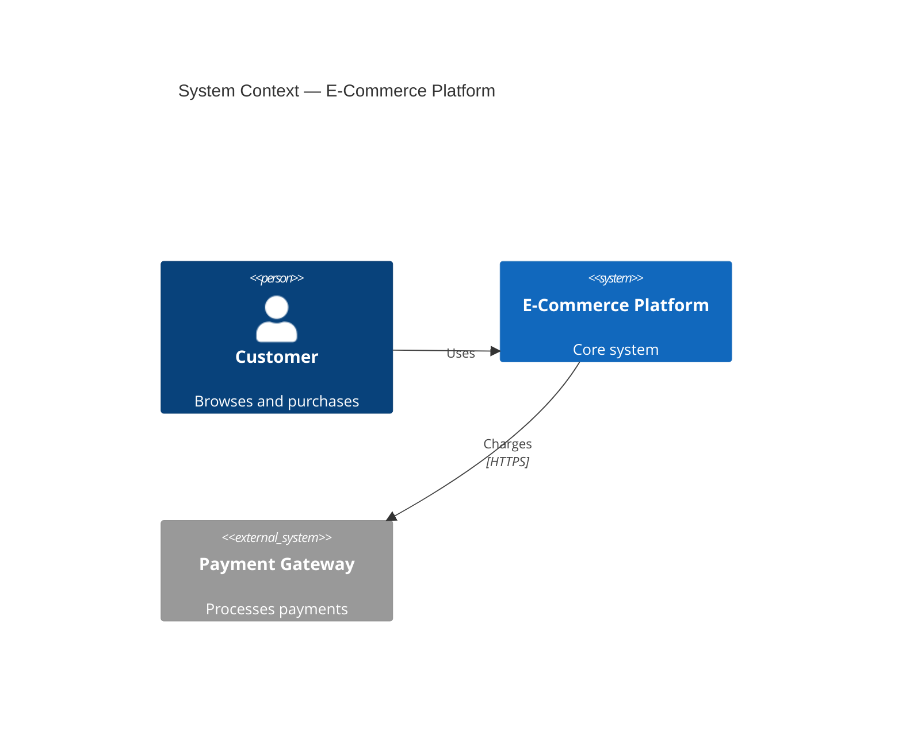
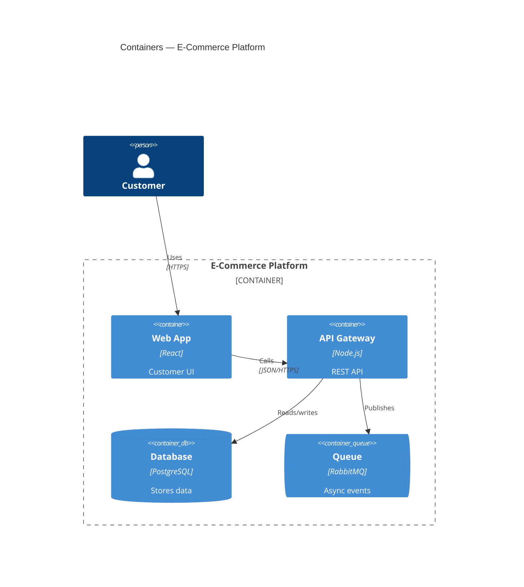
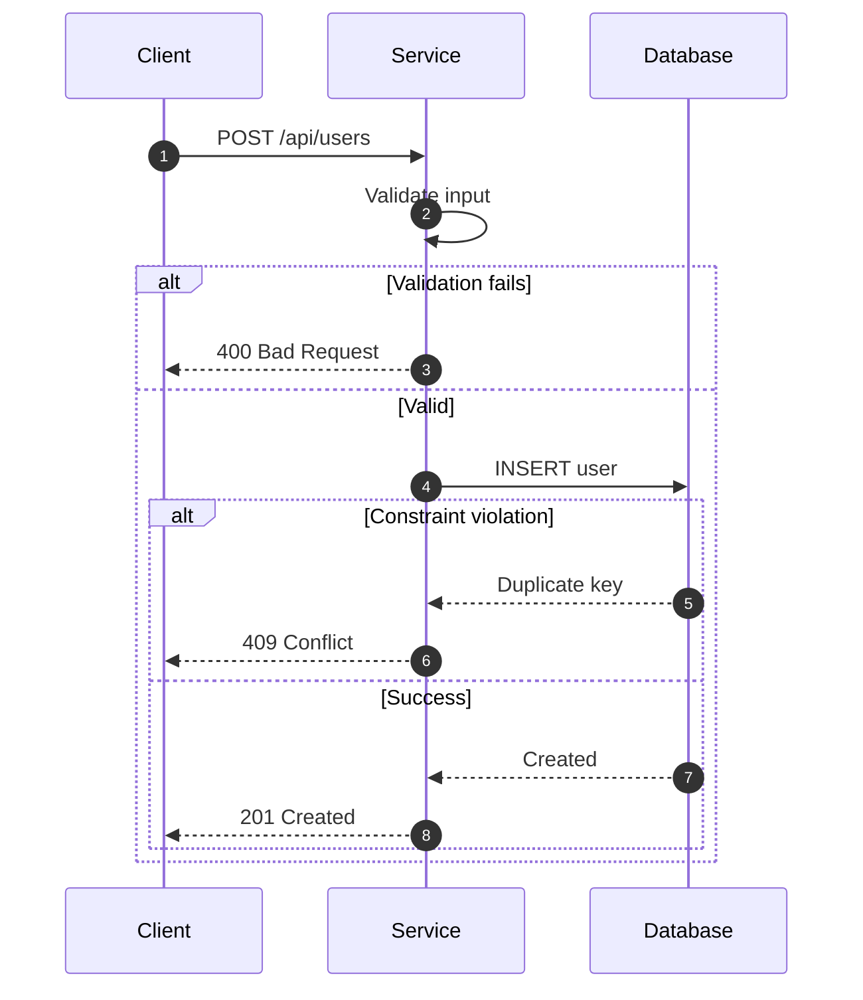
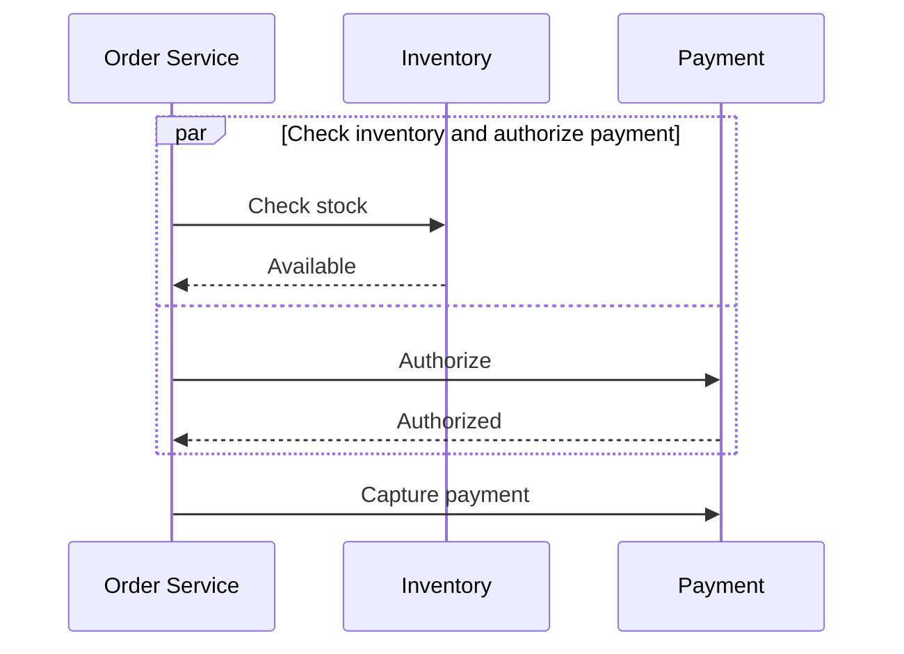
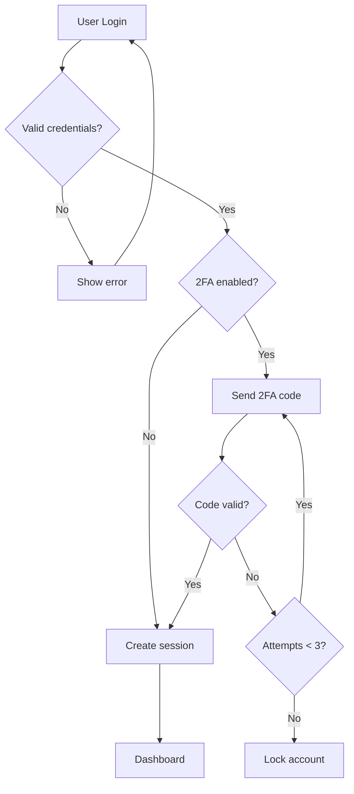
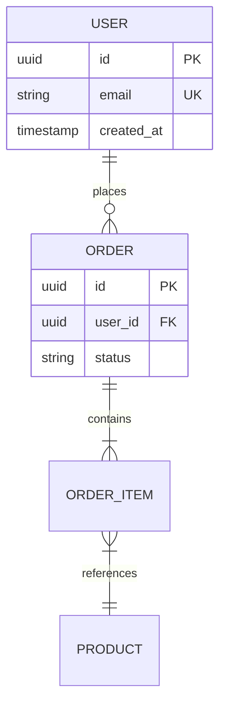
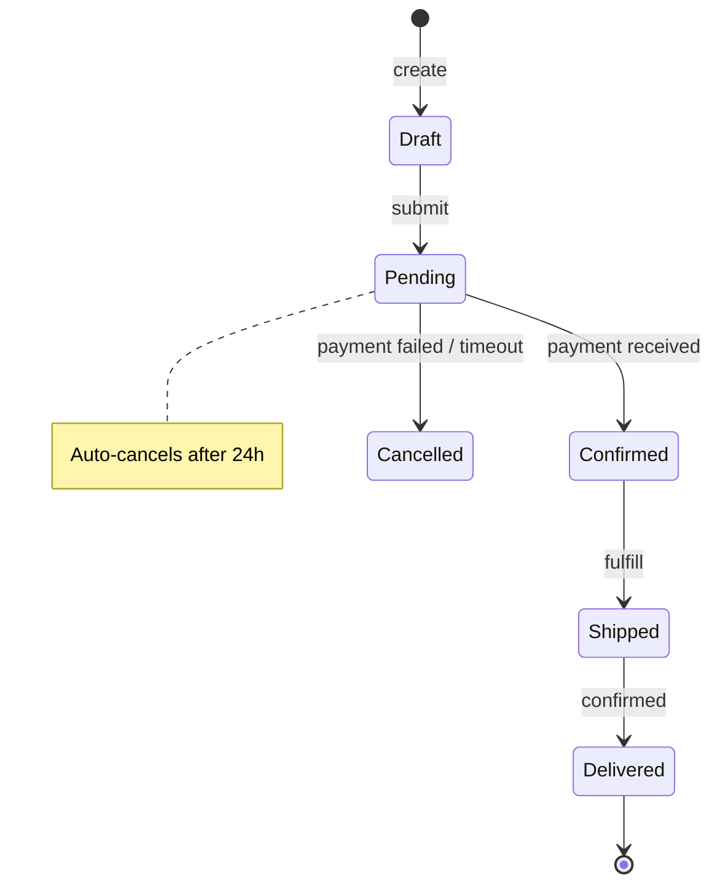
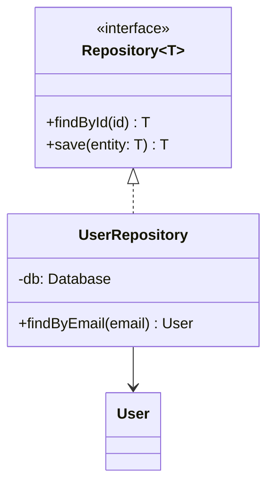

# Diagramming

## Overview

Create maintainable technical diagrams in Mermaid (renders in GitHub, GitLab, and most doc tools). Diagrams live in version control next to code — they must stay in sync or they mislead. This skill covers type selection, syntax, and the parsing footguns that waste the most time.

## Choose the diagram type

| Type            | Use when                                        | Not when                                 |
| --------------- | ----------------------------------------------- | ---------------------------------------- |
| Sequence        | Interactions **over time** across participants  | Showing static structure                 |
| Flowchart       | Decision logic, process/pipeline steps          | Timing between services (use sequence)   |
| State           | An entity's lifecycle + transitions/guards      | Data flow or call order                  |
| ERD             | Data model, tables, cardinality                 | Runtime behavior                         |
| Class           | OO structure, interfaces, inheritance           | Deployment or infra                      |
| C4 (Context)    | System boundary + external actors/systems       | Internal code detail                     |
| C4 (Container)  | Deployable units + their tech + data stores     | Class-level detail                       |

Rule of thumb: **structure → flowchart/C4/class/ERD; behavior over time → sequence; lifecycle → state.** For architecture, prefer C4's layered zoom (Context → Container → Component) over one sprawling diagram.

## Gotchas (Mermaid parsing footguns)

These cause silent render failures or garbled output far more often than logic errors.

- **`end` is reserved in flowcharts.** A lowercase node id `end` breaks the parser. Use `End`, `END`, or quote it: `id["end"]`. Same care with `subgraph`/`click`/`class` as bare ids.
- **Quote labels with special characters.** Parentheses `()`, `{}`, `[]`, `#`, `:`, `;`, and quotes inside a label break parsing — wrap the text: `A["fetch(url)"]`, `B["step: parse"]`. For literal special chars inside a quoted label, use HTML entities: `#quot;` won't work — use `&quot;`, `&amp;`, `&#35;` (for `#`).
- **Line breaks:** ` ` inside a label, not `\n`: `A["Line one Line two"]`.
- **Edge labels** with special chars must be quoted: `A -->|"retry (max 3)"| B`.
- **Leading `o`/`x` on an edge become arrowheads.** `A---oB` renders a circle end, `A---xB` a cross. Add a space (`A --- oB` is still risky) or rename the node so an edge doesn't touch a bare `o`/`x`.
- **Subgraph direction:** set `direction LR` *inside* the subgraph; note that edges crossing subgraph boundaries can override a subgraph's internal direction.
- **Comments** are `%%` on their own line. **Semicolons** are optional line terminators.
- **C4 diagrams** (`C4Context`/`C4Container`) have limited, sometimes experimental layout control and lag other Mermaid features — verify they render in your target tool before committing to them; a plain `flowchart` with subgraphs is a robust fallback.
- **Don't build the giant diagram.** Past ~15-20 nodes it's unreadable and un-reviewable. Split by concern or zoom level. One diagram, one idea.

## Keep diagrams in sync

Diagrams are code artifacts: update the diagram in the same PR as the code it depicts, review it in the diff, and prefer a diagram that's easy to regenerate over a pixel-perfect one that rots. A wrong diagram is worse than none.

## Syntax quick reference

- **Direction:** `flowchart TB` (top-bottom), `LR` (left-right). Sequence diagrams auto-layout.
- **Node shapes:** `[Rect]` process · `(Rounded)` start/end · `{Diamond}` decision · `[(DB)]` store · `((Circle))` connector.
- **Edges:** `-->` solid · `-.->` dotted/optional · `==>` emphasis · `->>` (sequence) sync message · `-->>` async/return.
- **Sequence keywords:** `participant`, `autonumber`, `alt/else/end`, `loop/end`, `par/and/end`, `Note over A,B`.

## Examples

### C4 Context (Level 1)

### C4 Container (Level 2)

### Sequence — request flow with conditionals

### Sequence — parallel work

### Flowchart — decision logic

### ERD

Cardinality: `||` exactly one · `o|` zero-or-one · `}|` one-or-more · `}o` zero-or-more (left char = min, right char = max, read toward the entity).

### State machine

### Class diagram

## Verify before done

- [ ] Diagram renders in the target tool (GitHub/GitLab/docs), not just a local previewer — especially for C4.
- [ ] Labels with `()`, `#`, `:`, `,`, or quotes are wrapped in `"…"`; no bare `end` node id in a flowchart.
- [ ] Diagram type matches intent (behavior→sequence, structure→flowchart/C4, lifecycle→state).
- [ ] ≤~20 nodes; split otherwise. One diagram, one concept.
- [ ] Matches current code; updated in the same PR as the change it depicts.
