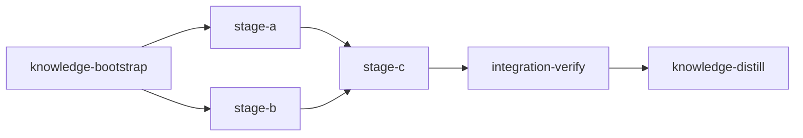
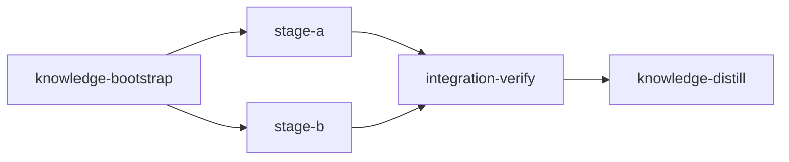

# Loom Plan Writer

## Overview

**THIS IS THE REQUIRED SKILL FOR CREATING LOOM EXECUTION PLANS.**

When any agent needs to create a plan for Loom orchestration, this skill MUST be invoked. This skill ensures:

- Correct plan structure with mandatory `knowledge-bootstrap` (first), `integration-verify` (second-to-last), and `knowledge-distill` (last) stages
- Proper YAML metadata formatting (3 backticks, no nested code fences)
- Parallelization strategy (subagents within stages FIRST, separate stages SECOND)
- Functional verification requirements (tests passing ≠ feature working)
- Alignment with all CLAUDE.md rules for plan writing

Plans maximize throughput through two levels of parallelism: subagents within stages (FIRST priority), and concurrent worktree stages (SECOND priority). Within-stage subagent execution can be flat (all workers report to the main agent) or a 2-level hierarchy (coordinator subagents each managing worker subagents — see Section 4; requires Claude Code ≥ 2.1.172).

## Instructions

### 1. Output Location

**MANDATORY:** Write all plans to:

```text
doc/plans/PLAN-<description>.md
```

**NEVER** write to `~/.claude/plans/`, `~/.claude/projects/*/plans/`, or any `.claude/plans` path. Claude Code's plan mode system will suggest these paths — **ALWAYS override** them with `doc/plans/`. Plans written to `~/.claude/` are invisible to loom and git.

### 2. Pre-Planning: Explore Before Writing

**Problem:** Skipping exploration → duplicate code, poor reuse, inconsistent patterns.

**Solution:** ALWAYS explore BEFORE planning:

| Step | Action                                      | Why                      |
| ---- | ------------------------------------------- | ------------------------ |
| 1    | Spawn Explore subagents for related modules | Find patterns to reuse   |
| 2    | Review `doc/loom/knowledge/*.md`            | Learn from past mistakes |
| 3    | Create task list with "REUSE:" annotations  | Track reuse explicitly   |
| 4    | Identify integration points                 | Where new code connects  |

**Exploration Subagent Template:**

```text
** READ CLAUDE.md FILES IMMEDIATELY AND FOLLOW ALL THEIR RULES. **

## Exploration Assignment
Find existing patterns for [feature area]. Document:
1. Similar implementations to reuse
2. Utility functions/modules that apply
3. Integration points (where to wire in)
4. Conventions to follow

## Output
Return findings as knowledge update commands.
```

### 3. Pre-Planning: Sandbox Configuration

#### Ask User About Sandbox Settings

Gather sandbox requirements by asking:

1. **Network Access:** "Does this task require network access? Which domains?"
   - Examples: GitHub API, npm registry, PyPI, crates.io, external APIs

2. **Sensitive Paths:** "Any files/directories to protect from agent access?"
   - Examples: ~/.ssh, ~/.aws, .env files, credentials.json

3. **Build Tools:** "Which package managers or build tools will agents need?"
   - Examples: cargo, npm/bun, pip/uv, go, docker

**After gathering answers:**

1. Run `loom repair` to detect and fix project issues
2. Merge user requirements with suggestions
3. Add the `sandbox` block to plan YAML

**Sandbox Configuration Reference:**

```yaml
loom:
  version: 1
  sandbox:
    enabled: true # Master switch (default: true)
    auto_allow: true # Auto-grant permissions at stage start
    excluded_commands: # Commands exempt from sandboxing
      - "loom"
    filesystem:
      deny_read: # Paths agents CANNOT read
        - "~/.ssh/**"
        - "~/.aws/**"
        - "~/.config/gcloud/**"
        - "~/.gnupg/**"
      deny_write: # Paths agents CANNOT write
        - ".work/stages/**"
        - "doc/loom/knowledge/**" # Except knowledge/integration-verify stages
      allow_write: # Exceptions to deny rules
        - "src/**"
    network: # ⛔ MUST be struct, NOT string like "deny"
      allowed_domains: [] # Empty = deny all network (or list domains to allow)
      allow_local_binding: false
      allow_unix_sockets: []
```

**Per-Stage Overrides:**

```yaml
- id: my-stage
  sandbox:
    enabled: false # Disable for this stage only
    filesystem:
      allow_write:
        - "build/**" # Additional write access
```

**Special Stage Behavior:**

- `knowledge`, `integration-verify`, and `knowledge-distill` stages automatically get write access to `doc/loom/knowledge/**`

### 3b. Model Selection Per Stage (REQUIRED)

```text
┌────────────────────────────────────────────────────────────────────┐
│  ⚠️  EVERY STAGE MUST SET `model` EXPLICITLY                      │
│                                                                    │
│  The plan author decides opus vs sonnet for each stage based on   │
│  whether the work is ARCHITECTURAL (needs judgment) or EXECUTION  │
│  (follows detailed instructions). This is a planning-time         │
│  decision, not a runtime default.                                 │
└────────────────────────────────────────────────────────────────────┘
```

**Two categories of stage work:**

| Category          | Model               | Reasoning                   | When                                                                        |
| ----------------- | ------------------- | --------------------------- | --------------------------------------------------------------------------- |
| **Architectural** | `model: "opus"` | `reasoning_effort: "xhigh"` | Stage requires design decisions, novel patterns, cross-cutting judgment     |
| **Execution**     | `model: "sonnet"`   | `reasoning_effort: "high"`  | Stage follows detailed instructions, applies existing patterns, well-scoped |

**Architectural stages** (use opus) — the agent must make judgment calls:

- Designing new abstractions, module boundaries, or data models
- Complex debugging requiring multi-file root cause analysis
- Security-sensitive code (auth flows, crypto, input validation)
- Cross-cutting refactors that touch many modules
- Ambiguous requirements where the agent must decide the approach

**Execution stages** (use sonnet) — the agent follows the plan:

- Implementing features with explicit file paths, signatures, and patterns
- Writing tests for existing code
- Boilerplate, scaffolding, config changes
- Applying a pattern that already exists elsewhere in the codebase
- Bug fixes with known root cause and clear fix

**The key tradeoff:** Sonnet is cheaper but **will produce incorrect implementations when given vague instructions.** It does not infer intent, resolve ambiguity, or discover integration points on its own — it follows what you write literally. If a sonnet stage description is missing file paths, signatures, or wiring steps, the agent will guess wrong, pick the wrong pattern, or leave stubs. **Every hour you spend writing detailed sonnet descriptions saves hours of debugging bad output.**

```yaml
# Architectural stage — opus for design decisions
- id: design-auth-system
  model: "opus"
  reasoning_effort: "xhigh"
  description: |
    Design and implement the authentication module. Must decide:
    - Session storage strategy (JWT vs server-side)
    - Token rotation approach
    - Integration with existing middleware...

# Execution stage — sonnet with detailed instructions
- id: add-config-fields
  model: "sonnet"
  reasoning_effort: "high"
  description: |
    Add three fields to AppConfig in src/config.rs:
    1. `auth_secret: String` — JWT signing key, read from AUTH_SECRET env var
    2. `token_ttl: Duration` — token lifetime, default 3600s
    3. `refresh_enabled: bool` — default true
    Follow the existing pattern at src/config.rs:45-60 for env var parsing.
    Wire into src/main.rs:120 where config is constructed...
```

**Sonnet stage descriptions MUST include ALL of the following** (skip any and the agent will guess wrong):

1. **Exact file paths** to create or modify (not just globs)
2. **Function/struct signatures** the agent should implement
3. **Existing patterns to follow** — reference specific `file:line` ranges the agent should read and replicate
4. **Step-by-step subtasks** with clear done criteria — not goals, but instructions
5. **Integration wiring** — which file to add imports, which registry to register in, which test to update
6. **Error handling approach** — which error types to use, how to propagate, what to log

Opus stage descriptions can be higher-level since the agent has the judgment to fill gaps.

**What "too vague for sonnet" looks like:**

```yaml
# BAD — sonnet will guess the wrong file, wrong pattern, and skip wiring
- id: add-retry-logic
  model: "sonnet"
  description: |
    Add retry logic to the HTTP client with exponential backoff.

# GOOD — sonnet has everything it needs to implement correctly
- id: add-retry-logic
  model: "sonnet"
  description: |
    Add retry logic to HttpClient in src/http/client.rs.

    1. Create src/http/retry.rs with a `RetryPolicy` struct:
       - `max_retries: u32` (default 3)
       - `base_delay: Duration` (default 500ms)
       - `max_delay: Duration` (default 30s)
       - Method `delay_for(attempt: u32) -> Duration` using exponential
         backoff with jitter — follow the pattern in src/backoff.rs:12-35
    2. In src/http/client.rs, add `retry_policy: RetryPolicy` field to
       `HttpClient` (line 45). Wrap the `send()` method (line 78-95)
       in a retry loop that catches 429 and 5xx status codes.
    3. Wire retry module into src/http/mod.rs — add `pub mod retry;`
    4. Use `thiserror` for error types, matching src/http/error.rs style.
```

**When in doubt, use opus.** A sonnet stage that fails and needs rework costs more than an opus stage that succeeds the first time.

#### Sonnet stages MUST delegate aggressively — the 200k context window

```text
┌────────────────────────────────────────────────────────────────────┐
│  ⚠️  SONNET HAS A 200k CONTEXT WINDOW — OPUS[1M] HAS 1M            │
│                                                                    │
│  A sonnet stage hits loom's default 65% context budget at ~130k   │
│  tokens and the 75% hard stop at ~150k. The SAME stage on          │
│  opus has ~650k of headroom before the budget warning.         │
│                                                                    │
│  When a sonnet stage's main agent does the bulky work itself, it   │
│  compacts — and compaction forces a full uncached context re-read, │
│  which is slow and token-expensive. The cheap model becomes the    │
│  expensive one.                                                    │
└────────────────────────────────────────────────────────────────────┘
```

The structural fix: **subagents run in their own context windows, and only their final message returns to the main agent.** A sonnet stage that fans out aggressively keeps the main (sonnet) agent's context as a thin coordination ledger — the signal file, subagent prompts, and returned summaries — while the bulky work (reading files, iterating on code, scanning test output) burns *subagent* context that is discarded on return.

When you assign `model: "sonnet"` to a stage, design it so the main agent is a **coordinator, not an implementer**:

- Decompose the stage into subagent assignments that each own a slice of the work — not just for parallelism, but to keep file-reading and code-iteration out of the main context.
- Avoid sonnet stages where the main agent must itself read many large files, run long test loops, or iterate extensively before delegating. If the stage cannot be decomposed that way, it is an **architectural stage** — use `opus` instead.
- A sonnet stage with no subagent assignments is a red flag: it will likely do all the work in the main context and compact. Either add a `SUBAGENT FILE ASSIGNMENTS` block or switch the stage to `opus`.

This is *why* CLAUDE.md Rule 6 says "prefer subagents" — not only token cost, but context-window survival. On opus the 1M window absorbs a heavier main-agent role; on sonnet it does not. When fan-out exceeds ~6 workers, use a 2-level hierarchy (see Section 4): the sonnet main agent manages 2-4 coordinators and absorbs 2-4 compact summaries instead of 12 raw results.

**integration-verify stages:** Always use opus (set automatically if not specified).

**knowledge stages:** Typically sonnet (exploration is well-scoped), but use opus if the codebase is large/unfamiliar and the agent must make strategic decisions about what to explore.

**knowledge-distill stages:** Always sonnet (mechanical curation work — reading memories and writing knowledge updates is well-scoped with no architectural judgment needed).

**Subagent Selection in Descriptions:**

When stage descriptions define subagent work, specify the agent type to match the work category:

```yaml
description: |
  SUBAGENT FILE ASSIGNMENTS:
    Subagent 1 — Feature Implementation (loom-software-engineer):
      Files Owned: src/feature/*.rs
      Files Read-Only: src/config.rs
    Subagent 2 — Tests (loom-software-engineer):
      Files Owned: tests/feature_test.rs
      Files Read-Only: src/feature/*.rs
    Subagent 3 — Security Review (loom-senior-software-engineer):
      Files Owned: (read-only review)
      Note: Uses opus for security judgment
```

Match subagent type to the work:

- Execution work (implementation, tests, boilerplate) → `loom-software-engineer`
- Judgment work (security review, architecture, debugging) → `loom-senior-software-engineer`

### 4. Parallelization Strategy

```text
┌────────────────────────────────────────────────────────────────────┐
│  ⚠️  STAGES ARE EXPENSIVE                                         │
│                                                                    │
│  Each stage creates a git worktree, spawns a new session, and     │
│  costs significant time and tokens. STRONGLY prefer subagents      │
│  within one stage or agent teams over creating additional stages.  │
│                                                                    │
│  Only create a separate stage when:                                │
│  - Files overlap between tasks (merge conflicts)                   │
│  - Code dependency exists (B imports code A creates)               │
│  - Verification checkpoint needed (don't build on broken foundation)│
│                                                                    │
│  If tasks touch DIFFERENT files with no dependencies, use parallel │
│  subagents in ONE stage. This is always cheaper than separate      │
│  stages.                                                           │
└────────────────────────────────────────────────────────────────────┘
```

Pick the strategy whose criteria match the work (criteria-keyed, NOT a ranking):

```text
1.  AGENT TEAMS          - wide-scope exploratory stages needing inter-agent comms
2.  SUBAGENTS (FLAT)     - ~6 or fewer independent concrete tasks in one stage
2a. SUBAGENT HIERARCHY   - >~6 well-defined tasks in 2-4 disjoint territories:
                           coordinator subagents each spawn worker subagents
                           (2-LEVEL CAP - loom policy)
2b. ULTRACODE STAGE      - >=~10 homogeneous units or adversarial verification:
                           set ultracode: true on the stage (workflow orchestration)
3.  STAGES               - file overlap or code dependencies between clusters
```

| Files Overlap? | Inter-agent Comms Needed? | >~6 worker tasks? | Solution                                |
| -------------- | ------------------------- | ----------------- | --------------------------------------- |
| NO             | NO                        | NO                | Same stage, parallel subagents          |
| NO             | NO                        | YES               | Same stage, 2-level hierarchy (Rule 6c) |
| NO             | YES                       | Any               | Same stage, agent team                  |
| YES            | Any                       | Any               | Separate stages, loom merges            |

#### SUBAGENT FILE EXCLUSIVITY (CRITICAL)

- **Each subagent MUST have EXCLUSIVE write access to its files**
- **Two subagents writing the same file = LOST WORK** (overwrites, conflicts)
- **Stage descriptions MUST include a file ownership table**
- If two tasks need to modify the same file, they MUST be in the same subagent OR handled sequentially by the main agent

**File Ownership Table Template:**

| Subagent            | Files Owned (write)  | Files Read-Only |
| ------------------- | -------------------- | --------------- |
| Subagent 1 — [role] | `src/auth/*.rs`      | `src/config.rs` |
| Subagent 2 — [role] | `src/logging/*.rs`   | `src/config.rs` |
| Subagent 3 — [role] | `tests/auth_test.rs` | `src/auth/*.rs` |

#### HIERARCHICAL EXECUTION PLAN BLOCKS (2-LEVEL CAP)

Claude Code ≥ 2.1.172 lets subagents spawn subagents (the platform allows 5 levels); loom policy caps trees at TWO levels: main agent → coordinators → workers. **Workers NEVER spawn subagents.**

**Use a hierarchy when ALL hold:** the work is well-defined (detailed instructions exist — no cross-territory discussion needed); it splits into 2-4 DISJOINT file territories; each territory subdivides into 2+ worker tasks; flat fan-out would force the main agent to author/manage >~6 worker prompts, absorb N raw results into its own context, or serialize waves.

**Do NOT use a hierarchy when:** total worker tasks ≤ ~6 (flat is simpler and cheaper); territories would share files (separate stages instead); cross-territory iteration is needed (agent team); the work is inherently sequential.

**Model mix:** coordinators AND workers default to sonnet. Always spawn workers BY AGENT TYPE (`loom-software-engineer` pins sonnet) — an untyped worker inherits the MAIN session model; on an opus stage that silently makes every worker opus. Opus coordinator only when integrating its territory requires architectural judgment.

**Description-block format** (plain indented text — NO triple backticks inside YAML descriptions):

```yaml
description: |
  Implement 12 API endpoint handlers plus tests.

  Use parallel subagents and skills to maximize performance.

  EXECUTION PLAN - HIERARCHICAL (2-LEVEL CAP):
    Coordinator A - REST endpoints (loom-software-engineer, sonnet):
      Territory: src/api/rest/**
      Workers:
        Worker A1: src/api/rest/users.rs
        Worker A2: src/api/rest/orders.rs
        Worker A3: src/api/rest/billing.rs
        Worker A4: tests/api/rest/
      Verify: cargo test --test rest_api
    Coordinator B - GraphQL resolvers (loom-software-engineer, sonnet):
      Territory: src/api/graphql/**
      Workers: [...]
      Verify: cargo test --test graphql

  Territories are DISJOINT. Workers NEVER spawn subagents.
  Coordinators return compact summaries only. Main agent verifies globally, commits, completes.
```

No Rust schema change is needed for this block — stage descriptions pass verbatim into the signal's `## Assignment` section.

#### ULTRACODE STAGES

`ultracode: true` licenses the stage's spawned session for Workflow orchestration (Claude Code's multi-agent workflow tool — deterministic fan-out/pipeline/verification scripts running potentially tens of agents).

**Set `ultracode: true` when:** the work decomposes into MANY (≳10) homogeneous units (files to migrate, findings to verify, areas to audit) where scripted fan-out + adversarial verification materially beats ad-hoc delegation; or the stage is a high-stakes verification gate that justifies a multi-perspective judge/verify pass.

**Do NOT mark ordinary implementation stages** — a hierarchy or flat subagents cover those at a fraction of the cost. The plan author owns this call and MUST justify it in one sentence in the stage description (why scale pays here).

```yaml
- id: migrate-call-sites
  name: "Migrate 40 call sites to new API"
  stage_type: standard
  model: "sonnet"
  working_dir: "loom"
  ultracode: true
  description: |
    Migrate all 40 call sites of old_api() to new_api() and verify each.
    Ultracode justified: 40 homogeneous migration units benefit from
    scripted fan-out plus adversarial per-site verification.
  acceptance: ["cargo test"]
```

Workflow agents remain subagents: all Rule 5 restrictions apply (no git commit, no `loom stage complete`); the main agent owns git and stage completion, and acceptance criteria remain the loop target. The stage description MAY include a token-budget directive for the workflow (e.g. "+500k tokens for the verification sweep").

**Stage-Specific Defaults:**

- knowledge-bootstrap: Default to TEAM (coordinated exploration, researchers share discoveries that inform each other)
- standard (implementation): Default to SUBAGENTS (concrete file assignments, fire-and-forget). Use a 2-level HIERARCHY for >~6 well-defined worker tasks; `ultracode: true` for ≳10 homogeneous units or adversarial verification; team only for wide/exploratory scope
- integration-verify: Default to TEAM (build + functional + code review tasks that may require iterative fixes)
- knowledge-distill: Default to SINGLE or SUBAGENTS (memory reading + knowledge writing is sequential, not parallel)

### 4b. Stage Necessity Test (MANDATORY)

**BEFORE creating any stage beyond knowledge-bootstrap and integration-verify, evaluate:**

```text
┌─────────────────────────────────────────────────────────────────────┐
│  STAGE NECESSITY TEST - evaluate for EACH proposed stage:           │
│                                                                     │
│  Q1: Does this stage create code that another stage                 │
│      imports/calls/extends?                                         │
│      YES → Separate stages required (code dependency)               │
│      NO  → Continue to Q2                                           │
│                                                                     │
│  Q2: Does this stage write to files that another stage              │
│      also writes to?                                                │
│      YES → Separate stages required (file conflict)                 │
│      NO  → Continue to Q3                                           │
│                                                                     │
│  Q3: Does this stage need a verification checkpoint before          │
│      later work proceeds?                                           │
│      YES → Separate stage justified (quality gate)                  │
│      NO  → MERGE into one stage with parallel subagents             │
└─────────────────────────────────────────────────────────────────────┘
```

```text
┌─────────────────────────────────────────────────────────────────────┐
│  ⚠️  COMMON MISTAKE                                                  │
│                                                                     │
│  ❌ 4 stages editing independent config files:                       │
│     Stage 1: edit nginx.conf                                        │
│     Stage 2: edit docker-compose.yml                                │
│     Stage 3: edit .env.production                                   │
│     Stage 4: edit Caddyfile                                         │
│                                                                     │
│  ✅ 1 stage with 4 parallel subagents:                               │
│     Stage 1: edit all config files                                  │
│       Subagent A: nginx.conf                                        │
│       Subagent B: docker-compose.yml                                │
│       Subagent C: .env.production                                   │
│       Subagent D: Caddyfile                                         │
└─────────────────────────────────────────────────────────────────────┘
```

**WHEN STAGES ARE JUSTIFIED — concrete examples:**

| Scenario                                     | Why Separate Stages                                 |
| -------------------------------------------- | --------------------------------------------------- |
| Data model stage → API stage                 | Code dependency: API imports model types            |
| Same handler file modified by auth + logging | File conflict: both write to same file              |
| Core library → multiple consumers            | Verification checkpoint: consumers need stable base |

### 4c. Memory System (CRITICAL)

When agents work under loom orchestration, they MUST use loom's memory system exclusively:

- **USE:** `loom memory note`, `loom memory decision`, `loom memory question`, `loom memory change`
- **NEVER USE:** Claude Code's built-in auto-memory system (`~/.claude/projects/*/memory/`)
- **NEVER** call Write or Edit on files under `~/.claude/projects/*/memory/` or `~/.claude/plans/`

**Why this matters:** Loom memory is stage-scoped, embedded in agent signals, and curated into permanent knowledge during integration-verify. Claude Code's auto-memory is completely disconnected from loom orchestration — anything saved there is invisible to other stages, invisible to integration-verify, and will not be curated into project knowledge. It is effectively lost work.

**How auto-memory misuse manifests:** Claude Code has a built-in behavior to save "memories" by writing `.md` files to `~/.claude/projects/*/memory/`. When working under loom, this compulsion must be suppressed. If an agent wants to record an insight, decision, or mistake, it should use `loom memory note "..."` — not the Write tool targeting memory files.

Ensure stage descriptions remind agents of this when memory recording is expected. The subagent preamble (CLAUDE.md Rule 5) includes this guidance automatically.

### 5. Stage Description Requirement

**EVERY stage MUST set `model` explicitly** (see Section 3b). Sonnet stages need detailed descriptions; opus stages can be higher-level.

**EVERY stage description MUST include this line:**

```text
Use parallel subagents and skills to maximize performance.
```

This ensures Claude Code instances spawn concurrent subagents for independent tasks.

**Sonnet stages WILL FAIL without implementation-ready descriptions.** Sonnet does not infer missing context — it guesses, and it guesses wrong. Every sonnet stage description MUST include:

- Exact file paths to create/modify (not globs, not "the config file")
- Function/struct signatures to implement (name, params, return type)
- Existing patterns to follow (reference `file:line` — sonnet needs to see the pattern, not imagine it)
- Step-by-step subtasks as instructions, not goals ("add field X to struct at line Y", not "update the struct")
- Integration wiring (which `mod.rs` to update, which registry to register in, which test file to extend)
- Error handling specifics (which error type, how to propagate)

**If you cannot write this level of detail for a stage, use opus instead.** A vague sonnet stage is worse than an opus stage — it costs more in rework than the token savings justify.

**Stage descriptions using subagents MUST also include:**

- A `SUBAGENT FILE ASSIGNMENTS` block listing each subagent with agent type
- Each subagent's owned files and read-only files
- Explicit statement that NO file overlap exists between subagents
- Match subagent type to work: execution → `loom-software-engineer`, judgment → `loom-senior-software-engineer`

**Hierarchical stage descriptions MUST include** an `EXECUTION PLAN - HIERARCHICAL` block (see Section 4): coordinator territories, nested worker file lists, a per-coordinator Verify command, and the statements "Territories are DISJOINT" and "Workers NEVER spawn subagents".

**Ultracode stages MUST include** a one-sentence cost justification in the stage description (why scripted multi-agent scale pays for this work).

**Example in stage description:**

```yaml
description: |
  Implement auth, logging, and metrics modules.

  Use parallel subagents and skills to maximize performance.

  SUBAGENT FILE ASSIGNMENTS:
    Subagent 1 — Auth:
      Files Owned: src/auth/*.rs
      Files Read-Only: src/config.rs
    Subagent 2 — Logging:
      Files Owned: src/logging/*.rs
      Files Read-Only: src/config.rs
    Subagent 3 — Metrics:
      Files Owned: src/metrics/*.rs
      Files Read-Only: src/config.rs

  NO FILE OVERLAP between subagents confirmed.
```

IMPORTANT: Do NOT use triple backticks in YAML descriptions — use plain indented text instead.

### 6. Plan Structure

Every plan MUST follow this structure:

```text
┌─────────────────────────────────────────────────────────────────────┐
│  MANDATORY PLAN STRUCTURE                                           │
│                                                                     │
│  FIRST:  knowledge-bootstrap    (unless knowledge already exists)   │
│  MIDDLE: implementation stages  (parallelized where possible)       │
│  THEN:   integration-verify     (ALWAYS — reviews AND verifies)     │
│  LAST:   knowledge-distill      (ALWAYS — curates memories into knowledge) │
└─────────────────────────────────────────────────────────────────────┘
```

Include a visual execution diagram using Mermaid:



Parallel stages are expressed using Mermaid's `&` operator (e.g., `A --> B & C` means A feeds both B and C concurrently).

### 7. Goal-Backward Verification (MANDATORY - VALIDATED)

```text
┌─────────────────────────────────────────────────────────────────────┐
│  ⚠️ STANDARD STAGES MUST HAVE VERIFICATION FIELDS                   │
│                                                                     │
│  Every stage with `stage_type: standard` MUST define at least ONE:  │
│                                                                     │
│  • truths     - Shell commands that return exit 0 if behavior works │
│  • artifacts  - Files that must exist with real implementation      │
│  • wiring     - Code patterns proving integration                   │
│                                                                     │
│  ⛔ `loom plan verify` and `loom init` REJECT plans that            │
│     violate this requirement                                        │
│                                                                     │
│  Knowledge stages are EXEMPT.                                       │
└─────────────────────────────────────────────────────────────────────┘
```

**Why this is validated:** We have had MANY instances where tests pass but the feature is never wired up. These fields catch that.

**Quick Reference:**

| Field       | Purpose               | Example                                           |
| ----------- | --------------------- | ------------------------------------------------- |
| `truths`    | Observable behaviors  | `"myapp --help"`, `"curl -f localhost:8080"`      |
| `artifacts` | Files that must exist | `"src/feature.rs"`, `"tests/feature_test.rs"`     |
| `wiring`    | Integration patterns  | `source: "src/main.rs"`, `pattern: "mod feature"` |

### 8. Loom Metadata Format

Plans contain embedded YAML wrapped in HTML comments:

````markdown
<!-- loom METADATA -->

```yaml
loom:
  version: 1
  stages:
    - id: stage-id # Required: unique kebab-case identifier
      name: "Stage Name" # Required: human-readable display name
      model: "sonnet" # Required: "sonnet" for execution, "opus" for architectural work
      reasoning_effort: "high" # Required: "high" for sonnet stages, "xhigh" for opus stages
      description: | # Required: full task description for agent
        What this stage must accomplish.

        CRITICAL: Use parallel subagents and skills to maximize performance.

        Tasks:
        - Subtask 1 with requirements
        - Subtask 2 with requirements
      dependencies: [] # Required: array of stage IDs this depends on
      parallel_group: "grp" # Optional: concurrent execution grouping
      acceptance: # Required: verification commands
        - "cargo test"
        - "cargo clippy -- -D warnings"
      files: # Optional: target file globs for scope
        - "src/**/*.rs"
      working_dir: "." # Required: "." for worktree root, or subdirectory like "loom"
      execution_mode: team # Optional hint: single or team, agent decides
      # REQUIRED: At least ONE of truths/artifacts/wiring per stage
      truths: # Observable behaviors proving feature works
        - "myapp --help"
      artifacts: # Files that must exist with real implementation
        - "src/feature/*.rs"
      wiring: # Code patterns proving integration
        - source: "src/main.rs"
          pattern: "use feature"
          description: "Feature module is imported"
```

<!-- END loom METADATA -->
````

**YAML Formatting Rules:**

````text
┌─────────────────────────────────────────────────────────────────────┐
│  ⛔ NEVER PUT TRIPLE BACKTICKS INSIDE YAML DESCRIPTIONS             │
│                                                                     │
│  This BREAKS the YAML parser and causes validation to fail with    │
│  confusing errors (e.g., "missing truths/artifacts" when they      │
│  exist but weren't parsed).                                        │
│                                                                     │
│  ❌ WRONG:  description: |                                          │
│               Here's an example:                                    │
│               ```markdown                                           │
│               ## Title                                              │
│               ```                                                   │
│                                                                     │
│  ✅ CORRECT: description: |                                         │
│               Here's an example:                                    │
│                 ## Title                                            │
│                 Content here (plain indented text)                  │
└─────────────────────────────────────────────────────────────────────┘
````

| Rule                     | Correct                          | Incorrect               |
| ------------------------ | -------------------------------- | ----------------------- |
| Code fence               | 3 backticks                      | 4 backticks             |
| Nested code blocks       | NEVER in descriptions            | Breaks YAML parser      |
| Examples in descriptions | Use plain indented text          | Do NOT use ``` fences   |
| stage_type values        | lowercase/kebab-case             | PascalCase              |
| Path traversal           | NEVER use `../`                  | Causes validation error |
| network config           | `network: {allowed_domains: []}` | `network: deny`         |

#### Shell Command Escaping in YAML (CRITICAL)

Acceptance criteria, truths, and setup commands are shell commands inside YAML strings. **Most acceptance criteria failures are caused by YAML quoting/escaping issues, not incorrect commands.** The command itself may be perfectly valid shell, but YAML consumes or misinterprets characters before the shell ever sees them.

**THE GOLDEN RULES:**

1. **ALWAYS quote YAML string values** — never leave acceptance criteria unquoted
2. **Default to YAML single quotes** (`'...'`) for any command with double quotes, backslashes, or regex patterns — in YAML single quotes, NOTHING is special (no escape sequences)
3. **Use YAML double quotes** (`"..."`) only for simple commands or commands that contain literal single quotes
4. **Simplify commands** — prefer `grep -q`/`rg -q` over pipes; prefer `-F` for fixed strings over regex
5. **Never nest shell invocations** — loom already wraps commands with `sh -c`, so NEVER write `sh -c '...'` in acceptance criteria

**Why YAML single quotes are safer:** In YAML single-quoted strings, the ONLY special sequence is `''` (two single quotes = one literal single quote). Backslashes, double quotes, dollar signs, brackets — all literal. In YAML double-quoted strings, `\` is an escape character and `"` terminates the string.

**Common Escaping Failures and Fixes:**

```yaml
# ━━━ DOUBLE QUOTE CONFLICTS ━━━

# ❌ BREAKS: Inner double quotes terminate the YAML string
acceptance:
  - "grep -q "fn main" src/main.rs"
  # YAML sees: "grep -q " then fn main as bare text — parse error

# ✅ FIX: YAML single quotes make inner double quotes literal
acceptance:
  - 'grep -q "fn main" src/main.rs'

# ━━━ BACKSLASH CONSUMPTION ━━━

# ❌ BREAKS: YAML double quotes consume backslashes
truths:
  - "rg -q 'use\s+crate' src/lib.rs"
  # YAML turns \s into just s — shell sees 'uses+crate'

# ✅ FIX: YAML single quotes preserve backslashes
truths:
  - 'rg -q "use\s+crate" src/lib.rs'

# ━━━ NESTED SHELL QUOTING ━━━

# ❌ WRONG: Don't nest sh -c — loom already wraps with sh -c
acceptance:
  - "sh -c 'grep -q \"pattern\" file'"

# ✅ FIX: Write the command directly
acceptance:
  - 'grep -q "pattern" file'

# ━━━ COMPLEX PATTERNS ━━━

# ❌ FRAGILE: Mixed quotes and regex in YAML double quotes
acceptance:
  - "rg -q \"impl\\s+MyTrait\" src/lib.rs"

# ✅ ROBUST: YAML single quotes — everything is literal
acceptance:
  - 'rg -q "impl\s+MyTrait" src/lib.rs'

# ━━━ FIXED STRING MATCHING ━━━

# ❌ FRAGILE: Regex special chars in pattern
acceptance:
  - 'grep -q "Vec<String>" src/types.rs'
  # The < and > are regex metacharacters in some grep versions

# ✅ ROBUST: Use -F for fixed/literal string matching
acceptance:
  - 'grep -qF "Vec<String>" src/types.rs'
```

**YAML Quoting Decision Table:**

| Command Contains  | Use YAML             | Example                                                                      |
| ----------------- | -------------------- | ---------------------------------------------------------------------------- |
| Nothing special   | Either works         | `"cargo test"`                                                               |
| Double quotes `"` | Single quotes        | `'grep -q "pattern" file'`                                                   |
| Backslashes `\`   | Single quotes        | `'rg "\bword\b" file'`                                                       |
| Regex `[]{}()+*`  | Single quotes        | `'rg -q "fn\s+\w+" file'`                                                    |
| Single quotes `'` | Double quotes        | `"grep -qF \"it's\" file"`                                                   |
| Both quote types  | Double + escape `\"` | `"rg -qF \"it's a \\\"test\\\"\" file"` — or better: restructure the command |

**Prefer robust, simple commands:**

| Fragile Pattern                               | Robust Alternative                                           |
| --------------------------------------------- | ------------------------------------------------------------ |
| `grep "pattern" file \| wc -l \| grep -q "1"` | `grep -qc "pattern" file` or simply `grep -q "pattern" file` |
| `cat file \| grep "pattern"`                  | `grep -q "pattern" file`                                     |
| `test "$(cmd)" = "value"`                     | `cmd \| grep -qxF "value"`                                   |
| Regex with special chars                      | `grep -qF` or `rg -qF` for literal/fixed string matching     |
| `echo "..." \| grep ...`                      | `rg -q "pattern" file` (search file directly)                |

**Cross-Platform Compatibility (Linux + macOS):**

Loom runs on both Linux and macOS. Shell commands in acceptance criteria MUST work on both. Key differences:

| Tool/Feature           | Linux                    | macOS                   | Safe Alternative                         |
| ---------------------- | ------------------------ | ----------------------- | ---------------------------------------- |
| `grep`                 | GNU grep (supports `-P`) | BSD grep (NO `-P` flag) | Use `rg` instead of `grep`               |
| `grep -P` (Perl regex) | Works                    | **FAILS**               | `rg` natively supports Perl regex        |
| `grep -oP`             | Works                    | **FAILS**               | `rg -o`                                  |
| `readlink -f`          | Works                    | **FAILS**               | Avoid; use `test -f` or `test -d`        |
| `sed -i`               | `sed -i 's/...'`         | `sed -i '' 's/...'`     | Don't use `sed` in acceptance — use `rg` |
| `stat` format flags    | `stat -c`                | `stat -f`               | Avoid `stat` in acceptance criteria      |
| `sh -c`                | POSIX sh (dash/bash)     | POSIX sh (zsh backend)  | Stick to POSIX features                  |

**Rules for cross-platform acceptance criteria:**

1. **Use `rg` instead of `grep`** — `rg` (ripgrep) behaves identically on both platforms
2. **Use `rg -qF` for fixed strings, `rg -q` for regex** — never rely on `grep -P`
3. **Use `test -f` / `test -d`** for file/directory existence checks — never `readlink`
4. **Stick to POSIX shell features** — no `[[ ]]`, no `echo -e`, no bash-specific syntax
5. **Prefer built-in loom verification fields** (`artifacts`, `wiring`) over shell commands for file existence and pattern checks

**When in doubt:** Use YAML single quotes and `rg -qF` for fixed string matching. This combination avoids YAML escaping issues, regex interpretation issues, AND cross-platform differences.

**stage_type Field (REQUIRED on every stage):**

| Value                | Use For                   | Special Behavior                              |
| -------------------- | ------------------------- | --------------------------------------------- |
| `knowledge`          | knowledge-bootstrap stage | Can write to doc/loom/knowledge/\*\*          |
| `standard`           | All implementation stages | Cannot write to knowledge files               |
| `integration-verify` | Second-to-last stage      | Can write to doc/loom/knowledge/\*\*, reviews |
| `knowledge-distill`  | Final knowledge curation  | Can write to knowledge, sonnet default        |

**NEVER use PascalCase** (Knowledge, Standard, IntegrationVerify) - the parser rejects these.

**Example — CORRECT way to show code in descriptions:**

```yaml
description: |
  Create the config file with TOML format:
    [settings]
    key = "value"
```

**NEVER** put triple backticks inside YAML descriptions — they break parsing.

#### Working Directory Requirement

The `working_dir` field is **REQUIRED** on every stage. This forces explicit choice of where acceptance criteria run:

```yaml
working_dir: "."      # Run from worktree root
working_dir: "loom"   # Run from loom/ subdirectory
```

**Why required?** Prevents acceptance failures due to forgotten directory context. Every stage must consciously declare its execution directory.

**Path Resolution Formula:**

```text
EXECUTION_PATH = WORKTREE_ROOT / working_dir
```

All acceptance commands, truths, artifacts, and wiring paths resolve relative to `EXECUTION_PATH`. When you write an acceptance criterion, imagine you have `cd`-ed into `EXECUTION_PATH` first — that is where your command runs.

| `working_dir`     | Worktree Root          | Commands run from                    | `Cargo.toml` reference               |
| ----------------- | ---------------------- | ------------------------------------ | ------------------------------------ |
| `"."`             | `.worktrees/my-stage/` | `.worktrees/my-stage/`               | `Cargo.toml` (if at root)            |
| `"loom"`          | `.worktrees/my-stage/` | `.worktrees/my-stage/loom/`          | `Cargo.toml` (NOT `loom/Cargo.toml`) |
| `"packages/core"` | `.worktrees/my-stage/` | `.worktrees/my-stage/packages/core/` | `Cargo.toml` (if it exists there)    |

**Examples:**

```yaml
# Project with Cargo.toml at root
- id: build-check
  acceptance:
    - "cargo test"
  working_dir: "."

# Project with Cargo.toml in loom/ subdirectory
- id: build-check
  acceptance:
    - "cargo test"
  working_dir: "loom"
```

**Mixed directories?** Create separate stages instead of inline `cd`. Each stage = one working directory.

#### Pre-Flight Checklist for Acceptance Criteria (MANDATORY)

**Before writing ANY acceptance criterion, answer these three questions:**

```text
┌─────────────────────────────────────────────────────────────────────┐
│  PRE-FLIGHT: ANSWER BEFORE WRITING ACCEPTANCE CRITERIA              │
│                                                                     │
│  Q1: What is my working_dir?                                        │
│      → All commands execute from WORKTREE_ROOT / working_dir        │
│                                                                     │
│  Q2: Do the build files exist at that path?                          │
│      → If working_dir is "loom", Cargo.toml must be at loom/       │
│      → If working_dir is ".", Cargo.toml must be at repo root      │
│                                                                     │
│  Q3: Are ALL my paths relative to working_dir (not repo root)?      │
│      → If working_dir is "loom", use "src/main.rs" NOT "loom/src/"│
│      → If working_dir is ".", use "loom/src/main.rs" for files     │
│        inside the loom subdirectory                                 │
└─────────────────────────────────────────────────────────────────────┘
```

**Common Path Mistakes and Fixes:**

| Symptom                         | Cause                                           | Fix                                          |
| ------------------------------- | ----------------------------------------------- | -------------------------------------------- |
| `could not find Cargo.toml`     | `working_dir: "."` but Cargo.toml is in `loom/` | Set `working_dir: "loom"`                    |
| `No such file or directory`     | Path not relative to `working_dir`              | Remove redundant prefix                      |
| Double-path `loom/loom/src/...` | `working_dir: "loom"` with `loom/src/...` paths | Use `src/...` (already inside `loom/`)       |
| Binary not found                | Wrong path to compiled binary                   | Use path relative to `working_dir`           |
| `rg` finds nothing              | Searching from wrong directory                  | Check `working_dir` matches where files live |

**Binary path resolution:**

```yaml
# ❌ WRONG: Binary path ignores working_dir context
- id: test-cli
  working_dir: "loom"
  truths:
    - "loom/target/debug/myapp --help"  # Becomes loom/loom/target/debug/myapp

# ✅ CORRECT: Path relative to working_dir
- id: test-cli
  working_dir: "loom"
  truths:
    - "./target/debug/myapp --help"  # Becomes loom/target/debug/myapp

# ✅ ALSO CORRECT: Use installed binary name if on PATH
- id: test-cli
  working_dir: "loom"
  truths:
    - "myapp --help"  # Uses binary from PATH
```

#### Critical: All Paths are Relative to working_dir

This is a very common mistake. ALL path fields resolve relative to `working_dir`:

- `acceptance` commands execute with `working_dir` as CWD
- `artifacts` file paths are checked relative to `working_dir`
- `wiring` source paths are read relative to `working_dir`
- `truths` commands execute with `working_dir` as CWD

```yaml
# ❌ WRONG: working_dir is "loom" but paths redundantly include "loom/"
- id: implement-feature
  working_dir: "loom"
  artifacts:
    - "loom/src/feature.rs" # WRONG: becomes loom/loom/src/feature.rs
  wiring:
    - source: "loom/src/main.rs" # WRONG: becomes loom/loom/src/main.rs
      pattern: "mod feature"

# ✅ CORRECT: Paths relative to working_dir
- id: implement-feature
  working_dir: "loom"
  artifacts:
    - "src/feature.rs" # CORRECT: resolves to loom/src/feature.rs
  wiring:
    - source: "src/main.rs" # CORRECT: resolves to loom/src/main.rs
      pattern: "mod feature"
```

**Rule:** If `working_dir: "loom"`, write paths as if you're already IN `loom/`.

### 9. Goal-Backward Verification Details

**Every `standard` stage MUST have at least ONE of: truths, artifacts, or wiring.**

⛔ **This is VALIDATED by `loom plan verify` (read-only) and `loom init` — plans will be REJECTED if standard stages lack these fields.**

Knowledge stages are exempt (they have different purposes).

These fields verify the feature actually works, not just that tests pass:

| Field       | Purpose                                        | Example                                             |
| ----------- | ---------------------------------------------- | --------------------------------------------------- |
| `truths`    | Observable behaviors proving feature works     | `"myapp --help"`, `"curl -f localhost:8080/health"` |
| `artifacts` | Files that must exist with real implementation | `"src/auth/*.rs"`, `"tests/auth_test.rs"`           |
| `wiring`    | Code patterns proving integration              | source + pattern + description                      |

**Why required?** We have had MANY instances where tests pass but the feature is never wired up or functional. These fields catch that.

```yaml
# Example: CLI command stage
truths:
  - "myapp new-command --help" # Command is registered and callable
artifacts:
  - "src/commands/new_command.rs" # Implementation file exists
wiring:
  - source: "src/main.rs"
    pattern: "mod new_command"
    description: "Command module is imported in main"
  - source: "src/cli.rs"
    pattern: "NewCommand"
    description: "Command is registered in CLI"
```

**Minimum requirement:** At least ONE field with at least ONE entry. More is better for critical stages.

### 10. Knowledge Bootstrap Stage (First)

Captures codebase understanding before implementation:

```yaml
- id: knowledge-bootstrap
  name: "Bootstrap Knowledge Base"
  description: |
    MANDATORY first stage. Read existing doc/loom/knowledge AND .work/memory files!

    Use parallel subagents and skills to maximize performance.

    Step 0 - CHECK EXISTING KNOWLEDGE:
      Run: loom knowledge check
      Review output to identify gaps.

      IF coverage < 50% OR architecture shows INCOMPLETE:
        Run: loom map --deep
        This creates structural baseline without consuming your context.

    Step 1 - ARCHITECTURE MAPPING (if still needed after map):
      Before any other exploration, map the high-level architecture:
        - Core abstractions and their relationships
        - Data flow between major components
        - Module boundaries and dependencies
        - Extension points and plugin architecture
        - Write findings to architecture.md

    Step 2 - PARALLEL EXPLORATION (for semantic gaps):
      Based on loom knowledge check output, spawn Explore subagents:

      Subagent 1 - Entry Points:
        Assignment: Document CLI commands, API endpoints, event handlers
        Files owned: (read-only exploration)
        Output: loom knowledge update entry-points "..."

      Subagent 2 - Patterns:
        Assignment: Identify error handling, state management, data flow patterns
        Files owned: (read-only exploration)
        Output: loom knowledge update patterns "..."

      Subagent 3 - Conventions:
        Assignment: Document naming, file structure, testing patterns
        Files owned: (read-only exploration)
        Output: loom knowledge update conventions "..."

      IMPORTANT: Spawn these as parallel Task tool calls.

    CRITICAL: Use loom knowledge CLI commands, NOT Write/Edit tools.

    Commands to use:
      loom knowledge init              # If not initialized
      loom knowledge check             # Check existing coverage
      loom map --deep                  # If coverage < 50%
      loom knowledge update architecture "## Component\n\nRelationships..."
      loom knowledge update entry-points "## Section\n\nContent..."
      loom knowledge update patterns "## Pattern\n\nContent..."
      loom knowledge update conventions "## Convention\n\nContent..."

    For long content, use heredoc/stdin:
      loom knowledge update patterns - <<'EOF'
      ## Section Title
      Content here, can be as long as needed.
      EOF

    IMPORTANT: Before completing, review existing mistakes.md to avoid repeating errors.

    MEMORY & KNOWLEDGE RECORDING:
    - Record insights as you go: loom memory note "observation"
    - Record decisions: loom memory decision "choice" --context "why"
    - Record mistakes as actionable prevention rules:
        loom knowledge update mistakes "## [Short description]
        **What happened:** [What went wrong]
        **Why:** [Root cause]
        **Prevention:** [How to detect earlier]
        **Fix:** [What to do instead]"
    - Before completing: loom memory list (verify insights captured)

    ⛔ NEVER use Claude Code's auto-memory (~/.claude/projects/*/memory/).
    ALL memory/knowledge goes through loom memory and loom knowledge commands.
  dependencies: []
  acceptance:
    - "loom knowledge check --min-coverage 50"
    - 'rg -q "## " doc/loom/knowledge/architecture.md'
    - 'rg -q "## " doc/loom/knowledge/entry-points.md'
    - 'rg -q "## " doc/loom/knowledge/patterns.md'
    - 'rg -q "## " doc/loom/knowledge/conventions.md'
  files:
    - "doc/loom/knowledge/**"
  working_dir: "." # REQUIRED: "." for worktree root
  # REQUIRED: At least one verification field
  artifacts:
    - "doc/loom/knowledge/architecture.md"
    - "doc/loom/knowledge/entry-points.md"
```

**Skip ONLY if:** `doc/loom/knowledge/` already populated AND `loom knowledge check` shows coverage ≥ 50%.

### 11. Integration Verify Stage (Second-to-Last)

Verifies all work integrates correctly after merges AND that the feature actually works:

```text
┌─────────────────────────────────────────────────────────────────────┐
│  ⚠️ CRITICAL: TESTS PASSING ≠ FEATURE WORKING                       │
│                                                                     │
│  We have had MANY instances where:                                  │
│  - All tests pass                                                   │
│  - Code compiles                                                    │
│  - But the feature is NEVER WIRED UP or FUNCTIONAL                  │
│                                                                     │
│  integration-verify MUST include FUNCTIONAL VERIFICATION:           │
│  - Can you actually USE the feature?                                │
│  - Is it wired into the application (routes, UI, CLI)?              │
│  - Does it produce the expected user-visible behavior?              │
└─────────────────────────────────────────────────────────────────────┘
```

```yaml
- id: integration-verify
  name: "Integration Verification"
  description: |
    Final integration verification - runs AFTER all feature stages complete.

    Use parallel subagents and skills to maximize performance.

    CRITICAL: This stage must verify FUNCTIONAL INTEGRATION, not just tests passing.
    Code that compiles and passes tests but is never wired up is USELESS.

    ⛔ NEVER use Claude Code's auto-memory (~/.claude/projects/*/memory/).
    ALL memory/knowledge goes through loom memory and loom knowledge commands.

    CONTEXT GATHERING (FIRST — before any verification):
    0a. Read the plan file from doc/plans/ (check .work/config.toml for source_path)
    0b. Read ALL stage memories: loom memory show --all
    0c. Read doc/loom/knowledge/*.md for architecture context and known mistakes

    ⛔ ZERO TOLERANCE: ALL compiler warnings, linter errors, test failures must be
    FIXED (not suppressed). Nothing is "pre-existing" or "too trivial." If fixing
    is genuinely blocked, report as a blocker with a clear reason.

    BUILD & TEST:
    1. Run full test suite (all tests, not just affected)
    2. Run linting with warnings as errors
    3. Verify build succeeds
    4. Check for unintended regressions

    CODE REVIEW (MANDATORY — use loom-code-reviewer agents):
    5. Spawn PARALLEL loom-code-reviewer subagents:
       - security review (loom-code-reviewer + /loom-security-audit): OWASP Top 10,
         auth flaws, input validation, secrets, credential management, dependency
         vulnerabilities
       - architecture review (loom-code-reviewer): code organization,
         design patterns, performance, documentation, maintainability
       - test coverage (loom-code-reviewer): unit test coverage gaps,
         integration tests, edge cases, missing assertions
    6. Fix ALL issues found by reviewers using loom-senior-software-engineer
       or loom-software-engineer (loom-code-reviewer is read-only)
    7. Verify no code duplication, proper separation of concerns

    FUNCTIONAL VERIFICATION (MANDATORY):
    8. Verify the feature is actually WIRED INTO the application:
       - For CLI: Is the command registered and callable?
       - For API: Is the endpoint mounted and reachable?
       - For UI: Is the component rendered and interactive?
    9. Execute a manual smoke test of the PRIMARY USE CASE:
       - Run the actual feature end-to-end
       - Verify it produces expected output/behavior
       - Document the test steps and results
    10. Verify integration points with existing code:
        - Are callbacks/hooks connected?
        - Are events being published/subscribed?
        - Are dependencies injected correctly?

    NOTE: Knowledge distillation and documentation updates are handled
    by the knowledge-distill stage that runs after this stage.
    Focus this stage on BUILD, CODE REVIEW, and FUNCTIONAL VERIFICATION only.
    Record your own discoveries to loom memory so knowledge-distill can curate them.
  dependencies: ["stage-a", "stage-b", "stage-c"] # ALL feature stages
  acceptance:
    - "cargo test"
    - "cargo clippy -- -D warnings"
    - "cargo build"
    # ADD FUNCTIONAL ACCEPTANCE CRITERIA - examples:
    # - 'myapp --help | rg -q "new-command"'  # CLI wired
    # - "curl -sf localhost:8080/api/new-endpoint"  # API wired
    # - 'rg -qF "NewComponent" src/app/routes.tsx'  # UI wired
  files:
    - "README.md"
    - "CONTRIBUTING.md"
    - "doc/**/*.md"
  working_dir: "." # REQUIRED: "." for worktree root, or subdirectory like "loom"
  # REQUIRED: At least one verification field
  truths:
    - "myapp new-command --help" # Feature is callable (adapt to YOUR feature)
  wiring:
    - source: "src/main.rs"
      pattern: "new_feature"
      description: "Feature is wired into main"
```

**Why integration-verify is mandatory:**

| Reason                  | Explanation                                        |
| ----------------------- | -------------------------------------------------- |
| Isolated worktrees      | Feature stages test locally, not globally          |
| Merge conflicts         | Individual tests pass but merged code may conflict |
| Cross-stage regressions | Stage A change may break Stage B functionality     |
| Single verification     | One authoritative pass/fail for entire plan        |
| **Wiring verification** | **Features must be connected to actually work**    |
| **Functional proof**    | **Smoke test proves the feature is usable**        |

### 11b. Knowledge Distill Stage (After Integration-Verify)

Curates all stage memories into permanent knowledge. Runs AFTER integration-verify — both are mandatory bookend stages.

````yaml
- id: knowledge-distill
  name: "Knowledge Distillation"
  stage_type: knowledge-distill
  model: "sonnet"
  reasoning_effort: "high"
  description: |
    Knowledge distillation — runs after integration-verify to curate all stage
    memories into permanent knowledge files.

    ⛔ NEVER use Claude Code's auto-memory (~/.claude/projects/*/memory/).
    ALL memory/knowledge goes through loom memory and loom knowledge commands.

    CONTEXT GATHERING (FIRST):
    1. Read the plan file from doc/plans/ (check .work/config.toml for source_path)
    2. Read ALL stage memories: loom memory show --all
    3. Read doc/loom/knowledge/*.md to understand current knowledge state

    MEMORY CURATION:
    4. Synthesize all stage memories — find patterns, mistakes, and decisions worth preserving
    5. Curate mistakes as actionable prevention rules:
       loom knowledge update mistakes "## [Short description]
       **What happened:** [What went wrong]
       **Why:** [Root cause]
       **Prevention:** [How to detect earlier]
       **Fix:** [What to do instead]"
    6. Curate reusable patterns: loom knowledge update patterns "..."
    7. Curate architectural decisions: loom knowledge update architecture "..."
    8. Curate discovered conventions: loom knowledge update conventions "..."
    9. If 2+ stages hit the same mistake, document the root cause

    KNOWLEDGE REVIEW:
    10. Run: loom review
    11. Check for stale or outdated entries
    12. Remove entries that no longer apply
    13. Update architecture.md if structure changed during this plan

    DOCUMENTATION UPDATE (MANDATORY):
    14. Review user-facing documentation files (README.md, CONTRIBUTING.md, etc.)
    15. Update documentation to reflect changes made by this plan:
        - New CLI commands, features, config options, workflows
        - Changed behavior or API surfaces
        - Removed functionality (remove stale references)
    16. Only update sections relevant to the changes — do NOT rewrite entire files
    17. If no user-facing behavior changed, skip but record WHY in memory
  dependencies: ["integration-verify"]
  acceptance:
    - 'rg -q "## " doc/loom/knowledge/architecture.md'
    - 'rg -q "## " doc/loom/knowledge/patterns.md'
  files:
    - "doc/loom/knowledge/**"
    - "README.md"
    - "CONTRIBUTING.md"
  working_dir: "."
````

**Why knowledge-distill is mandatory (not optional):**

| Reason             | Explanation                                                                                |
| ------------------ | ------------------------------------------------------------------------------------------ |
| Context isolation  | integration-verify runs build, tests, code review — distillation needs a fresh context     |
| Focus              | integration-verify focuses on build/test/review; distillation focuses on learning curation |
| Sequential         | Must run after integration-verify to capture its discoveries in memory                     |
| Sonnet-friendly    | Mechanical curation work is well-scoped, no architectural judgment needed                  |
| Permanent learning | Without this stage, all session memories are lost when the plan completes                  |

**Skip ONLY if:** The plan genuinely produces no new knowledge worth preserving (rare). When in doubt, include it.

---

### 12. Memory Recording in Stage Descriptions

**Every stage description should remind agents to record memory.** Memory persists insights across sessions and prevents repeated mistakes.

```text
┌─────────────────────────────────────────────────────────────────────┐
│  ⚠️  IMPLEMENTATION STAGES: Use `loom memory` ONLY                   │
│                                                                     │
│  Implementation stages must NEVER use `loom knowledge update`.      │
│  Only knowledge-bootstrap, integration-verify, AND                  │
│  knowledge-distill stages can write to knowledge files directly.    │
│                                                                     │
│  Memory gets curated into knowledge during knowledge-distill.       │
└─────────────────────────────────────────────────────────────────────┘
```

Include a MEMORY RECORDING block in stage descriptions:

```yaml
description: |
  [Task description here]

  MEMORY RECORDING (use loom memory ONLY — never loom knowledge, never auto-memory):
  ⛔ NEVER use Claude Code's auto-memory (~/.claude/projects/*/memory/)
  ⛔ NEVER use loom knowledge update (reserved for knowledge-bootstrap/integration-verify)
  Record IMMEDIATELY when these happen — not at stage end:
  - MISTAKE: tried X, failed → loom memory note "mistake: tried X, failed because Y, fixed by Z"
  - DECISION: chose X over Y → loom memory decision "chose X" --context "Y was worse because Z"
  - SURPRISE: unexpected behavior → loom memory note "found: description in file:line"
  - GOTCHA: trap for future agents → loom memory note "gotcha: X seems right but actually Y"
  Do NOT record: procedural actions, obvious outcomes, task restatements

  SUBAGENT MEMORY — subagents MUST also record memories:
  Include in every subagent Task prompt: "Record mistakes, decisions, and surprises
  using loom memory. Do NOT record procedural actions like 'read file' or 'ran tests'."
```

**Why this is mandatory:**

| Benefit                | Explanation                                               |
| ---------------------- | --------------------------------------------------------- |
| Insight persistence    | Memory entries persist across sessions and context resets |
| Mistake prevention     | Curated mistakes become knowledge that future agents read |
| Decision documentation | Records WHY choices were made, not just what was done     |
| Learning transfer      | Memory → Knowledge curation makes lessons permanent       |

**Subagent Memory Recording:**

Subagents (spawned via Task tool) MUST also record memories. The subagent preamble in CLAUDE.md includes memory guidance, but stage descriptions should reinforce it:

```yaml
description: |
  [Task description]

  SUBAGENT FILE ASSIGNMENTS:
  ...

  SUBAGENT MEMORY — ALL subagents must record memories:
  - Mistakes and corrections: loom memory note "mistake: ..."
  - Non-obvious decisions: loom memory decision "..." --context "..."
  - Surprising discoveries: loom memory note "found: ..."
  - Do NOT record procedural actions ("read file", "ran tests", "spawned agents")
```

**Why subagent memory matters:**

- Subagent context is lost when the subagent completes — memory is the ONLY way to preserve insights
- Main agents cannot observe subagent mistakes — if the subagent doesn't record them, they're lost forever
- Integration-verify reads memory to curate knowledge — subagent insights are valuable input

### 13. Memory vs Knowledge Rules

**CRITICAL: Different stages have different recording permissions.**

| Stage Type            | `loom memory` | `loom knowledge`                                                           |
| --------------------- | ------------- | -------------------------------------------------------------------------- |
| knowledge-bootstrap   | YES           | YES                                                                        |
| Implementation stages | YES (ONLY)    | **FORBIDDEN**                                                              |
| integration-verify    | YES           | NO (focused on build/test/review — record to memory for knowledge-distill) |
| knowledge-distill     | YES           | YES (curate from memory)                                                   |

**Why this separation?**

- **Memory** is stage-scoped and temporary - captures all insights during work
- **Knowledge** is permanent and shared across all stages - only proven patterns belong here
- Only after full integration (integration-verify) do we know which insights are worth keeping permanently

**The Workflow:**

1. **knowledge-bootstrap**: Directly writes to knowledge files (architecture, patterns, conventions)
2. **Implementation stages**: Record EVERYTHING to memory, NEVER touch knowledge
3. **integration-verify**: Focused on build, test, code review, functional verification — record own discoveries to memory, NO knowledge writes
4. **knowledge-distill**: Reads all stage memories, curates valuable insights using `loom knowledge update`

**Implementation Stage Rule:**

During implementation stages, you MUST:

- Record insights with `loom memory note "..."`
- Record decisions with `loom memory decision "..." --context "..."`
- **NEVER** use `loom knowledge update` - this is FORBIDDEN

**Exception:** If you discover a CRITICAL MISTAKE that would block other stages, record it immediately with `loom knowledge update mistakes "..."` AND document why in your commit message.

### 14. Plan Document Structure

**Plans have TWO sections: human-readable content FIRST, YAML metadata LAST.**

```text
┌─────────────────────────────────────────────────────────────────────┐
│  PLAN DOCUMENT STRUCTURE                                            │
│                                                                     │
│  1. HUMAN-READABLE SECTION (TOP)                                    │
│     - Title, overview, goals                                        │
│     - Execution diagram                                             │
│     - Stage descriptions in plain language                          │
│     - Each stage: purpose, tasks, files, acceptance                 │
│                                                                     │
│  2. YAML METADATA (BOTTOM)                                          │
│     - Wrapped in <!-- loom METADATA --> comments                    │
│     - Machine-parseable stage definitions                           │
│     - Same information as above, in structured format               │
└─────────────────────────────────────────────────────────────────────┘
```

**Why this structure?**

| Benefit            | Explanation                                                |
| ------------------ | ---------------------------------------------------------- |
| Human review       | Users can quickly understand the plan without parsing YAML |
| Context for agents | Stage descriptions give agents fuller understanding        |
| Maintainability    | Humans can review/edit the readable section easily         |
| Machine processing | YAML at bottom still enables loom CLI parsing              |

### 15. After Writing Plan

1. Write plan to `doc/plans/PLAN-<name>.md`
2. **VALIDATE the plan** by running `loom plan verify doc/plans/PLAN-<name>.md`
   - This parses the YAML, validates stage structure (bookends, dependencies, required fields), checks sandbox config, and builds the execution DAG
   - `loom plan verify` is read-only — it does NOT create `.work/` or initialize anything. The user must run `loom init` separately before `loom run`.
   - If validation **fails**: read the error output, fix the plan file, and re-run `loom plan verify` until it passes
   - If validation **succeeds**: the plan is structurally valid and ready for the user to initialize
3. **STOP** - Do NOT implement
4. Tell user:
   > Plan written to `doc/plans/PLAN-<name>.md` and validated with `loom plan verify` (no side effects — `.work/` has not been created). Please review, then initialize and run the plan:
   >
   > ```bash
   > loom init doc/plans/PLAN-<name>.md
   > loom run
   > ```
>
1. Wait for user feedback

**The plan file IS your deliverable.** Never proceed to implementation.

## Best Practices

1. **Subagents First**: Always maximize parallelism within stages before creating separate stages
2. **Explicit Dependencies**: Never create unnecessary sequential dependencies
3. **Clear File Scopes**: Define `files:` arrays to make overlap analysis explicit
4. **Actionable Descriptions**: Each description should be a complete task specification
5. **Testable Acceptance**: Every acceptance criterion must be a runnable command that works on BOTH Linux and macOS
6. **Bookend Compliance**: Always include knowledge-bootstrap first, integration-verify second-to-last, and knowledge-distill last — all three are mandatory bookend stages
7. **Working Directory**: Every stage must declare its `working_dir` explicitly — run the pre-flight checklist before writing criteria
8. **Goal-Backward Verification**: Every `standard` stage MUST have at least one of `truths`, `artifacts`, or `wiring` (VALIDATED - plans will be REJECTED without this)
9. **YAML Single Quotes for Commands**: Default to YAML single quotes (`'...'`) for acceptance/truths commands containing double quotes, backslashes, or regex — prevents YAML escaping from mangling the command
10. **Use `rg` over `grep`**: `rg` (ripgrep) works identically on Linux and macOS; `grep` has BSD vs GNU differences that cause cross-platform failures

## Examples

### Example 1: Parallel Stages (No File Overlap)

```yaml
# Good - stages can run concurrently
stages:
  - id: add-auth
    dependencies: ["knowledge-bootstrap"]
    files: ["src/auth/**"]
    working_dir: "."
    artifacts: ["src/auth/mod.rs"]
  - id: add-logging
    dependencies: ["knowledge-bootstrap"]
    files: ["src/logging/**"]
    working_dir: "."
    artifacts: ["src/logging/mod.rs"]
  - id: integration-verify
    dependencies: ["add-auth", "add-logging"]
    working_dir: "."
    truths: ["myapp --help"]
```

### Example 2: Sequential Stages (Same Files)

```yaml
# Both touch src/api/handler.rs - must be sequential
stages:
  - id: add-auth-to-handler
    dependencies: ["knowledge-bootstrap"]
    files: ["src/api/handler.rs"]
    working_dir: "."
    wiring:
      - source: "src/api/handler.rs"
        pattern: "auth_middleware"
        description: "Auth middleware applied to handler"
  - id: add-logging-to-handler
    dependencies: ["add-auth-to-handler"] # Sequential
    files: ["src/api/handler.rs"]
    working_dir: "."
    wiring:
      - source: "src/api/handler.rs"
        pattern: "log_request"
        description: "Request logging added to handler"
  - id: integration-verify
    dependencies: ["add-logging-to-handler"]
    working_dir: "."
    truths: ["curl -f localhost:8080/api/health"]
```

### Example 3: Complete Plan Template

````markdown
# Plan: [Title]

## Overview

[2-3 sentence description of what this plan accomplishes and why.]

## Goals

- [Primary goal 1]
- [Primary goal 2]
- [Any constraints or non-goals]

## Execution Diagram



Parallel stages are expressed using Mermaid's `&` operator. Each node is a worktree stage.

---

## Stages

### 1. Knowledge Bootstrap

**Purpose:** Explore codebase and populate knowledge base before implementation.

**Tasks:**

- Map high-level architecture and component relationships
- Identify entry points (CLI commands, API endpoints, main modules)
- Document patterns (error handling, state management, idioms)
- Record conventions (naming, file structure, testing)

**Files:** `doc/loom/knowledge/**`

**Acceptance:** Knowledge files contain meaningful sections with `## ` headers.

---

### 2. Feature A

**Purpose:** [What Feature A accomplishes]

**Dependencies:** knowledge-bootstrap

**Tasks:**

- [Specific task 1 with clear requirements]
- [Specific task 2 with clear requirements]
- Use parallel subagents for independent subtasks

**Files:** `src/feature_a/**`

**Acceptance:** `cargo test` passes, feature module exists.

**Verification:** `src/feature_a/mod.rs` exists with implementation.

---

### 3. Feature B

**Purpose:** [What Feature B accomplishes]

**Dependencies:** knowledge-bootstrap (runs parallel with Feature A)

**Tasks:**

- [Specific task 1 with clear requirements]
- [Specific task 2 with clear requirements]
- Use parallel subagents for independent subtasks

**Files:** `src/feature_b/**`

**Acceptance:** `cargo test` passes, feature module exists.

**Verification:** `src/feature_b/mod.rs` exists with implementation.

---

### 4. Integration Verification

**Purpose:** Verify all features are wired up and functional, including code review. Does NOT handle knowledge distillation or documentation — those are in the next stage.

**Dependencies:** stage-a, stage-b (all implementation stages)

**Tasks:**

_Build & Test:_

- Run full test suite (all tests, not just affected)
- Run linting with warnings as errors
- Verify build succeeds (debug and release)

_Code Review (MANDATORY):_

- Spawn parallel review subagents (security-engineer, senior-software-engineer, /loom-testing skill)
- Fix ALL issues found - do not just report them
- Verify no code duplication, proper separation of concerns

_Functional Verification (CRITICAL):_

- Verify features are WIRED INTO the application (not just compiled)
- Execute smoke test of primary use case end-to-end
- Confirm user-visible behavior works as expected

**Files:** (no documentation changes — handled by knowledge-distill)

**Acceptance:** Build passes, tests pass, features callable via CLI/API.

**Verification:** `myapp --help` shows new features; `src/main.rs` imports feature modules.

---

### 5. Knowledge Distillation

**Purpose:** Curate all stage memories into permanent knowledge files and update user-facing documentation.

**Dependencies:** integration-verify

**Tasks:**

_Memory Curation:_

- Read all stage memories and synthesize patterns, mistakes, and decisions
- Write actionable prevention rules to knowledge/mistakes.md
- Curate reusable patterns, architectural decisions, conventions

_Knowledge Review:_

- Run `loom review`, remove stale entries, update architecture.md if changed

_Documentation Update:_

- Update README.md, CONTRIBUTING.md, and other user-facing docs to reflect plan changes
- Only update relevant sections — do NOT rewrite entire files

**Files:** `doc/loom/knowledge/**`, `README.md`, `CONTRIBUTING.md`

**Acceptance:** Knowledge files contain sections with `## ` headers.

---

<!-- loom METADATA -->

```yaml
loom:
  version: 1
  stages:
    - id: knowledge-bootstrap
      name: "Bootstrap Knowledge Base"
      stage_type: knowledge
      description: |
        Explore codebase and populate doc/loom/knowledge/.

        Use parallel subagents and skills to maximize performance.

        Tasks:
        - Identify entry points and main modules
        - Document patterns and conventions
      dependencies: []
      acceptance:
        - 'rg -q "## " doc/loom/knowledge/entry-points.md'
      files:
        - "doc/loom/knowledge/**"
      working_dir: "."
      artifacts:
        - "doc/loom/knowledge/architecture.md"
        - "doc/loom/knowledge/entry-points.md"

    - id: stage-a
      name: "Feature A"
      stage_type: standard
      description: |
        Implement feature A.

        Use parallel subagents and skills to maximize performance.

        Tasks:
        - Task 1
        - Task 2
      dependencies: ["knowledge-bootstrap"]
      acceptance:
        - "cargo test"
      files:
        - "src/feature_a/**"
      working_dir: "."
      artifacts:
        - "src/feature_a/mod.rs"

    - id: stage-b
      name: "Feature B"
      stage_type: standard
      description: |
        Implement feature B.

        Use parallel subagents and skills to maximize performance.

        Tasks:
        - Task 1
        - Task 2
      dependencies: ["knowledge-bootstrap"]
      acceptance:
        - "cargo test"
      files:
        - "src/feature_b/**"
      working_dir: "."
      artifacts:
        - "src/feature_b/mod.rs"

    - id: integration-verify
      name: "Integration Verification"
      stage_type: integration-verify
      description: |
        Final verification after all stages complete.

        Use parallel subagents and skills to maximize performance.

        CRITICAL: Verify FUNCTIONAL INTEGRATION, not just tests passing.

        ⛔ NEVER use Claude Code's auto-memory (~/.claude/projects/*/memory/).
        ALL memory/knowledge goes through loom memory and loom knowledge commands.

        CONTEXT GATHERING (FIRST):
        - Read the plan file from doc/plans/
        - Read ALL stage memories: loom memory show --all
        - Read doc/loom/knowledge/*.md for architecture context

        BUILD & TEST (zero tolerance — fix ALL warnings/errors):
        - Full test suite
        - Linting with warnings as errors
        - Build verification

        CODE REVIEW (MANDATORY):
        - Spawn parallel review subagents (security, architecture, testing)
        - Fix ALL issues found - do not just report them

        FUNCTIONAL VERIFICATION (MANDATORY):
        - Verify features are WIRED into the application
        - Execute smoke test of primary use case
        - Confirm user-visible behavior works end-to-end

        NOTE: Knowledge distillation and documentation updates are handled
        by knowledge-distill. Record your own discoveries to loom memory
        so knowledge-distill can curate them.
      dependencies: ["stage-a", "stage-b"]
      acceptance:
        - "cargo test"
        - "cargo clippy -- -D warnings"
        - "cargo build"
        # ADD: Functional acceptance criteria for YOUR feature
      working_dir: "."
      truths:
        - "myapp --help" # Adapt to YOUR feature
      wiring:
        - source: "src/main.rs"
          pattern: "feature_a"
          description: "Feature A is wired into main"

    - id: knowledge-distill
      name: "Knowledge Distillation"
      stage_type: knowledge-distill
      model: "sonnet"
      reasoning_effort: "high"
      description: |
        Knowledge distillation — curate all stage memories into permanent knowledge.

        ⛔ NEVER use Claude Code's auto-memory (~/.claude/projects/*/memory/).
        ALL memory/knowledge goes through loom memory and loom knowledge commands.

        CONTEXT GATHERING (FIRST):
        - Read the plan file from doc/plans/
        - Read ALL stage memories: loom memory show --all
        - Read doc/loom/knowledge/*.md for current state

        MEMORY CURATION:
        - Synthesize mistakes as actionable prevention rules to loom knowledge
        - Curate patterns, architectural decisions, conventions
        - Run loom review, remove stale entries

        DOCUMENTATION UPDATE:
        - Update README.md, CONTRIBUTING.md, and other user-facing docs
        - Only update relevant sections for changes in this plan
        - If no user-facing behavior changed, skip but record WHY in memory
      dependencies: ["integration-verify"]
      acceptance:
        - 'rg -q "## " doc/loom/knowledge/architecture.md'
        - 'rg -q "## " doc/loom/knowledge/patterns.md'
      files:
        - "doc/loom/knowledge/**"
        - "README.md"
        - "CONTRIBUTING.md"
      working_dir: "."
```

<!-- END loom METADATA -->
````

### Example 4: Merged Stage with File Ownership (vs Wrong: Separate Stages)

```yaml
# ❌ WRONG: 3 separate stages for independent file changes
stages:
  - id: add-auth
    dependencies: ["knowledge-bootstrap"]
    files: ["src/auth/**"]
    working_dir: "."
    artifacts: ["src/auth/mod.rs"]
  - id: add-logging
    dependencies: ["knowledge-bootstrap"]
    files: ["src/logging/**"]
    working_dir: "."
    artifacts: ["src/logging/mod.rs"]
  - id: add-metrics
    dependencies: ["knowledge-bootstrap"]
    files: ["src/metrics/**"]
    working_dir: "."
    artifacts: ["src/metrics/mod.rs"]

# ✅ CORRECT: 1 stage with 3 parallel subagents and file ownership
stages:
  - id: implement-modules
    dependencies: ["knowledge-bootstrap"]
    description: |
      Implement auth, logging, and metrics modules.

      Use parallel subagents and skills to maximize performance.

      SUBAGENT FILE ASSIGNMENTS:
        Subagent 1 — Auth:
          Files Owned: src/auth/*.rs
          Files Read-Only: src/config.rs
        Subagent 2 — Logging:
          Files Owned: src/logging/*.rs
          Files Read-Only: src/config.rs
        Subagent 3 — Metrics:
          Files Owned: src/metrics/*.rs
          Files Read-Only: src/config.rs

      NO FILE OVERLAP between subagents confirmed.
    files: ["src/auth/**", "src/logging/**", "src/metrics/**"]
    working_dir: "."
    artifacts:
      - "src/auth/mod.rs"
      - "src/logging/mod.rs"
      - "src/metrics/mod.rs"
```

**Why this is better:**

| Aspect            | 3 Stages          | 1 Stage + 3 Subagents  |
| ----------------- | ----------------- | ---------------------- |
| Worktrees created | 3                 | 1                      |
| Sessions spawned  | 3                 | 1 (spawns 3 subagents) |
| Token cost        | ~3x               | ~1x                    |
| Merge operations  | 3                 | 1                      |
| Risk of conflicts | Higher (3 merges) | None (exclusive files) |

### Example 5: 2-Level Hierarchy for Large Fan-Out (vs Wrong: Flat 12 Subagents)

```yaml
# ❌ WRONG: main agent flatly manages 12 workers — authors 12 prompts,
# absorbs 12 raw results, serializes waves, bloats its own context
stages:
  - id: implement-endpoints
    dependencies: ["knowledge-bootstrap"]
    model: "sonnet"
    working_dir: "."
    description: |
      Implement 12 API endpoint handlers plus tests.

      SUBAGENT FILE ASSIGNMENTS:
        Subagent 1 — users REST handler: src/api/rest/users.rs
        Subagent 2 — orders REST handler: src/api/rest/orders.rs
        ... (10 more subagents) ...

# ✅ CORRECT: 3 coordinators × 4 workers — main agent absorbs 3 compact summaries
stages:
  - id: implement-endpoints
    dependencies: ["knowledge-bootstrap"]
    model: "sonnet"
    working_dir: "."
    description: |
      Implement 12 API endpoint handlers plus tests.

      Use parallel subagents and skills to maximize performance.

      EXECUTION PLAN - HIERARCHICAL (2-LEVEL CAP):
        Coordinator A - REST endpoints (loom-software-engineer, sonnet):
          Territory: src/api/rest/**
          Workers:
            Worker A1: src/api/rest/users.rs
            Worker A2: src/api/rest/orders.rs
            Worker A3: src/api/rest/billing.rs
            Worker A4: tests/api/rest/
          Verify: cargo test --test rest_api
        Coordinator B - GraphQL resolvers (loom-software-engineer, sonnet):
          Territory: src/api/graphql/**
          Workers:
            Worker B1: src/api/graphql/queries.rs
            Worker B2: src/api/graphql/mutations.rs
            Worker B3: src/api/graphql/subscriptions.rs
            Worker B4: tests/api/graphql/
          Verify: cargo test --test graphql
        Coordinator C - Webhooks (loom-software-engineer, sonnet):
          Territory: src/api/webhooks/**
          Workers:
            Worker C1: src/api/webhooks/receive.rs
            Worker C2: src/api/webhooks/sign.rs
            Worker C3: src/api/webhooks/retry.rs
            Worker C4: tests/api/webhooks/
          Verify: cargo test --test webhooks

      Territories are DISJOINT. Workers NEVER spawn subagents.
      Coordinators return compact summaries only. Main agent verifies
      globally, commits, completes.
    files: ["src/api/**", "tests/api/**"]
    artifacts:
      - "src/api/rest/users.rs"
      - "src/api/graphql/queries.rs"
      - "src/api/webhooks/receive.rs"
```

**Honest comparison (flat 12 vs 3 coordinators × 4 workers):**

| Aspect                         | Flat 12 subagents            | 3 coordinators × 4 workers                    |
| ------------------------------ | ---------------------------- | --------------------------------------------- |
| Prompts the main agent writes  | 12                           | 3                                             |
| Results absorbed by main agent | 12 raw                       | 3 compact summaries                           |
| Main-agent context             | bloats → compaction + rework | thin coordination ledger                      |
| Wall clock                     | serialized fan-out waves     | concurrent subtrees, per-subtree verification |
| Raw token cost                 | ~12 sonnet task-units        | ~15 sonnet task-units                         |

The hierarchy buys context headroom, wall-clock, and pre-verified subtrees for ~3 extra sonnet task-units — versus a team's whole-job ~7x multiplier from messaging/idling overhead (a different cost shape: task-units vs multiplier).
